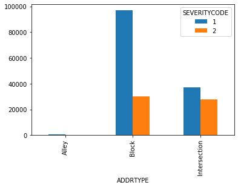
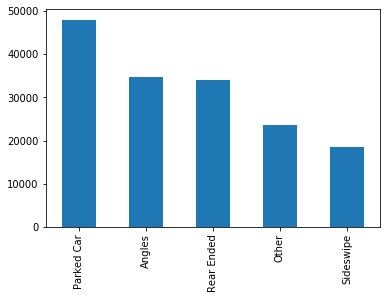
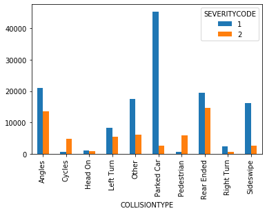
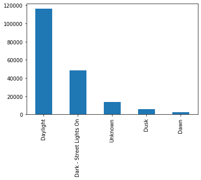
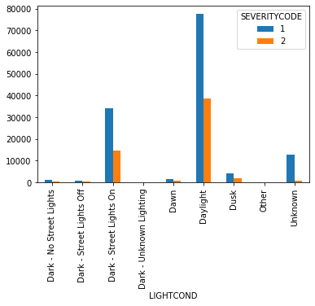
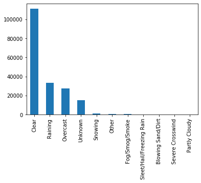
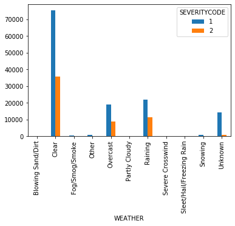

# Analysis Road Accident Severity in Seattle


### Data Science Professional Certificate capstone project by IBM/Coursera

## Table of contents
*(Click to go to a specific section)*
1. [Introduction: Business Problem](#introduction)
2. [Data](#data)
3. [Methodology](#methodology)<br>
    3.1 [Exploratory Data Analysis](#methodology)<br>
    3.2 [Data Cleaning](#cleaning)<br>
    3.3 [Predictive Modelling](#modelling)
4. [Results and Discussion](#results)
5. [Conclusion](#conclusion)


## 1. Introduction: Business Problem <a name="introduction"></a>

Approximately 1.35 million people die each year as a result of road traffic crashes. Between 20 and 50 million more people suffer non-fatal injuries, with many incurring a disability as a result of their injury. It is one of the major causes of premature deaths. They are many factors that influence the severity of a road accident whenever it occurs, including weather conditions, speed of the vehicle, condition of the road, etc.

The seaport city of Seattle is the largest city in the state of Washington, as well as the largest in the Pacific Northwest. As of the latest census, there were 713,700 people living in Seattle. Seattle residents get around by car, trolley, streetcar, public bus, bicycle, on foot, and by rail. With such bustling streets, it’s no surprise that Seattle sees car accidents every day.

 In order to reduce the severity of a road accident or prevent it altogether, there is a need to understand how the different factors affect the severity of a road accident. By understanding the relations between these factors, and developing a model that can predict the severity of a road accident with high accuracy, road users can use these predictions to adjust their driving or change their travels if possible, so that they can reduce the severity of the accidents or avoid it. This would greatly reduce the severity of accidents and some accidents will be avoided.
 
The audience of this project are the policy makers of Seattle and road users in general. By having these data, policy makers can make policies that reduces the number of road accidents and their fatality.


## 2. Data <a name="data"></a>

The data that is used in this project is provided by SPD and recorded by Traffic Records. The data is from the year 2004. The data set provided for this work allows the analysis of a record of 200,000 accidents in the state of Seattle. The target of the data is the severity of the accident. The data has different features that relate to the severity of the data like speed, number of vehicles involved, number of passengers, etc.

A data exploratory will be done on the data to understand the data and identify relationships. These relationships will be used in the creation of a machine learning model that will predict the severity of data using supervised classification algorithms.

This data will be split into training and testing data to be used to train the model and test for out of case accuracy.


## 3. Methodology <a name="methodology"></a>

### 3.1	Exploratory Data Analysis
In order to gain a deeper understanding of the data, let's do an exploratory data analysis. First, we import the libraries that we will need and read our csv file


```python
#Import the pandas library as pd.
#Import the Numpy library as np.
import pandas as pd
import numpy as np
```


```python
#read csv
df = pd.read_csv('https://s3.us.cloud-object-storage.appdomain.cloud/cf-courses-data/CognitiveClass/DP0701EN/version-2/Data-Collisions.csv')
#display all comuns
pd.options.display.max_columns = None

df.drop(['REPORTNO','OBJECTID', 'INCDATE', 'INCDTTM', 'COLDETKEY', 'INCKEY', 
         'STATUS', 'SEVERITYCODE.1',  'SEGLANEKEY', 'HITPARKEDCAR',
        'CROSSWALKKEY', 'EXCEPTRSNCODE', 'EXCEPTRSNDESC'], inplace=True, axis=1)
```

    /opt/conda/envs/Python36/lib/python3.6/site-packages/IPython/core/interactiveshell.py:3020: DtypeWarning: Columns (33) have mixed types. Specify dtype option on import or set low_memory=False.
      interactivity=interactivity, compiler=compiler, result=result)
    


```python
df.head()
```


<div>
<style scoped>
    .dataframe tbody tr th:only-of-type {
        vertical-align: middle;
    }

    .dataframe tbody tr th {
        vertical-align: top;
    }

    .dataframe thead th {
        text-align: right;
    }
</style>
<table border="1" class="dataframe">
  <thead>
    <tr style="text-align: right;">
      <th></th>
      <th>SEVERITYCODE</th>
      <th>X</th>
      <th>Y</th>
      <th>OBJECTID</th>
      <th>INCKEY</th>
      <th>COLDETKEY</th>
      <th>REPORTNO</th>
      <th>STATUS</th>
      <th>ADDRTYPE</th>
      <th>INTKEY</th>
      <th>LOCATION</th>
      <th>EXCEPTRSNCODE</th>
      <th>EXCEPTRSNDESC</th>
      <th>SEVERITYCODE.1</th>
      <th>SEVERITYDESC</th>
      <th>COLLISIONTYPE</th>
      <th>PERSONCOUNT</th>
      <th>PEDCOUNT</th>
      <th>PEDCYLCOUNT</th>
      <th>VEHCOUNT</th>
      <th>INCDATE</th>
      <th>INCDTTM</th>
      <th>JUNCTIONTYPE</th>
      <th>SDOT_COLCODE</th>
      <th>SDOT_COLDESC</th>
      <th>INATTENTIONIND</th>
      <th>UNDERINFL</th>
      <th>WEATHER</th>
      <th>ROADCOND</th>
      <th>LIGHTCOND</th>
      <th>PEDROWNOTGRNT</th>
      <th>SDOTCOLNUM</th>
      <th>SPEEDING</th>
      <th>ST_COLCODE</th>
      <th>ST_COLDESC</th>
      <th>SEGLANEKEY</th>
      <th>CROSSWALKKEY</th>
      <th>HITPARKEDCAR</th>
    </tr>
  </thead>
  <tbody>
    <tr>
      <th>0</th>
      <td>2</td>
      <td>-122.323148</td>
      <td>47.703140</td>
      <td>1</td>
      <td>1307</td>
      <td>1307</td>
      <td>3502005</td>
      <td>Matched</td>
      <td>Intersection</td>
      <td>37475.0</td>
      <td>5TH AVE NE AND NE 103RD ST</td>
      <td></td>
      <td>NaN</td>
      <td>2</td>
      <td>Injury Collision</td>
      <td>Angles</td>
      <td>2</td>
      <td>0</td>
      <td>0</td>
      <td>2</td>
      <td>2013/03/27 00:00:00+00</td>
      <td>3/27/2013 2:54:00 PM</td>
      <td>At Intersection (intersection related)</td>
      <td>11</td>
      <td>MOTOR VEHICLE STRUCK MOTOR VEHICLE, FRONT END ...</td>
      <td>NaN</td>
      <td>N</td>
      <td>Overcast</td>
      <td>Wet</td>
      <td>Daylight</td>
      <td>NaN</td>
      <td>NaN</td>
      <td>NaN</td>
      <td>10</td>
      <td>Entering at angle</td>
      <td>0</td>
      <td>0</td>
      <td>N</td>
    </tr>
    <tr>
      <th>1</th>
      <td>1</td>
      <td>-122.347294</td>
      <td>47.647172</td>
      <td>2</td>
      <td>52200</td>
      <td>52200</td>
      <td>2607959</td>
      <td>Matched</td>
      <td>Block</td>
      <td>NaN</td>
      <td>AURORA BR BETWEEN RAYE ST AND BRIDGE WAY N</td>
      <td>NaN</td>
      <td>NaN</td>
      <td>1</td>
      <td>Property Damage Only Collision</td>
      <td>Sideswipe</td>
      <td>2</td>
      <td>0</td>
      <td>0</td>
      <td>2</td>
      <td>2006/12/20 00:00:00+00</td>
      <td>12/20/2006 6:55:00 PM</td>
      <td>Mid-Block (not related to intersection)</td>
      <td>16</td>
      <td>MOTOR VEHICLE STRUCK MOTOR VEHICLE, LEFT SIDE ...</td>
      <td>NaN</td>
      <td>0</td>
      <td>Raining</td>
      <td>Wet</td>
      <td>Dark - Street Lights On</td>
      <td>NaN</td>
      <td>6354039.0</td>
      <td>NaN</td>
      <td>11</td>
      <td>From same direction - both going straight - bo...</td>
      <td>0</td>
      <td>0</td>
      <td>N</td>
    </tr>
    <tr>
      <th>2</th>
      <td>1</td>
      <td>-122.334540</td>
      <td>47.607871</td>
      <td>3</td>
      <td>26700</td>
      <td>26700</td>
      <td>1482393</td>
      <td>Matched</td>
      <td>Block</td>
      <td>NaN</td>
      <td>4TH AVE BETWEEN SENECA ST AND UNIVERSITY ST</td>
      <td>NaN</td>
      <td>NaN</td>
      <td>1</td>
      <td>Property Damage Only Collision</td>
      <td>Parked Car</td>
      <td>4</td>
      <td>0</td>
      <td>0</td>
      <td>3</td>
      <td>2004/11/18 00:00:00+00</td>
      <td>11/18/2004 10:20:00 AM</td>
      <td>Mid-Block (not related to intersection)</td>
      <td>14</td>
      <td>MOTOR VEHICLE STRUCK MOTOR VEHICLE, REAR END</td>
      <td>NaN</td>
      <td>0</td>
      <td>Overcast</td>
      <td>Dry</td>
      <td>Daylight</td>
      <td>NaN</td>
      <td>4323031.0</td>
      <td>NaN</td>
      <td>32</td>
      <td>One parked--one moving</td>
      <td>0</td>
      <td>0</td>
      <td>N</td>
    </tr>
    <tr>
      <th>3</th>
      <td>1</td>
      <td>-122.334803</td>
      <td>47.604803</td>
      <td>4</td>
      <td>1144</td>
      <td>1144</td>
      <td>3503937</td>
      <td>Matched</td>
      <td>Block</td>
      <td>NaN</td>
      <td>2ND AVE BETWEEN MARION ST AND MADISON ST</td>
      <td></td>
      <td>NaN</td>
      <td>1</td>
      <td>Property Damage Only Collision</td>
      <td>Other</td>
      <td>3</td>
      <td>0</td>
      <td>0</td>
      <td>3</td>
      <td>2013/03/29 00:00:00+00</td>
      <td>3/29/2013 9:26:00 AM</td>
      <td>Mid-Block (not related to intersection)</td>
      <td>11</td>
      <td>MOTOR VEHICLE STRUCK MOTOR VEHICLE, FRONT END ...</td>
      <td>NaN</td>
      <td>N</td>
      <td>Clear</td>
      <td>Dry</td>
      <td>Daylight</td>
      <td>NaN</td>
      <td>NaN</td>
      <td>NaN</td>
      <td>23</td>
      <td>From same direction - all others</td>
      <td>0</td>
      <td>0</td>
      <td>N</td>
    </tr>
    <tr>
      <th>4</th>
      <td>2</td>
      <td>-122.306426</td>
      <td>47.545739</td>
      <td>5</td>
      <td>17700</td>
      <td>17700</td>
      <td>1807429</td>
      <td>Matched</td>
      <td>Intersection</td>
      <td>34387.0</td>
      <td>SWIFT AVE S AND SWIFT AV OFF RP</td>
      <td>NaN</td>
      <td>NaN</td>
      <td>2</td>
      <td>Injury Collision</td>
      <td>Angles</td>
      <td>2</td>
      <td>0</td>
      <td>0</td>
      <td>2</td>
      <td>2004/01/28 00:00:00+00</td>
      <td>1/28/2004 8:04:00 AM</td>
      <td>At Intersection (intersection related)</td>
      <td>11</td>
      <td>MOTOR VEHICLE STRUCK MOTOR VEHICLE, FRONT END ...</td>
      <td>NaN</td>
      <td>0</td>
      <td>Raining</td>
      <td>Wet</td>
      <td>Daylight</td>
      <td>NaN</td>
      <td>4028032.0</td>
      <td>NaN</td>
      <td>10</td>
      <td>Entering at angle</td>
      <td>0</td>
      <td>0</td>
      <td>N</td>
    </tr>
  </tbody>
</table>
</div>


#### 3.1.1 General Descriptive Statistics


```python
df.describe(include = 'all')
```


<div>
<style scoped>
    .dataframe tbody tr th:only-of-type {
        vertical-align: middle;
    }

    .dataframe tbody tr th {
        vertical-align: top;
    }

    .dataframe thead th {
        text-align: right;
    }
</style>
<table border="1" class="dataframe">
  <thead>
    <tr style="text-align: right;">
      <th></th>
      <th>SEVERITYCODE</th>
      <th>X</th>
      <th>Y</th>
      <th>OBJECTID</th>
      <th>INCKEY</th>
      <th>COLDETKEY</th>
      <th>REPORTNO</th>
      <th>STATUS</th>
      <th>ADDRTYPE</th>
      <th>INTKEY</th>
      <th>LOCATION</th>
      <th>EXCEPTRSNCODE</th>
      <th>EXCEPTRSNDESC</th>
      <th>SEVERITYCODE.1</th>
      <th>SEVERITYDESC</th>
      <th>COLLISIONTYPE</th>
      <th>PERSONCOUNT</th>
      <th>PEDCOUNT</th>
      <th>PEDCYLCOUNT</th>
      <th>VEHCOUNT</th>
      <th>INCDATE</th>
      <th>INCDTTM</th>
      <th>JUNCTIONTYPE</th>
      <th>SDOT_COLCODE</th>
      <th>SDOT_COLDESC</th>
      <th>INATTENTIONIND</th>
      <th>UNDERINFL</th>
      <th>WEATHER</th>
      <th>ROADCOND</th>
      <th>LIGHTCOND</th>
      <th>PEDROWNOTGRNT</th>
      <th>SDOTCOLNUM</th>
      <th>SPEEDING</th>
      <th>ST_COLCODE</th>
      <th>ST_COLDESC</th>
      <th>SEGLANEKEY</th>
      <th>CROSSWALKKEY</th>
      <th>HITPARKEDCAR</th>
    </tr>
  </thead>
  <tbody>
    <tr>
      <th>count</th>
      <td>194673.000000</td>
      <td>189339.000000</td>
      <td>189339.000000</td>
      <td>194673.000000</td>
      <td>194673.000000</td>
      <td>194673.000000</td>
      <td>194673</td>
      <td>194673</td>
      <td>192747</td>
      <td>65070.000000</td>
      <td>191996</td>
      <td>84811</td>
      <td>5638</td>
      <td>194673.000000</td>
      <td>194673</td>
      <td>189769</td>
      <td>194673.000000</td>
      <td>194673.000000</td>
      <td>194673.000000</td>
      <td>194673.000000</td>
      <td>194673</td>
      <td>194673</td>
      <td>188344</td>
      <td>194673.000000</td>
      <td>194673</td>
      <td>29805</td>
      <td>189789</td>
      <td>189592</td>
      <td>189661</td>
      <td>189503</td>
      <td>4667</td>
      <td>1.149360e+05</td>
      <td>9333</td>
      <td>194655</td>
      <td>189769</td>
      <td>194673.000000</td>
      <td>1.946730e+05</td>
      <td>194673</td>
    </tr>
    <tr>
      <th>unique</th>
      <td>NaN</td>
      <td>NaN</td>
      <td>NaN</td>
      <td>NaN</td>
      <td>NaN</td>
      <td>NaN</td>
      <td>194670</td>
      <td>2</td>
      <td>3</td>
      <td>NaN</td>
      <td>24102</td>
      <td>2</td>
      <td>1</td>
      <td>NaN</td>
      <td>2</td>
      <td>10</td>
      <td>NaN</td>
      <td>NaN</td>
      <td>NaN</td>
      <td>NaN</td>
      <td>5985</td>
      <td>162058</td>
      <td>7</td>
      <td>NaN</td>
      <td>39</td>
      <td>1</td>
      <td>4</td>
      <td>11</td>
      <td>9</td>
      <td>9</td>
      <td>1</td>
      <td>NaN</td>
      <td>1</td>
      <td>115</td>
      <td>62</td>
      <td>NaN</td>
      <td>NaN</td>
      <td>2</td>
    </tr>
    <tr>
      <th>top</th>
      <td>NaN</td>
      <td>NaN</td>
      <td>NaN</td>
      <td>NaN</td>
      <td>NaN</td>
      <td>NaN</td>
      <td>1780512</td>
      <td>Matched</td>
      <td>Block</td>
      <td>NaN</td>
      <td>BATTERY ST TUNNEL NB BETWEEN ALASKAN WY VI NB ...</td>
      <td></td>
      <td>Not Enough Information, or Insufficient Locati...</td>
      <td>NaN</td>
      <td>Property Damage Only Collision</td>
      <td>Parked Car</td>
      <td>NaN</td>
      <td>NaN</td>
      <td>NaN</td>
      <td>NaN</td>
      <td>2006/11/02 00:00:00+00</td>
      <td>11/2/2006</td>
      <td>Mid-Block (not related to intersection)</td>
      <td>NaN</td>
      <td>MOTOR VEHICLE STRUCK MOTOR VEHICLE, FRONT END ...</td>
      <td>Y</td>
      <td>N</td>
      <td>Clear</td>
      <td>Dry</td>
      <td>Daylight</td>
      <td>Y</td>
      <td>NaN</td>
      <td>Y</td>
      <td>32</td>
      <td>One parked--one moving</td>
      <td>NaN</td>
      <td>NaN</td>
      <td>N</td>
    </tr>
    <tr>
      <th>freq</th>
      <td>NaN</td>
      <td>NaN</td>
      <td>NaN</td>
      <td>NaN</td>
      <td>NaN</td>
      <td>NaN</td>
      <td>2</td>
      <td>189786</td>
      <td>126926</td>
      <td>NaN</td>
      <td>276</td>
      <td>79173</td>
      <td>5638</td>
      <td>NaN</td>
      <td>136485</td>
      <td>47987</td>
      <td>NaN</td>
      <td>NaN</td>
      <td>NaN</td>
      <td>NaN</td>
      <td>96</td>
      <td>96</td>
      <td>89800</td>
      <td>NaN</td>
      <td>85209</td>
      <td>29805</td>
      <td>100274</td>
      <td>111135</td>
      <td>124510</td>
      <td>116137</td>
      <td>4667</td>
      <td>NaN</td>
      <td>9333</td>
      <td>27612</td>
      <td>44421</td>
      <td>NaN</td>
      <td>NaN</td>
      <td>187457</td>
    </tr>
    <tr>
      <th>mean</th>
      <td>1.298901</td>
      <td>-122.330518</td>
      <td>47.619543</td>
      <td>108479.364930</td>
      <td>141091.456350</td>
      <td>141298.811381</td>
      <td>NaN</td>
      <td>NaN</td>
      <td>NaN</td>
      <td>37558.450576</td>
      <td>NaN</td>
      <td>NaN</td>
      <td>NaN</td>
      <td>1.298901</td>
      <td>NaN</td>
      <td>NaN</td>
      <td>2.444427</td>
      <td>0.037139</td>
      <td>0.028391</td>
      <td>1.920780</td>
      <td>NaN</td>
      <td>NaN</td>
      <td>NaN</td>
      <td>13.867768</td>
      <td>NaN</td>
      <td>NaN</td>
      <td>NaN</td>
      <td>NaN</td>
      <td>NaN</td>
      <td>NaN</td>
      <td>NaN</td>
      <td>7.972521e+06</td>
      <td>NaN</td>
      <td>NaN</td>
      <td>NaN</td>
      <td>269.401114</td>
      <td>9.782452e+03</td>
      <td>NaN</td>
    </tr>
    <tr>
      <th>std</th>
      <td>0.457778</td>
      <td>0.029976</td>
      <td>0.056157</td>
      <td>62649.722558</td>
      <td>86634.402737</td>
      <td>86986.542110</td>
      <td>NaN</td>
      <td>NaN</td>
      <td>NaN</td>
      <td>51745.990273</td>
      <td>NaN</td>
      <td>NaN</td>
      <td>NaN</td>
      <td>0.457778</td>
      <td>NaN</td>
      <td>NaN</td>
      <td>1.345929</td>
      <td>0.198150</td>
      <td>0.167413</td>
      <td>0.631047</td>
      <td>NaN</td>
      <td>NaN</td>
      <td>NaN</td>
      <td>6.868755</td>
      <td>NaN</td>
      <td>NaN</td>
      <td>NaN</td>
      <td>NaN</td>
      <td>NaN</td>
      <td>NaN</td>
      <td>NaN</td>
      <td>2.553533e+06</td>
      <td>NaN</td>
      <td>NaN</td>
      <td>NaN</td>
      <td>3315.776055</td>
      <td>7.226926e+04</td>
      <td>NaN</td>
    </tr>
    <tr>
      <th>min</th>
      <td>1.000000</td>
      <td>-122.419091</td>
      <td>47.495573</td>
      <td>1.000000</td>
      <td>1001.000000</td>
      <td>1001.000000</td>
      <td>NaN</td>
      <td>NaN</td>
      <td>NaN</td>
      <td>23807.000000</td>
      <td>NaN</td>
      <td>NaN</td>
      <td>NaN</td>
      <td>1.000000</td>
      <td>NaN</td>
      <td>NaN</td>
      <td>0.000000</td>
      <td>0.000000</td>
      <td>0.000000</td>
      <td>0.000000</td>
      <td>NaN</td>
      <td>NaN</td>
      <td>NaN</td>
      <td>0.000000</td>
      <td>NaN</td>
      <td>NaN</td>
      <td>NaN</td>
      <td>NaN</td>
      <td>NaN</td>
      <td>NaN</td>
      <td>NaN</td>
      <td>1.007024e+06</td>
      <td>NaN</td>
      <td>NaN</td>
      <td>NaN</td>
      <td>0.000000</td>
      <td>0.000000e+00</td>
      <td>NaN</td>
    </tr>
    <tr>
      <th>25%</th>
      <td>1.000000</td>
      <td>-122.348673</td>
      <td>47.575956</td>
      <td>54267.000000</td>
      <td>70383.000000</td>
      <td>70383.000000</td>
      <td>NaN</td>
      <td>NaN</td>
      <td>NaN</td>
      <td>28667.000000</td>
      <td>NaN</td>
      <td>NaN</td>
      <td>NaN</td>
      <td>1.000000</td>
      <td>NaN</td>
      <td>NaN</td>
      <td>2.000000</td>
      <td>0.000000</td>
      <td>0.000000</td>
      <td>2.000000</td>
      <td>NaN</td>
      <td>NaN</td>
      <td>NaN</td>
      <td>11.000000</td>
      <td>NaN</td>
      <td>NaN</td>
      <td>NaN</td>
      <td>NaN</td>
      <td>NaN</td>
      <td>NaN</td>
      <td>NaN</td>
      <td>6.040015e+06</td>
      <td>NaN</td>
      <td>NaN</td>
      <td>NaN</td>
      <td>0.000000</td>
      <td>0.000000e+00</td>
      <td>NaN</td>
    </tr>
    <tr>
      <th>50%</th>
      <td>1.000000</td>
      <td>-122.330224</td>
      <td>47.615369</td>
      <td>106912.000000</td>
      <td>123363.000000</td>
      <td>123363.000000</td>
      <td>NaN</td>
      <td>NaN</td>
      <td>NaN</td>
      <td>29973.000000</td>
      <td>NaN</td>
      <td>NaN</td>
      <td>NaN</td>
      <td>1.000000</td>
      <td>NaN</td>
      <td>NaN</td>
      <td>2.000000</td>
      <td>0.000000</td>
      <td>0.000000</td>
      <td>2.000000</td>
      <td>NaN</td>
      <td>NaN</td>
      <td>NaN</td>
      <td>13.000000</td>
      <td>NaN</td>
      <td>NaN</td>
      <td>NaN</td>
      <td>NaN</td>
      <td>NaN</td>
      <td>NaN</td>
      <td>NaN</td>
      <td>8.023022e+06</td>
      <td>NaN</td>
      <td>NaN</td>
      <td>NaN</td>
      <td>0.000000</td>
      <td>0.000000e+00</td>
      <td>NaN</td>
    </tr>
    <tr>
      <th>75%</th>
      <td>2.000000</td>
      <td>-122.311937</td>
      <td>47.663664</td>
      <td>162272.000000</td>
      <td>203319.000000</td>
      <td>203459.000000</td>
      <td>NaN</td>
      <td>NaN</td>
      <td>NaN</td>
      <td>33973.000000</td>
      <td>NaN</td>
      <td>NaN</td>
      <td>NaN</td>
      <td>2.000000</td>
      <td>NaN</td>
      <td>NaN</td>
      <td>3.000000</td>
      <td>0.000000</td>
      <td>0.000000</td>
      <td>2.000000</td>
      <td>NaN</td>
      <td>NaN</td>
      <td>NaN</td>
      <td>14.000000</td>
      <td>NaN</td>
      <td>NaN</td>
      <td>NaN</td>
      <td>NaN</td>
      <td>NaN</td>
      <td>NaN</td>
      <td>NaN</td>
      <td>1.015501e+07</td>
      <td>NaN</td>
      <td>NaN</td>
      <td>NaN</td>
      <td>0.000000</td>
      <td>0.000000e+00</td>
      <td>NaN</td>
    </tr>
    <tr>
      <th>max</th>
      <td>2.000000</td>
      <td>-122.238949</td>
      <td>47.734142</td>
      <td>219547.000000</td>
      <td>331454.000000</td>
      <td>332954.000000</td>
      <td>NaN</td>
      <td>NaN</td>
      <td>NaN</td>
      <td>757580.000000</td>
      <td>NaN</td>
      <td>NaN</td>
      <td>NaN</td>
      <td>2.000000</td>
      <td>NaN</td>
      <td>NaN</td>
      <td>81.000000</td>
      <td>6.000000</td>
      <td>2.000000</td>
      <td>12.000000</td>
      <td>NaN</td>
      <td>NaN</td>
      <td>NaN</td>
      <td>69.000000</td>
      <td>NaN</td>
      <td>NaN</td>
      <td>NaN</td>
      <td>NaN</td>
      <td>NaN</td>
      <td>NaN</td>
      <td>NaN</td>
      <td>1.307202e+07</td>
      <td>NaN</td>
      <td>NaN</td>
      <td>NaN</td>
      <td>525241.000000</td>
      <td>5.239700e+06</td>
      <td>NaN</td>
    </tr>
  </tbody>
</table>
</div>


#### 3.1.2 Variables and their Relationships

##### a)Relationship between ADDRTYPE and Severity of accidents


```python
df2 = df.groupby(["ADDRTYPE", "SEVERITYCODE"]).size().reset_index(name='Count')
df3 = pd.pivot_table(df2,  values='Count',  columns=['SEVERITYCODE'],  index = "ADDRTYPE",
                         aggfunc=np.sum,  fill_value=0)
df3.plot(kind="bar")
```


    <matplotlib.axes._subplots.AxesSubplot at 0x2359abb2588>





##### b) COLLISIONTYPE


```python
df['COLLISIONTYPE'].value_counts().head().plot(kind='bar')
```


    <matplotlib.axes._subplots.AxesSubplot at 0x16505292cc8>





###### Relationship


```python
df2 = df.groupby(["COLLISIONTYPE", "SEVERITYCODE"]).size().reset_index(name='Count')
df3 = pd.pivot_table(df2,  values='Count',  columns=['SEVERITYCODE'],  index = "COLLISIONTYPE",
                         aggfunc=np.sum,  fill_value=0)
df3.plot(kind="bar")
```


    <matplotlib.axes._subplots.AxesSubplot at 0x2359e4517c8>





#### c) Lighting conditions


```python
df['LIGHTCOND'].value_counts().head().plot(kind='bar')
```


    <matplotlib.axes._subplots.AxesSubplot at 0x16575ee0d88>





###### Relationship


```python
df2 = df.groupby(["LIGHTCOND", "SEVERITYCODE"]).size().reset_index(name='Count')
df3 = pd.pivot_table(df2,  values='Count',  columns=['SEVERITYCODE'],  index = "LIGHTCOND",
                         aggfunc=np.sum,  fill_value=0)
df3.plot(kind="bar")
```


    <matplotlib.axes._subplots.AxesSubplot at 0x2359e4ed048>





d) Weather Conditions


```python
df['WEATHER'].value_counts().plot(kind='bar')
```


    <matplotlib.axes._subplots.AxesSubplot at 0x2359e4e4a08>





###### Relationship


```python
df2 = df.groupby(["WEATHER", "SEVERITYCODE"]).size().reset_index(name='Count')
df3 = pd.pivot_table(df2,  values='Count',  columns=['SEVERITYCODE'],  index = "WEATHER",
                         aggfunc=np.sum,  fill_value=0)
df3.plot(kind="bar")
```


    <matplotlib.axes._subplots.AxesSubplot at 0x2359e62e108>





#### e) Other Exploratory Data Analysis


```python
df['LOCATION'].value_counts()
```


    BATTERY ST TUNNEL NB BETWEEN ALASKAN WY VI NB AND AURORA AVE N    276
    BATTERY ST TUNNEL SB BETWEEN AURORA AVE N AND ALASKAN WY VI SB    271
    N NORTHGATE WAY BETWEEN MERIDIAN AVE N AND CORLISS AVE N          265
    AURORA AVE N BETWEEN N 117TH PL AND N 125TH ST                    254
    6TH AVE AND JAMES ST                                              252
                                                                     ... 
    CONDON WAY W BETWEEN W BOSTON ST AND W MCGRAW ST                    1
    27TH AVE W AND W HALLADAY ST                                        1
    47TH AVE SW AND SW 98TH ST                                          1
    15TH AVE E AND E PROSPECT S ST                                      1
    WHITMAN AVE N BETWEEN N 107TH ST AND N 109TH ST                     1
    Name: LOCATION, Length: 24102, dtype: int64


```python
df['LOCATION'].value_counts()
```


    Parked Car    47987
    Angles        34674
    Rear Ended    34090
    Other         23703
    Sideswipe     18609
    Left Turn     13703
    Pedestrian     6608
    Cycles         5415
    Right Turn     2956
    Head On        2024
    Name: COLLISIONTYPE, dtype: int64


```python
df['INTKEY'].value_counts()
```


    29973.0    252
    29933.0    160
    29913.0    138
    29549.0    136
    33512.0    128
              ... 
    36825.0      1
    26604.0      1
    26603.0      1
    36816.0      1
    27793.0      1
    Name: INTKEY, Length: 7614, dtype: int64


```python
df['JUNCTIONTYPE'].value_counts()
```


    Mid-Block (not related to intersection)              89800
    At Intersection (intersection related)               62810
    Mid-Block (but intersection related)                 22790
    Driveway Junction                                    10671
    At Intersection (but not related to intersection)     2098
    Ramp Junction                                          166
    Unknown                                                  9
    Name: JUNCTIONTYPE, dtype: int64


```python
df.dtypes
```


    SEVERITYCODE        int64
    X                 float64
    Y                 float64
    ADDRTYPE           object
    INTKEY            float64
    SEVERITYDESC       object
    COLLISIONTYPE      object
    PERSONCOUNT         int64
    PEDCOUNT            int64
    PEDCYLCOUNT         int64
    VEHCOUNT            int64
    JUNCTIONTYPE       object
    INATTENTIONIND      int32
    UNDERINFL           int32
    WEATHER            object
    ROADCOND           object
    LIGHTCOND          object
    PEDROWNOTGRNT       int32
    SPEEDING            int32
    dtype: object


```python
df.shape
```


    (194673, 20)


```python
df.corr()
```


<div>
<style scoped>
    .dataframe tbody tr th:only-of-type {
        vertical-align: middle;
    }

    .dataframe tbody tr th {
        vertical-align: top;
    }

    .dataframe thead th {
        text-align: right;
    }
</style>
<table border="1" class="dataframe">
  <thead>
    <tr style="text-align: right;">
      <th></th>
      <th>SEVERITYCODE</th>
      <th>X</th>
      <th>Y</th>
      <th>INTKEY</th>
      <th>PERSONCOUNT</th>
      <th>PEDCOUNT</th>
      <th>PEDCYLCOUNT</th>
      <th>VEHCOUNT</th>
      <th>INATTENTIONIND</th>
      <th>UNDERINFL</th>
      <th>PEDROWNOTGRNT</th>
      <th>SPEEDING</th>
    </tr>
  </thead>
  <tbody>
    <tr>
      <th>SEVERITYCODE</th>
      <td>1.000000</td>
      <td>0.010309</td>
      <td>0.017737</td>
      <td>0.006553</td>
      <td>0.130949</td>
      <td>0.246338</td>
      <td>0.214218</td>
      <td>-0.054686</td>
      <td>0.046378</td>
      <td>0.044377</td>
      <td>0.206283</td>
      <td>0.038938</td>
    </tr>
    <tr>
      <th>X</th>
      <td>0.010309</td>
      <td>1.000000</td>
      <td>-0.160262</td>
      <td>0.120754</td>
      <td>0.012887</td>
      <td>0.011304</td>
      <td>-0.001752</td>
      <td>-0.012168</td>
      <td>-0.015330</td>
      <td>-0.031117</td>
      <td>0.008382</td>
      <td>-0.008163</td>
    </tr>
    <tr>
      <th>Y</th>
      <td>0.017737</td>
      <td>-0.160262</td>
      <td>1.000000</td>
      <td>-0.114935</td>
      <td>-0.013850</td>
      <td>0.010178</td>
      <td>0.026304</td>
      <td>0.017058</td>
      <td>0.008767</td>
      <td>-0.006764</td>
      <td>0.022004</td>
      <td>-0.026607</td>
    </tr>
    <tr>
      <th>INTKEY</th>
      <td>0.006553</td>
      <td>0.120754</td>
      <td>-0.114935</td>
      <td>1.000000</td>
      <td>0.001886</td>
      <td>-0.004784</td>
      <td>0.000531</td>
      <td>-0.012929</td>
      <td>0.003045</td>
      <td>-0.001458</td>
      <td>-0.013612</td>
      <td>0.002937</td>
    </tr>
    <tr>
      <th>PERSONCOUNT</th>
      <td>0.130949</td>
      <td>0.012887</td>
      <td>-0.013850</td>
      <td>0.001886</td>
      <td>1.000000</td>
      <td>-0.023464</td>
      <td>-0.038809</td>
      <td>0.380523</td>
      <td>0.077435</td>
      <td>0.022420</td>
      <td>-0.027449</td>
      <td>-0.002963</td>
    </tr>
    <tr>
      <th>PEDCOUNT</th>
      <td>0.246338</td>
      <td>0.011304</td>
      <td>0.010178</td>
      <td>-0.004784</td>
      <td>-0.023464</td>
      <td>1.000000</td>
      <td>-0.016920</td>
      <td>-0.261285</td>
      <td>-0.004315</td>
      <td>0.016592</td>
      <td>0.494641</td>
      <td>-0.032838</td>
    </tr>
    <tr>
      <th>PEDCYLCOUNT</th>
      <td>0.214218</td>
      <td>-0.001752</td>
      <td>0.026304</td>
      <td>0.000531</td>
      <td>-0.038809</td>
      <td>-0.016920</td>
      <td>1.000000</td>
      <td>-0.253773</td>
      <td>0.004073</td>
      <td>-0.016401</td>
      <td>0.323652</td>
      <td>-0.020391</td>
    </tr>
    <tr>
      <th>VEHCOUNT</th>
      <td>-0.054686</td>
      <td>-0.012168</td>
      <td>0.017058</td>
      <td>-0.012929</td>
      <td>0.380523</td>
      <td>-0.261285</td>
      <td>-0.253773</td>
      <td>1.000000</td>
      <td>0.076277</td>
      <td>0.006609</td>
      <td>-0.227990</td>
      <td>-0.025743</td>
    </tr>
    <tr>
      <th>INATTENTIONIND</th>
      <td>0.046378</td>
      <td>-0.015330</td>
      <td>0.008767</td>
      <td>0.003045</td>
      <td>0.077435</td>
      <td>-0.004315</td>
      <td>0.004073</td>
      <td>0.076277</td>
      <td>1.000000</td>
      <td>-0.025953</td>
      <td>-0.026442</td>
      <td>-0.048805</td>
    </tr>
    <tr>
      <th>UNDERINFL</th>
      <td>0.044377</td>
      <td>-0.031117</td>
      <td>-0.006764</td>
      <td>-0.001458</td>
      <td>0.022420</td>
      <td>0.016592</td>
      <td>-0.016401</td>
      <td>0.006609</td>
      <td>-0.025953</td>
      <td>1.000000</td>
      <td>-0.017585</td>
      <td>0.092356</td>
    </tr>
    <tr>
      <th>PEDROWNOTGRNT</th>
      <td>0.206283</td>
      <td>0.008382</td>
      <td>0.022004</td>
      <td>-0.013612</td>
      <td>-0.027449</td>
      <td>0.494641</td>
      <td>0.323652</td>
      <td>-0.227990</td>
      <td>-0.026442</td>
      <td>-0.017585</td>
      <td>1.000000</td>
      <td>-0.028410</td>
    </tr>
    <tr>
      <th>SPEEDING</th>
      <td>0.038938</td>
      <td>-0.008163</td>
      <td>-0.026607</td>
      <td>0.002937</td>
      <td>-0.002963</td>
      <td>-0.032838</td>
      <td>-0.020391</td>
      <td>-0.025743</td>
      <td>-0.048805</td>
      <td>0.092356</td>
      <td>-0.028410</td>
      <td>1.000000</td>
    </tr>
  </tbody>
</table>
</div>


```python
df['PEDROWNOTGRNT'].value_counts()
```


    1.0    4667
    Name: PEDROWNOTGRNT, dtype: int64


Let's do some vizualizations


```python
import matplotlib.pyplot as plt
import seaborn as sns
%matplotlib inline 
```


```python
df[['ST_COLDESC', 'SEVERITYCODE']].groupby(['ST_COLDESC','SEVERITYCODE']).count()
```


<div>
<style scoped>
    .dataframe tbody tr th:only-of-type {
        vertical-align: middle;
    }

    .dataframe tbody tr th {
        vertical-align: top;
    }

    .dataframe thead th {
        text-align: right;
    }
</style>
<table border="1" class="dataframe">
  <thead>
    <tr style="text-align: right;">
      <th></th>
      <th></th>
    </tr>
    <tr>
      <th>ST_COLDESC</th>
      <th>SEVERITYCODE</th>
    </tr>
  </thead>
  <tbody>
    <tr>
      <th rowspan="2" valign="top">All Other Multi Vehicle</th>
      <th>1</th>
    </tr>
    <tr>
      <th>2</th>
    </tr>
    <tr>
      <th rowspan="2" valign="top">All other non-collision</th>
      <th>1</th>
    </tr>
    <tr>
      <th>2</th>
    </tr>
    <tr>
      <th>Breakage of any part of the vehicle resulting in injury or in further property damage</th>
      <th>1</th>
    </tr>
    <tr>
      <th>...</th>
      <th>...</th>
    </tr>
    <tr>
      <th>Vehicle overturned</th>
      <th>2</th>
    </tr>
    <tr>
      <th rowspan="2" valign="top">Vehicle turning left hits pedestrian</th>
      <th>1</th>
    </tr>
    <tr>
      <th>2</th>
    </tr>
    <tr>
      <th rowspan="2" valign="top">Vehicle turning right hits pedestrian</th>
      <th>1</th>
    </tr>
    <tr>
      <th>2</th>
    </tr>
  </tbody>
</table>
<p>117 rows × 0 columns</p>
</div>


```python
df[['INATTENTIONIND', 'SEVERITYCODE', 'JUNCTIONTYPE']].groupby(['SEVERITYCODE', 'JUNCTIONTYPE']).count()
```


<div>
<style scoped>
    .dataframe tbody tr th:only-of-type {
        vertical-align: middle;
    }

    .dataframe tbody tr th {
        vertical-align: top;
    }

    .dataframe thead th {
        text-align: right;
    }
</style>
<table border="1" class="dataframe">
  <thead>
    <tr style="text-align: right;">
      <th></th>
      <th></th>
      <th>INATTENTIONIND</th>
    </tr>
    <tr>
      <th>SEVERITYCODE</th>
      <th>JUNCTIONTYPE</th>
      <th></th>
    </tr>
  </thead>
  <tbody>
    <tr>
      <th rowspan="7" valign="top">1</th>
      <th>At Intersection (but not related to intersection)</th>
      <td>258</td>
    </tr>
    <tr>
      <th>At Intersection (intersection related)</th>
      <td>3916</td>
    </tr>
    <tr>
      <th>Driveway Junction</th>
      <td>997</td>
    </tr>
    <tr>
      <th>Mid-Block (but intersection related)</th>
      <td>3211</td>
    </tr>
    <tr>
      <th>Mid-Block (not related to intersection)</th>
      <td>10560</td>
    </tr>
    <tr>
      <th>Ramp Junction</th>
      <td>29</td>
    </tr>
    <tr>
      <th>Unknown</th>
      <td>0</td>
    </tr>
    <tr>
      <th rowspan="7" valign="top">2</th>
      <th>At Intersection (but not related to intersection)</th>
      <td>168</td>
    </tr>
    <tr>
      <th>At Intersection (intersection related)</th>
      <td>3138</td>
    </tr>
    <tr>
      <th>Driveway Junction</th>
      <td>486</td>
    </tr>
    <tr>
      <th>Mid-Block (but intersection related)</th>
      <td>2110</td>
    </tr>
    <tr>
      <th>Mid-Block (not related to intersection)</th>
      <td>4427</td>
    </tr>
    <tr>
      <th>Ramp Junction</th>
      <td>15</td>
    </tr>
    <tr>
      <th>Unknown</th>
      <td>0</td>
    </tr>
  </tbody>
</table>
</div>


```python
df[['INATTENTIONIND', 'SEVERITYCODE', 'JUNCTIONTYPE']].groupby(['SEVERITYCODE', 'JUNCTIONTYPE']).count()
```


<div>
<style scoped>
    .dataframe tbody tr th:only-of-type {
        vertical-align: middle;
    }

    .dataframe tbody tr th {
        vertical-align: top;
    }

    .dataframe thead th {
        text-align: right;
    }
</style>
<table border="1" class="dataframe">
  <thead>
    <tr style="text-align: right;">
      <th></th>
      <th></th>
      <th>PEDROWNOTGRNT</th>
    </tr>
    <tr>
      <th>SEVERITYCODE</th>
      <th>JUNCTIONTYPE</th>
      <th></th>
    </tr>
  </thead>
  <tbody>
    <tr>
      <th rowspan="7" valign="top">1</th>
      <th>At Intersection (but not related to intersection)</th>
      <td>3</td>
    </tr>
    <tr>
      <th>At Intersection (intersection related)</th>
      <td>353</td>
    </tr>
    <tr>
      <th>Driveway Junction</th>
      <td>38</td>
    </tr>
    <tr>
      <th>Mid-Block (but intersection related)</th>
      <td>9</td>
    </tr>
    <tr>
      <th>Mid-Block (not related to intersection)</th>
      <td>53</td>
    </tr>
    <tr>
      <th>Ramp Junction</th>
      <td>0</td>
    </tr>
    <tr>
      <th>Unknown</th>
      <td>0</td>
    </tr>
    <tr>
      <th rowspan="7" valign="top">2</th>
      <th>At Intersection (but not related to intersection)</th>
      <td>14</td>
    </tr>
    <tr>
      <th>At Intersection (intersection related)</th>
      <td>3385</td>
    </tr>
    <tr>
      <th>Driveway Junction</th>
      <td>324</td>
    </tr>
    <tr>
      <th>Mid-Block (but intersection related)</th>
      <td>74</td>
    </tr>
    <tr>
      <th>Mid-Block (not related to intersection)</th>
      <td>400</td>
    </tr>
    <tr>
      <th>Ramp Junction</th>
      <td>0</td>
    </tr>
    <tr>
      <th>Unknown</th>
      <td>0</td>
    </tr>
  </tbody>
</table>
</div>


#### Visualization of the Accident Locations

Let's install and import Folium library that we can use to visualize the accidents in a map.


```python
!conda install -c conda-forge folium=0.5.0 --yes
import folium

print('Folium installed and imported!')
```

    Collecting package metadata (current_repodata.json): ...working... done
    Solving environment: ...working... failed with initial frozen solve. Retrying with flexible solve.
    Collecting package metadata (repodata.json): ...working... done
    Solving environment: ...working... done
    
    ## Package Plan ##
    
      environment location: C:\ProgramData\Anaconda3
    
      added / updated specs:
        - folium=0.5.0
    
    
    The following NEW packages will be INSTALLED:
    
      altair             conda-forge/noarch::altair-4.1.0-py_1
      branca             conda-forge/noarch::branca-0.4.1-py_0
      folium             conda-forge/noarch::folium-0.5.0-py_0
      python_abi         conda-forge/win-64::python_abi-3.7-1_cp37m
      vincent            conda-forge/noarch::vincent-0.4.4-py_1
    
    The following packages will be UPDATED:
    
      conda                       pkgs/main::conda-4.8.2-py37_0 --> conda-forge::conda-4.8.5-py37hc8dfbb8_1
    
    The following packages will be SUPERSEDED by a higher-priority channel:
    
      certifi                                         pkgs/main --> conda-forge
    
    
    Preparing transaction: ...working... done
    Verifying transaction: ...working... done
    Executing transaction: ...working... done
    

    
    
    ==> WARNING: A newer version of conda exists. <==
      current version: 4.8.2
      latest version: 4.8.5
    
    Please update conda by running
    
        $ conda update -n base -c defaults conda
    
    
    

    Folium installed and imported!
    


```python
# Seattle latitude and longitude values
latitude = 47.6062
longitude = -122.3321

# create map and display it
smap = folium.Map(location=[latitude, longitude], zoom_start=11)
```


```python
#sample 1000 records
# get the first 100 crimes in the df_incidents dataframe
limit = 1000
map_sample = df.iloc[0:limit, :]

#remove cols with null values
mapY = map_sample['Y'].dropna()
mapX = map_sample['X'].dropna()
mapY.isnull().value_counts()
```


    False    968
    Name: Y, dtype: int64


```python
# instantiate a feature group for the incidents in the dataframe
incidents = folium.map.FeatureGroup()

# loop through the accidents and add each to the incidents feature group
for lat, lng, in zip(mapY, mapX):
    incidents.add_child(
        folium.features.CircleMarker(
            [lat, lng],
            radius=3, # define how big you want the circle markers to be
            color='yellow',
            fill=True,
            fill_color='blue',
            fill_opacity=0.6
        )
    )

# add incidents to map
smap.add_child(incidents)
```


<div style="width:100%;"><div style="position:relative;width:100%;height:0;padding-bottom:60%;"><span style="color:#565656">Make this Notebook Trusted to load map: File -> Trust Notebook</span><iframe src="about:blank" style="position:absolute;width:100%;height:100%;left:0;top:0;border:none !important;" data-html=PCFET0NUWVBFIGh0bWw+CjxoZWFkPiAgICAKICAgIDxtZXRhIGh0dHAtZXF1aXY9ImNvbnRlbnQtdHlwZSIgY29udGVudD0idGV4dC9odG1sOyBjaGFyc2V0PVVURi04IiAvPgogICAgPHNjcmlwdD5MX1BSRUZFUl9DQU5WQVMgPSBmYWxzZTsgTF9OT19UT1VDSCA9IGZhbHNlOyBMX0RJU0FCTEVfM0QgPSBmYWxzZTs8L3NjcmlwdD4KICAgIDxzY3JpcHQgc3JjPSJodHRwczovL2Nkbi5qc2RlbGl2ci5uZXQvbnBtL2xlYWZsZXRAMS4yLjAvZGlzdC9sZWFmbGV0LmpzIj48L3NjcmlwdD4KICAgIDxzY3JpcHQgc3JjPSJodHRwczovL2FqYXguZ29vZ2xlYXBpcy5jb20vYWpheC9saWJzL2pxdWVyeS8xLjExLjEvanF1ZXJ5Lm1pbi5qcyI+PC9zY3JpcHQ+CiAgICA8c2NyaXB0IHNyYz0iaHR0cHM6Ly9tYXhjZG4uYm9vdHN0cmFwY2RuLmNvbS9ib290c3RyYXAvMy4yLjAvanMvYm9vdHN0cmFwLm1pbi5qcyI+PC9zY3JpcHQ+CiAgICA8c2NyaXB0IHNyYz0iaHR0cHM6Ly9jZG5qcy5jbG91ZGZsYXJlLmNvbS9hamF4L2xpYnMvTGVhZmxldC5hd2Vzb21lLW1hcmtlcnMvMi4wLjIvbGVhZmxldC5hd2Vzb21lLW1hcmtlcnMuanMiPjwvc2NyaXB0PgogICAgPGxpbmsgcmVsPSJzdHlsZXNoZWV0IiBocmVmPSJodHRwczovL2Nkbi5qc2RlbGl2ci5uZXQvbnBtL2xlYWZsZXRAMS4yLjAvZGlzdC9sZWFmbGV0LmNzcyIvPgogICAgPGxpbmsgcmVsPSJzdHlsZXNoZWV0IiBocmVmPSJodHRwczovL21heGNkbi5ib290c3RyYXBjZG4uY29tL2Jvb3RzdHJhcC8zLjIuMC9jc3MvYm9vdHN0cmFwLm1pbi5jc3MiLz4KICAgIDxsaW5rIHJlbD0ic3R5bGVzaGVldCIgaHJlZj0iaHR0cHM6Ly9tYXhjZG4uYm9vdHN0cmFwY2RuLmNvbS9ib290c3RyYXAvMy4yLjAvY3NzL2Jvb3RzdHJhcC10aGVtZS5taW4uY3NzIi8+CiAgICA8bGluayByZWw9InN0eWxlc2hlZXQiIGhyZWY9Imh0dHBzOi8vbWF4Y2RuLmJvb3RzdHJhcGNkbi5jb20vZm9udC1hd2Vzb21lLzQuNi4zL2Nzcy9mb250LWF3ZXNvbWUubWluLmNzcyIvPgogICAgPGxpbmsgcmVsPSJzdHlsZXNoZWV0IiBocmVmPSJodHRwczovL2NkbmpzLmNsb3VkZmxhcmUuY29tL2FqYXgvbGlicy9MZWFmbGV0LmF3ZXNvbWUtbWFya2Vycy8yLjAuMi9sZWFmbGV0LmF3ZXNvbWUtbWFya2Vycy5jc3MiLz4KICAgIDxsaW5rIHJlbD0ic3R5bGVzaGVldCIgaHJlZj0iaHR0cHM6Ly9yYXdnaXQuY29tL3B5dGhvbi12aXN1YWxpemF0aW9uL2ZvbGl1bS9tYXN0ZXIvZm9saXVtL3RlbXBsYXRlcy9sZWFmbGV0LmF3ZXNvbWUucm90YXRlLmNzcyIvPgogICAgPHN0eWxlPmh0bWwsIGJvZHkge3dpZHRoOiAxMDAlO2hlaWdodDogMTAwJTttYXJnaW46IDA7cGFkZGluZzogMDt9PC9zdHlsZT4KICAgIDxzdHlsZT4jbWFwIHtwb3NpdGlvbjphYnNvbHV0ZTt0b3A6MDtib3R0b206MDtyaWdodDowO2xlZnQ6MDt9PC9zdHlsZT4KICAgIAogICAgICAgICAgICA8c3R5bGU+ICNtYXBfODk2ZmJjNGQxNWM0NDViOGIzZGRmMjI2NTc2NjEzZTYgewogICAgICAgICAgICAgICAgcG9zaXRpb24gOiByZWxhdGl2ZTsKICAgICAgICAgICAgICAgIHdpZHRoIDogMTAwLjAlOwogICAgICAgICAgICAgICAgaGVpZ2h0OiAxMDAuMCU7CiAgICAgICAgICAgICAgICBsZWZ0OiAwLjAlOwogICAgICAgICAgICAgICAgdG9wOiAwLjAlOwogICAgICAgICAgICAgICAgfQogICAgICAgICAgICA8L3N0eWxlPgogICAgICAgIAo8L2hlYWQ+Cjxib2R5PiAgICAKICAgIAogICAgICAgICAgICA8ZGl2IGNsYXNzPSJmb2xpdW0tbWFwIiBpZD0ibWFwXzg5NmZiYzRkMTVjNDQ1YjhiM2RkZjIyNjU3NjYxM2U2IiA+PC9kaXY+CiAgICAgICAgCjwvYm9keT4KPHNjcmlwdD4gICAgCiAgICAKCiAgICAgICAgICAgIAogICAgICAgICAgICAgICAgdmFyIGJvdW5kcyA9IG51bGw7CiAgICAgICAgICAgIAoKICAgICAgICAgICAgdmFyIG1hcF84OTZmYmM0ZDE1YzQ0NWI4YjNkZGYyMjY1NzY2MTNlNiA9IEwubWFwKAogICAgICAgICAgICAgICAgICAgICAgICAgICAgICAgICAgJ21hcF84OTZmYmM0ZDE1YzQ0NWI4YjNkZGYyMjY1NzY2MTNlNicsCiAgICAgICAgICAgICAgICAgICAgICAgICAgICAgICAgICB7Y2VudGVyOiBbNDcuNjA2MiwtMTIyLjMzMjFdLAogICAgICAgICAgICAgICAgICAgICAgICAgICAgICAgICAgem9vbTogMTEsCiAgICAgICAgICAgICAgICAgICAgICAgICAgICAgICAgICBtYXhCb3VuZHM6IGJvdW5kcywKICAgICAgICAgICAgICAgICAgICAgICAgICAgICAgICAgIGxheWVyczogW10sCiAgICAgICAgICAgICAgICAgICAgICAgICAgICAgICAgICB3b3JsZENvcHlKdW1wOiBmYWxzZSwKICAgICAgICAgICAgICAgICAgICAgICAgICAgICAgICAgIGNyczogTC5DUlMuRVBTRzM4NTcKICAgICAgICAgICAgICAgICAgICAgICAgICAgICAgICAgfSk7CiAgICAgICAgICAgIAogICAgICAgIAogICAgCiAgICAgICAgICAgIHZhciB0aWxlX2xheWVyX2NjOGJlYzlmODcxZDQ1MzBhMTIzNjgyYjAxZWI0YzFmID0gTC50aWxlTGF5ZXIoCiAgICAgICAgICAgICAgICAnaHR0cHM6Ly97c30udGlsZS5vcGVuc3RyZWV0bWFwLm9yZy97en0ve3h9L3t5fS5wbmcnLAogICAgICAgICAgICAgICAgewogICJhdHRyaWJ1dGlvbiI6IG51bGwsCiAgImRldGVjdFJldGluYSI6IGZhbHNlLAogICJtYXhab29tIjogMTgsCiAgIm1pblpvb20iOiAxLAogICJub1dyYXAiOiBmYWxzZSwKICAic3ViZG9tYWlucyI6ICJhYmMiCn0KICAgICAgICAgICAgICAgICkuYWRkVG8obWFwXzg5NmZiYzRkMTVjNDQ1YjhiM2RkZjIyNjU3NjYxM2U2KTsKICAgICAgICAKICAgIAogICAgICAgICAgICB2YXIgZmVhdHVyZV9ncm91cF84MGVhYTJjZjE5OTA0YTc0OWVkNWI2ZThlMzE5YTcwYyA9IEwuZmVhdHVyZUdyb3VwKAogICAgICAgICAgICAgICAgKS5hZGRUbyhtYXBfODk2ZmJjNGQxNWM0NDViOGIzZGRmMjI2NTc2NjEzZTYpOwogICAgICAgIAogICAgCiAgICAgICAgICAgIHZhciBjaXJjbGVfbWFya2VyXzA4NWFiOGE1YmI4ZTQxMGRhYWFiNmEyMWM0MWMwZDgzID0gTC5jaXJjbGVNYXJrZXIoCiAgICAgICAgICAgICAgICBbNDcuNzAzMTQwMzIsLTEyMi4zMjMxNDg0MDAwMDAwMl0sCiAgICAgICAgICAgICAgICB7CiAgImJ1YmJsaW5nTW91c2VFdmVudHMiOiB0cnVlLAogICJjb2xvciI6ICJ5ZWxsb3ciLAogICJkYXNoQXJyYXkiOiBudWxsLAogICJkYXNoT2Zmc2V0IjogbnVsbCwKICAiZmlsbCI6IHRydWUsCiAgImZpbGxDb2xvciI6ICJibHVlIiwKICAiZmlsbE9wYWNpdHkiOiAwLjYsCiAgImZpbGxSdWxlIjogImV2ZW5vZGQiLAogICJsaW5lQ2FwIjogInJvdW5kIiwKICAibGluZUpvaW4iOiAicm91bmQiLAogICJvcGFjaXR5IjogMS4wLAogICJyYWRpdXMiOiAzLAogICJzdHJva2UiOiB0cnVlLAogICJ3ZWlnaHQiOiAzCn0KICAgICAgICAgICAgICAgICkuYWRkVG8oZmVhdHVyZV9ncm91cF84MGVhYTJjZjE5OTA0YTc0OWVkNWI2ZThlMzE5YTcwYyk7CiAgICAgICAgICAgIAogICAgCiAgICAgICAgICAgIHZhciBjaXJjbGVfbWFya2VyX2Q2NTUwZmU2N2ExMzRjNGE5YTQ3MTIxYzEwMjgwYmUxID0gTC5jaXJjbGVNYXJrZXIoCiAgICAgICAgICAgICAgICBbNDcuNjQ3MTcyNDksLTEyMi4zNDcyOTQzXSwKICAgICAgICAgICAgICAgIHsKICAiYnViYmxpbmdNb3VzZUV2ZW50cyI6IHRydWUsCiAgImNvbG9yIjogInllbGxvdyIsCiAgImRhc2hBcnJheSI6IG51bGwsCiAgImRhc2hPZmZzZXQiOiBudWxsLAogICJmaWxsIjogdHJ1ZSwKICAiZmlsbENvbG9yIjogImJsdWUiLAogICJmaWxsT3BhY2l0eSI6IDAuNiwKICAiZmlsbFJ1bGUiOiAiZXZlbm9kZCIsCiAgImxpbmVDYXAiOiAicm91bmQiLAogICJsaW5lSm9pbiI6ICJyb3VuZCIsCiAgIm9wYWNpdHkiOiAxLjAsCiAgInJhZGl1cyI6IDMsCiAgInN0cm9rZSI6IHRydWUsCiAgIndlaWdodCI6IDMKfQogICAgICAgICAgICAgICAgKS5hZGRUbyhmZWF0dXJlX2dyb3VwXzgwZWFhMmNmMTk5MDRhNzQ5ZWQ1YjZlOGUzMTlhNzBjKTsKICAgICAgICAgICAgCiAgICAKICAgICAgICAgICAgdmFyIGNpcmNsZV9tYXJrZXJfODNjMjRmNzQzYjVhNDY0YWFjNzJjZjBiMTE3MjIzYjQgPSBMLmNpcmNsZU1hcmtlcigKICAgICAgICAgICAgICAgIFs0Ny42MDc4NzE0MywtMTIyLjMzNDUzOTk5OTk5OTk5XSwKICAgICAgICAgICAgICAgIHsKICAiYnViYmxpbmdNb3VzZUV2ZW50cyI6IHRydWUsCiAgImNvbG9yIjogInllbGxvdyIsCiAgImRhc2hBcnJheSI6IG51bGwsCiAgImRhc2hPZmZzZXQiOiBudWxsLAogICJmaWxsIjogdHJ1ZSwKICAiZmlsbENvbG9yIjogImJsdWUiLAogICJmaWxsT3BhY2l0eSI6IDAuNiwKICAiZmlsbFJ1bGUiOiAiZXZlbm9kZCIsCiAgImxpbmVDYXAiOiAicm91bmQiLAogICJsaW5lSm9pbiI6ICJyb3VuZCIsCiAgIm9wYWNpdHkiOiAxLjAsCiAgInJhZGl1cyI6IDMsCiAgInN0cm9rZSI6IHRydWUsCiAgIndlaWdodCI6IDMKfQogICAgICAgICAgICAgICAgKS5hZGRUbyhmZWF0dXJlX2dyb3VwXzgwZWFhMmNmMTk5MDRhNzQ5ZWQ1YjZlOGUzMTlhNzBjKTsKICAgICAgICAgICAgCiAgICAKICAgICAgICAgICAgdmFyIGNpcmNsZV9tYXJrZXJfZWM1YzIwN2RiZWRkNDZkNmI0YWIyYzcyMTkzNjk3NDYgPSBMLmNpcmNsZU1hcmtlcigKICAgICAgICAgICAgICAgIFs0Ny42MDQ4MDI4OSwtMTIyLjMzNDgwMzNdLAogICAgICAgICAgICAgICAgewogICJidWJibGluZ01vdXNlRXZlbnRzIjogdHJ1ZSwKICAiY29sb3IiOiAieWVsbG93IiwKICAiZGFzaEFycmF5IjogbnVsbCwKICAiZGFzaE9mZnNldCI6IG51bGwsCiAgImZpbGwiOiB0cnVlLAogICJmaWxsQ29sb3IiOiAiYmx1ZSIsCiAgImZpbGxPcGFjaXR5IjogMC42LAogICJmaWxsUnVsZSI6ICJldmVub2RkIiwKICAibGluZUNhcCI6ICJyb3VuZCIsCiAgImxpbmVKb2luIjogInJvdW5kIiwKICAib3BhY2l0eSI6IDEuMCwKICAicmFkaXVzIjogMywKICAic3Ryb2tlIjogdHJ1ZSwKICAid2VpZ2h0IjogMwp9CiAgICAgICAgICAgICAgICApLmFkZFRvKGZlYXR1cmVfZ3JvdXBfODBlYWEyY2YxOTkwNGE3NDllZDViNmU4ZTMxOWE3MGMpOwogICAgICAgICAgICAKICAgIAogICAgICAgICAgICB2YXIgY2lyY2xlX21hcmtlcl83N2QxYTdjM2FiZTI0NmM1YmYxMDNkOGU1YWJhNjA2MCA9IEwuY2lyY2xlTWFya2VyKAogICAgICAgICAgICAgICAgWzQ3LjU0NTczOTQ2LC0xMjIuMzA2NDI2M10sCiAgICAgICAgICAgICAgICB7CiAgImJ1YmJsaW5nTW91c2VFdmVudHMiOiB0cnVlLAogICJjb2xvciI6ICJ5ZWxsb3ciLAogICJkYXNoQXJyYXkiOiBudWxsLAogICJkYXNoT2Zmc2V0IjogbnVsbCwKICAiZmlsbCI6IHRydWUsCiAgImZpbGxDb2xvciI6ICJibHVlIiwKICAiZmlsbE9wYWNpdHkiOiAwLjYsCiAgImZpbGxSdWxlIjogImV2ZW5vZGQiLAogICJsaW5lQ2FwIjogInJvdW5kIiwKICAibGluZUpvaW4iOiAicm91bmQiLAogICJvcGFjaXR5IjogMS4wLAogICJyYWRpdXMiOiAzLAogICJzdHJva2UiOiB0cnVlLAogICJ3ZWlnaHQiOiAzCn0KICAgICAgICAgICAgICAgICkuYWRkVG8oZmVhdHVyZV9ncm91cF84MGVhYTJjZjE5OTA0YTc0OWVkNWI2ZThlMzE5YTcwYyk7CiAgICAgICAgICAgIAogICAgCiAgICAgICAgICAgIHZhciBjaXJjbGVfbWFya2VyXzM5ZjUwYjU1NWE4MzQ0OTdiZjc5ZDZlZGNhYjg1MWVkID0gTC5jaXJjbGVNYXJrZXIoCiAgICAgICAgICAgICAgICBbNDcuNjkwNTc1NDUsLTEyMi4zODc1OTgwOTk5OTk5OV0sCiAgICAgICAgICAgICAgICB7CiAgImJ1YmJsaW5nTW91c2VFdmVudHMiOiB0cnVlLAogICJjb2xvciI6ICJ5ZWxsb3ciLAogICJkYXNoQXJyYXkiOiBudWxsLAogICJkYXNoT2Zmc2V0IjogbnVsbCwKICAiZmlsbCI6IHRydWUsCiAgImZpbGxDb2xvciI6ICJibHVlIiwKICAiZmlsbE9wYWNpdHkiOiAwLjYsCiAgImZpbGxSdWxlIjogImV2ZW5vZGQiLAogICJsaW5lQ2FwIjogInJvdW5kIiwKICAibGluZUpvaW4iOiAicm91bmQiLAogICJvcGFjaXR5IjogMS4wLAogICJyYWRpdXMiOiAzLAogICJzdHJva2UiOiB0cnVlLAogICJ3ZWlnaHQiOiAzCn0KICAgICAgICAgICAgICAgICkuYWRkVG8oZmVhdHVyZV9ncm91cF84MGVhYTJjZjE5OTA0YTc0OWVkNWI2ZThlMzE5YTcwYyk7CiAgICAgICAgICAgIAogICAgCiAgICAgICAgICAgIHZhciBjaXJjbGVfbWFya2VyXzQzNjQxYTQxN2U2MzQ1NTI5MDk2YTNjZjIzM2I4ZTg3ID0gTC5jaXJjbGVNYXJrZXIoCiAgICAgICAgICAgICAgICBbNDcuNjE4NTM0MjcsLTEyMi4zMzg0ODQ1OTk5OTk5OV0sCiAgICAgICAgICAgICAgICB7CiAgImJ1YmJsaW5nTW91c2VFdmVudHMiOiB0cnVlLAogICJjb2xvciI6ICJ5ZWxsb3ciLAogICJkYXNoQXJyYXkiOiBudWxsLAogICJkYXNoT2Zmc2V0IjogbnVsbCwKICAiZmlsbCI6IHRydWUsCiAgImZpbGxDb2xvciI6ICJibHVlIiwKICAiZmlsbE9wYWNpdHkiOiAwLjYsCiAgImZpbGxSdWxlIjogImV2ZW5vZGQiLAogICJsaW5lQ2FwIjogInJvdW5kIiwKICAibGluZUpvaW4iOiAicm91bmQiLAogICJvcGFjaXR5IjogMS4wLAogICJyYWRpdXMiOiAzLAogICJzdHJva2UiOiB0cnVlLAogICJ3ZWlnaHQiOiAzCn0KICAgICAgICAgICAgICAgICkuYWRkVG8oZmVhdHVyZV9ncm91cF84MGVhYTJjZjE5OTA0YTc0OWVkNWI2ZThlMzE5YTcwYyk7CiAgICAgICAgICAgIAogICAgCiAgICAgICAgICAgIHZhciBjaXJjbGVfbWFya2VyX2Y4YjczNGMzYmM0MDQ0OTA5YmY2OWM3MDA5ZWE0MjI3ID0gTC5jaXJjbGVNYXJrZXIoCiAgICAgICAgICAgICAgICBbNDcuNjE0MDc1NjcsLTEyMi4zMjA3ODA0XSwKICAgICAgICAgICAgICAgIHsKICAiYnViYmxpbmdNb3VzZUV2ZW50cyI6IHRydWUsCiAgImNvbG9yIjogInllbGxvdyIsCiAgImRhc2hBcnJheSI6IG51bGwsCiAgImRhc2hPZmZzZXQiOiBudWxsLAogICJmaWxsIjogdHJ1ZSwKICAiZmlsbENvbG9yIjogImJsdWUiLAogICJmaWxsT3BhY2l0eSI6IDAuNiwKICAiZmlsbFJ1bGUiOiAiZXZlbm9kZCIsCiAgImxpbmVDYXAiOiAicm91bmQiLAogICJsaW5lSm9pbiI6ICJyb3VuZCIsCiAgIm9wYWNpdHkiOiAxLjAsCiAgInJhZGl1cyI6IDMsCiAgInN0cm9rZSI6IHRydWUsCiAgIndlaWdodCI6IDMKfQogICAgICAgICAgICAgICAgKS5hZGRUbyhmZWF0dXJlX2dyb3VwXzgwZWFhMmNmMTk5MDRhNzQ5ZWQ1YjZlOGUzMTlhNzBjKTsKICAgICAgICAgICAgCiAgICAKICAgICAgICAgICAgdmFyIGNpcmNsZV9tYXJrZXJfOTQ1ZDUyMTU0OTRjNGNkYmE4YTMyNjU5OTgzNWY3OGMgPSBMLmNpcmNsZU1hcmtlcigKICAgICAgICAgICAgICAgIFs0Ny42MTE5MDM1MiwtMTIyLjMzNTkzMDNdLAogICAgICAgICAgICAgICAgewogICJidWJibGluZ01vdXNlRXZlbnRzIjogdHJ1ZSwKICAiY29sb3IiOiAieWVsbG93IiwKICAiZGFzaEFycmF5IjogbnVsbCwKICAiZGFzaE9mZnNldCI6IG51bGwsCiAgImZpbGwiOiB0cnVlLAogICJmaWxsQ29sb3IiOiAiYmx1ZSIsCiAgImZpbGxPcGFjaXR5IjogMC42LAogICJmaWxsUnVsZSI6ICJldmVub2RkIiwKICAibGluZUNhcCI6ICJyb3VuZCIsCiAgImxpbmVKb2luIjogInJvdW5kIiwKICAib3BhY2l0eSI6IDEuMCwKICAicmFkaXVzIjogMywKICAic3Ryb2tlIjogdHJ1ZSwKICAid2VpZ2h0IjogMwp9CiAgICAgICAgICAgICAgICApLmFkZFRvKGZlYXR1cmVfZ3JvdXBfODBlYWEyY2YxOTkwNGE3NDllZDViNmU4ZTMxOWE3MGMpOwogICAgICAgICAgICAKICAgIAogICAgICAgICAgICB2YXIgY2lyY2xlX21hcmtlcl83MDkxZjJmMzFlZTk0MTk5OWM3MmUyYWRjMTk5ZWZiOCA9IEwuY2lyY2xlTWFya2VyKAogICAgICAgICAgICAgICAgWzQ3LjUyODQ3NTQ0LC0xMjIuMzg0NzAwMjAwMDAwMDFdLAogICAgICAgICAgICAgICAgewogICJidWJibGluZ01vdXNlRXZlbnRzIjogdHJ1ZSwKICAiY29sb3IiOiAieWVsbG93IiwKICAiZGFzaEFycmF5IjogbnVsbCwKICAiZGFzaE9mZnNldCI6IG51bGwsCiAgImZpbGwiOiB0cnVlLAogICJmaWxsQ29sb3IiOiAiYmx1ZSIsCiAgImZpbGxPcGFjaXR5IjogMC42LAogICJmaWxsUnVsZSI6ICJldmVub2RkIiwKICAibGluZUNhcCI6ICJyb3VuZCIsCiAgImxpbmVKb2luIjogInJvdW5kIiwKICAib3BhY2l0eSI6IDEuMCwKICAicmFkaXVzIjogMywKICAic3Ryb2tlIjogdHJ1ZSwKICAid2VpZ2h0IjogMwp9CiAgICAgICAgICAgICAgICApLmFkZFRvKGZlYXR1cmVfZ3JvdXBfODBlYWEyY2YxOTkwNGE3NDllZDViNmU4ZTMxOWE3MGMpOwogICAgICAgICAgICAKICAgIAogICAgICAgICAgICB2YXIgY2lyY2xlX21hcmtlcl9lNTQ4YjNhNGIxNGQ0ZTdiYjExYzU2YTEyNDlhZTIyNyA9IEwuY2lyY2xlTWFya2VyKAogICAgICAgICAgICAgICAgWzQ3LjU0NzM3MTE0LC0xMjIuMzMzODMxMV0sCiAgICAgICAgICAgICAgICB7CiAgImJ1YmJsaW5nTW91c2VFdmVudHMiOiB0cnVlLAogICJjb2xvciI6ICJ5ZWxsb3ciLAogICJkYXNoQXJyYXkiOiBudWxsLAogICJkYXNoT2Zmc2V0IjogbnVsbCwKICAiZmlsbCI6IHRydWUsCiAgImZpbGxDb2xvciI6ICJibHVlIiwKICAiZmlsbE9wYWNpdHkiOiAwLjYsCiAgImZpbGxSdWxlIjogImV2ZW5vZGQiLAogICJsaW5lQ2FwIjogInJvdW5kIiwKICAibGluZUpvaW4iOiAicm91bmQiLAogICJvcGFjaXR5IjogMS4wLAogICJyYWRpdXMiOiAzLAogICJzdHJva2UiOiB0cnVlLAogICJ3ZWlnaHQiOiAzCn0KICAgICAgICAgICAgICAgICkuYWRkVG8oZmVhdHVyZV9ncm91cF84MGVhYTJjZjE5OTA0YTc0OWVkNWI2ZThlMzE5YTcwYyk7CiAgICAgICAgICAgIAogICAgCiAgICAgICAgICAgIHZhciBjaXJjbGVfbWFya2VyXzY4YTA0ZDcwMTcxMDRkZmI5NjlhOTY1Y2I3NjM1YTMzID0gTC5jaXJjbGVNYXJrZXIoCiAgICAgICAgICAgICAgICBbNDcuNTcxMzc1MTksLTEyMi4zNTYyNzI2XSwKICAgICAgICAgICAgICAgIHsKICAiYnViYmxpbmdNb3VzZUV2ZW50cyI6IHRydWUsCiAgImNvbG9yIjogInllbGxvdyIsCiAgImRhc2hBcnJheSI6IG51bGwsCiAgImRhc2hPZmZzZXQiOiBudWxsLAogICJmaWxsIjogdHJ1ZSwKICAiZmlsbENvbG9yIjogImJsdWUiLAogICJmaWxsT3BhY2l0eSI6IDAuNiwKICAiZmlsbFJ1bGUiOiAiZXZlbm9kZCIsCiAgImxpbmVDYXAiOiAicm91bmQiLAogICJsaW5lSm9pbiI6ICJyb3VuZCIsCiAgIm9wYWNpdHkiOiAxLjAsCiAgInJhZGl1cyI6IDMsCiAgInN0cm9rZSI6IHRydWUsCiAgIndlaWdodCI6IDMKfQogICAgICAgICAgICAgICAgKS5hZGRUbyhmZWF0dXJlX2dyb3VwXzgwZWFhMmNmMTk5MDRhNzQ5ZWQ1YjZlOGUzMTlhNzBjKTsKICAgICAgICAgICAgCiAgICAKICAgICAgICAgICAgdmFyIGNpcmNsZV9tYXJrZXJfZDEzY2I0ZGU4ZWM2NGMzNTkxODVkNzM0ZDcyM2ZkZDMgPSBMLmNpcmNsZU1hcmtlcigKICAgICAgICAgICAgICAgIFs0Ny42MDYzNzQzNSwtMTIyLjMyMzk2NjNdLAogICAgICAgICAgICAgICAgewogICJidWJibGluZ01vdXNlRXZlbnRzIjogdHJ1ZSwKICAiY29sb3IiOiAieWVsbG93IiwKICAiZGFzaEFycmF5IjogbnVsbCwKICAiZGFzaE9mZnNldCI6IG51bGwsCiAgImZpbGwiOiB0cnVlLAogICJmaWxsQ29sb3IiOiAiYmx1ZSIsCiAgImZpbGxPcGFjaXR5IjogMC42LAogICJmaWxsUnVsZSI6ICJldmVub2RkIiwKICAibGluZUNhcCI6ICJyb3VuZCIsCiAgImxpbmVKb2luIjogInJvdW5kIiwKICAib3BhY2l0eSI6IDEuMCwKICAicmFkaXVzIjogMywKICAic3Ryb2tlIjogdHJ1ZSwKICAid2VpZ2h0IjogMwp9CiAgICAgICAgICAgICAgICApLmFkZFRvKGZlYXR1cmVfZ3JvdXBfODBlYWEyY2YxOTkwNGE3NDllZDViNmU4ZTMxOWE3MGMpOwogICAgICAgICAgICAKICAgIAogICAgICAgICAgICB2YXIgY2lyY2xlX21hcmtlcl81ODc2ZjZiYjg4ZjM0MjQxYmJmNDgyZjQ3ZDYzMDQ3ZCA9IEwuY2lyY2xlTWFya2VyKAogICAgICAgICAgICAgICAgWzQ3LjY2NDAyNzU0LC0xMjIuMzE3NDEzNl0sCiAgICAgICAgICAgICAgICB7CiAgImJ1YmJsaW5nTW91c2VFdmVudHMiOiB0cnVlLAogICJjb2xvciI6ICJ5ZWxsb3ciLAogICJkYXNoQXJyYXkiOiBudWxsLAogICJkYXNoT2Zmc2V0IjogbnVsbCwKICAiZmlsbCI6IHRydWUsCiAgImZpbGxDb2xvciI6ICJibHVlIiwKICAiZmlsbE9wYWNpdHkiOiAwLjYsCiAgImZpbGxSdWxlIjogImV2ZW5vZGQiLAogICJsaW5lQ2FwIjogInJvdW5kIiwKICAibGluZUpvaW4iOiAicm91bmQiLAogICJvcGFjaXR5IjogMS4wLAogICJyYWRpdXMiOiAzLAogICJzdHJva2UiOiB0cnVlLAogICJ3ZWlnaHQiOiAzCn0KICAgICAgICAgICAgICAgICkuYWRkVG8oZmVhdHVyZV9ncm91cF84MGVhYTJjZjE5OTA0YTc0OWVkNWI2ZThlMzE5YTcwYyk7CiAgICAgICAgICAgIAogICAgCiAgICAgICAgICAgIHZhciBjaXJjbGVfbWFya2VyX2ZiZGQ4NTQ1YWJjODRiODU4Yzc4NGIzZWZjZDdiYzc3ID0gTC5jaXJjbGVNYXJrZXIoCiAgICAgICAgICAgICAgICBbNDcuNjE3NTEwMDQsLTEyMi4zMzc2NjMyOTk5OTk5OV0sCiAgICAgICAgICAgICAgICB7CiAgImJ1YmJsaW5nTW91c2VFdmVudHMiOiB0cnVlLAogICJjb2xvciI6ICJ5ZWxsb3ciLAogICJkYXNoQXJyYXkiOiBudWxsLAogICJkYXNoT2Zmc2V0IjogbnVsbCwKICAiZmlsbCI6IHRydWUsCiAgImZpbGxDb2xvciI6ICJibHVlIiwKICAiZmlsbE9wYWNpdHkiOiAwLjYsCiAgImZpbGxSdWxlIjogImV2ZW5vZGQiLAogICJsaW5lQ2FwIjogInJvdW5kIiwKICAibGluZUpvaW4iOiAicm91bmQiLAogICJvcGFjaXR5IjogMS4wLAogICJyYWRpdXMiOiAzLAogICJzdHJva2UiOiB0cnVlLAogICJ3ZWlnaHQiOiAzCn0KICAgICAgICAgICAgICAgICkuYWRkVG8oZmVhdHVyZV9ncm91cF84MGVhYTJjZjE5OTA0YTc0OWVkNWI2ZThlMzE5YTcwYyk7CiAgICAgICAgICAgIAogICAgCiAgICAgICAgICAgIHZhciBjaXJjbGVfbWFya2VyXzYyNDc4MjQ2NmMwMTQwZDE4Y2FhY2MyN2ViZmFiZDhjID0gTC5jaXJjbGVNYXJrZXIoCiAgICAgICAgICAgICAgICBbNDcuNjkyMDExNzksLTEyMi4zNDQ1MzkwOTk5OTk5OF0sCiAgICAgICAgICAgICAgICB7CiAgImJ1YmJsaW5nTW91c2VFdmVudHMiOiB0cnVlLAogICJjb2xvciI6ICJ5ZWxsb3ciLAogICJkYXNoQXJyYXkiOiBudWxsLAogICJkYXNoT2Zmc2V0IjogbnVsbCwKICAiZmlsbCI6IHRydWUsCiAgImZpbGxDb2xvciI6ICJibHVlIiwKICAiZmlsbE9wYWNpdHkiOiAwLjYsCiAgImZpbGxSdWxlIjogImV2ZW5vZGQiLAogICJsaW5lQ2FwIjogInJvdW5kIiwKICAibGluZUpvaW4iOiAicm91bmQiLAogICJvcGFjaXR5IjogMS4wLAogICJyYWRpdXMiOiAzLAogICJzdHJva2UiOiB0cnVlLAogICJ3ZWlnaHQiOiAzCn0KICAgICAgICAgICAgICAgICkuYWRkVG8oZmVhdHVyZV9ncm91cF84MGVhYTJjZjE5OTA0YTc0OWVkNWI2ZThlMzE5YTcwYyk7CiAgICAgICAgICAgIAogICAgCiAgICAgICAgICAgIHZhciBjaXJjbGVfbWFya2VyXzZiZGVlYjFiNmY3ZjRlYjc5OGFiM2ZjMzAzMTZkMjM5ID0gTC5jaXJjbGVNYXJrZXIoCiAgICAgICAgICAgICAgICBbNDcuNTcxNDIwNDUsLTEyMi4zMjgyNjk1XSwKICAgICAgICAgICAgICAgIHsKICAiYnViYmxpbmdNb3VzZUV2ZW50cyI6IHRydWUsCiAgImNvbG9yIjogInllbGxvdyIsCiAgImRhc2hBcnJheSI6IG51bGwsCiAgImRhc2hPZmZzZXQiOiBudWxsLAogICJmaWxsIjogdHJ1ZSwKICAiZmlsbENvbG9yIjogImJsdWUiLAogICJmaWxsT3BhY2l0eSI6IDAuNiwKICAiZmlsbFJ1bGUiOiAiZXZlbm9kZCIsCiAgImxpbmVDYXAiOiAicm91bmQiLAogICJsaW5lSm9pbiI6ICJyb3VuZCIsCiAgIm9wYWNpdHkiOiAxLjAsCiAgInJhZGl1cyI6IDMsCiAgInN0cm9rZSI6IHRydWUsCiAgIndlaWdodCI6IDMKfQogICAgICAgICAgICAgICAgKS5hZGRUbyhmZWF0dXJlX2dyb3VwXzgwZWFhMmNmMTk5MDRhNzQ5ZWQ1YjZlOGUzMTlhNzBjKTsKICAgICAgICAgICAgCiAgICAKICAgICAgICAgICAgdmFyIGNpcmNsZV9tYXJrZXJfMmZjZjNiNDU0YjA3NDNmOWE4Yzk3ZDg5ZjYxMWQyMDggPSBMLmNpcmNsZU1hcmtlcigKICAgICAgICAgICAgICAgIFs0Ny41ODM3MTQ5MiwtMTIyLjM4MzgwMjRdLAogICAgICAgICAgICAgICAgewogICJidWJibGluZ01vdXNlRXZlbnRzIjogdHJ1ZSwKICAiY29sb3IiOiAieWVsbG93IiwKICAiZGFzaEFycmF5IjogbnVsbCwKICAiZGFzaE9mZnNldCI6IG51bGwsCiAgImZpbGwiOiB0cnVlLAogICJmaWxsQ29sb3IiOiAiYmx1ZSIsCiAgImZpbGxPcGFjaXR5IjogMC42LAogICJmaWxsUnVsZSI6ICJldmVub2RkIiwKICAibGluZUNhcCI6ICJyb3VuZCIsCiAgImxpbmVKb2luIjogInJvdW5kIiwKICAib3BhY2l0eSI6IDEuMCwKICAicmFkaXVzIjogMywKICAic3Ryb2tlIjogdHJ1ZSwKICAid2VpZ2h0IjogMwp9CiAgICAgICAgICAgICAgICApLmFkZFRvKGZlYXR1cmVfZ3JvdXBfODBlYWEyY2YxOTkwNGE3NDllZDViNmU4ZTMxOWE3MGMpOwogICAgICAgICAgICAKICAgIAogICAgICAgICAgICB2YXIgY2lyY2xlX21hcmtlcl9iMjIwZDE3N2Y0M2I0ZGRiOGQyMGUzNzljODlkODM3YiA9IEwuY2lyY2xlTWFya2VyKAogICAgICAgICAgICAgICAgWzQ3LjczMjg0NjUsLTEyMi4yOTI0MDMxXSwKICAgICAgICAgICAgICAgIHsKICAiYnViYmxpbmdNb3VzZUV2ZW50cyI6IHRydWUsCiAgImNvbG9yIjogInllbGxvdyIsCiAgImRhc2hBcnJheSI6IG51bGwsCiAgImRhc2hPZmZzZXQiOiBudWxsLAogICJmaWxsIjogdHJ1ZSwKICAiZmlsbENvbG9yIjogImJsdWUiLAogICJmaWxsT3BhY2l0eSI6IDAuNiwKICAiZmlsbFJ1bGUiOiAiZXZlbm9kZCIsCiAgImxpbmVDYXAiOiAicm91bmQiLAogICJsaW5lSm9pbiI6ICJyb3VuZCIsCiAgIm9wYWNpdHkiOiAxLjAsCiAgInJhZGl1cyI6IDMsCiAgInN0cm9rZSI6IHRydWUsCiAgIndlaWdodCI6IDMKfQogICAgICAgICAgICAgICAgKS5hZGRUbyhmZWF0dXJlX2dyb3VwXzgwZWFhMmNmMTk5MDRhNzQ5ZWQ1YjZlOGUzMTlhNzBjKTsKICAgICAgICAgICAgCiAgICAKICAgICAgICAgICAgdmFyIGNpcmNsZV9tYXJrZXJfMTUxZGNmNWE1MDc1NDg0MzljODlkNmZkMWMxNjcxMjkgPSBMLmNpcmNsZU1hcmtlcigKICAgICAgICAgICAgICAgIFs0Ny43MDg1MzUyMiwtMTIyLjMxMzc4NTkwMDAwMDAxXSwKICAgICAgICAgICAgICAgIHsKICAiYnViYmxpbmdNb3VzZUV2ZW50cyI6IHRydWUsCiAgImNvbG9yIjogInllbGxvdyIsCiAgImRhc2hBcnJheSI6IG51bGwsCiAgImRhc2hPZmZzZXQiOiBudWxsLAogICJmaWxsIjogdHJ1ZSwKICAiZmlsbENvbG9yIjogImJsdWUiLAogICJmaWxsT3BhY2l0eSI6IDAuNiwKICAiZmlsbFJ1bGUiOiAiZXZlbm9kZCIsCiAgImxpbmVDYXAiOiAicm91bmQiLAogICJsaW5lSm9pbiI6ICJyb3VuZCIsCiAgIm9wYWNpdHkiOiAxLjAsCiAgInJhZGl1cyI6IDMsCiAgInN0cm9rZSI6IHRydWUsCiAgIndlaWdodCI6IDMKfQogICAgICAgICAgICAgICAgKS5hZGRUbyhmZWF0dXJlX2dyb3VwXzgwZWFhMmNmMTk5MDRhNzQ5ZWQ1YjZlOGUzMTlhNzBjKTsKICAgICAgICAgICAgCiAgICAKICAgICAgICAgICAgdmFyIGNpcmNsZV9tYXJrZXJfYTE2YTcwN2IzOGFlNDk3MTllYzcxMzNmODZmY2FkMDcgPSBMLmNpcmNsZU1hcmtlcigKICAgICAgICAgICAgICAgIFs0Ny42MTU4MzcwMywtMTIyLjMxODE2ODgwMDAwMDAxXSwKICAgICAgICAgICAgICAgIHsKICAiYnViYmxpbmdNb3VzZUV2ZW50cyI6IHRydWUsCiAgImNvbG9yIjogInllbGxvdyIsCiAgImRhc2hBcnJheSI6IG51bGwsCiAgImRhc2hPZmZzZXQiOiBudWxsLAogICJmaWxsIjogdHJ1ZSwKICAiZmlsbENvbG9yIjogImJsdWUiLAogICJmaWxsT3BhY2l0eSI6IDAuNiwKICAiZmlsbFJ1bGUiOiAiZXZlbm9kZCIsCiAgImxpbmVDYXAiOiAicm91bmQiLAogICJsaW5lSm9pbiI6ICJyb3VuZCIsCiAgIm9wYWNpdHkiOiAxLjAsCiAgInJhZGl1cyI6IDMsCiAgInN0cm9rZSI6IHRydWUsCiAgIndlaWdodCI6IDMKfQogICAgICAgICAgICAgICAgKS5hZGRUbyhmZWF0dXJlX2dyb3VwXzgwZWFhMmNmMTk5MDRhNzQ5ZWQ1YjZlOGUzMTlhNzBjKTsKICAgICAgICAgICAgCiAgICAKICAgICAgICAgICAgdmFyIGNpcmNsZV9tYXJrZXJfOWUyODA3YTg0ZTc1NDBlZTg5NmUwNTA2YmZkNzdkZmYgPSBMLmNpcmNsZU1hcmtlcigKICAgICAgICAgICAgICAgIFs0Ny41ODk3NDYzOSwtMTIyLjMzNzQ4NjAwMDAwMDAxXSwKICAgICAgICAgICAgICAgIHsKICAiYnViYmxpbmdNb3VzZUV2ZW50cyI6IHRydWUsCiAgImNvbG9yIjogInllbGxvdyIsCiAgImRhc2hBcnJheSI6IG51bGwsCiAgImRhc2hPZmZzZXQiOiBudWxsLAogICJmaWxsIjogdHJ1ZSwKICAiZmlsbENvbG9yIjogImJsdWUiLAogICJmaWxsT3BhY2l0eSI6IDAuNiwKICAiZmlsbFJ1bGUiOiAiZXZlbm9kZCIsCiAgImxpbmVDYXAiOiAicm91bmQiLAogICJsaW5lSm9pbiI6ICJyb3VuZCIsCiAgIm9wYWNpdHkiOiAxLjAsCiAgInJhZGl1cyI6IDMsCiAgInN0cm9rZSI6IHRydWUsCiAgIndlaWdodCI6IDMKfQogICAgICAgICAgICAgICAgKS5hZGRUbyhmZWF0dXJlX2dyb3VwXzgwZWFhMmNmMTk5MDRhNzQ5ZWQ1YjZlOGUzMTlhNzBjKTsKICAgICAgICAgICAgCiAgICAKICAgICAgICAgICAgdmFyIGNpcmNsZV9tYXJrZXJfYjkxMzM4N2FlYzJkNDUyNWEwMWM4ZWY0YzlmY2UyOTUgPSBMLmNpcmNsZU1hcmtlcigKICAgICAgICAgICAgICAgIFs0Ny41NTM0MDQ3OTk5OTk5OTYsLTEyMi4yNzk2NTg1XSwKICAgICAgICAgICAgICAgIHsKICAiYnViYmxpbmdNb3VzZUV2ZW50cyI6IHRydWUsCiAgImNvbG9yIjogInllbGxvdyIsCiAgImRhc2hBcnJheSI6IG51bGwsCiAgImRhc2hPZmZzZXQiOiBudWxsLAogICJmaWxsIjogdHJ1ZSwKICAiZmlsbENvbG9yIjogImJsdWUiLAogICJmaWxsT3BhY2l0eSI6IDAuNiwKICAiZmlsbFJ1bGUiOiAiZXZlbm9kZCIsCiAgImxpbmVDYXAiOiAicm91bmQiLAogICJsaW5lSm9pbiI6ICJyb3VuZCIsCiAgIm9wYWNpdHkiOiAxLjAsCiAgInJhZGl1cyI6IDMsCiAgInN0cm9rZSI6IHRydWUsCiAgIndlaWdodCI6IDMKfQogICAgICAgICAgICAgICAgKS5hZGRUbyhmZWF0dXJlX2dyb3VwXzgwZWFhMmNmMTk5MDRhNzQ5ZWQ1YjZlOGUzMTlhNzBjKTsKICAgICAgICAgICAgCiAgICAKICAgICAgICAgICAgdmFyIGNpcmNsZV9tYXJrZXJfNTQyNzhmYjUyMzZlNDYxOWJmNjk2ZTkyOWVkYzEzMjYgPSBMLmNpcmNsZU1hcmtlcigKICAgICAgICAgICAgICAgIFs0Ny41OTkyMTc1LC0xMjIuMzEyODU3Mjk5OTk5OTldLAogICAgICAgICAgICAgICAgewogICJidWJibGluZ01vdXNlRXZlbnRzIjogdHJ1ZSwKICAiY29sb3IiOiAieWVsbG93IiwKICAiZGFzaEFycmF5IjogbnVsbCwKICAiZGFzaE9mZnNldCI6IG51bGwsCiAgImZpbGwiOiB0cnVlLAogICJmaWxsQ29sb3IiOiAiYmx1ZSIsCiAgImZpbGxPcGFjaXR5IjogMC42LAogICJmaWxsUnVsZSI6ICJldmVub2RkIiwKICAibGluZUNhcCI6ICJyb3VuZCIsCiAgImxpbmVKb2luIjogInJvdW5kIiwKICAib3BhY2l0eSI6IDEuMCwKICAicmFkaXVzIjogMywKICAic3Ryb2tlIjogdHJ1ZSwKICAid2VpZ2h0IjogMwp9CiAgICAgICAgICAgICAgICApLmFkZFRvKGZlYXR1cmVfZ3JvdXBfODBlYWEyY2YxOTkwNGE3NDllZDViNmU4ZTMxOWE3MGMpOwogICAgICAgICAgICAKICAgIAogICAgICAgICAgICB2YXIgY2lyY2xlX21hcmtlcl9kOWNmOTdiZGY4ZDY0N2I3YjQyOGU2MjJkNzNmMzhiZiA9IEwuY2lyY2xlTWFya2VyKAogICAgICAgICAgICAgICAgWzQ3LjYxNTQ0OTcyLC0xMjIuMzMwNzI5N10sCiAgICAgICAgICAgICAgICB7CiAgImJ1YmJsaW5nTW91c2VFdmVudHMiOiB0cnVlLAogICJjb2xvciI6ICJ5ZWxsb3ciLAogICJkYXNoQXJyYXkiOiBudWxsLAogICJkYXNoT2Zmc2V0IjogbnVsbCwKICAiZmlsbCI6IHRydWUsCiAgImZpbGxDb2xvciI6ICJibHVlIiwKICAiZmlsbE9wYWNpdHkiOiAwLjYsCiAgImZpbGxSdWxlIjogImV2ZW5vZGQiLAogICJsaW5lQ2FwIjogInJvdW5kIiwKICAibGluZUpvaW4iOiAicm91bmQiLAogICJvcGFjaXR5IjogMS4wLAogICJyYWRpdXMiOiAzLAogICJzdHJva2UiOiB0cnVlLAogICJ3ZWlnaHQiOiAzCn0KICAgICAgICAgICAgICAgICkuYWRkVG8oZmVhdHVyZV9ncm91cF84MGVhYTJjZjE5OTA0YTc0OWVkNWI2ZThlMzE5YTcwYyk7CiAgICAgICAgICAgIAogICAgCiAgICAgICAgICAgIHZhciBjaXJjbGVfbWFya2VyXzIyZGQyMDJhN2QyMDRiNTY5YWQ3NGRiODcxNzhhMWQ0ID0gTC5jaXJjbGVNYXJrZXIoCiAgICAgICAgICAgICAgICBbNDcuNTgxMTkwNzIsLTEyMi4zODU4NTkxXSwKICAgICAgICAgICAgICAgIHsKICAiYnViYmxpbmdNb3VzZUV2ZW50cyI6IHRydWUsCiAgImNvbG9yIjogInllbGxvdyIsCiAgImRhc2hBcnJheSI6IG51bGwsCiAgImRhc2hPZmZzZXQiOiBudWxsLAogICJmaWxsIjogdHJ1ZSwKICAiZmlsbENvbG9yIjogImJsdWUiLAogICJmaWxsT3BhY2l0eSI6IDAuNiwKICAiZmlsbFJ1bGUiOiAiZXZlbm9kZCIsCiAgImxpbmVDYXAiOiAicm91bmQiLAogICJsaW5lSm9pbiI6ICJyb3VuZCIsCiAgIm9wYWNpdHkiOiAxLjAsCiAgInJhZGl1cyI6IDMsCiAgInN0cm9rZSI6IHRydWUsCiAgIndlaWdodCI6IDMKfQogICAgICAgICAgICAgICAgKS5hZGRUbyhmZWF0dXJlX2dyb3VwXzgwZWFhMmNmMTk5MDRhNzQ5ZWQ1YjZlOGUzMTlhNzBjKTsKICAgICAgICAgICAgCiAgICAKICAgICAgICAgICAgdmFyIGNpcmNsZV9tYXJrZXJfYmM5OWEzMzkxOWNjNGY0OThlYThhMDJhNTU4ZDQ3ZmIgPSBMLmNpcmNsZU1hcmtlcigKICAgICAgICAgICAgICAgIFs0Ny42MTE0NzQzNCwtMTIyLjMwNDk4OTZdLAogICAgICAgICAgICAgICAgewogICJidWJibGluZ01vdXNlRXZlbnRzIjogdHJ1ZSwKICAiY29sb3IiOiAieWVsbG93IiwKICAiZGFzaEFycmF5IjogbnVsbCwKICAiZGFzaE9mZnNldCI6IG51bGwsCiAgImZpbGwiOiB0cnVlLAogICJmaWxsQ29sb3IiOiAiYmx1ZSIsCiAgImZpbGxPcGFjaXR5IjogMC42LAogICJmaWxsUnVsZSI6ICJldmVub2RkIiwKICAibGluZUNhcCI6ICJyb3VuZCIsCiAgImxpbmVKb2luIjogInJvdW5kIiwKICAib3BhY2l0eSI6IDEuMCwKICAicmFkaXVzIjogMywKICAic3Ryb2tlIjogdHJ1ZSwKICAid2VpZ2h0IjogMwp9CiAgICAgICAgICAgICAgICApLmFkZFRvKGZlYXR1cmVfZ3JvdXBfODBlYWEyY2YxOTkwNGE3NDllZDViNmU4ZTMxOWE3MGMpOwogICAgICAgICAgICAKICAgIAogICAgICAgICAgICB2YXIgY2lyY2xlX21hcmtlcl8zZWNlMGI2MzZmN2E0ZGU5OGRjYTk2MWU3YmFkOWRjNyA9IEwuY2lyY2xlTWFya2VyKAogICAgICAgICAgICAgICAgWzQ3LjYwNTU1NDcsLTEyMi4zMjQ3NDkzMDAwMDAwMV0sCiAgICAgICAgICAgICAgICB7CiAgImJ1YmJsaW5nTW91c2VFdmVudHMiOiB0cnVlLAogICJjb2xvciI6ICJ5ZWxsb3ciLAogICJkYXNoQXJyYXkiOiBudWxsLAogICJkYXNoT2Zmc2V0IjogbnVsbCwKICAiZmlsbCI6IHRydWUsCiAgImZpbGxDb2xvciI6ICJibHVlIiwKICAiZmlsbE9wYWNpdHkiOiAwLjYsCiAgImZpbGxSdWxlIjogImV2ZW5vZGQiLAogICJsaW5lQ2FwIjogInJvdW5kIiwKICAibGluZUpvaW4iOiAicm91bmQiLAogICJvcGFjaXR5IjogMS4wLAogICJyYWRpdXMiOiAzLAogICJzdHJva2UiOiB0cnVlLAogICJ3ZWlnaHQiOiAzCn0KICAgICAgICAgICAgICAgICkuYWRkVG8oZmVhdHVyZV9ncm91cF84MGVhYTJjZjE5OTA0YTc0OWVkNWI2ZThlMzE5YTcwYyk7CiAgICAgICAgICAgIAogICAgCiAgICAgICAgICAgIHZhciBjaXJjbGVfbWFya2VyX2Q1YzdjNjNlNDQxNjQzYjZhOGE2ODg5YTVkNzM0YWFjID0gTC5jaXJjbGVNYXJrZXIoCiAgICAgICAgICAgICAgICBbNDcuNjAxNzAwMzYsLTEyMi4zMjA3Mzc0MDAwMDAwMV0sCiAgICAgICAgICAgICAgICB7CiAgImJ1YmJsaW5nTW91c2VFdmVudHMiOiB0cnVlLAogICJjb2xvciI6ICJ5ZWxsb3ciLAogICJkYXNoQXJyYXkiOiBudWxsLAogICJkYXNoT2Zmc2V0IjogbnVsbCwKICAiZmlsbCI6IHRydWUsCiAgImZpbGxDb2xvciI6ICJibHVlIiwKICAiZmlsbE9wYWNpdHkiOiAwLjYsCiAgImZpbGxSdWxlIjogImV2ZW5vZGQiLAogICJsaW5lQ2FwIjogInJvdW5kIiwKICAibGluZUpvaW4iOiAicm91bmQiLAogICJvcGFjaXR5IjogMS4wLAogICJyYWRpdXMiOiAzLAogICJzdHJva2UiOiB0cnVlLAogICJ3ZWlnaHQiOiAzCn0KICAgICAgICAgICAgICAgICkuYWRkVG8oZmVhdHVyZV9ncm91cF84MGVhYTJjZjE5OTA0YTc0OWVkNWI2ZThlMzE5YTcwYyk7CiAgICAgICAgICAgIAogICAgCiAgICAgICAgICAgIHZhciBjaXJjbGVfbWFya2VyXzM1ZTczOWYzMmQ1YzRjZjQ5ZDMyNmViMGY3YjIzOTIzID0gTC5jaXJjbGVNYXJrZXIoCiAgICAgICAgICAgICAgICBbNDcuNTc2OTc0NDQsLTEyMi4yOTI5OTQ0MDAwMDAwMV0sCiAgICAgICAgICAgICAgICB7CiAgImJ1YmJsaW5nTW91c2VFdmVudHMiOiB0cnVlLAogICJjb2xvciI6ICJ5ZWxsb3ciLAogICJkYXNoQXJyYXkiOiBudWxsLAogICJkYXNoT2Zmc2V0IjogbnVsbCwKICAiZmlsbCI6IHRydWUsCiAgImZpbGxDb2xvciI6ICJibHVlIiwKICAiZmlsbE9wYWNpdHkiOiAwLjYsCiAgImZpbGxSdWxlIjogImV2ZW5vZGQiLAogICJsaW5lQ2FwIjogInJvdW5kIiwKICAibGluZUpvaW4iOiAicm91bmQiLAogICJvcGFjaXR5IjogMS4wLAogICJyYWRpdXMiOiAzLAogICJzdHJva2UiOiB0cnVlLAogICJ3ZWlnaHQiOiAzCn0KICAgICAgICAgICAgICAgICkuYWRkVG8oZmVhdHVyZV9ncm91cF84MGVhYTJjZjE5OTA0YTc0OWVkNWI2ZThlMzE5YTcwYyk7CiAgICAgICAgICAgIAogICAgCiAgICAgICAgICAgIHZhciBjaXJjbGVfbWFya2VyX2VmMTdkMmY1MjE0YTQxYTM4NjMwMTUwMTQ3NWZkNTU3ID0gTC5jaXJjbGVNYXJrZXIoCiAgICAgICAgICAgICAgICBbNDcuNTI2Nzg0NSwtMTIyLjI3NzE3NDhdLAogICAgICAgICAgICAgICAgewogICJidWJibGluZ01vdXNlRXZlbnRzIjogdHJ1ZSwKICAiY29sb3IiOiAieWVsbG93IiwKICAiZGFzaEFycmF5IjogbnVsbCwKICAiZGFzaE9mZnNldCI6IG51bGwsCiAgImZpbGwiOiB0cnVlLAogICJmaWxsQ29sb3IiOiAiYmx1ZSIsCiAgImZpbGxPcGFjaXR5IjogMC42LAogICJmaWxsUnVsZSI6ICJldmVub2RkIiwKICAibGluZUNhcCI6ICJyb3VuZCIsCiAgImxpbmVKb2luIjogInJvdW5kIiwKICAib3BhY2l0eSI6IDEuMCwKICAicmFkaXVzIjogMywKICAic3Ryb2tlIjogdHJ1ZSwKICAid2VpZ2h0IjogMwp9CiAgICAgICAgICAgICAgICApLmFkZFRvKGZlYXR1cmVfZ3JvdXBfODBlYWEyY2YxOTkwNGE3NDllZDViNmU4ZTMxOWE3MGMpOwogICAgICAgICAgICAKICAgIAogICAgICAgICAgICB2YXIgY2lyY2xlX21hcmtlcl8zNWFmNmZhMjFlMTM0ZTUxYjk4MWU3MTlmNDFlNGI4OSA9IEwuY2lyY2xlTWFya2VyKAogICAgICAgICAgICAgICAgWzQ3LjYxNDg5MTY0LC0xMjIuMzEyNzY4OV0sCiAgICAgICAgICAgICAgICB7CiAgImJ1YmJsaW5nTW91c2VFdmVudHMiOiB0cnVlLAogICJjb2xvciI6ICJ5ZWxsb3ciLAogICJkYXNoQXJyYXkiOiBudWxsLAogICJkYXNoT2Zmc2V0IjogbnVsbCwKICAiZmlsbCI6IHRydWUsCiAgImZpbGxDb2xvciI6ICJibHVlIiwKICAiZmlsbE9wYWNpdHkiOiAwLjYsCiAgImZpbGxSdWxlIjogImV2ZW5vZGQiLAogICJsaW5lQ2FwIjogInJvdW5kIiwKICAibGluZUpvaW4iOiAicm91bmQiLAogICJvcGFjaXR5IjogMS4wLAogICJyYWRpdXMiOiAzLAogICJzdHJva2UiOiB0cnVlLAogICJ3ZWlnaHQiOiAzCn0KICAgICAgICAgICAgICAgICkuYWRkVG8oZmVhdHVyZV9ncm91cF84MGVhYTJjZjE5OTA0YTc0OWVkNWI2ZThlMzE5YTcwYyk7CiAgICAgICAgICAgIAogICAgCiAgICAgICAgICAgIHZhciBjaXJjbGVfbWFya2VyX2I1NGI2MzkyNzU4ZjRhNTM4OWI1YzJkMzQxNGE5YWVlID0gTC5jaXJjbGVNYXJrZXIoCiAgICAgICAgICAgICAgICBbNDcuNjc2NTY2NjcsLTEyMi4zMTg3NDE0MDAwMDAwMV0sCiAgICAgICAgICAgICAgICB7CiAgImJ1YmJsaW5nTW91c2VFdmVudHMiOiB0cnVlLAogICJjb2xvciI6ICJ5ZWxsb3ciLAogICJkYXNoQXJyYXkiOiBudWxsLAogICJkYXNoT2Zmc2V0IjogbnVsbCwKICAiZmlsbCI6IHRydWUsCiAgImZpbGxDb2xvciI6ICJibHVlIiwKICAiZmlsbE9wYWNpdHkiOiAwLjYsCiAgImZpbGxSdWxlIjogImV2ZW5vZGQiLAogICJsaW5lQ2FwIjogInJvdW5kIiwKICAibGluZUpvaW4iOiAicm91bmQiLAogICJvcGFjaXR5IjogMS4wLAogICJyYWRpdXMiOiAzLAogICJzdHJva2UiOiB0cnVlLAogICJ3ZWlnaHQiOiAzCn0KICAgICAgICAgICAgICAgICkuYWRkVG8oZmVhdHVyZV9ncm91cF84MGVhYTJjZjE5OTA0YTc0OWVkNWI2ZThlMzE5YTcwYyk7CiAgICAgICAgICAgIAogICAgCiAgICAgICAgICAgIHZhciBjaXJjbGVfbWFya2VyXzIxMjU3NzhmNzFlZTQxODQ4MDM2ZWI5MDJlZTM4Zjc1ID0gTC5jaXJjbGVNYXJrZXIoCiAgICAgICAgICAgICAgICBbNDcuNjEzMzYyODMsLTEyMi4zMzU3MjczXSwKICAgICAgICAgICAgICAgIHsKICAiYnViYmxpbmdNb3VzZUV2ZW50cyI6IHRydWUsCiAgImNvbG9yIjogInllbGxvdyIsCiAgImRhc2hBcnJheSI6IG51bGwsCiAgImRhc2hPZmZzZXQiOiBudWxsLAogICJmaWxsIjogdHJ1ZSwKICAiZmlsbENvbG9yIjogImJsdWUiLAogICJmaWxsT3BhY2l0eSI6IDAuNiwKICAiZmlsbFJ1bGUiOiAiZXZlbm9kZCIsCiAgImxpbmVDYXAiOiAicm91bmQiLAogICJsaW5lSm9pbiI6ICJyb3VuZCIsCiAgIm9wYWNpdHkiOiAxLjAsCiAgInJhZGl1cyI6IDMsCiAgInN0cm9rZSI6IHRydWUsCiAgIndlaWdodCI6IDMKfQogICAgICAgICAgICAgICAgKS5hZGRUbyhmZWF0dXJlX2dyb3VwXzgwZWFhMmNmMTk5MDRhNzQ5ZWQ1YjZlOGUzMTlhNzBjKTsKICAgICAgICAgICAgCiAgICAKICAgICAgICAgICAgdmFyIGNpcmNsZV9tYXJrZXJfZDY0ODBlNGMzMTg4NGYxZmFhOGIyM2E4YmQyYmY0ZDYgPSBMLmNpcmNsZU1hcmtlcigKICAgICAgICAgICAgICAgIFs0Ny41MjM4ODIxNSwtMTIyLjI2NDU5NDQwMDAwMDAxXSwKICAgICAgICAgICAgICAgIHsKICAiYnViYmxpbmdNb3VzZUV2ZW50cyI6IHRydWUsCiAgImNvbG9yIjogInllbGxvdyIsCiAgImRhc2hBcnJheSI6IG51bGwsCiAgImRhc2hPZmZzZXQiOiBudWxsLAogICJmaWxsIjogdHJ1ZSwKICAiZmlsbENvbG9yIjogImJsdWUiLAogICJmaWxsT3BhY2l0eSI6IDAuNiwKICAiZmlsbFJ1bGUiOiAiZXZlbm9kZCIsCiAgImxpbmVDYXAiOiAicm91bmQiLAogICJsaW5lSm9pbiI6ICJyb3VuZCIsCiAgIm9wYWNpdHkiOiAxLjAsCiAgInJhZGl1cyI6IDMsCiAgInN0cm9rZSI6IHRydWUsCiAgIndlaWdodCI6IDMKfQogICAgICAgICAgICAgICAgKS5hZGRUbyhmZWF0dXJlX2dyb3VwXzgwZWFhMmNmMTk5MDRhNzQ5ZWQ1YjZlOGUzMTlhNzBjKTsKICAgICAgICAgICAgCiAgICAKICAgICAgICAgICAgdmFyIGNpcmNsZV9tYXJrZXJfZjhkNjYxMzg5MmNjNGIxNTkzZTE3OThiMTJiYTcxNDIgPSBMLmNpcmNsZU1hcmtlcigKICAgICAgICAgICAgICAgIFs0Ny42NzU5NjcwMiwtMTIyLjM3MDg1MDNdLAogICAgICAgICAgICAgICAgewogICJidWJibGluZ01vdXNlRXZlbnRzIjogdHJ1ZSwKICAiY29sb3IiOiAieWVsbG93IiwKICAiZGFzaEFycmF5IjogbnVsbCwKICAiZGFzaE9mZnNldCI6IG51bGwsCiAgImZpbGwiOiB0cnVlLAogICJmaWxsQ29sb3IiOiAiYmx1ZSIsCiAgImZpbGxPcGFjaXR5IjogMC42LAogICJmaWxsUnVsZSI6ICJldmVub2RkIiwKICAibGluZUNhcCI6ICJyb3VuZCIsCiAgImxpbmVKb2luIjogInJvdW5kIiwKICAib3BhY2l0eSI6IDEuMCwKICAicmFkaXVzIjogMywKICAic3Ryb2tlIjogdHJ1ZSwKICAid2VpZ2h0IjogMwp9CiAgICAgICAgICAgICAgICApLmFkZFRvKGZlYXR1cmVfZ3JvdXBfODBlYWEyY2YxOTkwNGE3NDllZDViNmU4ZTMxOWE3MGMpOwogICAgICAgICAgICAKICAgIAogICAgICAgICAgICB2YXIgY2lyY2xlX21hcmtlcl8yZGIwYTMyOTBiZjc0YTAxODNiMGZkZWZiZGRmZTFhZCA9IEwuY2lyY2xlTWFya2VyKAogICAgICAgICAgICAgICAgWzQ3LjU1MjA5MTE3LC0xMjIuMzg1NTc3NF0sCiAgICAgICAgICAgICAgICB7CiAgImJ1YmJsaW5nTW91c2VFdmVudHMiOiB0cnVlLAogICJjb2xvciI6ICJ5ZWxsb3ciLAogICJkYXNoQXJyYXkiOiBudWxsLAogICJkYXNoT2Zmc2V0IjogbnVsbCwKICAiZmlsbCI6IHRydWUsCiAgImZpbGxDb2xvciI6ICJibHVlIiwKICAiZmlsbE9wYWNpdHkiOiAwLjYsCiAgImZpbGxSdWxlIjogImV2ZW5vZGQiLAogICJsaW5lQ2FwIjogInJvdW5kIiwKICAibGluZUpvaW4iOiAicm91bmQiLAogICJvcGFjaXR5IjogMS4wLAogICJyYWRpdXMiOiAzLAogICJzdHJva2UiOiB0cnVlLAogICJ3ZWlnaHQiOiAzCn0KICAgICAgICAgICAgICAgICkuYWRkVG8oZmVhdHVyZV9ncm91cF84MGVhYTJjZjE5OTA0YTc0OWVkNWI2ZThlMzE5YTcwYyk7CiAgICAgICAgICAgIAogICAgCiAgICAgICAgICAgIHZhciBjaXJjbGVfbWFya2VyX2ViZDljNzYwZmI5NTRkODliMmZlMTFmMDg2MzEwNjQ3ID0gTC5jaXJjbGVNYXJrZXIoCiAgICAgICAgICAgICAgICBbNDcuNzEyMTk3NzUsLTEyMi4zMTUxOTI2XSwKICAgICAgICAgICAgICAgIHsKICAiYnViYmxpbmdNb3VzZUV2ZW50cyI6IHRydWUsCiAgImNvbG9yIjogInllbGxvdyIsCiAgImRhc2hBcnJheSI6IG51bGwsCiAgImRhc2hPZmZzZXQiOiBudWxsLAogICJmaWxsIjogdHJ1ZSwKICAiZmlsbENvbG9yIjogImJsdWUiLAogICJmaWxsT3BhY2l0eSI6IDAuNiwKICAiZmlsbFJ1bGUiOiAiZXZlbm9kZCIsCiAgImxpbmVDYXAiOiAicm91bmQiLAogICJsaW5lSm9pbiI6ICJyb3VuZCIsCiAgIm9wYWNpdHkiOiAxLjAsCiAgInJhZGl1cyI6IDMsCiAgInN0cm9rZSI6IHRydWUsCiAgIndlaWdodCI6IDMKfQogICAgICAgICAgICAgICAgKS5hZGRUbyhmZWF0dXJlX2dyb3VwXzgwZWFhMmNmMTk5MDRhNzQ5ZWQ1YjZlOGUzMTlhNzBjKTsKICAgICAgICAgICAgCiAgICAKICAgICAgICAgICAgdmFyIGNpcmNsZV9tYXJrZXJfNWM2YWEwNGE0YzVjNDA2YzhhMTY1OWQwNmFkODQxYWEgPSBMLmNpcmNsZU1hcmtlcigKICAgICAgICAgICAgICAgIFs0Ny41MjY5NDc1NiwtMTIyLjMzMjA5NDc5OTk5OTk4XSwKICAgICAgICAgICAgICAgIHsKICAiYnViYmxpbmdNb3VzZUV2ZW50cyI6IHRydWUsCiAgImNvbG9yIjogInllbGxvdyIsCiAgImRhc2hBcnJheSI6IG51bGwsCiAgImRhc2hPZmZzZXQiOiBudWxsLAogICJmaWxsIjogdHJ1ZSwKICAiZmlsbENvbG9yIjogImJsdWUiLAogICJmaWxsT3BhY2l0eSI6IDAuNiwKICAiZmlsbFJ1bGUiOiAiZXZlbm9kZCIsCiAgImxpbmVDYXAiOiAicm91bmQiLAogICJsaW5lSm9pbiI6ICJyb3VuZCIsCiAgIm9wYWNpdHkiOiAxLjAsCiAgInJhZGl1cyI6IDMsCiAgInN0cm9rZSI6IHRydWUsCiAgIndlaWdodCI6IDMKfQogICAgICAgICAgICAgICAgKS5hZGRUbyhmZWF0dXJlX2dyb3VwXzgwZWFhMmNmMTk5MDRhNzQ5ZWQ1YjZlOGUzMTlhNzBjKTsKICAgICAgICAgICAgCiAgICAKICAgICAgICAgICAgdmFyIGNpcmNsZV9tYXJrZXJfNDcxMTQ2YTA4YjczNDUxMDllNTYyOGQ2ZDVhNjgxN2YgPSBMLmNpcmNsZU1hcmtlcigKICAgICAgICAgICAgICAgIFs0Ny41ODYxNzAxMiwtMTIyLjMyOTA2MjI5OTk5OTk5XSwKICAgICAgICAgICAgICAgIHsKICAiYnViYmxpbmdNb3VzZUV2ZW50cyI6IHRydWUsCiAgImNvbG9yIjogInllbGxvdyIsCiAgImRhc2hBcnJheSI6IG51bGwsCiAgImRhc2hPZmZzZXQiOiBudWxsLAogICJmaWxsIjogdHJ1ZSwKICAiZmlsbENvbG9yIjogImJsdWUiLAogICJmaWxsT3BhY2l0eSI6IDAuNiwKICAiZmlsbFJ1bGUiOiAiZXZlbm9kZCIsCiAgImxpbmVDYXAiOiAicm91bmQiLAogICJsaW5lSm9pbiI6ICJyb3VuZCIsCiAgIm9wYWNpdHkiOiAxLjAsCiAgInJhZGl1cyI6IDMsCiAgInN0cm9rZSI6IHRydWUsCiAgIndlaWdodCI6IDMKfQogICAgICAgICAgICAgICAgKS5hZGRUbyhmZWF0dXJlX2dyb3VwXzgwZWFhMmNmMTk5MDRhNzQ5ZWQ1YjZlOGUzMTlhNzBjKTsKICAgICAgICAgICAgCiAgICAKICAgICAgICAgICAgdmFyIGNpcmNsZV9tYXJrZXJfOTVmOGEyNTU1MDQ5NDBiMGIyZTIxMTBlNmI0YzNkNzEgPSBMLmNpcmNsZU1hcmtlcigKICAgICAgICAgICAgICAgIFs0Ny41MjA0NzE2NiwtMTIyLjMzNzM0Nzk5OTk5OTk5XSwKICAgICAgICAgICAgICAgIHsKICAiYnViYmxpbmdNb3VzZUV2ZW50cyI6IHRydWUsCiAgImNvbG9yIjogInllbGxvdyIsCiAgImRhc2hBcnJheSI6IG51bGwsCiAgImRhc2hPZmZzZXQiOiBudWxsLAogICJmaWxsIjogdHJ1ZSwKICAiZmlsbENvbG9yIjogImJsdWUiLAogICJmaWxsT3BhY2l0eSI6IDAuNiwKICAiZmlsbFJ1bGUiOiAiZXZlbm9kZCIsCiAgImxpbmVDYXAiOiAicm91bmQiLAogICJsaW5lSm9pbiI6ICJyb3VuZCIsCiAgIm9wYWNpdHkiOiAxLjAsCiAgInJhZGl1cyI6IDMsCiAgInN0cm9rZSI6IHRydWUsCiAgIndlaWdodCI6IDMKfQogICAgICAgICAgICAgICAgKS5hZGRUbyhmZWF0dXJlX2dyb3VwXzgwZWFhMmNmMTk5MDRhNzQ5ZWQ1YjZlOGUzMTlhNzBjKTsKICAgICAgICAgICAgCiAgICAKICAgICAgICAgICAgdmFyIGNpcmNsZV9tYXJrZXJfMDk2NmMwYmExZjAzNGQ0Yjg1ZmE2ZTQxZjU5NDZhMTUgPSBMLmNpcmNsZU1hcmtlcigKICAgICAgICAgICAgICAgIFs0Ny43MDE3OTg2NCwtMTIyLjM0NzM0NjZdLAogICAgICAgICAgICAgICAgewogICJidWJibGluZ01vdXNlRXZlbnRzIjogdHJ1ZSwKICAiY29sb3IiOiAieWVsbG93IiwKICAiZGFzaEFycmF5IjogbnVsbCwKICAiZGFzaE9mZnNldCI6IG51bGwsCiAgImZpbGwiOiB0cnVlLAogICJmaWxsQ29sb3IiOiAiYmx1ZSIsCiAgImZpbGxPcGFjaXR5IjogMC42LAogICJmaWxsUnVsZSI6ICJldmVub2RkIiwKICAibGluZUNhcCI6ICJyb3VuZCIsCiAgImxpbmVKb2luIjogInJvdW5kIiwKICAib3BhY2l0eSI6IDEuMCwKICAicmFkaXVzIjogMywKICAic3Ryb2tlIjogdHJ1ZSwKICAid2VpZ2h0IjogMwp9CiAgICAgICAgICAgICAgICApLmFkZFRvKGZlYXR1cmVfZ3JvdXBfODBlYWEyY2YxOTkwNGE3NDllZDViNmU4ZTMxOWE3MGMpOwogICAgICAgICAgICAKICAgIAogICAgICAgICAgICB2YXIgY2lyY2xlX21hcmtlcl83MzJlMDcxYTdkZDk0M2JjYWZlMzhlMTdjZmQ5NThmNyA9IEwuY2lyY2xlTWFya2VyKAogICAgICAgICAgICAgICAgWzQ3LjU5MjI5NDY0LC0xMjIuMzA3NDg2NTk5OTk5OTldLAogICAgICAgICAgICAgICAgewogICJidWJibGluZ01vdXNlRXZlbnRzIjogdHJ1ZSwKICAiY29sb3IiOiAieWVsbG93IiwKICAiZGFzaEFycmF5IjogbnVsbCwKICAiZGFzaE9mZnNldCI6IG51bGwsCiAgImZpbGwiOiB0cnVlLAogICJmaWxsQ29sb3IiOiAiYmx1ZSIsCiAgImZpbGxPcGFjaXR5IjogMC42LAogICJmaWxsUnVsZSI6ICJldmVub2RkIiwKICAibGluZUNhcCI6ICJyb3VuZCIsCiAgImxpbmVKb2luIjogInJvdW5kIiwKICAib3BhY2l0eSI6IDEuMCwKICAicmFkaXVzIjogMywKICAic3Ryb2tlIjogdHJ1ZSwKICAid2VpZ2h0IjogMwp9CiAgICAgICAgICAgICAgICApLmFkZFRvKGZlYXR1cmVfZ3JvdXBfODBlYWEyY2YxOTkwNGE3NDllZDViNmU4ZTMxOWE3MGMpOwogICAgICAgICAgICAKICAgIAogICAgICAgICAgICB2YXIgY2lyY2xlX21hcmtlcl9hODQzMzYzMmQ5MDc0YjE4ODM4NWYxZGQ1MmY4NWJmMSA9IEwuY2lyY2xlTWFya2VyKAogICAgICAgICAgICAgICAgWzQ3LjU3NjgxODA4LC0xMjIuNDA4MTA1NDk5OTk5OTldLAogICAgICAgICAgICAgICAgewogICJidWJibGluZ01vdXNlRXZlbnRzIjogdHJ1ZSwKICAiY29sb3IiOiAieWVsbG93IiwKICAiZGFzaEFycmF5IjogbnVsbCwKICAiZGFzaE9mZnNldCI6IG51bGwsCiAgImZpbGwiOiB0cnVlLAogICJmaWxsQ29sb3IiOiAiYmx1ZSIsCiAgImZpbGxPcGFjaXR5IjogMC42LAogICJmaWxsUnVsZSI6ICJldmVub2RkIiwKICAibGluZUNhcCI6ICJyb3VuZCIsCiAgImxpbmVKb2luIjogInJvdW5kIiwKICAib3BhY2l0eSI6IDEuMCwKICAicmFkaXVzIjogMywKICAic3Ryb2tlIjogdHJ1ZSwKICAid2VpZ2h0IjogMwp9CiAgICAgICAgICAgICAgICApLmFkZFRvKGZlYXR1cmVfZ3JvdXBfODBlYWEyY2YxOTkwNGE3NDllZDViNmU4ZTMxOWE3MGMpOwogICAgICAgICAgICAKICAgIAogICAgICAgICAgICB2YXIgY2lyY2xlX21hcmtlcl9hN2RkZjQ4M2YyNzA0NzVlYjcwOGUyOWFhNDc3YzFhOSA9IEwuY2lyY2xlTWFya2VyKAogICAgICAgICAgICAgICAgWzQ3LjcxMTExMjQxLC0xMjIuMzIzMzQ4Nzk5OTk5OTldLAogICAgICAgICAgICAgICAgewogICJidWJibGluZ01vdXNlRXZlbnRzIjogdHJ1ZSwKICAiY29sb3IiOiAieWVsbG93IiwKICAiZGFzaEFycmF5IjogbnVsbCwKICAiZGFzaE9mZnNldCI6IG51bGwsCiAgImZpbGwiOiB0cnVlLAogICJmaWxsQ29sb3IiOiAiYmx1ZSIsCiAgImZpbGxPcGFjaXR5IjogMC42LAogICJmaWxsUnVsZSI6ICJldmVub2RkIiwKICAibGluZUNhcCI6ICJyb3VuZCIsCiAgImxpbmVKb2luIjogInJvdW5kIiwKICAib3BhY2l0eSI6IDEuMCwKICAicmFkaXVzIjogMywKICAic3Ryb2tlIjogdHJ1ZSwKICAid2VpZ2h0IjogMwp9CiAgICAgICAgICAgICAgICApLmFkZFRvKGZlYXR1cmVfZ3JvdXBfODBlYWEyY2YxOTkwNGE3NDllZDViNmU4ZTMxOWE3MGMpOwogICAgICAgICAgICAKICAgIAogICAgICAgICAgICB2YXIgY2lyY2xlX21hcmtlcl84Mzk2YWVhODYwYzY0NTYxYTFhMDgwYTJiNDc2YWVlMCA9IEwuY2lyY2xlTWFya2VyKAogICAgICAgICAgICAgICAgWzQ3LjY5MjczNzM4LC0xMjIuMzQ0NTQ3Nzk5OTk5OTldLAogICAgICAgICAgICAgICAgewogICJidWJibGluZ01vdXNlRXZlbnRzIjogdHJ1ZSwKICAiY29sb3IiOiAieWVsbG93IiwKICAiZGFzaEFycmF5IjogbnVsbCwKICAiZGFzaE9mZnNldCI6IG51bGwsCiAgImZpbGwiOiB0cnVlLAogICJmaWxsQ29sb3IiOiAiYmx1ZSIsCiAgImZpbGxPcGFjaXR5IjogMC42LAogICJmaWxsUnVsZSI6ICJldmVub2RkIiwKICAibGluZUNhcCI6ICJyb3VuZCIsCiAgImxpbmVKb2luIjogInJvdW5kIiwKICAib3BhY2l0eSI6IDEuMCwKICAicmFkaXVzIjogMywKICAic3Ryb2tlIjogdHJ1ZSwKICAid2VpZ2h0IjogMwp9CiAgICAgICAgICAgICAgICApLmFkZFRvKGZlYXR1cmVfZ3JvdXBfODBlYWEyY2YxOTkwNGE3NDllZDViNmU4ZTMxOWE3MGMpOwogICAgICAgICAgICAKICAgIAogICAgICAgICAgICB2YXIgY2lyY2xlX21hcmtlcl8zNmZiYWMyZTcxODI0MDg3ODM0ZTBiM2VhMDNmNzMxNCA9IEwuY2lyY2xlTWFya2VyKAogICAgICAgICAgICAgICAgWzQ3LjY4ODU2NDMyLC0xMjIuMjc5OTEyOF0sCiAgICAgICAgICAgICAgICB7CiAgImJ1YmJsaW5nTW91c2VFdmVudHMiOiB0cnVlLAogICJjb2xvciI6ICJ5ZWxsb3ciLAogICJkYXNoQXJyYXkiOiBudWxsLAogICJkYXNoT2Zmc2V0IjogbnVsbCwKICAiZmlsbCI6IHRydWUsCiAgImZpbGxDb2xvciI6ICJibHVlIiwKICAiZmlsbE9wYWNpdHkiOiAwLjYsCiAgImZpbGxSdWxlIjogImV2ZW5vZGQiLAogICJsaW5lQ2FwIjogInJvdW5kIiwKICAibGluZUpvaW4iOiAicm91bmQiLAogICJvcGFjaXR5IjogMS4wLAogICJyYWRpdXMiOiAzLAogICJzdHJva2UiOiB0cnVlLAogICJ3ZWlnaHQiOiAzCn0KICAgICAgICAgICAgICAgICkuYWRkVG8oZmVhdHVyZV9ncm91cF84MGVhYTJjZjE5OTA0YTc0OWVkNWI2ZThlMzE5YTcwYyk7CiAgICAgICAgICAgIAogICAgCiAgICAgICAgICAgIHZhciBjaXJjbGVfbWFya2VyX2ZiNzFhNTE0MjVjYjRmYjM4ZmE4ZjAxZWU3ODY1OTc1ID0gTC5jaXJjbGVNYXJrZXIoCiAgICAgICAgICAgICAgICBbNDcuNTgwMjUyNzQsLTEyMi4zODY1ODM2XSwKICAgICAgICAgICAgICAgIHsKICAiYnViYmxpbmdNb3VzZUV2ZW50cyI6IHRydWUsCiAgImNvbG9yIjogInllbGxvdyIsCiAgImRhc2hBcnJheSI6IG51bGwsCiAgImRhc2hPZmZzZXQiOiBudWxsLAogICJmaWxsIjogdHJ1ZSwKICAiZmlsbENvbG9yIjogImJsdWUiLAogICJmaWxsT3BhY2l0eSI6IDAuNiwKICAiZmlsbFJ1bGUiOiAiZXZlbm9kZCIsCiAgImxpbmVDYXAiOiAicm91bmQiLAogICJsaW5lSm9pbiI6ICJyb3VuZCIsCiAgIm9wYWNpdHkiOiAxLjAsCiAgInJhZGl1cyI6IDMsCiAgInN0cm9rZSI6IHRydWUsCiAgIndlaWdodCI6IDMKfQogICAgICAgICAgICAgICAgKS5hZGRUbyhmZWF0dXJlX2dyb3VwXzgwZWFhMmNmMTk5MDRhNzQ5ZWQ1YjZlOGUzMTlhNzBjKTsKICAgICAgICAgICAgCiAgICAKICAgICAgICAgICAgdmFyIGNpcmNsZV9tYXJrZXJfMDFlOGY5NWE3MzVlNDIxMWI0YWUzMDQ5Mjc3ODdhMWMgPSBMLmNpcmNsZU1hcmtlcigKICAgICAgICAgICAgICAgIFs0Ny41OTA3Njc2NCwtMTIyLjMxNDg0NTNdLAogICAgICAgICAgICAgICAgewogICJidWJibGluZ01vdXNlRXZlbnRzIjogdHJ1ZSwKICAiY29sb3IiOiAieWVsbG93IiwKICAiZGFzaEFycmF5IjogbnVsbCwKICAiZGFzaE9mZnNldCI6IG51bGwsCiAgImZpbGwiOiB0cnVlLAogICJmaWxsQ29sb3IiOiAiYmx1ZSIsCiAgImZpbGxPcGFjaXR5IjogMC42LAogICJmaWxsUnVsZSI6ICJldmVub2RkIiwKICAibGluZUNhcCI6ICJyb3VuZCIsCiAgImxpbmVKb2luIjogInJvdW5kIiwKICAib3BhY2l0eSI6IDEuMCwKICAicmFkaXVzIjogMywKICAic3Ryb2tlIjogdHJ1ZSwKICAid2VpZ2h0IjogMwp9CiAgICAgICAgICAgICAgICApLmFkZFRvKGZlYXR1cmVfZ3JvdXBfODBlYWEyY2YxOTkwNGE3NDllZDViNmU4ZTMxOWE3MGMpOwogICAgICAgICAgICAKICAgIAogICAgICAgICAgICB2YXIgY2lyY2xlX21hcmtlcl8zODI1Y2M2NzU1ZTU0NWNlODE3MmYwMzVjN2IyMjBiNiA9IEwuY2lyY2xlTWFya2VyKAogICAgICAgICAgICAgICAgWzQ3LjYxMzQ2NTgyLC0xMjIuMzI4OTEzMTAwMDAwMDFdLAogICAgICAgICAgICAgICAgewogICJidWJibGluZ01vdXNlRXZlbnRzIjogdHJ1ZSwKICAiY29sb3IiOiAieWVsbG93IiwKICAiZGFzaEFycmF5IjogbnVsbCwKICAiZGFzaE9mZnNldCI6IG51bGwsCiAgImZpbGwiOiB0cnVlLAogICJmaWxsQ29sb3IiOiAiYmx1ZSIsCiAgImZpbGxPcGFjaXR5IjogMC42LAogICJmaWxsUnVsZSI6ICJldmVub2RkIiwKICAibGluZUNhcCI6ICJyb3VuZCIsCiAgImxpbmVKb2luIjogInJvdW5kIiwKICAib3BhY2l0eSI6IDEuMCwKICAicmFkaXVzIjogMywKICAic3Ryb2tlIjogdHJ1ZSwKICAid2VpZ2h0IjogMwp9CiAgICAgICAgICAgICAgICApLmFkZFRvKGZlYXR1cmVfZ3JvdXBfODBlYWEyY2YxOTkwNGE3NDllZDViNmU4ZTMxOWE3MGMpOwogICAgICAgICAgICAKICAgIAogICAgICAgICAgICB2YXIgY2lyY2xlX21hcmtlcl9lZDRhZWI5OGY5MDA0YTllOTVjNTIyNGZmNTMxNmYzZSA9IEwuY2lyY2xlTWFya2VyKAogICAgICAgICAgICAgICAgWzQ3LjU3MDkxNDc5LC0xMjIuMzA3ODY1NV0sCiAgICAgICAgICAgICAgICB7CiAgImJ1YmJsaW5nTW91c2VFdmVudHMiOiB0cnVlLAogICJjb2xvciI6ICJ5ZWxsb3ciLAogICJkYXNoQXJyYXkiOiBudWxsLAogICJkYXNoT2Zmc2V0IjogbnVsbCwKICAiZmlsbCI6IHRydWUsCiAgImZpbGxDb2xvciI6ICJibHVlIiwKICAiZmlsbE9wYWNpdHkiOiAwLjYsCiAgImZpbGxSdWxlIjogImV2ZW5vZGQiLAogICJsaW5lQ2FwIjogInJvdW5kIiwKICAibGluZUpvaW4iOiAicm91bmQiLAogICJvcGFjaXR5IjogMS4wLAogICJyYWRpdXMiOiAzLAogICJzdHJva2UiOiB0cnVlLAogICJ3ZWlnaHQiOiAzCn0KICAgICAgICAgICAgICAgICkuYWRkVG8oZmVhdHVyZV9ncm91cF84MGVhYTJjZjE5OTA0YTc0OWVkNWI2ZThlMzE5YTcwYyk7CiAgICAgICAgICAgIAogICAgCiAgICAgICAgICAgIHZhciBjaXJjbGVfbWFya2VyXzcxZTViYzcyMmU4YjRiYWZhODVkMjk1ODhhNTE2ZjdjID0gTC5jaXJjbGVNYXJrZXIoCiAgICAgICAgICAgICAgICBbNDcuNTkwMzA4MjUsLTEyMi4zMjk2MDgxXSwKICAgICAgICAgICAgICAgIHsKICAiYnViYmxpbmdNb3VzZUV2ZW50cyI6IHRydWUsCiAgImNvbG9yIjogInllbGxvdyIsCiAgImRhc2hBcnJheSI6IG51bGwsCiAgImRhc2hPZmZzZXQiOiBudWxsLAogICJmaWxsIjogdHJ1ZSwKICAiZmlsbENvbG9yIjogImJsdWUiLAogICJmaWxsT3BhY2l0eSI6IDAuNiwKICAiZmlsbFJ1bGUiOiAiZXZlbm9kZCIsCiAgImxpbmVDYXAiOiAicm91bmQiLAogICJsaW5lSm9pbiI6ICJyb3VuZCIsCiAgIm9wYWNpdHkiOiAxLjAsCiAgInJhZGl1cyI6IDMsCiAgInN0cm9rZSI6IHRydWUsCiAgIndlaWdodCI6IDMKfQogICAgICAgICAgICAgICAgKS5hZGRUbyhmZWF0dXJlX2dyb3VwXzgwZWFhMmNmMTk5MDRhNzQ5ZWQ1YjZlOGUzMTlhNzBjKTsKICAgICAgICAgICAgCiAgICAKICAgICAgICAgICAgdmFyIGNpcmNsZV9tYXJrZXJfZTNhZGI3OTI1ZjRlNDE3ZDg1NDU2YzQ2MTQ5MjcxZDQgPSBMLmNpcmNsZU1hcmtlcigKICAgICAgICAgICAgICAgIFs0Ny42MjA1MDEyNywtMTIyLjMxMjA0OF0sCiAgICAgICAgICAgICAgICB7CiAgImJ1YmJsaW5nTW91c2VFdmVudHMiOiB0cnVlLAogICJjb2xvciI6ICJ5ZWxsb3ciLAogICJkYXNoQXJyYXkiOiBudWxsLAogICJkYXNoT2Zmc2V0IjogbnVsbCwKICAiZmlsbCI6IHRydWUsCiAgImZpbGxDb2xvciI6ICJibHVlIiwKICAiZmlsbE9wYWNpdHkiOiAwLjYsCiAgImZpbGxSdWxlIjogImV2ZW5vZGQiLAogICJsaW5lQ2FwIjogInJvdW5kIiwKICAibGluZUpvaW4iOiAicm91bmQiLAogICJvcGFjaXR5IjogMS4wLAogICJyYWRpdXMiOiAzLAogICJzdHJva2UiOiB0cnVlLAogICJ3ZWlnaHQiOiAzCn0KICAgICAgICAgICAgICAgICkuYWRkVG8oZmVhdHVyZV9ncm91cF84MGVhYTJjZjE5OTA0YTc0OWVkNWI2ZThlMzE5YTcwYyk7CiAgICAgICAgICAgIAogICAgCiAgICAgICAgICAgIHZhciBjaXJjbGVfbWFya2VyXzA2ZjQxMWM5MWZmYjRhZTQ4NzBjYWUxMTQwMjYxMmZkID0gTC5jaXJjbGVNYXJrZXIoCiAgICAgICAgICAgICAgICBbNDcuNjA3OTc5NDYsLTEyMi4zMzMxMDM5MDAwMDAwMV0sCiAgICAgICAgICAgICAgICB7CiAgImJ1YmJsaW5nTW91c2VFdmVudHMiOiB0cnVlLAogICJjb2xvciI6ICJ5ZWxsb3ciLAogICJkYXNoQXJyYXkiOiBudWxsLAogICJkYXNoT2Zmc2V0IjogbnVsbCwKICAiZmlsbCI6IHRydWUsCiAgImZpbGxDb2xvciI6ICJibHVlIiwKICAiZmlsbE9wYWNpdHkiOiAwLjYsCiAgImZpbGxSdWxlIjogImV2ZW5vZGQiLAogICJsaW5lQ2FwIjogInJvdW5kIiwKICAibGluZUpvaW4iOiAicm91bmQiLAogICJvcGFjaXR5IjogMS4wLAogICJyYWRpdXMiOiAzLAogICJzdHJva2UiOiB0cnVlLAogICJ3ZWlnaHQiOiAzCn0KICAgICAgICAgICAgICAgICkuYWRkVG8oZmVhdHVyZV9ncm91cF84MGVhYTJjZjE5OTA0YTc0OWVkNWI2ZThlMzE5YTcwYyk7CiAgICAgICAgICAgIAogICAgCiAgICAgICAgICAgIHZhciBjaXJjbGVfbWFya2VyXzc1MjUxNDdhMjc2NTQ1OTJiODYzMjNkNmE5NDg3NGE5ID0gTC5jaXJjbGVNYXJrZXIoCiAgICAgICAgICAgICAgICBbNDcuNjg2NzQ1OTUsLTEyMi4zMTg5MDI1XSwKICAgICAgICAgICAgICAgIHsKICAiYnViYmxpbmdNb3VzZUV2ZW50cyI6IHRydWUsCiAgImNvbG9yIjogInllbGxvdyIsCiAgImRhc2hBcnJheSI6IG51bGwsCiAgImRhc2hPZmZzZXQiOiBudWxsLAogICJmaWxsIjogdHJ1ZSwKICAiZmlsbENvbG9yIjogImJsdWUiLAogICJmaWxsT3BhY2l0eSI6IDAuNiwKICAiZmlsbFJ1bGUiOiAiZXZlbm9kZCIsCiAgImxpbmVDYXAiOiAicm91bmQiLAogICJsaW5lSm9pbiI6ICJyb3VuZCIsCiAgIm9wYWNpdHkiOiAxLjAsCiAgInJhZGl1cyI6IDMsCiAgInN0cm9rZSI6IHRydWUsCiAgIndlaWdodCI6IDMKfQogICAgICAgICAgICAgICAgKS5hZGRUbyhmZWF0dXJlX2dyb3VwXzgwZWFhMmNmMTk5MDRhNzQ5ZWQ1YjZlOGUzMTlhNzBjKTsKICAgICAgICAgICAgCiAgICAKICAgICAgICAgICAgdmFyIGNpcmNsZV9tYXJrZXJfYzBjNTdjZWEyMjY4NDcyNWIyMDNhNjM1MmE3Yjk5YjcgPSBMLmNpcmNsZU1hcmtlcigKICAgICAgICAgICAgICAgIFs0Ny42NjE0NDQ5OSwtMTIyLjM0NzMzODVdLAogICAgICAgICAgICAgICAgewogICJidWJibGluZ01vdXNlRXZlbnRzIjogdHJ1ZSwKICAiY29sb3IiOiAieWVsbG93IiwKICAiZGFzaEFycmF5IjogbnVsbCwKICAiZGFzaE9mZnNldCI6IG51bGwsCiAgImZpbGwiOiB0cnVlLAogICJmaWxsQ29sb3IiOiAiYmx1ZSIsCiAgImZpbGxPcGFjaXR5IjogMC42LAogICJmaWxsUnVsZSI6ICJldmVub2RkIiwKICAibGluZUNhcCI6ICJyb3VuZCIsCiAgImxpbmVKb2luIjogInJvdW5kIiwKICAib3BhY2l0eSI6IDEuMCwKICAicmFkaXVzIjogMywKICAic3Ryb2tlIjogdHJ1ZSwKICAid2VpZ2h0IjogMwp9CiAgICAgICAgICAgICAgICApLmFkZFRvKGZlYXR1cmVfZ3JvdXBfODBlYWEyY2YxOTkwNGE3NDllZDViNmU4ZTMxOWE3MGMpOwogICAgICAgICAgICAKICAgIAogICAgICAgICAgICB2YXIgY2lyY2xlX21hcmtlcl9kNTMyNGI3NjIwY2E0YzE3YTdmODhkMDIxODVjMjZiMCA9IEwuY2lyY2xlTWFya2VyKAogICAgICAgICAgICAgICAgWzQ3LjYwMjE1NjIzLC0xMjIuMzAyNDMzNF0sCiAgICAgICAgICAgICAgICB7CiAgImJ1YmJsaW5nTW91c2VFdmVudHMiOiB0cnVlLAogICJjb2xvciI6ICJ5ZWxsb3ciLAogICJkYXNoQXJyYXkiOiBudWxsLAogICJkYXNoT2Zmc2V0IjogbnVsbCwKICAiZmlsbCI6IHRydWUsCiAgImZpbGxDb2xvciI6ICJibHVlIiwKICAiZmlsbE9wYWNpdHkiOiAwLjYsCiAgImZpbGxSdWxlIjogImV2ZW5vZGQiLAogICJsaW5lQ2FwIjogInJvdW5kIiwKICAibGluZUpvaW4iOiAicm91bmQiLAogICJvcGFjaXR5IjogMS4wLAogICJyYWRpdXMiOiAzLAogICJzdHJva2UiOiB0cnVlLAogICJ3ZWlnaHQiOiAzCn0KICAgICAgICAgICAgICAgICkuYWRkVG8oZmVhdHVyZV9ncm91cF84MGVhYTJjZjE5OTA0YTc0OWVkNWI2ZThlMzE5YTcwYyk7CiAgICAgICAgICAgIAogICAgCiAgICAgICAgICAgIHZhciBjaXJjbGVfbWFya2VyXzQ4Y2U1ZWQzODI4OTRkMzliMGJhZGI3ZjU4N2YzMTNlID0gTC5jaXJjbGVNYXJrZXIoCiAgICAgICAgICAgICAgICBbNDcuNTIxNzgzMTEsLTEyMi4zMzU1NzEzXSwKICAgICAgICAgICAgICAgIHsKICAiYnViYmxpbmdNb3VzZUV2ZW50cyI6IHRydWUsCiAgImNvbG9yIjogInllbGxvdyIsCiAgImRhc2hBcnJheSI6IG51bGwsCiAgImRhc2hPZmZzZXQiOiBudWxsLAogICJmaWxsIjogdHJ1ZSwKICAiZmlsbENvbG9yIjogImJsdWUiLAogICJmaWxsT3BhY2l0eSI6IDAuNiwKICAiZmlsbFJ1bGUiOiAiZXZlbm9kZCIsCiAgImxpbmVDYXAiOiAicm91bmQiLAogICJsaW5lSm9pbiI6ICJyb3VuZCIsCiAgIm9wYWNpdHkiOiAxLjAsCiAgInJhZGl1cyI6IDMsCiAgInN0cm9rZSI6IHRydWUsCiAgIndlaWdodCI6IDMKfQogICAgICAgICAgICAgICAgKS5hZGRUbyhmZWF0dXJlX2dyb3VwXzgwZWFhMmNmMTk5MDRhNzQ5ZWQ1YjZlOGUzMTlhNzBjKTsKICAgICAgICAgICAgCiAgICAKICAgICAgICAgICAgdmFyIGNpcmNsZV9tYXJrZXJfMTcwZDliZTk5Y2I3NDJlYWFjMGNkYTI3MGI0ZWNlODMgPSBMLmNpcmNsZU1hcmtlcigKICAgICAgICAgICAgICAgIFs0Ny41NzY2NTExOCwtMTIyLjMzMzI3MDldLAogICAgICAgICAgICAgICAgewogICJidWJibGluZ01vdXNlRXZlbnRzIjogdHJ1ZSwKICAiY29sb3IiOiAieWVsbG93IiwKICAiZGFzaEFycmF5IjogbnVsbCwKICAiZGFzaE9mZnNldCI6IG51bGwsCiAgImZpbGwiOiB0cnVlLAogICJmaWxsQ29sb3IiOiAiYmx1ZSIsCiAgImZpbGxPcGFjaXR5IjogMC42LAogICJmaWxsUnVsZSI6ICJldmVub2RkIiwKICAibGluZUNhcCI6ICJyb3VuZCIsCiAgImxpbmVKb2luIjogInJvdW5kIiwKICAib3BhY2l0eSI6IDEuMCwKICAicmFkaXVzIjogMywKICAic3Ryb2tlIjogdHJ1ZSwKICAid2VpZ2h0IjogMwp9CiAgICAgICAgICAgICAgICApLmFkZFRvKGZlYXR1cmVfZ3JvdXBfODBlYWEyY2YxOTkwNGE3NDllZDViNmU4ZTMxOWE3MGMpOwogICAgICAgICAgICAKICAgIAogICAgICAgICAgICB2YXIgY2lyY2xlX21hcmtlcl8xZDc2MTM5MDVjOGE0MzI5YmI1MmI1MTBiNGIyYmM0MiA9IEwuY2lyY2xlTWFya2VyKAogICAgICAgICAgICAgICAgWzQ3LjQ5OTQ5MDQsLTEyMi4zNzYxODIyOTk5OTk5OF0sCiAgICAgICAgICAgICAgICB7CiAgImJ1YmJsaW5nTW91c2VFdmVudHMiOiB0cnVlLAogICJjb2xvciI6ICJ5ZWxsb3ciLAogICJkYXNoQXJyYXkiOiBudWxsLAogICJkYXNoT2Zmc2V0IjogbnVsbCwKICAiZmlsbCI6IHRydWUsCiAgImZpbGxDb2xvciI6ICJibHVlIiwKICAiZmlsbE9wYWNpdHkiOiAwLjYsCiAgImZpbGxSdWxlIjogImV2ZW5vZGQiLAogICJsaW5lQ2FwIjogInJvdW5kIiwKICAibGluZUpvaW4iOiAicm91bmQiLAogICJvcGFjaXR5IjogMS4wLAogICJyYWRpdXMiOiAzLAogICJzdHJva2UiOiB0cnVlLAogICJ3ZWlnaHQiOiAzCn0KICAgICAgICAgICAgICAgICkuYWRkVG8oZmVhdHVyZV9ncm91cF84MGVhYTJjZjE5OTA0YTc0OWVkNWI2ZThlMzE5YTcwYyk7CiAgICAgICAgICAgIAogICAgCiAgICAgICAgICAgIHZhciBjaXJjbGVfbWFya2VyXzY0NzcyZjNhMmJmMDRlNjViY2I4OWU0MGNjN2RiMzVkID0gTC5jaXJjbGVNYXJrZXIoCiAgICAgICAgICAgICAgICBbNDcuNTY1MDg4NzUsLTEyMi4zNjU0NjU4MDAwMDAwMV0sCiAgICAgICAgICAgICAgICB7CiAgImJ1YmJsaW5nTW91c2VFdmVudHMiOiB0cnVlLAogICJjb2xvciI6ICJ5ZWxsb3ciLAogICJkYXNoQXJyYXkiOiBudWxsLAogICJkYXNoT2Zmc2V0IjogbnVsbCwKICAiZmlsbCI6IHRydWUsCiAgImZpbGxDb2xvciI6ICJibHVlIiwKICAiZmlsbE9wYWNpdHkiOiAwLjYsCiAgImZpbGxSdWxlIjogImV2ZW5vZGQiLAogICJsaW5lQ2FwIjogInJvdW5kIiwKICAibGluZUpvaW4iOiAicm91bmQiLAogICJvcGFjaXR5IjogMS4wLAogICJyYWRpdXMiOiAzLAogICJzdHJva2UiOiB0cnVlLAogICJ3ZWlnaHQiOiAzCn0KICAgICAgICAgICAgICAgICkuYWRkVG8oZmVhdHVyZV9ncm91cF84MGVhYTJjZjE5OTA0YTc0OWVkNWI2ZThlMzE5YTcwYyk7CiAgICAgICAgICAgIAogICAgCiAgICAgICAgICAgIHZhciBjaXJjbGVfbWFya2VyX2Q2ZmQwZDc0ZDU0MDQ5NTc4MGZkNzE2ZjJhNDg5YjQ0ID0gTC5jaXJjbGVNYXJrZXIoCiAgICAgICAgICAgICAgICBbNDcuNzAzNjY4MTYsLTEyMi4zNjA3NTNdLAogICAgICAgICAgICAgICAgewogICJidWJibGluZ01vdXNlRXZlbnRzIjogdHJ1ZSwKICAiY29sb3IiOiAieWVsbG93IiwKICAiZGFzaEFycmF5IjogbnVsbCwKICAiZGFzaE9mZnNldCI6IG51bGwsCiAgImZpbGwiOiB0cnVlLAogICJmaWxsQ29sb3IiOiAiYmx1ZSIsCiAgImZpbGxPcGFjaXR5IjogMC42LAogICJmaWxsUnVsZSI6ICJldmVub2RkIiwKICAibGluZUNhcCI6ICJyb3VuZCIsCiAgImxpbmVKb2luIjogInJvdW5kIiwKICAib3BhY2l0eSI6IDEuMCwKICAicmFkaXVzIjogMywKICAic3Ryb2tlIjogdHJ1ZSwKICAid2VpZ2h0IjogMwp9CiAgICAgICAgICAgICAgICApLmFkZFRvKGZlYXR1cmVfZ3JvdXBfODBlYWEyY2YxOTkwNGE3NDllZDViNmU4ZTMxOWE3MGMpOwogICAgICAgICAgICAKICAgIAogICAgICAgICAgICB2YXIgY2lyY2xlX21hcmtlcl9kM2Q3ZDVhZjkxYWI0OWZlYmE1NzRiOTE5NTBiYzNhZSA9IEwuY2lyY2xlTWFya2VyKAogICAgICAgICAgICAgICAgWzQ3LjU5NTgzMTE3LC0xMjIuMzIyNDU4NzAwMDAwMDFdLAogICAgICAgICAgICAgICAgewogICJidWJibGluZ01vdXNlRXZlbnRzIjogdHJ1ZSwKICAiY29sb3IiOiAieWVsbG93IiwKICAiZGFzaEFycmF5IjogbnVsbCwKICAiZGFzaE9mZnNldCI6IG51bGwsCiAgImZpbGwiOiB0cnVlLAogICJmaWxsQ29sb3IiOiAiYmx1ZSIsCiAgImZpbGxPcGFjaXR5IjogMC42LAogICJmaWxsUnVsZSI6ICJldmVub2RkIiwKICAibGluZUNhcCI6ICJyb3VuZCIsCiAgImxpbmVKb2luIjogInJvdW5kIiwKICAib3BhY2l0eSI6IDEuMCwKICAicmFkaXVzIjogMywKICAic3Ryb2tlIjogdHJ1ZSwKICAid2VpZ2h0IjogMwp9CiAgICAgICAgICAgICAgICApLmFkZFRvKGZlYXR1cmVfZ3JvdXBfODBlYWEyY2YxOTkwNGE3NDllZDViNmU4ZTMxOWE3MGMpOwogICAgICAgICAgICAKICAgIAogICAgICAgICAgICB2YXIgY2lyY2xlX21hcmtlcl9mZjk3M2FkMDU1NzU0NzQwOWFiYzFjMjY5ZmRlMTc5YSA9IEwuY2lyY2xlTWFya2VyKAogICAgICAgICAgICAgICAgWzQ3LjYzNzUwNTQxLC0xMjIuMzI1ODk3MDk5OTk5OTldLAogICAgICAgICAgICAgICAgewogICJidWJibGluZ01vdXNlRXZlbnRzIjogdHJ1ZSwKICAiY29sb3IiOiAieWVsbG93IiwKICAiZGFzaEFycmF5IjogbnVsbCwKICAiZGFzaE9mZnNldCI6IG51bGwsCiAgImZpbGwiOiB0cnVlLAogICJmaWxsQ29sb3IiOiAiYmx1ZSIsCiAgImZpbGxPcGFjaXR5IjogMC42LAogICJmaWxsUnVsZSI6ICJldmVub2RkIiwKICAibGluZUNhcCI6ICJyb3VuZCIsCiAgImxpbmVKb2luIjogInJvdW5kIiwKICAib3BhY2l0eSI6IDEuMCwKICAicmFkaXVzIjogMywKICAic3Ryb2tlIjogdHJ1ZSwKICAid2VpZ2h0IjogMwp9CiAgICAgICAgICAgICAgICApLmFkZFRvKGZlYXR1cmVfZ3JvdXBfODBlYWEyY2YxOTkwNGE3NDllZDViNmU4ZTMxOWE3MGMpOwogICAgICAgICAgICAKICAgIAogICAgICAgICAgICB2YXIgY2lyY2xlX21hcmtlcl9mYjFjYjQzMTM3MTU0YmQ3YTZjNjZjZGUxNjBmZjM5NCA9IEwuY2lyY2xlTWFya2VyKAogICAgICAgICAgICAgICAgWzQ3LjU5MzA4MDI1LC0xMjIuMzA5MzkxOF0sCiAgICAgICAgICAgICAgICB7CiAgImJ1YmJsaW5nTW91c2VFdmVudHMiOiB0cnVlLAogICJjb2xvciI6ICJ5ZWxsb3ciLAogICJkYXNoQXJyYXkiOiBudWxsLAogICJkYXNoT2Zmc2V0IjogbnVsbCwKICAiZmlsbCI6IHRydWUsCiAgImZpbGxDb2xvciI6ICJibHVlIiwKICAiZmlsbE9wYWNpdHkiOiAwLjYsCiAgImZpbGxSdWxlIjogImV2ZW5vZGQiLAogICJsaW5lQ2FwIjogInJvdW5kIiwKICAibGluZUpvaW4iOiAicm91bmQiLAogICJvcGFjaXR5IjogMS4wLAogICJyYWRpdXMiOiAzLAogICJzdHJva2UiOiB0cnVlLAogICJ3ZWlnaHQiOiAzCn0KICAgICAgICAgICAgICAgICkuYWRkVG8oZmVhdHVyZV9ncm91cF84MGVhYTJjZjE5OTA0YTc0OWVkNWI2ZThlMzE5YTcwYyk7CiAgICAgICAgICAgIAogICAgCiAgICAgICAgICAgIHZhciBjaXJjbGVfbWFya2VyX2M4YTAwMzBjY2ZjZDQ2NGFhMGRjNjQ0MmFmZmNmNzA4ID0gTC5jaXJjbGVNYXJrZXIoCiAgICAgICAgICAgICAgICBbNDcuNjA5MzM3OTcsLTEyMi4zMjUxMzkwOTk5OTk5OV0sCiAgICAgICAgICAgICAgICB7CiAgImJ1YmJsaW5nTW91c2VFdmVudHMiOiB0cnVlLAogICJjb2xvciI6ICJ5ZWxsb3ciLAogICJkYXNoQXJyYXkiOiBudWxsLAogICJkYXNoT2Zmc2V0IjogbnVsbCwKICAiZmlsbCI6IHRydWUsCiAgImZpbGxDb2xvciI6ICJibHVlIiwKICAiZmlsbE9wYWNpdHkiOiAwLjYsCiAgImZpbGxSdWxlIjogImV2ZW5vZGQiLAogICJsaW5lQ2FwIjogInJvdW5kIiwKICAibGluZUpvaW4iOiAicm91bmQiLAogICJvcGFjaXR5IjogMS4wLAogICJyYWRpdXMiOiAzLAogICJzdHJva2UiOiB0cnVlLAogICJ3ZWlnaHQiOiAzCn0KICAgICAgICAgICAgICAgICkuYWRkVG8oZmVhdHVyZV9ncm91cF84MGVhYTJjZjE5OTA0YTc0OWVkNWI2ZThlMzE5YTcwYyk7CiAgICAgICAgICAgIAogICAgCiAgICAgICAgICAgIHZhciBjaXJjbGVfbWFya2VyXzM2Y2QyNzQ5NTgxZTRiZjI5ODQ2NDQwYjZmODZiNTViID0gTC5jaXJjbGVNYXJrZXIoCiAgICAgICAgICAgICAgICBbNDcuNjEzNjI0NTcsLTEyMi4zMTQ4NjkyXSwKICAgICAgICAgICAgICAgIHsKICAiYnViYmxpbmdNb3VzZUV2ZW50cyI6IHRydWUsCiAgImNvbG9yIjogInllbGxvdyIsCiAgImRhc2hBcnJheSI6IG51bGwsCiAgImRhc2hPZmZzZXQiOiBudWxsLAogICJmaWxsIjogdHJ1ZSwKICAiZmlsbENvbG9yIjogImJsdWUiLAogICJmaWxsT3BhY2l0eSI6IDAuNiwKICAiZmlsbFJ1bGUiOiAiZXZlbm9kZCIsCiAgImxpbmVDYXAiOiAicm91bmQiLAogICJsaW5lSm9pbiI6ICJyb3VuZCIsCiAgIm9wYWNpdHkiOiAxLjAsCiAgInJhZGl1cyI6IDMsCiAgInN0cm9rZSI6IHRydWUsCiAgIndlaWdodCI6IDMKfQogICAgICAgICAgICAgICAgKS5hZGRUbyhmZWF0dXJlX2dyb3VwXzgwZWFhMmNmMTk5MDRhNzQ5ZWQ1YjZlOGUzMTlhNzBjKTsKICAgICAgICAgICAgCiAgICAKICAgICAgICAgICAgdmFyIGNpcmNsZV9tYXJrZXJfYmYwNDgyOTQyNmIxNDJjNmIwNDUyZTBmNDdhNDQ2OGEgPSBMLmNpcmNsZU1hcmtlcigKICAgICAgICAgICAgICAgIFs0Ny41ODE3NDAzMiwtMTIyLjI5MTkyNDRdLAogICAgICAgICAgICAgICAgewogICJidWJibGluZ01vdXNlRXZlbnRzIjogdHJ1ZSwKICAiY29sb3IiOiAieWVsbG93IiwKICAiZGFzaEFycmF5IjogbnVsbCwKICAiZGFzaE9mZnNldCI6IG51bGwsCiAgImZpbGwiOiB0cnVlLAogICJmaWxsQ29sb3IiOiAiYmx1ZSIsCiAgImZpbGxPcGFjaXR5IjogMC42LAogICJmaWxsUnVsZSI6ICJldmVub2RkIiwKICAibGluZUNhcCI6ICJyb3VuZCIsCiAgImxpbmVKb2luIjogInJvdW5kIiwKICAib3BhY2l0eSI6IDEuMCwKICAicmFkaXVzIjogMywKICAic3Ryb2tlIjogdHJ1ZSwKICAid2VpZ2h0IjogMwp9CiAgICAgICAgICAgICAgICApLmFkZFRvKGZlYXR1cmVfZ3JvdXBfODBlYWEyY2YxOTkwNGE3NDllZDViNmU4ZTMxOWE3MGMpOwogICAgICAgICAgICAKICAgIAogICAgICAgICAgICB2YXIgY2lyY2xlX21hcmtlcl9iNzVjYjhkNjhjOWM0NDdlOGRhZDYxNjgzODA0M2MyYiA9IEwuY2lyY2xlTWFya2VyKAogICAgICAgICAgICAgICAgWzQ3LjYxNTI2NDk4LC0xMjIuMzQxNzc0OV0sCiAgICAgICAgICAgICAgICB7CiAgImJ1YmJsaW5nTW91c2VFdmVudHMiOiB0cnVlLAogICJjb2xvciI6ICJ5ZWxsb3ciLAogICJkYXNoQXJyYXkiOiBudWxsLAogICJkYXNoT2Zmc2V0IjogbnVsbCwKICAiZmlsbCI6IHRydWUsCiAgImZpbGxDb2xvciI6ICJibHVlIiwKICAiZmlsbE9wYWNpdHkiOiAwLjYsCiAgImZpbGxSdWxlIjogImV2ZW5vZGQiLAogICJsaW5lQ2FwIjogInJvdW5kIiwKICAibGluZUpvaW4iOiAicm91bmQiLAogICJvcGFjaXR5IjogMS4wLAogICJyYWRpdXMiOiAzLAogICJzdHJva2UiOiB0cnVlLAogICJ3ZWlnaHQiOiAzCn0KICAgICAgICAgICAgICAgICkuYWRkVG8oZmVhdHVyZV9ncm91cF84MGVhYTJjZjE5OTA0YTc0OWVkNWI2ZThlMzE5YTcwYyk7CiAgICAgICAgICAgIAogICAgCiAgICAgICAgICAgIHZhciBjaXJjbGVfbWFya2VyX2EzZDkyZDk0NGZmOTQ0ZGI4ZGFjM2Y3OTVhYWYxNTIzID0gTC5jaXJjbGVNYXJrZXIoCiAgICAgICAgICAgICAgICBbNDcuNjAzNjQ1OTYsLTEyMi4zMjIyMzgyXSwKICAgICAgICAgICAgICAgIHsKICAiYnViYmxpbmdNb3VzZUV2ZW50cyI6IHRydWUsCiAgImNvbG9yIjogInllbGxvdyIsCiAgImRhc2hBcnJheSI6IG51bGwsCiAgImRhc2hPZmZzZXQiOiBudWxsLAogICJmaWxsIjogdHJ1ZSwKICAiZmlsbENvbG9yIjogImJsdWUiLAogICJmaWxsT3BhY2l0eSI6IDAuNiwKICAiZmlsbFJ1bGUiOiAiZXZlbm9kZCIsCiAgImxpbmVDYXAiOiAicm91bmQiLAogICJsaW5lSm9pbiI6ICJyb3VuZCIsCiAgIm9wYWNpdHkiOiAxLjAsCiAgInJhZGl1cyI6IDMsCiAgInN0cm9rZSI6IHRydWUsCiAgIndlaWdodCI6IDMKfQogICAgICAgICAgICAgICAgKS5hZGRUbyhmZWF0dXJlX2dyb3VwXzgwZWFhMmNmMTk5MDRhNzQ5ZWQ1YjZlOGUzMTlhNzBjKTsKICAgICAgICAgICAgCiAgICAKICAgICAgICAgICAgdmFyIGNpcmNsZV9tYXJrZXJfOWNkYjk2MzJiMjIyNDE5OGFmOGViMjY5NmYxOTE4YzMgPSBMLmNpcmNsZU1hcmtlcigKICAgICAgICAgICAgICAgIFs0Ny41NzQxNDcyLC0xMjIuMjk0MjAxMl0sCiAgICAgICAgICAgICAgICB7CiAgImJ1YmJsaW5nTW91c2VFdmVudHMiOiB0cnVlLAogICJjb2xvciI6ICJ5ZWxsb3ciLAogICJkYXNoQXJyYXkiOiBudWxsLAogICJkYXNoT2Zmc2V0IjogbnVsbCwKICAiZmlsbCI6IHRydWUsCiAgImZpbGxDb2xvciI6ICJibHVlIiwKICAiZmlsbE9wYWNpdHkiOiAwLjYsCiAgImZpbGxSdWxlIjogImV2ZW5vZGQiLAogICJsaW5lQ2FwIjogInJvdW5kIiwKICAibGluZUpvaW4iOiAicm91bmQiLAogICJvcGFjaXR5IjogMS4wLAogICJyYWRpdXMiOiAzLAogICJzdHJva2UiOiB0cnVlLAogICJ3ZWlnaHQiOiAzCn0KICAgICAgICAgICAgICAgICkuYWRkVG8oZmVhdHVyZV9ncm91cF84MGVhYTJjZjE5OTA0YTc0OWVkNWI2ZThlMzE5YTcwYyk7CiAgICAgICAgICAgIAogICAgCiAgICAgICAgICAgIHZhciBjaXJjbGVfbWFya2VyXzAxYmFlMjA5YzUyNTQyZWZiZmVmZmQ3YTcwODc5OWNmID0gTC5jaXJjbGVNYXJrZXIoCiAgICAgICAgICAgICAgICBbNDcuNTE5MTk0ODQsLTEyMi4zNjA1MjM4XSwKICAgICAgICAgICAgICAgIHsKICAiYnViYmxpbmdNb3VzZUV2ZW50cyI6IHRydWUsCiAgImNvbG9yIjogInllbGxvdyIsCiAgImRhc2hBcnJheSI6IG51bGwsCiAgImRhc2hPZmZzZXQiOiBudWxsLAogICJmaWxsIjogdHJ1ZSwKICAiZmlsbENvbG9yIjogImJsdWUiLAogICJmaWxsT3BhY2l0eSI6IDAuNiwKICAiZmlsbFJ1bGUiOiAiZXZlbm9kZCIsCiAgImxpbmVDYXAiOiAicm91bmQiLAogICJsaW5lSm9pbiI6ICJyb3VuZCIsCiAgIm9wYWNpdHkiOiAxLjAsCiAgInJhZGl1cyI6IDMsCiAgInN0cm9rZSI6IHRydWUsCiAgIndlaWdodCI6IDMKfQogICAgICAgICAgICAgICAgKS5hZGRUbyhmZWF0dXJlX2dyb3VwXzgwZWFhMmNmMTk5MDRhNzQ5ZWQ1YjZlOGUzMTlhNzBjKTsKICAgICAgICAgICAgCiAgICAKICAgICAgICAgICAgdmFyIGNpcmNsZV9tYXJrZXJfNmY1M2JiM2UyMjUyNGVkZDlkOGJiODliNmI0YTcxNTkgPSBMLmNpcmNsZU1hcmtlcigKICAgICAgICAgICAgICAgIFs0Ny41MzAwNzg3NSwtMTIyLjM2MDQ1MDQ5OTk5OTk4XSwKICAgICAgICAgICAgICAgIHsKICAiYnViYmxpbmdNb3VzZUV2ZW50cyI6IHRydWUsCiAgImNvbG9yIjogInllbGxvdyIsCiAgImRhc2hBcnJheSI6IG51bGwsCiAgImRhc2hPZmZzZXQiOiBudWxsLAogICJmaWxsIjogdHJ1ZSwKICAiZmlsbENvbG9yIjogImJsdWUiLAogICJmaWxsT3BhY2l0eSI6IDAuNiwKICAiZmlsbFJ1bGUiOiAiZXZlbm9kZCIsCiAgImxpbmVDYXAiOiAicm91bmQiLAogICJsaW5lSm9pbiI6ICJyb3VuZCIsCiAgIm9wYWNpdHkiOiAxLjAsCiAgInJhZGl1cyI6IDMsCiAgInN0cm9rZSI6IHRydWUsCiAgIndlaWdodCI6IDMKfQogICAgICAgICAgICAgICAgKS5hZGRUbyhmZWF0dXJlX2dyb3VwXzgwZWFhMmNmMTk5MDRhNzQ5ZWQ1YjZlOGUzMTlhNzBjKTsKICAgICAgICAgICAgCiAgICAKICAgICAgICAgICAgdmFyIGNpcmNsZV9tYXJrZXJfOThjMDFhODAyYjYyNDRhZDg0ZDQ2NWYyMmQxMzRmOTYgPSBMLmNpcmNsZU1hcmtlcigKICAgICAgICAgICAgICAgIFs0Ny42MTI5OTA4MSwtMTIyLjM0NTg2MzFdLAogICAgICAgICAgICAgICAgewogICJidWJibGluZ01vdXNlRXZlbnRzIjogdHJ1ZSwKICAiY29sb3IiOiAieWVsbG93IiwKICAiZGFzaEFycmF5IjogbnVsbCwKICAiZGFzaE9mZnNldCI6IG51bGwsCiAgImZpbGwiOiB0cnVlLAogICJmaWxsQ29sb3IiOiAiYmx1ZSIsCiAgImZpbGxPcGFjaXR5IjogMC42LAogICJmaWxsUnVsZSI6ICJldmVub2RkIiwKICAibGluZUNhcCI6ICJyb3VuZCIsCiAgImxpbmVKb2luIjogInJvdW5kIiwKICAib3BhY2l0eSI6IDEuMCwKICAicmFkaXVzIjogMywKICAic3Ryb2tlIjogdHJ1ZSwKICAid2VpZ2h0IjogMwp9CiAgICAgICAgICAgICAgICApLmFkZFRvKGZlYXR1cmVfZ3JvdXBfODBlYWEyY2YxOTkwNGE3NDllZDViNmU4ZTMxOWE3MGMpOwogICAgICAgICAgICAKICAgIAogICAgICAgICAgICB2YXIgY2lyY2xlX21hcmtlcl81MDVmMDE2YTI3N2I0YjU5YjA2MDk0MTRmN2RkMWVhZSA9IEwuY2lyY2xlTWFya2VyKAogICAgICAgICAgICAgICAgWzQ3LjY1NDIxNDc1LC0xMjIuMzc2MjE3OF0sCiAgICAgICAgICAgICAgICB7CiAgImJ1YmJsaW5nTW91c2VFdmVudHMiOiB0cnVlLAogICJjb2xvciI6ICJ5ZWxsb3ciLAogICJkYXNoQXJyYXkiOiBudWxsLAogICJkYXNoT2Zmc2V0IjogbnVsbCwKICAiZmlsbCI6IHRydWUsCiAgImZpbGxDb2xvciI6ICJibHVlIiwKICAiZmlsbE9wYWNpdHkiOiAwLjYsCiAgImZpbGxSdWxlIjogImV2ZW5vZGQiLAogICJsaW5lQ2FwIjogInJvdW5kIiwKICAibGluZUpvaW4iOiAicm91bmQiLAogICJvcGFjaXR5IjogMS4wLAogICJyYWRpdXMiOiAzLAogICJzdHJva2UiOiB0cnVlLAogICJ3ZWlnaHQiOiAzCn0KICAgICAgICAgICAgICAgICkuYWRkVG8oZmVhdHVyZV9ncm91cF84MGVhYTJjZjE5OTA0YTc0OWVkNWI2ZThlMzE5YTcwYyk7CiAgICAgICAgICAgIAogICAgCiAgICAgICAgICAgIHZhciBjaXJjbGVfbWFya2VyXzFjNTQyZjZjYjQwMDQxYTk5YWNjNTA2NTk0MGRhOTFiID0gTC5jaXJjbGVNYXJrZXIoCiAgICAgICAgICAgICAgICBbNDcuNjUyOTc1OTYsLTEyMi4zMTI0NjQwOTk5OTk5OV0sCiAgICAgICAgICAgICAgICB7CiAgImJ1YmJsaW5nTW91c2VFdmVudHMiOiB0cnVlLAogICJjb2xvciI6ICJ5ZWxsb3ciLAogICJkYXNoQXJyYXkiOiBudWxsLAogICJkYXNoT2Zmc2V0IjogbnVsbCwKICAiZmlsbCI6IHRydWUsCiAgImZpbGxDb2xvciI6ICJibHVlIiwKICAiZmlsbE9wYWNpdHkiOiAwLjYsCiAgImZpbGxSdWxlIjogImV2ZW5vZGQiLAogICJsaW5lQ2FwIjogInJvdW5kIiwKICAibGluZUpvaW4iOiAicm91bmQiLAogICJvcGFjaXR5IjogMS4wLAogICJyYWRpdXMiOiAzLAogICJzdHJva2UiOiB0cnVlLAogICJ3ZWlnaHQiOiAzCn0KICAgICAgICAgICAgICAgICkuYWRkVG8oZmVhdHVyZV9ncm91cF84MGVhYTJjZjE5OTA0YTc0OWVkNWI2ZThlMzE5YTcwYyk7CiAgICAgICAgICAgIAogICAgCiAgICAgICAgICAgIHZhciBjaXJjbGVfbWFya2VyX2VjNGVjMDMxYWQzMjQxMDFhNGZlYmJhM2I1ZjQ1MDlkID0gTC5jaXJjbGVNYXJrZXIoCiAgICAgICAgICAgICAgICBbNDcuNTQ5MTkwNTksLTEyMi4zMzQ3OTIyXSwKICAgICAgICAgICAgICAgIHsKICAiYnViYmxpbmdNb3VzZUV2ZW50cyI6IHRydWUsCiAgImNvbG9yIjogInllbGxvdyIsCiAgImRhc2hBcnJheSI6IG51bGwsCiAgImRhc2hPZmZzZXQiOiBudWxsLAogICJmaWxsIjogdHJ1ZSwKICAiZmlsbENvbG9yIjogImJsdWUiLAogICJmaWxsT3BhY2l0eSI6IDAuNiwKICAiZmlsbFJ1bGUiOiAiZXZlbm9kZCIsCiAgImxpbmVDYXAiOiAicm91bmQiLAogICJsaW5lSm9pbiI6ICJyb3VuZCIsCiAgIm9wYWNpdHkiOiAxLjAsCiAgInJhZGl1cyI6IDMsCiAgInN0cm9rZSI6IHRydWUsCiAgIndlaWdodCI6IDMKfQogICAgICAgICAgICAgICAgKS5hZGRUbyhmZWF0dXJlX2dyb3VwXzgwZWFhMmNmMTk5MDRhNzQ5ZWQ1YjZlOGUzMTlhNzBjKTsKICAgICAgICAgICAgCiAgICAKICAgICAgICAgICAgdmFyIGNpcmNsZV9tYXJrZXJfZjJmZjViMGY3MDM4NDVhZDk3MjMxMDFkZWVkMDJiMjAgPSBMLmNpcmNsZU1hcmtlcigKICAgICAgICAgICAgICAgIFs0Ny41NzE5MjM1OCwtMTIyLjMwMjU3OTVdLAogICAgICAgICAgICAgICAgewogICJidWJibGluZ01vdXNlRXZlbnRzIjogdHJ1ZSwKICAiY29sb3IiOiAieWVsbG93IiwKICAiZGFzaEFycmF5IjogbnVsbCwKICAiZGFzaE9mZnNldCI6IG51bGwsCiAgImZpbGwiOiB0cnVlLAogICJmaWxsQ29sb3IiOiAiYmx1ZSIsCiAgImZpbGxPcGFjaXR5IjogMC42LAogICJmaWxsUnVsZSI6ICJldmVub2RkIiwKICAibGluZUNhcCI6ICJyb3VuZCIsCiAgImxpbmVKb2luIjogInJvdW5kIiwKICAib3BhY2l0eSI6IDEuMCwKICAicmFkaXVzIjogMywKICAic3Ryb2tlIjogdHJ1ZSwKICAid2VpZ2h0IjogMwp9CiAgICAgICAgICAgICAgICApLmFkZFRvKGZlYXR1cmVfZ3JvdXBfODBlYWEyY2YxOTkwNGE3NDllZDViNmU4ZTMxOWE3MGMpOwogICAgICAgICAgICAKICAgIAogICAgICAgICAgICB2YXIgY2lyY2xlX21hcmtlcl9iMjNiYWUxNzFlYzU0MDUxOTdmMjBjOWY1ZDc0NGE0MyA9IEwuY2lyY2xlTWFya2VyKAogICAgICAgICAgICAgICAgWzQ3LjYwODYzMDYwMDAwMDAwNSwtMTIyLjMxNDE0ODNdLAogICAgICAgICAgICAgICAgewogICJidWJibGluZ01vdXNlRXZlbnRzIjogdHJ1ZSwKICAiY29sb3IiOiAieWVsbG93IiwKICAiZGFzaEFycmF5IjogbnVsbCwKICAiZGFzaE9mZnNldCI6IG51bGwsCiAgImZpbGwiOiB0cnVlLAogICJmaWxsQ29sb3IiOiAiYmx1ZSIsCiAgImZpbGxPcGFjaXR5IjogMC42LAogICJmaWxsUnVsZSI6ICJldmVub2RkIiwKICAibGluZUNhcCI6ICJyb3VuZCIsCiAgImxpbmVKb2luIjogInJvdW5kIiwKICAib3BhY2l0eSI6IDEuMCwKICAicmFkaXVzIjogMywKICAic3Ryb2tlIjogdHJ1ZSwKICAid2VpZ2h0IjogMwp9CiAgICAgICAgICAgICAgICApLmFkZFRvKGZlYXR1cmVfZ3JvdXBfODBlYWEyY2YxOTkwNGE3NDllZDViNmU4ZTMxOWE3MGMpOwogICAgICAgICAgICAKICAgIAogICAgICAgICAgICB2YXIgY2lyY2xlX21hcmtlcl81ZGY5N2UxM2MzZGU0MGI1OWQ4Nzk4OGZkOWIyZDYzMCA9IEwuY2lyY2xlTWFya2VyKAogICAgICAgICAgICAgICAgWzQ3LjUzNDA3Nzg1LC0xMjIuMzQ3MDcwMDk5OTk5OThdLAogICAgICAgICAgICAgICAgewogICJidWJibGluZ01vdXNlRXZlbnRzIjogdHJ1ZSwKICAiY29sb3IiOiAieWVsbG93IiwKICAiZGFzaEFycmF5IjogbnVsbCwKICAiZGFzaE9mZnNldCI6IG51bGwsCiAgImZpbGwiOiB0cnVlLAogICJmaWxsQ29sb3IiOiAiYmx1ZSIsCiAgImZpbGxPcGFjaXR5IjogMC42LAogICJmaWxsUnVsZSI6ICJldmVub2RkIiwKICAibGluZUNhcCI6ICJyb3VuZCIsCiAgImxpbmVKb2luIjogInJvdW5kIiwKICAib3BhY2l0eSI6IDEuMCwKICAicmFkaXVzIjogMywKICAic3Ryb2tlIjogdHJ1ZSwKICAid2VpZ2h0IjogMwp9CiAgICAgICAgICAgICAgICApLmFkZFRvKGZlYXR1cmVfZ3JvdXBfODBlYWEyY2YxOTkwNGE3NDllZDViNmU4ZTMxOWE3MGMpOwogICAgICAgICAgICAKICAgIAogICAgICAgICAgICB2YXIgY2lyY2xlX21hcmtlcl80MmRkNjg5YWNmMDg0MTU4ODQ4ODAzZDUzZTgyNTQ4OSA9IEwuY2lyY2xlTWFya2VyKAogICAgICAgICAgICAgICAgWzQ3LjU5OTI4MTI5LC0xMjIuMzAyMjMzNV0sCiAgICAgICAgICAgICAgICB7CiAgImJ1YmJsaW5nTW91c2VFdmVudHMiOiB0cnVlLAogICJjb2xvciI6ICJ5ZWxsb3ciLAogICJkYXNoQXJyYXkiOiBudWxsLAogICJkYXNoT2Zmc2V0IjogbnVsbCwKICAiZmlsbCI6IHRydWUsCiAgImZpbGxDb2xvciI6ICJibHVlIiwKICAiZmlsbE9wYWNpdHkiOiAwLjYsCiAgImZpbGxSdWxlIjogImV2ZW5vZGQiLAogICJsaW5lQ2FwIjogInJvdW5kIiwKICAibGluZUpvaW4iOiAicm91bmQiLAogICJvcGFjaXR5IjogMS4wLAogICJyYWRpdXMiOiAzLAogICJzdHJva2UiOiB0cnVlLAogICJ3ZWlnaHQiOiAzCn0KICAgICAgICAgICAgICAgICkuYWRkVG8oZmVhdHVyZV9ncm91cF84MGVhYTJjZjE5OTA0YTc0OWVkNWI2ZThlMzE5YTcwYyk7CiAgICAgICAgICAgIAogICAgCiAgICAgICAgICAgIHZhciBjaXJjbGVfbWFya2VyX2JkZTkwZGUwOTYzZTQxOWQ5OGMyN2NmNGI2MWJkNDZhID0gTC5jaXJjbGVNYXJrZXIoCiAgICAgICAgICAgICAgICBbNDcuNjIwOTA4MDIsLTEyMi4zNDc2MDEzMDAwMDAwMV0sCiAgICAgICAgICAgICAgICB7CiAgImJ1YmJsaW5nTW91c2VFdmVudHMiOiB0cnVlLAogICJjb2xvciI6ICJ5ZWxsb3ciLAogICJkYXNoQXJyYXkiOiBudWxsLAogICJkYXNoT2Zmc2V0IjogbnVsbCwKICAiZmlsbCI6IHRydWUsCiAgImZpbGxDb2xvciI6ICJibHVlIiwKICAiZmlsbE9wYWNpdHkiOiAwLjYsCiAgImZpbGxSdWxlIjogImV2ZW5vZGQiLAogICJsaW5lQ2FwIjogInJvdW5kIiwKICAibGluZUpvaW4iOiAicm91bmQiLAogICJvcGFjaXR5IjogMS4wLAogICJyYWRpdXMiOiAzLAogICJzdHJva2UiOiB0cnVlLAogICJ3ZWlnaHQiOiAzCn0KICAgICAgICAgICAgICAgICkuYWRkVG8oZmVhdHVyZV9ncm91cF84MGVhYTJjZjE5OTA0YTc0OWVkNWI2ZThlMzE5YTcwYyk7CiAgICAgICAgICAgIAogICAgCiAgICAgICAgICAgIHZhciBjaXJjbGVfbWFya2VyXzlhMWQxMmVjZjE0OTRmNDM5MDFkNTUyYjczZTg4NmE2ID0gTC5jaXJjbGVNYXJrZXIoCiAgICAgICAgICAgICAgICBbNDcuNTI2MDE2NDgsLTEyMi4zMTQ5MTcwOTk5OTk5OV0sCiAgICAgICAgICAgICAgICB7CiAgImJ1YmJsaW5nTW91c2VFdmVudHMiOiB0cnVlLAogICJjb2xvciI6ICJ5ZWxsb3ciLAogICJkYXNoQXJyYXkiOiBudWxsLAogICJkYXNoT2Zmc2V0IjogbnVsbCwKICAiZmlsbCI6IHRydWUsCiAgImZpbGxDb2xvciI6ICJibHVlIiwKICAiZmlsbE9wYWNpdHkiOiAwLjYsCiAgImZpbGxSdWxlIjogImV2ZW5vZGQiLAogICJsaW5lQ2FwIjogInJvdW5kIiwKICAibGluZUpvaW4iOiAicm91bmQiLAogICJvcGFjaXR5IjogMS4wLAogICJyYWRpdXMiOiAzLAogICJzdHJva2UiOiB0cnVlLAogICJ3ZWlnaHQiOiAzCn0KICAgICAgICAgICAgICAgICkuYWRkVG8oZmVhdHVyZV9ncm91cF84MGVhYTJjZjE5OTA0YTc0OWVkNWI2ZThlMzE5YTcwYyk7CiAgICAgICAgICAgIAogICAgCiAgICAgICAgICAgIHZhciBjaXJjbGVfbWFya2VyX2ZhMzUwNTkxY2NjOTQ3OWQ5OTVjYjUxNzJhYjZhYTQ2ID0gTC5jaXJjbGVNYXJrZXIoCiAgICAgICAgICAgICAgICBbNDcuNTMzNzEyOTksLTEyMi4zNjg0ODc4XSwKICAgICAgICAgICAgICAgIHsKICAiYnViYmxpbmdNb3VzZUV2ZW50cyI6IHRydWUsCiAgImNvbG9yIjogInllbGxvdyIsCiAgImRhc2hBcnJheSI6IG51bGwsCiAgImRhc2hPZmZzZXQiOiBudWxsLAogICJmaWxsIjogdHJ1ZSwKICAiZmlsbENvbG9yIjogImJsdWUiLAogICJmaWxsT3BhY2l0eSI6IDAuNiwKICAiZmlsbFJ1bGUiOiAiZXZlbm9kZCIsCiAgImxpbmVDYXAiOiAicm91bmQiLAogICJsaW5lSm9pbiI6ICJyb3VuZCIsCiAgIm9wYWNpdHkiOiAxLjAsCiAgInJhZGl1cyI6IDMsCiAgInN0cm9rZSI6IHRydWUsCiAgIndlaWdodCI6IDMKfQogICAgICAgICAgICAgICAgKS5hZGRUbyhmZWF0dXJlX2dyb3VwXzgwZWFhMmNmMTk5MDRhNzQ5ZWQ1YjZlOGUzMTlhNzBjKTsKICAgICAgICAgICAgCiAgICAKICAgICAgICAgICAgdmFyIGNpcmNsZV9tYXJrZXJfM2I2MTc1NDg1ZGJmNGI3ZDg5NjcyNDcyZjg2MjM5NDEgPSBMLmNpcmNsZU1hcmtlcigKICAgICAgICAgICAgICAgIFs0Ny42MDE2NTIzLC0xMjIuMjk0OTMzNV0sCiAgICAgICAgICAgICAgICB7CiAgImJ1YmJsaW5nTW91c2VFdmVudHMiOiB0cnVlLAogICJjb2xvciI6ICJ5ZWxsb3ciLAogICJkYXNoQXJyYXkiOiBudWxsLAogICJkYXNoT2Zmc2V0IjogbnVsbCwKICAiZmlsbCI6IHRydWUsCiAgImZpbGxDb2xvciI6ICJibHVlIiwKICAiZmlsbE9wYWNpdHkiOiAwLjYsCiAgImZpbGxSdWxlIjogImV2ZW5vZGQiLAogICJsaW5lQ2FwIjogInJvdW5kIiwKICAibGluZUpvaW4iOiAicm91bmQiLAogICJvcGFjaXR5IjogMS4wLAogICJyYWRpdXMiOiAzLAogICJzdHJva2UiOiB0cnVlLAogICJ3ZWlnaHQiOiAzCn0KICAgICAgICAgICAgICAgICkuYWRkVG8oZmVhdHVyZV9ncm91cF84MGVhYTJjZjE5OTA0YTc0OWVkNWI2ZThlMzE5YTcwYyk7CiAgICAgICAgICAgIAogICAgCiAgICAgICAgICAgIHZhciBjaXJjbGVfbWFya2VyX2FkNTM3OTY5MGUxMDQ1YTFiNjBkNWJiYjE3YmExZDkxID0gTC5jaXJjbGVNYXJrZXIoCiAgICAgICAgICAgICAgICBbNDcuNjY3MTYyMTEsLTEyMi4zNzYyMTY5XSwKICAgICAgICAgICAgICAgIHsKICAiYnViYmxpbmdNb3VzZUV2ZW50cyI6IHRydWUsCiAgImNvbG9yIjogInllbGxvdyIsCiAgImRhc2hBcnJheSI6IG51bGwsCiAgImRhc2hPZmZzZXQiOiBudWxsLAogICJmaWxsIjogdHJ1ZSwKICAiZmlsbENvbG9yIjogImJsdWUiLAogICJmaWxsT3BhY2l0eSI6IDAuNiwKICAiZmlsbFJ1bGUiOiAiZXZlbm9kZCIsCiAgImxpbmVDYXAiOiAicm91bmQiLAogICJsaW5lSm9pbiI6ICJyb3VuZCIsCiAgIm9wYWNpdHkiOiAxLjAsCiAgInJhZGl1cyI6IDMsCiAgInN0cm9rZSI6IHRydWUsCiAgIndlaWdodCI6IDMKfQogICAgICAgICAgICAgICAgKS5hZGRUbyhmZWF0dXJlX2dyb3VwXzgwZWFhMmNmMTk5MDRhNzQ5ZWQ1YjZlOGUzMTlhNzBjKTsKICAgICAgICAgICAgCiAgICAKICAgICAgICAgICAgdmFyIGNpcmNsZV9tYXJrZXJfMzljNWIwN2EzMDllNGUxNzllMTQwNzk3YmFmYmMwMjYgPSBMLmNpcmNsZU1hcmtlcigKICAgICAgICAgICAgICAgIFs0Ny42OTU5NjI5NSwtMTIyLjMzNzA1MzkwMDAwMDAyXSwKICAgICAgICAgICAgICAgIHsKICAiYnViYmxpbmdNb3VzZUV2ZW50cyI6IHRydWUsCiAgImNvbG9yIjogInllbGxvdyIsCiAgImRhc2hBcnJheSI6IG51bGwsCiAgImRhc2hPZmZzZXQiOiBudWxsLAogICJmaWxsIjogdHJ1ZSwKICAiZmlsbENvbG9yIjogImJsdWUiLAogICJmaWxsT3BhY2l0eSI6IDAuNiwKICAiZmlsbFJ1bGUiOiAiZXZlbm9kZCIsCiAgImxpbmVDYXAiOiAicm91bmQiLAogICJsaW5lSm9pbiI6ICJyb3VuZCIsCiAgIm9wYWNpdHkiOiAxLjAsCiAgInJhZGl1cyI6IDMsCiAgInN0cm9rZSI6IHRydWUsCiAgIndlaWdodCI6IDMKfQogICAgICAgICAgICAgICAgKS5hZGRUbyhmZWF0dXJlX2dyb3VwXzgwZWFhMmNmMTk5MDRhNzQ5ZWQ1YjZlOGUzMTlhNzBjKTsKICAgICAgICAgICAgCiAgICAKICAgICAgICAgICAgdmFyIGNpcmNsZV9tYXJrZXJfMjFkNGNhMTc5MGZlNGZmN2I2M2EwNTRiMmYyNGMzNWQgPSBMLmNpcmNsZU1hcmtlcigKICAgICAgICAgICAgICAgIFs0Ny42MTczMDc5OCwtMTIyLjM1MzE2NzA5OTk5OTk4XSwKICAgICAgICAgICAgICAgIHsKICAiYnViYmxpbmdNb3VzZUV2ZW50cyI6IHRydWUsCiAgImNvbG9yIjogInllbGxvdyIsCiAgImRhc2hBcnJheSI6IG51bGwsCiAgImRhc2hPZmZzZXQiOiBudWxsLAogICJmaWxsIjogdHJ1ZSwKICAiZmlsbENvbG9yIjogImJsdWUiLAogICJmaWxsT3BhY2l0eSI6IDAuNiwKICAiZmlsbFJ1bGUiOiAiZXZlbm9kZCIsCiAgImxpbmVDYXAiOiAicm91bmQiLAogICJsaW5lSm9pbiI6ICJyb3VuZCIsCiAgIm9wYWNpdHkiOiAxLjAsCiAgInJhZGl1cyI6IDMsCiAgInN0cm9rZSI6IHRydWUsCiAgIndlaWdodCI6IDMKfQogICAgICAgICAgICAgICAgKS5hZGRUbyhmZWF0dXJlX2dyb3VwXzgwZWFhMmNmMTk5MDRhNzQ5ZWQ1YjZlOGUzMTlhNzBjKTsKICAgICAgICAgICAgCiAgICAKICAgICAgICAgICAgdmFyIGNpcmNsZV9tYXJrZXJfMDJiYzRiM2YxYzY1NDMwNDhjMmIyYWQxODZlNTk4ZDkgPSBMLmNpcmNsZU1hcmtlcigKICAgICAgICAgICAgICAgIFs0Ny42MTI5NjMzNiwtMTIyLjMyMDc2MjRdLAogICAgICAgICAgICAgICAgewogICJidWJibGluZ01vdXNlRXZlbnRzIjogdHJ1ZSwKICAiY29sb3IiOiAieWVsbG93IiwKICAiZGFzaEFycmF5IjogbnVsbCwKICAiZGFzaE9mZnNldCI6IG51bGwsCiAgImZpbGwiOiB0cnVlLAogICJmaWxsQ29sb3IiOiAiYmx1ZSIsCiAgImZpbGxPcGFjaXR5IjogMC42LAogICJmaWxsUnVsZSI6ICJldmVub2RkIiwKICAibGluZUNhcCI6ICJyb3VuZCIsCiAgImxpbmVKb2luIjogInJvdW5kIiwKICAib3BhY2l0eSI6IDEuMCwKICAicmFkaXVzIjogMywKICAic3Ryb2tlIjogdHJ1ZSwKICAid2VpZ2h0IjogMwp9CiAgICAgICAgICAgICAgICApLmFkZFRvKGZlYXR1cmVfZ3JvdXBfODBlYWEyY2YxOTkwNGE3NDllZDViNmU4ZTMxOWE3MGMpOwogICAgICAgICAgICAKICAgIAogICAgICAgICAgICB2YXIgY2lyY2xlX21hcmtlcl9lZGM0NDQyYjgyMWQ0Y2FkYmQwY2U5ZDc0YTc4MjJmMiA9IEwuY2lyY2xlTWFya2VyKAogICAgICAgICAgICAgICAgWzQ3LjU0ODM4NTI2LC0xMjIuMzYzMDMxNzAwMDAwMDFdLAogICAgICAgICAgICAgICAgewogICJidWJibGluZ01vdXNlRXZlbnRzIjogdHJ1ZSwKICAiY29sb3IiOiAieWVsbG93IiwKICAiZGFzaEFycmF5IjogbnVsbCwKICAiZGFzaE9mZnNldCI6IG51bGwsCiAgImZpbGwiOiB0cnVlLAogICJmaWxsQ29sb3IiOiAiYmx1ZSIsCiAgImZpbGxPcGFjaXR5IjogMC42LAogICJmaWxsUnVsZSI6ICJldmVub2RkIiwKICAibGluZUNhcCI6ICJyb3VuZCIsCiAgImxpbmVKb2luIjogInJvdW5kIiwKICAib3BhY2l0eSI6IDEuMCwKICAicmFkaXVzIjogMywKICAic3Ryb2tlIjogdHJ1ZSwKICAid2VpZ2h0IjogMwp9CiAgICAgICAgICAgICAgICApLmFkZFRvKGZlYXR1cmVfZ3JvdXBfODBlYWEyY2YxOTkwNGE3NDllZDViNmU4ZTMxOWE3MGMpOwogICAgICAgICAgICAKICAgIAogICAgICAgICAgICB2YXIgY2lyY2xlX21hcmtlcl9mODZmYzliZmNhMGE0YWZiOGUyNmVlMzI1ZmYwNjY2OSA9IEwuY2lyY2xlTWFya2VyKAogICAgICAgICAgICAgICAgWzQ3LjYyNTQyNTQxLC0xMjIuMzQ4MjE3M10sCiAgICAgICAgICAgICAgICB7CiAgImJ1YmJsaW5nTW91c2VFdmVudHMiOiB0cnVlLAogICJjb2xvciI6ICJ5ZWxsb3ciLAogICJkYXNoQXJyYXkiOiBudWxsLAogICJkYXNoT2Zmc2V0IjogbnVsbCwKICAiZmlsbCI6IHRydWUsCiAgImZpbGxDb2xvciI6ICJibHVlIiwKICAiZmlsbE9wYWNpdHkiOiAwLjYsCiAgImZpbGxSdWxlIjogImV2ZW5vZGQiLAogICJsaW5lQ2FwIjogInJvdW5kIiwKICAibGluZUpvaW4iOiAicm91bmQiLAogICJvcGFjaXR5IjogMS4wLAogICJyYWRpdXMiOiAzLAogICJzdHJva2UiOiB0cnVlLAogICJ3ZWlnaHQiOiAzCn0KICAgICAgICAgICAgICAgICkuYWRkVG8oZmVhdHVyZV9ncm91cF84MGVhYTJjZjE5OTA0YTc0OWVkNWI2ZThlMzE5YTcwYyk7CiAgICAgICAgICAgIAogICAgCiAgICAgICAgICAgIHZhciBjaXJjbGVfbWFya2VyXzM3Yzk5NzAyNmFmNDQxZjlhNDQzM2IyNjFkNjUzYjE3ID0gTC5jaXJjbGVNYXJrZXIoCiAgICAgICAgICAgICAgICBbNDcuNjMwODgwMjEsLTEyMi4zNzM5MTQ1OTk5OTk5OV0sCiAgICAgICAgICAgICAgICB7CiAgImJ1YmJsaW5nTW91c2VFdmVudHMiOiB0cnVlLAogICJjb2xvciI6ICJ5ZWxsb3ciLAogICJkYXNoQXJyYXkiOiBudWxsLAogICJkYXNoT2Zmc2V0IjogbnVsbCwKICAiZmlsbCI6IHRydWUsCiAgImZpbGxDb2xvciI6ICJibHVlIiwKICAiZmlsbE9wYWNpdHkiOiAwLjYsCiAgImZpbGxSdWxlIjogImV2ZW5vZGQiLAogICJsaW5lQ2FwIjogInJvdW5kIiwKICAibGluZUpvaW4iOiAicm91bmQiLAogICJvcGFjaXR5IjogMS4wLAogICJyYWRpdXMiOiAzLAogICJzdHJva2UiOiB0cnVlLAogICJ3ZWlnaHQiOiAzCn0KICAgICAgICAgICAgICAgICkuYWRkVG8oZmVhdHVyZV9ncm91cF84MGVhYTJjZjE5OTA0YTc0OWVkNWI2ZThlMzE5YTcwYyk7CiAgICAgICAgICAgIAogICAgCiAgICAgICAgICAgIHZhciBjaXJjbGVfbWFya2VyXzQyNzEyZmY1YmMwZDRiNTQ4OTgzOTkwYzRhMGQ2MzRkID0gTC5jaXJjbGVNYXJrZXIoCiAgICAgICAgICAgICAgICBbNDcuNzIwMTg1MDcsLTEyMi4yOTQ2OTY5XSwKICAgICAgICAgICAgICAgIHsKICAiYnViYmxpbmdNb3VzZUV2ZW50cyI6IHRydWUsCiAgImNvbG9yIjogInllbGxvdyIsCiAgImRhc2hBcnJheSI6IG51bGwsCiAgImRhc2hPZmZzZXQiOiBudWxsLAogICJmaWxsIjogdHJ1ZSwKICAiZmlsbENvbG9yIjogImJsdWUiLAogICJmaWxsT3BhY2l0eSI6IDAuNiwKICAiZmlsbFJ1bGUiOiAiZXZlbm9kZCIsCiAgImxpbmVDYXAiOiAicm91bmQiLAogICJsaW5lSm9pbiI6ICJyb3VuZCIsCiAgIm9wYWNpdHkiOiAxLjAsCiAgInJhZGl1cyI6IDMsCiAgInN0cm9rZSI6IHRydWUsCiAgIndlaWdodCI6IDMKfQogICAgICAgICAgICAgICAgKS5hZGRUbyhmZWF0dXJlX2dyb3VwXzgwZWFhMmNmMTk5MDRhNzQ5ZWQ1YjZlOGUzMTlhNzBjKTsKICAgICAgICAgICAgCiAgICAKICAgICAgICAgICAgdmFyIGNpcmNsZV9tYXJrZXJfODZlYTc1NTVhN2VlNGU5MDk0OGY5NzNmMWI4MDEyNjYgPSBMLmNpcmNsZU1hcmtlcigKICAgICAgICAgICAgICAgIFs0Ny42MDY0NzgzOCwtMTIyLjMzNzg3MDZdLAogICAgICAgICAgICAgICAgewogICJidWJibGluZ01vdXNlRXZlbnRzIjogdHJ1ZSwKICAiY29sb3IiOiAieWVsbG93IiwKICAiZGFzaEFycmF5IjogbnVsbCwKICAiZGFzaE9mZnNldCI6IG51bGwsCiAgImZpbGwiOiB0cnVlLAogICJmaWxsQ29sb3IiOiAiYmx1ZSIsCiAgImZpbGxPcGFjaXR5IjogMC42LAogICJmaWxsUnVsZSI6ICJldmVub2RkIiwKICAibGluZUNhcCI6ICJyb3VuZCIsCiAgImxpbmVKb2luIjogInJvdW5kIiwKICAib3BhY2l0eSI6IDEuMCwKICAicmFkaXVzIjogMywKICAic3Ryb2tlIjogdHJ1ZSwKICAid2VpZ2h0IjogMwp9CiAgICAgICAgICAgICAgICApLmFkZFRvKGZlYXR1cmVfZ3JvdXBfODBlYWEyY2YxOTkwNGE3NDllZDViNmU4ZTMxOWE3MGMpOwogICAgICAgICAgICAKICAgIAogICAgICAgICAgICB2YXIgY2lyY2xlX21hcmtlcl9hNzU1OTRjYTAxYzQ0ZmY5ODY2Mjc4ZmEwM2RiOGNlMiA9IEwuY2lyY2xlTWFya2VyKAogICAgICAgICAgICAgICAgWzQ3LjczMzkzNjQ3LC0xMjIuMzExMzk3Nl0sCiAgICAgICAgICAgICAgICB7CiAgImJ1YmJsaW5nTW91c2VFdmVudHMiOiB0cnVlLAogICJjb2xvciI6ICJ5ZWxsb3ciLAogICJkYXNoQXJyYXkiOiBudWxsLAogICJkYXNoT2Zmc2V0IjogbnVsbCwKICAiZmlsbCI6IHRydWUsCiAgImZpbGxDb2xvciI6ICJibHVlIiwKICAiZmlsbE9wYWNpdHkiOiAwLjYsCiAgImZpbGxSdWxlIjogImV2ZW5vZGQiLAogICJsaW5lQ2FwIjogInJvdW5kIiwKICAibGluZUpvaW4iOiAicm91bmQiLAogICJvcGFjaXR5IjogMS4wLAogICJyYWRpdXMiOiAzLAogICJzdHJva2UiOiB0cnVlLAogICJ3ZWlnaHQiOiAzCn0KICAgICAgICAgICAgICAgICkuYWRkVG8oZmVhdHVyZV9ncm91cF84MGVhYTJjZjE5OTA0YTc0OWVkNWI2ZThlMzE5YTcwYyk7CiAgICAgICAgICAgIAogICAgCiAgICAgICAgICAgIHZhciBjaXJjbGVfbWFya2VyXzJmZTg3MmUxODZiMDRhZWNhOWIwMWUyNjkxNDY5ZjJiID0gTC5jaXJjbGVNYXJrZXIoCiAgICAgICAgICAgICAgICBbNDcuNjU5MTIwOTUsLTEyMi4zMzE5ODM3MDAwMDAwMV0sCiAgICAgICAgICAgICAgICB7CiAgImJ1YmJsaW5nTW91c2VFdmVudHMiOiB0cnVlLAogICJjb2xvciI6ICJ5ZWxsb3ciLAogICJkYXNoQXJyYXkiOiBudWxsLAogICJkYXNoT2Zmc2V0IjogbnVsbCwKICAiZmlsbCI6IHRydWUsCiAgImZpbGxDb2xvciI6ICJibHVlIiwKICAiZmlsbE9wYWNpdHkiOiAwLjYsCiAgImZpbGxSdWxlIjogImV2ZW5vZGQiLAogICJsaW5lQ2FwIjogInJvdW5kIiwKICAibGluZUpvaW4iOiAicm91bmQiLAogICJvcGFjaXR5IjogMS4wLAogICJyYWRpdXMiOiAzLAogICJzdHJva2UiOiB0cnVlLAogICJ3ZWlnaHQiOiAzCn0KICAgICAgICAgICAgICAgICkuYWRkVG8oZmVhdHVyZV9ncm91cF84MGVhYTJjZjE5OTA0YTc0OWVkNWI2ZThlMzE5YTcwYyk7CiAgICAgICAgICAgIAogICAgCiAgICAgICAgICAgIHZhciBjaXJjbGVfbWFya2VyX2RkZmI3NzMyMjdjMzRhODU4NDBhMDkyYmRkOTZhOWI1ID0gTC5jaXJjbGVNYXJrZXIoCiAgICAgICAgICAgICAgICBbNDcuNjYzMDc0NjIsLTEyMi4zMDU0NjE5XSwKICAgICAgICAgICAgICAgIHsKICAiYnViYmxpbmdNb3VzZUV2ZW50cyI6IHRydWUsCiAgImNvbG9yIjogInllbGxvdyIsCiAgImRhc2hBcnJheSI6IG51bGwsCiAgImRhc2hPZmZzZXQiOiBudWxsLAogICJmaWxsIjogdHJ1ZSwKICAiZmlsbENvbG9yIjogImJsdWUiLAogICJmaWxsT3BhY2l0eSI6IDAuNiwKICAiZmlsbFJ1bGUiOiAiZXZlbm9kZCIsCiAgImxpbmVDYXAiOiAicm91bmQiLAogICJsaW5lSm9pbiI6ICJyb3VuZCIsCiAgIm9wYWNpdHkiOiAxLjAsCiAgInJhZGl1cyI6IDMsCiAgInN0cm9rZSI6IHRydWUsCiAgIndlaWdodCI6IDMKfQogICAgICAgICAgICAgICAgKS5hZGRUbyhmZWF0dXJlX2dyb3VwXzgwZWFhMmNmMTk5MDRhNzQ5ZWQ1YjZlOGUzMTlhNzBjKTsKICAgICAgICAgICAgCiAgICAKICAgICAgICAgICAgdmFyIGNpcmNsZV9tYXJrZXJfOTJlNGVkNmE4N2ZkNDdlOWE2N2Y2MTJkNzg5NmU3YzQgPSBMLmNpcmNsZU1hcmtlcigKICAgICAgICAgICAgICAgIFs0Ny42Nzk0NjMxOCwtMTIyLjM5MTg5NzNdLAogICAgICAgICAgICAgICAgewogICJidWJibGluZ01vdXNlRXZlbnRzIjogdHJ1ZSwKICAiY29sb3IiOiAieWVsbG93IiwKICAiZGFzaEFycmF5IjogbnVsbCwKICAiZGFzaE9mZnNldCI6IG51bGwsCiAgImZpbGwiOiB0cnVlLAogICJmaWxsQ29sb3IiOiAiYmx1ZSIsCiAgImZpbGxPcGFjaXR5IjogMC42LAogICJmaWxsUnVsZSI6ICJldmVub2RkIiwKICAibGluZUNhcCI6ICJyb3VuZCIsCiAgImxpbmVKb2luIjogInJvdW5kIiwKICAib3BhY2l0eSI6IDEuMCwKICAicmFkaXVzIjogMywKICAic3Ryb2tlIjogdHJ1ZSwKICAid2VpZ2h0IjogMwp9CiAgICAgICAgICAgICAgICApLmFkZFRvKGZlYXR1cmVfZ3JvdXBfODBlYWEyY2YxOTkwNGE3NDllZDViNmU4ZTMxOWE3MGMpOwogICAgICAgICAgICAKICAgIAogICAgICAgICAgICB2YXIgY2lyY2xlX21hcmtlcl82MzM0MTdjZmI2ZDI0NWYxYjZhM2NmMmFiNjVmNzVmYiA9IEwuY2lyY2xlTWFya2VyKAogICAgICAgICAgICAgICAgWzQ3LjY2MTU2MjUxLC0xMjIuMzIwNzI2MjAwMDAwMDFdLAogICAgICAgICAgICAgICAgewogICJidWJibGluZ01vdXNlRXZlbnRzIjogdHJ1ZSwKICAiY29sb3IiOiAieWVsbG93IiwKICAiZGFzaEFycmF5IjogbnVsbCwKICAiZGFzaE9mZnNldCI6IG51bGwsCiAgImZpbGwiOiB0cnVlLAogICJmaWxsQ29sb3IiOiAiYmx1ZSIsCiAgImZpbGxPcGFjaXR5IjogMC42LAogICJmaWxsUnVsZSI6ICJldmVub2RkIiwKICAibGluZUNhcCI6ICJyb3VuZCIsCiAgImxpbmVKb2luIjogInJvdW5kIiwKICAib3BhY2l0eSI6IDEuMCwKICAicmFkaXVzIjogMywKICAic3Ryb2tlIjogdHJ1ZSwKICAid2VpZ2h0IjogMwp9CiAgICAgICAgICAgICAgICApLmFkZFRvKGZlYXR1cmVfZ3JvdXBfODBlYWEyY2YxOTkwNGE3NDllZDViNmU4ZTMxOWE3MGMpOwogICAgICAgICAgICAKICAgIAogICAgICAgICAgICB2YXIgY2lyY2xlX21hcmtlcl82ZDhhNzY5YmUzOTk0OWFiODRjOGQ5NWNlMWE3MGExZCA9IEwuY2lyY2xlTWFya2VyKAogICAgICAgICAgICAgICAgWzQ3LjY2NDY2MjA3LC0xMjIuMzQwOTg2Mjk5OTk5OThdLAogICAgICAgICAgICAgICAgewogICJidWJibGluZ01vdXNlRXZlbnRzIjogdHJ1ZSwKICAiY29sb3IiOiAieWVsbG93IiwKICAiZGFzaEFycmF5IjogbnVsbCwKICAiZGFzaE9mZnNldCI6IG51bGwsCiAgImZpbGwiOiB0cnVlLAogICJmaWxsQ29sb3IiOiAiYmx1ZSIsCiAgImZpbGxPcGFjaXR5IjogMC42LAogICJmaWxsUnVsZSI6ICJldmVub2RkIiwKICAibGluZUNhcCI6ICJyb3VuZCIsCiAgImxpbmVKb2luIjogInJvdW5kIiwKICAib3BhY2l0eSI6IDEuMCwKICAicmFkaXVzIjogMywKICAic3Ryb2tlIjogdHJ1ZSwKICAid2VpZ2h0IjogMwp9CiAgICAgICAgICAgICAgICApLmFkZFRvKGZlYXR1cmVfZ3JvdXBfODBlYWEyY2YxOTkwNGE3NDllZDViNmU4ZTMxOWE3MGMpOwogICAgICAgICAgICAKICAgIAogICAgICAgICAgICB2YXIgY2lyY2xlX21hcmtlcl9iZTkyZWYwOTBmZTY0NjY1YTYzMGIxOWUyYmNmODljNyA9IEwuY2lyY2xlTWFya2VyKAogICAgICAgICAgICAgICAgWzQ3LjYxNjcwNzkzLC0xMjIuMzI2ODAzNTk5OTk5OTldLAogICAgICAgICAgICAgICAgewogICJidWJibGluZ01vdXNlRXZlbnRzIjogdHJ1ZSwKICAiY29sb3IiOiAieWVsbG93IiwKICAiZGFzaEFycmF5IjogbnVsbCwKICAiZGFzaE9mZnNldCI6IG51bGwsCiAgImZpbGwiOiB0cnVlLAogICJmaWxsQ29sb3IiOiAiYmx1ZSIsCiAgImZpbGxPcGFjaXR5IjogMC42LAogICJmaWxsUnVsZSI6ICJldmVub2RkIiwKICAibGluZUNhcCI6ICJyb3VuZCIsCiAgImxpbmVKb2luIjogInJvdW5kIiwKICAib3BhY2l0eSI6IDEuMCwKICAicmFkaXVzIjogMywKICAic3Ryb2tlIjogdHJ1ZSwKICAid2VpZ2h0IjogMwp9CiAgICAgICAgICAgICAgICApLmFkZFRvKGZlYXR1cmVfZ3JvdXBfODBlYWEyY2YxOTkwNGE3NDllZDViNmU4ZTMxOWE3MGMpOwogICAgICAgICAgICAKICAgIAogICAgICAgICAgICB2YXIgY2lyY2xlX21hcmtlcl85NTI4MDEwMjUwMzI0N2FmYmE4YmI0MWJjOWE0ODMyZiA9IEwuY2lyY2xlTWFya2VyKAogICAgICAgICAgICAgICAgWzQ3LjY3MjEwNTUyLC0xMjIuMzExOTA1MjAwMDAwMDFdLAogICAgICAgICAgICAgICAgewogICJidWJibGluZ01vdXNlRXZlbnRzIjogdHJ1ZSwKICAiY29sb3IiOiAieWVsbG93IiwKICAiZGFzaEFycmF5IjogbnVsbCwKICAiZGFzaE9mZnNldCI6IG51bGwsCiAgImZpbGwiOiB0cnVlLAogICJmaWxsQ29sb3IiOiAiYmx1ZSIsCiAgImZpbGxPcGFjaXR5IjogMC42LAogICJmaWxsUnVsZSI6ICJldmVub2RkIiwKICAibGluZUNhcCI6ICJyb3VuZCIsCiAgImxpbmVKb2luIjogInJvdW5kIiwKICAib3BhY2l0eSI6IDEuMCwKICAicmFkaXVzIjogMywKICAic3Ryb2tlIjogdHJ1ZSwKICAid2VpZ2h0IjogMwp9CiAgICAgICAgICAgICAgICApLmFkZFRvKGZlYXR1cmVfZ3JvdXBfODBlYWEyY2YxOTkwNGE3NDllZDViNmU4ZTMxOWE3MGMpOwogICAgICAgICAgICAKICAgIAogICAgICAgICAgICB2YXIgY2lyY2xlX21hcmtlcl9kNmJjNTRlODQ1NjY0MjM0ODBlY2Q4ZDk5ZWYzNTRkNCA9IEwuY2lyY2xlTWFya2VyKAogICAgICAgICAgICAgICAgWzQ3LjU2MjQ1NTE0LC0xMjIuMzc3NDUxNDk5OTk5OTldLAogICAgICAgICAgICAgICAgewogICJidWJibGluZ01vdXNlRXZlbnRzIjogdHJ1ZSwKICAiY29sb3IiOiAieWVsbG93IiwKICAiZGFzaEFycmF5IjogbnVsbCwKICAiZGFzaE9mZnNldCI6IG51bGwsCiAgImZpbGwiOiB0cnVlLAogICJmaWxsQ29sb3IiOiAiYmx1ZSIsCiAgImZpbGxPcGFjaXR5IjogMC42LAogICJmaWxsUnVsZSI6ICJldmVub2RkIiwKICAibGluZUNhcCI6ICJyb3VuZCIsCiAgImxpbmVKb2luIjogInJvdW5kIiwKICAib3BhY2l0eSI6IDEuMCwKICAicmFkaXVzIjogMywKICAic3Ryb2tlIjogdHJ1ZSwKICAid2VpZ2h0IjogMwp9CiAgICAgICAgICAgICAgICApLmFkZFRvKGZlYXR1cmVfZ3JvdXBfODBlYWEyY2YxOTkwNGE3NDllZDViNmU4ZTMxOWE3MGMpOwogICAgICAgICAgICAKICAgIAogICAgICAgICAgICB2YXIgY2lyY2xlX21hcmtlcl8zNzkxNzA2ZGU1Mjg0OTk5OTVmMDk3MzRmZmYyMjY2OSA9IEwuY2lyY2xlTWFya2VyKAogICAgICAgICAgICAgICAgWzQ3LjY3ODY2MDU3LC0xMjIuMzY5ODE0OF0sCiAgICAgICAgICAgICAgICB7CiAgImJ1YmJsaW5nTW91c2VFdmVudHMiOiB0cnVlLAogICJjb2xvciI6ICJ5ZWxsb3ciLAogICJkYXNoQXJyYXkiOiBudWxsLAogICJkYXNoT2Zmc2V0IjogbnVsbCwKICAiZmlsbCI6IHRydWUsCiAgImZpbGxDb2xvciI6ICJibHVlIiwKICAiZmlsbE9wYWNpdHkiOiAwLjYsCiAgImZpbGxSdWxlIjogImV2ZW5vZGQiLAogICJsaW5lQ2FwIjogInJvdW5kIiwKICAibGluZUpvaW4iOiAicm91bmQiLAogICJvcGFjaXR5IjogMS4wLAogICJyYWRpdXMiOiAzLAogICJzdHJva2UiOiB0cnVlLAogICJ3ZWlnaHQiOiAzCn0KICAgICAgICAgICAgICAgICkuYWRkVG8oZmVhdHVyZV9ncm91cF84MGVhYTJjZjE5OTA0YTc0OWVkNWI2ZThlMzE5YTcwYyk7CiAgICAgICAgICAgIAogICAgCiAgICAgICAgICAgIHZhciBjaXJjbGVfbWFya2VyXzNiYWY0M2FhNWNkYTRkZmY5YzViNmU2YzM3NjhjNTAzID0gTC5jaXJjbGVNYXJrZXIoCiAgICAgICAgICAgICAgICBbNDcuNjQzMzg0MiwtMTIyLjM4MzMxNDldLAogICAgICAgICAgICAgICAgewogICJidWJibGluZ01vdXNlRXZlbnRzIjogdHJ1ZSwKICAiY29sb3IiOiAieWVsbG93IiwKICAiZGFzaEFycmF5IjogbnVsbCwKICAiZGFzaE9mZnNldCI6IG51bGwsCiAgImZpbGwiOiB0cnVlLAogICJmaWxsQ29sb3IiOiAiYmx1ZSIsCiAgImZpbGxPcGFjaXR5IjogMC42LAogICJmaWxsUnVsZSI6ICJldmVub2RkIiwKICAibGluZUNhcCI6ICJyb3VuZCIsCiAgImxpbmVKb2luIjogInJvdW5kIiwKICAib3BhY2l0eSI6IDEuMCwKICAicmFkaXVzIjogMywKICAic3Ryb2tlIjogdHJ1ZSwKICAid2VpZ2h0IjogMwp9CiAgICAgICAgICAgICAgICApLmFkZFRvKGZlYXR1cmVfZ3JvdXBfODBlYWEyY2YxOTkwNGE3NDllZDViNmU4ZTMxOWE3MGMpOwogICAgICAgICAgICAKICAgIAogICAgICAgICAgICB2YXIgY2lyY2xlX21hcmtlcl8wOTAwZDZmNTlkNmQ0Y2I3ODI3NWQ1ZTViOWRkYmUyZSA9IEwuY2lyY2xlTWFya2VyKAogICAgICAgICAgICAgICAgWzQ3LjUyNTk2NzEsLTEyMi4zNjU4Njg3XSwKICAgICAgICAgICAgICAgIHsKICAiYnViYmxpbmdNb3VzZUV2ZW50cyI6IHRydWUsCiAgImNvbG9yIjogInllbGxvdyIsCiAgImRhc2hBcnJheSI6IG51bGwsCiAgImRhc2hPZmZzZXQiOiBudWxsLAogICJmaWxsIjogdHJ1ZSwKICAiZmlsbENvbG9yIjogImJsdWUiLAogICJmaWxsT3BhY2l0eSI6IDAuNiwKICAiZmlsbFJ1bGUiOiAiZXZlbm9kZCIsCiAgImxpbmVDYXAiOiAicm91bmQiLAogICJsaW5lSm9pbiI6ICJyb3VuZCIsCiAgIm9wYWNpdHkiOiAxLjAsCiAgInJhZGl1cyI6IDMsCiAgInN0cm9rZSI6IHRydWUsCiAgIndlaWdodCI6IDMKfQogICAgICAgICAgICAgICAgKS5hZGRUbyhmZWF0dXJlX2dyb3VwXzgwZWFhMmNmMTk5MDRhNzQ5ZWQ1YjZlOGUzMTlhNzBjKTsKICAgICAgICAgICAgCiAgICAKICAgICAgICAgICAgdmFyIGNpcmNsZV9tYXJrZXJfZmZlNDdjYzZlYjM4NGJmY2I1MWRmMGRiYjFkZTU3ZjUgPSBMLmNpcmNsZU1hcmtlcigKICAgICAgICAgICAgICAgIFs0Ny42OTAxOTgxMywtMTIyLjI4OTI4MDIwMDAwMDAxXSwKICAgICAgICAgICAgICAgIHsKICAiYnViYmxpbmdNb3VzZUV2ZW50cyI6IHRydWUsCiAgImNvbG9yIjogInllbGxvdyIsCiAgImRhc2hBcnJheSI6IG51bGwsCiAgImRhc2hPZmZzZXQiOiBudWxsLAogICJmaWxsIjogdHJ1ZSwKICAiZmlsbENvbG9yIjogImJsdWUiLAogICJmaWxsT3BhY2l0eSI6IDAuNiwKICAiZmlsbFJ1bGUiOiAiZXZlbm9kZCIsCiAgImxpbmVDYXAiOiAicm91bmQiLAogICJsaW5lSm9pbiI6ICJyb3VuZCIsCiAgIm9wYWNpdHkiOiAxLjAsCiAgInJhZGl1cyI6IDMsCiAgInN0cm9rZSI6IHRydWUsCiAgIndlaWdodCI6IDMKfQogICAgICAgICAgICAgICAgKS5hZGRUbyhmZWF0dXJlX2dyb3VwXzgwZWFhMmNmMTk5MDRhNzQ5ZWQ1YjZlOGUzMTlhNzBjKTsKICAgICAgICAgICAgCiAgICAKICAgICAgICAgICAgdmFyIGNpcmNsZV9tYXJrZXJfNjY5YTE0ZGI1MGY3NDQyM2IyMjk0MGRjMGJhNzVjMDkgPSBMLmNpcmNsZU1hcmtlcigKICAgICAgICAgICAgICAgIFs0Ny41NDY5ODA5OCwtMTIyLjMwNzkzNjcwMDAwMDAxXSwKICAgICAgICAgICAgICAgIHsKICAiYnViYmxpbmdNb3VzZUV2ZW50cyI6IHRydWUsCiAgImNvbG9yIjogInllbGxvdyIsCiAgImRhc2hBcnJheSI6IG51bGwsCiAgImRhc2hPZmZzZXQiOiBudWxsLAogICJmaWxsIjogdHJ1ZSwKICAiZmlsbENvbG9yIjogImJsdWUiLAogICJmaWxsT3BhY2l0eSI6IDAuNiwKICAiZmlsbFJ1bGUiOiAiZXZlbm9kZCIsCiAgImxpbmVDYXAiOiAicm91bmQiLAogICJsaW5lSm9pbiI6ICJyb3VuZCIsCiAgIm9wYWNpdHkiOiAxLjAsCiAgInJhZGl1cyI6IDMsCiAgInN0cm9rZSI6IHRydWUsCiAgIndlaWdodCI6IDMKfQogICAgICAgICAgICAgICAgKS5hZGRUbyhmZWF0dXJlX2dyb3VwXzgwZWFhMmNmMTk5MDRhNzQ5ZWQ1YjZlOGUzMTlhNzBjKTsKICAgICAgICAgICAgCiAgICAKICAgICAgICAgICAgdmFyIGNpcmNsZV9tYXJrZXJfYmRhZTE5NDk5NGI2NGJkY2JlMWE3NDc4MGVkODA2OWMgPSBMLmNpcmNsZU1hcmtlcigKICAgICAgICAgICAgICAgIFs0Ny42MDY2NTQ2MiwtMTIyLjI4NzE3MjA5OTk5OTk5XSwKICAgICAgICAgICAgICAgIHsKICAiYnViYmxpbmdNb3VzZUV2ZW50cyI6IHRydWUsCiAgImNvbG9yIjogInllbGxvdyIsCiAgImRhc2hBcnJheSI6IG51bGwsCiAgImRhc2hPZmZzZXQiOiBudWxsLAogICJmaWxsIjogdHJ1ZSwKICAiZmlsbENvbG9yIjogImJsdWUiLAogICJmaWxsT3BhY2l0eSI6IDAuNiwKICAiZmlsbFJ1bGUiOiAiZXZlbm9kZCIsCiAgImxpbmVDYXAiOiAicm91bmQiLAogICJsaW5lSm9pbiI6ICJyb3VuZCIsCiAgIm9wYWNpdHkiOiAxLjAsCiAgInJhZGl1cyI6IDMsCiAgInN0cm9rZSI6IHRydWUsCiAgIndlaWdodCI6IDMKfQogICAgICAgICAgICAgICAgKS5hZGRUbyhmZWF0dXJlX2dyb3VwXzgwZWFhMmNmMTk5MDRhNzQ5ZWQ1YjZlOGUzMTlhNzBjKTsKICAgICAgICAgICAgCiAgICAKICAgICAgICAgICAgdmFyIGNpcmNsZV9tYXJrZXJfMWZiOWM3NzgyMjRhNDRiODk1MzFmNzdmN2U0Yzk1ZmMgPSBMLmNpcmNsZU1hcmtlcigKICAgICAgICAgICAgICAgIFs0Ny42MjY4ODcxMSwtMTIyLjMxNDU5MzVdLAogICAgICAgICAgICAgICAgewogICJidWJibGluZ01vdXNlRXZlbnRzIjogdHJ1ZSwKICAiY29sb3IiOiAieWVsbG93IiwKICAiZGFzaEFycmF5IjogbnVsbCwKICAiZGFzaE9mZnNldCI6IG51bGwsCiAgImZpbGwiOiB0cnVlLAogICJmaWxsQ29sb3IiOiAiYmx1ZSIsCiAgImZpbGxPcGFjaXR5IjogMC42LAogICJmaWxsUnVsZSI6ICJldmVub2RkIiwKICAibGluZUNhcCI6ICJyb3VuZCIsCiAgImxpbmVKb2luIjogInJvdW5kIiwKICAib3BhY2l0eSI6IDEuMCwKICAicmFkaXVzIjogMywKICAic3Ryb2tlIjogdHJ1ZSwKICAid2VpZ2h0IjogMwp9CiAgICAgICAgICAgICAgICApLmFkZFRvKGZlYXR1cmVfZ3JvdXBfODBlYWEyY2YxOTkwNGE3NDllZDViNmU4ZTMxOWE3MGMpOwogICAgICAgICAgICAKICAgIAogICAgICAgICAgICB2YXIgY2lyY2xlX21hcmtlcl9hZDU3NWZmZDIyZjI0NGE0OGU5YTAwZDQ3YjRhYTQzZCA9IEwuY2lyY2xlTWFya2VyKAogICAgICAgICAgICAgICAgWzQ3LjY2MTI4NDU4LC0xMjIuMzE1NDQyNDAwMDAwMDFdLAogICAgICAgICAgICAgICAgewogICJidWJibGluZ01vdXNlRXZlbnRzIjogdHJ1ZSwKICAiY29sb3IiOiAieWVsbG93IiwKICAiZGFzaEFycmF5IjogbnVsbCwKICAiZGFzaE9mZnNldCI6IG51bGwsCiAgImZpbGwiOiB0cnVlLAogICJmaWxsQ29sb3IiOiAiYmx1ZSIsCiAgImZpbGxPcGFjaXR5IjogMC42LAogICJmaWxsUnVsZSI6ICJldmVub2RkIiwKICAibGluZUNhcCI6ICJyb3VuZCIsCiAgImxpbmVKb2luIjogInJvdW5kIiwKICAib3BhY2l0eSI6IDEuMCwKICAicmFkaXVzIjogMywKICAic3Ryb2tlIjogdHJ1ZSwKICAid2VpZ2h0IjogMwp9CiAgICAgICAgICAgICAgICApLmFkZFRvKGZlYXR1cmVfZ3JvdXBfODBlYWEyY2YxOTkwNGE3NDllZDViNmU4ZTMxOWE3MGMpOwogICAgICAgICAgICAKICAgIAogICAgICAgICAgICB2YXIgY2lyY2xlX21hcmtlcl82ZjM2YzA5ZDUzNjc0NWZmYTA1NTYwNGE5YTAwYTJjOCA9IEwuY2lyY2xlTWFya2VyKAogICAgICAgICAgICAgICAgWzQ3LjYxODUyMjc3LC0xMjIuMzM1NjAwNDk5OTk5OThdLAogICAgICAgICAgICAgICAgewogICJidWJibGluZ01vdXNlRXZlbnRzIjogdHJ1ZSwKICAiY29sb3IiOiAieWVsbG93IiwKICAiZGFzaEFycmF5IjogbnVsbCwKICAiZGFzaE9mZnNldCI6IG51bGwsCiAgImZpbGwiOiB0cnVlLAogICJmaWxsQ29sb3IiOiAiYmx1ZSIsCiAgImZpbGxPcGFjaXR5IjogMC42LAogICJmaWxsUnVsZSI6ICJldmVub2RkIiwKICAibGluZUNhcCI6ICJyb3VuZCIsCiAgImxpbmVKb2luIjogInJvdW5kIiwKICAib3BhY2l0eSI6IDEuMCwKICAicmFkaXVzIjogMywKICAic3Ryb2tlIjogdHJ1ZSwKICAid2VpZ2h0IjogMwp9CiAgICAgICAgICAgICAgICApLmFkZFRvKGZlYXR1cmVfZ3JvdXBfODBlYWEyY2YxOTkwNGE3NDllZDViNmU4ZTMxOWE3MGMpOwogICAgICAgICAgICAKICAgIAogICAgICAgICAgICB2YXIgY2lyY2xlX21hcmtlcl8zYjNkYmFmMjI0YTk0YzUzYWQ1MTVkZjYyZjViYzdkYiA9IEwuY2lyY2xlTWFya2VyKAogICAgICAgICAgICAgICAgWzQ3LjYxNzYwOTUzLC0xMjIuMzMxODU4NTk5OTk5OTldLAogICAgICAgICAgICAgICAgewogICJidWJibGluZ01vdXNlRXZlbnRzIjogdHJ1ZSwKICAiY29sb3IiOiAieWVsbG93IiwKICAiZGFzaEFycmF5IjogbnVsbCwKICAiZGFzaE9mZnNldCI6IG51bGwsCiAgImZpbGwiOiB0cnVlLAogICJmaWxsQ29sb3IiOiAiYmx1ZSIsCiAgImZpbGxPcGFjaXR5IjogMC42LAogICJmaWxsUnVsZSI6ICJldmVub2RkIiwKICAibGluZUNhcCI6ICJyb3VuZCIsCiAgImxpbmVKb2luIjogInJvdW5kIiwKICAib3BhY2l0eSI6IDEuMCwKICAicmFkaXVzIjogMywKICAic3Ryb2tlIjogdHJ1ZSwKICAid2VpZ2h0IjogMwp9CiAgICAgICAgICAgICAgICApLmFkZFRvKGZlYXR1cmVfZ3JvdXBfODBlYWEyY2YxOTkwNGE3NDllZDViNmU4ZTMxOWE3MGMpOwogICAgICAgICAgICAKICAgIAogICAgICAgICAgICB2YXIgY2lyY2xlX21hcmtlcl9jYmJhM2U0MTc5N2E0MGJmYjU0MmNjMmU4YzkyYzA0MyA9IEwuY2lyY2xlTWFya2VyKAogICAgICAgICAgICAgICAgWzQ3LjY0MzM4NDIsLTEyMi4zODMzMTQ5XSwKICAgICAgICAgICAgICAgIHsKICAiYnViYmxpbmdNb3VzZUV2ZW50cyI6IHRydWUsCiAgImNvbG9yIjogInllbGxvdyIsCiAgImRhc2hBcnJheSI6IG51bGwsCiAgImRhc2hPZmZzZXQiOiBudWxsLAogICJmaWxsIjogdHJ1ZSwKICAiZmlsbENvbG9yIjogImJsdWUiLAogICJmaWxsT3BhY2l0eSI6IDAuNiwKICAiZmlsbFJ1bGUiOiAiZXZlbm9kZCIsCiAgImxpbmVDYXAiOiAicm91bmQiLAogICJsaW5lSm9pbiI6ICJyb3VuZCIsCiAgIm9wYWNpdHkiOiAxLjAsCiAgInJhZGl1cyI6IDMsCiAgInN0cm9rZSI6IHRydWUsCiAgIndlaWdodCI6IDMKfQogICAgICAgICAgICAgICAgKS5hZGRUbyhmZWF0dXJlX2dyb3VwXzgwZWFhMmNmMTk5MDRhNzQ5ZWQ1YjZlOGUzMTlhNzBjKTsKICAgICAgICAgICAgCiAgICAKICAgICAgICAgICAgdmFyIGNpcmNsZV9tYXJrZXJfYjhkNzkzOGU1MGI1NDQ2ZTljODEzYjc3YWI0NDdmNzMgPSBMLmNpcmNsZU1hcmtlcigKICAgICAgICAgICAgICAgIFs0Ny42NDgxMzg1MywtMTIyLjMxODE3MjZdLAogICAgICAgICAgICAgICAgewogICJidWJibGluZ01vdXNlRXZlbnRzIjogdHJ1ZSwKICAiY29sb3IiOiAieWVsbG93IiwKICAiZGFzaEFycmF5IjogbnVsbCwKICAiZGFzaE9mZnNldCI6IG51bGwsCiAgImZpbGwiOiB0cnVlLAogICJmaWxsQ29sb3IiOiAiYmx1ZSIsCiAgImZpbGxPcGFjaXR5IjogMC42LAogICJmaWxsUnVsZSI6ICJldmVub2RkIiwKICAibGluZUNhcCI6ICJyb3VuZCIsCiAgImxpbmVKb2luIjogInJvdW5kIiwKICAib3BhY2l0eSI6IDEuMCwKICAicmFkaXVzIjogMywKICAic3Ryb2tlIjogdHJ1ZSwKICAid2VpZ2h0IjogMwp9CiAgICAgICAgICAgICAgICApLmFkZFRvKGZlYXR1cmVfZ3JvdXBfODBlYWEyY2YxOTkwNGE3NDllZDViNmU4ZTMxOWE3MGMpOwogICAgICAgICAgICAKICAgIAogICAgICAgICAgICB2YXIgY2lyY2xlX21hcmtlcl8yYzFkNGNlYjBjZTQ0OTA1YWQzODdhMTA5MDdlYjVjMSA9IEwuY2lyY2xlTWFya2VyKAogICAgICAgICAgICAgICAgWzQ3LjYyMjUzNTM1LC0xMjIuMzE1NzEzNl0sCiAgICAgICAgICAgICAgICB7CiAgImJ1YmJsaW5nTW91c2VFdmVudHMiOiB0cnVlLAogICJjb2xvciI6ICJ5ZWxsb3ciLAogICJkYXNoQXJyYXkiOiBudWxsLAogICJkYXNoT2Zmc2V0IjogbnVsbCwKICAiZmlsbCI6IHRydWUsCiAgImZpbGxDb2xvciI6ICJibHVlIiwKICAiZmlsbE9wYWNpdHkiOiAwLjYsCiAgImZpbGxSdWxlIjogImV2ZW5vZGQiLAogICJsaW5lQ2FwIjogInJvdW5kIiwKICAibGluZUpvaW4iOiAicm91bmQiLAogICJvcGFjaXR5IjogMS4wLAogICJyYWRpdXMiOiAzLAogICJzdHJva2UiOiB0cnVlLAogICJ3ZWlnaHQiOiAzCn0KICAgICAgICAgICAgICAgICkuYWRkVG8oZmVhdHVyZV9ncm91cF84MGVhYTJjZjE5OTA0YTc0OWVkNWI2ZThlMzE5YTcwYyk7CiAgICAgICAgICAgIAogICAgCiAgICAgICAgICAgIHZhciBjaXJjbGVfbWFya2VyX2U1ZWNiZjA3MWQyOTRmN2FiNjg3Mzc4OWQ5ZThhMTNmID0gTC5jaXJjbGVNYXJrZXIoCiAgICAgICAgICAgICAgICBbNDcuNTQ1NDA5ODMsLTEyMi4zMDYwOTQyXSwKICAgICAgICAgICAgICAgIHsKICAiYnViYmxpbmdNb3VzZUV2ZW50cyI6IHRydWUsCiAgImNvbG9yIjogInllbGxvdyIsCiAgImRhc2hBcnJheSI6IG51bGwsCiAgImRhc2hPZmZzZXQiOiBudWxsLAogICJmaWxsIjogdHJ1ZSwKICAiZmlsbENvbG9yIjogImJsdWUiLAogICJmaWxsT3BhY2l0eSI6IDAuNiwKICAiZmlsbFJ1bGUiOiAiZXZlbm9kZCIsCiAgImxpbmVDYXAiOiAicm91bmQiLAogICJsaW5lSm9pbiI6ICJyb3VuZCIsCiAgIm9wYWNpdHkiOiAxLjAsCiAgInJhZGl1cyI6IDMsCiAgInN0cm9rZSI6IHRydWUsCiAgIndlaWdodCI6IDMKfQogICAgICAgICAgICAgICAgKS5hZGRUbyhmZWF0dXJlX2dyb3VwXzgwZWFhMmNmMTk5MDRhNzQ5ZWQ1YjZlOGUzMTlhNzBjKTsKICAgICAgICAgICAgCiAgICAKICAgICAgICAgICAgdmFyIGNpcmNsZV9tYXJrZXJfMjI3NjNiOWY0MzkzNDVlOTk4ZjY0YmUxYTQxYTU3OTYgPSBMLmNpcmNsZU1hcmtlcigKICAgICAgICAgICAgICAgIFs0Ny41NjY0MDQ1OCwtMTIyLjMwNjcwNTFdLAogICAgICAgICAgICAgICAgewogICJidWJibGluZ01vdXNlRXZlbnRzIjogdHJ1ZSwKICAiY29sb3IiOiAieWVsbG93IiwKICAiZGFzaEFycmF5IjogbnVsbCwKICAiZGFzaE9mZnNldCI6IG51bGwsCiAgImZpbGwiOiB0cnVlLAogICJmaWxsQ29sb3IiOiAiYmx1ZSIsCiAgImZpbGxPcGFjaXR5IjogMC42LAogICJmaWxsUnVsZSI6ICJldmVub2RkIiwKICAibGluZUNhcCI6ICJyb3VuZCIsCiAgImxpbmVKb2luIjogInJvdW5kIiwKICAib3BhY2l0eSI6IDEuMCwKICAicmFkaXVzIjogMywKICAic3Ryb2tlIjogdHJ1ZSwKICAid2VpZ2h0IjogMwp9CiAgICAgICAgICAgICAgICApLmFkZFRvKGZlYXR1cmVfZ3JvdXBfODBlYWEyY2YxOTkwNGE3NDllZDViNmU4ZTMxOWE3MGMpOwogICAgICAgICAgICAKICAgIAogICAgICAgICAgICB2YXIgY2lyY2xlX21hcmtlcl9jYTM2OGFhOTA5Mzg0NTAxYjgwNGQyYzUxNzk5NTQxYSA9IEwuY2lyY2xlTWFya2VyKAogICAgICAgICAgICAgICAgWzQ3LjYwNDY3Nzc4LC0xMjIuMzMzOTIzNTAwMDAwMDFdLAogICAgICAgICAgICAgICAgewogICJidWJibGluZ01vdXNlRXZlbnRzIjogdHJ1ZSwKICAiY29sb3IiOiAieWVsbG93IiwKICAiZGFzaEFycmF5IjogbnVsbCwKICAiZGFzaE9mZnNldCI6IG51bGwsCiAgImZpbGwiOiB0cnVlLAogICJmaWxsQ29sb3IiOiAiYmx1ZSIsCiAgImZpbGxPcGFjaXR5IjogMC42LAogICJmaWxsUnVsZSI6ICJldmVub2RkIiwKICAibGluZUNhcCI6ICJyb3VuZCIsCiAgImxpbmVKb2luIjogInJvdW5kIiwKICAib3BhY2l0eSI6IDEuMCwKICAicmFkaXVzIjogMywKICAic3Ryb2tlIjogdHJ1ZSwKICAid2VpZ2h0IjogMwp9CiAgICAgICAgICAgICAgICApLmFkZFRvKGZlYXR1cmVfZ3JvdXBfODBlYWEyY2YxOTkwNGE3NDllZDViNmU4ZTMxOWE3MGMpOwogICAgICAgICAgICAKICAgIAogICAgICAgICAgICB2YXIgY2lyY2xlX21hcmtlcl84ZjgyYjVjNjUyOGM0NzMxYmY2OTM1ZTI5NjQwMWY5MyA9IEwuY2lyY2xlTWFya2VyKAogICAgICAgICAgICAgICAgWzQ3LjYxODczMzM3LC0xMjIuMzIyMTg2OF0sCiAgICAgICAgICAgICAgICB7CiAgImJ1YmJsaW5nTW91c2VFdmVudHMiOiB0cnVlLAogICJjb2xvciI6ICJ5ZWxsb3ciLAogICJkYXNoQXJyYXkiOiBudWxsLAogICJkYXNoT2Zmc2V0IjogbnVsbCwKICAiZmlsbCI6IHRydWUsCiAgImZpbGxDb2xvciI6ICJibHVlIiwKICAiZmlsbE9wYWNpdHkiOiAwLjYsCiAgImZpbGxSdWxlIjogImV2ZW5vZGQiLAogICJsaW5lQ2FwIjogInJvdW5kIiwKICAibGluZUpvaW4iOiAicm91bmQiLAogICJvcGFjaXR5IjogMS4wLAogICJyYWRpdXMiOiAzLAogICJzdHJva2UiOiB0cnVlLAogICJ3ZWlnaHQiOiAzCn0KICAgICAgICAgICAgICAgICkuYWRkVG8oZmVhdHVyZV9ncm91cF84MGVhYTJjZjE5OTA0YTc0OWVkNWI2ZThlMzE5YTcwYyk7CiAgICAgICAgICAgIAogICAgCiAgICAgICAgICAgIHZhciBjaXJjbGVfbWFya2VyXzJmZWVkMTYxNDVjMjQ3ZWE5NWI5ZTc5NThjNGIxMmY0ID0gTC5jaXJjbGVNYXJrZXIoCiAgICAgICAgICAgICAgICBbNDcuNTQ1NTk0NjUsLTEyMi4zNzY0MjI1XSwKICAgICAgICAgICAgICAgIHsKICAiYnViYmxpbmdNb3VzZUV2ZW50cyI6IHRydWUsCiAgImNvbG9yIjogInllbGxvdyIsCiAgImRhc2hBcnJheSI6IG51bGwsCiAgImRhc2hPZmZzZXQiOiBudWxsLAogICJmaWxsIjogdHJ1ZSwKICAiZmlsbENvbG9yIjogImJsdWUiLAogICJmaWxsT3BhY2l0eSI6IDAuNiwKICAiZmlsbFJ1bGUiOiAiZXZlbm9kZCIsCiAgImxpbmVDYXAiOiAicm91bmQiLAogICJsaW5lSm9pbiI6ICJyb3VuZCIsCiAgIm9wYWNpdHkiOiAxLjAsCiAgInJhZGl1cyI6IDMsCiAgInN0cm9rZSI6IHRydWUsCiAgIndlaWdodCI6IDMKfQogICAgICAgICAgICAgICAgKS5hZGRUbyhmZWF0dXJlX2dyb3VwXzgwZWFhMmNmMTk5MDRhNzQ5ZWQ1YjZlOGUzMTlhNzBjKTsKICAgICAgICAgICAgCiAgICAKICAgICAgICAgICAgdmFyIGNpcmNsZV9tYXJrZXJfODZmMTBjODFiZWI5NGYxODg5N2NjZjJmZTA1OGM5NzIgPSBMLmNpcmNsZU1hcmtlcigKICAgICAgICAgICAgICAgIFs0Ny41NTYzNTU3MywtMTIyLjM2MjkzMTQwMDAwMDAxXSwKICAgICAgICAgICAgICAgIHsKICAiYnViYmxpbmdNb3VzZUV2ZW50cyI6IHRydWUsCiAgImNvbG9yIjogInllbGxvdyIsCiAgImRhc2hBcnJheSI6IG51bGwsCiAgImRhc2hPZmZzZXQiOiBudWxsLAogICJmaWxsIjogdHJ1ZSwKICAiZmlsbENvbG9yIjogImJsdWUiLAogICJmaWxsT3BhY2l0eSI6IDAuNiwKICAiZmlsbFJ1bGUiOiAiZXZlbm9kZCIsCiAgImxpbmVDYXAiOiAicm91bmQiLAogICJsaW5lSm9pbiI6ICJyb3VuZCIsCiAgIm9wYWNpdHkiOiAxLjAsCiAgInJhZGl1cyI6IDMsCiAgInN0cm9rZSI6IHRydWUsCiAgIndlaWdodCI6IDMKfQogICAgICAgICAgICAgICAgKS5hZGRUbyhmZWF0dXJlX2dyb3VwXzgwZWFhMmNmMTk5MDRhNzQ5ZWQ1YjZlOGUzMTlhNzBjKTsKICAgICAgICAgICAgCiAgICAKICAgICAgICAgICAgdmFyIGNpcmNsZV9tYXJrZXJfZjY2MDNkZDM1M2Q0NGVkYzk0MGMyMWRiZDdjNDY0MTEgPSBMLmNpcmNsZU1hcmtlcigKICAgICAgICAgICAgICAgIFs0Ny41NTI4NDUyMDAwMDAwMSwtMTIyLjI4OTMyMzNdLAogICAgICAgICAgICAgICAgewogICJidWJibGluZ01vdXNlRXZlbnRzIjogdHJ1ZSwKICAiY29sb3IiOiAieWVsbG93IiwKICAiZGFzaEFycmF5IjogbnVsbCwKICAiZGFzaE9mZnNldCI6IG51bGwsCiAgImZpbGwiOiB0cnVlLAogICJmaWxsQ29sb3IiOiAiYmx1ZSIsCiAgImZpbGxPcGFjaXR5IjogMC42LAogICJmaWxsUnVsZSI6ICJldmVub2RkIiwKICAibGluZUNhcCI6ICJyb3VuZCIsCiAgImxpbmVKb2luIjogInJvdW5kIiwKICAib3BhY2l0eSI6IDEuMCwKICAicmFkaXVzIjogMywKICAic3Ryb2tlIjogdHJ1ZSwKICAid2VpZ2h0IjogMwp9CiAgICAgICAgICAgICAgICApLmFkZFRvKGZlYXR1cmVfZ3JvdXBfODBlYWEyY2YxOTkwNGE3NDllZDViNmU4ZTMxOWE3MGMpOwogICAgICAgICAgICAKICAgIAogICAgICAgICAgICB2YXIgY2lyY2xlX21hcmtlcl8wOTFiN2E0YzU5Zjc0NzM1ODU5MmY1YjE2NGVmMjM1ZSA9IEwuY2lyY2xlTWFya2VyKAogICAgICAgICAgICAgICAgWzQ3LjU1NDQ4NDM4LC0xMjIuMzYyOTUzN10sCiAgICAgICAgICAgICAgICB7CiAgImJ1YmJsaW5nTW91c2VFdmVudHMiOiB0cnVlLAogICJjb2xvciI6ICJ5ZWxsb3ciLAogICJkYXNoQXJyYXkiOiBudWxsLAogICJkYXNoT2Zmc2V0IjogbnVsbCwKICAiZmlsbCI6IHRydWUsCiAgImZpbGxDb2xvciI6ICJibHVlIiwKICAiZmlsbE9wYWNpdHkiOiAwLjYsCiAgImZpbGxSdWxlIjogImV2ZW5vZGQiLAogICJsaW5lQ2FwIjogInJvdW5kIiwKICAibGluZUpvaW4iOiAicm91bmQiLAogICJvcGFjaXR5IjogMS4wLAogICJyYWRpdXMiOiAzLAogICJzdHJva2UiOiB0cnVlLAogICJ3ZWlnaHQiOiAzCn0KICAgICAgICAgICAgICAgICkuYWRkVG8oZmVhdHVyZV9ncm91cF84MGVhYTJjZjE5OTA0YTc0OWVkNWI2ZThlMzE5YTcwYyk7CiAgICAgICAgICAgIAogICAgCiAgICAgICAgICAgIHZhciBjaXJjbGVfbWFya2VyX2ZjOTgxMmYwYjE3ZDQxNzg5MjlkODgwYWZkYTdiZDEzID0gTC5jaXJjbGVNYXJrZXIoCiAgICAgICAgICAgICAgICBbNDcuNzM0MTMwMjMsLTEyMi4zNTQ5MTY5OTk5OTk5OV0sCiAgICAgICAgICAgICAgICB7CiAgImJ1YmJsaW5nTW91c2VFdmVudHMiOiB0cnVlLAogICJjb2xvciI6ICJ5ZWxsb3ciLAogICJkYXNoQXJyYXkiOiBudWxsLAogICJkYXNoT2Zmc2V0IjogbnVsbCwKICAiZmlsbCI6IHRydWUsCiAgImZpbGxDb2xvciI6ICJibHVlIiwKICAiZmlsbE9wYWNpdHkiOiAwLjYsCiAgImZpbGxSdWxlIjogImV2ZW5vZGQiLAogICJsaW5lQ2FwIjogInJvdW5kIiwKICAibGluZUpvaW4iOiAicm91bmQiLAogICJvcGFjaXR5IjogMS4wLAogICJyYWRpdXMiOiAzLAogICJzdHJva2UiOiB0cnVlLAogICJ3ZWlnaHQiOiAzCn0KICAgICAgICAgICAgICAgICkuYWRkVG8oZmVhdHVyZV9ncm91cF84MGVhYTJjZjE5OTA0YTc0OWVkNWI2ZThlMzE5YTcwYyk7CiAgICAgICAgICAgIAogICAgCiAgICAgICAgICAgIHZhciBjaXJjbGVfbWFya2VyX2NiZGRhMjRjMmEzYjQxOTdiZDIwMWRiMDllMWEwYThmID0gTC5jaXJjbGVNYXJrZXIoCiAgICAgICAgICAgICAgICBbNDcuNzMxMDI3MDcsLTEyMi4yOTIzNDE5OTk5OTk5OV0sCiAgICAgICAgICAgICAgICB7CiAgImJ1YmJsaW5nTW91c2VFdmVudHMiOiB0cnVlLAogICJjb2xvciI6ICJ5ZWxsb3ciLAogICJkYXNoQXJyYXkiOiBudWxsLAogICJkYXNoT2Zmc2V0IjogbnVsbCwKICAiZmlsbCI6IHRydWUsCiAgImZpbGxDb2xvciI6ICJibHVlIiwKICAiZmlsbE9wYWNpdHkiOiAwLjYsCiAgImZpbGxSdWxlIjogImV2ZW5vZGQiLAogICJsaW5lQ2FwIjogInJvdW5kIiwKICAibGluZUpvaW4iOiAicm91bmQiLAogICJvcGFjaXR5IjogMS4wLAogICJyYWRpdXMiOiAzLAogICJzdHJva2UiOiB0cnVlLAogICJ3ZWlnaHQiOiAzCn0KICAgICAgICAgICAgICAgICkuYWRkVG8oZmVhdHVyZV9ncm91cF84MGVhYTJjZjE5OTA0YTc0OWVkNWI2ZThlMzE5YTcwYyk7CiAgICAgICAgICAgIAogICAgCiAgICAgICAgICAgIHZhciBjaXJjbGVfbWFya2VyXzlhZDJlMWEzMTk0NzQyYjhiODdhMjMwZGRlNDcyNjRhID0gTC5jaXJjbGVNYXJrZXIoCiAgICAgICAgICAgICAgICBbNDcuNTQyNjMwMjAwMDAwMDA1LC0xMjIuMzI3NDgwNV0sCiAgICAgICAgICAgICAgICB7CiAgImJ1YmJsaW5nTW91c2VFdmVudHMiOiB0cnVlLAogICJjb2xvciI6ICJ5ZWxsb3ciLAogICJkYXNoQXJyYXkiOiBudWxsLAogICJkYXNoT2Zmc2V0IjogbnVsbCwKICAiZmlsbCI6IHRydWUsCiAgImZpbGxDb2xvciI6ICJibHVlIiwKICAiZmlsbE9wYWNpdHkiOiAwLjYsCiAgImZpbGxSdWxlIjogImV2ZW5vZGQiLAogICJsaW5lQ2FwIjogInJvdW5kIiwKICAibGluZUpvaW4iOiAicm91bmQiLAogICJvcGFjaXR5IjogMS4wLAogICJyYWRpdXMiOiAzLAogICJzdHJva2UiOiB0cnVlLAogICJ3ZWlnaHQiOiAzCn0KICAgICAgICAgICAgICAgICkuYWRkVG8oZmVhdHVyZV9ncm91cF84MGVhYTJjZjE5OTA0YTc0OWVkNWI2ZThlMzE5YTcwYyk7CiAgICAgICAgICAgIAogICAgCiAgICAgICAgICAgIHZhciBjaXJjbGVfbWFya2VyXzBmOTViMmM4ZGYwOTRkNzBiNTAyM2U5YTU5YWIyNWJlID0gTC5jaXJjbGVNYXJrZXIoCiAgICAgICAgICAgICAgICBbNDcuNTI3MTM3OTcsLTEyMi4yOTQ4OTgyXSwKICAgICAgICAgICAgICAgIHsKICAiYnViYmxpbmdNb3VzZUV2ZW50cyI6IHRydWUsCiAgImNvbG9yIjogInllbGxvdyIsCiAgImRhc2hBcnJheSI6IG51bGwsCiAgImRhc2hPZmZzZXQiOiBudWxsLAogICJmaWxsIjogdHJ1ZSwKICAiZmlsbENvbG9yIjogImJsdWUiLAogICJmaWxsT3BhY2l0eSI6IDAuNiwKICAiZmlsbFJ1bGUiOiAiZXZlbm9kZCIsCiAgImxpbmVDYXAiOiAicm91bmQiLAogICJsaW5lSm9pbiI6ICJyb3VuZCIsCiAgIm9wYWNpdHkiOiAxLjAsCiAgInJhZGl1cyI6IDMsCiAgInN0cm9rZSI6IHRydWUsCiAgIndlaWdodCI6IDMKfQogICAgICAgICAgICAgICAgKS5hZGRUbyhmZWF0dXJlX2dyb3VwXzgwZWFhMmNmMTk5MDRhNzQ5ZWQ1YjZlOGUzMTlhNzBjKTsKICAgICAgICAgICAgCiAgICAKICAgICAgICAgICAgdmFyIGNpcmNsZV9tYXJrZXJfMzQzNTI0ODNlODNhNGEyOGExMDY1OWNjNzg3Mzk0MjEgPSBMLmNpcmNsZU1hcmtlcigKICAgICAgICAgICAgICAgIFs0Ny42OTA2MDQxMywtMTIyLjM3ODQxOF0sCiAgICAgICAgICAgICAgICB7CiAgImJ1YmJsaW5nTW91c2VFdmVudHMiOiB0cnVlLAogICJjb2xvciI6ICJ5ZWxsb3ciLAogICJkYXNoQXJyYXkiOiBudWxsLAogICJkYXNoT2Zmc2V0IjogbnVsbCwKICAiZmlsbCI6IHRydWUsCiAgImZpbGxDb2xvciI6ICJibHVlIiwKICAiZmlsbE9wYWNpdHkiOiAwLjYsCiAgImZpbGxSdWxlIjogImV2ZW5vZGQiLAogICJsaW5lQ2FwIjogInJvdW5kIiwKICAibGluZUpvaW4iOiAicm91bmQiLAogICJvcGFjaXR5IjogMS4wLAogICJyYWRpdXMiOiAzLAogICJzdHJva2UiOiB0cnVlLAogICJ3ZWlnaHQiOiAzCn0KICAgICAgICAgICAgICAgICkuYWRkVG8oZmVhdHVyZV9ncm91cF84MGVhYTJjZjE5OTA0YTc0OWVkNWI2ZThlMzE5YTcwYyk7CiAgICAgICAgICAgIAogICAgCiAgICAgICAgICAgIHZhciBjaXJjbGVfbWFya2VyXzBmMmYyZDkzZDlhNTQwYTVhMGFjNTZmYTg1YTFiNDFjID0gTC5jaXJjbGVNYXJrZXIoCiAgICAgICAgICAgICAgICBbNDcuNjY5NzE0NDksLTEyMi4zMTczNjM3MDAwMDAwMl0sCiAgICAgICAgICAgICAgICB7CiAgImJ1YmJsaW5nTW91c2VFdmVudHMiOiB0cnVlLAogICJjb2xvciI6ICJ5ZWxsb3ciLAogICJkYXNoQXJyYXkiOiBudWxsLAogICJkYXNoT2Zmc2V0IjogbnVsbCwKICAiZmlsbCI6IHRydWUsCiAgImZpbGxDb2xvciI6ICJibHVlIiwKICAiZmlsbE9wYWNpdHkiOiAwLjYsCiAgImZpbGxSdWxlIjogImV2ZW5vZGQiLAogICJsaW5lQ2FwIjogInJvdW5kIiwKICAibGluZUpvaW4iOiAicm91bmQiLAogICJvcGFjaXR5IjogMS4wLAogICJyYWRpdXMiOiAzLAogICJzdHJva2UiOiB0cnVlLAogICJ3ZWlnaHQiOiAzCn0KICAgICAgICAgICAgICAgICkuYWRkVG8oZmVhdHVyZV9ncm91cF84MGVhYTJjZjE5OTA0YTc0OWVkNWI2ZThlMzE5YTcwYyk7CiAgICAgICAgICAgIAogICAgCiAgICAgICAgICAgIHZhciBjaXJjbGVfbWFya2VyXzBlNTExOWY0NTVmYTQxZjdhZTlhOTIxMzQ3YTAxNjg0ID0gTC5jaXJjbGVNYXJrZXIoCiAgICAgICAgICAgICAgICBbNDcuNjA0MzMzMTUsLTEyMi4zMTAyMTUzXSwKICAgICAgICAgICAgICAgIHsKICAiYnViYmxpbmdNb3VzZUV2ZW50cyI6IHRydWUsCiAgImNvbG9yIjogInllbGxvdyIsCiAgImRhc2hBcnJheSI6IG51bGwsCiAgImRhc2hPZmZzZXQiOiBudWxsLAogICJmaWxsIjogdHJ1ZSwKICAiZmlsbENvbG9yIjogImJsdWUiLAogICJmaWxsT3BhY2l0eSI6IDAuNiwKICAiZmlsbFJ1bGUiOiAiZXZlbm9kZCIsCiAgImxpbmVDYXAiOiAicm91bmQiLAogICJsaW5lSm9pbiI6ICJyb3VuZCIsCiAgIm9wYWNpdHkiOiAxLjAsCiAgInJhZGl1cyI6IDMsCiAgInN0cm9rZSI6IHRydWUsCiAgIndlaWdodCI6IDMKfQogICAgICAgICAgICAgICAgKS5hZGRUbyhmZWF0dXJlX2dyb3VwXzgwZWFhMmNmMTk5MDRhNzQ5ZWQ1YjZlOGUzMTlhNzBjKTsKICAgICAgICAgICAgCiAgICAKICAgICAgICAgICAgdmFyIGNpcmNsZV9tYXJrZXJfNjU2MzBiNzUwOWJiNGViNmJmMTlkNzMxMTliYzFlMzYgPSBMLmNpcmNsZU1hcmtlcigKICAgICAgICAgICAgICAgIFs0Ny42MjM2NzgxMiwtMTIyLjMxMzYyMTNdLAogICAgICAgICAgICAgICAgewogICJidWJibGluZ01vdXNlRXZlbnRzIjogdHJ1ZSwKICAiY29sb3IiOiAieWVsbG93IiwKICAiZGFzaEFycmF5IjogbnVsbCwKICAiZGFzaE9mZnNldCI6IG51bGwsCiAgImZpbGwiOiB0cnVlLAogICJmaWxsQ29sb3IiOiAiYmx1ZSIsCiAgImZpbGxPcGFjaXR5IjogMC42LAogICJmaWxsUnVsZSI6ICJldmVub2RkIiwKICAibGluZUNhcCI6ICJyb3VuZCIsCiAgImxpbmVKb2luIjogInJvdW5kIiwKICAib3BhY2l0eSI6IDEuMCwKICAicmFkaXVzIjogMywKICAic3Ryb2tlIjogdHJ1ZSwKICAid2VpZ2h0IjogMwp9CiAgICAgICAgICAgICAgICApLmFkZFRvKGZlYXR1cmVfZ3JvdXBfODBlYWEyY2YxOTkwNGE3NDllZDViNmU4ZTMxOWE3MGMpOwogICAgICAgICAgICAKICAgIAogICAgICAgICAgICB2YXIgY2lyY2xlX21hcmtlcl9jOWVjNWFmZDQ2NTc0MjU5YjM5MDM4YzJmMjEzOGFkOCA9IEwuY2lyY2xlTWFya2VyKAogICAgICAgICAgICAgICAgWzQ3LjU0NDg4MTQyLC0xMjIuMzMxMzA2MDAwMDAwMDFdLAogICAgICAgICAgICAgICAgewogICJidWJibGluZ01vdXNlRXZlbnRzIjogdHJ1ZSwKICAiY29sb3IiOiAieWVsbG93IiwKICAiZGFzaEFycmF5IjogbnVsbCwKICAiZGFzaE9mZnNldCI6IG51bGwsCiAgImZpbGwiOiB0cnVlLAogICJmaWxsQ29sb3IiOiAiYmx1ZSIsCiAgImZpbGxPcGFjaXR5IjogMC42LAogICJmaWxsUnVsZSI6ICJldmVub2RkIiwKICAibGluZUNhcCI6ICJyb3VuZCIsCiAgImxpbmVKb2luIjogInJvdW5kIiwKICAib3BhY2l0eSI6IDEuMCwKICAicmFkaXVzIjogMywKICAic3Ryb2tlIjogdHJ1ZSwKICAid2VpZ2h0IjogMwp9CiAgICAgICAgICAgICAgICApLmFkZFRvKGZlYXR1cmVfZ3JvdXBfODBlYWEyY2YxOTkwNGE3NDllZDViNmU4ZTMxOWE3MGMpOwogICAgICAgICAgICAKICAgIAogICAgICAgICAgICB2YXIgY2lyY2xlX21hcmtlcl9hNjQyOGUwMGQ4N2M0MDY1YmRiY2VkYjg4OTk0ZTdlZSA9IEwuY2lyY2xlTWFya2VyKAogICAgICAgICAgICAgICAgWzQ3LjY4MjI4MTczLC0xMjIuMzE4ODRdLAogICAgICAgICAgICAgICAgewogICJidWJibGluZ01vdXNlRXZlbnRzIjogdHJ1ZSwKICAiY29sb3IiOiAieWVsbG93IiwKICAiZGFzaEFycmF5IjogbnVsbCwKICAiZGFzaE9mZnNldCI6IG51bGwsCiAgImZpbGwiOiB0cnVlLAogICJmaWxsQ29sb3IiOiAiYmx1ZSIsCiAgImZpbGxPcGFjaXR5IjogMC42LAogICJmaWxsUnVsZSI6ICJldmVub2RkIiwKICAibGluZUNhcCI6ICJyb3VuZCIsCiAgImxpbmVKb2luIjogInJvdW5kIiwKICAib3BhY2l0eSI6IDEuMCwKICAicmFkaXVzIjogMywKICAic3Ryb2tlIjogdHJ1ZSwKICAid2VpZ2h0IjogMwp9CiAgICAgICAgICAgICAgICApLmFkZFRvKGZlYXR1cmVfZ3JvdXBfODBlYWEyY2YxOTkwNGE3NDllZDViNmU4ZTMxOWE3MGMpOwogICAgICAgICAgICAKICAgIAogICAgICAgICAgICB2YXIgY2lyY2xlX21hcmtlcl9mNWM4ZjAzYzhlMDU0YmNhOTNiM2FhYzIyZTExZTdjMyA9IEwuY2lyY2xlTWFya2VyKAogICAgICAgICAgICAgICAgWzQ3LjYxNzYzMTE4LC0xMjIuMzQ1Nzc3MjAwMDAwMDFdLAogICAgICAgICAgICAgICAgewogICJidWJibGluZ01vdXNlRXZlbnRzIjogdHJ1ZSwKICAiY29sb3IiOiAieWVsbG93IiwKICAiZGFzaEFycmF5IjogbnVsbCwKICAiZGFzaE9mZnNldCI6IG51bGwsCiAgImZpbGwiOiB0cnVlLAogICJmaWxsQ29sb3IiOiAiYmx1ZSIsCiAgImZpbGxPcGFjaXR5IjogMC42LAogICJmaWxsUnVsZSI6ICJldmVub2RkIiwKICAibGluZUNhcCI6ICJyb3VuZCIsCiAgImxpbmVKb2luIjogInJvdW5kIiwKICAib3BhY2l0eSI6IDEuMCwKICAicmFkaXVzIjogMywKICAic3Ryb2tlIjogdHJ1ZSwKICAid2VpZ2h0IjogMwp9CiAgICAgICAgICAgICAgICApLmFkZFRvKGZlYXR1cmVfZ3JvdXBfODBlYWEyY2YxOTkwNGE3NDllZDViNmU4ZTMxOWE3MGMpOwogICAgICAgICAgICAKICAgIAogICAgICAgICAgICB2YXIgY2lyY2xlX21hcmtlcl9mODE5NjlkMzJhYTg0ZmE5OGRiMmQyNTk1MjBjYWMwNiA9IEwuY2lyY2xlTWFya2VyKAogICAgICAgICAgICAgICAgWzQ3LjY1OTAzOTkyLC0xMjIuMzEyMDUxNzk5OTk5OTldLAogICAgICAgICAgICAgICAgewogICJidWJibGluZ01vdXNlRXZlbnRzIjogdHJ1ZSwKICAiY29sb3IiOiAieWVsbG93IiwKICAiZGFzaEFycmF5IjogbnVsbCwKICAiZGFzaE9mZnNldCI6IG51bGwsCiAgImZpbGwiOiB0cnVlLAogICJmaWxsQ29sb3IiOiAiYmx1ZSIsCiAgImZpbGxPcGFjaXR5IjogMC42LAogICJmaWxsUnVsZSI6ICJldmVub2RkIiwKICAibGluZUNhcCI6ICJyb3VuZCIsCiAgImxpbmVKb2luIjogInJvdW5kIiwKICAib3BhY2l0eSI6IDEuMCwKICAicmFkaXVzIjogMywKICAic3Ryb2tlIjogdHJ1ZSwKICAid2VpZ2h0IjogMwp9CiAgICAgICAgICAgICAgICApLmFkZFRvKGZlYXR1cmVfZ3JvdXBfODBlYWEyY2YxOTkwNGE3NDllZDViNmU4ZTMxOWE3MGMpOwogICAgICAgICAgICAKICAgIAogICAgICAgICAgICB2YXIgY2lyY2xlX21hcmtlcl85MjI1ZTJiNGNjNTI0MjM1YWE1NjZjODQzNGJkNTFhMSA9IEwuY2lyY2xlTWFya2VyKAogICAgICAgICAgICAgICAgWzQ3LjU1MzQzNzkzLC0xMjIuMzEyMjk5XSwKICAgICAgICAgICAgICAgIHsKICAiYnViYmxpbmdNb3VzZUV2ZW50cyI6IHRydWUsCiAgImNvbG9yIjogInllbGxvdyIsCiAgImRhc2hBcnJheSI6IG51bGwsCiAgImRhc2hPZmZzZXQiOiBudWxsLAogICJmaWxsIjogdHJ1ZSwKICAiZmlsbENvbG9yIjogImJsdWUiLAogICJmaWxsT3BhY2l0eSI6IDAuNiwKICAiZmlsbFJ1bGUiOiAiZXZlbm9kZCIsCiAgImxpbmVDYXAiOiAicm91bmQiLAogICJsaW5lSm9pbiI6ICJyb3VuZCIsCiAgIm9wYWNpdHkiOiAxLjAsCiAgInJhZGl1cyI6IDMsCiAgInN0cm9rZSI6IHRydWUsCiAgIndlaWdodCI6IDMKfQogICAgICAgICAgICAgICAgKS5hZGRUbyhmZWF0dXJlX2dyb3VwXzgwZWFhMmNmMTk5MDRhNzQ5ZWQ1YjZlOGUzMTlhNzBjKTsKICAgICAgICAgICAgCiAgICAKICAgICAgICAgICAgdmFyIGNpcmNsZV9tYXJrZXJfMmQwMmY5ZDA2YjUxNDU3OThhYWFlNTIwZjU2ZjU4NzYgPSBMLmNpcmNsZU1hcmtlcigKICAgICAgICAgICAgICAgIFs0Ny42MTYwNzc3MiwtMTIyLjM1MTA4MjkwMDAwMDAxXSwKICAgICAgICAgICAgICAgIHsKICAiYnViYmxpbmdNb3VzZUV2ZW50cyI6IHRydWUsCiAgImNvbG9yIjogInllbGxvdyIsCiAgImRhc2hBcnJheSI6IG51bGwsCiAgImRhc2hPZmZzZXQiOiBudWxsLAogICJmaWxsIjogdHJ1ZSwKICAiZmlsbENvbG9yIjogImJsdWUiLAogICJmaWxsT3BhY2l0eSI6IDAuNiwKICAiZmlsbFJ1bGUiOiAiZXZlbm9kZCIsCiAgImxpbmVDYXAiOiAicm91bmQiLAogICJsaW5lSm9pbiI6ICJyb3VuZCIsCiAgIm9wYWNpdHkiOiAxLjAsCiAgInJhZGl1cyI6IDMsCiAgInN0cm9rZSI6IHRydWUsCiAgIndlaWdodCI6IDMKfQogICAgICAgICAgICAgICAgKS5hZGRUbyhmZWF0dXJlX2dyb3VwXzgwZWFhMmNmMTk5MDRhNzQ5ZWQ1YjZlOGUzMTlhNzBjKTsKICAgICAgICAgICAgCiAgICAKICAgICAgICAgICAgdmFyIGNpcmNsZV9tYXJrZXJfMTE1Y2IxZmIzN2EzNDFhMDhjMjgxNjM4NzRiZTQwNzIgPSBMLmNpcmNsZU1hcmtlcigKICAgICAgICAgICAgICAgIFs0Ny42NzU5OTMwNywtMTIyLjM3OTQyNjVdLAogICAgICAgICAgICAgICAgewogICJidWJibGluZ01vdXNlRXZlbnRzIjogdHJ1ZSwKICAiY29sb3IiOiAieWVsbG93IiwKICAiZGFzaEFycmF5IjogbnVsbCwKICAiZGFzaE9mZnNldCI6IG51bGwsCiAgImZpbGwiOiB0cnVlLAogICJmaWxsQ29sb3IiOiAiYmx1ZSIsCiAgImZpbGxPcGFjaXR5IjogMC42LAogICJmaWxsUnVsZSI6ICJldmVub2RkIiwKICAibGluZUNhcCI6ICJyb3VuZCIsCiAgImxpbmVKb2luIjogInJvdW5kIiwKICAib3BhY2l0eSI6IDEuMCwKICAicmFkaXVzIjogMywKICAic3Ryb2tlIjogdHJ1ZSwKICAid2VpZ2h0IjogMwp9CiAgICAgICAgICAgICAgICApLmFkZFRvKGZlYXR1cmVfZ3JvdXBfODBlYWEyY2YxOTkwNGE3NDllZDViNmU4ZTMxOWE3MGMpOwogICAgICAgICAgICAKICAgIAogICAgICAgICAgICB2YXIgY2lyY2xlX21hcmtlcl9lMTYwNDA0NGNkZGI0MWYyYjZkNDk0MGNkZjEyNDNmYyA9IEwuY2lyY2xlTWFya2VyKAogICAgICAgICAgICAgICAgWzQ3LjYyMDkwMjczLC0xMjIuMzQ2Mjk2NDAwMDAwMDFdLAogICAgICAgICAgICAgICAgewogICJidWJibGluZ01vdXNlRXZlbnRzIjogdHJ1ZSwKICAiY29sb3IiOiAieWVsbG93IiwKICAiZGFzaEFycmF5IjogbnVsbCwKICAiZGFzaE9mZnNldCI6IG51bGwsCiAgImZpbGwiOiB0cnVlLAogICJmaWxsQ29sb3IiOiAiYmx1ZSIsCiAgImZpbGxPcGFjaXR5IjogMC42LAogICJmaWxsUnVsZSI6ICJldmVub2RkIiwKICAibGluZUNhcCI6ICJyb3VuZCIsCiAgImxpbmVKb2luIjogInJvdW5kIiwKICAib3BhY2l0eSI6IDEuMCwKICAicmFkaXVzIjogMywKICAic3Ryb2tlIjogdHJ1ZSwKICAid2VpZ2h0IjogMwp9CiAgICAgICAgICAgICAgICApLmFkZFRvKGZlYXR1cmVfZ3JvdXBfODBlYWEyY2YxOTkwNGE3NDllZDViNmU4ZTMxOWE3MGMpOwogICAgICAgICAgICAKICAgIAogICAgICAgICAgICB2YXIgY2lyY2xlX21hcmtlcl8zYTVjNDIwOTQ5MDc0YTc5YmE3MjY4NjI2MjFjNDQ1ZCA9IEwuY2lyY2xlTWFya2VyKAogICAgICAgICAgICAgICAgWzQ3LjczMzc2MzkyLC0xMjIuMjkzODA4NTk5OTk5OTldLAogICAgICAgICAgICAgICAgewogICJidWJibGluZ01vdXNlRXZlbnRzIjogdHJ1ZSwKICAiY29sb3IiOiAieWVsbG93IiwKICAiZGFzaEFycmF5IjogbnVsbCwKICAiZGFzaE9mZnNldCI6IG51bGwsCiAgImZpbGwiOiB0cnVlLAogICJmaWxsQ29sb3IiOiAiYmx1ZSIsCiAgImZpbGxPcGFjaXR5IjogMC42LAogICJmaWxsUnVsZSI6ICJldmVub2RkIiwKICAibGluZUNhcCI6ICJyb3VuZCIsCiAgImxpbmVKb2luIjogInJvdW5kIiwKICAib3BhY2l0eSI6IDEuMCwKICAicmFkaXVzIjogMywKICAic3Ryb2tlIjogdHJ1ZSwKICAid2VpZ2h0IjogMwp9CiAgICAgICAgICAgICAgICApLmFkZFRvKGZlYXR1cmVfZ3JvdXBfODBlYWEyY2YxOTkwNGE3NDllZDViNmU4ZTMxOWE3MGMpOwogICAgICAgICAgICAKICAgIAogICAgICAgICAgICB2YXIgY2lyY2xlX21hcmtlcl80NDc5MDgyYmVhMTk0ZWJlYWMwMDUxMDU1NGQzN2MzNCA9IEwuY2lyY2xlTWFya2VyKAogICAgICAgICAgICAgICAgWzQ3LjYyNDQ2NTM3LC0xMjIuMzQyMzUzN10sCiAgICAgICAgICAgICAgICB7CiAgImJ1YmJsaW5nTW91c2VFdmVudHMiOiB0cnVlLAogICJjb2xvciI6ICJ5ZWxsb3ciLAogICJkYXNoQXJyYXkiOiBudWxsLAogICJkYXNoT2Zmc2V0IjogbnVsbCwKICAiZmlsbCI6IHRydWUsCiAgImZpbGxDb2xvciI6ICJibHVlIiwKICAiZmlsbE9wYWNpdHkiOiAwLjYsCiAgImZpbGxSdWxlIjogImV2ZW5vZGQiLAogICJsaW5lQ2FwIjogInJvdW5kIiwKICAibGluZUpvaW4iOiAicm91bmQiLAogICJvcGFjaXR5IjogMS4wLAogICJyYWRpdXMiOiAzLAogICJzdHJva2UiOiB0cnVlLAogICJ3ZWlnaHQiOiAzCn0KICAgICAgICAgICAgICAgICkuYWRkVG8oZmVhdHVyZV9ncm91cF84MGVhYTJjZjE5OTA0YTc0OWVkNWI2ZThlMzE5YTcwYyk7CiAgICAgICAgICAgIAogICAgCiAgICAgICAgICAgIHZhciBjaXJjbGVfbWFya2VyXzhmOWE2YzljZDQ5NzRhNzJhNWY4ZGI4NjU4ZjgyN2Y3ID0gTC5jaXJjbGVNYXJrZXIoCiAgICAgICAgICAgICAgICBbNDcuNTk4NjMyMDIsLTEyMi4yOTYyNTM1OTk5OTk5OV0sCiAgICAgICAgICAgICAgICB7CiAgImJ1YmJsaW5nTW91c2VFdmVudHMiOiB0cnVlLAogICJjb2xvciI6ICJ5ZWxsb3ciLAogICJkYXNoQXJyYXkiOiBudWxsLAogICJkYXNoT2Zmc2V0IjogbnVsbCwKICAiZmlsbCI6IHRydWUsCiAgImZpbGxDb2xvciI6ICJibHVlIiwKICAiZmlsbE9wYWNpdHkiOiAwLjYsCiAgImZpbGxSdWxlIjogImV2ZW5vZGQiLAogICJsaW5lQ2FwIjogInJvdW5kIiwKICAibGluZUpvaW4iOiAicm91bmQiLAogICJvcGFjaXR5IjogMS4wLAogICJyYWRpdXMiOiAzLAogICJzdHJva2UiOiB0cnVlLAogICJ3ZWlnaHQiOiAzCn0KICAgICAgICAgICAgICAgICkuYWRkVG8oZmVhdHVyZV9ncm91cF84MGVhYTJjZjE5OTA0YTc0OWVkNWI2ZThlMzE5YTcwYyk7CiAgICAgICAgICAgIAogICAgCiAgICAgICAgICAgIHZhciBjaXJjbGVfbWFya2VyX2Q0M2Q2MzI4YmI4ZjQxYWU5NTcxZTEyZjU2OGY2MDMxID0gTC5jaXJjbGVNYXJrZXIoCiAgICAgICAgICAgICAgICBbNDcuNjY1Njc5NDQsLTEyMi4zMDU1NDY3OTk5OTk5OV0sCiAgICAgICAgICAgICAgICB7CiAgImJ1YmJsaW5nTW91c2VFdmVudHMiOiB0cnVlLAogICJjb2xvciI6ICJ5ZWxsb3ciLAogICJkYXNoQXJyYXkiOiBudWxsLAogICJkYXNoT2Zmc2V0IjogbnVsbCwKICAiZmlsbCI6IHRydWUsCiAgImZpbGxDb2xvciI6ICJibHVlIiwKICAiZmlsbE9wYWNpdHkiOiAwLjYsCiAgImZpbGxSdWxlIjogImV2ZW5vZGQiLAogICJsaW5lQ2FwIjogInJvdW5kIiwKICAibGluZUpvaW4iOiAicm91bmQiLAogICJvcGFjaXR5IjogMS4wLAogICJyYWRpdXMiOiAzLAogICJzdHJva2UiOiB0cnVlLAogICJ3ZWlnaHQiOiAzCn0KICAgICAgICAgICAgICAgICkuYWRkVG8oZmVhdHVyZV9ncm91cF84MGVhYTJjZjE5OTA0YTc0OWVkNWI2ZThlMzE5YTcwYyk7CiAgICAgICAgICAgIAogICAgCiAgICAgICAgICAgIHZhciBjaXJjbGVfbWFya2VyXzVjNzJmZDlhYTZkODRmZjY5NDc4YjY4NDZjNGViODA1ID0gTC5jaXJjbGVNYXJrZXIoCiAgICAgICAgICAgICAgICBbNDcuNjI2NTI4MDUsLTEyMi4yOTE2ODY1XSwKICAgICAgICAgICAgICAgIHsKICAiYnViYmxpbmdNb3VzZUV2ZW50cyI6IHRydWUsCiAgImNvbG9yIjogInllbGxvdyIsCiAgImRhc2hBcnJheSI6IG51bGwsCiAgImRhc2hPZmZzZXQiOiBudWxsLAogICJmaWxsIjogdHJ1ZSwKICAiZmlsbENvbG9yIjogImJsdWUiLAogICJmaWxsT3BhY2l0eSI6IDAuNiwKICAiZmlsbFJ1bGUiOiAiZXZlbm9kZCIsCiAgImxpbmVDYXAiOiAicm91bmQiLAogICJsaW5lSm9pbiI6ICJyb3VuZCIsCiAgIm9wYWNpdHkiOiAxLjAsCiAgInJhZGl1cyI6IDMsCiAgInN0cm9rZSI6IHRydWUsCiAgIndlaWdodCI6IDMKfQogICAgICAgICAgICAgICAgKS5hZGRUbyhmZWF0dXJlX2dyb3VwXzgwZWFhMmNmMTk5MDRhNzQ5ZWQ1YjZlOGUzMTlhNzBjKTsKICAgICAgICAgICAgCiAgICAKICAgICAgICAgICAgdmFyIGNpcmNsZV9tYXJrZXJfMzNkNDljODUxMTc0NGJkZTkxYTcxODUyMmE1MDA2YzkgPSBMLmNpcmNsZU1hcmtlcigKICAgICAgICAgICAgICAgIFs0Ny41NjM3Nzg5NSwtMTIyLjM4NTQ1NDAwMDAwMDAxXSwKICAgICAgICAgICAgICAgIHsKICAiYnViYmxpbmdNb3VzZUV2ZW50cyI6IHRydWUsCiAgImNvbG9yIjogInllbGxvdyIsCiAgImRhc2hBcnJheSI6IG51bGwsCiAgImRhc2hPZmZzZXQiOiBudWxsLAogICJmaWxsIjogdHJ1ZSwKICAiZmlsbENvbG9yIjogImJsdWUiLAogICJmaWxsT3BhY2l0eSI6IDAuNiwKICAiZmlsbFJ1bGUiOiAiZXZlbm9kZCIsCiAgImxpbmVDYXAiOiAicm91bmQiLAogICJsaW5lSm9pbiI6ICJyb3VuZCIsCiAgIm9wYWNpdHkiOiAxLjAsCiAgInJhZGl1cyI6IDMsCiAgInN0cm9rZSI6IHRydWUsCiAgIndlaWdodCI6IDMKfQogICAgICAgICAgICAgICAgKS5hZGRUbyhmZWF0dXJlX2dyb3VwXzgwZWFhMmNmMTk5MDRhNzQ5ZWQ1YjZlOGUzMTlhNzBjKTsKICAgICAgICAgICAgCiAgICAKICAgICAgICAgICAgdmFyIGNpcmNsZV9tYXJrZXJfODJiNmYxNjY4N2NmNDdkOWIyYTExY2I2YTI0YzZkOWMgPSBMLmNpcmNsZU1hcmtlcigKICAgICAgICAgICAgICAgIFs0Ny43MzQwNTI5OCwtMTIyLjMyMzQ4MzVdLAogICAgICAgICAgICAgICAgewogICJidWJibGluZ01vdXNlRXZlbnRzIjogdHJ1ZSwKICAiY29sb3IiOiAieWVsbG93IiwKICAiZGFzaEFycmF5IjogbnVsbCwKICAiZGFzaE9mZnNldCI6IG51bGwsCiAgImZpbGwiOiB0cnVlLAogICJmaWxsQ29sb3IiOiAiYmx1ZSIsCiAgImZpbGxPcGFjaXR5IjogMC42LAogICJmaWxsUnVsZSI6ICJldmVub2RkIiwKICAibGluZUNhcCI6ICJyb3VuZCIsCiAgImxpbmVKb2luIjogInJvdW5kIiwKICAib3BhY2l0eSI6IDEuMCwKICAicmFkaXVzIjogMywKICAic3Ryb2tlIjogdHJ1ZSwKICAid2VpZ2h0IjogMwp9CiAgICAgICAgICAgICAgICApLmFkZFRvKGZlYXR1cmVfZ3JvdXBfODBlYWEyY2YxOTkwNGE3NDllZDViNmU4ZTMxOWE3MGMpOwogICAgICAgICAgICAKICAgIAogICAgICAgICAgICB2YXIgY2lyY2xlX21hcmtlcl83YTE2NTA0ODhjZTU0YzQ0OGNiNDIzNGUwNGYyNzk5ZiA9IEwuY2lyY2xlTWFya2VyKAogICAgICAgICAgICAgICAgWzQ3LjcxOTI3ODc1LC0xMjIuMjk1MjMzMV0sCiAgICAgICAgICAgICAgICB7CiAgImJ1YmJsaW5nTW91c2VFdmVudHMiOiB0cnVlLAogICJjb2xvciI6ICJ5ZWxsb3ciLAogICJkYXNoQXJyYXkiOiBudWxsLAogICJkYXNoT2Zmc2V0IjogbnVsbCwKICAiZmlsbCI6IHRydWUsCiAgImZpbGxDb2xvciI6ICJibHVlIiwKICAiZmlsbE9wYWNpdHkiOiAwLjYsCiAgImZpbGxSdWxlIjogImV2ZW5vZGQiLAogICJsaW5lQ2FwIjogInJvdW5kIiwKICAibGluZUpvaW4iOiAicm91bmQiLAogICJvcGFjaXR5IjogMS4wLAogICJyYWRpdXMiOiAzLAogICJzdHJva2UiOiB0cnVlLAogICJ3ZWlnaHQiOiAzCn0KICAgICAgICAgICAgICAgICkuYWRkVG8oZmVhdHVyZV9ncm91cF84MGVhYTJjZjE5OTA0YTc0OWVkNWI2ZThlMzE5YTcwYyk7CiAgICAgICAgICAgIAogICAgCiAgICAgICAgICAgIHZhciBjaXJjbGVfbWFya2VyXzEwYzg5ZjFjOWE3ODQzNDNhZTExYWQ5MTJiYWZmZTUxID0gTC5jaXJjbGVNYXJrZXIoCiAgICAgICAgICAgICAgICBbNDcuNzA4NTY5MjIsLTEyMi4zMTkyMDg4XSwKICAgICAgICAgICAgICAgIHsKICAiYnViYmxpbmdNb3VzZUV2ZW50cyI6IHRydWUsCiAgImNvbG9yIjogInllbGxvdyIsCiAgImRhc2hBcnJheSI6IG51bGwsCiAgImRhc2hPZmZzZXQiOiBudWxsLAogICJmaWxsIjogdHJ1ZSwKICAiZmlsbENvbG9yIjogImJsdWUiLAogICJmaWxsT3BhY2l0eSI6IDAuNiwKICAiZmlsbFJ1bGUiOiAiZXZlbm9kZCIsCiAgImxpbmVDYXAiOiAicm91bmQiLAogICJsaW5lSm9pbiI6ICJyb3VuZCIsCiAgIm9wYWNpdHkiOiAxLjAsCiAgInJhZGl1cyI6IDMsCiAgInN0cm9rZSI6IHRydWUsCiAgIndlaWdodCI6IDMKfQogICAgICAgICAgICAgICAgKS5hZGRUbyhmZWF0dXJlX2dyb3VwXzgwZWFhMmNmMTk5MDRhNzQ5ZWQ1YjZlOGUzMTlhNzBjKTsKICAgICAgICAgICAgCiAgICAKICAgICAgICAgICAgdmFyIGNpcmNsZV9tYXJrZXJfNGQ3MTYyNzk2MWUxNGQ0OGEyNThiNWJjMjZmOWI4OTcgPSBMLmNpcmNsZU1hcmtlcigKICAgICAgICAgICAgICAgIFs0Ny41NzUyNzIwOSwtMTIyLjMzOTEwMDYwMDAwMDAxXSwKICAgICAgICAgICAgICAgIHsKICAiYnViYmxpbmdNb3VzZUV2ZW50cyI6IHRydWUsCiAgImNvbG9yIjogInllbGxvdyIsCiAgImRhc2hBcnJheSI6IG51bGwsCiAgImRhc2hPZmZzZXQiOiBudWxsLAogICJmaWxsIjogdHJ1ZSwKICAiZmlsbENvbG9yIjogImJsdWUiLAogICJmaWxsT3BhY2l0eSI6IDAuNiwKICAiZmlsbFJ1bGUiOiAiZXZlbm9kZCIsCiAgImxpbmVDYXAiOiAicm91bmQiLAogICJsaW5lSm9pbiI6ICJyb3VuZCIsCiAgIm9wYWNpdHkiOiAxLjAsCiAgInJhZGl1cyI6IDMsCiAgInN0cm9rZSI6IHRydWUsCiAgIndlaWdodCI6IDMKfQogICAgICAgICAgICAgICAgKS5hZGRUbyhmZWF0dXJlX2dyb3VwXzgwZWFhMmNmMTk5MDRhNzQ5ZWQ1YjZlOGUzMTlhNzBjKTsKICAgICAgICAgICAgCiAgICAKICAgICAgICAgICAgdmFyIGNpcmNsZV9tYXJrZXJfZTE5OTkxZDkzODNmNGNiOWI3ODhjY2NkNGRhNWVlNGQgPSBMLmNpcmNsZU1hcmtlcigKICAgICAgICAgICAgICAgIFs0Ny41MjEwMjE3OCwtMTIyLjM2NTg5NDJdLAogICAgICAgICAgICAgICAgewogICJidWJibGluZ01vdXNlRXZlbnRzIjogdHJ1ZSwKICAiY29sb3IiOiAieWVsbG93IiwKICAiZGFzaEFycmF5IjogbnVsbCwKICAiZGFzaE9mZnNldCI6IG51bGwsCiAgImZpbGwiOiB0cnVlLAogICJmaWxsQ29sb3IiOiAiYmx1ZSIsCiAgImZpbGxPcGFjaXR5IjogMC42LAogICJmaWxsUnVsZSI6ICJldmVub2RkIiwKICAibGluZUNhcCI6ICJyb3VuZCIsCiAgImxpbmVKb2luIjogInJvdW5kIiwKICAib3BhY2l0eSI6IDEuMCwKICAicmFkaXVzIjogMywKICAic3Ryb2tlIjogdHJ1ZSwKICAid2VpZ2h0IjogMwp9CiAgICAgICAgICAgICAgICApLmFkZFRvKGZlYXR1cmVfZ3JvdXBfODBlYWEyY2YxOTkwNGE3NDllZDViNmU4ZTMxOWE3MGMpOwogICAgICAgICAgICAKICAgIAogICAgICAgICAgICB2YXIgY2lyY2xlX21hcmtlcl82ZmM0NDI2NTBjMGQ0MDY4OTU5MmM1ZThiZDlkMTdjMiA9IEwuY2lyY2xlTWFya2VyKAogICAgICAgICAgICAgICAgWzQ3LjY1MDM0MDMxLC0xMjIuMzQ4NjM5Nl0sCiAgICAgICAgICAgICAgICB7CiAgImJ1YmJsaW5nTW91c2VFdmVudHMiOiB0cnVlLAogICJjb2xvciI6ICJ5ZWxsb3ciLAogICJkYXNoQXJyYXkiOiBudWxsLAogICJkYXNoT2Zmc2V0IjogbnVsbCwKICAiZmlsbCI6IHRydWUsCiAgImZpbGxDb2xvciI6ICJibHVlIiwKICAiZmlsbE9wYWNpdHkiOiAwLjYsCiAgImZpbGxSdWxlIjogImV2ZW5vZGQiLAogICJsaW5lQ2FwIjogInJvdW5kIiwKICAibGluZUpvaW4iOiAicm91bmQiLAogICJvcGFjaXR5IjogMS4wLAogICJyYWRpdXMiOiAzLAogICJzdHJva2UiOiB0cnVlLAogICJ3ZWlnaHQiOiAzCn0KICAgICAgICAgICAgICAgICkuYWRkVG8oZmVhdHVyZV9ncm91cF84MGVhYTJjZjE5OTA0YTc0OWVkNWI2ZThlMzE5YTcwYyk7CiAgICAgICAgICAgIAogICAgCiAgICAgICAgICAgIHZhciBjaXJjbGVfbWFya2VyXzQ5Y2ViZTY0MDYwMzRiMGRiNWNjY2Q5NjE0ZmJiNGJhID0gTC5jaXJjbGVNYXJrZXIoCiAgICAgICAgICAgICAgICBbNDcuNTgyOTk1MjcsLTEyMi4zODY0NzkwMDAwMDAwMV0sCiAgICAgICAgICAgICAgICB7CiAgImJ1YmJsaW5nTW91c2VFdmVudHMiOiB0cnVlLAogICJjb2xvciI6ICJ5ZWxsb3ciLAogICJkYXNoQXJyYXkiOiBudWxsLAogICJkYXNoT2Zmc2V0IjogbnVsbCwKICAiZmlsbCI6IHRydWUsCiAgImZpbGxDb2xvciI6ICJibHVlIiwKICAiZmlsbE9wYWNpdHkiOiAwLjYsCiAgImZpbGxSdWxlIjogImV2ZW5vZGQiLAogICJsaW5lQ2FwIjogInJvdW5kIiwKICAibGluZUpvaW4iOiAicm91bmQiLAogICJvcGFjaXR5IjogMS4wLAogICJyYWRpdXMiOiAzLAogICJzdHJva2UiOiB0cnVlLAogICJ3ZWlnaHQiOiAzCn0KICAgICAgICAgICAgICAgICkuYWRkVG8oZmVhdHVyZV9ncm91cF84MGVhYTJjZjE5OTA0YTc0OWVkNWI2ZThlMzE5YTcwYyk7CiAgICAgICAgICAgIAogICAgCiAgICAgICAgICAgIHZhciBjaXJjbGVfbWFya2VyX2Q0MmJjNTY0NGZmYzQwYTI4YmVhMjk0MzBiZWNmMWMwID0gTC5jaXJjbGVNYXJrZXIoCiAgICAgICAgICAgICAgICBbNDcuNjgyNjY5MTYsLTEyMi4zNDQ3MjE0MDAwMDAwMV0sCiAgICAgICAgICAgICAgICB7CiAgImJ1YmJsaW5nTW91c2VFdmVudHMiOiB0cnVlLAogICJjb2xvciI6ICJ5ZWxsb3ciLAogICJkYXNoQXJyYXkiOiBudWxsLAogICJkYXNoT2Zmc2V0IjogbnVsbCwKICAiZmlsbCI6IHRydWUsCiAgImZpbGxDb2xvciI6ICJibHVlIiwKICAiZmlsbE9wYWNpdHkiOiAwLjYsCiAgImZpbGxSdWxlIjogImV2ZW5vZGQiLAogICJsaW5lQ2FwIjogInJvdW5kIiwKICAibGluZUpvaW4iOiAicm91bmQiLAogICJvcGFjaXR5IjogMS4wLAogICJyYWRpdXMiOiAzLAogICJzdHJva2UiOiB0cnVlLAogICJ3ZWlnaHQiOiAzCn0KICAgICAgICAgICAgICAgICkuYWRkVG8oZmVhdHVyZV9ncm91cF84MGVhYTJjZjE5OTA0YTc0OWVkNWI2ZThlMzE5YTcwYyk7CiAgICAgICAgICAgIAogICAgCiAgICAgICAgICAgIHZhciBjaXJjbGVfbWFya2VyXzVhZmVmMjc1M2Q0YjQ1OWNiMzJjNDNkNWQ4ZWU0NzliID0gTC5jaXJjbGVNYXJrZXIoCiAgICAgICAgICAgICAgICBbNDcuNjEyMTExMzYsLTEyMi4zMjA3NjExOTk5OTk5OV0sCiAgICAgICAgICAgICAgICB7CiAgImJ1YmJsaW5nTW91c2VFdmVudHMiOiB0cnVlLAogICJjb2xvciI6ICJ5ZWxsb3ciLAogICJkYXNoQXJyYXkiOiBudWxsLAogICJkYXNoT2Zmc2V0IjogbnVsbCwKICAiZmlsbCI6IHRydWUsCiAgImZpbGxDb2xvciI6ICJibHVlIiwKICAiZmlsbE9wYWNpdHkiOiAwLjYsCiAgImZpbGxSdWxlIjogImV2ZW5vZGQiLAogICJsaW5lQ2FwIjogInJvdW5kIiwKICAibGluZUpvaW4iOiAicm91bmQiLAogICJvcGFjaXR5IjogMS4wLAogICJyYWRpdXMiOiAzLAogICJzdHJva2UiOiB0cnVlLAogICJ3ZWlnaHQiOiAzCn0KICAgICAgICAgICAgICAgICkuYWRkVG8oZmVhdHVyZV9ncm91cF84MGVhYTJjZjE5OTA0YTc0OWVkNWI2ZThlMzE5YTcwYyk7CiAgICAgICAgICAgIAogICAgCiAgICAgICAgICAgIHZhciBjaXJjbGVfbWFya2VyX2QzNDk2NjE0MTNlNTQzYzZiOTJjNjYzM2ExOThjMWQxID0gTC5jaXJjbGVNYXJrZXIoCiAgICAgICAgICAgICAgICBbNDcuNzA0NDY0NjUsLTEyMi4zMTc3ODYwMDAwMDAwMV0sCiAgICAgICAgICAgICAgICB7CiAgImJ1YmJsaW5nTW91c2VFdmVudHMiOiB0cnVlLAogICJjb2xvciI6ICJ5ZWxsb3ciLAogICJkYXNoQXJyYXkiOiBudWxsLAogICJkYXNoT2Zmc2V0IjogbnVsbCwKICAiZmlsbCI6IHRydWUsCiAgImZpbGxDb2xvciI6ICJibHVlIiwKICAiZmlsbE9wYWNpdHkiOiAwLjYsCiAgImZpbGxSdWxlIjogImV2ZW5vZGQiLAogICJsaW5lQ2FwIjogInJvdW5kIiwKICAibGluZUpvaW4iOiAicm91bmQiLAogICJvcGFjaXR5IjogMS4wLAogICJyYWRpdXMiOiAzLAogICJzdHJva2UiOiB0cnVlLAogICJ3ZWlnaHQiOiAzCn0KICAgICAgICAgICAgICAgICkuYWRkVG8oZmVhdHVyZV9ncm91cF84MGVhYTJjZjE5OTA0YTc0OWVkNWI2ZThlMzE5YTcwYyk7CiAgICAgICAgICAgIAogICAgCiAgICAgICAgICAgIHZhciBjaXJjbGVfbWFya2VyX2RkZWVhNGViN2ViNDQ3YjVhN2UwNTc0NzhmZTU0YTU4ID0gTC5jaXJjbGVNYXJrZXIoCiAgICAgICAgICAgICAgICBbNDcuNjY0OTg0NDYsLTEyMi4zMjUwNTQyMDAwMDAwMV0sCiAgICAgICAgICAgICAgICB7CiAgImJ1YmJsaW5nTW91c2VFdmVudHMiOiB0cnVlLAogICJjb2xvciI6ICJ5ZWxsb3ciLAogICJkYXNoQXJyYXkiOiBudWxsLAogICJkYXNoT2Zmc2V0IjogbnVsbCwKICAiZmlsbCI6IHRydWUsCiAgImZpbGxDb2xvciI6ICJibHVlIiwKICAiZmlsbE9wYWNpdHkiOiAwLjYsCiAgImZpbGxSdWxlIjogImV2ZW5vZGQiLAogICJsaW5lQ2FwIjogInJvdW5kIiwKICAibGluZUpvaW4iOiAicm91bmQiLAogICJvcGFjaXR5IjogMS4wLAogICJyYWRpdXMiOiAzLAogICJzdHJva2UiOiB0cnVlLAogICJ3ZWlnaHQiOiAzCn0KICAgICAgICAgICAgICAgICkuYWRkVG8oZmVhdHVyZV9ncm91cF84MGVhYTJjZjE5OTA0YTc0OWVkNWI2ZThlMzE5YTcwYyk7CiAgICAgICAgICAgIAogICAgCiAgICAgICAgICAgIHZhciBjaXJjbGVfbWFya2VyXzQ2ZGJkZTUwYTgzYjRmZjBiNGNlNjk4N2RkOTQwODUyID0gTC5jaXJjbGVNYXJrZXIoCiAgICAgICAgICAgICAgICBbNDcuNjE2OTcyNDcsLTEyMi4zMjgxMjE5XSwKICAgICAgICAgICAgICAgIHsKICAiYnViYmxpbmdNb3VzZUV2ZW50cyI6IHRydWUsCiAgImNvbG9yIjogInllbGxvdyIsCiAgImRhc2hBcnJheSI6IG51bGwsCiAgImRhc2hPZmZzZXQiOiBudWxsLAogICJmaWxsIjogdHJ1ZSwKICAiZmlsbENvbG9yIjogImJsdWUiLAogICJmaWxsT3BhY2l0eSI6IDAuNiwKICAiZmlsbFJ1bGUiOiAiZXZlbm9kZCIsCiAgImxpbmVDYXAiOiAicm91bmQiLAogICJsaW5lSm9pbiI6ICJyb3VuZCIsCiAgIm9wYWNpdHkiOiAxLjAsCiAgInJhZGl1cyI6IDMsCiAgInN0cm9rZSI6IHRydWUsCiAgIndlaWdodCI6IDMKfQogICAgICAgICAgICAgICAgKS5hZGRUbyhmZWF0dXJlX2dyb3VwXzgwZWFhMmNmMTk5MDRhNzQ5ZWQ1YjZlOGUzMTlhNzBjKTsKICAgICAgICAgICAgCiAgICAKICAgICAgICAgICAgdmFyIGNpcmNsZV9tYXJrZXJfZWRhMmEwZTMxMDVjNDZhMTgwMzg1ZTY3NWIxYmZhZjMgPSBMLmNpcmNsZU1hcmtlcigKICAgICAgICAgICAgICAgIFs0Ny42NDY4ODgxMSwtMTIyLjM1NDUwMjkwMDAwMDAxXSwKICAgICAgICAgICAgICAgIHsKICAiYnViYmxpbmdNb3VzZUV2ZW50cyI6IHRydWUsCiAgImNvbG9yIjogInllbGxvdyIsCiAgImRhc2hBcnJheSI6IG51bGwsCiAgImRhc2hPZmZzZXQiOiBudWxsLAogICJmaWxsIjogdHJ1ZSwKICAiZmlsbENvbG9yIjogImJsdWUiLAogICJmaWxsT3BhY2l0eSI6IDAuNiwKICAiZmlsbFJ1bGUiOiAiZXZlbm9kZCIsCiAgImxpbmVDYXAiOiAicm91bmQiLAogICJsaW5lSm9pbiI6ICJyb3VuZCIsCiAgIm9wYWNpdHkiOiAxLjAsCiAgInJhZGl1cyI6IDMsCiAgInN0cm9rZSI6IHRydWUsCiAgIndlaWdodCI6IDMKfQogICAgICAgICAgICAgICAgKS5hZGRUbyhmZWF0dXJlX2dyb3VwXzgwZWFhMmNmMTk5MDRhNzQ5ZWQ1YjZlOGUzMTlhNzBjKTsKICAgICAgICAgICAgCiAgICAKICAgICAgICAgICAgdmFyIGNpcmNsZV9tYXJrZXJfYjY1MTdjNDEwYzFlNGNjNWIyMWZmNjFhMjMxNTkyMDkgPSBMLmNpcmNsZU1hcmtlcigKICAgICAgICAgICAgICAgIFs0Ny41OTA4MzQ5NywtMTIyLjMxMTc3NDM5OTk5OTk5XSwKICAgICAgICAgICAgICAgIHsKICAiYnViYmxpbmdNb3VzZUV2ZW50cyI6IHRydWUsCiAgImNvbG9yIjogInllbGxvdyIsCiAgImRhc2hBcnJheSI6IG51bGwsCiAgImRhc2hPZmZzZXQiOiBudWxsLAogICJmaWxsIjogdHJ1ZSwKICAiZmlsbENvbG9yIjogImJsdWUiLAogICJmaWxsT3BhY2l0eSI6IDAuNiwKICAiZmlsbFJ1bGUiOiAiZXZlbm9kZCIsCiAgImxpbmVDYXAiOiAicm91bmQiLAogICJsaW5lSm9pbiI6ICJyb3VuZCIsCiAgIm9wYWNpdHkiOiAxLjAsCiAgInJhZGl1cyI6IDMsCiAgInN0cm9rZSI6IHRydWUsCiAgIndlaWdodCI6IDMKfQogICAgICAgICAgICAgICAgKS5hZGRUbyhmZWF0dXJlX2dyb3VwXzgwZWFhMmNmMTk5MDRhNzQ5ZWQ1YjZlOGUzMTlhNzBjKTsKICAgICAgICAgICAgCiAgICAKICAgICAgICAgICAgdmFyIGNpcmNsZV9tYXJrZXJfNGNmODRmYzAwMDNkNGQ1OWIwM2M1MWM1OWUwMTIxOWIgPSBMLmNpcmNsZU1hcmtlcigKICAgICAgICAgICAgICAgIFs0Ny42MTM3NTgzMSwtMTIyLjM0NzE2MjFdLAogICAgICAgICAgICAgICAgewogICJidWJibGluZ01vdXNlRXZlbnRzIjogdHJ1ZSwKICAiY29sb3IiOiAieWVsbG93IiwKICAiZGFzaEFycmF5IjogbnVsbCwKICAiZGFzaE9mZnNldCI6IG51bGwsCiAgImZpbGwiOiB0cnVlLAogICJmaWxsQ29sb3IiOiAiYmx1ZSIsCiAgImZpbGxPcGFjaXR5IjogMC42LAogICJmaWxsUnVsZSI6ICJldmVub2RkIiwKICAibGluZUNhcCI6ICJyb3VuZCIsCiAgImxpbmVKb2luIjogInJvdW5kIiwKICAib3BhY2l0eSI6IDEuMCwKICAicmFkaXVzIjogMywKICAic3Ryb2tlIjogdHJ1ZSwKICAid2VpZ2h0IjogMwp9CiAgICAgICAgICAgICAgICApLmFkZFRvKGZlYXR1cmVfZ3JvdXBfODBlYWEyY2YxOTkwNGE3NDllZDViNmU4ZTMxOWE3MGMpOwogICAgICAgICAgICAKICAgIAogICAgICAgICAgICB2YXIgY2lyY2xlX21hcmtlcl81ZjI3NWY0YWMzOGE0ZDJhYjA0NzU2M2VkOTQ3OWYwNCA9IEwuY2lyY2xlTWFya2VyKAogICAgICAgICAgICAgICAgWzQ3LjYxOTEwODIxLC0xMjIuMzM1ODcxNDAwMDAwMDJdLAogICAgICAgICAgICAgICAgewogICJidWJibGluZ01vdXNlRXZlbnRzIjogdHJ1ZSwKICAiY29sb3IiOiAieWVsbG93IiwKICAiZGFzaEFycmF5IjogbnVsbCwKICAiZGFzaE9mZnNldCI6IG51bGwsCiAgImZpbGwiOiB0cnVlLAogICJmaWxsQ29sb3IiOiAiYmx1ZSIsCiAgImZpbGxPcGFjaXR5IjogMC42LAogICJmaWxsUnVsZSI6ICJldmVub2RkIiwKICAibGluZUNhcCI6ICJyb3VuZCIsCiAgImxpbmVKb2luIjogInJvdW5kIiwKICAib3BhY2l0eSI6IDEuMCwKICAicmFkaXVzIjogMywKICAic3Ryb2tlIjogdHJ1ZSwKICAid2VpZ2h0IjogMwp9CiAgICAgICAgICAgICAgICApLmFkZFRvKGZlYXR1cmVfZ3JvdXBfODBlYWEyY2YxOTkwNGE3NDllZDViNmU4ZTMxOWE3MGMpOwogICAgICAgICAgICAKICAgIAogICAgICAgICAgICB2YXIgY2lyY2xlX21hcmtlcl8zOWIxM2NmOGEzZTE0ZDZjYjc1ZDJkN2YzYjE4MGUzZSA9IEwuY2lyY2xlTWFya2VyKAogICAgICAgICAgICAgICAgWzQ3LjUyNzAwNDksLTEyMi4yODc5Nzg1XSwKICAgICAgICAgICAgICAgIHsKICAiYnViYmxpbmdNb3VzZUV2ZW50cyI6IHRydWUsCiAgImNvbG9yIjogInllbGxvdyIsCiAgImRhc2hBcnJheSI6IG51bGwsCiAgImRhc2hPZmZzZXQiOiBudWxsLAogICJmaWxsIjogdHJ1ZSwKICAiZmlsbENvbG9yIjogImJsdWUiLAogICJmaWxsT3BhY2l0eSI6IDAuNiwKICAiZmlsbFJ1bGUiOiAiZXZlbm9kZCIsCiAgImxpbmVDYXAiOiAicm91bmQiLAogICJsaW5lSm9pbiI6ICJyb3VuZCIsCiAgIm9wYWNpdHkiOiAxLjAsCiAgInJhZGl1cyI6IDMsCiAgInN0cm9rZSI6IHRydWUsCiAgIndlaWdodCI6IDMKfQogICAgICAgICAgICAgICAgKS5hZGRUbyhmZWF0dXJlX2dyb3VwXzgwZWFhMmNmMTk5MDRhNzQ5ZWQ1YjZlOGUzMTlhNzBjKTsKICAgICAgICAgICAgCiAgICAKICAgICAgICAgICAgdmFyIGNpcmNsZV9tYXJrZXJfZTc4Y2QwZTFlMzFhNDJkY2FjNTgzYWQyODg5YmZiOTggPSBMLmNpcmNsZU1hcmtlcigKICAgICAgICAgICAgICAgIFs0Ny42OTczNDIwMywtMTIyLjM0NzI5NzNdLAogICAgICAgICAgICAgICAgewogICJidWJibGluZ01vdXNlRXZlbnRzIjogdHJ1ZSwKICAiY29sb3IiOiAieWVsbG93IiwKICAiZGFzaEFycmF5IjogbnVsbCwKICAiZGFzaE9mZnNldCI6IG51bGwsCiAgImZpbGwiOiB0cnVlLAogICJmaWxsQ29sb3IiOiAiYmx1ZSIsCiAgImZpbGxPcGFjaXR5IjogMC42LAogICJmaWxsUnVsZSI6ICJldmVub2RkIiwKICAibGluZUNhcCI6ICJyb3VuZCIsCiAgImxpbmVKb2luIjogInJvdW5kIiwKICAib3BhY2l0eSI6IDEuMCwKICAicmFkaXVzIjogMywKICAic3Ryb2tlIjogdHJ1ZSwKICAid2VpZ2h0IjogMwp9CiAgICAgICAgICAgICAgICApLmFkZFRvKGZlYXR1cmVfZ3JvdXBfODBlYWEyY2YxOTkwNGE3NDllZDViNmU4ZTMxOWE3MGMpOwogICAgICAgICAgICAKICAgIAogICAgICAgICAgICB2YXIgY2lyY2xlX21hcmtlcl83YmU2ZjA2MDZkMzE0M2YzYmMwNTQ0OWY2N2Q0ZDgzZSA9IEwuY2lyY2xlTWFya2VyKAogICAgICAgICAgICAgICAgWzQ3LjY5MTUxNzkzLC0xMjIuMzc2ODA0NF0sCiAgICAgICAgICAgICAgICB7CiAgImJ1YmJsaW5nTW91c2VFdmVudHMiOiB0cnVlLAogICJjb2xvciI6ICJ5ZWxsb3ciLAogICJkYXNoQXJyYXkiOiBudWxsLAogICJkYXNoT2Zmc2V0IjogbnVsbCwKICAiZmlsbCI6IHRydWUsCiAgImZpbGxDb2xvciI6ICJibHVlIiwKICAiZmlsbE9wYWNpdHkiOiAwLjYsCiAgImZpbGxSdWxlIjogImV2ZW5vZGQiLAogICJsaW5lQ2FwIjogInJvdW5kIiwKICAibGluZUpvaW4iOiAicm91bmQiLAogICJvcGFjaXR5IjogMS4wLAogICJyYWRpdXMiOiAzLAogICJzdHJva2UiOiB0cnVlLAogICJ3ZWlnaHQiOiAzCn0KICAgICAgICAgICAgICAgICkuYWRkVG8oZmVhdHVyZV9ncm91cF84MGVhYTJjZjE5OTA0YTc0OWVkNWI2ZThlMzE5YTcwYyk7CiAgICAgICAgICAgIAogICAgCiAgICAgICAgICAgIHZhciBjaXJjbGVfbWFya2VyXzU2Mzc2M2ZlY2YzZTQ1NWU4NjgzYjk5MDQwNGVlZmE1ID0gTC5jaXJjbGVNYXJrZXIoCiAgICAgICAgICAgICAgICBbNDcuNjk1ODQyMDYsLTEyMi4zMTg5NTgxXSwKICAgICAgICAgICAgICAgIHsKICAiYnViYmxpbmdNb3VzZUV2ZW50cyI6IHRydWUsCiAgImNvbG9yIjogInllbGxvdyIsCiAgImRhc2hBcnJheSI6IG51bGwsCiAgImRhc2hPZmZzZXQiOiBudWxsLAogICJmaWxsIjogdHJ1ZSwKICAiZmlsbENvbG9yIjogImJsdWUiLAogICJmaWxsT3BhY2l0eSI6IDAuNiwKICAiZmlsbFJ1bGUiOiAiZXZlbm9kZCIsCiAgImxpbmVDYXAiOiAicm91bmQiLAogICJsaW5lSm9pbiI6ICJyb3VuZCIsCiAgIm9wYWNpdHkiOiAxLjAsCiAgInJhZGl1cyI6IDMsCiAgInN0cm9rZSI6IHRydWUsCiAgIndlaWdodCI6IDMKfQogICAgICAgICAgICAgICAgKS5hZGRUbyhmZWF0dXJlX2dyb3VwXzgwZWFhMmNmMTk5MDRhNzQ5ZWQ1YjZlOGUzMTlhNzBjKTsKICAgICAgICAgICAgCiAgICAKICAgICAgICAgICAgdmFyIGNpcmNsZV9tYXJrZXJfMTdlMTk5ZDE5NGM2NGJhNGJhYmRkNDZkM2Q4NDU4ZjcgPSBMLmNpcmNsZU1hcmtlcigKICAgICAgICAgICAgICAgIFs0Ny42ODY5NDExOSwtMTIyLjM1NjYzNjldLAogICAgICAgICAgICAgICAgewogICJidWJibGluZ01vdXNlRXZlbnRzIjogdHJ1ZSwKICAiY29sb3IiOiAieWVsbG93IiwKICAiZGFzaEFycmF5IjogbnVsbCwKICAiZGFzaE9mZnNldCI6IG51bGwsCiAgImZpbGwiOiB0cnVlLAogICJmaWxsQ29sb3IiOiAiYmx1ZSIsCiAgImZpbGxPcGFjaXR5IjogMC42LAogICJmaWxsUnVsZSI6ICJldmVub2RkIiwKICAibGluZUNhcCI6ICJyb3VuZCIsCiAgImxpbmVKb2luIjogInJvdW5kIiwKICAib3BhY2l0eSI6IDEuMCwKICAicmFkaXVzIjogMywKICAic3Ryb2tlIjogdHJ1ZSwKICAid2VpZ2h0IjogMwp9CiAgICAgICAgICAgICAgICApLmFkZFRvKGZlYXR1cmVfZ3JvdXBfODBlYWEyY2YxOTkwNGE3NDllZDViNmU4ZTMxOWE3MGMpOwogICAgICAgICAgICAKICAgIAogICAgICAgICAgICB2YXIgY2lyY2xlX21hcmtlcl9mNTBjNWVhMjM4YWU0ZTgyYWEwY2Q4NjU3YWM1NTFlNSA9IEwuY2lyY2xlTWFya2VyKAogICAgICAgICAgICAgICAgWzQ3LjYxMzI3MTIyLC0xMjIuMzQ0MzUzNF0sCiAgICAgICAgICAgICAgICB7CiAgImJ1YmJsaW5nTW91c2VFdmVudHMiOiB0cnVlLAogICJjb2xvciI6ICJ5ZWxsb3ciLAogICJkYXNoQXJyYXkiOiBudWxsLAogICJkYXNoT2Zmc2V0IjogbnVsbCwKICAiZmlsbCI6IHRydWUsCiAgImZpbGxDb2xvciI6ICJibHVlIiwKICAiZmlsbE9wYWNpdHkiOiAwLjYsCiAgImZpbGxSdWxlIjogImV2ZW5vZGQiLAogICJsaW5lQ2FwIjogInJvdW5kIiwKICAibGluZUpvaW4iOiAicm91bmQiLAogICJvcGFjaXR5IjogMS4wLAogICJyYWRpdXMiOiAzLAogICJzdHJva2UiOiB0cnVlLAogICJ3ZWlnaHQiOiAzCn0KICAgICAgICAgICAgICAgICkuYWRkVG8oZmVhdHVyZV9ncm91cF84MGVhYTJjZjE5OTA0YTc0OWVkNWI2ZThlMzE5YTcwYyk7CiAgICAgICAgICAgIAogICAgCiAgICAgICAgICAgIHZhciBjaXJjbGVfbWFya2VyXzk4NDRmY2M5NTUyYjQ5NmQ4ZjdjYzc4Y2IxYjVmZDNkID0gTC5jaXJjbGVNYXJrZXIoCiAgICAgICAgICAgICAgICBbNDcuNzA1OTY2OTksLTEyMi4zNDIwMTk0MDAwMDAwMV0sCiAgICAgICAgICAgICAgICB7CiAgImJ1YmJsaW5nTW91c2VFdmVudHMiOiB0cnVlLAogICJjb2xvciI6ICJ5ZWxsb3ciLAogICJkYXNoQXJyYXkiOiBudWxsLAogICJkYXNoT2Zmc2V0IjogbnVsbCwKICAiZmlsbCI6IHRydWUsCiAgImZpbGxDb2xvciI6ICJibHVlIiwKICAiZmlsbE9wYWNpdHkiOiAwLjYsCiAgImZpbGxSdWxlIjogImV2ZW5vZGQiLAogICJsaW5lQ2FwIjogInJvdW5kIiwKICAibGluZUpvaW4iOiAicm91bmQiLAogICJvcGFjaXR5IjogMS4wLAogICJyYWRpdXMiOiAzLAogICJzdHJva2UiOiB0cnVlLAogICJ3ZWlnaHQiOiAzCn0KICAgICAgICAgICAgICAgICkuYWRkVG8oZmVhdHVyZV9ncm91cF84MGVhYTJjZjE5OTA0YTc0OWVkNWI2ZThlMzE5YTcwYyk7CiAgICAgICAgICAgIAogICAgCiAgICAgICAgICAgIHZhciBjaXJjbGVfbWFya2VyXzM0MGJkMmJjYjQ3YzQ0ZWQ4YTJiOTUxZDgwMDVlZmY4ID0gTC5jaXJjbGVNYXJrZXIoCiAgICAgICAgICAgICAgICBbNDcuNTcxNTU5MzUsLTEyMi4zNzAxOTM2OTk5OTk5OV0sCiAgICAgICAgICAgICAgICB7CiAgImJ1YmJsaW5nTW91c2VFdmVudHMiOiB0cnVlLAogICJjb2xvciI6ICJ5ZWxsb3ciLAogICJkYXNoQXJyYXkiOiBudWxsLAogICJkYXNoT2Zmc2V0IjogbnVsbCwKICAiZmlsbCI6IHRydWUsCiAgImZpbGxDb2xvciI6ICJibHVlIiwKICAiZmlsbE9wYWNpdHkiOiAwLjYsCiAgImZpbGxSdWxlIjogImV2ZW5vZGQiLAogICJsaW5lQ2FwIjogInJvdW5kIiwKICAibGluZUpvaW4iOiAicm91bmQiLAogICJvcGFjaXR5IjogMS4wLAogICJyYWRpdXMiOiAzLAogICJzdHJva2UiOiB0cnVlLAogICJ3ZWlnaHQiOiAzCn0KICAgICAgICAgICAgICAgICkuYWRkVG8oZmVhdHVyZV9ncm91cF84MGVhYTJjZjE5OTA0YTc0OWVkNWI2ZThlMzE5YTcwYyk7CiAgICAgICAgICAgIAogICAgCiAgICAgICAgICAgIHZhciBjaXJjbGVfbWFya2VyXzg0ZDE0ODQ0MGQyNDRlODE5MmYyZDU2ZjljODg4OTRlID0gTC5jaXJjbGVNYXJrZXIoCiAgICAgICAgICAgICAgICBbNDcuNTczMTc4MDQsLTEyMi4zODYyMTY3MDAwMDAwMl0sCiAgICAgICAgICAgICAgICB7CiAgImJ1YmJsaW5nTW91c2VFdmVudHMiOiB0cnVlLAogICJjb2xvciI6ICJ5ZWxsb3ciLAogICJkYXNoQXJyYXkiOiBudWxsLAogICJkYXNoT2Zmc2V0IjogbnVsbCwKICAiZmlsbCI6IHRydWUsCiAgImZpbGxDb2xvciI6ICJibHVlIiwKICAiZmlsbE9wYWNpdHkiOiAwLjYsCiAgImZpbGxSdWxlIjogImV2ZW5vZGQiLAogICJsaW5lQ2FwIjogInJvdW5kIiwKICAibGluZUpvaW4iOiAicm91bmQiLAogICJvcGFjaXR5IjogMS4wLAogICJyYWRpdXMiOiAzLAogICJzdHJva2UiOiB0cnVlLAogICJ3ZWlnaHQiOiAzCn0KICAgICAgICAgICAgICAgICkuYWRkVG8oZmVhdHVyZV9ncm91cF84MGVhYTJjZjE5OTA0YTc0OWVkNWI2ZThlMzE5YTcwYyk7CiAgICAgICAgICAgIAogICAgCiAgICAgICAgICAgIHZhciBjaXJjbGVfbWFya2VyX2E3ODMzYjQ1ZTRmMzQ3MDI5ZGE4NTY4Yjg1MzM0MzM2ID0gTC5jaXJjbGVNYXJrZXIoCiAgICAgICAgICAgICAgICBbNDcuNjgwODQzMzgsLTEyMi4zMjQ5MTU2XSwKICAgICAgICAgICAgICAgIHsKICAiYnViYmxpbmdNb3VzZUV2ZW50cyI6IHRydWUsCiAgImNvbG9yIjogInllbGxvdyIsCiAgImRhc2hBcnJheSI6IG51bGwsCiAgImRhc2hPZmZzZXQiOiBudWxsLAogICJmaWxsIjogdHJ1ZSwKICAiZmlsbENvbG9yIjogImJsdWUiLAogICJmaWxsT3BhY2l0eSI6IDAuNiwKICAiZmlsbFJ1bGUiOiAiZXZlbm9kZCIsCiAgImxpbmVDYXAiOiAicm91bmQiLAogICJsaW5lSm9pbiI6ICJyb3VuZCIsCiAgIm9wYWNpdHkiOiAxLjAsCiAgInJhZGl1cyI6IDMsCiAgInN0cm9rZSI6IHRydWUsCiAgIndlaWdodCI6IDMKfQogICAgICAgICAgICAgICAgKS5hZGRUbyhmZWF0dXJlX2dyb3VwXzgwZWFhMmNmMTk5MDRhNzQ5ZWQ1YjZlOGUzMTlhNzBjKTsKICAgICAgICAgICAgCiAgICAKICAgICAgICAgICAgdmFyIGNpcmNsZV9tYXJrZXJfZTMzNzkzYWM5OTY0NGFhYTgxMDU0ZDc1ZDU4MDliOTggPSBMLmNpcmNsZU1hcmtlcigKICAgICAgICAgICAgICAgIFs0Ny41MTgyNzMzMSwtMTIyLjM1NDAxNzgwMDAwMDAxXSwKICAgICAgICAgICAgICAgIHsKICAiYnViYmxpbmdNb3VzZUV2ZW50cyI6IHRydWUsCiAgImNvbG9yIjogInllbGxvdyIsCiAgImRhc2hBcnJheSI6IG51bGwsCiAgImRhc2hPZmZzZXQiOiBudWxsLAogICJmaWxsIjogdHJ1ZSwKICAiZmlsbENvbG9yIjogImJsdWUiLAogICJmaWxsT3BhY2l0eSI6IDAuNiwKICAiZmlsbFJ1bGUiOiAiZXZlbm9kZCIsCiAgImxpbmVDYXAiOiAicm91bmQiLAogICJsaW5lSm9pbiI6ICJyb3VuZCIsCiAgIm9wYWNpdHkiOiAxLjAsCiAgInJhZGl1cyI6IDMsCiAgInN0cm9rZSI6IHRydWUsCiAgIndlaWdodCI6IDMKfQogICAgICAgICAgICAgICAgKS5hZGRUbyhmZWF0dXJlX2dyb3VwXzgwZWFhMmNmMTk5MDRhNzQ5ZWQ1YjZlOGUzMTlhNzBjKTsKICAgICAgICAgICAgCiAgICAKICAgICAgICAgICAgdmFyIGNpcmNsZV9tYXJrZXJfZjU0OTcwZTZmYzY2NDAyNzg0MjQxMGY2OTk0YTQwNTUgPSBMLmNpcmNsZU1hcmtlcigKICAgICAgICAgICAgICAgIFs0Ny41MjY0NTc0OCwtMTIyLjMyMDI4NDAwMDAwMDAyXSwKICAgICAgICAgICAgICAgIHsKICAiYnViYmxpbmdNb3VzZUV2ZW50cyI6IHRydWUsCiAgImNvbG9yIjogInllbGxvdyIsCiAgImRhc2hBcnJheSI6IG51bGwsCiAgImRhc2hPZmZzZXQiOiBudWxsLAogICJmaWxsIjogdHJ1ZSwKICAiZmlsbENvbG9yIjogImJsdWUiLAogICJmaWxsT3BhY2l0eSI6IDAuNiwKICAiZmlsbFJ1bGUiOiAiZXZlbm9kZCIsCiAgImxpbmVDYXAiOiAicm91bmQiLAogICJsaW5lSm9pbiI6ICJyb3VuZCIsCiAgIm9wYWNpdHkiOiAxLjAsCiAgInJhZGl1cyI6IDMsCiAgInN0cm9rZSI6IHRydWUsCiAgIndlaWdodCI6IDMKfQogICAgICAgICAgICAgICAgKS5hZGRUbyhmZWF0dXJlX2dyb3VwXzgwZWFhMmNmMTk5MDRhNzQ5ZWQ1YjZlOGUzMTlhNzBjKTsKICAgICAgICAgICAgCiAgICAKICAgICAgICAgICAgdmFyIGNpcmNsZV9tYXJrZXJfMjE4OWYyYjc2NjExNGI5ZDk2MDgxYzM4NmM4YWE1MzggPSBMLmNpcmNsZU1hcmtlcigKICAgICAgICAgICAgICAgIFs0Ny41OTU4MzExNywtMTIyLjMyMjQ1ODcwMDAwMDAxXSwKICAgICAgICAgICAgICAgIHsKICAiYnViYmxpbmdNb3VzZUV2ZW50cyI6IHRydWUsCiAgImNvbG9yIjogInllbGxvdyIsCiAgImRhc2hBcnJheSI6IG51bGwsCiAgImRhc2hPZmZzZXQiOiBudWxsLAogICJmaWxsIjogdHJ1ZSwKICAiZmlsbENvbG9yIjogImJsdWUiLAogICJmaWxsT3BhY2l0eSI6IDAuNiwKICAiZmlsbFJ1bGUiOiAiZXZlbm9kZCIsCiAgImxpbmVDYXAiOiAicm91bmQiLAogICJsaW5lSm9pbiI6ICJyb3VuZCIsCiAgIm9wYWNpdHkiOiAxLjAsCiAgInJhZGl1cyI6IDMsCiAgInN0cm9rZSI6IHRydWUsCiAgIndlaWdodCI6IDMKfQogICAgICAgICAgICAgICAgKS5hZGRUbyhmZWF0dXJlX2dyb3VwXzgwZWFhMmNmMTk5MDRhNzQ5ZWQ1YjZlOGUzMTlhNzBjKTsKICAgICAgICAgICAgCiAgICAKICAgICAgICAgICAgdmFyIGNpcmNsZV9tYXJrZXJfNzI0NzIzOThkM2YzNDQ4YmFkYTBmZWM5OTVmZmMxMjQgPSBMLmNpcmNsZU1hcmtlcigKICAgICAgICAgICAgICAgIFs0Ny42MjAzMDU5NSwtMTIyLjM0MzY1MzQ5OTk5OTk5XSwKICAgICAgICAgICAgICAgIHsKICAiYnViYmxpbmdNb3VzZUV2ZW50cyI6IHRydWUsCiAgImNvbG9yIjogInllbGxvdyIsCiAgImRhc2hBcnJheSI6IG51bGwsCiAgImRhc2hPZmZzZXQiOiBudWxsLAogICJmaWxsIjogdHJ1ZSwKICAiZmlsbENvbG9yIjogImJsdWUiLAogICJmaWxsT3BhY2l0eSI6IDAuNiwKICAiZmlsbFJ1bGUiOiAiZXZlbm9kZCIsCiAgImxpbmVDYXAiOiAicm91bmQiLAogICJsaW5lSm9pbiI6ICJyb3VuZCIsCiAgIm9wYWNpdHkiOiAxLjAsCiAgInJhZGl1cyI6IDMsCiAgInN0cm9rZSI6IHRydWUsCiAgIndlaWdodCI6IDMKfQogICAgICAgICAgICAgICAgKS5hZGRUbyhmZWF0dXJlX2dyb3VwXzgwZWFhMmNmMTk5MDRhNzQ5ZWQ1YjZlOGUzMTlhNzBjKTsKICAgICAgICAgICAgCiAgICAKICAgICAgICAgICAgdmFyIGNpcmNsZV9tYXJrZXJfYTQyNzdlZjIzOTYyNDRhYTk5NTY1ZGU0ODIzODc1Y2UgPSBMLmNpcmNsZU1hcmtlcigKICAgICAgICAgICAgICAgIFs0Ny42OTY4ODI1MywtMTIyLjMzOTY5MjA5OTk5OTk4XSwKICAgICAgICAgICAgICAgIHsKICAiYnViYmxpbmdNb3VzZUV2ZW50cyI6IHRydWUsCiAgImNvbG9yIjogInllbGxvdyIsCiAgImRhc2hBcnJheSI6IG51bGwsCiAgImRhc2hPZmZzZXQiOiBudWxsLAogICJmaWxsIjogdHJ1ZSwKICAiZmlsbENvbG9yIjogImJsdWUiLAogICJmaWxsT3BhY2l0eSI6IDAuNiwKICAiZmlsbFJ1bGUiOiAiZXZlbm9kZCIsCiAgImxpbmVDYXAiOiAicm91bmQiLAogICJsaW5lSm9pbiI6ICJyb3VuZCIsCiAgIm9wYWNpdHkiOiAxLjAsCiAgInJhZGl1cyI6IDMsCiAgInN0cm9rZSI6IHRydWUsCiAgIndlaWdodCI6IDMKfQogICAgICAgICAgICAgICAgKS5hZGRUbyhmZWF0dXJlX2dyb3VwXzgwZWFhMmNmMTk5MDRhNzQ5ZWQ1YjZlOGUzMTlhNzBjKTsKICAgICAgICAgICAgCiAgICAKICAgICAgICAgICAgdmFyIGNpcmNsZV9tYXJrZXJfZDA3YTgyMTEyOGZhNDI5ODgxNzU1MGExNDYwYjY3M2YgPSBMLmNpcmNsZU1hcmtlcigKICAgICAgICAgICAgICAgIFs0Ny42ODMwNDc0MywtMTIyLjMwMDc1ODE5OTk5OTk5XSwKICAgICAgICAgICAgICAgIHsKICAiYnViYmxpbmdNb3VzZUV2ZW50cyI6IHRydWUsCiAgImNvbG9yIjogInllbGxvdyIsCiAgImRhc2hBcnJheSI6IG51bGwsCiAgImRhc2hPZmZzZXQiOiBudWxsLAogICJmaWxsIjogdHJ1ZSwKICAiZmlsbENvbG9yIjogImJsdWUiLAogICJmaWxsT3BhY2l0eSI6IDAuNiwKICAiZmlsbFJ1bGUiOiAiZXZlbm9kZCIsCiAgImxpbmVDYXAiOiAicm91bmQiLAogICJsaW5lSm9pbiI6ICJyb3VuZCIsCiAgIm9wYWNpdHkiOiAxLjAsCiAgInJhZGl1cyI6IDMsCiAgInN0cm9rZSI6IHRydWUsCiAgIndlaWdodCI6IDMKfQogICAgICAgICAgICAgICAgKS5hZGRUbyhmZWF0dXJlX2dyb3VwXzgwZWFhMmNmMTk5MDRhNzQ5ZWQ1YjZlOGUzMTlhNzBjKTsKICAgICAgICAgICAgCiAgICAKICAgICAgICAgICAgdmFyIGNpcmNsZV9tYXJrZXJfZWJmZWQ5Y2EwNjEwNDg3ZjkyYmRkNGRkYWNiOWE1ZDYgPSBMLmNpcmNsZU1hcmtlcigKICAgICAgICAgICAgICAgIFs0Ny41NDYxNzg1MywtMTIyLjI5MzExMzI5OTk5OTk5XSwKICAgICAgICAgICAgICAgIHsKICAiYnViYmxpbmdNb3VzZUV2ZW50cyI6IHRydWUsCiAgImNvbG9yIjogInllbGxvdyIsCiAgImRhc2hBcnJheSI6IG51bGwsCiAgImRhc2hPZmZzZXQiOiBudWxsLAogICJmaWxsIjogdHJ1ZSwKICAiZmlsbENvbG9yIjogImJsdWUiLAogICJmaWxsT3BhY2l0eSI6IDAuNiwKICAiZmlsbFJ1bGUiOiAiZXZlbm9kZCIsCiAgImxpbmVDYXAiOiAicm91bmQiLAogICJsaW5lSm9pbiI6ICJyb3VuZCIsCiAgIm9wYWNpdHkiOiAxLjAsCiAgInJhZGl1cyI6IDMsCiAgInN0cm9rZSI6IHRydWUsCiAgIndlaWdodCI6IDMKfQogICAgICAgICAgICAgICAgKS5hZGRUbyhmZWF0dXJlX2dyb3VwXzgwZWFhMmNmMTk5MDRhNzQ5ZWQ1YjZlOGUzMTlhNzBjKTsKICAgICAgICAgICAgCiAgICAKICAgICAgICAgICAgdmFyIGNpcmNsZV9tYXJrZXJfMWI0NTMwZjNmYTc4NDFjMGE2OTk1ZjEyMjBlZDRmNDIgPSBMLmNpcmNsZU1hcmtlcigKICAgICAgICAgICAgICAgIFs0Ny41Njk4OTAyOCwtMTIyLjMzNDIwNTc5OTk5OTk5XSwKICAgICAgICAgICAgICAgIHsKICAiYnViYmxpbmdNb3VzZUV2ZW50cyI6IHRydWUsCiAgImNvbG9yIjogInllbGxvdyIsCiAgImRhc2hBcnJheSI6IG51bGwsCiAgImRhc2hPZmZzZXQiOiBudWxsLAogICJmaWxsIjogdHJ1ZSwKICAiZmlsbENvbG9yIjogImJsdWUiLAogICJmaWxsT3BhY2l0eSI6IDAuNiwKICAiZmlsbFJ1bGUiOiAiZXZlbm9kZCIsCiAgImxpbmVDYXAiOiAicm91bmQiLAogICJsaW5lSm9pbiI6ICJyb3VuZCIsCiAgIm9wYWNpdHkiOiAxLjAsCiAgInJhZGl1cyI6IDMsCiAgInN0cm9rZSI6IHRydWUsCiAgIndlaWdodCI6IDMKfQogICAgICAgICAgICAgICAgKS5hZGRUbyhmZWF0dXJlX2dyb3VwXzgwZWFhMmNmMTk5MDRhNzQ5ZWQ1YjZlOGUzMTlhNzBjKTsKICAgICAgICAgICAgCiAgICAKICAgICAgICAgICAgdmFyIGNpcmNsZV9tYXJrZXJfOGE4NTE0OGNlMWZhNDAzM2E4ZjQ4OTI2NzliNzM2ZDkgPSBMLmNpcmNsZU1hcmtlcigKICAgICAgICAgICAgICAgIFs0Ny42MDE2NjUxMiwtMTIyLjMwMTA5NTY5OTk5OTk5XSwKICAgICAgICAgICAgICAgIHsKICAiYnViYmxpbmdNb3VzZUV2ZW50cyI6IHRydWUsCiAgImNvbG9yIjogInllbGxvdyIsCiAgImRhc2hBcnJheSI6IG51bGwsCiAgImRhc2hPZmZzZXQiOiBudWxsLAogICJmaWxsIjogdHJ1ZSwKICAiZmlsbENvbG9yIjogImJsdWUiLAogICJmaWxsT3BhY2l0eSI6IDAuNiwKICAiZmlsbFJ1bGUiOiAiZXZlbm9kZCIsCiAgImxpbmVDYXAiOiAicm91bmQiLAogICJsaW5lSm9pbiI6ICJyb3VuZCIsCiAgIm9wYWNpdHkiOiAxLjAsCiAgInJhZGl1cyI6IDMsCiAgInN0cm9rZSI6IHRydWUsCiAgIndlaWdodCI6IDMKfQogICAgICAgICAgICAgICAgKS5hZGRUbyhmZWF0dXJlX2dyb3VwXzgwZWFhMmNmMTk5MDRhNzQ5ZWQ1YjZlOGUzMTlhNzBjKTsKICAgICAgICAgICAgCiAgICAKICAgICAgICAgICAgdmFyIGNpcmNsZV9tYXJrZXJfNmFiMDYwYzRiYzFkNDVmOTg1NGJkMDAxZDcxYTRhMDUgPSBMLmNpcmNsZU1hcmtlcigKICAgICAgICAgICAgICAgIFs0Ny41MjE5NjY5MiwtMTIyLjM3NjczMDddLAogICAgICAgICAgICAgICAgewogICJidWJibGluZ01vdXNlRXZlbnRzIjogdHJ1ZSwKICAiY29sb3IiOiAieWVsbG93IiwKICAiZGFzaEFycmF5IjogbnVsbCwKICAiZGFzaE9mZnNldCI6IG51bGwsCiAgImZpbGwiOiB0cnVlLAogICJmaWxsQ29sb3IiOiAiYmx1ZSIsCiAgImZpbGxPcGFjaXR5IjogMC42LAogICJmaWxsUnVsZSI6ICJldmVub2RkIiwKICAibGluZUNhcCI6ICJyb3VuZCIsCiAgImxpbmVKb2luIjogInJvdW5kIiwKICAib3BhY2l0eSI6IDEuMCwKICAicmFkaXVzIjogMywKICAic3Ryb2tlIjogdHJ1ZSwKICAid2VpZ2h0IjogMwp9CiAgICAgICAgICAgICAgICApLmFkZFRvKGZlYXR1cmVfZ3JvdXBfODBlYWEyY2YxOTkwNGE3NDllZDViNmU4ZTMxOWE3MGMpOwogICAgICAgICAgICAKICAgIAogICAgICAgICAgICB2YXIgY2lyY2xlX21hcmtlcl84YzExNzU1ZTA0NzI0YjhjODg1YzdhNTU0MTU3MTVkYiA9IEwuY2lyY2xlTWFya2VyKAogICAgICAgICAgICAgICAgWzQ3LjU5MTM1NTMxLC0xMjIuMzM0MTk1XSwKICAgICAgICAgICAgICAgIHsKICAiYnViYmxpbmdNb3VzZUV2ZW50cyI6IHRydWUsCiAgImNvbG9yIjogInllbGxvdyIsCiAgImRhc2hBcnJheSI6IG51bGwsCiAgImRhc2hPZmZzZXQiOiBudWxsLAogICJmaWxsIjogdHJ1ZSwKICAiZmlsbENvbG9yIjogImJsdWUiLAogICJmaWxsT3BhY2l0eSI6IDAuNiwKICAiZmlsbFJ1bGUiOiAiZXZlbm9kZCIsCiAgImxpbmVDYXAiOiAicm91bmQiLAogICJsaW5lSm9pbiI6ICJyb3VuZCIsCiAgIm9wYWNpdHkiOiAxLjAsCiAgInJhZGl1cyI6IDMsCiAgInN0cm9rZSI6IHRydWUsCiAgIndlaWdodCI6IDMKfQogICAgICAgICAgICAgICAgKS5hZGRUbyhmZWF0dXJlX2dyb3VwXzgwZWFhMmNmMTk5MDRhNzQ5ZWQ1YjZlOGUzMTlhNzBjKTsKICAgICAgICAgICAgCiAgICAKICAgICAgICAgICAgdmFyIGNpcmNsZV9tYXJrZXJfZGVmZjg2MmI1MTRjNGJkY2FhZTA3NDkyYmVhM2Y3MjggPSBMLmNpcmNsZU1hcmtlcigKICAgICAgICAgICAgICAgIFs0Ny42Nzg0OTk4MSwtMTIyLjI3Njk0OF0sCiAgICAgICAgICAgICAgICB7CiAgImJ1YmJsaW5nTW91c2VFdmVudHMiOiB0cnVlLAogICJjb2xvciI6ICJ5ZWxsb3ciLAogICJkYXNoQXJyYXkiOiBudWxsLAogICJkYXNoT2Zmc2V0IjogbnVsbCwKICAiZmlsbCI6IHRydWUsCiAgImZpbGxDb2xvciI6ICJibHVlIiwKICAiZmlsbE9wYWNpdHkiOiAwLjYsCiAgImZpbGxSdWxlIjogImV2ZW5vZGQiLAogICJsaW5lQ2FwIjogInJvdW5kIiwKICAibGluZUpvaW4iOiAicm91bmQiLAogICJvcGFjaXR5IjogMS4wLAogICJyYWRpdXMiOiAzLAogICJzdHJva2UiOiB0cnVlLAogICJ3ZWlnaHQiOiAzCn0KICAgICAgICAgICAgICAgICkuYWRkVG8oZmVhdHVyZV9ncm91cF84MGVhYTJjZjE5OTA0YTc0OWVkNWI2ZThlMzE5YTcwYyk7CiAgICAgICAgICAgIAogICAgCiAgICAgICAgICAgIHZhciBjaXJjbGVfbWFya2VyXzcxNmViMjg4M2UxYzQ0ZmM5YWUzYzc0NjFkMTNjMmY5ID0gTC5jaXJjbGVNYXJrZXIoCiAgICAgICAgICAgICAgICBbNDcuNTI2NDU3NDgsLTEyMi4zMjAyODQwMDAwMDAwMl0sCiAgICAgICAgICAgICAgICB7CiAgImJ1YmJsaW5nTW91c2VFdmVudHMiOiB0cnVlLAogICJjb2xvciI6ICJ5ZWxsb3ciLAogICJkYXNoQXJyYXkiOiBudWxsLAogICJkYXNoT2Zmc2V0IjogbnVsbCwKICAiZmlsbCI6IHRydWUsCiAgImZpbGxDb2xvciI6ICJibHVlIiwKICAiZmlsbE9wYWNpdHkiOiAwLjYsCiAgImZpbGxSdWxlIjogImV2ZW5vZGQiLAogICJsaW5lQ2FwIjogInJvdW5kIiwKICAibGluZUpvaW4iOiAicm91bmQiLAogICJvcGFjaXR5IjogMS4wLAogICJyYWRpdXMiOiAzLAogICJzdHJva2UiOiB0cnVlLAogICJ3ZWlnaHQiOiAzCn0KICAgICAgICAgICAgICAgICkuYWRkVG8oZmVhdHVyZV9ncm91cF84MGVhYTJjZjE5OTA0YTc0OWVkNWI2ZThlMzE5YTcwYyk7CiAgICAgICAgICAgIAogICAgCiAgICAgICAgICAgIHZhciBjaXJjbGVfbWFya2VyX2Y1Y2VkNDMyMjJlZjQyZDJhNDZlN2FjYjBkYmQyZTUwID0gTC5jaXJjbGVNYXJrZXIoCiAgICAgICAgICAgICAgICBbNDcuNzIyODk5MDcsLTEyMi4yOTMxOTM2OTk5OTk5OV0sCiAgICAgICAgICAgICAgICB7CiAgImJ1YmJsaW5nTW91c2VFdmVudHMiOiB0cnVlLAogICJjb2xvciI6ICJ5ZWxsb3ciLAogICJkYXNoQXJyYXkiOiBudWxsLAogICJkYXNoT2Zmc2V0IjogbnVsbCwKICAiZmlsbCI6IHRydWUsCiAgImZpbGxDb2xvciI6ICJibHVlIiwKICAiZmlsbE9wYWNpdHkiOiAwLjYsCiAgImZpbGxSdWxlIjogImV2ZW5vZGQiLAogICJsaW5lQ2FwIjogInJvdW5kIiwKICAibGluZUpvaW4iOiAicm91bmQiLAogICJvcGFjaXR5IjogMS4wLAogICJyYWRpdXMiOiAzLAogICJzdHJva2UiOiB0cnVlLAogICJ3ZWlnaHQiOiAzCn0KICAgICAgICAgICAgICAgICkuYWRkVG8oZmVhdHVyZV9ncm91cF84MGVhYTJjZjE5OTA0YTc0OWVkNWI2ZThlMzE5YTcwYyk7CiAgICAgICAgICAgIAogICAgCiAgICAgICAgICAgIHZhciBjaXJjbGVfbWFya2VyXzg3NTQ4ZjMzNjExMDQzOTU4MTI0YmIxOWYzNThmNDFlID0gTC5jaXJjbGVNYXJrZXIoCiAgICAgICAgICAgICAgICBbNDcuNjY0Njg4NjksLTEyMi4yODMwNDQwOTk5OTk5OF0sCiAgICAgICAgICAgICAgICB7CiAgImJ1YmJsaW5nTW91c2VFdmVudHMiOiB0cnVlLAogICJjb2xvciI6ICJ5ZWxsb3ciLAogICJkYXNoQXJyYXkiOiBudWxsLAogICJkYXNoT2Zmc2V0IjogbnVsbCwKICAiZmlsbCI6IHRydWUsCiAgImZpbGxDb2xvciI6ICJibHVlIiwKICAiZmlsbE9wYWNpdHkiOiAwLjYsCiAgImZpbGxSdWxlIjogImV2ZW5vZGQiLAogICJsaW5lQ2FwIjogInJvdW5kIiwKICAibGluZUpvaW4iOiAicm91bmQiLAogICJvcGFjaXR5IjogMS4wLAogICJyYWRpdXMiOiAzLAogICJzdHJva2UiOiB0cnVlLAogICJ3ZWlnaHQiOiAzCn0KICAgICAgICAgICAgICAgICkuYWRkVG8oZmVhdHVyZV9ncm91cF84MGVhYTJjZjE5OTA0YTc0OWVkNWI2ZThlMzE5YTcwYyk7CiAgICAgICAgICAgIAogICAgCiAgICAgICAgICAgIHZhciBjaXJjbGVfbWFya2VyX2E3NDJmOTMxZjc0YzQzNTRhMmFkMTVlOTkxMTI4MmI2ID0gTC5jaXJjbGVNYXJrZXIoCiAgICAgICAgICAgICAgICBbNDcuNjA5Mjg1MTQsLTEyMi4zMzg5MDM3XSwKICAgICAgICAgICAgICAgIHsKICAiYnViYmxpbmdNb3VzZUV2ZW50cyI6IHRydWUsCiAgImNvbG9yIjogInllbGxvdyIsCiAgImRhc2hBcnJheSI6IG51bGwsCiAgImRhc2hPZmZzZXQiOiBudWxsLAogICJmaWxsIjogdHJ1ZSwKICAiZmlsbENvbG9yIjogImJsdWUiLAogICJmaWxsT3BhY2l0eSI6IDAuNiwKICAiZmlsbFJ1bGUiOiAiZXZlbm9kZCIsCiAgImxpbmVDYXAiOiAicm91bmQiLAogICJsaW5lSm9pbiI6ICJyb3VuZCIsCiAgIm9wYWNpdHkiOiAxLjAsCiAgInJhZGl1cyI6IDMsCiAgInN0cm9rZSI6IHRydWUsCiAgIndlaWdodCI6IDMKfQogICAgICAgICAgICAgICAgKS5hZGRUbyhmZWF0dXJlX2dyb3VwXzgwZWFhMmNmMTk5MDRhNzQ5ZWQ1YjZlOGUzMTlhNzBjKTsKICAgICAgICAgICAgCiAgICAKICAgICAgICAgICAgdmFyIGNpcmNsZV9tYXJrZXJfZjk4OTZmMmZkYzkyNDczNGJkYjAwYjBmYTgzZDZkZDkgPSBMLmNpcmNsZU1hcmtlcigKICAgICAgICAgICAgICAgIFs0Ny43MzMwNjM0NiwtMTIyLjM0NTA4NTNdLAogICAgICAgICAgICAgICAgewogICJidWJibGluZ01vdXNlRXZlbnRzIjogdHJ1ZSwKICAiY29sb3IiOiAieWVsbG93IiwKICAiZGFzaEFycmF5IjogbnVsbCwKICAiZGFzaE9mZnNldCI6IG51bGwsCiAgImZpbGwiOiB0cnVlLAogICJmaWxsQ29sb3IiOiAiYmx1ZSIsCiAgImZpbGxPcGFjaXR5IjogMC42LAogICJmaWxsUnVsZSI6ICJldmVub2RkIiwKICAibGluZUNhcCI6ICJyb3VuZCIsCiAgImxpbmVKb2luIjogInJvdW5kIiwKICAib3BhY2l0eSI6IDEuMCwKICAicmFkaXVzIjogMywKICAic3Ryb2tlIjogdHJ1ZSwKICAid2VpZ2h0IjogMwp9CiAgICAgICAgICAgICAgICApLmFkZFRvKGZlYXR1cmVfZ3JvdXBfODBlYWEyY2YxOTkwNGE3NDllZDViNmU4ZTMxOWE3MGMpOwogICAgICAgICAgICAKICAgIAogICAgICAgICAgICB2YXIgY2lyY2xlX21hcmtlcl81NjA3MDc3YWI1NzQ0N2ZiODAzOTRlMzZjMmVjMzgzNCA9IEwuY2lyY2xlTWFya2VyKAogICAgICAgICAgICAgICAgWzQ3LjU3MTYzNzc3LC0xMjIuMzg2NzY1NTAwMDAwMDFdLAogICAgICAgICAgICAgICAgewogICJidWJibGluZ01vdXNlRXZlbnRzIjogdHJ1ZSwKICAiY29sb3IiOiAieWVsbG93IiwKICAiZGFzaEFycmF5IjogbnVsbCwKICAiZGFzaE9mZnNldCI6IG51bGwsCiAgImZpbGwiOiB0cnVlLAogICJmaWxsQ29sb3IiOiAiYmx1ZSIsCiAgImZpbGxPcGFjaXR5IjogMC42LAogICJmaWxsUnVsZSI6ICJldmVub2RkIiwKICAibGluZUNhcCI6ICJyb3VuZCIsCiAgImxpbmVKb2luIjogInJvdW5kIiwKICAib3BhY2l0eSI6IDEuMCwKICAicmFkaXVzIjogMywKICAic3Ryb2tlIjogdHJ1ZSwKICAid2VpZ2h0IjogMwp9CiAgICAgICAgICAgICAgICApLmFkZFRvKGZlYXR1cmVfZ3JvdXBfODBlYWEyY2YxOTkwNGE3NDllZDViNmU4ZTMxOWE3MGMpOwogICAgICAgICAgICAKICAgIAogICAgICAgICAgICB2YXIgY2lyY2xlX21hcmtlcl9hNTYwODYzYjdkOTk0MTBmOTQ4YjY1OTI4OTg3OThjZiA9IEwuY2lyY2xlTWFya2VyKAogICAgICAgICAgICAgICAgWzQ3LjU0ODE4MTcxLC0xMjIuMjc5NDc3NF0sCiAgICAgICAgICAgICAgICB7CiAgImJ1YmJsaW5nTW91c2VFdmVudHMiOiB0cnVlLAogICJjb2xvciI6ICJ5ZWxsb3ciLAogICJkYXNoQXJyYXkiOiBudWxsLAogICJkYXNoT2Zmc2V0IjogbnVsbCwKICAiZmlsbCI6IHRydWUsCiAgImZpbGxDb2xvciI6ICJibHVlIiwKICAiZmlsbE9wYWNpdHkiOiAwLjYsCiAgImZpbGxSdWxlIjogImV2ZW5vZGQiLAogICJsaW5lQ2FwIjogInJvdW5kIiwKICAibGluZUpvaW4iOiAicm91bmQiLAogICJvcGFjaXR5IjogMS4wLAogICJyYWRpdXMiOiAzLAogICJzdHJva2UiOiB0cnVlLAogICJ3ZWlnaHQiOiAzCn0KICAgICAgICAgICAgICAgICkuYWRkVG8oZmVhdHVyZV9ncm91cF84MGVhYTJjZjE5OTA0YTc0OWVkNWI2ZThlMzE5YTcwYyk7CiAgICAgICAgICAgIAogICAgCiAgICAgICAgICAgIHZhciBjaXJjbGVfbWFya2VyXzM1OTk1NWE0NWU4MTRjYzk4NTQyNjdlMzFhYzUyMjUzID0gTC5jaXJjbGVNYXJrZXIoCiAgICAgICAgICAgICAgICBbNDcuNjkyNDIwODIsLTEyMi4zODAwMjM0MDAwMDAwMV0sCiAgICAgICAgICAgICAgICB7CiAgImJ1YmJsaW5nTW91c2VFdmVudHMiOiB0cnVlLAogICJjb2xvciI6ICJ5ZWxsb3ciLAogICJkYXNoQXJyYXkiOiBudWxsLAogICJkYXNoT2Zmc2V0IjogbnVsbCwKICAiZmlsbCI6IHRydWUsCiAgImZpbGxDb2xvciI6ICJibHVlIiwKICAiZmlsbE9wYWNpdHkiOiAwLjYsCiAgImZpbGxSdWxlIjogImV2ZW5vZGQiLAogICJsaW5lQ2FwIjogInJvdW5kIiwKICAibGluZUpvaW4iOiAicm91bmQiLAogICJvcGFjaXR5IjogMS4wLAogICJyYWRpdXMiOiAzLAogICJzdHJva2UiOiB0cnVlLAogICJ3ZWlnaHQiOiAzCn0KICAgICAgICAgICAgICAgICkuYWRkVG8oZmVhdHVyZV9ncm91cF84MGVhYTJjZjE5OTA0YTc0OWVkNWI2ZThlMzE5YTcwYyk7CiAgICAgICAgICAgIAogICAgCiAgICAgICAgICAgIHZhciBjaXJjbGVfbWFya2VyX2E0NDRjZGNhYWI5ZTQ2ZDU4YzI3NWIxMzU0NWQ4ZjRmID0gTC5jaXJjbGVNYXJrZXIoCiAgICAgICAgICAgICAgICBbNDcuNjY2NDI4MjgsLTEyMi4zMTE5MTYyXSwKICAgICAgICAgICAgICAgIHsKICAiYnViYmxpbmdNb3VzZUV2ZW50cyI6IHRydWUsCiAgImNvbG9yIjogInllbGxvdyIsCiAgImRhc2hBcnJheSI6IG51bGwsCiAgImRhc2hPZmZzZXQiOiBudWxsLAogICJmaWxsIjogdHJ1ZSwKICAiZmlsbENvbG9yIjogImJsdWUiLAogICJmaWxsT3BhY2l0eSI6IDAuNiwKICAiZmlsbFJ1bGUiOiAiZXZlbm9kZCIsCiAgImxpbmVDYXAiOiAicm91bmQiLAogICJsaW5lSm9pbiI6ICJyb3VuZCIsCiAgIm9wYWNpdHkiOiAxLjAsCiAgInJhZGl1cyI6IDMsCiAgInN0cm9rZSI6IHRydWUsCiAgIndlaWdodCI6IDMKfQogICAgICAgICAgICAgICAgKS5hZGRUbyhmZWF0dXJlX2dyb3VwXzgwZWFhMmNmMTk5MDRhNzQ5ZWQ1YjZlOGUzMTlhNzBjKTsKICAgICAgICAgICAgCiAgICAKICAgICAgICAgICAgdmFyIGNpcmNsZV9tYXJrZXJfMTAyYTMwN2VlNTEzNDViZGI4ODJlNjNlMDdiOGNmYTcgPSBMLmNpcmNsZU1hcmtlcigKICAgICAgICAgICAgICAgIFs0Ny42NTUzNjIxNCwtMTIyLjM3NDI3NzddLAogICAgICAgICAgICAgICAgewogICJidWJibGluZ01vdXNlRXZlbnRzIjogdHJ1ZSwKICAiY29sb3IiOiAieWVsbG93IiwKICAiZGFzaEFycmF5IjogbnVsbCwKICAiZGFzaE9mZnNldCI6IG51bGwsCiAgImZpbGwiOiB0cnVlLAogICJmaWxsQ29sb3IiOiAiYmx1ZSIsCiAgImZpbGxPcGFjaXR5IjogMC42LAogICJmaWxsUnVsZSI6ICJldmVub2RkIiwKICAibGluZUNhcCI6ICJyb3VuZCIsCiAgImxpbmVKb2luIjogInJvdW5kIiwKICAib3BhY2l0eSI6IDEuMCwKICAicmFkaXVzIjogMywKICAic3Ryb2tlIjogdHJ1ZSwKICAid2VpZ2h0IjogMwp9CiAgICAgICAgICAgICAgICApLmFkZFRvKGZlYXR1cmVfZ3JvdXBfODBlYWEyY2YxOTkwNGE3NDllZDViNmU4ZTMxOWE3MGMpOwogICAgICAgICAgICAKICAgIAogICAgICAgICAgICB2YXIgY2lyY2xlX21hcmtlcl8xYzAzMDAyMzkwMDU0ZTMyYmU4YTMzYmNlMDFmYzdhNiA9IEwuY2lyY2xlTWFya2VyKAogICAgICAgICAgICAgICAgWzQ3LjU1NzQ1NjQ5LC0xMjIuMjg4ODE0Nl0sCiAgICAgICAgICAgICAgICB7CiAgImJ1YmJsaW5nTW91c2VFdmVudHMiOiB0cnVlLAogICJjb2xvciI6ICJ5ZWxsb3ciLAogICJkYXNoQXJyYXkiOiBudWxsLAogICJkYXNoT2Zmc2V0IjogbnVsbCwKICAiZmlsbCI6IHRydWUsCiAgImZpbGxDb2xvciI6ICJibHVlIiwKICAiZmlsbE9wYWNpdHkiOiAwLjYsCiAgImZpbGxSdWxlIjogImV2ZW5vZGQiLAogICJsaW5lQ2FwIjogInJvdW5kIiwKICAibGluZUpvaW4iOiAicm91bmQiLAogICJvcGFjaXR5IjogMS4wLAogICJyYWRpdXMiOiAzLAogICJzdHJva2UiOiB0cnVlLAogICJ3ZWlnaHQiOiAzCn0KICAgICAgICAgICAgICAgICkuYWRkVG8oZmVhdHVyZV9ncm91cF84MGVhYTJjZjE5OTA0YTc0OWVkNWI2ZThlMzE5YTcwYyk7CiAgICAgICAgICAgIAogICAgCiAgICAgICAgICAgIHZhciBjaXJjbGVfbWFya2VyX2YyOGUxZDlhOWIyOTRmYThiYzcyZTkzMmZiZDFhYjMxID0gTC5jaXJjbGVNYXJrZXIoCiAgICAgICAgICAgICAgICBbNDcuNTgwMjc0OCwtMTIyLjM3NjcwNzI5OTk5OTk5XSwKICAgICAgICAgICAgICAgIHsKICAiYnViYmxpbmdNb3VzZUV2ZW50cyI6IHRydWUsCiAgImNvbG9yIjogInllbGxvdyIsCiAgImRhc2hBcnJheSI6IG51bGwsCiAgImRhc2hPZmZzZXQiOiBudWxsLAogICJmaWxsIjogdHJ1ZSwKICAiZmlsbENvbG9yIjogImJsdWUiLAogICJmaWxsT3BhY2l0eSI6IDAuNiwKICAiZmlsbFJ1bGUiOiAiZXZlbm9kZCIsCiAgImxpbmVDYXAiOiAicm91bmQiLAogICJsaW5lSm9pbiI6ICJyb3VuZCIsCiAgIm9wYWNpdHkiOiAxLjAsCiAgInJhZGl1cyI6IDMsCiAgInN0cm9rZSI6IHRydWUsCiAgIndlaWdodCI6IDMKfQogICAgICAgICAgICAgICAgKS5hZGRUbyhmZWF0dXJlX2dyb3VwXzgwZWFhMmNmMTk5MDRhNzQ5ZWQ1YjZlOGUzMTlhNzBjKTsKICAgICAgICAgICAgCiAgICAKICAgICAgICAgICAgdmFyIGNpcmNsZV9tYXJrZXJfNDkxNWVlMWFkYjFlNDg0OGE0MGNmY2JiMTNlNDcwZTMgPSBMLmNpcmNsZU1hcmtlcigKICAgICAgICAgICAgICAgIFs0Ny42MTQxMDk0LC0xMjIuMzExNDY2XSwKICAgICAgICAgICAgICAgIHsKICAiYnViYmxpbmdNb3VzZUV2ZW50cyI6IHRydWUsCiAgImNvbG9yIjogInllbGxvdyIsCiAgImRhc2hBcnJheSI6IG51bGwsCiAgImRhc2hPZmZzZXQiOiBudWxsLAogICJmaWxsIjogdHJ1ZSwKICAiZmlsbENvbG9yIjogImJsdWUiLAogICJmaWxsT3BhY2l0eSI6IDAuNiwKICAiZmlsbFJ1bGUiOiAiZXZlbm9kZCIsCiAgImxpbmVDYXAiOiAicm91bmQiLAogICJsaW5lSm9pbiI6ICJyb3VuZCIsCiAgIm9wYWNpdHkiOiAxLjAsCiAgInJhZGl1cyI6IDMsCiAgInN0cm9rZSI6IHRydWUsCiAgIndlaWdodCI6IDMKfQogICAgICAgICAgICAgICAgKS5hZGRUbyhmZWF0dXJlX2dyb3VwXzgwZWFhMmNmMTk5MDRhNzQ5ZWQ1YjZlOGUzMTlhNzBjKTsKICAgICAgICAgICAgCiAgICAKICAgICAgICAgICAgdmFyIGNpcmNsZV9tYXJrZXJfYWI3OWJlZjhiYWFiNDUwNjhkMzQxYjIwZjMyOTcyYWYgPSBMLmNpcmNsZU1hcmtlcigKICAgICAgICAgICAgICAgIFs0Ny42NDEzNTQxLC0xMjIuMzIwNzA1OF0sCiAgICAgICAgICAgICAgICB7CiAgImJ1YmJsaW5nTW91c2VFdmVudHMiOiB0cnVlLAogICJjb2xvciI6ICJ5ZWxsb3ciLAogICJkYXNoQXJyYXkiOiBudWxsLAogICJkYXNoT2Zmc2V0IjogbnVsbCwKICAiZmlsbCI6IHRydWUsCiAgImZpbGxDb2xvciI6ICJibHVlIiwKICAiZmlsbE9wYWNpdHkiOiAwLjYsCiAgImZpbGxSdWxlIjogImV2ZW5vZGQiLAogICJsaW5lQ2FwIjogInJvdW5kIiwKICAibGluZUpvaW4iOiAicm91bmQiLAogICJvcGFjaXR5IjogMS4wLAogICJyYWRpdXMiOiAzLAogICJzdHJva2UiOiB0cnVlLAogICJ3ZWlnaHQiOiAzCn0KICAgICAgICAgICAgICAgICkuYWRkVG8oZmVhdHVyZV9ncm91cF84MGVhYTJjZjE5OTA0YTc0OWVkNWI2ZThlMzE5YTcwYyk7CiAgICAgICAgICAgIAogICAgCiAgICAgICAgICAgIHZhciBjaXJjbGVfbWFya2VyXzRlYzQzNDFiNGViNzQwODk4YzlhZmEwZGVmYmQ5YmZiID0gTC5jaXJjbGVNYXJrZXIoCiAgICAgICAgICAgICAgICBbNDcuNjgzMDQ3MTYsLTEyMi4zMDQ2NjY4XSwKICAgICAgICAgICAgICAgIHsKICAiYnViYmxpbmdNb3VzZUV2ZW50cyI6IHRydWUsCiAgImNvbG9yIjogInllbGxvdyIsCiAgImRhc2hBcnJheSI6IG51bGwsCiAgImRhc2hPZmZzZXQiOiBudWxsLAogICJmaWxsIjogdHJ1ZSwKICAiZmlsbENvbG9yIjogImJsdWUiLAogICJmaWxsT3BhY2l0eSI6IDAuNiwKICAiZmlsbFJ1bGUiOiAiZXZlbm9kZCIsCiAgImxpbmVDYXAiOiAicm91bmQiLAogICJsaW5lSm9pbiI6ICJyb3VuZCIsCiAgIm9wYWNpdHkiOiAxLjAsCiAgInJhZGl1cyI6IDMsCiAgInN0cm9rZSI6IHRydWUsCiAgIndlaWdodCI6IDMKfQogICAgICAgICAgICAgICAgKS5hZGRUbyhmZWF0dXJlX2dyb3VwXzgwZWFhMmNmMTk5MDRhNzQ5ZWQ1YjZlOGUzMTlhNzBjKTsKICAgICAgICAgICAgCiAgICAKICAgICAgICAgICAgdmFyIGNpcmNsZV9tYXJrZXJfMmZiMzE2MmZjZTNlNDA4ZmI0Njg2OGYxOTBlZjA1YWQgPSBMLmNpcmNsZU1hcmtlcigKICAgICAgICAgICAgICAgIFs0Ny41NjU1ODcyOCwtMTIyLjM4NTQ1MThdLAogICAgICAgICAgICAgICAgewogICJidWJibGluZ01vdXNlRXZlbnRzIjogdHJ1ZSwKICAiY29sb3IiOiAieWVsbG93IiwKICAiZGFzaEFycmF5IjogbnVsbCwKICAiZGFzaE9mZnNldCI6IG51bGwsCiAgImZpbGwiOiB0cnVlLAogICJmaWxsQ29sb3IiOiAiYmx1ZSIsCiAgImZpbGxPcGFjaXR5IjogMC42LAogICJmaWxsUnVsZSI6ICJldmVub2RkIiwKICAibGluZUNhcCI6ICJyb3VuZCIsCiAgImxpbmVKb2luIjogInJvdW5kIiwKICAib3BhY2l0eSI6IDEuMCwKICAicmFkaXVzIjogMywKICAic3Ryb2tlIjogdHJ1ZSwKICAid2VpZ2h0IjogMwp9CiAgICAgICAgICAgICAgICApLmFkZFRvKGZlYXR1cmVfZ3JvdXBfODBlYWEyY2YxOTkwNGE3NDllZDViNmU4ZTMxOWE3MGMpOwogICAgICAgICAgICAKICAgIAogICAgICAgICAgICB2YXIgY2lyY2xlX21hcmtlcl84OTk4NTlkZTU3N2M0MTliODNiZTUzYTUyYTVkYWFlMCA9IEwuY2lyY2xlTWFya2VyKAogICAgICAgICAgICAgICAgWzQ3LjU2NDY4MDMzLC0xMjIuMzc4NzY5NV0sCiAgICAgICAgICAgICAgICB7CiAgImJ1YmJsaW5nTW91c2VFdmVudHMiOiB0cnVlLAogICJjb2xvciI6ICJ5ZWxsb3ciLAogICJkYXNoQXJyYXkiOiBudWxsLAogICJkYXNoT2Zmc2V0IjogbnVsbCwKICAiZmlsbCI6IHRydWUsCiAgImZpbGxDb2xvciI6ICJibHVlIiwKICAiZmlsbE9wYWNpdHkiOiAwLjYsCiAgImZpbGxSdWxlIjogImV2ZW5vZGQiLAogICJsaW5lQ2FwIjogInJvdW5kIiwKICAibGluZUpvaW4iOiAicm91bmQiLAogICJvcGFjaXR5IjogMS4wLAogICJyYWRpdXMiOiAzLAogICJzdHJva2UiOiB0cnVlLAogICJ3ZWlnaHQiOiAzCn0KICAgICAgICAgICAgICAgICkuYWRkVG8oZmVhdHVyZV9ncm91cF84MGVhYTJjZjE5OTA0YTc0OWVkNWI2ZThlMzE5YTcwYyk7CiAgICAgICAgICAgIAogICAgCiAgICAgICAgICAgIHZhciBjaXJjbGVfbWFya2VyXzczMDA3ZDNhNjM3ODQ3NDRhN2I5MjM4ZTEyYmExOGNkID0gTC5jaXJjbGVNYXJrZXIoCiAgICAgICAgICAgICAgICBbNDcuNjUxNjE4NjUsLTEyMi4zNDI2MjY5MDAwMDAwMV0sCiAgICAgICAgICAgICAgICB7CiAgImJ1YmJsaW5nTW91c2VFdmVudHMiOiB0cnVlLAogICJjb2xvciI6ICJ5ZWxsb3ciLAogICJkYXNoQXJyYXkiOiBudWxsLAogICJkYXNoT2Zmc2V0IjogbnVsbCwKICAiZmlsbCI6IHRydWUsCiAgImZpbGxDb2xvciI6ICJibHVlIiwKICAiZmlsbE9wYWNpdHkiOiAwLjYsCiAgImZpbGxSdWxlIjogImV2ZW5vZGQiLAogICJsaW5lQ2FwIjogInJvdW5kIiwKICAibGluZUpvaW4iOiAicm91bmQiLAogICJvcGFjaXR5IjogMS4wLAogICJyYWRpdXMiOiAzLAogICJzdHJva2UiOiB0cnVlLAogICJ3ZWlnaHQiOiAzCn0KICAgICAgICAgICAgICAgICkuYWRkVG8oZmVhdHVyZV9ncm91cF84MGVhYTJjZjE5OTA0YTc0OWVkNWI2ZThlMzE5YTcwYyk7CiAgICAgICAgICAgIAogICAgCiAgICAgICAgICAgIHZhciBjaXJjbGVfbWFya2VyXzRjMTMyMmY0YTBiMzQ5YzhiMzFmOWVkZmRhY2ZiYzljID0gTC5jaXJjbGVNYXJrZXIoCiAgICAgICAgICAgICAgICBbNDcuNTY3MzA5NjcsLTEyMi4zMzQyMDY1XSwKICAgICAgICAgICAgICAgIHsKICAiYnViYmxpbmdNb3VzZUV2ZW50cyI6IHRydWUsCiAgImNvbG9yIjogInllbGxvdyIsCiAgImRhc2hBcnJheSI6IG51bGwsCiAgImRhc2hPZmZzZXQiOiBudWxsLAogICJmaWxsIjogdHJ1ZSwKICAiZmlsbENvbG9yIjogImJsdWUiLAogICJmaWxsT3BhY2l0eSI6IDAuNiwKICAiZmlsbFJ1bGUiOiAiZXZlbm9kZCIsCiAgImxpbmVDYXAiOiAicm91bmQiLAogICJsaW5lSm9pbiI6ICJyb3VuZCIsCiAgIm9wYWNpdHkiOiAxLjAsCiAgInJhZGl1cyI6IDMsCiAgInN0cm9rZSI6IHRydWUsCiAgIndlaWdodCI6IDMKfQogICAgICAgICAgICAgICAgKS5hZGRUbyhmZWF0dXJlX2dyb3VwXzgwZWFhMmNmMTk5MDRhNzQ5ZWQ1YjZlOGUzMTlhNzBjKTsKICAgICAgICAgICAgCiAgICAKICAgICAgICAgICAgdmFyIGNpcmNsZV9tYXJrZXJfNTJlZWZlODgzODRkNDEyMzk4YWI2OGEzYmM5OWNmYjcgPSBMLmNpcmNsZU1hcmtlcigKICAgICAgICAgICAgICAgIFs0Ny41MjkxMzAxMSwtMTIyLjI2OTk4NzEwMDAwMDAxXSwKICAgICAgICAgICAgICAgIHsKICAiYnViYmxpbmdNb3VzZUV2ZW50cyI6IHRydWUsCiAgImNvbG9yIjogInllbGxvdyIsCiAgImRhc2hBcnJheSI6IG51bGwsCiAgImRhc2hPZmZzZXQiOiBudWxsLAogICJmaWxsIjogdHJ1ZSwKICAiZmlsbENvbG9yIjogImJsdWUiLAogICJmaWxsT3BhY2l0eSI6IDAuNiwKICAiZmlsbFJ1bGUiOiAiZXZlbm9kZCIsCiAgImxpbmVDYXAiOiAicm91bmQiLAogICJsaW5lSm9pbiI6ICJyb3VuZCIsCiAgIm9wYWNpdHkiOiAxLjAsCiAgInJhZGl1cyI6IDMsCiAgInN0cm9rZSI6IHRydWUsCiAgIndlaWdodCI6IDMKfQogICAgICAgICAgICAgICAgKS5hZGRUbyhmZWF0dXJlX2dyb3VwXzgwZWFhMmNmMTk5MDRhNzQ5ZWQ1YjZlOGUzMTlhNzBjKTsKICAgICAgICAgICAgCiAgICAKICAgICAgICAgICAgdmFyIGNpcmNsZV9tYXJrZXJfY2QzYTJlZGUzYWFjNDQ1OWE1OTgxOTRkYmE4NTQ2ZDIgPSBMLmNpcmNsZU1hcmtlcigKICAgICAgICAgICAgICAgIFs0Ny42ODEyOTA0MywtMTIyLjQwMTA5MzA5OTk5OTk4XSwKICAgICAgICAgICAgICAgIHsKICAiYnViYmxpbmdNb3VzZUV2ZW50cyI6IHRydWUsCiAgImNvbG9yIjogInllbGxvdyIsCiAgImRhc2hBcnJheSI6IG51bGwsCiAgImRhc2hPZmZzZXQiOiBudWxsLAogICJmaWxsIjogdHJ1ZSwKICAiZmlsbENvbG9yIjogImJsdWUiLAogICJmaWxsT3BhY2l0eSI6IDAuNiwKICAiZmlsbFJ1bGUiOiAiZXZlbm9kZCIsCiAgImxpbmVDYXAiOiAicm91bmQiLAogICJsaW5lSm9pbiI6ICJyb3VuZCIsCiAgIm9wYWNpdHkiOiAxLjAsCiAgInJhZGl1cyI6IDMsCiAgInN0cm9rZSI6IHRydWUsCiAgIndlaWdodCI6IDMKfQogICAgICAgICAgICAgICAgKS5hZGRUbyhmZWF0dXJlX2dyb3VwXzgwZWFhMmNmMTk5MDRhNzQ5ZWQ1YjZlOGUzMTlhNzBjKTsKICAgICAgICAgICAgCiAgICAKICAgICAgICAgICAgdmFyIGNpcmNsZV9tYXJrZXJfNjU0NmUwYjc4NDY1NDYxZmJiYTEyNjRjMzRjODYzMWQgPSBMLmNpcmNsZU1hcmtlcigKICAgICAgICAgICAgICAgIFs0Ny41Nzg4NzMyMiwtMTIyLjI4MzY5MDZdLAogICAgICAgICAgICAgICAgewogICJidWJibGluZ01vdXNlRXZlbnRzIjogdHJ1ZSwKICAiY29sb3IiOiAieWVsbG93IiwKICAiZGFzaEFycmF5IjogbnVsbCwKICAiZGFzaE9mZnNldCI6IG51bGwsCiAgImZpbGwiOiB0cnVlLAogICJmaWxsQ29sb3IiOiAiYmx1ZSIsCiAgImZpbGxPcGFjaXR5IjogMC42LAogICJmaWxsUnVsZSI6ICJldmVub2RkIiwKICAibGluZUNhcCI6ICJyb3VuZCIsCiAgImxpbmVKb2luIjogInJvdW5kIiwKICAib3BhY2l0eSI6IDEuMCwKICAicmFkaXVzIjogMywKICAic3Ryb2tlIjogdHJ1ZSwKICAid2VpZ2h0IjogMwp9CiAgICAgICAgICAgICAgICApLmFkZFRvKGZlYXR1cmVfZ3JvdXBfODBlYWEyY2YxOTkwNGE3NDllZDViNmU4ZTMxOWE3MGMpOwogICAgICAgICAgICAKICAgIAogICAgICAgICAgICB2YXIgY2lyY2xlX21hcmtlcl9hMjdiOGQ5OWZlNTM0YzEyYTAzZjViMjQyYzRmZWY0MyA9IEwuY2lyY2xlTWFya2VyKAogICAgICAgICAgICAgICAgWzQ3LjU4NDEyMzM4LC0xMjIuMzE0Njg3OV0sCiAgICAgICAgICAgICAgICB7CiAgImJ1YmJsaW5nTW91c2VFdmVudHMiOiB0cnVlLAogICJjb2xvciI6ICJ5ZWxsb3ciLAogICJkYXNoQXJyYXkiOiBudWxsLAogICJkYXNoT2Zmc2V0IjogbnVsbCwKICAiZmlsbCI6IHRydWUsCiAgImZpbGxDb2xvciI6ICJibHVlIiwKICAiZmlsbE9wYWNpdHkiOiAwLjYsCiAgImZpbGxSdWxlIjogImV2ZW5vZGQiLAogICJsaW5lQ2FwIjogInJvdW5kIiwKICAibGluZUpvaW4iOiAicm91bmQiLAogICJvcGFjaXR5IjogMS4wLAogICJyYWRpdXMiOiAzLAogICJzdHJva2UiOiB0cnVlLAogICJ3ZWlnaHQiOiAzCn0KICAgICAgICAgICAgICAgICkuYWRkVG8oZmVhdHVyZV9ncm91cF84MGVhYTJjZjE5OTA0YTc0OWVkNWI2ZThlMzE5YTcwYyk7CiAgICAgICAgICAgIAogICAgCiAgICAgICAgICAgIHZhciBjaXJjbGVfbWFya2VyX2QxNmZiMzE2ZDQ3ODQyYmFiOGE5OWE2YzUxZDI1OWU3ID0gTC5jaXJjbGVNYXJrZXIoCiAgICAgICAgICAgICAgICBbNDcuNjgwOTQzMDEsLTEyMi4zMjU2NDE3MDAwMDAwMl0sCiAgICAgICAgICAgICAgICB7CiAgImJ1YmJsaW5nTW91c2VFdmVudHMiOiB0cnVlLAogICJjb2xvciI6ICJ5ZWxsb3ciLAogICJkYXNoQXJyYXkiOiBudWxsLAogICJkYXNoT2Zmc2V0IjogbnVsbCwKICAiZmlsbCI6IHRydWUsCiAgImZpbGxDb2xvciI6ICJibHVlIiwKICAiZmlsbE9wYWNpdHkiOiAwLjYsCiAgImZpbGxSdWxlIjogImV2ZW5vZGQiLAogICJsaW5lQ2FwIjogInJvdW5kIiwKICAibGluZUpvaW4iOiAicm91bmQiLAogICJvcGFjaXR5IjogMS4wLAogICJyYWRpdXMiOiAzLAogICJzdHJva2UiOiB0cnVlLAogICJ3ZWlnaHQiOiAzCn0KICAgICAgICAgICAgICAgICkuYWRkVG8oZmVhdHVyZV9ncm91cF84MGVhYTJjZjE5OTA0YTc0OWVkNWI2ZThlMzE5YTcwYyk7CiAgICAgICAgICAgIAogICAgCiAgICAgICAgICAgIHZhciBjaXJjbGVfbWFya2VyX2RiYzM1M2ZhNDU1NDRlZjg5MmU3YmRhOGViNTA2MDU1ID0gTC5jaXJjbGVNYXJrZXIoCiAgICAgICAgICAgICAgICBbNDcuNjY1NjI3MzksLTEyMi4zMDcxNzkxXSwKICAgICAgICAgICAgICAgIHsKICAiYnViYmxpbmdNb3VzZUV2ZW50cyI6IHRydWUsCiAgImNvbG9yIjogInllbGxvdyIsCiAgImRhc2hBcnJheSI6IG51bGwsCiAgImRhc2hPZmZzZXQiOiBudWxsLAogICJmaWxsIjogdHJ1ZSwKICAiZmlsbENvbG9yIjogImJsdWUiLAogICJmaWxsT3BhY2l0eSI6IDAuNiwKICAiZmlsbFJ1bGUiOiAiZXZlbm9kZCIsCiAgImxpbmVDYXAiOiAicm91bmQiLAogICJsaW5lSm9pbiI6ICJyb3VuZCIsCiAgIm9wYWNpdHkiOiAxLjAsCiAgInJhZGl1cyI6IDMsCiAgInN0cm9rZSI6IHRydWUsCiAgIndlaWdodCI6IDMKfQogICAgICAgICAgICAgICAgKS5hZGRUbyhmZWF0dXJlX2dyb3VwXzgwZWFhMmNmMTk5MDRhNzQ5ZWQ1YjZlOGUzMTlhNzBjKTsKICAgICAgICAgICAgCiAgICAKICAgICAgICAgICAgdmFyIGNpcmNsZV9tYXJrZXJfMTY5NWU2ZDhhYmMwNGY1ZTg0MjI1OGRmMWQ4MmM5OTQgPSBMLmNpcmNsZU1hcmtlcigKICAgICAgICAgICAgICAgIFs0Ny42MjAzMjIzMiwtMTIyLjM0NzYwNl0sCiAgICAgICAgICAgICAgICB7CiAgImJ1YmJsaW5nTW91c2VFdmVudHMiOiB0cnVlLAogICJjb2xvciI6ICJ5ZWxsb3ciLAogICJkYXNoQXJyYXkiOiBudWxsLAogICJkYXNoT2Zmc2V0IjogbnVsbCwKICAiZmlsbCI6IHRydWUsCiAgImZpbGxDb2xvciI6ICJibHVlIiwKICAiZmlsbE9wYWNpdHkiOiAwLjYsCiAgImZpbGxSdWxlIjogImV2ZW5vZGQiLAogICJsaW5lQ2FwIjogInJvdW5kIiwKICAibGluZUpvaW4iOiAicm91bmQiLAogICJvcGFjaXR5IjogMS4wLAogICJyYWRpdXMiOiAzLAogICJzdHJva2UiOiB0cnVlLAogICJ3ZWlnaHQiOiAzCn0KICAgICAgICAgICAgICAgICkuYWRkVG8oZmVhdHVyZV9ncm91cF84MGVhYTJjZjE5OTA0YTc0OWVkNWI2ZThlMzE5YTcwYyk7CiAgICAgICAgICAgIAogICAgCiAgICAgICAgICAgIHZhciBjaXJjbGVfbWFya2VyX2UwYWU1MDdlMjAyMDQzNDZiOGZiMWJiMTQ3MjYwYmQyID0gTC5jaXJjbGVNYXJrZXIoCiAgICAgICAgICAgICAgICBbNDcuNTE4MjY0OTgsLTEyMi4yNzAwMDYwMDAwMDAwMV0sCiAgICAgICAgICAgICAgICB7CiAgImJ1YmJsaW5nTW91c2VFdmVudHMiOiB0cnVlLAogICJjb2xvciI6ICJ5ZWxsb3ciLAogICJkYXNoQXJyYXkiOiBudWxsLAogICJkYXNoT2Zmc2V0IjogbnVsbCwKICAiZmlsbCI6IHRydWUsCiAgImZpbGxDb2xvciI6ICJibHVlIiwKICAiZmlsbE9wYWNpdHkiOiAwLjYsCiAgImZpbGxSdWxlIjogImV2ZW5vZGQiLAogICJsaW5lQ2FwIjogInJvdW5kIiwKICAibGluZUpvaW4iOiAicm91bmQiLAogICJvcGFjaXR5IjogMS4wLAogICJyYWRpdXMiOiAzLAogICJzdHJva2UiOiB0cnVlLAogICJ3ZWlnaHQiOiAzCn0KICAgICAgICAgICAgICAgICkuYWRkVG8oZmVhdHVyZV9ncm91cF84MGVhYTJjZjE5OTA0YTc0OWVkNWI2ZThlMzE5YTcwYyk7CiAgICAgICAgICAgIAogICAgCiAgICAgICAgICAgIHZhciBjaXJjbGVfbWFya2VyX2YyNGQyNDhlOGZkMDQ1ZmI4ZDAzODdkNDg2ODg1NGQ0ID0gTC5jaXJjbGVNYXJrZXIoCiAgICAgICAgICAgICAgICBbNDcuNjA0MzkzMjcsLTEyMi4zMjc1MjQ1MDAwMDAwMV0sCiAgICAgICAgICAgICAgICB7CiAgImJ1YmJsaW5nTW91c2VFdmVudHMiOiB0cnVlLAogICJjb2xvciI6ICJ5ZWxsb3ciLAogICJkYXNoQXJyYXkiOiBudWxsLAogICJkYXNoT2Zmc2V0IjogbnVsbCwKICAiZmlsbCI6IHRydWUsCiAgImZpbGxDb2xvciI6ICJibHVlIiwKICAiZmlsbE9wYWNpdHkiOiAwLjYsCiAgImZpbGxSdWxlIjogImV2ZW5vZGQiLAogICJsaW5lQ2FwIjogInJvdW5kIiwKICAibGluZUpvaW4iOiAicm91bmQiLAogICJvcGFjaXR5IjogMS4wLAogICJyYWRpdXMiOiAzLAogICJzdHJva2UiOiB0cnVlLAogICJ3ZWlnaHQiOiAzCn0KICAgICAgICAgICAgICAgICkuYWRkVG8oZmVhdHVyZV9ncm91cF84MGVhYTJjZjE5OTA0YTc0OWVkNWI2ZThlMzE5YTcwYyk7CiAgICAgICAgICAgIAogICAgCiAgICAgICAgICAgIHZhciBjaXJjbGVfbWFya2VyXzk4OGU4OGRlZDBkMzQ0ZWI5NWZlYjI3OGJlZTgxZmU3ID0gTC5jaXJjbGVNYXJrZXIoCiAgICAgICAgICAgICAgICBbNDcuNjA5MjIxMTEsLTEyMi4zMzU3NzUyMDAwMDAwMV0sCiAgICAgICAgICAgICAgICB7CiAgImJ1YmJsaW5nTW91c2VFdmVudHMiOiB0cnVlLAogICJjb2xvciI6ICJ5ZWxsb3ciLAogICJkYXNoQXJyYXkiOiBudWxsLAogICJkYXNoT2Zmc2V0IjogbnVsbCwKICAiZmlsbCI6IHRydWUsCiAgImZpbGxDb2xvciI6ICJibHVlIiwKICAiZmlsbE9wYWNpdHkiOiAwLjYsCiAgImZpbGxSdWxlIjogImV2ZW5vZGQiLAogICJsaW5lQ2FwIjogInJvdW5kIiwKICAibGluZUpvaW4iOiAicm91bmQiLAogICJvcGFjaXR5IjogMS4wLAogICJyYWRpdXMiOiAzLAogICJzdHJva2UiOiB0cnVlLAogICJ3ZWlnaHQiOiAzCn0KICAgICAgICAgICAgICAgICkuYWRkVG8oZmVhdHVyZV9ncm91cF84MGVhYTJjZjE5OTA0YTc0OWVkNWI2ZThlMzE5YTcwYyk7CiAgICAgICAgICAgIAogICAgCiAgICAgICAgICAgIHZhciBjaXJjbGVfbWFya2VyXzYwZmNkOGRmMDg1ZDRhYzM4YzA5MWUwN2Q1YTA3ZDY1ID0gTC5jaXJjbGVNYXJrZXIoCiAgICAgICAgICAgICAgICBbNDcuNTUwNDMyOTQsLTEyMi4zMTgwODQ5MDAwMDAwMl0sCiAgICAgICAgICAgICAgICB7CiAgImJ1YmJsaW5nTW91c2VFdmVudHMiOiB0cnVlLAogICJjb2xvciI6ICJ5ZWxsb3ciLAogICJkYXNoQXJyYXkiOiBudWxsLAogICJkYXNoT2Zmc2V0IjogbnVsbCwKICAiZmlsbCI6IHRydWUsCiAgImZpbGxDb2xvciI6ICJibHVlIiwKICAiZmlsbE9wYWNpdHkiOiAwLjYsCiAgImZpbGxSdWxlIjogImV2ZW5vZGQiLAogICJsaW5lQ2FwIjogInJvdW5kIiwKICAibGluZUpvaW4iOiAicm91bmQiLAogICJvcGFjaXR5IjogMS4wLAogICJyYWRpdXMiOiAzLAogICJzdHJva2UiOiB0cnVlLAogICJ3ZWlnaHQiOiAzCn0KICAgICAgICAgICAgICAgICkuYWRkVG8oZmVhdHVyZV9ncm91cF84MGVhYTJjZjE5OTA0YTc0OWVkNWI2ZThlMzE5YTcwYyk7CiAgICAgICAgICAgIAogICAgCiAgICAgICAgICAgIHZhciBjaXJjbGVfbWFya2VyXzFlMmE0ZTg0ZTJkZDRkZjdiNzg4YjVhMWJmMGZiNzA2ID0gTC5jaXJjbGVNYXJrZXIoCiAgICAgICAgICAgICAgICBbNDcuNjE4NTE3MjksLTEyMi4zMzQyNTQ5XSwKICAgICAgICAgICAgICAgIHsKICAiYnViYmxpbmdNb3VzZUV2ZW50cyI6IHRydWUsCiAgImNvbG9yIjogInllbGxvdyIsCiAgImRhc2hBcnJheSI6IG51bGwsCiAgImRhc2hPZmZzZXQiOiBudWxsLAogICJmaWxsIjogdHJ1ZSwKICAiZmlsbENvbG9yIjogImJsdWUiLAogICJmaWxsT3BhY2l0eSI6IDAuNiwKICAiZmlsbFJ1bGUiOiAiZXZlbm9kZCIsCiAgImxpbmVDYXAiOiAicm91bmQiLAogICJsaW5lSm9pbiI6ICJyb3VuZCIsCiAgIm9wYWNpdHkiOiAxLjAsCiAgInJhZGl1cyI6IDMsCiAgInN0cm9rZSI6IHRydWUsCiAgIndlaWdodCI6IDMKfQogICAgICAgICAgICAgICAgKS5hZGRUbyhmZWF0dXJlX2dyb3VwXzgwZWFhMmNmMTk5MDRhNzQ5ZWQ1YjZlOGUzMTlhNzBjKTsKICAgICAgICAgICAgCiAgICAKICAgICAgICAgICAgdmFyIGNpcmNsZV9tYXJrZXJfYTJiZjI1M2E2OGM3NDhkNDk2Y2VkNmQ5NTA0NWRhNzEgPSBMLmNpcmNsZU1hcmtlcigKICAgICAgICAgICAgICAgIFs0Ny43MTAxNzQ1NSwtMTIyLjM2NTM2MzRdLAogICAgICAgICAgICAgICAgewogICJidWJibGluZ01vdXNlRXZlbnRzIjogdHJ1ZSwKICAiY29sb3IiOiAieWVsbG93IiwKICAiZGFzaEFycmF5IjogbnVsbCwKICAiZGFzaE9mZnNldCI6IG51bGwsCiAgImZpbGwiOiB0cnVlLAogICJmaWxsQ29sb3IiOiAiYmx1ZSIsCiAgImZpbGxPcGFjaXR5IjogMC42LAogICJmaWxsUnVsZSI6ICJldmVub2RkIiwKICAibGluZUNhcCI6ICJyb3VuZCIsCiAgImxpbmVKb2luIjogInJvdW5kIiwKICAib3BhY2l0eSI6IDEuMCwKICAicmFkaXVzIjogMywKICAic3Ryb2tlIjogdHJ1ZSwKICAid2VpZ2h0IjogMwp9CiAgICAgICAgICAgICAgICApLmFkZFRvKGZlYXR1cmVfZ3JvdXBfODBlYWEyY2YxOTkwNGE3NDllZDViNmU4ZTMxOWE3MGMpOwogICAgICAgICAgICAKICAgIAogICAgICAgICAgICB2YXIgY2lyY2xlX21hcmtlcl8yYjM5MDAwMzRkMGM0YjNjYmYwM2Y3Yjg0ZjY5YWUwYiA9IEwuY2lyY2xlTWFya2VyKAogICAgICAgICAgICAgICAgWzQ3LjU4NzUwNTg5LC0xMjIuMzM5MjgxMzAwMDAwMDFdLAogICAgICAgICAgICAgICAgewogICJidWJibGluZ01vdXNlRXZlbnRzIjogdHJ1ZSwKICAiY29sb3IiOiAieWVsbG93IiwKICAiZGFzaEFycmF5IjogbnVsbCwKICAiZGFzaE9mZnNldCI6IG51bGwsCiAgImZpbGwiOiB0cnVlLAogICJmaWxsQ29sb3IiOiAiYmx1ZSIsCiAgImZpbGxPcGFjaXR5IjogMC42LAogICJmaWxsUnVsZSI6ICJldmVub2RkIiwKICAibGluZUNhcCI6ICJyb3VuZCIsCiAgImxpbmVKb2luIjogInJvdW5kIiwKICAib3BhY2l0eSI6IDEuMCwKICAicmFkaXVzIjogMywKICAic3Ryb2tlIjogdHJ1ZSwKICAid2VpZ2h0IjogMwp9CiAgICAgICAgICAgICAgICApLmFkZFRvKGZlYXR1cmVfZ3JvdXBfODBlYWEyY2YxOTkwNGE3NDllZDViNmU4ZTMxOWE3MGMpOwogICAgICAgICAgICAKICAgIAogICAgICAgICAgICB2YXIgY2lyY2xlX21hcmtlcl9kN2U4M2JkMDM1NTA0ODA1YTI1NzAyYjQ4OGY0OGUyNyA9IEwuY2lyY2xlTWFya2VyKAogICAgICAgICAgICAgICAgWzQ3LjU0MTkzOTI5LC0xMjIuMzM0NzkwOV0sCiAgICAgICAgICAgICAgICB7CiAgImJ1YmJsaW5nTW91c2VFdmVudHMiOiB0cnVlLAogICJjb2xvciI6ICJ5ZWxsb3ciLAogICJkYXNoQXJyYXkiOiBudWxsLAogICJkYXNoT2Zmc2V0IjogbnVsbCwKICAiZmlsbCI6IHRydWUsCiAgImZpbGxDb2xvciI6ICJibHVlIiwKICAiZmlsbE9wYWNpdHkiOiAwLjYsCiAgImZpbGxSdWxlIjogImV2ZW5vZGQiLAogICJsaW5lQ2FwIjogInJvdW5kIiwKICAibGluZUpvaW4iOiAicm91bmQiLAogICJvcGFjaXR5IjogMS4wLAogICJyYWRpdXMiOiAzLAogICJzdHJva2UiOiB0cnVlLAogICJ3ZWlnaHQiOiAzCn0KICAgICAgICAgICAgICAgICkuYWRkVG8oZmVhdHVyZV9ncm91cF84MGVhYTJjZjE5OTA0YTc0OWVkNWI2ZThlMzE5YTcwYyk7CiAgICAgICAgICAgIAogICAgCiAgICAgICAgICAgIHZhciBjaXJjbGVfbWFya2VyXzdmNzYzYWJiZDBiMDRlNDI5Y2I1MjQxNWJmOTQ4OGViID0gTC5jaXJjbGVNYXJrZXIoCiAgICAgICAgICAgICAgICBbNDcuNjg0ODMzOTQsLTEyMi4zMzQwNTc0XSwKICAgICAgICAgICAgICAgIHsKICAiYnViYmxpbmdNb3VzZUV2ZW50cyI6IHRydWUsCiAgImNvbG9yIjogInllbGxvdyIsCiAgImRhc2hBcnJheSI6IG51bGwsCiAgImRhc2hPZmZzZXQiOiBudWxsLAogICJmaWxsIjogdHJ1ZSwKICAiZmlsbENvbG9yIjogImJsdWUiLAogICJmaWxsT3BhY2l0eSI6IDAuNiwKICAiZmlsbFJ1bGUiOiAiZXZlbm9kZCIsCiAgImxpbmVDYXAiOiAicm91bmQiLAogICJsaW5lSm9pbiI6ICJyb3VuZCIsCiAgIm9wYWNpdHkiOiAxLjAsCiAgInJhZGl1cyI6IDMsCiAgInN0cm9rZSI6IHRydWUsCiAgIndlaWdodCI6IDMKfQogICAgICAgICAgICAgICAgKS5hZGRUbyhmZWF0dXJlX2dyb3VwXzgwZWFhMmNmMTk5MDRhNzQ5ZWQ1YjZlOGUzMTlhNzBjKTsKICAgICAgICAgICAgCiAgICAKICAgICAgICAgICAgdmFyIGNpcmNsZV9tYXJrZXJfOWQwYzNiNWNmNWQ0NDFmNWI3MWI3MDc3MGFiY2VlMjAgPSBMLmNpcmNsZU1hcmtlcigKICAgICAgICAgICAgICAgIFs0Ny42MzA0ODk3NywtMTIyLjMyMDIwOTI5OTk5OTk5XSwKICAgICAgICAgICAgICAgIHsKICAiYnViYmxpbmdNb3VzZUV2ZW50cyI6IHRydWUsCiAgImNvbG9yIjogInllbGxvdyIsCiAgImRhc2hBcnJheSI6IG51bGwsCiAgImRhc2hPZmZzZXQiOiBudWxsLAogICJmaWxsIjogdHJ1ZSwKICAiZmlsbENvbG9yIjogImJsdWUiLAogICJmaWxsT3BhY2l0eSI6IDAuNiwKICAiZmlsbFJ1bGUiOiAiZXZlbm9kZCIsCiAgImxpbmVDYXAiOiAicm91bmQiLAogICJsaW5lSm9pbiI6ICJyb3VuZCIsCiAgIm9wYWNpdHkiOiAxLjAsCiAgInJhZGl1cyI6IDMsCiAgInN0cm9rZSI6IHRydWUsCiAgIndlaWdodCI6IDMKfQogICAgICAgICAgICAgICAgKS5hZGRUbyhmZWF0dXJlX2dyb3VwXzgwZWFhMmNmMTk5MDRhNzQ5ZWQ1YjZlOGUzMTlhNzBjKTsKICAgICAgICAgICAgCiAgICAKICAgICAgICAgICAgdmFyIGNpcmNsZV9tYXJrZXJfZDY4ODRlMzcxZmI5NDI4MDk2ZDE2OWIyZDkxNmI5ODQgPSBMLmNpcmNsZU1hcmtlcigKICAgICAgICAgICAgICAgIFs0Ny42MTc1ODM1OCwtMTIyLjM1MTY0NTkwMDAwMDAxXSwKICAgICAgICAgICAgICAgIHsKICAiYnViYmxpbmdNb3VzZUV2ZW50cyI6IHRydWUsCiAgImNvbG9yIjogInllbGxvdyIsCiAgImRhc2hBcnJheSI6IG51bGwsCiAgImRhc2hPZmZzZXQiOiBudWxsLAogICJmaWxsIjogdHJ1ZSwKICAiZmlsbENvbG9yIjogImJsdWUiLAogICJmaWxsT3BhY2l0eSI6IDAuNiwKICAiZmlsbFJ1bGUiOiAiZXZlbm9kZCIsCiAgImxpbmVDYXAiOiAicm91bmQiLAogICJsaW5lSm9pbiI6ICJyb3VuZCIsCiAgIm9wYWNpdHkiOiAxLjAsCiAgInJhZGl1cyI6IDMsCiAgInN0cm9rZSI6IHRydWUsCiAgIndlaWdodCI6IDMKfQogICAgICAgICAgICAgICAgKS5hZGRUbyhmZWF0dXJlX2dyb3VwXzgwZWFhMmNmMTk5MDRhNzQ5ZWQ1YjZlOGUzMTlhNzBjKTsKICAgICAgICAgICAgCiAgICAKICAgICAgICAgICAgdmFyIGNpcmNsZV9tYXJrZXJfNWJjY2ZjNWEwYjJkNGJkMjhkOWU2YjIzZDRmMzUyZDcgPSBMLmNpcmNsZU1hcmtlcigKICAgICAgICAgICAgICAgIFs0Ny42MjI5MTU2NCwtMTIyLjMwMjQ1NjkwMDAwMDAxXSwKICAgICAgICAgICAgICAgIHsKICAiYnViYmxpbmdNb3VzZUV2ZW50cyI6IHRydWUsCiAgImNvbG9yIjogInllbGxvdyIsCiAgImRhc2hBcnJheSI6IG51bGwsCiAgImRhc2hPZmZzZXQiOiBudWxsLAogICJmaWxsIjogdHJ1ZSwKICAiZmlsbENvbG9yIjogImJsdWUiLAogICJmaWxsT3BhY2l0eSI6IDAuNiwKICAiZmlsbFJ1bGUiOiAiZXZlbm9kZCIsCiAgImxpbmVDYXAiOiAicm91bmQiLAogICJsaW5lSm9pbiI6ICJyb3VuZCIsCiAgIm9wYWNpdHkiOiAxLjAsCiAgInJhZGl1cyI6IDMsCiAgInN0cm9rZSI6IHRydWUsCiAgIndlaWdodCI6IDMKfQogICAgICAgICAgICAgICAgKS5hZGRUbyhmZWF0dXJlX2dyb3VwXzgwZWFhMmNmMTk5MDRhNzQ5ZWQ1YjZlOGUzMTlhNzBjKTsKICAgICAgICAgICAgCiAgICAKICAgICAgICAgICAgdmFyIGNpcmNsZV9tYXJrZXJfNjEzYjQzMmQ2Y2Y0NDQ3NDhlYjdkOWU1NzlkMTZjY2MgPSBMLmNpcmNsZU1hcmtlcigKICAgICAgICAgICAgICAgIFs0Ny41MzM2OTQ3OCwtMTIyLjM2MTgwMjkwMDAwMDAxXSwKICAgICAgICAgICAgICAgIHsKICAiYnViYmxpbmdNb3VzZUV2ZW50cyI6IHRydWUsCiAgImNvbG9yIjogInllbGxvdyIsCiAgImRhc2hBcnJheSI6IG51bGwsCiAgImRhc2hPZmZzZXQiOiBudWxsLAogICJmaWxsIjogdHJ1ZSwKICAiZmlsbENvbG9yIjogImJsdWUiLAogICJmaWxsT3BhY2l0eSI6IDAuNiwKICAiZmlsbFJ1bGUiOiAiZXZlbm9kZCIsCiAgImxpbmVDYXAiOiAicm91bmQiLAogICJsaW5lSm9pbiI6ICJyb3VuZCIsCiAgIm9wYWNpdHkiOiAxLjAsCiAgInJhZGl1cyI6IDMsCiAgInN0cm9rZSI6IHRydWUsCiAgIndlaWdodCI6IDMKfQogICAgICAgICAgICAgICAgKS5hZGRUbyhmZWF0dXJlX2dyb3VwXzgwZWFhMmNmMTk5MDRhNzQ5ZWQ1YjZlOGUzMTlhNzBjKTsKICAgICAgICAgICAgCiAgICAKICAgICAgICAgICAgdmFyIGNpcmNsZV9tYXJrZXJfZTFhZDAxMTFiYjBmNDMxMzg3YTdiMmFiNDU4ZjNmMmEgPSBMLmNpcmNsZU1hcmtlcigKICAgICAgICAgICAgICAgIFs0Ny41NzM3NTkyOSwtMTIyLjQxNjUyNjNdLAogICAgICAgICAgICAgICAgewogICJidWJibGluZ01vdXNlRXZlbnRzIjogdHJ1ZSwKICAiY29sb3IiOiAieWVsbG93IiwKICAiZGFzaEFycmF5IjogbnVsbCwKICAiZGFzaE9mZnNldCI6IG51bGwsCiAgImZpbGwiOiB0cnVlLAogICJmaWxsQ29sb3IiOiAiYmx1ZSIsCiAgImZpbGxPcGFjaXR5IjogMC42LAogICJmaWxsUnVsZSI6ICJldmVub2RkIiwKICAibGluZUNhcCI6ICJyb3VuZCIsCiAgImxpbmVKb2luIjogInJvdW5kIiwKICAib3BhY2l0eSI6IDEuMCwKICAicmFkaXVzIjogMywKICAic3Ryb2tlIjogdHJ1ZSwKICAid2VpZ2h0IjogMwp9CiAgICAgICAgICAgICAgICApLmFkZFRvKGZlYXR1cmVfZ3JvdXBfODBlYWEyY2YxOTkwNGE3NDllZDViNmU4ZTMxOWE3MGMpOwogICAgICAgICAgICAKICAgIAogICAgICAgICAgICB2YXIgY2lyY2xlX21hcmtlcl8xNDkzNjI1MGNhMDM0NDYxODhjN2UwZWRjNGFiOTgwNiA9IEwuY2lyY2xlTWFya2VyKAogICAgICAgICAgICAgICAgWzQ3LjYyMzI3NDE3LC0xMjIuMzU2MDY3Ml0sCiAgICAgICAgICAgICAgICB7CiAgImJ1YmJsaW5nTW91c2VFdmVudHMiOiB0cnVlLAogICJjb2xvciI6ICJ5ZWxsb3ciLAogICJkYXNoQXJyYXkiOiBudWxsLAogICJkYXNoT2Zmc2V0IjogbnVsbCwKICAiZmlsbCI6IHRydWUsCiAgImZpbGxDb2xvciI6ICJibHVlIiwKICAiZmlsbE9wYWNpdHkiOiAwLjYsCiAgImZpbGxSdWxlIjogImV2ZW5vZGQiLAogICJsaW5lQ2FwIjogInJvdW5kIiwKICAibGluZUpvaW4iOiAicm91bmQiLAogICJvcGFjaXR5IjogMS4wLAogICJyYWRpdXMiOiAzLAogICJzdHJva2UiOiB0cnVlLAogICJ3ZWlnaHQiOiAzCn0KICAgICAgICAgICAgICAgICkuYWRkVG8oZmVhdHVyZV9ncm91cF84MGVhYTJjZjE5OTA0YTc0OWVkNWI2ZThlMzE5YTcwYyk7CiAgICAgICAgICAgIAogICAgCiAgICAgICAgICAgIHZhciBjaXJjbGVfbWFya2VyXzhmMzY4MGNiNDQwNzQzZDRhMWRhMWViMThmOTc3OGYzID0gTC5jaXJjbGVNYXJrZXIoCiAgICAgICAgICAgICAgICBbNDcuNjY3NDk5NjcsLTEyMi4zMTQxNjg5XSwKICAgICAgICAgICAgICAgIHsKICAiYnViYmxpbmdNb3VzZUV2ZW50cyI6IHRydWUsCiAgImNvbG9yIjogInllbGxvdyIsCiAgImRhc2hBcnJheSI6IG51bGwsCiAgImRhc2hPZmZzZXQiOiBudWxsLAogICJmaWxsIjogdHJ1ZSwKICAiZmlsbENvbG9yIjogImJsdWUiLAogICJmaWxsT3BhY2l0eSI6IDAuNiwKICAiZmlsbFJ1bGUiOiAiZXZlbm9kZCIsCiAgImxpbmVDYXAiOiAicm91bmQiLAogICJsaW5lSm9pbiI6ICJyb3VuZCIsCiAgIm9wYWNpdHkiOiAxLjAsCiAgInJhZGl1cyI6IDMsCiAgInN0cm9rZSI6IHRydWUsCiAgIndlaWdodCI6IDMKfQogICAgICAgICAgICAgICAgKS5hZGRUbyhmZWF0dXJlX2dyb3VwXzgwZWFhMmNmMTk5MDRhNzQ5ZWQ1YjZlOGUzMTlhNzBjKTsKICAgICAgICAgICAgCiAgICAKICAgICAgICAgICAgdmFyIGNpcmNsZV9tYXJrZXJfYWM2MzdmMjY2NDUwNGUxNWFjMTEzZTQwM2FkNzBiZjkgPSBMLmNpcmNsZU1hcmtlcigKICAgICAgICAgICAgICAgIFs0Ny42MjMxNjI0MSwtMTIyLjMzNDI3OTIwMDAwMDAxXSwKICAgICAgICAgICAgICAgIHsKICAiYnViYmxpbmdNb3VzZUV2ZW50cyI6IHRydWUsCiAgImNvbG9yIjogInllbGxvdyIsCiAgImRhc2hBcnJheSI6IG51bGwsCiAgImRhc2hPZmZzZXQiOiBudWxsLAogICJmaWxsIjogdHJ1ZSwKICAiZmlsbENvbG9yIjogImJsdWUiLAogICJmaWxsT3BhY2l0eSI6IDAuNiwKICAiZmlsbFJ1bGUiOiAiZXZlbm9kZCIsCiAgImxpbmVDYXAiOiAicm91bmQiLAogICJsaW5lSm9pbiI6ICJyb3VuZCIsCiAgIm9wYWNpdHkiOiAxLjAsCiAgInJhZGl1cyI6IDMsCiAgInN0cm9rZSI6IHRydWUsCiAgIndlaWdodCI6IDMKfQogICAgICAgICAgICAgICAgKS5hZGRUbyhmZWF0dXJlX2dyb3VwXzgwZWFhMmNmMTk5MDRhNzQ5ZWQ1YjZlOGUzMTlhNzBjKTsKICAgICAgICAgICAgCiAgICAKICAgICAgICAgICAgdmFyIGNpcmNsZV9tYXJrZXJfOTE2Y2JjMGIwZjFlNGZjNjgwNjc5Mjg5OTZhNTIzNDUgPSBMLmNpcmNsZU1hcmtlcigKICAgICAgICAgICAgICAgIFs0Ny42MjAxODY0OSwtMTIyLjMwMTgxMDddLAogICAgICAgICAgICAgICAgewogICJidWJibGluZ01vdXNlRXZlbnRzIjogdHJ1ZSwKICAiY29sb3IiOiAieWVsbG93IiwKICAiZGFzaEFycmF5IjogbnVsbCwKICAiZGFzaE9mZnNldCI6IG51bGwsCiAgImZpbGwiOiB0cnVlLAogICJmaWxsQ29sb3IiOiAiYmx1ZSIsCiAgImZpbGxPcGFjaXR5IjogMC42LAogICJmaWxsUnVsZSI6ICJldmVub2RkIiwKICAibGluZUNhcCI6ICJyb3VuZCIsCiAgImxpbmVKb2luIjogInJvdW5kIiwKICAib3BhY2l0eSI6IDEuMCwKICAicmFkaXVzIjogMywKICAic3Ryb2tlIjogdHJ1ZSwKICAid2VpZ2h0IjogMwp9CiAgICAgICAgICAgICAgICApLmFkZFRvKGZlYXR1cmVfZ3JvdXBfODBlYWEyY2YxOTkwNGE3NDllZDViNmU4ZTMxOWE3MGMpOwogICAgICAgICAgICAKICAgIAogICAgICAgICAgICB2YXIgY2lyY2xlX21hcmtlcl8wZDQ5YmFjYmJlOTI0NzEyYmI4NjVjMjA5ZDVkM2UzNCA9IEwuY2lyY2xlTWFya2VyKAogICAgICAgICAgICAgICAgWzQ3LjYwODk4MTIzLC0xMjIuMzI0ODEyOTk5OTk5OTldLAogICAgICAgICAgICAgICAgewogICJidWJibGluZ01vdXNlRXZlbnRzIjogdHJ1ZSwKICAiY29sb3IiOiAieWVsbG93IiwKICAiZGFzaEFycmF5IjogbnVsbCwKICAiZGFzaE9mZnNldCI6IG51bGwsCiAgImZpbGwiOiB0cnVlLAogICJmaWxsQ29sb3IiOiAiYmx1ZSIsCiAgImZpbGxPcGFjaXR5IjogMC42LAogICJmaWxsUnVsZSI6ICJldmVub2RkIiwKICAibGluZUNhcCI6ICJyb3VuZCIsCiAgImxpbmVKb2luIjogInJvdW5kIiwKICAib3BhY2l0eSI6IDEuMCwKICAicmFkaXVzIjogMywKICAic3Ryb2tlIjogdHJ1ZSwKICAid2VpZ2h0IjogMwp9CiAgICAgICAgICAgICAgICApLmFkZFRvKGZlYXR1cmVfZ3JvdXBfODBlYWEyY2YxOTkwNGE3NDllZDViNmU4ZTMxOWE3MGMpOwogICAgICAgICAgICAKICAgIAogICAgICAgICAgICB2YXIgY2lyY2xlX21hcmtlcl8yMzQ2ZGFkYmZiNzY0ZjMxODgzMzM4MDJiODYwZGVlNiA9IEwuY2lyY2xlTWFya2VyKAogICAgICAgICAgICAgICAgWzQ3LjY4MjU1NDcxLC0xMjIuMzU2NjQxMDk5OTk5OTldLAogICAgICAgICAgICAgICAgewogICJidWJibGluZ01vdXNlRXZlbnRzIjogdHJ1ZSwKICAiY29sb3IiOiAieWVsbG93IiwKICAiZGFzaEFycmF5IjogbnVsbCwKICAiZGFzaE9mZnNldCI6IG51bGwsCiAgImZpbGwiOiB0cnVlLAogICJmaWxsQ29sb3IiOiAiYmx1ZSIsCiAgImZpbGxPcGFjaXR5IjogMC42LAogICJmaWxsUnVsZSI6ICJldmVub2RkIiwKICAibGluZUNhcCI6ICJyb3VuZCIsCiAgImxpbmVKb2luIjogInJvdW5kIiwKICAib3BhY2l0eSI6IDEuMCwKICAicmFkaXVzIjogMywKICAic3Ryb2tlIjogdHJ1ZSwKICAid2VpZ2h0IjogMwp9CiAgICAgICAgICAgICAgICApLmFkZFRvKGZlYXR1cmVfZ3JvdXBfODBlYWEyY2YxOTkwNGE3NDllZDViNmU4ZTMxOWE3MGMpOwogICAgICAgICAgICAKICAgIAogICAgICAgICAgICB2YXIgY2lyY2xlX21hcmtlcl80MTJmZjNlNGI2MDY0OTNhYmE5YTI4OTNjZTVjMmNjOSA9IEwuY2lyY2xlTWFya2VyKAogICAgICAgICAgICAgICAgWzQ3LjU4NTA3MzcsLTEyMi4zMjkwNThdLAogICAgICAgICAgICAgICAgewogICJidWJibGluZ01vdXNlRXZlbnRzIjogdHJ1ZSwKICAiY29sb3IiOiAieWVsbG93IiwKICAiZGFzaEFycmF5IjogbnVsbCwKICAiZGFzaE9mZnNldCI6IG51bGwsCiAgImZpbGwiOiB0cnVlLAogICJmaWxsQ29sb3IiOiAiYmx1ZSIsCiAgImZpbGxPcGFjaXR5IjogMC42LAogICJmaWxsUnVsZSI6ICJldmVub2RkIiwKICAibGluZUNhcCI6ICJyb3VuZCIsCiAgImxpbmVKb2luIjogInJvdW5kIiwKICAib3BhY2l0eSI6IDEuMCwKICAicmFkaXVzIjogMywKICAic3Ryb2tlIjogdHJ1ZSwKICAid2VpZ2h0IjogMwp9CiAgICAgICAgICAgICAgICApLmFkZFRvKGZlYXR1cmVfZ3JvdXBfODBlYWEyY2YxOTkwNGE3NDllZDViNmU4ZTMxOWE3MGMpOwogICAgICAgICAgICAKICAgIAogICAgICAgICAgICB2YXIgY2lyY2xlX21hcmtlcl84MmExNWY5M2EwZjU0OWM0YTY3MGUzZDIwNjYzOTA1NyA9IEwuY2lyY2xlTWFya2VyKAogICAgICAgICAgICAgICAgWzQ3LjY4MTU1MzkzLC0xMjIuMzE3NDU3XSwKICAgICAgICAgICAgICAgIHsKICAiYnViYmxpbmdNb3VzZUV2ZW50cyI6IHRydWUsCiAgImNvbG9yIjogInllbGxvdyIsCiAgImRhc2hBcnJheSI6IG51bGwsCiAgImRhc2hPZmZzZXQiOiBudWxsLAogICJmaWxsIjogdHJ1ZSwKICAiZmlsbENvbG9yIjogImJsdWUiLAogICJmaWxsT3BhY2l0eSI6IDAuNiwKICAiZmlsbFJ1bGUiOiAiZXZlbm9kZCIsCiAgImxpbmVDYXAiOiAicm91bmQiLAogICJsaW5lSm9pbiI6ICJyb3VuZCIsCiAgIm9wYWNpdHkiOiAxLjAsCiAgInJhZGl1cyI6IDMsCiAgInN0cm9rZSI6IHRydWUsCiAgIndlaWdodCI6IDMKfQogICAgICAgICAgICAgICAgKS5hZGRUbyhmZWF0dXJlX2dyb3VwXzgwZWFhMmNmMTk5MDRhNzQ5ZWQ1YjZlOGUzMTlhNzBjKTsKICAgICAgICAgICAgCiAgICAKICAgICAgICAgICAgdmFyIGNpcmNsZV9tYXJrZXJfNmM1MWFiYmQ4YTdkNGZlY2FiYmRhMjgzZGQxNTllZjEgPSBMLmNpcmNsZU1hcmtlcigKICAgICAgICAgICAgICAgIFs0Ny41Mzc5NTQxNywtMTIyLjM2MTA5MTldLAogICAgICAgICAgICAgICAgewogICJidWJibGluZ01vdXNlRXZlbnRzIjogdHJ1ZSwKICAiY29sb3IiOiAieWVsbG93IiwKICAiZGFzaEFycmF5IjogbnVsbCwKICAiZGFzaE9mZnNldCI6IG51bGwsCiAgImZpbGwiOiB0cnVlLAogICJmaWxsQ29sb3IiOiAiYmx1ZSIsCiAgImZpbGxPcGFjaXR5IjogMC42LAogICJmaWxsUnVsZSI6ICJldmVub2RkIiwKICAibGluZUNhcCI6ICJyb3VuZCIsCiAgImxpbmVKb2luIjogInJvdW5kIiwKICAib3BhY2l0eSI6IDEuMCwKICAicmFkaXVzIjogMywKICAic3Ryb2tlIjogdHJ1ZSwKICAid2VpZ2h0IjogMwp9CiAgICAgICAgICAgICAgICApLmFkZFRvKGZlYXR1cmVfZ3JvdXBfODBlYWEyY2YxOTkwNGE3NDllZDViNmU4ZTMxOWE3MGMpOwogICAgICAgICAgICAKICAgIAogICAgICAgICAgICB2YXIgY2lyY2xlX21hcmtlcl84NTQzNTYyMWY4ZmI0ZTg3YTAzNjk1MzNiZDY3NGMyMCA9IEwuY2lyY2xlTWFya2VyKAogICAgICAgICAgICAgICAgWzQ3LjYzNTM0OTM0LC0xMjIuMzU2OTYyNTk5OTk5OTldLAogICAgICAgICAgICAgICAgewogICJidWJibGluZ01vdXNlRXZlbnRzIjogdHJ1ZSwKICAiY29sb3IiOiAieWVsbG93IiwKICAiZGFzaEFycmF5IjogbnVsbCwKICAiZGFzaE9mZnNldCI6IG51bGwsCiAgImZpbGwiOiB0cnVlLAogICJmaWxsQ29sb3IiOiAiYmx1ZSIsCiAgImZpbGxPcGFjaXR5IjogMC42LAogICJmaWxsUnVsZSI6ICJldmVub2RkIiwKICAibGluZUNhcCI6ICJyb3VuZCIsCiAgImxpbmVKb2luIjogInJvdW5kIiwKICAib3BhY2l0eSI6IDEuMCwKICAicmFkaXVzIjogMywKICAic3Ryb2tlIjogdHJ1ZSwKICAid2VpZ2h0IjogMwp9CiAgICAgICAgICAgICAgICApLmFkZFRvKGZlYXR1cmVfZ3JvdXBfODBlYWEyY2YxOTkwNGE3NDllZDViNmU4ZTMxOWE3MGMpOwogICAgICAgICAgICAKICAgIAogICAgICAgICAgICB2YXIgY2lyY2xlX21hcmtlcl83MWIyZTNiZTI0Y2U0NjJiOGRjYzEyMDUyMjI2ZTdlZCA9IEwuY2lyY2xlTWFya2VyKAogICAgICAgICAgICAgICAgWzQ3LjUyNTU1ODQ0LC0xMjIuMzQ2NzQwNzAwMDAwMDFdLAogICAgICAgICAgICAgICAgewogICJidWJibGluZ01vdXNlRXZlbnRzIjogdHJ1ZSwKICAiY29sb3IiOiAieWVsbG93IiwKICAiZGFzaEFycmF5IjogbnVsbCwKICAiZGFzaE9mZnNldCI6IG51bGwsCiAgImZpbGwiOiB0cnVlLAogICJmaWxsQ29sb3IiOiAiYmx1ZSIsCiAgImZpbGxPcGFjaXR5IjogMC42LAogICJmaWxsUnVsZSI6ICJldmVub2RkIiwKICAibGluZUNhcCI6ICJyb3VuZCIsCiAgImxpbmVKb2luIjogInJvdW5kIiwKICAib3BhY2l0eSI6IDEuMCwKICAicmFkaXVzIjogMywKICAic3Ryb2tlIjogdHJ1ZSwKICAid2VpZ2h0IjogMwp9CiAgICAgICAgICAgICAgICApLmFkZFRvKGZlYXR1cmVfZ3JvdXBfODBlYWEyY2YxOTkwNGE3NDllZDViNmU4ZTMxOWE3MGMpOwogICAgICAgICAgICAKICAgIAogICAgICAgICAgICB2YXIgY2lyY2xlX21hcmtlcl9jMGJmZGVmMjYwMzU0NzQ4ODU0OWJlZTAzYzUwMWI4YSA9IEwuY2lyY2xlTWFya2VyKAogICAgICAgICAgICAgICAgWzQ3LjUxNzMwMzQ0LC0xMjIuMzQ1NDIzMzAwMDAwMDFdLAogICAgICAgICAgICAgICAgewogICJidWJibGluZ01vdXNlRXZlbnRzIjogdHJ1ZSwKICAiY29sb3IiOiAieWVsbG93IiwKICAiZGFzaEFycmF5IjogbnVsbCwKICAiZGFzaE9mZnNldCI6IG51bGwsCiAgImZpbGwiOiB0cnVlLAogICJmaWxsQ29sb3IiOiAiYmx1ZSIsCiAgImZpbGxPcGFjaXR5IjogMC42LAogICJmaWxsUnVsZSI6ICJldmVub2RkIiwKICAibGluZUNhcCI6ICJyb3VuZCIsCiAgImxpbmVKb2luIjogInJvdW5kIiwKICAib3BhY2l0eSI6IDEuMCwKICAicmFkaXVzIjogMywKICAic3Ryb2tlIjogdHJ1ZSwKICAid2VpZ2h0IjogMwp9CiAgICAgICAgICAgICAgICApLmFkZFRvKGZlYXR1cmVfZ3JvdXBfODBlYWEyY2YxOTkwNGE3NDllZDViNmU4ZTMxOWE3MGMpOwogICAgICAgICAgICAKICAgIAogICAgICAgICAgICB2YXIgY2lyY2xlX21hcmtlcl8zYzIwY2VhYzg4MzQ0NWJhYjRlNjhlYThjZDAzNGNiZCA9IEwuY2lyY2xlTWFya2VyKAogICAgICAgICAgICAgICAgWzQ3LjYyNDQyMjU4LC0xMjIuMzA3OTgyNTk5OTk5OTldLAogICAgICAgICAgICAgICAgewogICJidWJibGluZ01vdXNlRXZlbnRzIjogdHJ1ZSwKICAiY29sb3IiOiAieWVsbG93IiwKICAiZGFzaEFycmF5IjogbnVsbCwKICAiZGFzaE9mZnNldCI6IG51bGwsCiAgImZpbGwiOiB0cnVlLAogICJmaWxsQ29sb3IiOiAiYmx1ZSIsCiAgImZpbGxPcGFjaXR5IjogMC42LAogICJmaWxsUnVsZSI6ICJldmVub2RkIiwKICAibGluZUNhcCI6ICJyb3VuZCIsCiAgImxpbmVKb2luIjogInJvdW5kIiwKICAib3BhY2l0eSI6IDEuMCwKICAicmFkaXVzIjogMywKICAic3Ryb2tlIjogdHJ1ZSwKICAid2VpZ2h0IjogMwp9CiAgICAgICAgICAgICAgICApLmFkZFRvKGZlYXR1cmVfZ3JvdXBfODBlYWEyY2YxOTkwNGE3NDllZDViNmU4ZTMxOWE3MGMpOwogICAgICAgICAgICAKICAgIAogICAgICAgICAgICB2YXIgY2lyY2xlX21hcmtlcl8yMTQyZjRmOTBmMjg0NTVjYjQ5NmYyNTBhYjljY2IxNyA9IEwuY2lyY2xlTWFya2VyKAogICAgICAgICAgICAgICAgWzQ3LjY3MDUzOTI1LC0xMjIuMzc4ODgyOTAwMDAwMDFdLAogICAgICAgICAgICAgICAgewogICJidWJibGluZ01vdXNlRXZlbnRzIjogdHJ1ZSwKICAiY29sb3IiOiAieWVsbG93IiwKICAiZGFzaEFycmF5IjogbnVsbCwKICAiZGFzaE9mZnNldCI6IG51bGwsCiAgImZpbGwiOiB0cnVlLAogICJmaWxsQ29sb3IiOiAiYmx1ZSIsCiAgImZpbGxPcGFjaXR5IjogMC42LAogICJmaWxsUnVsZSI6ICJldmVub2RkIiwKICAibGluZUNhcCI6ICJyb3VuZCIsCiAgImxpbmVKb2luIjogInJvdW5kIiwKICAib3BhY2l0eSI6IDEuMCwKICAicmFkaXVzIjogMywKICAic3Ryb2tlIjogdHJ1ZSwKICAid2VpZ2h0IjogMwp9CiAgICAgICAgICAgICAgICApLmFkZFRvKGZlYXR1cmVfZ3JvdXBfODBlYWEyY2YxOTkwNGE3NDllZDViNmU4ZTMxOWE3MGMpOwogICAgICAgICAgICAKICAgIAogICAgICAgICAgICB2YXIgY2lyY2xlX21hcmtlcl8wYzY5ZmQ0MGQ0OTE0ZmY1ODBkOTlhMWUxYzQyMDFmMyA9IEwuY2lyY2xlTWFya2VyKAogICAgICAgICAgICAgICAgWzQ3LjY4MzA0Njg0LC0xMjIuMzA3MjQwMjk5OTk5OTldLAogICAgICAgICAgICAgICAgewogICJidWJibGluZ01vdXNlRXZlbnRzIjogdHJ1ZSwKICAiY29sb3IiOiAieWVsbG93IiwKICAiZGFzaEFycmF5IjogbnVsbCwKICAiZGFzaE9mZnNldCI6IG51bGwsCiAgImZpbGwiOiB0cnVlLAogICJmaWxsQ29sb3IiOiAiYmx1ZSIsCiAgImZpbGxPcGFjaXR5IjogMC42LAogICJmaWxsUnVsZSI6ICJldmVub2RkIiwKICAibGluZUNhcCI6ICJyb3VuZCIsCiAgImxpbmVKb2luIjogInJvdW5kIiwKICAib3BhY2l0eSI6IDEuMCwKICAicmFkaXVzIjogMywKICAic3Ryb2tlIjogdHJ1ZSwKICAid2VpZ2h0IjogMwp9CiAgICAgICAgICAgICAgICApLmFkZFRvKGZlYXR1cmVfZ3JvdXBfODBlYWEyY2YxOTkwNGE3NDllZDViNmU4ZTMxOWE3MGMpOwogICAgICAgICAgICAKICAgIAogICAgICAgICAgICB2YXIgY2lyY2xlX21hcmtlcl8zYzEwYjEzYmRmMTk0ZWZhYjUzOWNkMDdlMjQzZTVhNCA9IEwuY2lyY2xlTWFya2VyKAogICAgICAgICAgICAgICAgWzQ3LjYzMTQxMDc4LC0xMjIuMzQyMjg4OV0sCiAgICAgICAgICAgICAgICB7CiAgImJ1YmJsaW5nTW91c2VFdmVudHMiOiB0cnVlLAogICJjb2xvciI6ICJ5ZWxsb3ciLAogICJkYXNoQXJyYXkiOiBudWxsLAogICJkYXNoT2Zmc2V0IjogbnVsbCwKICAiZmlsbCI6IHRydWUsCiAgImZpbGxDb2xvciI6ICJibHVlIiwKICAiZmlsbE9wYWNpdHkiOiAwLjYsCiAgImZpbGxSdWxlIjogImV2ZW5vZGQiLAogICJsaW5lQ2FwIjogInJvdW5kIiwKICAibGluZUpvaW4iOiAicm91bmQiLAogICJvcGFjaXR5IjogMS4wLAogICJyYWRpdXMiOiAzLAogICJzdHJva2UiOiB0cnVlLAogICJ3ZWlnaHQiOiAzCn0KICAgICAgICAgICAgICAgICkuYWRkVG8oZmVhdHVyZV9ncm91cF84MGVhYTJjZjE5OTA0YTc0OWVkNWI2ZThlMzE5YTcwYyk7CiAgICAgICAgICAgIAogICAgCiAgICAgICAgICAgIHZhciBjaXJjbGVfbWFya2VyXzEyOWM4NGZlNDcyMTQwNTdiZjQxMTJmNmJjYzk0ZDkyID0gTC5jaXJjbGVNYXJrZXIoCiAgICAgICAgICAgICAgICBbNDcuNjA4MDg1NjUsLTEyMi4zMzE2Njc5XSwKICAgICAgICAgICAgICAgIHsKICAiYnViYmxpbmdNb3VzZUV2ZW50cyI6IHRydWUsCiAgImNvbG9yIjogInllbGxvdyIsCiAgImRhc2hBcnJheSI6IG51bGwsCiAgImRhc2hPZmZzZXQiOiBudWxsLAogICJmaWxsIjogdHJ1ZSwKICAiZmlsbENvbG9yIjogImJsdWUiLAogICJmaWxsT3BhY2l0eSI6IDAuNiwKICAiZmlsbFJ1bGUiOiAiZXZlbm9kZCIsCiAgImxpbmVDYXAiOiAicm91bmQiLAogICJsaW5lSm9pbiI6ICJyb3VuZCIsCiAgIm9wYWNpdHkiOiAxLjAsCiAgInJhZGl1cyI6IDMsCiAgInN0cm9rZSI6IHRydWUsCiAgIndlaWdodCI6IDMKfQogICAgICAgICAgICAgICAgKS5hZGRUbyhmZWF0dXJlX2dyb3VwXzgwZWFhMmNmMTk5MDRhNzQ5ZWQ1YjZlOGUzMTlhNzBjKTsKICAgICAgICAgICAgCiAgICAKICAgICAgICAgICAgdmFyIGNpcmNsZV9tYXJrZXJfMDZmMDY2ZjQ2YmJlNDY5NGI4YzFhOGQwYTFlZDU5OTggPSBMLmNpcmNsZU1hcmtlcigKICAgICAgICAgICAgICAgIFs0Ny42Njc5NTgxNiwtMTIyLjI3OTQ2MjRdLAogICAgICAgICAgICAgICAgewogICJidWJibGluZ01vdXNlRXZlbnRzIjogdHJ1ZSwKICAiY29sb3IiOiAieWVsbG93IiwKICAiZGFzaEFycmF5IjogbnVsbCwKICAiZGFzaE9mZnNldCI6IG51bGwsCiAgImZpbGwiOiB0cnVlLAogICJmaWxsQ29sb3IiOiAiYmx1ZSIsCiAgImZpbGxPcGFjaXR5IjogMC42LAogICJmaWxsUnVsZSI6ICJldmVub2RkIiwKICAibGluZUNhcCI6ICJyb3VuZCIsCiAgImxpbmVKb2luIjogInJvdW5kIiwKICAib3BhY2l0eSI6IDEuMCwKICAicmFkaXVzIjogMywKICAic3Ryb2tlIjogdHJ1ZSwKICAid2VpZ2h0IjogMwp9CiAgICAgICAgICAgICAgICApLmFkZFRvKGZlYXR1cmVfZ3JvdXBfODBlYWEyY2YxOTkwNGE3NDllZDViNmU4ZTMxOWE3MGMpOwogICAgICAgICAgICAKICAgIAogICAgICAgICAgICB2YXIgY2lyY2xlX21hcmtlcl9hMmU3M2NmM2EyN2U0ZGJmOGIwMTIxYjQ1NjMwMjk5OCA9IEwuY2lyY2xlTWFya2VyKAogICAgICAgICAgICAgICAgWzQ3LjY2NTAzNTI1LC0xMjIuMzM4MDg2Nl0sCiAgICAgICAgICAgICAgICB7CiAgImJ1YmJsaW5nTW91c2VFdmVudHMiOiB0cnVlLAogICJjb2xvciI6ICJ5ZWxsb3ciLAogICJkYXNoQXJyYXkiOiBudWxsLAogICJkYXNoT2Zmc2V0IjogbnVsbCwKICAiZmlsbCI6IHRydWUsCiAgImZpbGxDb2xvciI6ICJibHVlIiwKICAiZmlsbE9wYWNpdHkiOiAwLjYsCiAgImZpbGxSdWxlIjogImV2ZW5vZGQiLAogICJsaW5lQ2FwIjogInJvdW5kIiwKICAibGluZUpvaW4iOiAicm91bmQiLAogICJvcGFjaXR5IjogMS4wLAogICJyYWRpdXMiOiAzLAogICJzdHJva2UiOiB0cnVlLAogICJ3ZWlnaHQiOiAzCn0KICAgICAgICAgICAgICAgICkuYWRkVG8oZmVhdHVyZV9ncm91cF84MGVhYTJjZjE5OTA0YTc0OWVkNWI2ZThlMzE5YTcwYyk7CiAgICAgICAgICAgIAogICAgCiAgICAgICAgICAgIHZhciBjaXJjbGVfbWFya2VyX2E4MTg5MzQ3NmE5YTQyMTdiMzk2NzFhNTFlMzA2ODBmID0gTC5jaXJjbGVNYXJrZXIoCiAgICAgICAgICAgICAgICBbNDcuNTM3OTcsLTEyMi4yODE1NDYzXSwKICAgICAgICAgICAgICAgIHsKICAiYnViYmxpbmdNb3VzZUV2ZW50cyI6IHRydWUsCiAgImNvbG9yIjogInllbGxvdyIsCiAgImRhc2hBcnJheSI6IG51bGwsCiAgImRhc2hPZmZzZXQiOiBudWxsLAogICJmaWxsIjogdHJ1ZSwKICAiZmlsbENvbG9yIjogImJsdWUiLAogICJmaWxsT3BhY2l0eSI6IDAuNiwKICAiZmlsbFJ1bGUiOiAiZXZlbm9kZCIsCiAgImxpbmVDYXAiOiAicm91bmQiLAogICJsaW5lSm9pbiI6ICJyb3VuZCIsCiAgIm9wYWNpdHkiOiAxLjAsCiAgInJhZGl1cyI6IDMsCiAgInN0cm9rZSI6IHRydWUsCiAgIndlaWdodCI6IDMKfQogICAgICAgICAgICAgICAgKS5hZGRUbyhmZWF0dXJlX2dyb3VwXzgwZWFhMmNmMTk5MDRhNzQ5ZWQ1YjZlOGUzMTlhNzBjKTsKICAgICAgICAgICAgCiAgICAKICAgICAgICAgICAgdmFyIGNpcmNsZV9tYXJrZXJfMmE0MmIwZmM1ZjBiNDNmZGE4MTM0MjE2ZWIyZmZlZjkgPSBMLmNpcmNsZU1hcmtlcigKICAgICAgICAgICAgICAgIFs0Ny42MDExODkwNSwtMTIyLjMzNjEyMjNdLAogICAgICAgICAgICAgICAgewogICJidWJibGluZ01vdXNlRXZlbnRzIjogdHJ1ZSwKICAiY29sb3IiOiAieWVsbG93IiwKICAiZGFzaEFycmF5IjogbnVsbCwKICAiZGFzaE9mZnNldCI6IG51bGwsCiAgImZpbGwiOiB0cnVlLAogICJmaWxsQ29sb3IiOiAiYmx1ZSIsCiAgImZpbGxPcGFjaXR5IjogMC42LAogICJmaWxsUnVsZSI6ICJldmVub2RkIiwKICAibGluZUNhcCI6ICJyb3VuZCIsCiAgImxpbmVKb2luIjogInJvdW5kIiwKICAib3BhY2l0eSI6IDEuMCwKICAicmFkaXVzIjogMywKICAic3Ryb2tlIjogdHJ1ZSwKICAid2VpZ2h0IjogMwp9CiAgICAgICAgICAgICAgICApLmFkZFRvKGZlYXR1cmVfZ3JvdXBfODBlYWEyY2YxOTkwNGE3NDllZDViNmU4ZTMxOWE3MGMpOwogICAgICAgICAgICAKICAgIAogICAgICAgICAgICB2YXIgY2lyY2xlX21hcmtlcl9jZmY1ZDliYTcwMDQ0YTA1ODgyN2I2NmRiMGM2YWMzYyA9IEwuY2lyY2xlTWFya2VyKAogICAgICAgICAgICAgICAgWzQ3LjYwNzM3MjI4LC0xMjIuMzMxMDE0NzAwMDAwMDFdLAogICAgICAgICAgICAgICAgewogICJidWJibGluZ01vdXNlRXZlbnRzIjogdHJ1ZSwKICAiY29sb3IiOiAieWVsbG93IiwKICAiZGFzaEFycmF5IjogbnVsbCwKICAiZGFzaE9mZnNldCI6IG51bGwsCiAgImZpbGwiOiB0cnVlLAogICJmaWxsQ29sb3IiOiAiYmx1ZSIsCiAgImZpbGxPcGFjaXR5IjogMC42LAogICJmaWxsUnVsZSI6ICJldmVub2RkIiwKICAibGluZUNhcCI6ICJyb3VuZCIsCiAgImxpbmVKb2luIjogInJvdW5kIiwKICAib3BhY2l0eSI6IDEuMCwKICAicmFkaXVzIjogMywKICAic3Ryb2tlIjogdHJ1ZSwKICAid2VpZ2h0IjogMwp9CiAgICAgICAgICAgICAgICApLmFkZFRvKGZlYXR1cmVfZ3JvdXBfODBlYWEyY2YxOTkwNGE3NDllZDViNmU4ZTMxOWE3MGMpOwogICAgICAgICAgICAKICAgIAogICAgICAgICAgICB2YXIgY2lyY2xlX21hcmtlcl8zMWUzMzVmODQ5MzU0MzQ3ODJlZWY4NjJhZWRjZDE4OSA9IEwuY2lyY2xlTWFya2VyKAogICAgICAgICAgICAgICAgWzQ3LjUzMzY5NDc4LC0xMjIuMzYxODAyOTAwMDAwMDFdLAogICAgICAgICAgICAgICAgewogICJidWJibGluZ01vdXNlRXZlbnRzIjogdHJ1ZSwKICAiY29sb3IiOiAieWVsbG93IiwKICAiZGFzaEFycmF5IjogbnVsbCwKICAiZGFzaE9mZnNldCI6IG51bGwsCiAgImZpbGwiOiB0cnVlLAogICJmaWxsQ29sb3IiOiAiYmx1ZSIsCiAgImZpbGxPcGFjaXR5IjogMC42LAogICJmaWxsUnVsZSI6ICJldmVub2RkIiwKICAibGluZUNhcCI6ICJyb3VuZCIsCiAgImxpbmVKb2luIjogInJvdW5kIiwKICAib3BhY2l0eSI6IDEuMCwKICAicmFkaXVzIjogMywKICAic3Ryb2tlIjogdHJ1ZSwKICAid2VpZ2h0IjogMwp9CiAgICAgICAgICAgICAgICApLmFkZFRvKGZlYXR1cmVfZ3JvdXBfODBlYWEyY2YxOTkwNGE3NDllZDViNmU4ZTMxOWE3MGMpOwogICAgICAgICAgICAKICAgIAogICAgICAgICAgICB2YXIgY2lyY2xlX21hcmtlcl9jYTU1NzQ5MzAzNDY0MDVmYmZjMzdlZjVmMDdjMTFjZiA9IEwuY2lyY2xlTWFya2VyKAogICAgICAgICAgICAgICAgWzQ3LjczMzgyOTI2LC0xMjIuMzAxOTQwMDk5OTk5OThdLAogICAgICAgICAgICAgICAgewogICJidWJibGluZ01vdXNlRXZlbnRzIjogdHJ1ZSwKICAiY29sb3IiOiAieWVsbG93IiwKICAiZGFzaEFycmF5IjogbnVsbCwKICAiZGFzaE9mZnNldCI6IG51bGwsCiAgImZpbGwiOiB0cnVlLAogICJmaWxsQ29sb3IiOiAiYmx1ZSIsCiAgImZpbGxPcGFjaXR5IjogMC42LAogICJmaWxsUnVsZSI6ICJldmVub2RkIiwKICAibGluZUNhcCI6ICJyb3VuZCIsCiAgImxpbmVKb2luIjogInJvdW5kIiwKICAib3BhY2l0eSI6IDEuMCwKICAicmFkaXVzIjogMywKICAic3Ryb2tlIjogdHJ1ZSwKICAid2VpZ2h0IjogMwp9CiAgICAgICAgICAgICAgICApLmFkZFRvKGZlYXR1cmVfZ3JvdXBfODBlYWEyY2YxOTkwNGE3NDllZDViNmU4ZTMxOWE3MGMpOwogICAgICAgICAgICAKICAgIAogICAgICAgICAgICB2YXIgY2lyY2xlX21hcmtlcl83YjYxYThiNzc3MjM0YWU1ODZmNDAxZTg3NDNjYmZhZiA9IEwuY2lyY2xlTWFya2VyKAogICAgICAgICAgICAgICAgWzQ3LjYxOTIyMTI3LC0xMjIuMzI5NzczNzk5OTk5OThdLAogICAgICAgICAgICAgICAgewogICJidWJibGluZ01vdXNlRXZlbnRzIjogdHJ1ZSwKICAiY29sb3IiOiAieWVsbG93IiwKICAiZGFzaEFycmF5IjogbnVsbCwKICAiZGFzaE9mZnNldCI6IG51bGwsCiAgImZpbGwiOiB0cnVlLAogICJmaWxsQ29sb3IiOiAiYmx1ZSIsCiAgImZpbGxPcGFjaXR5IjogMC42LAogICJmaWxsUnVsZSI6ICJldmVub2RkIiwKICAibGluZUNhcCI6ICJyb3VuZCIsCiAgImxpbmVKb2luIjogInJvdW5kIiwKICAib3BhY2l0eSI6IDEuMCwKICAicmFkaXVzIjogMywKICAic3Ryb2tlIjogdHJ1ZSwKICAid2VpZ2h0IjogMwp9CiAgICAgICAgICAgICAgICApLmFkZFRvKGZlYXR1cmVfZ3JvdXBfODBlYWEyY2YxOTkwNGE3NDllZDViNmU4ZTMxOWE3MGMpOwogICAgICAgICAgICAKICAgIAogICAgICAgICAgICB2YXIgY2lyY2xlX21hcmtlcl81YThkZTBhMTUzZWM0YmY5YmMyNzFlYWVkOWI4YmQxMyA9IEwuY2lyY2xlTWFya2VyKAogICAgICAgICAgICAgICAgWzQ3LjU0MzgxNTAyLC0xMjIuMjczNzQxMDk5OTk5OThdLAogICAgICAgICAgICAgICAgewogICJidWJibGluZ01vdXNlRXZlbnRzIjogdHJ1ZSwKICAiY29sb3IiOiAieWVsbG93IiwKICAiZGFzaEFycmF5IjogbnVsbCwKICAiZGFzaE9mZnNldCI6IG51bGwsCiAgImZpbGwiOiB0cnVlLAogICJmaWxsQ29sb3IiOiAiYmx1ZSIsCiAgImZpbGxPcGFjaXR5IjogMC42LAogICJmaWxsUnVsZSI6ICJldmVub2RkIiwKICAibGluZUNhcCI6ICJyb3VuZCIsCiAgImxpbmVKb2luIjogInJvdW5kIiwKICAib3BhY2l0eSI6IDEuMCwKICAicmFkaXVzIjogMywKICAic3Ryb2tlIjogdHJ1ZSwKICAid2VpZ2h0IjogMwp9CiAgICAgICAgICAgICAgICApLmFkZFRvKGZlYXR1cmVfZ3JvdXBfODBlYWEyY2YxOTkwNGE3NDllZDViNmU4ZTMxOWE3MGMpOwogICAgICAgICAgICAKICAgIAogICAgICAgICAgICB2YXIgY2lyY2xlX21hcmtlcl9jMDBlZjgxM2M3Nzc0YzYxOGEyZjA5MjA0NWRkYWQ4NCA9IEwuY2lyY2xlTWFya2VyKAogICAgICAgICAgICAgICAgWzQ3LjcyMzIxODM4LC0xMjIuMzQ4MTk1M10sCiAgICAgICAgICAgICAgICB7CiAgImJ1YmJsaW5nTW91c2VFdmVudHMiOiB0cnVlLAogICJjb2xvciI6ICJ5ZWxsb3ciLAogICJkYXNoQXJyYXkiOiBudWxsLAogICJkYXNoT2Zmc2V0IjogbnVsbCwKICAiZmlsbCI6IHRydWUsCiAgImZpbGxDb2xvciI6ICJibHVlIiwKICAiZmlsbE9wYWNpdHkiOiAwLjYsCiAgImZpbGxSdWxlIjogImV2ZW5vZGQiLAogICJsaW5lQ2FwIjogInJvdW5kIiwKICAibGluZUpvaW4iOiAicm91bmQiLAogICJvcGFjaXR5IjogMS4wLAogICJyYWRpdXMiOiAzLAogICJzdHJva2UiOiB0cnVlLAogICJ3ZWlnaHQiOiAzCn0KICAgICAgICAgICAgICAgICkuYWRkVG8oZmVhdHVyZV9ncm91cF84MGVhYTJjZjE5OTA0YTc0OWVkNWI2ZThlMzE5YTcwYyk7CiAgICAgICAgICAgIAogICAgCiAgICAgICAgICAgIHZhciBjaXJjbGVfbWFya2VyXzQ0MDk5YjJiODQ1ZDQzYjY4OWFiMWUzNjBjNzg2MjM0ID0gTC5jaXJjbGVNYXJrZXIoCiAgICAgICAgICAgICAgICBbNDcuNzE0MTIzNTgsLTEyMi4yOTc4ODUwMDAwMDAwMV0sCiAgICAgICAgICAgICAgICB7CiAgImJ1YmJsaW5nTW91c2VFdmVudHMiOiB0cnVlLAogICJjb2xvciI6ICJ5ZWxsb3ciLAogICJkYXNoQXJyYXkiOiBudWxsLAogICJkYXNoT2Zmc2V0IjogbnVsbCwKICAiZmlsbCI6IHRydWUsCiAgImZpbGxDb2xvciI6ICJibHVlIiwKICAiZmlsbE9wYWNpdHkiOiAwLjYsCiAgImZpbGxSdWxlIjogImV2ZW5vZGQiLAogICJsaW5lQ2FwIjogInJvdW5kIiwKICAibGluZUpvaW4iOiAicm91bmQiLAogICJvcGFjaXR5IjogMS4wLAogICJyYWRpdXMiOiAzLAogICJzdHJva2UiOiB0cnVlLAogICJ3ZWlnaHQiOiAzCn0KICAgICAgICAgICAgICAgICkuYWRkVG8oZmVhdHVyZV9ncm91cF84MGVhYTJjZjE5OTA0YTc0OWVkNWI2ZThlMzE5YTcwYyk7CiAgICAgICAgICAgIAogICAgCiAgICAgICAgICAgIHZhciBjaXJjbGVfbWFya2VyX2I4ZmI5MWNkODllNjQxZjg4ZDU2NjlmZWQzZGU0YWE3ID0gTC5jaXJjbGVNYXJrZXIoCiAgICAgICAgICAgICAgICBbNDcuNjcyMzY0ODMsLTEyMi4zODA1MDQzOTk5OTk5OV0sCiAgICAgICAgICAgICAgICB7CiAgImJ1YmJsaW5nTW91c2VFdmVudHMiOiB0cnVlLAogICJjb2xvciI6ICJ5ZWxsb3ciLAogICJkYXNoQXJyYXkiOiBudWxsLAogICJkYXNoT2Zmc2V0IjogbnVsbCwKICAiZmlsbCI6IHRydWUsCiAgImZpbGxDb2xvciI6ICJibHVlIiwKICAiZmlsbE9wYWNpdHkiOiAwLjYsCiAgImZpbGxSdWxlIjogImV2ZW5vZGQiLAogICJsaW5lQ2FwIjogInJvdW5kIiwKICAibGluZUpvaW4iOiAicm91bmQiLAogICJvcGFjaXR5IjogMS4wLAogICJyYWRpdXMiOiAzLAogICJzdHJva2UiOiB0cnVlLAogICJ3ZWlnaHQiOiAzCn0KICAgICAgICAgICAgICAgICkuYWRkVG8oZmVhdHVyZV9ncm91cF84MGVhYTJjZjE5OTA0YTc0OWVkNWI2ZThlMzE5YTcwYyk7CiAgICAgICAgICAgIAogICAgCiAgICAgICAgICAgIHZhciBjaXJjbGVfbWFya2VyXzg4MmU3MmVhZDFkMDRlMzQ4ZmJhNTNlYmEzNjFlMTBjID0gTC5jaXJjbGVNYXJrZXIoCiAgICAgICAgICAgICAgICBbNDcuNjgzMDg2MjYsLTEyMi4zMTUyNzk3XSwKICAgICAgICAgICAgICAgIHsKICAiYnViYmxpbmdNb3VzZUV2ZW50cyI6IHRydWUsCiAgImNvbG9yIjogInllbGxvdyIsCiAgImRhc2hBcnJheSI6IG51bGwsCiAgImRhc2hPZmZzZXQiOiBudWxsLAogICJmaWxsIjogdHJ1ZSwKICAiZmlsbENvbG9yIjogImJsdWUiLAogICJmaWxsT3BhY2l0eSI6IDAuNiwKICAiZmlsbFJ1bGUiOiAiZXZlbm9kZCIsCiAgImxpbmVDYXAiOiAicm91bmQiLAogICJsaW5lSm9pbiI6ICJyb3VuZCIsCiAgIm9wYWNpdHkiOiAxLjAsCiAgInJhZGl1cyI6IDMsCiAgInN0cm9rZSI6IHRydWUsCiAgIndlaWdodCI6IDMKfQogICAgICAgICAgICAgICAgKS5hZGRUbyhmZWF0dXJlX2dyb3VwXzgwZWFhMmNmMTk5MDRhNzQ5ZWQ1YjZlOGUzMTlhNzBjKTsKICAgICAgICAgICAgCiAgICAKICAgICAgICAgICAgdmFyIGNpcmNsZV9tYXJrZXJfZTI3MDcxMDRiY2VkNDU0ZWI4MTJkNmQ3ZmI0MTFiMjYgPSBMLmNpcmNsZU1hcmtlcigKICAgICAgICAgICAgICAgIFs0Ny43MjAxODMyMywtMTIyLjI5NzcxMTFdLAogICAgICAgICAgICAgICAgewogICJidWJibGluZ01vdXNlRXZlbnRzIjogdHJ1ZSwKICAiY29sb3IiOiAieWVsbG93IiwKICAiZGFzaEFycmF5IjogbnVsbCwKICAiZGFzaE9mZnNldCI6IG51bGwsCiAgImZpbGwiOiB0cnVlLAogICJmaWxsQ29sb3IiOiAiYmx1ZSIsCiAgImZpbGxPcGFjaXR5IjogMC42LAogICJmaWxsUnVsZSI6ICJldmVub2RkIiwKICAibGluZUNhcCI6ICJyb3VuZCIsCiAgImxpbmVKb2luIjogInJvdW5kIiwKICAib3BhY2l0eSI6IDEuMCwKICAicmFkaXVzIjogMywKICAic3Ryb2tlIjogdHJ1ZSwKICAid2VpZ2h0IjogMwp9CiAgICAgICAgICAgICAgICApLmFkZFRvKGZlYXR1cmVfZ3JvdXBfODBlYWEyY2YxOTkwNGE3NDllZDViNmU4ZTMxOWE3MGMpOwogICAgICAgICAgICAKICAgIAogICAgICAgICAgICB2YXIgY2lyY2xlX21hcmtlcl9iZTJlNjI1ZWU3ZTQ0OTc1YmMzZDBmMTJmMDVhMmMwMiA9IEwuY2lyY2xlTWFya2VyKAogICAgICAgICAgICAgICAgWzQ3LjYxNjgwMjIzLC0xMjIuMzQ0Mzc1M10sCiAgICAgICAgICAgICAgICB7CiAgImJ1YmJsaW5nTW91c2VFdmVudHMiOiB0cnVlLAogICJjb2xvciI6ICJ5ZWxsb3ciLAogICJkYXNoQXJyYXkiOiBudWxsLAogICJkYXNoT2Zmc2V0IjogbnVsbCwKICAiZmlsbCI6IHRydWUsCiAgImZpbGxDb2xvciI6ICJibHVlIiwKICAiZmlsbE9wYWNpdHkiOiAwLjYsCiAgImZpbGxSdWxlIjogImV2ZW5vZGQiLAogICJsaW5lQ2FwIjogInJvdW5kIiwKICAibGluZUpvaW4iOiAicm91bmQiLAogICJvcGFjaXR5IjogMS4wLAogICJyYWRpdXMiOiAzLAogICJzdHJva2UiOiB0cnVlLAogICJ3ZWlnaHQiOiAzCn0KICAgICAgICAgICAgICAgICkuYWRkVG8oZmVhdHVyZV9ncm91cF84MGVhYTJjZjE5OTA0YTc0OWVkNWI2ZThlMzE5YTcwYyk7CiAgICAgICAgICAgIAogICAgCiAgICAgICAgICAgIHZhciBjaXJjbGVfbWFya2VyXzg0YmZmYjIzNzIzYTRhYzQ5Y2M3MWY2ODE3ZTA0ZjEzID0gTC5jaXJjbGVNYXJrZXIoCiAgICAgICAgICAgICAgICBbNDcuNTYwNTc3MjYsLTEyMi4yNzMyMTQ3MDAwMDAwMV0sCiAgICAgICAgICAgICAgICB7CiAgImJ1YmJsaW5nTW91c2VFdmVudHMiOiB0cnVlLAogICJjb2xvciI6ICJ5ZWxsb3ciLAogICJkYXNoQXJyYXkiOiBudWxsLAogICJkYXNoT2Zmc2V0IjogbnVsbCwKICAiZmlsbCI6IHRydWUsCiAgImZpbGxDb2xvciI6ICJibHVlIiwKICAiZmlsbE9wYWNpdHkiOiAwLjYsCiAgImZpbGxSdWxlIjogImV2ZW5vZGQiLAogICJsaW5lQ2FwIjogInJvdW5kIiwKICAibGluZUpvaW4iOiAicm91bmQiLAogICJvcGFjaXR5IjogMS4wLAogICJyYWRpdXMiOiAzLAogICJzdHJva2UiOiB0cnVlLAogICJ3ZWlnaHQiOiAzCn0KICAgICAgICAgICAgICAgICkuYWRkVG8oZmVhdHVyZV9ncm91cF84MGVhYTJjZjE5OTA0YTc0OWVkNWI2ZThlMzE5YTcwYyk7CiAgICAgICAgICAgIAogICAgCiAgICAgICAgICAgIHZhciBjaXJjbGVfbWFya2VyX2IwODdjMTI4OTJmMjRmNjI4MDllM2JiODQxMjM5MGIwID0gTC5jaXJjbGVNYXJrZXIoCiAgICAgICAgICAgICAgICBbNDcuNTE0MDE0ODEsLTEyMi4yNTE0NDM1MDAwMDAwMV0sCiAgICAgICAgICAgICAgICB7CiAgImJ1YmJsaW5nTW91c2VFdmVudHMiOiB0cnVlLAogICJjb2xvciI6ICJ5ZWxsb3ciLAogICJkYXNoQXJyYXkiOiBudWxsLAogICJkYXNoT2Zmc2V0IjogbnVsbCwKICAiZmlsbCI6IHRydWUsCiAgImZpbGxDb2xvciI6ICJibHVlIiwKICAiZmlsbE9wYWNpdHkiOiAwLjYsCiAgImZpbGxSdWxlIjogImV2ZW5vZGQiLAogICJsaW5lQ2FwIjogInJvdW5kIiwKICAibGluZUpvaW4iOiAicm91bmQiLAogICJvcGFjaXR5IjogMS4wLAogICJyYWRpdXMiOiAzLAogICJzdHJva2UiOiB0cnVlLAogICJ3ZWlnaHQiOiAzCn0KICAgICAgICAgICAgICAgICkuYWRkVG8oZmVhdHVyZV9ncm91cF84MGVhYTJjZjE5OTA0YTc0OWVkNWI2ZThlMzE5YTcwYyk7CiAgICAgICAgICAgIAogICAgCiAgICAgICAgICAgIHZhciBjaXJjbGVfbWFya2VyX2E2N2YzYWM3OTc4YzRiZjk5NTY2N2Y5YzY3OWJjYjk1ID0gTC5jaXJjbGVNYXJrZXIoCiAgICAgICAgICAgICAgICBbNDcuNTY5NzY1NjEsLTEyMi4yODg2MDEyMDAwMDAwMl0sCiAgICAgICAgICAgICAgICB7CiAgImJ1YmJsaW5nTW91c2VFdmVudHMiOiB0cnVlLAogICJjb2xvciI6ICJ5ZWxsb3ciLAogICJkYXNoQXJyYXkiOiBudWxsLAogICJkYXNoT2Zmc2V0IjogbnVsbCwKICAiZmlsbCI6IHRydWUsCiAgImZpbGxDb2xvciI6ICJibHVlIiwKICAiZmlsbE9wYWNpdHkiOiAwLjYsCiAgImZpbGxSdWxlIjogImV2ZW5vZGQiLAogICJsaW5lQ2FwIjogInJvdW5kIiwKICAibGluZUpvaW4iOiAicm91bmQiLAogICJvcGFjaXR5IjogMS4wLAogICJyYWRpdXMiOiAzLAogICJzdHJva2UiOiB0cnVlLAogICJ3ZWlnaHQiOiAzCn0KICAgICAgICAgICAgICAgICkuYWRkVG8oZmVhdHVyZV9ncm91cF84MGVhYTJjZjE5OTA0YTc0OWVkNWI2ZThlMzE5YTcwYyk7CiAgICAgICAgICAgIAogICAgCiAgICAgICAgICAgIHZhciBjaXJjbGVfbWFya2VyXzVmNDAwNjA5MmI2NzRhNjViMjdmNDg3NzMyYzdkMmQwID0gTC5jaXJjbGVNYXJrZXIoCiAgICAgICAgICAgICAgICBbNDcuNjAxMTg5MDUsLTEyMi4zMzYxMjIzXSwKICAgICAgICAgICAgICAgIHsKICAiYnViYmxpbmdNb3VzZUV2ZW50cyI6IHRydWUsCiAgImNvbG9yIjogInllbGxvdyIsCiAgImRhc2hBcnJheSI6IG51bGwsCiAgImRhc2hPZmZzZXQiOiBudWxsLAogICJmaWxsIjogdHJ1ZSwKICAiZmlsbENvbG9yIjogImJsdWUiLAogICJmaWxsT3BhY2l0eSI6IDAuNiwKICAiZmlsbFJ1bGUiOiAiZXZlbm9kZCIsCiAgImxpbmVDYXAiOiAicm91bmQiLAogICJsaW5lSm9pbiI6ICJyb3VuZCIsCiAgIm9wYWNpdHkiOiAxLjAsCiAgInJhZGl1cyI6IDMsCiAgInN0cm9rZSI6IHRydWUsCiAgIndlaWdodCI6IDMKfQogICAgICAgICAgICAgICAgKS5hZGRUbyhmZWF0dXJlX2dyb3VwXzgwZWFhMmNmMTk5MDRhNzQ5ZWQ1YjZlOGUzMTlhNzBjKTsKICAgICAgICAgICAgCiAgICAKICAgICAgICAgICAgdmFyIGNpcmNsZV9tYXJrZXJfNWZlNDc2OGI4MjJkNDM0ZThjODFhMWZhMjY3NDBmNjEgPSBMLmNpcmNsZU1hcmtlcigKICAgICAgICAgICAgICAgIFs0Ny42OTYwMjAxOCwtMTIyLjM1MjY2NzNdLAogICAgICAgICAgICAgICAgewogICJidWJibGluZ01vdXNlRXZlbnRzIjogdHJ1ZSwKICAiY29sb3IiOiAieWVsbG93IiwKICAiZGFzaEFycmF5IjogbnVsbCwKICAiZGFzaE9mZnNldCI6IG51bGwsCiAgImZpbGwiOiB0cnVlLAogICJmaWxsQ29sb3IiOiAiYmx1ZSIsCiAgImZpbGxPcGFjaXR5IjogMC42LAogICJmaWxsUnVsZSI6ICJldmVub2RkIiwKICAibGluZUNhcCI6ICJyb3VuZCIsCiAgImxpbmVKb2luIjogInJvdW5kIiwKICAib3BhY2l0eSI6IDEuMCwKICAicmFkaXVzIjogMywKICAic3Ryb2tlIjogdHJ1ZSwKICAid2VpZ2h0IjogMwp9CiAgICAgICAgICAgICAgICApLmFkZFRvKGZlYXR1cmVfZ3JvdXBfODBlYWEyY2YxOTkwNGE3NDllZDViNmU4ZTMxOWE3MGMpOwogICAgICAgICAgICAKICAgIAogICAgICAgICAgICB2YXIgY2lyY2xlX21hcmtlcl9lNDhiZTNiZGIxMTQ0NzI5YmY1YTk1NWI0MTUxZTk5NCA9IEwuY2lyY2xlTWFya2VyKAogICAgICAgICAgICAgICAgWzQ3LjU4ODk5MDg0LC0xMjIuMzA1MTY0OF0sCiAgICAgICAgICAgICAgICB7CiAgImJ1YmJsaW5nTW91c2VFdmVudHMiOiB0cnVlLAogICJjb2xvciI6ICJ5ZWxsb3ciLAogICJkYXNoQXJyYXkiOiBudWxsLAogICJkYXNoT2Zmc2V0IjogbnVsbCwKICAiZmlsbCI6IHRydWUsCiAgImZpbGxDb2xvciI6ICJibHVlIiwKICAiZmlsbE9wYWNpdHkiOiAwLjYsCiAgImZpbGxSdWxlIjogImV2ZW5vZGQiLAogICJsaW5lQ2FwIjogInJvdW5kIiwKICAibGluZUpvaW4iOiAicm91bmQiLAogICJvcGFjaXR5IjogMS4wLAogICJyYWRpdXMiOiAzLAogICJzdHJva2UiOiB0cnVlLAogICJ3ZWlnaHQiOiAzCn0KICAgICAgICAgICAgICAgICkuYWRkVG8oZmVhdHVyZV9ncm91cF84MGVhYTJjZjE5OTA0YTc0OWVkNWI2ZThlMzE5YTcwYyk7CiAgICAgICAgICAgIAogICAgCiAgICAgICAgICAgIHZhciBjaXJjbGVfbWFya2VyX2ZhMTNkYTM3ZTVkNzRhYjViNGZhNTgzNWI0NjExMGY4ID0gTC5jaXJjbGVNYXJrZXIoCiAgICAgICAgICAgICAgICBbNDcuNjQ0MTI5MzQsLTEyMi4zMDMwNzVdLAogICAgICAgICAgICAgICAgewogICJidWJibGluZ01vdXNlRXZlbnRzIjogdHJ1ZSwKICAiY29sb3IiOiAieWVsbG93IiwKICAiZGFzaEFycmF5IjogbnVsbCwKICAiZGFzaE9mZnNldCI6IG51bGwsCiAgImZpbGwiOiB0cnVlLAogICJmaWxsQ29sb3IiOiAiYmx1ZSIsCiAgImZpbGxPcGFjaXR5IjogMC42LAogICJmaWxsUnVsZSI6ICJldmVub2RkIiwKICAibGluZUNhcCI6ICJyb3VuZCIsCiAgImxpbmVKb2luIjogInJvdW5kIiwKICAib3BhY2l0eSI6IDEuMCwKICAicmFkaXVzIjogMywKICAic3Ryb2tlIjogdHJ1ZSwKICAid2VpZ2h0IjogMwp9CiAgICAgICAgICAgICAgICApLmFkZFRvKGZlYXR1cmVfZ3JvdXBfODBlYWEyY2YxOTkwNGE3NDllZDViNmU4ZTMxOWE3MGMpOwogICAgICAgICAgICAKICAgIAogICAgICAgICAgICB2YXIgY2lyY2xlX21hcmtlcl9lMDQ4NjdlYzY3MWI0MjYwOWRjOWZjODdhZTkyMjMxMSA9IEwuY2lyY2xlTWFya2VyKAogICAgICAgICAgICAgICAgWzQ3LjY2MTIxMTQzLC0xMjIuMzc2MjIyMl0sCiAgICAgICAgICAgICAgICB7CiAgImJ1YmJsaW5nTW91c2VFdmVudHMiOiB0cnVlLAogICJjb2xvciI6ICJ5ZWxsb3ciLAogICJkYXNoQXJyYXkiOiBudWxsLAogICJkYXNoT2Zmc2V0IjogbnVsbCwKICAiZmlsbCI6IHRydWUsCiAgImZpbGxDb2xvciI6ICJibHVlIiwKICAiZmlsbE9wYWNpdHkiOiAwLjYsCiAgImZpbGxSdWxlIjogImV2ZW5vZGQiLAogICJsaW5lQ2FwIjogInJvdW5kIiwKICAibGluZUpvaW4iOiAicm91bmQiLAogICJvcGFjaXR5IjogMS4wLAogICJyYWRpdXMiOiAzLAogICJzdHJva2UiOiB0cnVlLAogICJ3ZWlnaHQiOiAzCn0KICAgICAgICAgICAgICAgICkuYWRkVG8oZmVhdHVyZV9ncm91cF84MGVhYTJjZjE5OTA0YTc0OWVkNWI2ZThlMzE5YTcwYyk7CiAgICAgICAgICAgIAogICAgCiAgICAgICAgICAgIHZhciBjaXJjbGVfbWFya2VyX2I4ODJmNWU4MmJmNjRhYjRiZTE2ZmYzZWEzOGJkODUwID0gTC5jaXJjbGVNYXJrZXIoCiAgICAgICAgICAgICAgICBbNDcuNjQ4NjU4NTYsLTEyMi4zNTY0NjI5OTk5OTk5OV0sCiAgICAgICAgICAgICAgICB7CiAgImJ1YmJsaW5nTW91c2VFdmVudHMiOiB0cnVlLAogICJjb2xvciI6ICJ5ZWxsb3ciLAogICJkYXNoQXJyYXkiOiBudWxsLAogICJkYXNoT2Zmc2V0IjogbnVsbCwKICAiZmlsbCI6IHRydWUsCiAgImZpbGxDb2xvciI6ICJibHVlIiwKICAiZmlsbE9wYWNpdHkiOiAwLjYsCiAgImZpbGxSdWxlIjogImV2ZW5vZGQiLAogICJsaW5lQ2FwIjogInJvdW5kIiwKICAibGluZUpvaW4iOiAicm91bmQiLAogICJvcGFjaXR5IjogMS4wLAogICJyYWRpdXMiOiAzLAogICJzdHJva2UiOiB0cnVlLAogICJ3ZWlnaHQiOiAzCn0KICAgICAgICAgICAgICAgICkuYWRkVG8oZmVhdHVyZV9ncm91cF84MGVhYTJjZjE5OTA0YTc0OWVkNWI2ZThlMzE5YTcwYyk7CiAgICAgICAgICAgIAogICAgCiAgICAgICAgICAgIHZhciBjaXJjbGVfbWFya2VyXzU3YzE2OWEyYjg3ZjQyZWVhMmNjNjkyOWE5M2EwYTk5ID0gTC5jaXJjbGVNYXJrZXIoCiAgICAgICAgICAgICAgICBbNDcuNjIwODMwNSwtMTIyLjMyNjU3OTAwMDAwMDAxXSwKICAgICAgICAgICAgICAgIHsKICAiYnViYmxpbmdNb3VzZUV2ZW50cyI6IHRydWUsCiAgImNvbG9yIjogInllbGxvdyIsCiAgImRhc2hBcnJheSI6IG51bGwsCiAgImRhc2hPZmZzZXQiOiBudWxsLAogICJmaWxsIjogdHJ1ZSwKICAiZmlsbENvbG9yIjogImJsdWUiLAogICJmaWxsT3BhY2l0eSI6IDAuNiwKICAiZmlsbFJ1bGUiOiAiZXZlbm9kZCIsCiAgImxpbmVDYXAiOiAicm91bmQiLAogICJsaW5lSm9pbiI6ICJyb3VuZCIsCiAgIm9wYWNpdHkiOiAxLjAsCiAgInJhZGl1cyI6IDMsCiAgInN0cm9rZSI6IHRydWUsCiAgIndlaWdodCI6IDMKfQogICAgICAgICAgICAgICAgKS5hZGRUbyhmZWF0dXJlX2dyb3VwXzgwZWFhMmNmMTk5MDRhNzQ5ZWQ1YjZlOGUzMTlhNzBjKTsKICAgICAgICAgICAgCiAgICAKICAgICAgICAgICAgdmFyIGNpcmNsZV9tYXJrZXJfMTQ2MTM4NzA3OWFlNGYxMTgzYjFiODMyYWEyZGU0ZGUgPSBMLmNpcmNsZU1hcmtlcigKICAgICAgICAgICAgICAgIFs0Ny42NjQ5MDg0NywtMTIyLjMxNDIxMDFdLAogICAgICAgICAgICAgICAgewogICJidWJibGluZ01vdXNlRXZlbnRzIjogdHJ1ZSwKICAiY29sb3IiOiAieWVsbG93IiwKICAiZGFzaEFycmF5IjogbnVsbCwKICAiZGFzaE9mZnNldCI6IG51bGwsCiAgImZpbGwiOiB0cnVlLAogICJmaWxsQ29sb3IiOiAiYmx1ZSIsCiAgImZpbGxPcGFjaXR5IjogMC42LAogICJmaWxsUnVsZSI6ICJldmVub2RkIiwKICAibGluZUNhcCI6ICJyb3VuZCIsCiAgImxpbmVKb2luIjogInJvdW5kIiwKICAib3BhY2l0eSI6IDEuMCwKICAicmFkaXVzIjogMywKICAic3Ryb2tlIjogdHJ1ZSwKICAid2VpZ2h0IjogMwp9CiAgICAgICAgICAgICAgICApLmFkZFRvKGZlYXR1cmVfZ3JvdXBfODBlYWEyY2YxOTkwNGE3NDllZDViNmU4ZTMxOWE3MGMpOwogICAgICAgICAgICAKICAgIAogICAgICAgICAgICB2YXIgY2lyY2xlX21hcmtlcl85NjBlZjgzOWIxMTY0NmEwYjQzMjVjNTBiNzAzNzY4OCA9IEwuY2lyY2xlTWFya2VyKAogICAgICAgICAgICAgICAgWzQ3LjY3NTc5NTM2LC0xMjIuMjYyNDkzNl0sCiAgICAgICAgICAgICAgICB7CiAgImJ1YmJsaW5nTW91c2VFdmVudHMiOiB0cnVlLAogICJjb2xvciI6ICJ5ZWxsb3ciLAogICJkYXNoQXJyYXkiOiBudWxsLAogICJkYXNoT2Zmc2V0IjogbnVsbCwKICAiZmlsbCI6IHRydWUsCiAgImZpbGxDb2xvciI6ICJibHVlIiwKICAiZmlsbE9wYWNpdHkiOiAwLjYsCiAgImZpbGxSdWxlIjogImV2ZW5vZGQiLAogICJsaW5lQ2FwIjogInJvdW5kIiwKICAibGluZUpvaW4iOiAicm91bmQiLAogICJvcGFjaXR5IjogMS4wLAogICJyYWRpdXMiOiAzLAogICJzdHJva2UiOiB0cnVlLAogICJ3ZWlnaHQiOiAzCn0KICAgICAgICAgICAgICAgICkuYWRkVG8oZmVhdHVyZV9ncm91cF84MGVhYTJjZjE5OTA0YTc0OWVkNWI2ZThlMzE5YTcwYyk7CiAgICAgICAgICAgIAogICAgCiAgICAgICAgICAgIHZhciBjaXJjbGVfbWFya2VyX2I1ZjUxMzIyY2EwMjRlMmZiZDExMGU4ZTBlYzY2ODMzID0gTC5jaXJjbGVNYXJrZXIoCiAgICAgICAgICAgICAgICBbNDcuNjEzNzI3MDcsLTEyMi4zMzkxNzM2MDAwMDAwMV0sCiAgICAgICAgICAgICAgICB7CiAgImJ1YmJsaW5nTW91c2VFdmVudHMiOiB0cnVlLAogICJjb2xvciI6ICJ5ZWxsb3ciLAogICJkYXNoQXJyYXkiOiBudWxsLAogICJkYXNoT2Zmc2V0IjogbnVsbCwKICAiZmlsbCI6IHRydWUsCiAgImZpbGxDb2xvciI6ICJibHVlIiwKICAiZmlsbE9wYWNpdHkiOiAwLjYsCiAgImZpbGxSdWxlIjogImV2ZW5vZGQiLAogICJsaW5lQ2FwIjogInJvdW5kIiwKICAibGluZUpvaW4iOiAicm91bmQiLAogICJvcGFjaXR5IjogMS4wLAogICJyYWRpdXMiOiAzLAogICJzdHJva2UiOiB0cnVlLAogICJ3ZWlnaHQiOiAzCn0KICAgICAgICAgICAgICAgICkuYWRkVG8oZmVhdHVyZV9ncm91cF84MGVhYTJjZjE5OTA0YTc0OWVkNWI2ZThlMzE5YTcwYyk7CiAgICAgICAgICAgIAogICAgCiAgICAgICAgICAgIHZhciBjaXJjbGVfbWFya2VyXzFmZTZlY2UwNjNiZTRkZGJhOWRkOTZhNDA0ZjNmOGM0ID0gTC5jaXJjbGVNYXJrZXIoCiAgICAgICAgICAgICAgICBbNDcuNjE2MzYzNTQsLTEyMi4zMjM0Mzc5XSwKICAgICAgICAgICAgICAgIHsKICAiYnViYmxpbmdNb3VzZUV2ZW50cyI6IHRydWUsCiAgImNvbG9yIjogInllbGxvdyIsCiAgImRhc2hBcnJheSI6IG51bGwsCiAgImRhc2hPZmZzZXQiOiBudWxsLAogICJmaWxsIjogdHJ1ZSwKICAiZmlsbENvbG9yIjogImJsdWUiLAogICJmaWxsT3BhY2l0eSI6IDAuNiwKICAiZmlsbFJ1bGUiOiAiZXZlbm9kZCIsCiAgImxpbmVDYXAiOiAicm91bmQiLAogICJsaW5lSm9pbiI6ICJyb3VuZCIsCiAgIm9wYWNpdHkiOiAxLjAsCiAgInJhZGl1cyI6IDMsCiAgInN0cm9rZSI6IHRydWUsCiAgIndlaWdodCI6IDMKfQogICAgICAgICAgICAgICAgKS5hZGRUbyhmZWF0dXJlX2dyb3VwXzgwZWFhMmNmMTk5MDRhNzQ5ZWQ1YjZlOGUzMTlhNzBjKTsKICAgICAgICAgICAgCiAgICAKICAgICAgICAgICAgdmFyIGNpcmNsZV9tYXJrZXJfYTZkNjU0M2I3NGU4NDcyYmEzMzlmYjA4NTYwZjJkNTYgPSBMLmNpcmNsZU1hcmtlcigKICAgICAgICAgICAgICAgIFs0Ny42MTg3NjM3MywtMTIyLjMxNzU2MjU5OTk5OTk5XSwKICAgICAgICAgICAgICAgIHsKICAiYnViYmxpbmdNb3VzZUV2ZW50cyI6IHRydWUsCiAgImNvbG9yIjogInllbGxvdyIsCiAgImRhc2hBcnJheSI6IG51bGwsCiAgImRhc2hPZmZzZXQiOiBudWxsLAogICJmaWxsIjogdHJ1ZSwKICAiZmlsbENvbG9yIjogImJsdWUiLAogICJmaWxsT3BhY2l0eSI6IDAuNiwKICAiZmlsbFJ1bGUiOiAiZXZlbm9kZCIsCiAgImxpbmVDYXAiOiAicm91bmQiLAogICJsaW5lSm9pbiI6ICJyb3VuZCIsCiAgIm9wYWNpdHkiOiAxLjAsCiAgInJhZGl1cyI6IDMsCiAgInN0cm9rZSI6IHRydWUsCiAgIndlaWdodCI6IDMKfQogICAgICAgICAgICAgICAgKS5hZGRUbyhmZWF0dXJlX2dyb3VwXzgwZWFhMmNmMTk5MDRhNzQ5ZWQ1YjZlOGUzMTlhNzBjKTsKICAgICAgICAgICAgCiAgICAKICAgICAgICAgICAgdmFyIGNpcmNsZV9tYXJrZXJfNjNiMTg5Yjg3M2EyNGRiNjlkMGUxMTQ5NWM0YjU4NjYgPSBMLmNpcmNsZU1hcmtlcigKICAgICAgICAgICAgICAgIFs0Ny42ODMxMDE2OCwtMTIyLjMxNjY5NzQwMDAwMDAxXSwKICAgICAgICAgICAgICAgIHsKICAiYnViYmxpbmdNb3VzZUV2ZW50cyI6IHRydWUsCiAgImNvbG9yIjogInllbGxvdyIsCiAgImRhc2hBcnJheSI6IG51bGwsCiAgImRhc2hPZmZzZXQiOiBudWxsLAogICJmaWxsIjogdHJ1ZSwKICAiZmlsbENvbG9yIjogImJsdWUiLAogICJmaWxsT3BhY2l0eSI6IDAuNiwKICAiZmlsbFJ1bGUiOiAiZXZlbm9kZCIsCiAgImxpbmVDYXAiOiAicm91bmQiLAogICJsaW5lSm9pbiI6ICJyb3VuZCIsCiAgIm9wYWNpdHkiOiAxLjAsCiAgInJhZGl1cyI6IDMsCiAgInN0cm9rZSI6IHRydWUsCiAgIndlaWdodCI6IDMKfQogICAgICAgICAgICAgICAgKS5hZGRUbyhmZWF0dXJlX2dyb3VwXzgwZWFhMmNmMTk5MDRhNzQ5ZWQ1YjZlOGUzMTlhNzBjKTsKICAgICAgICAgICAgCiAgICAKICAgICAgICAgICAgdmFyIGNpcmNsZV9tYXJrZXJfMzViOWM5ZmRiOGRlNDJmNDgzOWRlOWRiZjEwZmI4NWMgPSBMLmNpcmNsZU1hcmtlcigKICAgICAgICAgICAgICAgIFs0Ny41MTg2NTI5NSwtMTIyLjI3MDAwMDkwMDAwMDAxXSwKICAgICAgICAgICAgICAgIHsKICAiYnViYmxpbmdNb3VzZUV2ZW50cyI6IHRydWUsCiAgImNvbG9yIjogInllbGxvdyIsCiAgImRhc2hBcnJheSI6IG51bGwsCiAgImRhc2hPZmZzZXQiOiBudWxsLAogICJmaWxsIjogdHJ1ZSwKICAiZmlsbENvbG9yIjogImJsdWUiLAogICJmaWxsT3BhY2l0eSI6IDAuNiwKICAiZmlsbFJ1bGUiOiAiZXZlbm9kZCIsCiAgImxpbmVDYXAiOiAicm91bmQiLAogICJsaW5lSm9pbiI6ICJyb3VuZCIsCiAgIm9wYWNpdHkiOiAxLjAsCiAgInJhZGl1cyI6IDMsCiAgInN0cm9rZSI6IHRydWUsCiAgIndlaWdodCI6IDMKfQogICAgICAgICAgICAgICAgKS5hZGRUbyhmZWF0dXJlX2dyb3VwXzgwZWFhMmNmMTk5MDRhNzQ5ZWQ1YjZlOGUzMTlhNzBjKTsKICAgICAgICAgICAgCiAgICAKICAgICAgICAgICAgdmFyIGNpcmNsZV9tYXJrZXJfMzhmOGI3MjVkY2RjNGUyM2EzZWI2MmQzNzhlNmU2NTIgPSBMLmNpcmNsZU1hcmtlcigKICAgICAgICAgICAgICAgIFs0Ny42MTk3ODUxNSwtMTIyLjM1OTM1ODE5OTk5OTk5XSwKICAgICAgICAgICAgICAgIHsKICAiYnViYmxpbmdNb3VzZUV2ZW50cyI6IHRydWUsCiAgImNvbG9yIjogInllbGxvdyIsCiAgImRhc2hBcnJheSI6IG51bGwsCiAgImRhc2hPZmZzZXQiOiBudWxsLAogICJmaWxsIjogdHJ1ZSwKICAiZmlsbENvbG9yIjogImJsdWUiLAogICJmaWxsT3BhY2l0eSI6IDAuNiwKICAiZmlsbFJ1bGUiOiAiZXZlbm9kZCIsCiAgImxpbmVDYXAiOiAicm91bmQiLAogICJsaW5lSm9pbiI6ICJyb3VuZCIsCiAgIm9wYWNpdHkiOiAxLjAsCiAgInJhZGl1cyI6IDMsCiAgInN0cm9rZSI6IHRydWUsCiAgIndlaWdodCI6IDMKfQogICAgICAgICAgICAgICAgKS5hZGRUbyhmZWF0dXJlX2dyb3VwXzgwZWFhMmNmMTk5MDRhNzQ5ZWQ1YjZlOGUzMTlhNzBjKTsKICAgICAgICAgICAgCiAgICAKICAgICAgICAgICAgdmFyIGNpcmNsZV9tYXJrZXJfZDVmZTI5MzlkNzA2NDBlZDk5OGUzYWIwZGIwNDQ0MGYgPSBMLmNpcmNsZU1hcmtlcigKICAgICAgICAgICAgICAgIFs0Ny42NzIyNjg5OSwtMTIyLjMxNzM2MzRdLAogICAgICAgICAgICAgICAgewogICJidWJibGluZ01vdXNlRXZlbnRzIjogdHJ1ZSwKICAiY29sb3IiOiAieWVsbG93IiwKICAiZGFzaEFycmF5IjogbnVsbCwKICAiZGFzaE9mZnNldCI6IG51bGwsCiAgImZpbGwiOiB0cnVlLAogICJmaWxsQ29sb3IiOiAiYmx1ZSIsCiAgImZpbGxPcGFjaXR5IjogMC42LAogICJmaWxsUnVsZSI6ICJldmVub2RkIiwKICAibGluZUNhcCI6ICJyb3VuZCIsCiAgImxpbmVKb2luIjogInJvdW5kIiwKICAib3BhY2l0eSI6IDEuMCwKICAicmFkaXVzIjogMywKICAic3Ryb2tlIjogdHJ1ZSwKICAid2VpZ2h0IjogMwp9CiAgICAgICAgICAgICAgICApLmFkZFRvKGZlYXR1cmVfZ3JvdXBfODBlYWEyY2YxOTkwNGE3NDllZDViNmU4ZTMxOWE3MGMpOwogICAgICAgICAgICAKICAgIAogICAgICAgICAgICB2YXIgY2lyY2xlX21hcmtlcl8wYjkwZDVmMTIyNmY0MjI4YTJmYzBlNjM5MzU0MWE2MyA9IEwuY2lyY2xlTWFya2VyKAogICAgICAgICAgICAgICAgWzQ3LjYwOTAxNjMxLC0xMjIuMzAxNDYzOV0sCiAgICAgICAgICAgICAgICB7CiAgImJ1YmJsaW5nTW91c2VFdmVudHMiOiB0cnVlLAogICJjb2xvciI6ICJ5ZWxsb3ciLAogICJkYXNoQXJyYXkiOiBudWxsLAogICJkYXNoT2Zmc2V0IjogbnVsbCwKICAiZmlsbCI6IHRydWUsCiAgImZpbGxDb2xvciI6ICJibHVlIiwKICAiZmlsbE9wYWNpdHkiOiAwLjYsCiAgImZpbGxSdWxlIjogImV2ZW5vZGQiLAogICJsaW5lQ2FwIjogInJvdW5kIiwKICAibGluZUpvaW4iOiAicm91bmQiLAogICJvcGFjaXR5IjogMS4wLAogICJyYWRpdXMiOiAzLAogICJzdHJva2UiOiB0cnVlLAogICJ3ZWlnaHQiOiAzCn0KICAgICAgICAgICAgICAgICkuYWRkVG8oZmVhdHVyZV9ncm91cF84MGVhYTJjZjE5OTA0YTc0OWVkNWI2ZThlMzE5YTcwYyk7CiAgICAgICAgICAgIAogICAgCiAgICAgICAgICAgIHZhciBjaXJjbGVfbWFya2VyXzFiZmE0YTFmNTViNzQ1ODk5NjY1NTgxOWE0NDY5NGNkID0gTC5jaXJjbGVNYXJrZXIoCiAgICAgICAgICAgICAgICBbNDcuNjEyOTYzMzYsLTEyMi4zMjA3NjI0XSwKICAgICAgICAgICAgICAgIHsKICAiYnViYmxpbmdNb3VzZUV2ZW50cyI6IHRydWUsCiAgImNvbG9yIjogInllbGxvdyIsCiAgImRhc2hBcnJheSI6IG51bGwsCiAgImRhc2hPZmZzZXQiOiBudWxsLAogICJmaWxsIjogdHJ1ZSwKICAiZmlsbENvbG9yIjogImJsdWUiLAogICJmaWxsT3BhY2l0eSI6IDAuNiwKICAiZmlsbFJ1bGUiOiAiZXZlbm9kZCIsCiAgImxpbmVDYXAiOiAicm91bmQiLAogICJsaW5lSm9pbiI6ICJyb3VuZCIsCiAgIm9wYWNpdHkiOiAxLjAsCiAgInJhZGl1cyI6IDMsCiAgInN0cm9rZSI6IHRydWUsCiAgIndlaWdodCI6IDMKfQogICAgICAgICAgICAgICAgKS5hZGRUbyhmZWF0dXJlX2dyb3VwXzgwZWFhMmNmMTk5MDRhNzQ5ZWQ1YjZlOGUzMTlhNzBjKTsKICAgICAgICAgICAgCiAgICAKICAgICAgICAgICAgdmFyIGNpcmNsZV9tYXJrZXJfNWNjMTBkZjExYzc4NDQ3NzkwNzlhYmNiODU0Y2NhNmQgPSBMLmNpcmNsZU1hcmtlcigKICAgICAgICAgICAgICAgIFs0Ny43MDY4NTAyMiwtMTIyLjMzMzk2MTRdLAogICAgICAgICAgICAgICAgewogICJidWJibGluZ01vdXNlRXZlbnRzIjogdHJ1ZSwKICAiY29sb3IiOiAieWVsbG93IiwKICAiZGFzaEFycmF5IjogbnVsbCwKICAiZGFzaE9mZnNldCI6IG51bGwsCiAgImZpbGwiOiB0cnVlLAogICJmaWxsQ29sb3IiOiAiYmx1ZSIsCiAgImZpbGxPcGFjaXR5IjogMC42LAogICJmaWxsUnVsZSI6ICJldmVub2RkIiwKICAibGluZUNhcCI6ICJyb3VuZCIsCiAgImxpbmVKb2luIjogInJvdW5kIiwKICAib3BhY2l0eSI6IDEuMCwKICAicmFkaXVzIjogMywKICAic3Ryb2tlIjogdHJ1ZSwKICAid2VpZ2h0IjogMwp9CiAgICAgICAgICAgICAgICApLmFkZFRvKGZlYXR1cmVfZ3JvdXBfODBlYWEyY2YxOTkwNGE3NDllZDViNmU4ZTMxOWE3MGMpOwogICAgICAgICAgICAKICAgIAogICAgICAgICAgICB2YXIgY2lyY2xlX21hcmtlcl9jODY0YzJlN2YwZGY0Yzc2YjU5ZDUyYzJlZTE5MDI1ZiA9IEwuY2lyY2xlTWFya2VyKAogICAgICAgICAgICAgICAgWzQ3LjY5OTk2MTc4LC0xMjIuMzIzMTExM10sCiAgICAgICAgICAgICAgICB7CiAgImJ1YmJsaW5nTW91c2VFdmVudHMiOiB0cnVlLAogICJjb2xvciI6ICJ5ZWxsb3ciLAogICJkYXNoQXJyYXkiOiBudWxsLAogICJkYXNoT2Zmc2V0IjogbnVsbCwKICAiZmlsbCI6IHRydWUsCiAgImZpbGxDb2xvciI6ICJibHVlIiwKICAiZmlsbE9wYWNpdHkiOiAwLjYsCiAgImZpbGxSdWxlIjogImV2ZW5vZGQiLAogICJsaW5lQ2FwIjogInJvdW5kIiwKICAibGluZUpvaW4iOiAicm91bmQiLAogICJvcGFjaXR5IjogMS4wLAogICJyYWRpdXMiOiAzLAogICJzdHJva2UiOiB0cnVlLAogICJ3ZWlnaHQiOiAzCn0KICAgICAgICAgICAgICAgICkuYWRkVG8oZmVhdHVyZV9ncm91cF84MGVhYTJjZjE5OTA0YTc0OWVkNWI2ZThlMzE5YTcwYyk7CiAgICAgICAgICAgIAogICAgCiAgICAgICAgICAgIHZhciBjaXJjbGVfbWFya2VyXzRhM2RkZWRkZjY3OTQwNGU4YmRhMDk5ZTBlMjVlNzI4ID0gTC5jaXJjbGVNYXJrZXIoCiAgICAgICAgICAgICAgICBbNDcuNTg2MTAxMTcsLTEyMi4zMjM1MDA2XSwKICAgICAgICAgICAgICAgIHsKICAiYnViYmxpbmdNb3VzZUV2ZW50cyI6IHRydWUsCiAgImNvbG9yIjogInllbGxvdyIsCiAgImRhc2hBcnJheSI6IG51bGwsCiAgImRhc2hPZmZzZXQiOiBudWxsLAogICJmaWxsIjogdHJ1ZSwKICAiZmlsbENvbG9yIjogImJsdWUiLAogICJmaWxsT3BhY2l0eSI6IDAuNiwKICAiZmlsbFJ1bGUiOiAiZXZlbm9kZCIsCiAgImxpbmVDYXAiOiAicm91bmQiLAogICJsaW5lSm9pbiI6ICJyb3VuZCIsCiAgIm9wYWNpdHkiOiAxLjAsCiAgInJhZGl1cyI6IDMsCiAgInN0cm9rZSI6IHRydWUsCiAgIndlaWdodCI6IDMKfQogICAgICAgICAgICAgICAgKS5hZGRUbyhmZWF0dXJlX2dyb3VwXzgwZWFhMmNmMTk5MDRhNzQ5ZWQ1YjZlOGUzMTlhNzBjKTsKICAgICAgICAgICAgCiAgICAKICAgICAgICAgICAgdmFyIGNpcmNsZV9tYXJrZXJfM2FlOTQ2YzY2YWI2NGI2YjhmMjc0ZWE2ZGY1NDliMDUgPSBMLmNpcmNsZU1hcmtlcigKICAgICAgICAgICAgICAgIFs0Ny42NTU2NTE4LC0xMjIuMzM2ODU1OF0sCiAgICAgICAgICAgICAgICB7CiAgImJ1YmJsaW5nTW91c2VFdmVudHMiOiB0cnVlLAogICJjb2xvciI6ICJ5ZWxsb3ciLAogICJkYXNoQXJyYXkiOiBudWxsLAogICJkYXNoT2Zmc2V0IjogbnVsbCwKICAiZmlsbCI6IHRydWUsCiAgImZpbGxDb2xvciI6ICJibHVlIiwKICAiZmlsbE9wYWNpdHkiOiAwLjYsCiAgImZpbGxSdWxlIjogImV2ZW5vZGQiLAogICJsaW5lQ2FwIjogInJvdW5kIiwKICAibGluZUpvaW4iOiAicm91bmQiLAogICJvcGFjaXR5IjogMS4wLAogICJyYWRpdXMiOiAzLAogICJzdHJva2UiOiB0cnVlLAogICJ3ZWlnaHQiOiAzCn0KICAgICAgICAgICAgICAgICkuYWRkVG8oZmVhdHVyZV9ncm91cF84MGVhYTJjZjE5OTA0YTc0OWVkNWI2ZThlMzE5YTcwYyk7CiAgICAgICAgICAgIAogICAgCiAgICAgICAgICAgIHZhciBjaXJjbGVfbWFya2VyXzNmODdkZGFjODk2NDQ3MmM4YmRhMjQyMmUxYTgyNzY3ID0gTC5jaXJjbGVNYXJrZXIoCiAgICAgICAgICAgICAgICBbNDcuNTQ3NTE3MDMsLTEyMi4zMTYxMDg1XSwKICAgICAgICAgICAgICAgIHsKICAiYnViYmxpbmdNb3VzZUV2ZW50cyI6IHRydWUsCiAgImNvbG9yIjogInllbGxvdyIsCiAgImRhc2hBcnJheSI6IG51bGwsCiAgImRhc2hPZmZzZXQiOiBudWxsLAogICJmaWxsIjogdHJ1ZSwKICAiZmlsbENvbG9yIjogImJsdWUiLAogICJmaWxsT3BhY2l0eSI6IDAuNiwKICAiZmlsbFJ1bGUiOiAiZXZlbm9kZCIsCiAgImxpbmVDYXAiOiAicm91bmQiLAogICJsaW5lSm9pbiI6ICJyb3VuZCIsCiAgIm9wYWNpdHkiOiAxLjAsCiAgInJhZGl1cyI6IDMsCiAgInN0cm9rZSI6IHRydWUsCiAgIndlaWdodCI6IDMKfQogICAgICAgICAgICAgICAgKS5hZGRUbyhmZWF0dXJlX2dyb3VwXzgwZWFhMmNmMTk5MDRhNzQ5ZWQ1YjZlOGUzMTlhNzBjKTsKICAgICAgICAgICAgCiAgICAKICAgICAgICAgICAgdmFyIGNpcmNsZV9tYXJrZXJfNDJkMTdiZjZjOTc2NDI0ZWFlNDllMjZjYTBhNmU0YjMgPSBMLmNpcmNsZU1hcmtlcigKICAgICAgICAgICAgICAgIFs0Ny41OTI4MDEzOSwtMTIyLjI4Nzg1NzddLAogICAgICAgICAgICAgICAgewogICJidWJibGluZ01vdXNlRXZlbnRzIjogdHJ1ZSwKICAiY29sb3IiOiAieWVsbG93IiwKICAiZGFzaEFycmF5IjogbnVsbCwKICAiZGFzaE9mZnNldCI6IG51bGwsCiAgImZpbGwiOiB0cnVlLAogICJmaWxsQ29sb3IiOiAiYmx1ZSIsCiAgImZpbGxPcGFjaXR5IjogMC42LAogICJmaWxsUnVsZSI6ICJldmVub2RkIiwKICAibGluZUNhcCI6ICJyb3VuZCIsCiAgImxpbmVKb2luIjogInJvdW5kIiwKICAib3BhY2l0eSI6IDEuMCwKICAicmFkaXVzIjogMywKICAic3Ryb2tlIjogdHJ1ZSwKICAid2VpZ2h0IjogMwp9CiAgICAgICAgICAgICAgICApLmFkZFRvKGZlYXR1cmVfZ3JvdXBfODBlYWEyY2YxOTkwNGE3NDllZDViNmU4ZTMxOWE3MGMpOwogICAgICAgICAgICAKICAgIAogICAgICAgICAgICB2YXIgY2lyY2xlX21hcmtlcl9iMjUxYjQ5YWU4YTQ0NzVkYTMxMDdmYzk0NTMxOWVmMyA9IEwuY2lyY2xlTWFya2VyKAogICAgICAgICAgICAgICAgWzQ3LjYxMDk3ODg0LC0xMjIuMzE2Nzc5MDk5OTk5OTldLAogICAgICAgICAgICAgICAgewogICJidWJibGluZ01vdXNlRXZlbnRzIjogdHJ1ZSwKICAiY29sb3IiOiAieWVsbG93IiwKICAiZGFzaEFycmF5IjogbnVsbCwKICAiZGFzaE9mZnNldCI6IG51bGwsCiAgImZpbGwiOiB0cnVlLAogICJmaWxsQ29sb3IiOiAiYmx1ZSIsCiAgImZpbGxPcGFjaXR5IjogMC42LAogICJmaWxsUnVsZSI6ICJldmVub2RkIiwKICAibGluZUNhcCI6ICJyb3VuZCIsCiAgImxpbmVKb2luIjogInJvdW5kIiwKICAib3BhY2l0eSI6IDEuMCwKICAicmFkaXVzIjogMywKICAic3Ryb2tlIjogdHJ1ZSwKICAid2VpZ2h0IjogMwp9CiAgICAgICAgICAgICAgICApLmFkZFRvKGZlYXR1cmVfZ3JvdXBfODBlYWEyY2YxOTkwNGE3NDllZDViNmU4ZTMxOWE3MGMpOwogICAgICAgICAgICAKICAgIAogICAgICAgICAgICB2YXIgY2lyY2xlX21hcmtlcl9iZDljOGQ5YjA3ZDU0YWQ2YTBkYjJjZjg3MjU0ZDA4MiA9IEwuY2lyY2xlTWFya2VyKAogICAgICAgICAgICAgICAgWzQ3LjY4Njg0MzEyLC0xMjIuMzI3NzM1Mjk5OTk5OTldLAogICAgICAgICAgICAgICAgewogICJidWJibGluZ01vdXNlRXZlbnRzIjogdHJ1ZSwKICAiY29sb3IiOiAieWVsbG93IiwKICAiZGFzaEFycmF5IjogbnVsbCwKICAiZGFzaE9mZnNldCI6IG51bGwsCiAgImZpbGwiOiB0cnVlLAogICJmaWxsQ29sb3IiOiAiYmx1ZSIsCiAgImZpbGxPcGFjaXR5IjogMC42LAogICJmaWxsUnVsZSI6ICJldmVub2RkIiwKICAibGluZUNhcCI6ICJyb3VuZCIsCiAgImxpbmVKb2luIjogInJvdW5kIiwKICAib3BhY2l0eSI6IDEuMCwKICAicmFkaXVzIjogMywKICAic3Ryb2tlIjogdHJ1ZSwKICAid2VpZ2h0IjogMwp9CiAgICAgICAgICAgICAgICApLmFkZFRvKGZlYXR1cmVfZ3JvdXBfODBlYWEyY2YxOTkwNGE3NDllZDViNmU4ZTMxOWE3MGMpOwogICAgICAgICAgICAKICAgIAogICAgICAgICAgICB2YXIgY2lyY2xlX21hcmtlcl8wN2ExMmE5ZWYyMmU0ZTQwYmExZDQzOWY5MTk4Mjg1ZCA9IEwuY2lyY2xlTWFya2VyKAogICAgICAgICAgICAgICAgWzQ3LjU0NDY0ODcsLTEyMi4zMDUzMDU4XSwKICAgICAgICAgICAgICAgIHsKICAiYnViYmxpbmdNb3VzZUV2ZW50cyI6IHRydWUsCiAgImNvbG9yIjogInllbGxvdyIsCiAgImRhc2hBcnJheSI6IG51bGwsCiAgImRhc2hPZmZzZXQiOiBudWxsLAogICJmaWxsIjogdHJ1ZSwKICAiZmlsbENvbG9yIjogImJsdWUiLAogICJmaWxsT3BhY2l0eSI6IDAuNiwKICAiZmlsbFJ1bGUiOiAiZXZlbm9kZCIsCiAgImxpbmVDYXAiOiAicm91bmQiLAogICJsaW5lSm9pbiI6ICJyb3VuZCIsCiAgIm9wYWNpdHkiOiAxLjAsCiAgInJhZGl1cyI6IDMsCiAgInN0cm9rZSI6IHRydWUsCiAgIndlaWdodCI6IDMKfQogICAgICAgICAgICAgICAgKS5hZGRUbyhmZWF0dXJlX2dyb3VwXzgwZWFhMmNmMTk5MDRhNzQ5ZWQ1YjZlOGUzMTlhNzBjKTsKICAgICAgICAgICAgCiAgICAKICAgICAgICAgICAgdmFyIGNpcmNsZV9tYXJrZXJfMzk1NDhmZTZlMmRjNGEwOWI1MWY1NWQ2MmVkODEwMTEgPSBMLmNpcmNsZU1hcmtlcigKICAgICAgICAgICAgICAgIFs0Ny42MTIxMTEzNiwtMTIyLjMyMDc2MTE5OTk5OTk5XSwKICAgICAgICAgICAgICAgIHsKICAiYnViYmxpbmdNb3VzZUV2ZW50cyI6IHRydWUsCiAgImNvbG9yIjogInllbGxvdyIsCiAgImRhc2hBcnJheSI6IG51bGwsCiAgImRhc2hPZmZzZXQiOiBudWxsLAogICJmaWxsIjogdHJ1ZSwKICAiZmlsbENvbG9yIjogImJsdWUiLAogICJmaWxsT3BhY2l0eSI6IDAuNiwKICAiZmlsbFJ1bGUiOiAiZXZlbm9kZCIsCiAgImxpbmVDYXAiOiAicm91bmQiLAogICJsaW5lSm9pbiI6ICJyb3VuZCIsCiAgIm9wYWNpdHkiOiAxLjAsCiAgInJhZGl1cyI6IDMsCiAgInN0cm9rZSI6IHRydWUsCiAgIndlaWdodCI6IDMKfQogICAgICAgICAgICAgICAgKS5hZGRUbyhmZWF0dXJlX2dyb3VwXzgwZWFhMmNmMTk5MDRhNzQ5ZWQ1YjZlOGUzMTlhNzBjKTsKICAgICAgICAgICAgCiAgICAKICAgICAgICAgICAgdmFyIGNpcmNsZV9tYXJrZXJfNGVmNmU1NjFkMmNiNDZmMGIzYzE1NGQxNDQzNTNmNTcgPSBMLmNpcmNsZU1hcmtlcigKICAgICAgICAgICAgICAgIFs0Ny42MzYxMzYzOSwtMTIyLjM1MzE3OTA5OTk5OTk5XSwKICAgICAgICAgICAgICAgIHsKICAiYnViYmxpbmdNb3VzZUV2ZW50cyI6IHRydWUsCiAgImNvbG9yIjogInllbGxvdyIsCiAgImRhc2hBcnJheSI6IG51bGwsCiAgImRhc2hPZmZzZXQiOiBudWxsLAogICJmaWxsIjogdHJ1ZSwKICAiZmlsbENvbG9yIjogImJsdWUiLAogICJmaWxsT3BhY2l0eSI6IDAuNiwKICAiZmlsbFJ1bGUiOiAiZXZlbm9kZCIsCiAgImxpbmVDYXAiOiAicm91bmQiLAogICJsaW5lSm9pbiI6ICJyb3VuZCIsCiAgIm9wYWNpdHkiOiAxLjAsCiAgInJhZGl1cyI6IDMsCiAgInN0cm9rZSI6IHRydWUsCiAgIndlaWdodCI6IDMKfQogICAgICAgICAgICAgICAgKS5hZGRUbyhmZWF0dXJlX2dyb3VwXzgwZWFhMmNmMTk5MDRhNzQ5ZWQ1YjZlOGUzMTlhNzBjKTsKICAgICAgICAgICAgCiAgICAKICAgICAgICAgICAgdmFyIGNpcmNsZV9tYXJrZXJfNjAyNmMwZTRiN2M0NDNhNDkzMWVhZGYzOWExZjA2MWEgPSBMLmNpcmNsZU1hcmtlcigKICAgICAgICAgICAgICAgIFs0Ny42Nzk1NDY3MSwtMTIyLjM2NjAxNzA5OTk5OTk4XSwKICAgICAgICAgICAgICAgIHsKICAiYnViYmxpbmdNb3VzZUV2ZW50cyI6IHRydWUsCiAgImNvbG9yIjogInllbGxvdyIsCiAgImRhc2hBcnJheSI6IG51bGwsCiAgImRhc2hPZmZzZXQiOiBudWxsLAogICJmaWxsIjogdHJ1ZSwKICAiZmlsbENvbG9yIjogImJsdWUiLAogICJmaWxsT3BhY2l0eSI6IDAuNiwKICAiZmlsbFJ1bGUiOiAiZXZlbm9kZCIsCiAgImxpbmVDYXAiOiAicm91bmQiLAogICJsaW5lSm9pbiI6ICJyb3VuZCIsCiAgIm9wYWNpdHkiOiAxLjAsCiAgInJhZGl1cyI6IDMsCiAgInN0cm9rZSI6IHRydWUsCiAgIndlaWdodCI6IDMKfQogICAgICAgICAgICAgICAgKS5hZGRUbyhmZWF0dXJlX2dyb3VwXzgwZWFhMmNmMTk5MDRhNzQ5ZWQ1YjZlOGUzMTlhNzBjKTsKICAgICAgICAgICAgCiAgICAKICAgICAgICAgICAgdmFyIGNpcmNsZV9tYXJrZXJfNjgwZGY2YzM3Y2VmNDk2OTliZTRlNjAyNjE2OTkwOGIgPSBMLmNpcmNsZU1hcmtlcigKICAgICAgICAgICAgICAgIFs0Ny43MjAxODcyOSwtMTIyLjI5NjMyNDldLAogICAgICAgICAgICAgICAgewogICJidWJibGluZ01vdXNlRXZlbnRzIjogdHJ1ZSwKICAiY29sb3IiOiAieWVsbG93IiwKICAiZGFzaEFycmF5IjogbnVsbCwKICAiZGFzaE9mZnNldCI6IG51bGwsCiAgImZpbGwiOiB0cnVlLAogICJmaWxsQ29sb3IiOiAiYmx1ZSIsCiAgImZpbGxPcGFjaXR5IjogMC42LAogICJmaWxsUnVsZSI6ICJldmVub2RkIiwKICAibGluZUNhcCI6ICJyb3VuZCIsCiAgImxpbmVKb2luIjogInJvdW5kIiwKICAib3BhY2l0eSI6IDEuMCwKICAicmFkaXVzIjogMywKICAic3Ryb2tlIjogdHJ1ZSwKICAid2VpZ2h0IjogMwp9CiAgICAgICAgICAgICAgICApLmFkZFRvKGZlYXR1cmVfZ3JvdXBfODBlYWEyY2YxOTkwNGE3NDllZDViNmU4ZTMxOWE3MGMpOwogICAgICAgICAgICAKICAgIAogICAgICAgICAgICB2YXIgY2lyY2xlX21hcmtlcl81NzE1MDIyNjY1YjE0NTkxOWQzZWZkOGFhNGVjODllYyA9IEwuY2lyY2xlTWFya2VyKAogICAgICAgICAgICAgICAgWzQ3LjU4Njc2MDU0LC0xMjIuMzA0NTY5MDk5OTk5OThdLAogICAgICAgICAgICAgICAgewogICJidWJibGluZ01vdXNlRXZlbnRzIjogdHJ1ZSwKICAiY29sb3IiOiAieWVsbG93IiwKICAiZGFzaEFycmF5IjogbnVsbCwKICAiZGFzaE9mZnNldCI6IG51bGwsCiAgImZpbGwiOiB0cnVlLAogICJmaWxsQ29sb3IiOiAiYmx1ZSIsCiAgImZpbGxPcGFjaXR5IjogMC42LAogICJmaWxsUnVsZSI6ICJldmVub2RkIiwKICAibGluZUNhcCI6ICJyb3VuZCIsCiAgImxpbmVKb2luIjogInJvdW5kIiwKICAib3BhY2l0eSI6IDEuMCwKICAicmFkaXVzIjogMywKICAic3Ryb2tlIjogdHJ1ZSwKICAid2VpZ2h0IjogMwp9CiAgICAgICAgICAgICAgICApLmFkZFRvKGZlYXR1cmVfZ3JvdXBfODBlYWEyY2YxOTkwNGE3NDllZDViNmU4ZTMxOWE3MGMpOwogICAgICAgICAgICAKICAgIAogICAgICAgICAgICB2YXIgY2lyY2xlX21hcmtlcl9lMzgzYTNiZDdmMDY0ODcxOWQ0ODIzN2FiOTI2ZDVlZiA9IEwuY2lyY2xlTWFya2VyKAogICAgICAgICAgICAgICAgWzQ3LjczNDEyODQzLC0xMjIuMzQ1MDk3MDk5OTk5OTldLAogICAgICAgICAgICAgICAgewogICJidWJibGluZ01vdXNlRXZlbnRzIjogdHJ1ZSwKICAiY29sb3IiOiAieWVsbG93IiwKICAiZGFzaEFycmF5IjogbnVsbCwKICAiZGFzaE9mZnNldCI6IG51bGwsCiAgImZpbGwiOiB0cnVlLAogICJmaWxsQ29sb3IiOiAiYmx1ZSIsCiAgImZpbGxPcGFjaXR5IjogMC42LAogICJmaWxsUnVsZSI6ICJldmVub2RkIiwKICAibGluZUNhcCI6ICJyb3VuZCIsCiAgImxpbmVKb2luIjogInJvdW5kIiwKICAib3BhY2l0eSI6IDEuMCwKICAicmFkaXVzIjogMywKICAic3Ryb2tlIjogdHJ1ZSwKICAid2VpZ2h0IjogMwp9CiAgICAgICAgICAgICAgICApLmFkZFRvKGZlYXR1cmVfZ3JvdXBfODBlYWEyY2YxOTkwNGE3NDllZDViNmU4ZTMxOWE3MGMpOwogICAgICAgICAgICAKICAgIAogICAgICAgICAgICB2YXIgY2lyY2xlX21hcmtlcl8zN2E4MDNkYzY5YzI0MDdkYmM1MGI4YTA0Y2IzN2FjMCA9IEwuY2lyY2xlTWFya2VyKAogICAgICAgICAgICAgICAgWzQ3LjYxNjY0MjcxLC0xMjIuMzU0MDI2MV0sCiAgICAgICAgICAgICAgICB7CiAgImJ1YmJsaW5nTW91c2VFdmVudHMiOiB0cnVlLAogICJjb2xvciI6ICJ5ZWxsb3ciLAogICJkYXNoQXJyYXkiOiBudWxsLAogICJkYXNoT2Zmc2V0IjogbnVsbCwKICAiZmlsbCI6IHRydWUsCiAgImZpbGxDb2xvciI6ICJibHVlIiwKICAiZmlsbE9wYWNpdHkiOiAwLjYsCiAgImZpbGxSdWxlIjogImV2ZW5vZGQiLAogICJsaW5lQ2FwIjogInJvdW5kIiwKICAibGluZUpvaW4iOiAicm91bmQiLAogICJvcGFjaXR5IjogMS4wLAogICJyYWRpdXMiOiAzLAogICJzdHJva2UiOiB0cnVlLAogICJ3ZWlnaHQiOiAzCn0KICAgICAgICAgICAgICAgICkuYWRkVG8oZmVhdHVyZV9ncm91cF84MGVhYTJjZjE5OTA0YTc0OWVkNWI2ZThlMzE5YTcwYyk7CiAgICAgICAgICAgIAogICAgCiAgICAgICAgICAgIHZhciBjaXJjbGVfbWFya2VyXzRkYTE3MjkwNGQzYTQwMGE5YzU1N2M2NGZmNGM0ZmRmID0gTC5jaXJjbGVNYXJrZXIoCiAgICAgICAgICAgICAgICBbNDcuNjU0MzE5MTgsLTEyMi4zMzY4NzRdLAogICAgICAgICAgICAgICAgewogICJidWJibGluZ01vdXNlRXZlbnRzIjogdHJ1ZSwKICAiY29sb3IiOiAieWVsbG93IiwKICAiZGFzaEFycmF5IjogbnVsbCwKICAiZGFzaE9mZnNldCI6IG51bGwsCiAgImZpbGwiOiB0cnVlLAogICJmaWxsQ29sb3IiOiAiYmx1ZSIsCiAgImZpbGxPcGFjaXR5IjogMC42LAogICJmaWxsUnVsZSI6ICJldmVub2RkIiwKICAibGluZUNhcCI6ICJyb3VuZCIsCiAgImxpbmVKb2luIjogInJvdW5kIiwKICAib3BhY2l0eSI6IDEuMCwKICAicmFkaXVzIjogMywKICAic3Ryb2tlIjogdHJ1ZSwKICAid2VpZ2h0IjogMwp9CiAgICAgICAgICAgICAgICApLmFkZFRvKGZlYXR1cmVfZ3JvdXBfODBlYWEyY2YxOTkwNGE3NDllZDViNmU4ZTMxOWE3MGMpOwogICAgICAgICAgICAKICAgIAogICAgICAgICAgICB2YXIgY2lyY2xlX21hcmtlcl80M2ZhM2RhNjJkZTE0YjNlODhkNGNkYjNiM2I3MjE1MyA9IEwuY2lyY2xlTWFya2VyKAogICAgICAgICAgICAgICAgWzQ3LjY3MjM1MDU2LC0xMjIuMzY3NDE2OV0sCiAgICAgICAgICAgICAgICB7CiAgImJ1YmJsaW5nTW91c2VFdmVudHMiOiB0cnVlLAogICJjb2xvciI6ICJ5ZWxsb3ciLAogICJkYXNoQXJyYXkiOiBudWxsLAogICJkYXNoT2Zmc2V0IjogbnVsbCwKICAiZmlsbCI6IHRydWUsCiAgImZpbGxDb2xvciI6ICJibHVlIiwKICAiZmlsbE9wYWNpdHkiOiAwLjYsCiAgImZpbGxSdWxlIjogImV2ZW5vZGQiLAogICJsaW5lQ2FwIjogInJvdW5kIiwKICAibGluZUpvaW4iOiAicm91bmQiLAogICJvcGFjaXR5IjogMS4wLAogICJyYWRpdXMiOiAzLAogICJzdHJva2UiOiB0cnVlLAogICJ3ZWlnaHQiOiAzCn0KICAgICAgICAgICAgICAgICkuYWRkVG8oZmVhdHVyZV9ncm91cF84MGVhYTJjZjE5OTA0YTc0OWVkNWI2ZThlMzE5YTcwYyk7CiAgICAgICAgICAgIAogICAgCiAgICAgICAgICAgIHZhciBjaXJjbGVfbWFya2VyXzhiNmZmNzJmYjlkZTRhZTg5OGZjZDgzMmY1NmYyMWE3ID0gTC5jaXJjbGVNYXJrZXIoCiAgICAgICAgICAgICAgICBbNDcuNTg4MzYwMTIsLTEyMi4zMDE5NDI3MDAwMDAwMV0sCiAgICAgICAgICAgICAgICB7CiAgImJ1YmJsaW5nTW91c2VFdmVudHMiOiB0cnVlLAogICJjb2xvciI6ICJ5ZWxsb3ciLAogICJkYXNoQXJyYXkiOiBudWxsLAogICJkYXNoT2Zmc2V0IjogbnVsbCwKICAiZmlsbCI6IHRydWUsCiAgImZpbGxDb2xvciI6ICJibHVlIiwKICAiZmlsbE9wYWNpdHkiOiAwLjYsCiAgImZpbGxSdWxlIjogImV2ZW5vZGQiLAogICJsaW5lQ2FwIjogInJvdW5kIiwKICAibGluZUpvaW4iOiAicm91bmQiLAogICJvcGFjaXR5IjogMS4wLAogICJyYWRpdXMiOiAzLAogICJzdHJva2UiOiB0cnVlLAogICJ3ZWlnaHQiOiAzCn0KICAgICAgICAgICAgICAgICkuYWRkVG8oZmVhdHVyZV9ncm91cF84MGVhYTJjZjE5OTA0YTc0OWVkNWI2ZThlMzE5YTcwYyk7CiAgICAgICAgICAgIAogICAgCiAgICAgICAgICAgIHZhciBjaXJjbGVfbWFya2VyX2I3Y2VkYjMzZWY0ZjRmMjg5OTA2MDY1ZWFkZjJlYzg0ID0gTC5jaXJjbGVNYXJrZXIoCiAgICAgICAgICAgICAgICBbNDcuNjczNjU2MjYsLTEyMi4zMTMxMjQ5XSwKICAgICAgICAgICAgICAgIHsKICAiYnViYmxpbmdNb3VzZUV2ZW50cyI6IHRydWUsCiAgImNvbG9yIjogInllbGxvdyIsCiAgImRhc2hBcnJheSI6IG51bGwsCiAgImRhc2hPZmZzZXQiOiBudWxsLAogICJmaWxsIjogdHJ1ZSwKICAiZmlsbENvbG9yIjogImJsdWUiLAogICJmaWxsT3BhY2l0eSI6IDAuNiwKICAiZmlsbFJ1bGUiOiAiZXZlbm9kZCIsCiAgImxpbmVDYXAiOiAicm91bmQiLAogICJsaW5lSm9pbiI6ICJyb3VuZCIsCiAgIm9wYWNpdHkiOiAxLjAsCiAgInJhZGl1cyI6IDMsCiAgInN0cm9rZSI6IHRydWUsCiAgIndlaWdodCI6IDMKfQogICAgICAgICAgICAgICAgKS5hZGRUbyhmZWF0dXJlX2dyb3VwXzgwZWFhMmNmMTk5MDRhNzQ5ZWQ1YjZlOGUzMTlhNzBjKTsKICAgICAgICAgICAgCiAgICAKICAgICAgICAgICAgdmFyIGNpcmNsZV9tYXJrZXJfYTgwZTdlYWQzY2UzNDIyNGJlMmI4OGYwZWVlYWU5MDIgPSBMLmNpcmNsZU1hcmtlcigKICAgICAgICAgICAgICAgIFs0Ny42MzcxNzkyNCwtMTIyLjI5ODA1OThdLAogICAgICAgICAgICAgICAgewogICJidWJibGluZ01vdXNlRXZlbnRzIjogdHJ1ZSwKICAiY29sb3IiOiAieWVsbG93IiwKICAiZGFzaEFycmF5IjogbnVsbCwKICAiZGFzaE9mZnNldCI6IG51bGwsCiAgImZpbGwiOiB0cnVlLAogICJmaWxsQ29sb3IiOiAiYmx1ZSIsCiAgImZpbGxPcGFjaXR5IjogMC42LAogICJmaWxsUnVsZSI6ICJldmVub2RkIiwKICAibGluZUNhcCI6ICJyb3VuZCIsCiAgImxpbmVKb2luIjogInJvdW5kIiwKICAib3BhY2l0eSI6IDEuMCwKICAicmFkaXVzIjogMywKICAic3Ryb2tlIjogdHJ1ZSwKICAid2VpZ2h0IjogMwp9CiAgICAgICAgICAgICAgICApLmFkZFRvKGZlYXR1cmVfZ3JvdXBfODBlYWEyY2YxOTkwNGE3NDllZDViNmU4ZTMxOWE3MGMpOwogICAgICAgICAgICAKICAgIAogICAgICAgICAgICB2YXIgY2lyY2xlX21hcmtlcl81N2Y3NDcxNjI4N2M0MmIyYTA3Y2NmOTYyODg5YWQ0OSA9IEwuY2lyY2xlTWFya2VyKAogICAgICAgICAgICAgICAgWzQ3LjcxNTgyMjc0LC0xMjIuMzE3Njg1NF0sCiAgICAgICAgICAgICAgICB7CiAgImJ1YmJsaW5nTW91c2VFdmVudHMiOiB0cnVlLAogICJjb2xvciI6ICJ5ZWxsb3ciLAogICJkYXNoQXJyYXkiOiBudWxsLAogICJkYXNoT2Zmc2V0IjogbnVsbCwKICAiZmlsbCI6IHRydWUsCiAgImZpbGxDb2xvciI6ICJibHVlIiwKICAiZmlsbE9wYWNpdHkiOiAwLjYsCiAgImZpbGxSdWxlIjogImV2ZW5vZGQiLAogICJsaW5lQ2FwIjogInJvdW5kIiwKICAibGluZUpvaW4iOiAicm91bmQiLAogICJvcGFjaXR5IjogMS4wLAogICJyYWRpdXMiOiAzLAogICJzdHJva2UiOiB0cnVlLAogICJ3ZWlnaHQiOiAzCn0KICAgICAgICAgICAgICAgICkuYWRkVG8oZmVhdHVyZV9ncm91cF84MGVhYTJjZjE5OTA0YTc0OWVkNWI2ZThlMzE5YTcwYyk7CiAgICAgICAgICAgIAogICAgCiAgICAgICAgICAgIHZhciBjaXJjbGVfbWFya2VyXzVjOGE1ZTZiYjc5ODRmMmZiYTlkNDY1ODU3MWI3ZDU4ID0gTC5jaXJjbGVNYXJrZXIoCiAgICAgICAgICAgICAgICBbNDcuNjIxMjY2OTcsLTEyMi4zNjE2NTEwOTk5OTk5OV0sCiAgICAgICAgICAgICAgICB7CiAgImJ1YmJsaW5nTW91c2VFdmVudHMiOiB0cnVlLAogICJjb2xvciI6ICJ5ZWxsb3ciLAogICJkYXNoQXJyYXkiOiBudWxsLAogICJkYXNoT2Zmc2V0IjogbnVsbCwKICAiZmlsbCI6IHRydWUsCiAgImZpbGxDb2xvciI6ICJibHVlIiwKICAiZmlsbE9wYWNpdHkiOiAwLjYsCiAgImZpbGxSdWxlIjogImV2ZW5vZGQiLAogICJsaW5lQ2FwIjogInJvdW5kIiwKICAibGluZUpvaW4iOiAicm91bmQiLAogICJvcGFjaXR5IjogMS4wLAogICJyYWRpdXMiOiAzLAogICJzdHJva2UiOiB0cnVlLAogICJ3ZWlnaHQiOiAzCn0KICAgICAgICAgICAgICAgICkuYWRkVG8oZmVhdHVyZV9ncm91cF84MGVhYTJjZjE5OTA0YTc0OWVkNWI2ZThlMzE5YTcwYyk7CiAgICAgICAgICAgIAogICAgCiAgICAgICAgICAgIHZhciBjaXJjbGVfbWFya2VyX2Y5NjQ5ZGQ0M2QyZDRiMWE5MGQzYTU4M2JlZWFmMmVhID0gTC5jaXJjbGVNYXJrZXIoCiAgICAgICAgICAgICAgICBbNDcuNjU2MjEzMDgsLTEyMi4yNzQ1OTldLAogICAgICAgICAgICAgICAgewogICJidWJibGluZ01vdXNlRXZlbnRzIjogdHJ1ZSwKICAiY29sb3IiOiAieWVsbG93IiwKICAiZGFzaEFycmF5IjogbnVsbCwKICAiZGFzaE9mZnNldCI6IG51bGwsCiAgImZpbGwiOiB0cnVlLAogICJmaWxsQ29sb3IiOiAiYmx1ZSIsCiAgImZpbGxPcGFjaXR5IjogMC42LAogICJmaWxsUnVsZSI6ICJldmVub2RkIiwKICAibGluZUNhcCI6ICJyb3VuZCIsCiAgImxpbmVKb2luIjogInJvdW5kIiwKICAib3BhY2l0eSI6IDEuMCwKICAicmFkaXVzIjogMywKICAic3Ryb2tlIjogdHJ1ZSwKICAid2VpZ2h0IjogMwp9CiAgICAgICAgICAgICAgICApLmFkZFRvKGZlYXR1cmVfZ3JvdXBfODBlYWEyY2YxOTkwNGE3NDllZDViNmU4ZTMxOWE3MGMpOwogICAgICAgICAgICAKICAgIAogICAgICAgICAgICB2YXIgY2lyY2xlX21hcmtlcl8yODVlZjc5OTllNWU0MDIzYjc4ZDExZTE5MWRjOTNkZCA9IEwuY2lyY2xlTWFya2VyKAogICAgICAgICAgICAgICAgWzQ3LjY2MTI2OTM3LC0xMjIuMzEzMTI5N10sCiAgICAgICAgICAgICAgICB7CiAgImJ1YmJsaW5nTW91c2VFdmVudHMiOiB0cnVlLAogICJjb2xvciI6ICJ5ZWxsb3ciLAogICJkYXNoQXJyYXkiOiBudWxsLAogICJkYXNoT2Zmc2V0IjogbnVsbCwKICAiZmlsbCI6IHRydWUsCiAgImZpbGxDb2xvciI6ICJibHVlIiwKICAiZmlsbE9wYWNpdHkiOiAwLjYsCiAgImZpbGxSdWxlIjogImV2ZW5vZGQiLAogICJsaW5lQ2FwIjogInJvdW5kIiwKICAibGluZUpvaW4iOiAicm91bmQiLAogICJvcGFjaXR5IjogMS4wLAogICJyYWRpdXMiOiAzLAogICJzdHJva2UiOiB0cnVlLAogICJ3ZWlnaHQiOiAzCn0KICAgICAgICAgICAgICAgICkuYWRkVG8oZmVhdHVyZV9ncm91cF84MGVhYTJjZjE5OTA0YTc0OWVkNWI2ZThlMzE5YTcwYyk7CiAgICAgICAgICAgIAogICAgCiAgICAgICAgICAgIHZhciBjaXJjbGVfbWFya2VyX2MyYmE5N2MxMjUxODQ2ZWQ4NGQ4NTgwMGYzMjhlNjFjID0gTC5jaXJjbGVNYXJrZXIoCiAgICAgICAgICAgICAgICBbNDcuNzA4NTYwOTksLTEyMi4zMTc4NTIyXSwKICAgICAgICAgICAgICAgIHsKICAiYnViYmxpbmdNb3VzZUV2ZW50cyI6IHRydWUsCiAgImNvbG9yIjogInllbGxvdyIsCiAgImRhc2hBcnJheSI6IG51bGwsCiAgImRhc2hPZmZzZXQiOiBudWxsLAogICJmaWxsIjogdHJ1ZSwKICAiZmlsbENvbG9yIjogImJsdWUiLAogICJmaWxsT3BhY2l0eSI6IDAuNiwKICAiZmlsbFJ1bGUiOiAiZXZlbm9kZCIsCiAgImxpbmVDYXAiOiAicm91bmQiLAogICJsaW5lSm9pbiI6ICJyb3VuZCIsCiAgIm9wYWNpdHkiOiAxLjAsCiAgInJhZGl1cyI6IDMsCiAgInN0cm9rZSI6IHRydWUsCiAgIndlaWdodCI6IDMKfQogICAgICAgICAgICAgICAgKS5hZGRUbyhmZWF0dXJlX2dyb3VwXzgwZWFhMmNmMTk5MDRhNzQ5ZWQ1YjZlOGUzMTlhNzBjKTsKICAgICAgICAgICAgCiAgICAKICAgICAgICAgICAgdmFyIGNpcmNsZV9tYXJrZXJfODBjYzVmZTRjOGVhNGY1NjgwMDg2MjRkMTdjNmUxNjggPSBMLmNpcmNsZU1hcmtlcigKICAgICAgICAgICAgICAgIFs0Ny42MDkxNjAyMiwtMTIyLjMzMjY0MDJdLAogICAgICAgICAgICAgICAgewogICJidWJibGluZ01vdXNlRXZlbnRzIjogdHJ1ZSwKICAiY29sb3IiOiAieWVsbG93IiwKICAiZGFzaEFycmF5IjogbnVsbCwKICAiZGFzaE9mZnNldCI6IG51bGwsCiAgImZpbGwiOiB0cnVlLAogICJmaWxsQ29sb3IiOiAiYmx1ZSIsCiAgImZpbGxPcGFjaXR5IjogMC42LAogICJmaWxsUnVsZSI6ICJldmVub2RkIiwKICAibGluZUNhcCI6ICJyb3VuZCIsCiAgImxpbmVKb2luIjogInJvdW5kIiwKICAib3BhY2l0eSI6IDEuMCwKICAicmFkaXVzIjogMywKICAic3Ryb2tlIjogdHJ1ZSwKICAid2VpZ2h0IjogMwp9CiAgICAgICAgICAgICAgICApLmFkZFRvKGZlYXR1cmVfZ3JvdXBfODBlYWEyY2YxOTkwNGE3NDllZDViNmU4ZTMxOWE3MGMpOwogICAgICAgICAgICAKICAgIAogICAgICAgICAgICB2YXIgY2lyY2xlX21hcmtlcl9lMWFjN2U2NzEwZDA0NDJhOTgyNWYwNWNhZmE4ZWI3ZCA9IEwuY2lyY2xlTWFya2VyKAogICAgICAgICAgICAgICAgWzQ3LjY2MTM4NjA5LC0xMjIuMzM4ODYyMV0sCiAgICAgICAgICAgICAgICB7CiAgImJ1YmJsaW5nTW91c2VFdmVudHMiOiB0cnVlLAogICJjb2xvciI6ICJ5ZWxsb3ciLAogICJkYXNoQXJyYXkiOiBudWxsLAogICJkYXNoT2Zmc2V0IjogbnVsbCwKICAiZmlsbCI6IHRydWUsCiAgImZpbGxDb2xvciI6ICJibHVlIiwKICAiZmlsbE9wYWNpdHkiOiAwLjYsCiAgImZpbGxSdWxlIjogImV2ZW5vZGQiLAogICJsaW5lQ2FwIjogInJvdW5kIiwKICAibGluZUpvaW4iOiAicm91bmQiLAogICJvcGFjaXR5IjogMS4wLAogICJyYWRpdXMiOiAzLAogICJzdHJva2UiOiB0cnVlLAogICJ3ZWlnaHQiOiAzCn0KICAgICAgICAgICAgICAgICkuYWRkVG8oZmVhdHVyZV9ncm91cF84MGVhYTJjZjE5OTA0YTc0OWVkNWI2ZThlMzE5YTcwYyk7CiAgICAgICAgICAgIAogICAgCiAgICAgICAgICAgIHZhciBjaXJjbGVfbWFya2VyXzI4YjcxZDYxODZlMDRhMDY4MGM4ZmVlNjA4YzcyNWZmID0gTC5jaXJjbGVNYXJrZXIoCiAgICAgICAgICAgICAgICBbNDcuNjUyNjk4MDksLTEyMi4zNDEzNDhdLAogICAgICAgICAgICAgICAgewogICJidWJibGluZ01vdXNlRXZlbnRzIjogdHJ1ZSwKICAiY29sb3IiOiAieWVsbG93IiwKICAiZGFzaEFycmF5IjogbnVsbCwKICAiZGFzaE9mZnNldCI6IG51bGwsCiAgImZpbGwiOiB0cnVlLAogICJmaWxsQ29sb3IiOiAiYmx1ZSIsCiAgImZpbGxPcGFjaXR5IjogMC42LAogICJmaWxsUnVsZSI6ICJldmVub2RkIiwKICAibGluZUNhcCI6ICJyb3VuZCIsCiAgImxpbmVKb2luIjogInJvdW5kIiwKICAib3BhY2l0eSI6IDEuMCwKICAicmFkaXVzIjogMywKICAic3Ryb2tlIjogdHJ1ZSwKICAid2VpZ2h0IjogMwp9CiAgICAgICAgICAgICAgICApLmFkZFRvKGZlYXR1cmVfZ3JvdXBfODBlYWEyY2YxOTkwNGE3NDllZDViNmU4ZTMxOWE3MGMpOwogICAgICAgICAgICAKICAgIAogICAgICAgICAgICB2YXIgY2lyY2xlX21hcmtlcl8wNDAzNTk3NWE4YTE0ZmUyYmE5MjQ1OGZlZWRjOTJkYiA9IEwuY2lyY2xlTWFya2VyKAogICAgICAgICAgICAgICAgWzQ3LjUzNzk3NzcyLC0xMjIuMjc2Njk3Ml0sCiAgICAgICAgICAgICAgICB7CiAgImJ1YmJsaW5nTW91c2VFdmVudHMiOiB0cnVlLAogICJjb2xvciI6ICJ5ZWxsb3ciLAogICJkYXNoQXJyYXkiOiBudWxsLAogICJkYXNoT2Zmc2V0IjogbnVsbCwKICAiZmlsbCI6IHRydWUsCiAgImZpbGxDb2xvciI6ICJibHVlIiwKICAiZmlsbE9wYWNpdHkiOiAwLjYsCiAgImZpbGxSdWxlIjogImV2ZW5vZGQiLAogICJsaW5lQ2FwIjogInJvdW5kIiwKICAibGluZUpvaW4iOiAicm91bmQiLAogICJvcGFjaXR5IjogMS4wLAogICJyYWRpdXMiOiAzLAogICJzdHJva2UiOiB0cnVlLAogICJ3ZWlnaHQiOiAzCn0KICAgICAgICAgICAgICAgICkuYWRkVG8oZmVhdHVyZV9ncm91cF84MGVhYTJjZjE5OTA0YTc0OWVkNWI2ZThlMzE5YTcwYyk7CiAgICAgICAgICAgIAogICAgCiAgICAgICAgICAgIHZhciBjaXJjbGVfbWFya2VyXzhiNzY4MzI0ZDdiMjQ0NTU4ZDIxY2FiNDRkOWIwMDFiID0gTC5jaXJjbGVNYXJrZXIoCiAgICAgICAgICAgICAgICBbNDcuNTMzNTI5NDcsLTEyMi4yNjY4NjEyOTk5OTk5OV0sCiAgICAgICAgICAgICAgICB7CiAgImJ1YmJsaW5nTW91c2VFdmVudHMiOiB0cnVlLAogICJjb2xvciI6ICJ5ZWxsb3ciLAogICJkYXNoQXJyYXkiOiBudWxsLAogICJkYXNoT2Zmc2V0IjogbnVsbCwKICAiZmlsbCI6IHRydWUsCiAgImZpbGxDb2xvciI6ICJibHVlIiwKICAiZmlsbE9wYWNpdHkiOiAwLjYsCiAgImZpbGxSdWxlIjogImV2ZW5vZGQiLAogICJsaW5lQ2FwIjogInJvdW5kIiwKICAibGluZUpvaW4iOiAicm91bmQiLAogICJvcGFjaXR5IjogMS4wLAogICJyYWRpdXMiOiAzLAogICJzdHJva2UiOiB0cnVlLAogICJ3ZWlnaHQiOiAzCn0KICAgICAgICAgICAgICAgICkuYWRkVG8oZmVhdHVyZV9ncm91cF84MGVhYTJjZjE5OTA0YTc0OWVkNWI2ZThlMzE5YTcwYyk7CiAgICAgICAgICAgIAogICAgCiAgICAgICAgICAgIHZhciBjaXJjbGVfbWFya2VyX2VmODE1OGFjMDc0NjQxOWFiNWRkZjkzZDJlZTg0YTBjID0gTC5jaXJjbGVNYXJrZXIoCiAgICAgICAgICAgICAgICBbNDcuNzIzNzkzNzYsLTEyMi4yOTI4NDE0MDAwMDAwMV0sCiAgICAgICAgICAgICAgICB7CiAgImJ1YmJsaW5nTW91c2VFdmVudHMiOiB0cnVlLAogICJjb2xvciI6ICJ5ZWxsb3ciLAogICJkYXNoQXJyYXkiOiBudWxsLAogICJkYXNoT2Zmc2V0IjogbnVsbCwKICAiZmlsbCI6IHRydWUsCiAgImZpbGxDb2xvciI6ICJibHVlIiwKICAiZmlsbE9wYWNpdHkiOiAwLjYsCiAgImZpbGxSdWxlIjogImV2ZW5vZGQiLAogICJsaW5lQ2FwIjogInJvdW5kIiwKICAibGluZUpvaW4iOiAicm91bmQiLAogICJvcGFjaXR5IjogMS4wLAogICJyYWRpdXMiOiAzLAogICJzdHJva2UiOiB0cnVlLAogICJ3ZWlnaHQiOiAzCn0KICAgICAgICAgICAgICAgICkuYWRkVG8oZmVhdHVyZV9ncm91cF84MGVhYTJjZjE5OTA0YTc0OWVkNWI2ZThlMzE5YTcwYyk7CiAgICAgICAgICAgIAogICAgCiAgICAgICAgICAgIHZhciBjaXJjbGVfbWFya2VyXzI0YzAxOGNjMDc2MzQ0NzhhY2EzMGVkN2YyOTNmYTNiID0gTC5jaXJjbGVNYXJrZXIoCiAgICAgICAgICAgICAgICBbNDcuNjE3NjQzMTUsLTEyMi4zMzk4NDQ5XSwKICAgICAgICAgICAgICAgIHsKICAiYnViYmxpbmdNb3VzZUV2ZW50cyI6IHRydWUsCiAgImNvbG9yIjogInllbGxvdyIsCiAgImRhc2hBcnJheSI6IG51bGwsCiAgImRhc2hPZmZzZXQiOiBudWxsLAogICJmaWxsIjogdHJ1ZSwKICAiZmlsbENvbG9yIjogImJsdWUiLAogICJmaWxsT3BhY2l0eSI6IDAuNiwKICAiZmlsbFJ1bGUiOiAiZXZlbm9kZCIsCiAgImxpbmVDYXAiOiAicm91bmQiLAogICJsaW5lSm9pbiI6ICJyb3VuZCIsCiAgIm9wYWNpdHkiOiAxLjAsCiAgInJhZGl1cyI6IDMsCiAgInN0cm9rZSI6IHRydWUsCiAgIndlaWdodCI6IDMKfQogICAgICAgICAgICAgICAgKS5hZGRUbyhmZWF0dXJlX2dyb3VwXzgwZWFhMmNmMTk5MDRhNzQ5ZWQ1YjZlOGUzMTlhNzBjKTsKICAgICAgICAgICAgCiAgICAKICAgICAgICAgICAgdmFyIGNpcmNsZV9tYXJrZXJfN2VmYzQ4MzkyYzRjNDkyNTllNDliYzI5YTkyMTI1NjAgPSBMLmNpcmNsZU1hcmtlcigKICAgICAgICAgICAgICAgIFs0Ny42OTUxOTcyOCwtMTIyLjM3NDgyXSwKICAgICAgICAgICAgICAgIHsKICAiYnViYmxpbmdNb3VzZUV2ZW50cyI6IHRydWUsCiAgImNvbG9yIjogInllbGxvdyIsCiAgImRhc2hBcnJheSI6IG51bGwsCiAgImRhc2hPZmZzZXQiOiBudWxsLAogICJmaWxsIjogdHJ1ZSwKICAiZmlsbENvbG9yIjogImJsdWUiLAogICJmaWxsT3BhY2l0eSI6IDAuNiwKICAiZmlsbFJ1bGUiOiAiZXZlbm9kZCIsCiAgImxpbmVDYXAiOiAicm91bmQiLAogICJsaW5lSm9pbiI6ICJyb3VuZCIsCiAgIm9wYWNpdHkiOiAxLjAsCiAgInJhZGl1cyI6IDMsCiAgInN0cm9rZSI6IHRydWUsCiAgIndlaWdodCI6IDMKfQogICAgICAgICAgICAgICAgKS5hZGRUbyhmZWF0dXJlX2dyb3VwXzgwZWFhMmNmMTk5MDRhNzQ5ZWQ1YjZlOGUzMTlhNzBjKTsKICAgICAgICAgICAgCiAgICAKICAgICAgICAgICAgdmFyIGNpcmNsZV9tYXJrZXJfMGEyZmI5NDE3ZjM3NDBiNDlkNWQyNjMyYTQxZDY3NWMgPSBMLmNpcmNsZU1hcmtlcigKICAgICAgICAgICAgICAgIFs0Ny42ODE3ODQ0NiwtMTIyLjM2MzkxODldLAogICAgICAgICAgICAgICAgewogICJidWJibGluZ01vdXNlRXZlbnRzIjogdHJ1ZSwKICAiY29sb3IiOiAieWVsbG93IiwKICAiZGFzaEFycmF5IjogbnVsbCwKICAiZGFzaE9mZnNldCI6IG51bGwsCiAgImZpbGwiOiB0cnVlLAogICJmaWxsQ29sb3IiOiAiYmx1ZSIsCiAgImZpbGxPcGFjaXR5IjogMC42LAogICJmaWxsUnVsZSI6ICJldmVub2RkIiwKICAibGluZUNhcCI6ICJyb3VuZCIsCiAgImxpbmVKb2luIjogInJvdW5kIiwKICAib3BhY2l0eSI6IDEuMCwKICAicmFkaXVzIjogMywKICAic3Ryb2tlIjogdHJ1ZSwKICAid2VpZ2h0IjogMwp9CiAgICAgICAgICAgICAgICApLmFkZFRvKGZlYXR1cmVfZ3JvdXBfODBlYWEyY2YxOTkwNGE3NDllZDViNmU4ZTMxOWE3MGMpOwogICAgICAgICAgICAKICAgIAogICAgICAgICAgICB2YXIgY2lyY2xlX21hcmtlcl81ZmZlNDkxNGFkOWE0NmIxODgwMmE4ZjA1ZTZjYjg5MSA9IEwuY2lyY2xlTWFya2VyKAogICAgICAgICAgICAgICAgWzQ3LjYyMjU1MzMyLC0xMjIuMzI3ODcwNV0sCiAgICAgICAgICAgICAgICB7CiAgImJ1YmJsaW5nTW91c2VFdmVudHMiOiB0cnVlLAogICJjb2xvciI6ICJ5ZWxsb3ciLAogICJkYXNoQXJyYXkiOiBudWxsLAogICJkYXNoT2Zmc2V0IjogbnVsbCwKICAiZmlsbCI6IHRydWUsCiAgImZpbGxDb2xvciI6ICJibHVlIiwKICAiZmlsbE9wYWNpdHkiOiAwLjYsCiAgImZpbGxSdWxlIjogImV2ZW5vZGQiLAogICJsaW5lQ2FwIjogInJvdW5kIiwKICAibGluZUpvaW4iOiAicm91bmQiLAogICJvcGFjaXR5IjogMS4wLAogICJyYWRpdXMiOiAzLAogICJzdHJva2UiOiB0cnVlLAogICJ3ZWlnaHQiOiAzCn0KICAgICAgICAgICAgICAgICkuYWRkVG8oZmVhdHVyZV9ncm91cF84MGVhYTJjZjE5OTA0YTc0OWVkNWI2ZThlMzE5YTcwYyk7CiAgICAgICAgICAgIAogICAgCiAgICAgICAgICAgIHZhciBjaXJjbGVfbWFya2VyXzdhMDMxYTE2NGEzYTQ5NzNhZWEyNjUxNGViZDEzMzE2ID0gTC5jaXJjbGVNYXJrZXIoCiAgICAgICAgICAgICAgICBbNDcuNTgwODUyNzEsLTEyMi4zMjkwNTYwMDAwMDAwMV0sCiAgICAgICAgICAgICAgICB7CiAgImJ1YmJsaW5nTW91c2VFdmVudHMiOiB0cnVlLAogICJjb2xvciI6ICJ5ZWxsb3ciLAogICJkYXNoQXJyYXkiOiBudWxsLAogICJkYXNoT2Zmc2V0IjogbnVsbCwKICAiZmlsbCI6IHRydWUsCiAgImZpbGxDb2xvciI6ICJibHVlIiwKICAiZmlsbE9wYWNpdHkiOiAwLjYsCiAgImZpbGxSdWxlIjogImV2ZW5vZGQiLAogICJsaW5lQ2FwIjogInJvdW5kIiwKICAibGluZUpvaW4iOiAicm91bmQiLAogICJvcGFjaXR5IjogMS4wLAogICJyYWRpdXMiOiAzLAogICJzdHJva2UiOiB0cnVlLAogICJ3ZWlnaHQiOiAzCn0KICAgICAgICAgICAgICAgICkuYWRkVG8oZmVhdHVyZV9ncm91cF84MGVhYTJjZjE5OTA0YTc0OWVkNWI2ZThlMzE5YTcwYyk7CiAgICAgICAgICAgIAogICAgCiAgICAgICAgICAgIHZhciBjaXJjbGVfbWFya2VyXzdlY2VjNzk1YTgwYzRhZDY4OGJhNWI4MWViYjIxZmIxID0gTC5jaXJjbGVNYXJrZXIoCiAgICAgICAgICAgICAgICBbNDcuNjg2Nzg3MzYsLTEyMi4zMjI5NTE0XSwKICAgICAgICAgICAgICAgIHsKICAiYnViYmxpbmdNb3VzZUV2ZW50cyI6IHRydWUsCiAgImNvbG9yIjogInllbGxvdyIsCiAgImRhc2hBcnJheSI6IG51bGwsCiAgImRhc2hPZmZzZXQiOiBudWxsLAogICJmaWxsIjogdHJ1ZSwKICAiZmlsbENvbG9yIjogImJsdWUiLAogICJmaWxsT3BhY2l0eSI6IDAuNiwKICAiZmlsbFJ1bGUiOiAiZXZlbm9kZCIsCiAgImxpbmVDYXAiOiAicm91bmQiLAogICJsaW5lSm9pbiI6ICJyb3VuZCIsCiAgIm9wYWNpdHkiOiAxLjAsCiAgInJhZGl1cyI6IDMsCiAgInN0cm9rZSI6IHRydWUsCiAgIndlaWdodCI6IDMKfQogICAgICAgICAgICAgICAgKS5hZGRUbyhmZWF0dXJlX2dyb3VwXzgwZWFhMmNmMTk5MDRhNzQ5ZWQ1YjZlOGUzMTlhNzBjKTsKICAgICAgICAgICAgCiAgICAKICAgICAgICAgICAgdmFyIGNpcmNsZV9tYXJrZXJfZWQ0OGM3MjZiZjc4NDBkMWFkZjVhMGFlZTVjZjJiMDAgPSBMLmNpcmNsZU1hcmtlcigKICAgICAgICAgICAgICAgIFs0Ny42NjEzMTksLTEyMi4zMjA3Mjc5MDAwMDAwMV0sCiAgICAgICAgICAgICAgICB7CiAgImJ1YmJsaW5nTW91c2VFdmVudHMiOiB0cnVlLAogICJjb2xvciI6ICJ5ZWxsb3ciLAogICJkYXNoQXJyYXkiOiBudWxsLAogICJkYXNoT2Zmc2V0IjogbnVsbCwKICAiZmlsbCI6IHRydWUsCiAgImZpbGxDb2xvciI6ICJibHVlIiwKICAiZmlsbE9wYWNpdHkiOiAwLjYsCiAgImZpbGxSdWxlIjogImV2ZW5vZGQiLAogICJsaW5lQ2FwIjogInJvdW5kIiwKICAibGluZUpvaW4iOiAicm91bmQiLAogICJvcGFjaXR5IjogMS4wLAogICJyYWRpdXMiOiAzLAogICJzdHJva2UiOiB0cnVlLAogICJ3ZWlnaHQiOiAzCn0KICAgICAgICAgICAgICAgICkuYWRkVG8oZmVhdHVyZV9ncm91cF84MGVhYTJjZjE5OTA0YTc0OWVkNWI2ZThlMzE5YTcwYyk7CiAgICAgICAgICAgIAogICAgCiAgICAgICAgICAgIHZhciBjaXJjbGVfbWFya2VyX2JiNzI3NGFiZmFjZjRkNTk4N2UxNTgxNWM4ZmRmMmJhID0gTC5jaXJjbGVNYXJrZXIoCiAgICAgICAgICAgICAgICBbNDcuNjU5NjkyMDMsLTEyMi4zMjg5OTI4MDAwMDAwMV0sCiAgICAgICAgICAgICAgICB7CiAgImJ1YmJsaW5nTW91c2VFdmVudHMiOiB0cnVlLAogICJjb2xvciI6ICJ5ZWxsb3ciLAogICJkYXNoQXJyYXkiOiBudWxsLAogICJkYXNoT2Zmc2V0IjogbnVsbCwKICAiZmlsbCI6IHRydWUsCiAgImZpbGxDb2xvciI6ICJibHVlIiwKICAiZmlsbE9wYWNpdHkiOiAwLjYsCiAgImZpbGxSdWxlIjogImV2ZW5vZGQiLAogICJsaW5lQ2FwIjogInJvdW5kIiwKICAibGluZUpvaW4iOiAicm91bmQiLAogICJvcGFjaXR5IjogMS4wLAogICJyYWRpdXMiOiAzLAogICJzdHJva2UiOiB0cnVlLAogICJ3ZWlnaHQiOiAzCn0KICAgICAgICAgICAgICAgICkuYWRkVG8oZmVhdHVyZV9ncm91cF84MGVhYTJjZjE5OTA0YTc0OWVkNWI2ZThlMzE5YTcwYyk7CiAgICAgICAgICAgIAogICAgCiAgICAgICAgICAgIHZhciBjaXJjbGVfbWFya2VyX2E0ZWJkMGJlZDRmZTQxMTJiNzdkNzVjZjg2OGI1ODJkID0gTC5jaXJjbGVNYXJrZXIoCiAgICAgICAgICAgICAgICBbNDcuNzIyNzU2NzEsLTEyMi4zNDQ5NzE5XSwKICAgICAgICAgICAgICAgIHsKICAiYnViYmxpbmdNb3VzZUV2ZW50cyI6IHRydWUsCiAgImNvbG9yIjogInllbGxvdyIsCiAgImRhc2hBcnJheSI6IG51bGwsCiAgImRhc2hPZmZzZXQiOiBudWxsLAogICJmaWxsIjogdHJ1ZSwKICAiZmlsbENvbG9yIjogImJsdWUiLAogICJmaWxsT3BhY2l0eSI6IDAuNiwKICAiZmlsbFJ1bGUiOiAiZXZlbm9kZCIsCiAgImxpbmVDYXAiOiAicm91bmQiLAogICJsaW5lSm9pbiI6ICJyb3VuZCIsCiAgIm9wYWNpdHkiOiAxLjAsCiAgInJhZGl1cyI6IDMsCiAgInN0cm9rZSI6IHRydWUsCiAgIndlaWdodCI6IDMKfQogICAgICAgICAgICAgICAgKS5hZGRUbyhmZWF0dXJlX2dyb3VwXzgwZWFhMmNmMTk5MDRhNzQ5ZWQ1YjZlOGUzMTlhNzBjKTsKICAgICAgICAgICAgCiAgICAKICAgICAgICAgICAgdmFyIGNpcmNsZV9tYXJrZXJfYWFlMmI2N2ZhZDhkNDRkYWIyNGJlZTc2NmU5YWI3NmMgPSBMLmNpcmNsZU1hcmtlcigKICAgICAgICAgICAgICAgIFs0Ny41OTU4MzExNywtMTIyLjMyMjQ1ODcwMDAwMDAxXSwKICAgICAgICAgICAgICAgIHsKICAiYnViYmxpbmdNb3VzZUV2ZW50cyI6IHRydWUsCiAgImNvbG9yIjogInllbGxvdyIsCiAgImRhc2hBcnJheSI6IG51bGwsCiAgImRhc2hPZmZzZXQiOiBudWxsLAogICJmaWxsIjogdHJ1ZSwKICAiZmlsbENvbG9yIjogImJsdWUiLAogICJmaWxsT3BhY2l0eSI6IDAuNiwKICAiZmlsbFJ1bGUiOiAiZXZlbm9kZCIsCiAgImxpbmVDYXAiOiAicm91bmQiLAogICJsaW5lSm9pbiI6ICJyb3VuZCIsCiAgIm9wYWNpdHkiOiAxLjAsCiAgInJhZGl1cyI6IDMsCiAgInN0cm9rZSI6IHRydWUsCiAgIndlaWdodCI6IDMKfQogICAgICAgICAgICAgICAgKS5hZGRUbyhmZWF0dXJlX2dyb3VwXzgwZWFhMmNmMTk5MDRhNzQ5ZWQ1YjZlOGUzMTlhNzBjKTsKICAgICAgICAgICAgCiAgICAKICAgICAgICAgICAgdmFyIGNpcmNsZV9tYXJrZXJfMmI4MWMyNDI0OWMzNDkwMGE1MzYxMDlmY2NlNGU4MTYgPSBMLmNpcmNsZU1hcmtlcigKICAgICAgICAgICAgICAgIFs0Ny42MzY3NjY2OCwtMTIyLjMyNTI5MDUwMDAwMDAxXSwKICAgICAgICAgICAgICAgIHsKICAiYnViYmxpbmdNb3VzZUV2ZW50cyI6IHRydWUsCiAgImNvbG9yIjogInllbGxvdyIsCiAgImRhc2hBcnJheSI6IG51bGwsCiAgImRhc2hPZmZzZXQiOiBudWxsLAogICJmaWxsIjogdHJ1ZSwKICAiZmlsbENvbG9yIjogImJsdWUiLAogICJmaWxsT3BhY2l0eSI6IDAuNiwKICAiZmlsbFJ1bGUiOiAiZXZlbm9kZCIsCiAgImxpbmVDYXAiOiAicm91bmQiLAogICJsaW5lSm9pbiI6ICJyb3VuZCIsCiAgIm9wYWNpdHkiOiAxLjAsCiAgInJhZGl1cyI6IDMsCiAgInN0cm9rZSI6IHRydWUsCiAgIndlaWdodCI6IDMKfQogICAgICAgICAgICAgICAgKS5hZGRUbyhmZWF0dXJlX2dyb3VwXzgwZWFhMmNmMTk5MDRhNzQ5ZWQ1YjZlOGUzMTlhNzBjKTsKICAgICAgICAgICAgCiAgICAKICAgICAgICAgICAgdmFyIGNpcmNsZV9tYXJrZXJfNTNmNGQ3ZWZhODJkNGYzNjk5NWNmNTIxNTY4NzE5Y2EgPSBMLmNpcmNsZU1hcmtlcigKICAgICAgICAgICAgICAgIFs0Ny42MTg2MDIwNywtMTIyLjM1NTQ1MzA5OTk5OTk5XSwKICAgICAgICAgICAgICAgIHsKICAiYnViYmxpbmdNb3VzZUV2ZW50cyI6IHRydWUsCiAgImNvbG9yIjogInllbGxvdyIsCiAgImRhc2hBcnJheSI6IG51bGwsCiAgImRhc2hPZmZzZXQiOiBudWxsLAogICJmaWxsIjogdHJ1ZSwKICAiZmlsbENvbG9yIjogImJsdWUiLAogICJmaWxsT3BhY2l0eSI6IDAuNiwKICAiZmlsbFJ1bGUiOiAiZXZlbm9kZCIsCiAgImxpbmVDYXAiOiAicm91bmQiLAogICJsaW5lSm9pbiI6ICJyb3VuZCIsCiAgIm9wYWNpdHkiOiAxLjAsCiAgInJhZGl1cyI6IDMsCiAgInN0cm9rZSI6IHRydWUsCiAgIndlaWdodCI6IDMKfQogICAgICAgICAgICAgICAgKS5hZGRUbyhmZWF0dXJlX2dyb3VwXzgwZWFhMmNmMTk5MDRhNzQ5ZWQ1YjZlOGUzMTlhNzBjKTsKICAgICAgICAgICAgCiAgICAKICAgICAgICAgICAgdmFyIGNpcmNsZV9tYXJrZXJfZTUzYjIwMTM3ZThlNGQzMWI0MTRlZDY5NDg1YjliYzQgPSBMLmNpcmNsZU1hcmtlcigKICAgICAgICAgICAgICAgIFs0Ny41OTIyMjY1OSwtMTIyLjMxNDgzMzFdLAogICAgICAgICAgICAgICAgewogICJidWJibGluZ01vdXNlRXZlbnRzIjogdHJ1ZSwKICAiY29sb3IiOiAieWVsbG93IiwKICAiZGFzaEFycmF5IjogbnVsbCwKICAiZGFzaE9mZnNldCI6IG51bGwsCiAgImZpbGwiOiB0cnVlLAogICJmaWxsQ29sb3IiOiAiYmx1ZSIsCiAgImZpbGxPcGFjaXR5IjogMC42LAogICJmaWxsUnVsZSI6ICJldmVub2RkIiwKICAibGluZUNhcCI6ICJyb3VuZCIsCiAgImxpbmVKb2luIjogInJvdW5kIiwKICAib3BhY2l0eSI6IDEuMCwKICAicmFkaXVzIjogMywKICAic3Ryb2tlIjogdHJ1ZSwKICAid2VpZ2h0IjogMwp9CiAgICAgICAgICAgICAgICApLmFkZFRvKGZlYXR1cmVfZ3JvdXBfODBlYWEyY2YxOTkwNGE3NDllZDViNmU4ZTMxOWE3MGMpOwogICAgICAgICAgICAKICAgIAogICAgICAgICAgICB2YXIgY2lyY2xlX21hcmtlcl81MjViYmEzYmFkNDg0MzgwYmQ1Mzc5YjUyMzA4MWYwNyA9IEwuY2lyY2xlTWFya2VyKAogICAgICAgICAgICAgICAgWzQ3LjY4MjI3OTg3LC0xMjIuMzc3ODU0XSwKICAgICAgICAgICAgICAgIHsKICAiYnViYmxpbmdNb3VzZUV2ZW50cyI6IHRydWUsCiAgImNvbG9yIjogInllbGxvdyIsCiAgImRhc2hBcnJheSI6IG51bGwsCiAgImRhc2hPZmZzZXQiOiBudWxsLAogICJmaWxsIjogdHJ1ZSwKICAiZmlsbENvbG9yIjogImJsdWUiLAogICJmaWxsT3BhY2l0eSI6IDAuNiwKICAiZmlsbFJ1bGUiOiAiZXZlbm9kZCIsCiAgImxpbmVDYXAiOiAicm91bmQiLAogICJsaW5lSm9pbiI6ICJyb3VuZCIsCiAgIm9wYWNpdHkiOiAxLjAsCiAgInJhZGl1cyI6IDMsCiAgInN0cm9rZSI6IHRydWUsCiAgIndlaWdodCI6IDMKfQogICAgICAgICAgICAgICAgKS5hZGRUbyhmZWF0dXJlX2dyb3VwXzgwZWFhMmNmMTk5MDRhNzQ5ZWQ1YjZlOGUzMTlhNzBjKTsKICAgICAgICAgICAgCiAgICAKICAgICAgICAgICAgdmFyIGNpcmNsZV9tYXJrZXJfNTllZTczMzExZGIyNDNiMjg1NjkwZDcxNTQ2YjgyMjkgPSBMLmNpcmNsZU1hcmtlcigKICAgICAgICAgICAgICAgIFs0Ny42NjQ5MDg0NywtMTIyLjMxNDIxMDFdLAogICAgICAgICAgICAgICAgewogICJidWJibGluZ01vdXNlRXZlbnRzIjogdHJ1ZSwKICAiY29sb3IiOiAieWVsbG93IiwKICAiZGFzaEFycmF5IjogbnVsbCwKICAiZGFzaE9mZnNldCI6IG51bGwsCiAgImZpbGwiOiB0cnVlLAogICJmaWxsQ29sb3IiOiAiYmx1ZSIsCiAgImZpbGxPcGFjaXR5IjogMC42LAogICJmaWxsUnVsZSI6ICJldmVub2RkIiwKICAibGluZUNhcCI6ICJyb3VuZCIsCiAgImxpbmVKb2luIjogInJvdW5kIiwKICAib3BhY2l0eSI6IDEuMCwKICAicmFkaXVzIjogMywKICAic3Ryb2tlIjogdHJ1ZSwKICAid2VpZ2h0IjogMwp9CiAgICAgICAgICAgICAgICApLmFkZFRvKGZlYXR1cmVfZ3JvdXBfODBlYWEyY2YxOTkwNGE3NDllZDViNmU4ZTMxOWE3MGMpOwogICAgICAgICAgICAKICAgIAogICAgICAgICAgICB2YXIgY2lyY2xlX21hcmtlcl8zYTU1ZGM5NDgwMTQ0N2NkYmZkMmU0OTRkNzkwYmE1MCA9IEwuY2lyY2xlTWFya2VyKAogICAgICAgICAgICAgICAgWzQ3LjcyNzMxNzc5LC0xMjIuMzU1NTU1OTAwMDAwMDFdLAogICAgICAgICAgICAgICAgewogICJidWJibGluZ01vdXNlRXZlbnRzIjogdHJ1ZSwKICAiY29sb3IiOiAieWVsbG93IiwKICAiZGFzaEFycmF5IjogbnVsbCwKICAiZGFzaE9mZnNldCI6IG51bGwsCiAgImZpbGwiOiB0cnVlLAogICJmaWxsQ29sb3IiOiAiYmx1ZSIsCiAgImZpbGxPcGFjaXR5IjogMC42LAogICJmaWxsUnVsZSI6ICJldmVub2RkIiwKICAibGluZUNhcCI6ICJyb3VuZCIsCiAgImxpbmVKb2luIjogInJvdW5kIiwKICAib3BhY2l0eSI6IDEuMCwKICAicmFkaXVzIjogMywKICAic3Ryb2tlIjogdHJ1ZSwKICAid2VpZ2h0IjogMwp9CiAgICAgICAgICAgICAgICApLmFkZFRvKGZlYXR1cmVfZ3JvdXBfODBlYWEyY2YxOTkwNGE3NDllZDViNmU4ZTMxOWE3MGMpOwogICAgICAgICAgICAKICAgIAogICAgICAgICAgICB2YXIgY2lyY2xlX21hcmtlcl9iYmQxMjFlYjAzODQ0ZjUwYjU0N2ViZDZlMjk3ZWI3NyA9IEwuY2lyY2xlTWFya2VyKAogICAgICAgICAgICAgICAgWzQ3LjU0NjY5MzkzLC0xMjIuMzI5NTg2Ml0sCiAgICAgICAgICAgICAgICB7CiAgImJ1YmJsaW5nTW91c2VFdmVudHMiOiB0cnVlLAogICJjb2xvciI6ICJ5ZWxsb3ciLAogICJkYXNoQXJyYXkiOiBudWxsLAogICJkYXNoT2Zmc2V0IjogbnVsbCwKICAiZmlsbCI6IHRydWUsCiAgImZpbGxDb2xvciI6ICJibHVlIiwKICAiZmlsbE9wYWNpdHkiOiAwLjYsCiAgImZpbGxSdWxlIjogImV2ZW5vZGQiLAogICJsaW5lQ2FwIjogInJvdW5kIiwKICAibGluZUpvaW4iOiAicm91bmQiLAogICJvcGFjaXR5IjogMS4wLAogICJyYWRpdXMiOiAzLAogICJzdHJva2UiOiB0cnVlLAogICJ3ZWlnaHQiOiAzCn0KICAgICAgICAgICAgICAgICkuYWRkVG8oZmVhdHVyZV9ncm91cF84MGVhYTJjZjE5OTA0YTc0OWVkNWI2ZThlMzE5YTcwYyk7CiAgICAgICAgICAgIAogICAgCiAgICAgICAgICAgIHZhciBjaXJjbGVfbWFya2VyXzVjMTdiYTQzOWMwZDRjN2Y5ZDY2ZDc4YzY5M2ZlMWIwID0gTC5jaXJjbGVNYXJrZXIoCiAgICAgICAgICAgICAgICBbNDcuNTQ0Mjc0OCwtMTIyLjM4OTc2NDldLAogICAgICAgICAgICAgICAgewogICJidWJibGluZ01vdXNlRXZlbnRzIjogdHJ1ZSwKICAiY29sb3IiOiAieWVsbG93IiwKICAiZGFzaEFycmF5IjogbnVsbCwKICAiZGFzaE9mZnNldCI6IG51bGwsCiAgImZpbGwiOiB0cnVlLAogICJmaWxsQ29sb3IiOiAiYmx1ZSIsCiAgImZpbGxPcGFjaXR5IjogMC42LAogICJmaWxsUnVsZSI6ICJldmVub2RkIiwKICAibGluZUNhcCI6ICJyb3VuZCIsCiAgImxpbmVKb2luIjogInJvdW5kIiwKICAib3BhY2l0eSI6IDEuMCwKICAicmFkaXVzIjogMywKICAic3Ryb2tlIjogdHJ1ZSwKICAid2VpZ2h0IjogMwp9CiAgICAgICAgICAgICAgICApLmFkZFRvKGZlYXR1cmVfZ3JvdXBfODBlYWEyY2YxOTkwNGE3NDllZDViNmU4ZTMxOWE3MGMpOwogICAgICAgICAgICAKICAgIAogICAgICAgICAgICB2YXIgY2lyY2xlX21hcmtlcl80MDM3YWY4ZWYzNDc0ODg4OGQzZWNiMTliYTM5MWM3NCA9IEwuY2lyY2xlTWFya2VyKAogICAgICAgICAgICAgICAgWzQ3LjY3MDg5MzY4LC0xMjIuMzY4NTk3OTk5OTk5OTldLAogICAgICAgICAgICAgICAgewogICJidWJibGluZ01vdXNlRXZlbnRzIjogdHJ1ZSwKICAiY29sb3IiOiAieWVsbG93IiwKICAiZGFzaEFycmF5IjogbnVsbCwKICAiZGFzaE9mZnNldCI6IG51bGwsCiAgImZpbGwiOiB0cnVlLAogICJmaWxsQ29sb3IiOiAiYmx1ZSIsCiAgImZpbGxPcGFjaXR5IjogMC42LAogICJmaWxsUnVsZSI6ICJldmVub2RkIiwKICAibGluZUNhcCI6ICJyb3VuZCIsCiAgImxpbmVKb2luIjogInJvdW5kIiwKICAib3BhY2l0eSI6IDEuMCwKICAicmFkaXVzIjogMywKICAic3Ryb2tlIjogdHJ1ZSwKICAid2VpZ2h0IjogMwp9CiAgICAgICAgICAgICAgICApLmFkZFRvKGZlYXR1cmVfZ3JvdXBfODBlYWEyY2YxOTkwNGE3NDllZDViNmU4ZTMxOWE3MGMpOwogICAgICAgICAgICAKICAgIAogICAgICAgICAgICB2YXIgY2lyY2xlX21hcmtlcl9hOWE3NTA3OTQ4Yzk0MTgwYWE1Y2ViMjFjOTA0MGI3NyA9IEwuY2lyY2xlTWFya2VyKAogICAgICAgICAgICAgICAgWzQ3LjYwNzQzNzAyLC0xMjIuMzAyNzcyMl0sCiAgICAgICAgICAgICAgICB7CiAgImJ1YmJsaW5nTW91c2VFdmVudHMiOiB0cnVlLAogICJjb2xvciI6ICJ5ZWxsb3ciLAogICJkYXNoQXJyYXkiOiBudWxsLAogICJkYXNoT2Zmc2V0IjogbnVsbCwKICAiZmlsbCI6IHRydWUsCiAgImZpbGxDb2xvciI6ICJibHVlIiwKICAiZmlsbE9wYWNpdHkiOiAwLjYsCiAgImZpbGxSdWxlIjogImV2ZW5vZGQiLAogICJsaW5lQ2FwIjogInJvdW5kIiwKICAibGluZUpvaW4iOiAicm91bmQiLAogICJvcGFjaXR5IjogMS4wLAogICJyYWRpdXMiOiAzLAogICJzdHJva2UiOiB0cnVlLAogICJ3ZWlnaHQiOiAzCn0KICAgICAgICAgICAgICAgICkuYWRkVG8oZmVhdHVyZV9ncm91cF84MGVhYTJjZjE5OTA0YTc0OWVkNWI2ZThlMzE5YTcwYyk7CiAgICAgICAgICAgIAogICAgCiAgICAgICAgICAgIHZhciBjaXJjbGVfbWFya2VyX2UzMmQzMWQ2ODMyNzRkNjNiNjhhZDk5MmZlYzEzM2RjID0gTC5jaXJjbGVNYXJrZXIoCiAgICAgICAgICAgICAgICBbNDcuNTc4MjUwMzgsLTEyMi40MTE5Nzg1OTk5OTk5OF0sCiAgICAgICAgICAgICAgICB7CiAgImJ1YmJsaW5nTW91c2VFdmVudHMiOiB0cnVlLAogICJjb2xvciI6ICJ5ZWxsb3ciLAogICJkYXNoQXJyYXkiOiBudWxsLAogICJkYXNoT2Zmc2V0IjogbnVsbCwKICAiZmlsbCI6IHRydWUsCiAgImZpbGxDb2xvciI6ICJibHVlIiwKICAiZmlsbE9wYWNpdHkiOiAwLjYsCiAgImZpbGxSdWxlIjogImV2ZW5vZGQiLAogICJsaW5lQ2FwIjogInJvdW5kIiwKICAibGluZUpvaW4iOiAicm91bmQiLAogICJvcGFjaXR5IjogMS4wLAogICJyYWRpdXMiOiAzLAogICJzdHJva2UiOiB0cnVlLAogICJ3ZWlnaHQiOiAzCn0KICAgICAgICAgICAgICAgICkuYWRkVG8oZmVhdHVyZV9ncm91cF84MGVhYTJjZjE5OTA0YTc0OWVkNWI2ZThlMzE5YTcwYyk7CiAgICAgICAgICAgIAogICAgCiAgICAgICAgICAgIHZhciBjaXJjbGVfbWFya2VyX2VkMzZkZmE4ZjQxMjRiY2ViZTFkOTUwZDM0YTBlNGEyID0gTC5jaXJjbGVNYXJrZXIoCiAgICAgICAgICAgICAgICBbNDcuNjQ1NTYxMzEsLTEyMi4zMDU4MzMxXSwKICAgICAgICAgICAgICAgIHsKICAiYnViYmxpbmdNb3VzZUV2ZW50cyI6IHRydWUsCiAgImNvbG9yIjogInllbGxvdyIsCiAgImRhc2hBcnJheSI6IG51bGwsCiAgImRhc2hPZmZzZXQiOiBudWxsLAogICJmaWxsIjogdHJ1ZSwKICAiZmlsbENvbG9yIjogImJsdWUiLAogICJmaWxsT3BhY2l0eSI6IDAuNiwKICAiZmlsbFJ1bGUiOiAiZXZlbm9kZCIsCiAgImxpbmVDYXAiOiAicm91bmQiLAogICJsaW5lSm9pbiI6ICJyb3VuZCIsCiAgIm9wYWNpdHkiOiAxLjAsCiAgInJhZGl1cyI6IDMsCiAgInN0cm9rZSI6IHRydWUsCiAgIndlaWdodCI6IDMKfQogICAgICAgICAgICAgICAgKS5hZGRUbyhmZWF0dXJlX2dyb3VwXzgwZWFhMmNmMTk5MDRhNzQ5ZWQ1YjZlOGUzMTlhNzBjKTsKICAgICAgICAgICAgCiAgICAKICAgICAgICAgICAgdmFyIGNpcmNsZV9tYXJrZXJfMTY3NjI0ZmNlMTcwNDgxZTg1OTQxMDFjOWVkMGI2YWYgPSBMLmNpcmNsZU1hcmtlcigKICAgICAgICAgICAgICAgIFs0Ny41MTkwMzgxOCwtMTIyLjI2OTk5NTc5OTk5OTk5XSwKICAgICAgICAgICAgICAgIHsKICAiYnViYmxpbmdNb3VzZUV2ZW50cyI6IHRydWUsCiAgImNvbG9yIjogInllbGxvdyIsCiAgImRhc2hBcnJheSI6IG51bGwsCiAgImRhc2hPZmZzZXQiOiBudWxsLAogICJmaWxsIjogdHJ1ZSwKICAiZmlsbENvbG9yIjogImJsdWUiLAogICJmaWxsT3BhY2l0eSI6IDAuNiwKICAiZmlsbFJ1bGUiOiAiZXZlbm9kZCIsCiAgImxpbmVDYXAiOiAicm91bmQiLAogICJsaW5lSm9pbiI6ICJyb3VuZCIsCiAgIm9wYWNpdHkiOiAxLjAsCiAgInJhZGl1cyI6IDMsCiAgInN0cm9rZSI6IHRydWUsCiAgIndlaWdodCI6IDMKfQogICAgICAgICAgICAgICAgKS5hZGRUbyhmZWF0dXJlX2dyb3VwXzgwZWFhMmNmMTk5MDRhNzQ5ZWQ1YjZlOGUzMTlhNzBjKTsKICAgICAgICAgICAgCiAgICAKICAgICAgICAgICAgdmFyIGNpcmNsZV9tYXJrZXJfMzRkNjhjZjM5NDg5NDA4OTkwMjdlMDVhZTFhYzY3MzYgPSBMLmNpcmNsZU1hcmtlcigKICAgICAgICAgICAgICAgIFs0Ny42MDQzMDUsLTEyMi4zMzEyNzgyMDAwMDAwMV0sCiAgICAgICAgICAgICAgICB7CiAgImJ1YmJsaW5nTW91c2VFdmVudHMiOiB0cnVlLAogICJjb2xvciI6ICJ5ZWxsb3ciLAogICJkYXNoQXJyYXkiOiBudWxsLAogICJkYXNoT2Zmc2V0IjogbnVsbCwKICAiZmlsbCI6IHRydWUsCiAgImZpbGxDb2xvciI6ICJibHVlIiwKICAiZmlsbE9wYWNpdHkiOiAwLjYsCiAgImZpbGxSdWxlIjogImV2ZW5vZGQiLAogICJsaW5lQ2FwIjogInJvdW5kIiwKICAibGluZUpvaW4iOiAicm91bmQiLAogICJvcGFjaXR5IjogMS4wLAogICJyYWRpdXMiOiAzLAogICJzdHJva2UiOiB0cnVlLAogICJ3ZWlnaHQiOiAzCn0KICAgICAgICAgICAgICAgICkuYWRkVG8oZmVhdHVyZV9ncm91cF84MGVhYTJjZjE5OTA0YTc0OWVkNWI2ZThlMzE5YTcwYyk7CiAgICAgICAgICAgIAogICAgCiAgICAgICAgICAgIHZhciBjaXJjbGVfbWFya2VyXzU1MjI2ODdlYWVmMjQ5NTA4NDg3ODBlZmFjYjdhNjNlID0gTC5jaXJjbGVNYXJrZXIoCiAgICAgICAgICAgICAgICBbNDcuNjkwNTM0OTIsLTEyMi4zNDA4ODc5XSwKICAgICAgICAgICAgICAgIHsKICAiYnViYmxpbmdNb3VzZUV2ZW50cyI6IHRydWUsCiAgImNvbG9yIjogInllbGxvdyIsCiAgImRhc2hBcnJheSI6IG51bGwsCiAgImRhc2hPZmZzZXQiOiBudWxsLAogICJmaWxsIjogdHJ1ZSwKICAiZmlsbENvbG9yIjogImJsdWUiLAogICJmaWxsT3BhY2l0eSI6IDAuNiwKICAiZmlsbFJ1bGUiOiAiZXZlbm9kZCIsCiAgImxpbmVDYXAiOiAicm91bmQiLAogICJsaW5lSm9pbiI6ICJyb3VuZCIsCiAgIm9wYWNpdHkiOiAxLjAsCiAgInJhZGl1cyI6IDMsCiAgInN0cm9rZSI6IHRydWUsCiAgIndlaWdodCI6IDMKfQogICAgICAgICAgICAgICAgKS5hZGRUbyhmZWF0dXJlX2dyb3VwXzgwZWFhMmNmMTk5MDRhNzQ5ZWQ1YjZlOGUzMTlhNzBjKTsKICAgICAgICAgICAgCiAgICAKICAgICAgICAgICAgdmFyIGNpcmNsZV9tYXJrZXJfNmYzMjg0YzBjMWU0NGEzZGEzNzk5MjNkZWU3MTgyMWQgPSBMLmNpcmNsZU1hcmtlcigKICAgICAgICAgICAgICAgIFs0Ny42OTA3OTU2NywtMTIyLjMxMjIyMTk5OTk5OTk5XSwKICAgICAgICAgICAgICAgIHsKICAiYnViYmxpbmdNb3VzZUV2ZW50cyI6IHRydWUsCiAgImNvbG9yIjogInllbGxvdyIsCiAgImRhc2hBcnJheSI6IG51bGwsCiAgImRhc2hPZmZzZXQiOiBudWxsLAogICJmaWxsIjogdHJ1ZSwKICAiZmlsbENvbG9yIjogImJsdWUiLAogICJmaWxsT3BhY2l0eSI6IDAuNiwKICAiZmlsbFJ1bGUiOiAiZXZlbm9kZCIsCiAgImxpbmVDYXAiOiAicm91bmQiLAogICJsaW5lSm9pbiI6ICJyb3VuZCIsCiAgIm9wYWNpdHkiOiAxLjAsCiAgInJhZGl1cyI6IDMsCiAgInN0cm9rZSI6IHRydWUsCiAgIndlaWdodCI6IDMKfQogICAgICAgICAgICAgICAgKS5hZGRUbyhmZWF0dXJlX2dyb3VwXzgwZWFhMmNmMTk5MDRhNzQ5ZWQ1YjZlOGUzMTlhNzBjKTsKICAgICAgICAgICAgCiAgICAKICAgICAgICAgICAgdmFyIGNpcmNsZV9tYXJrZXJfM2VmNTAyOWQzNDQ0NGQ0MGEwMDk5MWNmMDFjNzRlNmMgPSBMLmNpcmNsZU1hcmtlcigKICAgICAgICAgICAgICAgIFs0Ny41MzczNzcyMywtMTIyLjM3MjU1NDNdLAogICAgICAgICAgICAgICAgewogICJidWJibGluZ01vdXNlRXZlbnRzIjogdHJ1ZSwKICAiY29sb3IiOiAieWVsbG93IiwKICAiZGFzaEFycmF5IjogbnVsbCwKICAiZGFzaE9mZnNldCI6IG51bGwsCiAgImZpbGwiOiB0cnVlLAogICJmaWxsQ29sb3IiOiAiYmx1ZSIsCiAgImZpbGxPcGFjaXR5IjogMC42LAogICJmaWxsUnVsZSI6ICJldmVub2RkIiwKICAibGluZUNhcCI6ICJyb3VuZCIsCiAgImxpbmVKb2luIjogInJvdW5kIiwKICAib3BhY2l0eSI6IDEuMCwKICAicmFkaXVzIjogMywKICAic3Ryb2tlIjogdHJ1ZSwKICAid2VpZ2h0IjogMwp9CiAgICAgICAgICAgICAgICApLmFkZFRvKGZlYXR1cmVfZ3JvdXBfODBlYWEyY2YxOTkwNGE3NDllZDViNmU4ZTMxOWE3MGMpOwogICAgICAgICAgICAKICAgIAogICAgICAgICAgICB2YXIgY2lyY2xlX21hcmtlcl82OWI3NzUxNjE1OWU0ZjA1YTQ5YjRiYWQ0YjMyM2U3OSA9IEwuY2lyY2xlTWFya2VyKAogICAgICAgICAgICAgICAgWzQ3LjU2MjMwMzkyLC0xMjIuMjk0NDMzMl0sCiAgICAgICAgICAgICAgICB7CiAgImJ1YmJsaW5nTW91c2VFdmVudHMiOiB0cnVlLAogICJjb2xvciI6ICJ5ZWxsb3ciLAogICJkYXNoQXJyYXkiOiBudWxsLAogICJkYXNoT2Zmc2V0IjogbnVsbCwKICAiZmlsbCI6IHRydWUsCiAgImZpbGxDb2xvciI6ICJibHVlIiwKICAiZmlsbE9wYWNpdHkiOiAwLjYsCiAgImZpbGxSdWxlIjogImV2ZW5vZGQiLAogICJsaW5lQ2FwIjogInJvdW5kIiwKICAibGluZUpvaW4iOiAicm91bmQiLAogICJvcGFjaXR5IjogMS4wLAogICJyYWRpdXMiOiAzLAogICJzdHJva2UiOiB0cnVlLAogICJ3ZWlnaHQiOiAzCn0KICAgICAgICAgICAgICAgICkuYWRkVG8oZmVhdHVyZV9ncm91cF84MGVhYTJjZjE5OTA0YTc0OWVkNWI2ZThlMzE5YTcwYyk7CiAgICAgICAgICAgIAogICAgCiAgICAgICAgICAgIHZhciBjaXJjbGVfbWFya2VyXzVhNWYyZDY0MDdlMDQ1YThhMTBjNTYyODBiMmIxZjRmID0gTC5jaXJjbGVNYXJrZXIoCiAgICAgICAgICAgICAgICBbNDcuNTU3NDU5NzgsLTEyMi4zODE0NjIwMDAwMDAwMV0sCiAgICAgICAgICAgICAgICB7CiAgImJ1YmJsaW5nTW91c2VFdmVudHMiOiB0cnVlLAogICJjb2xvciI6ICJ5ZWxsb3ciLAogICJkYXNoQXJyYXkiOiBudWxsLAogICJkYXNoT2Zmc2V0IjogbnVsbCwKICAiZmlsbCI6IHRydWUsCiAgImZpbGxDb2xvciI6ICJibHVlIiwKICAiZmlsbE9wYWNpdHkiOiAwLjYsCiAgImZpbGxSdWxlIjogImV2ZW5vZGQiLAogICJsaW5lQ2FwIjogInJvdW5kIiwKICAibGluZUpvaW4iOiAicm91bmQiLAogICJvcGFjaXR5IjogMS4wLAogICJyYWRpdXMiOiAzLAogICJzdHJva2UiOiB0cnVlLAogICJ3ZWlnaHQiOiAzCn0KICAgICAgICAgICAgICAgICkuYWRkVG8oZmVhdHVyZV9ncm91cF84MGVhYTJjZjE5OTA0YTc0OWVkNWI2ZThlMzE5YTcwYyk7CiAgICAgICAgICAgIAogICAgCiAgICAgICAgICAgIHZhciBjaXJjbGVfbWFya2VyX2U1MjUyZmVkNjZkMzQ2MmJhYWVjMjYwZTlkZWE1MDJjID0gTC5jaXJjbGVNYXJrZXIoCiAgICAgICAgICAgICAgICBbNDcuNjc1NjI1Mzk5OTk5OTk0LC0xMjIuMzY2MDM4MTAwMDAwMDFdLAogICAgICAgICAgICAgICAgewogICJidWJibGluZ01vdXNlRXZlbnRzIjogdHJ1ZSwKICAiY29sb3IiOiAieWVsbG93IiwKICAiZGFzaEFycmF5IjogbnVsbCwKICAiZGFzaE9mZnNldCI6IG51bGwsCiAgImZpbGwiOiB0cnVlLAogICJmaWxsQ29sb3IiOiAiYmx1ZSIsCiAgImZpbGxPcGFjaXR5IjogMC42LAogICJmaWxsUnVsZSI6ICJldmVub2RkIiwKICAibGluZUNhcCI6ICJyb3VuZCIsCiAgImxpbmVKb2luIjogInJvdW5kIiwKICAib3BhY2l0eSI6IDEuMCwKICAicmFkaXVzIjogMywKICAic3Ryb2tlIjogdHJ1ZSwKICAid2VpZ2h0IjogMwp9CiAgICAgICAgICAgICAgICApLmFkZFRvKGZlYXR1cmVfZ3JvdXBfODBlYWEyY2YxOTkwNGE3NDllZDViNmU4ZTMxOWE3MGMpOwogICAgICAgICAgICAKICAgIAogICAgICAgICAgICB2YXIgY2lyY2xlX21hcmtlcl8xNzBiNDBkYjE0Mzk0MDI1YTQzZjVkMGNjNjczNDFjOSA9IEwuY2lyY2xlTWFya2VyKAogICAgICAgICAgICAgICAgWzQ3LjY2NTY3MjExLC0xMjIuMzA0NTMzNF0sCiAgICAgICAgICAgICAgICB7CiAgImJ1YmJsaW5nTW91c2VFdmVudHMiOiB0cnVlLAogICJjb2xvciI6ICJ5ZWxsb3ciLAogICJkYXNoQXJyYXkiOiBudWxsLAogICJkYXNoT2Zmc2V0IjogbnVsbCwKICAiZmlsbCI6IHRydWUsCiAgImZpbGxDb2xvciI6ICJibHVlIiwKICAiZmlsbE9wYWNpdHkiOiAwLjYsCiAgImZpbGxSdWxlIjogImV2ZW5vZGQiLAogICJsaW5lQ2FwIjogInJvdW5kIiwKICAibGluZUpvaW4iOiAicm91bmQiLAogICJvcGFjaXR5IjogMS4wLAogICJyYWRpdXMiOiAzLAogICJzdHJva2UiOiB0cnVlLAogICJ3ZWlnaHQiOiAzCn0KICAgICAgICAgICAgICAgICkuYWRkVG8oZmVhdHVyZV9ncm91cF84MGVhYTJjZjE5OTA0YTc0OWVkNWI2ZThlMzE5YTcwYyk7CiAgICAgICAgICAgIAogICAgCiAgICAgICAgICAgIHZhciBjaXJjbGVfbWFya2VyX2ZjNDExNmIwZGViNjQ5YTVhYTQyZjdhOGEyNmY3NGZmID0gTC5jaXJjbGVNYXJrZXIoCiAgICAgICAgICAgICAgICBbNDcuNjAxNjY4MjksLTEyMi4zMDMwNDA5XSwKICAgICAgICAgICAgICAgIHsKICAiYnViYmxpbmdNb3VzZUV2ZW50cyI6IHRydWUsCiAgImNvbG9yIjogInllbGxvdyIsCiAgImRhc2hBcnJheSI6IG51bGwsCiAgImRhc2hPZmZzZXQiOiBudWxsLAogICJmaWxsIjogdHJ1ZSwKICAiZmlsbENvbG9yIjogImJsdWUiLAogICJmaWxsT3BhY2l0eSI6IDAuNiwKICAiZmlsbFJ1bGUiOiAiZXZlbm9kZCIsCiAgImxpbmVDYXAiOiAicm91bmQiLAogICJsaW5lSm9pbiI6ICJyb3VuZCIsCiAgIm9wYWNpdHkiOiAxLjAsCiAgInJhZGl1cyI6IDMsCiAgInN0cm9rZSI6IHRydWUsCiAgIndlaWdodCI6IDMKfQogICAgICAgICAgICAgICAgKS5hZGRUbyhmZWF0dXJlX2dyb3VwXzgwZWFhMmNmMTk5MDRhNzQ5ZWQ1YjZlOGUzMTlhNzBjKTsKICAgICAgICAgICAgCiAgICAKICAgICAgICAgICAgdmFyIGNpcmNsZV9tYXJrZXJfYTdmYzU2ZjFlMzA0NDI1ZDkxZmEwODllMDQ4ZTBlZDYgPSBMLmNpcmNsZU1hcmtlcigKICAgICAgICAgICAgICAgIFs0Ny41MjkzNTgwNywtMTIyLjMzNDI1NTU5OTk5OTk5XSwKICAgICAgICAgICAgICAgIHsKICAiYnViYmxpbmdNb3VzZUV2ZW50cyI6IHRydWUsCiAgImNvbG9yIjogInllbGxvdyIsCiAgImRhc2hBcnJheSI6IG51bGwsCiAgImRhc2hPZmZzZXQiOiBudWxsLAogICJmaWxsIjogdHJ1ZSwKICAiZmlsbENvbG9yIjogImJsdWUiLAogICJmaWxsT3BhY2l0eSI6IDAuNiwKICAiZmlsbFJ1bGUiOiAiZXZlbm9kZCIsCiAgImxpbmVDYXAiOiAicm91bmQiLAogICJsaW5lSm9pbiI6ICJyb3VuZCIsCiAgIm9wYWNpdHkiOiAxLjAsCiAgInJhZGl1cyI6IDMsCiAgInN0cm9rZSI6IHRydWUsCiAgIndlaWdodCI6IDMKfQogICAgICAgICAgICAgICAgKS5hZGRUbyhmZWF0dXJlX2dyb3VwXzgwZWFhMmNmMTk5MDRhNzQ5ZWQ1YjZlOGUzMTlhNzBjKTsKICAgICAgICAgICAgCiAgICAKICAgICAgICAgICAgdmFyIGNpcmNsZV9tYXJrZXJfOGYwMjQ3YzVlMzU3NDA4ZDk1MTFlNjZiZjBjZmU3ZmEgPSBMLmNpcmNsZU1hcmtlcigKICAgICAgICAgICAgICAgIFs0Ny42MDA0NTE0OCwtMTIyLjMyNjM1NTQ5OTk5OTk5XSwKICAgICAgICAgICAgICAgIHsKICAiYnViYmxpbmdNb3VzZUV2ZW50cyI6IHRydWUsCiAgImNvbG9yIjogInllbGxvdyIsCiAgImRhc2hBcnJheSI6IG51bGwsCiAgImRhc2hPZmZzZXQiOiBudWxsLAogICJmaWxsIjogdHJ1ZSwKICAiZmlsbENvbG9yIjogImJsdWUiLAogICJmaWxsT3BhY2l0eSI6IDAuNiwKICAiZmlsbFJ1bGUiOiAiZXZlbm9kZCIsCiAgImxpbmVDYXAiOiAicm91bmQiLAogICJsaW5lSm9pbiI6ICJyb3VuZCIsCiAgIm9wYWNpdHkiOiAxLjAsCiAgInJhZGl1cyI6IDMsCiAgInN0cm9rZSI6IHRydWUsCiAgIndlaWdodCI6IDMKfQogICAgICAgICAgICAgICAgKS5hZGRUbyhmZWF0dXJlX2dyb3VwXzgwZWFhMmNmMTk5MDRhNzQ5ZWQ1YjZlOGUzMTlhNzBjKTsKICAgICAgICAgICAgCiAgICAKICAgICAgICAgICAgdmFyIGNpcmNsZV9tYXJrZXJfOTI3MjljNzJhYzBhNDg5Zjk0NTQ2Mzk4ZTJjYmQ5YzggPSBMLmNpcmNsZU1hcmtlcigKICAgICAgICAgICAgICAgIFs0Ny42OTc4NjQ4MywtMTIyLjM2NjAzNDddLAogICAgICAgICAgICAgICAgewogICJidWJibGluZ01vdXNlRXZlbnRzIjogdHJ1ZSwKICAiY29sb3IiOiAieWVsbG93IiwKICAiZGFzaEFycmF5IjogbnVsbCwKICAiZGFzaE9mZnNldCI6IG51bGwsCiAgImZpbGwiOiB0cnVlLAogICJmaWxsQ29sb3IiOiAiYmx1ZSIsCiAgImZpbGxPcGFjaXR5IjogMC42LAogICJmaWxsUnVsZSI6ICJldmVub2RkIiwKICAibGluZUNhcCI6ICJyb3VuZCIsCiAgImxpbmVKb2luIjogInJvdW5kIiwKICAib3BhY2l0eSI6IDEuMCwKICAicmFkaXVzIjogMywKICAic3Ryb2tlIjogdHJ1ZSwKICAid2VpZ2h0IjogMwp9CiAgICAgICAgICAgICAgICApLmFkZFRvKGZlYXR1cmVfZ3JvdXBfODBlYWEyY2YxOTkwNGE3NDllZDViNmU4ZTMxOWE3MGMpOwogICAgICAgICAgICAKICAgIAogICAgICAgICAgICB2YXIgY2lyY2xlX21hcmtlcl85ZWY1MDE0NTE0OWU0MGJlYjlmNmVkZThmNjRmYjkwMSA9IEwuY2lyY2xlTWFya2VyKAogICAgICAgICAgICAgICAgWzQ3LjU0MzgxNTAyLC0xMjIuMjczNzQxMDk5OTk5OThdLAogICAgICAgICAgICAgICAgewogICJidWJibGluZ01vdXNlRXZlbnRzIjogdHJ1ZSwKICAiY29sb3IiOiAieWVsbG93IiwKICAiZGFzaEFycmF5IjogbnVsbCwKICAiZGFzaE9mZnNldCI6IG51bGwsCiAgImZpbGwiOiB0cnVlLAogICJmaWxsQ29sb3IiOiAiYmx1ZSIsCiAgImZpbGxPcGFjaXR5IjogMC42LAogICJmaWxsUnVsZSI6ICJldmVub2RkIiwKICAibGluZUNhcCI6ICJyb3VuZCIsCiAgImxpbmVKb2luIjogInJvdW5kIiwKICAib3BhY2l0eSI6IDEuMCwKICAicmFkaXVzIjogMywKICAic3Ryb2tlIjogdHJ1ZSwKICAid2VpZ2h0IjogMwp9CiAgICAgICAgICAgICAgICApLmFkZFRvKGZlYXR1cmVfZ3JvdXBfODBlYWEyY2YxOTkwNGE3NDllZDViNmU4ZTMxOWE3MGMpOwogICAgICAgICAgICAKICAgIAogICAgICAgICAgICB2YXIgY2lyY2xlX21hcmtlcl8xMDdhODJmMjAyYTY0NzBlYTZmN2FmZjM0ODZkZWViMiA9IEwuY2lyY2xlTWFya2VyKAogICAgICAgICAgICAgICAgWzQ3LjYwNDIxNDM1LC0xMjIuMzM1MDMxOTAwMDAwMDJdLAogICAgICAgICAgICAgICAgewogICJidWJibGluZ01vdXNlRXZlbnRzIjogdHJ1ZSwKICAiY29sb3IiOiAieWVsbG93IiwKICAiZGFzaEFycmF5IjogbnVsbCwKICAiZGFzaE9mZnNldCI6IG51bGwsCiAgImZpbGwiOiB0cnVlLAogICJmaWxsQ29sb3IiOiAiYmx1ZSIsCiAgImZpbGxPcGFjaXR5IjogMC42LAogICJmaWxsUnVsZSI6ICJldmVub2RkIiwKICAibGluZUNhcCI6ICJyb3VuZCIsCiAgImxpbmVKb2luIjogInJvdW5kIiwKICAib3BhY2l0eSI6IDEuMCwKICAicmFkaXVzIjogMywKICAic3Ryb2tlIjogdHJ1ZSwKICAid2VpZ2h0IjogMwp9CiAgICAgICAgICAgICAgICApLmFkZFRvKGZlYXR1cmVfZ3JvdXBfODBlYWEyY2YxOTkwNGE3NDllZDViNmU4ZTMxOWE3MGMpOwogICAgICAgICAgICAKICAgIAogICAgICAgICAgICB2YXIgY2lyY2xlX21hcmtlcl83YjNkMWIzZTRmZDA0OGIyYTQ0ZThiZGYzZmZiOWEzMCA9IEwuY2lyY2xlTWFya2VyKAogICAgICAgICAgICAgICAgWzQ3LjU0NTMwODY4LC0xMjIuMzE4Mjg4MV0sCiAgICAgICAgICAgICAgICB7CiAgImJ1YmJsaW5nTW91c2VFdmVudHMiOiB0cnVlLAogICJjb2xvciI6ICJ5ZWxsb3ciLAogICJkYXNoQXJyYXkiOiBudWxsLAogICJkYXNoT2Zmc2V0IjogbnVsbCwKICAiZmlsbCI6IHRydWUsCiAgImZpbGxDb2xvciI6ICJibHVlIiwKICAiZmlsbE9wYWNpdHkiOiAwLjYsCiAgImZpbGxSdWxlIjogImV2ZW5vZGQiLAogICJsaW5lQ2FwIjogInJvdW5kIiwKICAibGluZUpvaW4iOiAicm91bmQiLAogICJvcGFjaXR5IjogMS4wLAogICJyYWRpdXMiOiAzLAogICJzdHJva2UiOiB0cnVlLAogICJ3ZWlnaHQiOiAzCn0KICAgICAgICAgICAgICAgICkuYWRkVG8oZmVhdHVyZV9ncm91cF84MGVhYTJjZjE5OTA0YTc0OWVkNWI2ZThlMzE5YTcwYyk7CiAgICAgICAgICAgIAogICAgCiAgICAgICAgICAgIHZhciBjaXJjbGVfbWFya2VyX2ZmZWZkZjA1NDU1ZTQwY2ZhZmMzNTdhYmEyNjVjNzdlID0gTC5jaXJjbGVNYXJrZXIoCiAgICAgICAgICAgICAgICBbNDcuNTk3MDgxOTcsLTEyMi4zMTk2NDA3MDAwMDAwMV0sCiAgICAgICAgICAgICAgICB7CiAgImJ1YmJsaW5nTW91c2VFdmVudHMiOiB0cnVlLAogICJjb2xvciI6ICJ5ZWxsb3ciLAogICJkYXNoQXJyYXkiOiBudWxsLAogICJkYXNoT2Zmc2V0IjogbnVsbCwKICAiZmlsbCI6IHRydWUsCiAgImZpbGxDb2xvciI6ICJibHVlIiwKICAiZmlsbE9wYWNpdHkiOiAwLjYsCiAgImZpbGxSdWxlIjogImV2ZW5vZGQiLAogICJsaW5lQ2FwIjogInJvdW5kIiwKICAibGluZUpvaW4iOiAicm91bmQiLAogICJvcGFjaXR5IjogMS4wLAogICJyYWRpdXMiOiAzLAogICJzdHJva2UiOiB0cnVlLAogICJ3ZWlnaHQiOiAzCn0KICAgICAgICAgICAgICAgICkuYWRkVG8oZmVhdHVyZV9ncm91cF84MGVhYTJjZjE5OTA0YTc0OWVkNWI2ZThlMzE5YTcwYyk7CiAgICAgICAgICAgIAogICAgCiAgICAgICAgICAgIHZhciBjaXJjbGVfbWFya2VyXzg4YjdhMzI2NzAwNDQ5MDU4YWY4YWY0MWRlMTQ3MWE1ID0gTC5jaXJjbGVNYXJrZXIoCiAgICAgICAgICAgICAgICBbNDcuNjgzNTAwMDQsLTEyMi4zMTIwODg3XSwKICAgICAgICAgICAgICAgIHsKICAiYnViYmxpbmdNb3VzZUV2ZW50cyI6IHRydWUsCiAgImNvbG9yIjogInllbGxvdyIsCiAgImRhc2hBcnJheSI6IG51bGwsCiAgImRhc2hPZmZzZXQiOiBudWxsLAogICJmaWxsIjogdHJ1ZSwKICAiZmlsbENvbG9yIjogImJsdWUiLAogICJmaWxsT3BhY2l0eSI6IDAuNiwKICAiZmlsbFJ1bGUiOiAiZXZlbm9kZCIsCiAgImxpbmVDYXAiOiAicm91bmQiLAogICJsaW5lSm9pbiI6ICJyb3VuZCIsCiAgIm9wYWNpdHkiOiAxLjAsCiAgInJhZGl1cyI6IDMsCiAgInN0cm9rZSI6IHRydWUsCiAgIndlaWdodCI6IDMKfQogICAgICAgICAgICAgICAgKS5hZGRUbyhmZWF0dXJlX2dyb3VwXzgwZWFhMmNmMTk5MDRhNzQ5ZWQ1YjZlOGUzMTlhNzBjKTsKICAgICAgICAgICAgCiAgICAKICAgICAgICAgICAgdmFyIGNpcmNsZV9tYXJrZXJfOGNjNTc1N2FhMzNiNGRlNGE0YTY4YWUzMGI2YzljZDQgPSBMLmNpcmNsZU1hcmtlcigKICAgICAgICAgICAgICAgIFs0Ny42NzYyMDEsLTEyMi4zOTgzNjc5OTk5OTk5OV0sCiAgICAgICAgICAgICAgICB7CiAgImJ1YmJsaW5nTW91c2VFdmVudHMiOiB0cnVlLAogICJjb2xvciI6ICJ5ZWxsb3ciLAogICJkYXNoQXJyYXkiOiBudWxsLAogICJkYXNoT2Zmc2V0IjogbnVsbCwKICAiZmlsbCI6IHRydWUsCiAgImZpbGxDb2xvciI6ICJibHVlIiwKICAiZmlsbE9wYWNpdHkiOiAwLjYsCiAgImZpbGxSdWxlIjogImV2ZW5vZGQiLAogICJsaW5lQ2FwIjogInJvdW5kIiwKICAibGluZUpvaW4iOiAicm91bmQiLAogICJvcGFjaXR5IjogMS4wLAogICJyYWRpdXMiOiAzLAogICJzdHJva2UiOiB0cnVlLAogICJ3ZWlnaHQiOiAzCn0KICAgICAgICAgICAgICAgICkuYWRkVG8oZmVhdHVyZV9ncm91cF84MGVhYTJjZjE5OTA0YTc0OWVkNWI2ZThlMzE5YTcwYyk7CiAgICAgICAgICAgIAogICAgCiAgICAgICAgICAgIHZhciBjaXJjbGVfbWFya2VyXzkxOTI4N2MxZWJjNjRlNGU5OTAyODBlMjFlYjQxMTI0ID0gTC5jaXJjbGVNYXJrZXIoCiAgICAgICAgICAgICAgICBbNDcuNTY2MTc3MjMsLTEyMi4yODQ5OTcwOTk5OTk5OF0sCiAgICAgICAgICAgICAgICB7CiAgImJ1YmJsaW5nTW91c2VFdmVudHMiOiB0cnVlLAogICJjb2xvciI6ICJ5ZWxsb3ciLAogICJkYXNoQXJyYXkiOiBudWxsLAogICJkYXNoT2Zmc2V0IjogbnVsbCwKICAiZmlsbCI6IHRydWUsCiAgImZpbGxDb2xvciI6ICJibHVlIiwKICAiZmlsbE9wYWNpdHkiOiAwLjYsCiAgImZpbGxSdWxlIjogImV2ZW5vZGQiLAogICJsaW5lQ2FwIjogInJvdW5kIiwKICAibGluZUpvaW4iOiAicm91bmQiLAogICJvcGFjaXR5IjogMS4wLAogICJyYWRpdXMiOiAzLAogICJzdHJva2UiOiB0cnVlLAogICJ3ZWlnaHQiOiAzCn0KICAgICAgICAgICAgICAgICkuYWRkVG8oZmVhdHVyZV9ncm91cF84MGVhYTJjZjE5OTA0YTc0OWVkNWI2ZThlMzE5YTcwYyk7CiAgICAgICAgICAgIAogICAgCiAgICAgICAgICAgIHZhciBjaXJjbGVfbWFya2VyXzA0YmJkZWZkODMzNTQzMWJiZTdlNDk1YTI4MGVlNmU0ID0gTC5jaXJjbGVNYXJrZXIoCiAgICAgICAgICAgICAgICBbNDcuNjI4NjQ0OCwtMTIyLjMwMjM1NV0sCiAgICAgICAgICAgICAgICB7CiAgImJ1YmJsaW5nTW91c2VFdmVudHMiOiB0cnVlLAogICJjb2xvciI6ICJ5ZWxsb3ciLAogICJkYXNoQXJyYXkiOiBudWxsLAogICJkYXNoT2Zmc2V0IjogbnVsbCwKICAiZmlsbCI6IHRydWUsCiAgImZpbGxDb2xvciI6ICJibHVlIiwKICAiZmlsbE9wYWNpdHkiOiAwLjYsCiAgImZpbGxSdWxlIjogImV2ZW5vZGQiLAogICJsaW5lQ2FwIjogInJvdW5kIiwKICAibGluZUpvaW4iOiAicm91bmQiLAogICJvcGFjaXR5IjogMS4wLAogICJyYWRpdXMiOiAzLAogICJzdHJva2UiOiB0cnVlLAogICJ3ZWlnaHQiOiAzCn0KICAgICAgICAgICAgICAgICkuYWRkVG8oZmVhdHVyZV9ncm91cF84MGVhYTJjZjE5OTA0YTc0OWVkNWI2ZThlMzE5YTcwYyk7CiAgICAgICAgICAgIAogICAgCiAgICAgICAgICAgIHZhciBjaXJjbGVfbWFya2VyX2RmNjQzMmVhM2I5NDQ0OGI4MjYxOWJlZWM4MDQ4NjNhID0gTC5jaXJjbGVNYXJrZXIoCiAgICAgICAgICAgICAgICBbNDcuNjU0MjE3MTcsLTEyMi4zMTkyMzVdLAogICAgICAgICAgICAgICAgewogICJidWJibGluZ01vdXNlRXZlbnRzIjogdHJ1ZSwKICAiY29sb3IiOiAieWVsbG93IiwKICAiZGFzaEFycmF5IjogbnVsbCwKICAiZGFzaE9mZnNldCI6IG51bGwsCiAgImZpbGwiOiB0cnVlLAogICJmaWxsQ29sb3IiOiAiYmx1ZSIsCiAgImZpbGxPcGFjaXR5IjogMC42LAogICJmaWxsUnVsZSI6ICJldmVub2RkIiwKICAibGluZUNhcCI6ICJyb3VuZCIsCiAgImxpbmVKb2luIjogInJvdW5kIiwKICAib3BhY2l0eSI6IDEuMCwKICAicmFkaXVzIjogMywKICAic3Ryb2tlIjogdHJ1ZSwKICAid2VpZ2h0IjogMwp9CiAgICAgICAgICAgICAgICApLmFkZFRvKGZlYXR1cmVfZ3JvdXBfODBlYWEyY2YxOTkwNGE3NDllZDViNmU4ZTMxOWE3MGMpOwogICAgICAgICAgICAKICAgIAogICAgICAgICAgICB2YXIgY2lyY2xlX21hcmtlcl81MjNkNTQ3Y2RlNGU0ZGViYmE0OGMyOGJmMGU1ZDczYiA9IEwuY2lyY2xlTWFya2VyKAogICAgICAgICAgICAgICAgWzQ3LjUzODU1MDc4LC0xMjIuMzYxMDE0OV0sCiAgICAgICAgICAgICAgICB7CiAgImJ1YmJsaW5nTW91c2VFdmVudHMiOiB0cnVlLAogICJjb2xvciI6ICJ5ZWxsb3ciLAogICJkYXNoQXJyYXkiOiBudWxsLAogICJkYXNoT2Zmc2V0IjogbnVsbCwKICAiZmlsbCI6IHRydWUsCiAgImZpbGxDb2xvciI6ICJibHVlIiwKICAiZmlsbE9wYWNpdHkiOiAwLjYsCiAgImZpbGxSdWxlIjogImV2ZW5vZGQiLAogICJsaW5lQ2FwIjogInJvdW5kIiwKICAibGluZUpvaW4iOiAicm91bmQiLAogICJvcGFjaXR5IjogMS4wLAogICJyYWRpdXMiOiAzLAogICJzdHJva2UiOiB0cnVlLAogICJ3ZWlnaHQiOiAzCn0KICAgICAgICAgICAgICAgICkuYWRkVG8oZmVhdHVyZV9ncm91cF84MGVhYTJjZjE5OTA0YTc0OWVkNWI2ZThlMzE5YTcwYyk7CiAgICAgICAgICAgIAogICAgCiAgICAgICAgICAgIHZhciBjaXJjbGVfbWFya2VyXzI0NzM2NzY4Yzg5NzRmZTg4ZDA3YjBjNTg2OTcwZmMzID0gTC5jaXJjbGVNYXJrZXIoCiAgICAgICAgICAgICAgICBbNDcuNTgyOTM4MzksLTEyMi4zMzQxOTkzMDAwMDAwMV0sCiAgICAgICAgICAgICAgICB7CiAgImJ1YmJsaW5nTW91c2VFdmVudHMiOiB0cnVlLAogICJjb2xvciI6ICJ5ZWxsb3ciLAogICJkYXNoQXJyYXkiOiBudWxsLAogICJkYXNoT2Zmc2V0IjogbnVsbCwKICAiZmlsbCI6IHRydWUsCiAgImZpbGxDb2xvciI6ICJibHVlIiwKICAiZmlsbE9wYWNpdHkiOiAwLjYsCiAgImZpbGxSdWxlIjogImV2ZW5vZGQiLAogICJsaW5lQ2FwIjogInJvdW5kIiwKICAibGluZUpvaW4iOiAicm91bmQiLAogICJvcGFjaXR5IjogMS4wLAogICJyYWRpdXMiOiAzLAogICJzdHJva2UiOiB0cnVlLAogICJ3ZWlnaHQiOiAzCn0KICAgICAgICAgICAgICAgICkuYWRkVG8oZmVhdHVyZV9ncm91cF84MGVhYTJjZjE5OTA0YTc0OWVkNWI2ZThlMzE5YTcwYyk7CiAgICAgICAgICAgIAogICAgCiAgICAgICAgICAgIHZhciBjaXJjbGVfbWFya2VyXzcyYjFhMjIzZjU1ZjRkYzRiNDdlMTFhNjVkNDZkOTJjID0gTC5jaXJjbGVNYXJrZXIoCiAgICAgICAgICAgICAgICBbNDcuNzA0Njg3NzIsLTEyMi4zNDQ2ODk4XSwKICAgICAgICAgICAgICAgIHsKICAiYnViYmxpbmdNb3VzZUV2ZW50cyI6IHRydWUsCiAgImNvbG9yIjogInllbGxvdyIsCiAgImRhc2hBcnJheSI6IG51bGwsCiAgImRhc2hPZmZzZXQiOiBudWxsLAogICJmaWxsIjogdHJ1ZSwKICAiZmlsbENvbG9yIjogImJsdWUiLAogICJmaWxsT3BhY2l0eSI6IDAuNiwKICAiZmlsbFJ1bGUiOiAiZXZlbm9kZCIsCiAgImxpbmVDYXAiOiAicm91bmQiLAogICJsaW5lSm9pbiI6ICJyb3VuZCIsCiAgIm9wYWNpdHkiOiAxLjAsCiAgInJhZGl1cyI6IDMsCiAgInN0cm9rZSI6IHRydWUsCiAgIndlaWdodCI6IDMKfQogICAgICAgICAgICAgICAgKS5hZGRUbyhmZWF0dXJlX2dyb3VwXzgwZWFhMmNmMTk5MDRhNzQ5ZWQ1YjZlOGUzMTlhNzBjKTsKICAgICAgICAgICAgCiAgICAKICAgICAgICAgICAgdmFyIGNpcmNsZV9tYXJrZXJfMGFmZTBiODZjY2MzNDYzNTk2OGM5MGQwYzU1Y2M0ZGYgPSBMLmNpcmNsZU1hcmtlcigKICAgICAgICAgICAgICAgIFs0Ny42MjU1OTI2NSwtMTIyLjM2NzAyMzYwMDAwMDAxXSwKICAgICAgICAgICAgICAgIHsKICAiYnViYmxpbmdNb3VzZUV2ZW50cyI6IHRydWUsCiAgImNvbG9yIjogInllbGxvdyIsCiAgImRhc2hBcnJheSI6IG51bGwsCiAgImRhc2hPZmZzZXQiOiBudWxsLAogICJmaWxsIjogdHJ1ZSwKICAiZmlsbENvbG9yIjogImJsdWUiLAogICJmaWxsT3BhY2l0eSI6IDAuNiwKICAiZmlsbFJ1bGUiOiAiZXZlbm9kZCIsCiAgImxpbmVDYXAiOiAicm91bmQiLAogICJsaW5lSm9pbiI6ICJyb3VuZCIsCiAgIm9wYWNpdHkiOiAxLjAsCiAgInJhZGl1cyI6IDMsCiAgInN0cm9rZSI6IHRydWUsCiAgIndlaWdodCI6IDMKfQogICAgICAgICAgICAgICAgKS5hZGRUbyhmZWF0dXJlX2dyb3VwXzgwZWFhMmNmMTk5MDRhNzQ5ZWQ1YjZlOGUzMTlhNzBjKTsKICAgICAgICAgICAgCiAgICAKICAgICAgICAgICAgdmFyIGNpcmNsZV9tYXJrZXJfZmU5NmFjODFjMWU0NDMwMDkyOWIyZTAwM2E4N2U2MWIgPSBMLmNpcmNsZU1hcmtlcigKICAgICAgICAgICAgICAgIFs0Ny42NTQ1NDA4MywtMTIyLjM2MDQ0NjA5OTk5OTk5XSwKICAgICAgICAgICAgICAgIHsKICAiYnViYmxpbmdNb3VzZUV2ZW50cyI6IHRydWUsCiAgImNvbG9yIjogInllbGxvdyIsCiAgImRhc2hBcnJheSI6IG51bGwsCiAgImRhc2hPZmZzZXQiOiBudWxsLAogICJmaWxsIjogdHJ1ZSwKICAiZmlsbENvbG9yIjogImJsdWUiLAogICJmaWxsT3BhY2l0eSI6IDAuNiwKICAiZmlsbFJ1bGUiOiAiZXZlbm9kZCIsCiAgImxpbmVDYXAiOiAicm91bmQiLAogICJsaW5lSm9pbiI6ICJyb3VuZCIsCiAgIm9wYWNpdHkiOiAxLjAsCiAgInJhZGl1cyI6IDMsCiAgInN0cm9rZSI6IHRydWUsCiAgIndlaWdodCI6IDMKfQogICAgICAgICAgICAgICAgKS5hZGRUbyhmZWF0dXJlX2dyb3VwXzgwZWFhMmNmMTk5MDRhNzQ5ZWQ1YjZlOGUzMTlhNzBjKTsKICAgICAgICAgICAgCiAgICAKICAgICAgICAgICAgdmFyIGNpcmNsZV9tYXJrZXJfZjU3Zjg3NmIxNTM1NDM3YzkzNmI0MGI1ZjYyZWQ3MTAgPSBMLmNpcmNsZU1hcmtlcigKICAgICAgICAgICAgICAgIFs0Ny42MTQwODA0MiwtMTIyLjMyMDExMzZdLAogICAgICAgICAgICAgICAgewogICJidWJibGluZ01vdXNlRXZlbnRzIjogdHJ1ZSwKICAiY29sb3IiOiAieWVsbG93IiwKICAiZGFzaEFycmF5IjogbnVsbCwKICAiZGFzaE9mZnNldCI6IG51bGwsCiAgImZpbGwiOiB0cnVlLAogICJmaWxsQ29sb3IiOiAiYmx1ZSIsCiAgImZpbGxPcGFjaXR5IjogMC42LAogICJmaWxsUnVsZSI6ICJldmVub2RkIiwKICAibGluZUNhcCI6ICJyb3VuZCIsCiAgImxpbmVKb2luIjogInJvdW5kIiwKICAib3BhY2l0eSI6IDEuMCwKICAicmFkaXVzIjogMywKICAic3Ryb2tlIjogdHJ1ZSwKICAid2VpZ2h0IjogMwp9CiAgICAgICAgICAgICAgICApLmFkZFRvKGZlYXR1cmVfZ3JvdXBfODBlYWEyY2YxOTkwNGE3NDllZDViNmU4ZTMxOWE3MGMpOwogICAgICAgICAgICAKICAgIAogICAgICAgICAgICB2YXIgY2lyY2xlX21hcmtlcl84YTc4ZWZmYThjODI0MDJhOTgyMWQwNWVmMjdlMDQ3YyA9IEwuY2lyY2xlTWFya2VyKAogICAgICAgICAgICAgICAgWzQ3LjYyNDU4NTI4LC0xMjIuMzU3MzYwNF0sCiAgICAgICAgICAgICAgICB7CiAgImJ1YmJsaW5nTW91c2VFdmVudHMiOiB0cnVlLAogICJjb2xvciI6ICJ5ZWxsb3ciLAogICJkYXNoQXJyYXkiOiBudWxsLAogICJkYXNoT2Zmc2V0IjogbnVsbCwKICAiZmlsbCI6IHRydWUsCiAgImZpbGxDb2xvciI6ICJibHVlIiwKICAiZmlsbE9wYWNpdHkiOiAwLjYsCiAgImZpbGxSdWxlIjogImV2ZW5vZGQiLAogICJsaW5lQ2FwIjogInJvdW5kIiwKICAibGluZUpvaW4iOiAicm91bmQiLAogICJvcGFjaXR5IjogMS4wLAogICJyYWRpdXMiOiAzLAogICJzdHJva2UiOiB0cnVlLAogICJ3ZWlnaHQiOiAzCn0KICAgICAgICAgICAgICAgICkuYWRkVG8oZmVhdHVyZV9ncm91cF84MGVhYTJjZjE5OTA0YTc0OWVkNWI2ZThlMzE5YTcwYyk7CiAgICAgICAgICAgIAogICAgCiAgICAgICAgICAgIHZhciBjaXJjbGVfbWFya2VyX2JhYjU3M2Q2NTgzNTQ1ZjRiNzJkOGU0OGMxM2E1MTEyID0gTC5jaXJjbGVNYXJrZXIoCiAgICAgICAgICAgICAgICBbNDcuNTczMTQ0OTIsLTEyMi4zODAzMTQ5XSwKICAgICAgICAgICAgICAgIHsKICAiYnViYmxpbmdNb3VzZUV2ZW50cyI6IHRydWUsCiAgImNvbG9yIjogInllbGxvdyIsCiAgImRhc2hBcnJheSI6IG51bGwsCiAgImRhc2hPZmZzZXQiOiBudWxsLAogICJmaWxsIjogdHJ1ZSwKICAiZmlsbENvbG9yIjogImJsdWUiLAogICJmaWxsT3BhY2l0eSI6IDAuNiwKICAiZmlsbFJ1bGUiOiAiZXZlbm9kZCIsCiAgImxpbmVDYXAiOiAicm91bmQiLAogICJsaW5lSm9pbiI6ICJyb3VuZCIsCiAgIm9wYWNpdHkiOiAxLjAsCiAgInJhZGl1cyI6IDMsCiAgInN0cm9rZSI6IHRydWUsCiAgIndlaWdodCI6IDMKfQogICAgICAgICAgICAgICAgKS5hZGRUbyhmZWF0dXJlX2dyb3VwXzgwZWFhMmNmMTk5MDRhNzQ5ZWQ1YjZlOGUzMTlhNzBjKTsKICAgICAgICAgICAgCiAgICAKICAgICAgICAgICAgdmFyIGNpcmNsZV9tYXJrZXJfYmEwOWY3NTUyOWIxNGYxYThjOGRhY2MwODIyNzllYTIgPSBMLmNpcmNsZU1hcmtlcigKICAgICAgICAgICAgICAgIFs0Ny42Njc0OTAxNiwtMTIyLjMxMzAzNDE5OTk5OTk5XSwKICAgICAgICAgICAgICAgIHsKICAiYnViYmxpbmdNb3VzZUV2ZW50cyI6IHRydWUsCiAgImNvbG9yIjogInllbGxvdyIsCiAgImRhc2hBcnJheSI6IG51bGwsCiAgImRhc2hPZmZzZXQiOiBudWxsLAogICJmaWxsIjogdHJ1ZSwKICAiZmlsbENvbG9yIjogImJsdWUiLAogICJmaWxsT3BhY2l0eSI6IDAuNiwKICAiZmlsbFJ1bGUiOiAiZXZlbm9kZCIsCiAgImxpbmVDYXAiOiAicm91bmQiLAogICJsaW5lSm9pbiI6ICJyb3VuZCIsCiAgIm9wYWNpdHkiOiAxLjAsCiAgInJhZGl1cyI6IDMsCiAgInN0cm9rZSI6IHRydWUsCiAgIndlaWdodCI6IDMKfQogICAgICAgICAgICAgICAgKS5hZGRUbyhmZWF0dXJlX2dyb3VwXzgwZWFhMmNmMTk5MDRhNzQ5ZWQ1YjZlOGUzMTlhNzBjKTsKICAgICAgICAgICAgCiAgICAKICAgICAgICAgICAgdmFyIGNpcmNsZV9tYXJrZXJfOWViODVlOTM4ZmE2NDdmYmIzZGQ3MTgwNGU4M2RkOTggPSBMLmNpcmNsZU1hcmtlcigKICAgICAgICAgICAgICAgIFs0Ny41MjQyNjE5OCwtMTIyLjI4MDgwNTkwMDAwMDAyXSwKICAgICAgICAgICAgICAgIHsKICAiYnViYmxpbmdNb3VzZUV2ZW50cyI6IHRydWUsCiAgImNvbG9yIjogInllbGxvdyIsCiAgImRhc2hBcnJheSI6IG51bGwsCiAgImRhc2hPZmZzZXQiOiBudWxsLAogICJmaWxsIjogdHJ1ZSwKICAiZmlsbENvbG9yIjogImJsdWUiLAogICJmaWxsT3BhY2l0eSI6IDAuNiwKICAiZmlsbFJ1bGUiOiAiZXZlbm9kZCIsCiAgImxpbmVDYXAiOiAicm91bmQiLAogICJsaW5lSm9pbiI6ICJyb3VuZCIsCiAgIm9wYWNpdHkiOiAxLjAsCiAgInJhZGl1cyI6IDMsCiAgInN0cm9rZSI6IHRydWUsCiAgIndlaWdodCI6IDMKfQogICAgICAgICAgICAgICAgKS5hZGRUbyhmZWF0dXJlX2dyb3VwXzgwZWFhMmNmMTk5MDRhNzQ5ZWQ1YjZlOGUzMTlhNzBjKTsKICAgICAgICAgICAgCiAgICAKICAgICAgICAgICAgdmFyIGNpcmNsZV9tYXJrZXJfNzBmMDk4ODEwY2Y1NGJmZWE0YzMzMmYxMjBlMTQ5OTAgPSBMLmNpcmNsZU1hcmtlcigKICAgICAgICAgICAgICAgIFs0Ny42MTg5MTUwNiwtMTIyLjI5OTIyMTA5OTk5OTk4XSwKICAgICAgICAgICAgICAgIHsKICAiYnViYmxpbmdNb3VzZUV2ZW50cyI6IHRydWUsCiAgImNvbG9yIjogInllbGxvdyIsCiAgImRhc2hBcnJheSI6IG51bGwsCiAgImRhc2hPZmZzZXQiOiBudWxsLAogICJmaWxsIjogdHJ1ZSwKICAiZmlsbENvbG9yIjogImJsdWUiLAogICJmaWxsT3BhY2l0eSI6IDAuNiwKICAiZmlsbFJ1bGUiOiAiZXZlbm9kZCIsCiAgImxpbmVDYXAiOiAicm91bmQiLAogICJsaW5lSm9pbiI6ICJyb3VuZCIsCiAgIm9wYWNpdHkiOiAxLjAsCiAgInJhZGl1cyI6IDMsCiAgInN0cm9rZSI6IHRydWUsCiAgIndlaWdodCI6IDMKfQogICAgICAgICAgICAgICAgKS5hZGRUbyhmZWF0dXJlX2dyb3VwXzgwZWFhMmNmMTk5MDRhNzQ5ZWQ1YjZlOGUzMTlhNzBjKTsKICAgICAgICAgICAgCiAgICAKICAgICAgICAgICAgdmFyIGNpcmNsZV9tYXJrZXJfNzQyM2E5NDZiNmFjNDY0NWJlYmIxYTJmYTE0YzZmOTQgPSBMLmNpcmNsZU1hcmtlcigKICAgICAgICAgICAgICAgIFs0Ny42MTIyNjQwNiwtMTIyLjMwMjcyNzRdLAogICAgICAgICAgICAgICAgewogICJidWJibGluZ01vdXNlRXZlbnRzIjogdHJ1ZSwKICAiY29sb3IiOiAieWVsbG93IiwKICAiZGFzaEFycmF5IjogbnVsbCwKICAiZGFzaE9mZnNldCI6IG51bGwsCiAgImZpbGwiOiB0cnVlLAogICJmaWxsQ29sb3IiOiAiYmx1ZSIsCiAgImZpbGxPcGFjaXR5IjogMC42LAogICJmaWxsUnVsZSI6ICJldmVub2RkIiwKICAibGluZUNhcCI6ICJyb3VuZCIsCiAgImxpbmVKb2luIjogInJvdW5kIiwKICAib3BhY2l0eSI6IDEuMCwKICAicmFkaXVzIjogMywKICAic3Ryb2tlIjogdHJ1ZSwKICAid2VpZ2h0IjogMwp9CiAgICAgICAgICAgICAgICApLmFkZFRvKGZlYXR1cmVfZ3JvdXBfODBlYWEyY2YxOTkwNGE3NDllZDViNmU4ZTMxOWE3MGMpOwogICAgICAgICAgICAKICAgIAogICAgICAgICAgICB2YXIgY2lyY2xlX21hcmtlcl8wYjI1OTZhNTAyZmM0ZDJiOGNhZjEwNzFjZjkzOGJmMCA9IEwuY2lyY2xlTWFya2VyKAogICAgICAgICAgICAgICAgWzQ3LjY1MzQzNjkzLC0xMjIuMzU2NTkzNjk5OTk5OTldLAogICAgICAgICAgICAgICAgewogICJidWJibGluZ01vdXNlRXZlbnRzIjogdHJ1ZSwKICAiY29sb3IiOiAieWVsbG93IiwKICAiZGFzaEFycmF5IjogbnVsbCwKICAiZGFzaE9mZnNldCI6IG51bGwsCiAgImZpbGwiOiB0cnVlLAogICJmaWxsQ29sb3IiOiAiYmx1ZSIsCiAgImZpbGxPcGFjaXR5IjogMC42LAogICJmaWxsUnVsZSI6ICJldmVub2RkIiwKICAibGluZUNhcCI6ICJyb3VuZCIsCiAgImxpbmVKb2luIjogInJvdW5kIiwKICAib3BhY2l0eSI6IDEuMCwKICAicmFkaXVzIjogMywKICAic3Ryb2tlIjogdHJ1ZSwKICAid2VpZ2h0IjogMwp9CiAgICAgICAgICAgICAgICApLmFkZFRvKGZlYXR1cmVfZ3JvdXBfODBlYWEyY2YxOTkwNGE3NDllZDViNmU4ZTMxOWE3MGMpOwogICAgICAgICAgICAKICAgIAogICAgICAgICAgICB2YXIgY2lyY2xlX21hcmtlcl9iYWNhYjA4NmEyNjI0MTZiOGEyMWExYzFiYTg2N2Y3MCA9IEwuY2lyY2xlTWFya2VyKAogICAgICAgICAgICAgICAgWzQ3LjYxMjkxNzQsLTEyMi4zMTQxNjc0MDAwMDAwMl0sCiAgICAgICAgICAgICAgICB7CiAgImJ1YmJsaW5nTW91c2VFdmVudHMiOiB0cnVlLAogICJjb2xvciI6ICJ5ZWxsb3ciLAogICJkYXNoQXJyYXkiOiBudWxsLAogICJkYXNoT2Zmc2V0IjogbnVsbCwKICAiZmlsbCI6IHRydWUsCiAgImZpbGxDb2xvciI6ICJibHVlIiwKICAiZmlsbE9wYWNpdHkiOiAwLjYsCiAgImZpbGxSdWxlIjogImV2ZW5vZGQiLAogICJsaW5lQ2FwIjogInJvdW5kIiwKICAibGluZUpvaW4iOiAicm91bmQiLAogICJvcGFjaXR5IjogMS4wLAogICJyYWRpdXMiOiAzLAogICJzdHJva2UiOiB0cnVlLAogICJ3ZWlnaHQiOiAzCn0KICAgICAgICAgICAgICAgICkuYWRkVG8oZmVhdHVyZV9ncm91cF84MGVhYTJjZjE5OTA0YTc0OWVkNWI2ZThlMzE5YTcwYyk7CiAgICAgICAgICAgIAogICAgCiAgICAgICAgICAgIHZhciBjaXJjbGVfbWFya2VyX2I2YTU5ODA0ZWNiZDQ0MjZhOTBhYjNlN2Q5YjU4ZjBlID0gTC5jaXJjbGVNYXJrZXIoCiAgICAgICAgICAgICAgICBbNDcuNjE3MTA3NDcsLTEyMi4zMDI1OTcyMDAwMDAwMV0sCiAgICAgICAgICAgICAgICB7CiAgImJ1YmJsaW5nTW91c2VFdmVudHMiOiB0cnVlLAogICJjb2xvciI6ICJ5ZWxsb3ciLAogICJkYXNoQXJyYXkiOiBudWxsLAogICJkYXNoT2Zmc2V0IjogbnVsbCwKICAiZmlsbCI6IHRydWUsCiAgImZpbGxDb2xvciI6ICJibHVlIiwKICAiZmlsbE9wYWNpdHkiOiAwLjYsCiAgImZpbGxSdWxlIjogImV2ZW5vZGQiLAogICJsaW5lQ2FwIjogInJvdW5kIiwKICAibGluZUpvaW4iOiAicm91bmQiLAogICJvcGFjaXR5IjogMS4wLAogICJyYWRpdXMiOiAzLAogICJzdHJva2UiOiB0cnVlLAogICJ3ZWlnaHQiOiAzCn0KICAgICAgICAgICAgICAgICkuYWRkVG8oZmVhdHVyZV9ncm91cF84MGVhYTJjZjE5OTA0YTc0OWVkNWI2ZThlMzE5YTcwYyk7CiAgICAgICAgICAgIAogICAgCiAgICAgICAgICAgIHZhciBjaXJjbGVfbWFya2VyXzY2NWE2ZmVhOGM4MTQ5ZTE4ODY0OGMwOTllNmE5NGZjID0gTC5jaXJjbGVNYXJrZXIoCiAgICAgICAgICAgICAgICBbNDcuNjg3NzU3ODksLTEyMi4zODU0MDQzXSwKICAgICAgICAgICAgICAgIHsKICAiYnViYmxpbmdNb3VzZUV2ZW50cyI6IHRydWUsCiAgImNvbG9yIjogInllbGxvdyIsCiAgImRhc2hBcnJheSI6IG51bGwsCiAgImRhc2hPZmZzZXQiOiBudWxsLAogICJmaWxsIjogdHJ1ZSwKICAiZmlsbENvbG9yIjogImJsdWUiLAogICJmaWxsT3BhY2l0eSI6IDAuNiwKICAiZmlsbFJ1bGUiOiAiZXZlbm9kZCIsCiAgImxpbmVDYXAiOiAicm91bmQiLAogICJsaW5lSm9pbiI6ICJyb3VuZCIsCiAgIm9wYWNpdHkiOiAxLjAsCiAgInJhZGl1cyI6IDMsCiAgInN0cm9rZSI6IHRydWUsCiAgIndlaWdodCI6IDMKfQogICAgICAgICAgICAgICAgKS5hZGRUbyhmZWF0dXJlX2dyb3VwXzgwZWFhMmNmMTk5MDRhNzQ5ZWQ1YjZlOGUzMTlhNzBjKTsKICAgICAgICAgICAgCiAgICAKICAgICAgICAgICAgdmFyIGNpcmNsZV9tYXJrZXJfNGU0YmFhNjBiNDQ5NGY0NmI1MjQ2ODFlNmMzNGIxNzQgPSBMLmNpcmNsZU1hcmtlcigKICAgICAgICAgICAgICAgIFs0Ny42MDg3MjMzNSwtMTIyLjMzNTMxOTddLAogICAgICAgICAgICAgICAgewogICJidWJibGluZ01vdXNlRXZlbnRzIjogdHJ1ZSwKICAiY29sb3IiOiAieWVsbG93IiwKICAiZGFzaEFycmF5IjogbnVsbCwKICAiZGFzaE9mZnNldCI6IG51bGwsCiAgImZpbGwiOiB0cnVlLAogICJmaWxsQ29sb3IiOiAiYmx1ZSIsCiAgImZpbGxPcGFjaXR5IjogMC42LAogICJmaWxsUnVsZSI6ICJldmVub2RkIiwKICAibGluZUNhcCI6ICJyb3VuZCIsCiAgImxpbmVKb2luIjogInJvdW5kIiwKICAib3BhY2l0eSI6IDEuMCwKICAicmFkaXVzIjogMywKICAic3Ryb2tlIjogdHJ1ZSwKICAid2VpZ2h0IjogMwp9CiAgICAgICAgICAgICAgICApLmFkZFRvKGZlYXR1cmVfZ3JvdXBfODBlYWEyY2YxOTkwNGE3NDllZDViNmU4ZTMxOWE3MGMpOwogICAgICAgICAgICAKICAgIAogICAgICAgICAgICB2YXIgY2lyY2xlX21hcmtlcl8wMDM1ODJhN2U2ODc0OWVhODk4OTdjZWY3YzM2OGY5MiA9IEwuY2lyY2xlTWFya2VyKAogICAgICAgICAgICAgICAgWzQ3LjU2MTQ2NDUzLC0xMjIuMjk1MTU3MV0sCiAgICAgICAgICAgICAgICB7CiAgImJ1YmJsaW5nTW91c2VFdmVudHMiOiB0cnVlLAogICJjb2xvciI6ICJ5ZWxsb3ciLAogICJkYXNoQXJyYXkiOiBudWxsLAogICJkYXNoT2Zmc2V0IjogbnVsbCwKICAiZmlsbCI6IHRydWUsCiAgImZpbGxDb2xvciI6ICJibHVlIiwKICAiZmlsbE9wYWNpdHkiOiAwLjYsCiAgImZpbGxSdWxlIjogImV2ZW5vZGQiLAogICJsaW5lQ2FwIjogInJvdW5kIiwKICAibGluZUpvaW4iOiAicm91bmQiLAogICJvcGFjaXR5IjogMS4wLAogICJyYWRpdXMiOiAzLAogICJzdHJva2UiOiB0cnVlLAogICJ3ZWlnaHQiOiAzCn0KICAgICAgICAgICAgICAgICkuYWRkVG8oZmVhdHVyZV9ncm91cF84MGVhYTJjZjE5OTA0YTc0OWVkNWI2ZThlMzE5YTcwYyk7CiAgICAgICAgICAgIAogICAgCiAgICAgICAgICAgIHZhciBjaXJjbGVfbWFya2VyXzg0MDFjZTRmZGU3MjRjYmI5Yjk4ZjEwYTc4MjQyY2Y4ID0gTC5jaXJjbGVNYXJrZXIoCiAgICAgICAgICAgICAgICBbNDcuNTQ5Mzc5NTEsLTEyMi4zMzQyMTIxXSwKICAgICAgICAgICAgICAgIHsKICAiYnViYmxpbmdNb3VzZUV2ZW50cyI6IHRydWUsCiAgImNvbG9yIjogInllbGxvdyIsCiAgImRhc2hBcnJheSI6IG51bGwsCiAgImRhc2hPZmZzZXQiOiBudWxsLAogICJmaWxsIjogdHJ1ZSwKICAiZmlsbENvbG9yIjogImJsdWUiLAogICJmaWxsT3BhY2l0eSI6IDAuNiwKICAiZmlsbFJ1bGUiOiAiZXZlbm9kZCIsCiAgImxpbmVDYXAiOiAicm91bmQiLAogICJsaW5lSm9pbiI6ICJyb3VuZCIsCiAgIm9wYWNpdHkiOiAxLjAsCiAgInJhZGl1cyI6IDMsCiAgInN0cm9rZSI6IHRydWUsCiAgIndlaWdodCI6IDMKfQogICAgICAgICAgICAgICAgKS5hZGRUbyhmZWF0dXJlX2dyb3VwXzgwZWFhMmNmMTk5MDRhNzQ5ZWQ1YjZlOGUzMTlhNzBjKTsKICAgICAgICAgICAgCiAgICAKICAgICAgICAgICAgdmFyIGNpcmNsZV9tYXJrZXJfZDk1MWY1NjVjNTZkNDg5OWJiOWIyMmU4YjJjYWNmZmMgPSBMLmNpcmNsZU1hcmtlcigKICAgICAgICAgICAgICAgIFs0Ny42MTgzNTk5NCwtMTIyLjI4NjQ2NzgwMDAwMDAxXSwKICAgICAgICAgICAgICAgIHsKICAiYnViYmxpbmdNb3VzZUV2ZW50cyI6IHRydWUsCiAgImNvbG9yIjogInllbGxvdyIsCiAgImRhc2hBcnJheSI6IG51bGwsCiAgImRhc2hPZmZzZXQiOiBudWxsLAogICJmaWxsIjogdHJ1ZSwKICAiZmlsbENvbG9yIjogImJsdWUiLAogICJmaWxsT3BhY2l0eSI6IDAuNiwKICAiZmlsbFJ1bGUiOiAiZXZlbm9kZCIsCiAgImxpbmVDYXAiOiAicm91bmQiLAogICJsaW5lSm9pbiI6ICJyb3VuZCIsCiAgIm9wYWNpdHkiOiAxLjAsCiAgInJhZGl1cyI6IDMsCiAgInN0cm9rZSI6IHRydWUsCiAgIndlaWdodCI6IDMKfQogICAgICAgICAgICAgICAgKS5hZGRUbyhmZWF0dXJlX2dyb3VwXzgwZWFhMmNmMTk5MDRhNzQ5ZWQ1YjZlOGUzMTlhNzBjKTsKICAgICAgICAgICAgCiAgICAKICAgICAgICAgICAgdmFyIGNpcmNsZV9tYXJrZXJfZTU1MDI3NzY0ODViNDVhZGE1ZGNlNTcyZTZmODdmNzAgPSBMLmNpcmNsZU1hcmtlcigKICAgICAgICAgICAgICAgIFs0Ny43MjEwMDc1LC0xMjIuMjkyNDkzNl0sCiAgICAgICAgICAgICAgICB7CiAgImJ1YmJsaW5nTW91c2VFdmVudHMiOiB0cnVlLAogICJjb2xvciI6ICJ5ZWxsb3ciLAogICJkYXNoQXJyYXkiOiBudWxsLAogICJkYXNoT2Zmc2V0IjogbnVsbCwKICAiZmlsbCI6IHRydWUsCiAgImZpbGxDb2xvciI6ICJibHVlIiwKICAiZmlsbE9wYWNpdHkiOiAwLjYsCiAgImZpbGxSdWxlIjogImV2ZW5vZGQiLAogICJsaW5lQ2FwIjogInJvdW5kIiwKICAibGluZUpvaW4iOiAicm91bmQiLAogICJvcGFjaXR5IjogMS4wLAogICJyYWRpdXMiOiAzLAogICJzdHJva2UiOiB0cnVlLAogICJ3ZWlnaHQiOiAzCn0KICAgICAgICAgICAgICAgICkuYWRkVG8oZmVhdHVyZV9ncm91cF84MGVhYTJjZjE5OTA0YTc0OWVkNWI2ZThlMzE5YTcwYyk7CiAgICAgICAgICAgIAogICAgCiAgICAgICAgICAgIHZhciBjaXJjbGVfbWFya2VyXzdlNTFjYjMxMmRkZjRiODE4NzVmMTc4YTQxMGE3MzFmID0gTC5jaXJjbGVNYXJrZXIoCiAgICAgICAgICAgICAgICBbNDcuNjkwMjE0ODMsLTEyMi4zNTUzMDE3XSwKICAgICAgICAgICAgICAgIHsKICAiYnViYmxpbmdNb3VzZUV2ZW50cyI6IHRydWUsCiAgImNvbG9yIjogInllbGxvdyIsCiAgImRhc2hBcnJheSI6IG51bGwsCiAgImRhc2hPZmZzZXQiOiBudWxsLAogICJmaWxsIjogdHJ1ZSwKICAiZmlsbENvbG9yIjogImJsdWUiLAogICJmaWxsT3BhY2l0eSI6IDAuNiwKICAiZmlsbFJ1bGUiOiAiZXZlbm9kZCIsCiAgImxpbmVDYXAiOiAicm91bmQiLAogICJsaW5lSm9pbiI6ICJyb3VuZCIsCiAgIm9wYWNpdHkiOiAxLjAsCiAgInJhZGl1cyI6IDMsCiAgInN0cm9rZSI6IHRydWUsCiAgIndlaWdodCI6IDMKfQogICAgICAgICAgICAgICAgKS5hZGRUbyhmZWF0dXJlX2dyb3VwXzgwZWFhMmNmMTk5MDRhNzQ5ZWQ1YjZlOGUzMTlhNzBjKTsKICAgICAgICAgICAgCiAgICAKICAgICAgICAgICAgdmFyIGNpcmNsZV9tYXJrZXJfNTcwM2MxMzkxODkwNDdmNzhlNGE4YWEzYjM5Yjk1ZTAgPSBMLmNpcmNsZU1hcmtlcigKICAgICAgICAgICAgICAgIFs0Ny42MTI4ODU2NiwtMTIyLjM0MzcwMTVdLAogICAgICAgICAgICAgICAgewogICJidWJibGluZ01vdXNlRXZlbnRzIjogdHJ1ZSwKICAiY29sb3IiOiAieWVsbG93IiwKICAiZGFzaEFycmF5IjogbnVsbCwKICAiZGFzaE9mZnNldCI6IG51bGwsCiAgImZpbGwiOiB0cnVlLAogICJmaWxsQ29sb3IiOiAiYmx1ZSIsCiAgImZpbGxPcGFjaXR5IjogMC42LAogICJmaWxsUnVsZSI6ICJldmVub2RkIiwKICAibGluZUNhcCI6ICJyb3VuZCIsCiAgImxpbmVKb2luIjogInJvdW5kIiwKICAib3BhY2l0eSI6IDEuMCwKICAicmFkaXVzIjogMywKICAic3Ryb2tlIjogdHJ1ZSwKICAid2VpZ2h0IjogMwp9CiAgICAgICAgICAgICAgICApLmFkZFRvKGZlYXR1cmVfZ3JvdXBfODBlYWEyY2YxOTkwNGE3NDllZDViNmU4ZTMxOWE3MGMpOwogICAgICAgICAgICAKICAgIAogICAgICAgICAgICB2YXIgY2lyY2xlX21hcmtlcl85YjBiNmVlN2ZmMmU0ZWFmOGFmYTAyN2IyZTc0OTdhOCA9IEwuY2lyY2xlTWFya2VyKAogICAgICAgICAgICAgICAgWzQ3LjcwOTYyODE5LC0xMjIuMzU2ODIyNzk5OTk5OTldLAogICAgICAgICAgICAgICAgewogICJidWJibGluZ01vdXNlRXZlbnRzIjogdHJ1ZSwKICAiY29sb3IiOiAieWVsbG93IiwKICAiZGFzaEFycmF5IjogbnVsbCwKICAiZGFzaE9mZnNldCI6IG51bGwsCiAgImZpbGwiOiB0cnVlLAogICJmaWxsQ29sb3IiOiAiYmx1ZSIsCiAgImZpbGxPcGFjaXR5IjogMC42LAogICJmaWxsUnVsZSI6ICJldmVub2RkIiwKICAibGluZUNhcCI6ICJyb3VuZCIsCiAgImxpbmVKb2luIjogInJvdW5kIiwKICAib3BhY2l0eSI6IDEuMCwKICAicmFkaXVzIjogMywKICAic3Ryb2tlIjogdHJ1ZSwKICAid2VpZ2h0IjogMwp9CiAgICAgICAgICAgICAgICApLmFkZFRvKGZlYXR1cmVfZ3JvdXBfODBlYWEyY2YxOTkwNGE3NDllZDViNmU4ZTMxOWE3MGMpOwogICAgICAgICAgICAKICAgIAogICAgICAgICAgICB2YXIgY2lyY2xlX21hcmtlcl9mNmExNTViZjUzOGQ0YWY2YjhiNWNmMDhmOTU2MGRjMyA9IEwuY2lyY2xlTWFya2VyKAogICAgICAgICAgICAgICAgWzQ3LjcyMzIxMTU1LC0xMjIuMzQ0OTc2OV0sCiAgICAgICAgICAgICAgICB7CiAgImJ1YmJsaW5nTW91c2VFdmVudHMiOiB0cnVlLAogICJjb2xvciI6ICJ5ZWxsb3ciLAogICJkYXNoQXJyYXkiOiBudWxsLAogICJkYXNoT2Zmc2V0IjogbnVsbCwKICAiZmlsbCI6IHRydWUsCiAgImZpbGxDb2xvciI6ICJibHVlIiwKICAiZmlsbE9wYWNpdHkiOiAwLjYsCiAgImZpbGxSdWxlIjogImV2ZW5vZGQiLAogICJsaW5lQ2FwIjogInJvdW5kIiwKICAibGluZUpvaW4iOiAicm91bmQiLAogICJvcGFjaXR5IjogMS4wLAogICJyYWRpdXMiOiAzLAogICJzdHJva2UiOiB0cnVlLAogICJ3ZWlnaHQiOiAzCn0KICAgICAgICAgICAgICAgICkuYWRkVG8oZmVhdHVyZV9ncm91cF84MGVhYTJjZjE5OTA0YTc0OWVkNWI2ZThlMzE5YTcwYyk7CiAgICAgICAgICAgIAogICAgCiAgICAgICAgICAgIHZhciBjaXJjbGVfbWFya2VyX2ZiYzc0ZTNhNjAyZjQzZTVhZjc4NzQxMjk2YTVlZmM4ID0gTC5jaXJjbGVNYXJrZXIoCiAgICAgICAgICAgICAgICBbNDcuNjAyMzA1NiwtMTIyLjMzMjUxOTQwMDAwMDAxXSwKICAgICAgICAgICAgICAgIHsKICAiYnViYmxpbmdNb3VzZUV2ZW50cyI6IHRydWUsCiAgImNvbG9yIjogInllbGxvdyIsCiAgImRhc2hBcnJheSI6IG51bGwsCiAgImRhc2hPZmZzZXQiOiBudWxsLAogICJmaWxsIjogdHJ1ZSwKICAiZmlsbENvbG9yIjogImJsdWUiLAogICJmaWxsT3BhY2l0eSI6IDAuNiwKICAiZmlsbFJ1bGUiOiAiZXZlbm9kZCIsCiAgImxpbmVDYXAiOiAicm91bmQiLAogICJsaW5lSm9pbiI6ICJyb3VuZCIsCiAgIm9wYWNpdHkiOiAxLjAsCiAgInJhZGl1cyI6IDMsCiAgInN0cm9rZSI6IHRydWUsCiAgIndlaWdodCI6IDMKfQogICAgICAgICAgICAgICAgKS5hZGRUbyhmZWF0dXJlX2dyb3VwXzgwZWFhMmNmMTk5MDRhNzQ5ZWQ1YjZlOGUzMTlhNzBjKTsKICAgICAgICAgICAgCiAgICAKICAgICAgICAgICAgdmFyIGNpcmNsZV9tYXJrZXJfZDc4Y2IwMDk4ZGQyNGUzNWJmODk3NDczNTNmMDAzMmUgPSBMLmNpcmNsZU1hcmtlcigKICAgICAgICAgICAgICAgIFs0Ny41NDkzNzk1MSwtMTIyLjMzNDIxMjFdLAogICAgICAgICAgICAgICAgewogICJidWJibGluZ01vdXNlRXZlbnRzIjogdHJ1ZSwKICAiY29sb3IiOiAieWVsbG93IiwKICAiZGFzaEFycmF5IjogbnVsbCwKICAiZGFzaE9mZnNldCI6IG51bGwsCiAgImZpbGwiOiB0cnVlLAogICJmaWxsQ29sb3IiOiAiYmx1ZSIsCiAgImZpbGxPcGFjaXR5IjogMC42LAogICJmaWxsUnVsZSI6ICJldmVub2RkIiwKICAibGluZUNhcCI6ICJyb3VuZCIsCiAgImxpbmVKb2luIjogInJvdW5kIiwKICAib3BhY2l0eSI6IDEuMCwKICAicmFkaXVzIjogMywKICAic3Ryb2tlIjogdHJ1ZSwKICAid2VpZ2h0IjogMwp9CiAgICAgICAgICAgICAgICApLmFkZFRvKGZlYXR1cmVfZ3JvdXBfODBlYWEyY2YxOTkwNGE3NDllZDViNmU4ZTMxOWE3MGMpOwogICAgICAgICAgICAKICAgIAogICAgICAgICAgICB2YXIgY2lyY2xlX21hcmtlcl85MjlmYThjNTE5M2Y0MmJhYTViMDc2NWU5MjVlMTQ3MSA9IEwuY2lyY2xlTWFya2VyKAogICAgICAgICAgICAgICAgWzQ3LjUzODkxMjQ5LC0xMjIuMjkzNzUxXSwKICAgICAgICAgICAgICAgIHsKICAiYnViYmxpbmdNb3VzZUV2ZW50cyI6IHRydWUsCiAgImNvbG9yIjogInllbGxvdyIsCiAgImRhc2hBcnJheSI6IG51bGwsCiAgImRhc2hPZmZzZXQiOiBudWxsLAogICJmaWxsIjogdHJ1ZSwKICAiZmlsbENvbG9yIjogImJsdWUiLAogICJmaWxsT3BhY2l0eSI6IDAuNiwKICAiZmlsbFJ1bGUiOiAiZXZlbm9kZCIsCiAgImxpbmVDYXAiOiAicm91bmQiLAogICJsaW5lSm9pbiI6ICJyb3VuZCIsCiAgIm9wYWNpdHkiOiAxLjAsCiAgInJhZGl1cyI6IDMsCiAgInN0cm9rZSI6IHRydWUsCiAgIndlaWdodCI6IDMKfQogICAgICAgICAgICAgICAgKS5hZGRUbyhmZWF0dXJlX2dyb3VwXzgwZWFhMmNmMTk5MDRhNzQ5ZWQ1YjZlOGUzMTlhNzBjKTsKICAgICAgICAgICAgCiAgICAKICAgICAgICAgICAgdmFyIGNpcmNsZV9tYXJrZXJfOWVmYjZlY2ViMDgwNDE0M2IwZGI0NjA0YmU5Yzg3NWUgPSBMLmNpcmNsZU1hcmtlcigKICAgICAgICAgICAgICAgIFs0Ny42MDQzOTMyNywtMTIyLjMyNzUyNDUwMDAwMDAxXSwKICAgICAgICAgICAgICAgIHsKICAiYnViYmxpbmdNb3VzZUV2ZW50cyI6IHRydWUsCiAgImNvbG9yIjogInllbGxvdyIsCiAgImRhc2hBcnJheSI6IG51bGwsCiAgImRhc2hPZmZzZXQiOiBudWxsLAogICJmaWxsIjogdHJ1ZSwKICAiZmlsbENvbG9yIjogImJsdWUiLAogICJmaWxsT3BhY2l0eSI6IDAuNiwKICAiZmlsbFJ1bGUiOiAiZXZlbm9kZCIsCiAgImxpbmVDYXAiOiAicm91bmQiLAogICJsaW5lSm9pbiI6ICJyb3VuZCIsCiAgIm9wYWNpdHkiOiAxLjAsCiAgInJhZGl1cyI6IDMsCiAgInN0cm9rZSI6IHRydWUsCiAgIndlaWdodCI6IDMKfQogICAgICAgICAgICAgICAgKS5hZGRUbyhmZWF0dXJlX2dyb3VwXzgwZWFhMmNmMTk5MDRhNzQ5ZWQ1YjZlOGUzMTlhNzBjKTsKICAgICAgICAgICAgCiAgICAKICAgICAgICAgICAgdmFyIGNpcmNsZV9tYXJrZXJfOTAwZTcyNDdlNWUwNDUwMWFmNGNmNzU1NmQwNDExN2YgPSBMLmNpcmNsZU1hcmtlcigKICAgICAgICAgICAgICAgIFs0Ny41OTIzOTQwOCwtMTIyLjMyODIyMl0sCiAgICAgICAgICAgICAgICB7CiAgImJ1YmJsaW5nTW91c2VFdmVudHMiOiB0cnVlLAogICJjb2xvciI6ICJ5ZWxsb3ciLAogICJkYXNoQXJyYXkiOiBudWxsLAogICJkYXNoT2Zmc2V0IjogbnVsbCwKICAiZmlsbCI6IHRydWUsCiAgImZpbGxDb2xvciI6ICJibHVlIiwKICAiZmlsbE9wYWNpdHkiOiAwLjYsCiAgImZpbGxSdWxlIjogImV2ZW5vZGQiLAogICJsaW5lQ2FwIjogInJvdW5kIiwKICAibGluZUpvaW4iOiAicm91bmQiLAogICJvcGFjaXR5IjogMS4wLAogICJyYWRpdXMiOiAzLAogICJzdHJva2UiOiB0cnVlLAogICJ3ZWlnaHQiOiAzCn0KICAgICAgICAgICAgICAgICkuYWRkVG8oZmVhdHVyZV9ncm91cF84MGVhYTJjZjE5OTA0YTc0OWVkNWI2ZThlMzE5YTcwYyk7CiAgICAgICAgICAgIAogICAgCiAgICAgICAgICAgIHZhciBjaXJjbGVfbWFya2VyXzQzMTlmODEwZTExMTQwOWM5YTBhNjQyZWM0NWQzYjBmID0gTC5jaXJjbGVNYXJrZXIoCiAgICAgICAgICAgICAgICBbNDcuNjQ4MDU0NjksLTEyMi4zMzgxNDI5OTk5OTk5OV0sCiAgICAgICAgICAgICAgICB7CiAgImJ1YmJsaW5nTW91c2VFdmVudHMiOiB0cnVlLAogICJjb2xvciI6ICJ5ZWxsb3ciLAogICJkYXNoQXJyYXkiOiBudWxsLAogICJkYXNoT2Zmc2V0IjogbnVsbCwKICAiZmlsbCI6IHRydWUsCiAgImZpbGxDb2xvciI6ICJibHVlIiwKICAiZmlsbE9wYWNpdHkiOiAwLjYsCiAgImZpbGxSdWxlIjogImV2ZW5vZGQiLAogICJsaW5lQ2FwIjogInJvdW5kIiwKICAibGluZUpvaW4iOiAicm91bmQiLAogICJvcGFjaXR5IjogMS4wLAogICJyYWRpdXMiOiAzLAogICJzdHJva2UiOiB0cnVlLAogICJ3ZWlnaHQiOiAzCn0KICAgICAgICAgICAgICAgICkuYWRkVG8oZmVhdHVyZV9ncm91cF84MGVhYTJjZjE5OTA0YTc0OWVkNWI2ZThlMzE5YTcwYyk7CiAgICAgICAgICAgIAogICAgCiAgICAgICAgICAgIHZhciBjaXJjbGVfbWFya2VyX2YwYjk5NjdiYTE5ZDQ2NmFhZWRlYjVkZGFiMGM1YjY5ID0gTC5jaXJjbGVNYXJrZXIoCiAgICAgICAgICAgICAgICBbNDcuNTY1MjkzODQsLTEyMi4zNzYxOTIzXSwKICAgICAgICAgICAgICAgIHsKICAiYnViYmxpbmdNb3VzZUV2ZW50cyI6IHRydWUsCiAgImNvbG9yIjogInllbGxvdyIsCiAgImRhc2hBcnJheSI6IG51bGwsCiAgImRhc2hPZmZzZXQiOiBudWxsLAogICJmaWxsIjogdHJ1ZSwKICAiZmlsbENvbG9yIjogImJsdWUiLAogICJmaWxsT3BhY2l0eSI6IDAuNiwKICAiZmlsbFJ1bGUiOiAiZXZlbm9kZCIsCiAgImxpbmVDYXAiOiAicm91bmQiLAogICJsaW5lSm9pbiI6ICJyb3VuZCIsCiAgIm9wYWNpdHkiOiAxLjAsCiAgInJhZGl1cyI6IDMsCiAgInN0cm9rZSI6IHRydWUsCiAgIndlaWdodCI6IDMKfQogICAgICAgICAgICAgICAgKS5hZGRUbyhmZWF0dXJlX2dyb3VwXzgwZWFhMmNmMTk5MDRhNzQ5ZWQ1YjZlOGUzMTlhNzBjKTsKICAgICAgICAgICAgCiAgICAKICAgICAgICAgICAgdmFyIGNpcmNsZV9tYXJrZXJfZWU3MzkyMTVlOTc0NDc2YTk1NWQ0MjcyNzU4Y2YwNWEgPSBMLmNpcmNsZU1hcmtlcigKICAgICAgICAgICAgICAgIFs0Ny41Mzc5NjU3NiwtMTIyLjI5NDU4NzhdLAogICAgICAgICAgICAgICAgewogICJidWJibGluZ01vdXNlRXZlbnRzIjogdHJ1ZSwKICAiY29sb3IiOiAieWVsbG93IiwKICAiZGFzaEFycmF5IjogbnVsbCwKICAiZGFzaE9mZnNldCI6IG51bGwsCiAgImZpbGwiOiB0cnVlLAogICJmaWxsQ29sb3IiOiAiYmx1ZSIsCiAgImZpbGxPcGFjaXR5IjogMC42LAogICJmaWxsUnVsZSI6ICJldmVub2RkIiwKICAibGluZUNhcCI6ICJyb3VuZCIsCiAgImxpbmVKb2luIjogInJvdW5kIiwKICAib3BhY2l0eSI6IDEuMCwKICAicmFkaXVzIjogMywKICAic3Ryb2tlIjogdHJ1ZSwKICAid2VpZ2h0IjogMwp9CiAgICAgICAgICAgICAgICApLmFkZFRvKGZlYXR1cmVfZ3JvdXBfODBlYWEyY2YxOTkwNGE3NDllZDViNmU4ZTMxOWE3MGMpOwogICAgICAgICAgICAKICAgIAogICAgICAgICAgICB2YXIgY2lyY2xlX21hcmtlcl83NDg5YzkwNmYwYzk0M2ExYWU1ODFiNDVjZDg1YmQyZSA9IEwuY2lyY2xlTWFya2VyKAogICAgICAgICAgICAgICAgWzQ3LjYwNzMzMTU4LC0xMjIuMzM4NjUxMjAwMDAwMDJdLAogICAgICAgICAgICAgICAgewogICJidWJibGluZ01vdXNlRXZlbnRzIjogdHJ1ZSwKICAiY29sb3IiOiAieWVsbG93IiwKICAiZGFzaEFycmF5IjogbnVsbCwKICAiZGFzaE9mZnNldCI6IG51bGwsCiAgImZpbGwiOiB0cnVlLAogICJmaWxsQ29sb3IiOiAiYmx1ZSIsCiAgImZpbGxPcGFjaXR5IjogMC42LAogICJmaWxsUnVsZSI6ICJldmVub2RkIiwKICAibGluZUNhcCI6ICJyb3VuZCIsCiAgImxpbmVKb2luIjogInJvdW5kIiwKICAib3BhY2l0eSI6IDEuMCwKICAicmFkaXVzIjogMywKICAic3Ryb2tlIjogdHJ1ZSwKICAid2VpZ2h0IjogMwp9CiAgICAgICAgICAgICAgICApLmFkZFRvKGZlYXR1cmVfZ3JvdXBfODBlYWEyY2YxOTkwNGE3NDllZDViNmU4ZTMxOWE3MGMpOwogICAgICAgICAgICAKICAgIAogICAgICAgICAgICB2YXIgY2lyY2xlX21hcmtlcl81NWFmZmY5MjM4YmY0OTg1OWFjNzcwNjBjZjhhZGM1NSA9IEwuY2lyY2xlTWFya2VyKAogICAgICAgICAgICAgICAgWzQ3LjUzOTY0NTc5OTk5OTk5NSwtMTIyLjMzNTA4MzU5OTk5OTk5XSwKICAgICAgICAgICAgICAgIHsKICAiYnViYmxpbmdNb3VzZUV2ZW50cyI6IHRydWUsCiAgImNvbG9yIjogInllbGxvdyIsCiAgImRhc2hBcnJheSI6IG51bGwsCiAgImRhc2hPZmZzZXQiOiBudWxsLAogICJmaWxsIjogdHJ1ZSwKICAiZmlsbENvbG9yIjogImJsdWUiLAogICJmaWxsT3BhY2l0eSI6IDAuNiwKICAiZmlsbFJ1bGUiOiAiZXZlbm9kZCIsCiAgImxpbmVDYXAiOiAicm91bmQiLAogICJsaW5lSm9pbiI6ICJyb3VuZCIsCiAgIm9wYWNpdHkiOiAxLjAsCiAgInJhZGl1cyI6IDMsCiAgInN0cm9rZSI6IHRydWUsCiAgIndlaWdodCI6IDMKfQogICAgICAgICAgICAgICAgKS5hZGRUbyhmZWF0dXJlX2dyb3VwXzgwZWFhMmNmMTk5MDRhNzQ5ZWQ1YjZlOGUzMTlhNzBjKTsKICAgICAgICAgICAgCiAgICAKICAgICAgICAgICAgdmFyIGNpcmNsZV9tYXJrZXJfZGUwZDA3Y2QzNWI1NDFjOWIzZTIwYTZkMTdhODk4NDIgPSBMLmNpcmNsZU1hcmtlcigKICAgICAgICAgICAgICAgIFs0Ny42MjQ2NjAzMywtMTIyLjMyMDkzNjddLAogICAgICAgICAgICAgICAgewogICJidWJibGluZ01vdXNlRXZlbnRzIjogdHJ1ZSwKICAiY29sb3IiOiAieWVsbG93IiwKICAiZGFzaEFycmF5IjogbnVsbCwKICAiZGFzaE9mZnNldCI6IG51bGwsCiAgImZpbGwiOiB0cnVlLAogICJmaWxsQ29sb3IiOiAiYmx1ZSIsCiAgImZpbGxPcGFjaXR5IjogMC42LAogICJmaWxsUnVsZSI6ICJldmVub2RkIiwKICAibGluZUNhcCI6ICJyb3VuZCIsCiAgImxpbmVKb2luIjogInJvdW5kIiwKICAib3BhY2l0eSI6IDEuMCwKICAicmFkaXVzIjogMywKICAic3Ryb2tlIjogdHJ1ZSwKICAid2VpZ2h0IjogMwp9CiAgICAgICAgICAgICAgICApLmFkZFRvKGZlYXR1cmVfZ3JvdXBfODBlYWEyY2YxOTkwNGE3NDllZDViNmU4ZTMxOWE3MGMpOwogICAgICAgICAgICAKICAgIAogICAgICAgICAgICB2YXIgY2lyY2xlX21hcmtlcl8zNzg4NzFiNjVhZGQ0MjkxYWJlM2NiNjE0ZTE2Y2U1MCA9IEwuY2lyY2xlTWFya2VyKAogICAgICAgICAgICAgICAgWzQ3LjYyNTgzNzgxLC0xMjIuMzQzNjIzNV0sCiAgICAgICAgICAgICAgICB7CiAgImJ1YmJsaW5nTW91c2VFdmVudHMiOiB0cnVlLAogICJjb2xvciI6ICJ5ZWxsb3ciLAogICJkYXNoQXJyYXkiOiBudWxsLAogICJkYXNoT2Zmc2V0IjogbnVsbCwKICAiZmlsbCI6IHRydWUsCiAgImZpbGxDb2xvciI6ICJibHVlIiwKICAiZmlsbE9wYWNpdHkiOiAwLjYsCiAgImZpbGxSdWxlIjogImV2ZW5vZGQiLAogICJsaW5lQ2FwIjogInJvdW5kIiwKICAibGluZUpvaW4iOiAicm91bmQiLAogICJvcGFjaXR5IjogMS4wLAogICJyYWRpdXMiOiAzLAogICJzdHJva2UiOiB0cnVlLAogICJ3ZWlnaHQiOiAzCn0KICAgICAgICAgICAgICAgICkuYWRkVG8oZmVhdHVyZV9ncm91cF84MGVhYTJjZjE5OTA0YTc0OWVkNWI2ZThlMzE5YTcwYyk7CiAgICAgICAgICAgIAogICAgCiAgICAgICAgICAgIHZhciBjaXJjbGVfbWFya2VyXzhkNmQxYjk5M2M0NDQ2MzU5MDZlOGZlNTJiMTNhYTJiID0gTC5jaXJjbGVNYXJrZXIoCiAgICAgICAgICAgICAgICBbNDcuNjEyMTY3NjIsLTEyMi4zMzY5Mzc1XSwKICAgICAgICAgICAgICAgIHsKICAiYnViYmxpbmdNb3VzZUV2ZW50cyI6IHRydWUsCiAgImNvbG9yIjogInllbGxvdyIsCiAgImRhc2hBcnJheSI6IG51bGwsCiAgImRhc2hPZmZzZXQiOiBudWxsLAogICJmaWxsIjogdHJ1ZSwKICAiZmlsbENvbG9yIjogImJsdWUiLAogICJmaWxsT3BhY2l0eSI6IDAuNiwKICAiZmlsbFJ1bGUiOiAiZXZlbm9kZCIsCiAgImxpbmVDYXAiOiAicm91bmQiLAogICJsaW5lSm9pbiI6ICJyb3VuZCIsCiAgIm9wYWNpdHkiOiAxLjAsCiAgInJhZGl1cyI6IDMsCiAgInN0cm9rZSI6IHRydWUsCiAgIndlaWdodCI6IDMKfQogICAgICAgICAgICAgICAgKS5hZGRUbyhmZWF0dXJlX2dyb3VwXzgwZWFhMmNmMTk5MDRhNzQ5ZWQ1YjZlOGUzMTlhNzBjKTsKICAgICAgICAgICAgCiAgICAKICAgICAgICAgICAgdmFyIGNpcmNsZV9tYXJrZXJfZGNmYmQ0ZWFmYzcxNDI1NjkwOTlhZTYyNDBhYTcxOGYgPSBMLmNpcmNsZU1hcmtlcigKICAgICAgICAgICAgICAgIFs0Ny42NjEyNDg4NiwtMTIyLjI5NjY1ODJdLAogICAgICAgICAgICAgICAgewogICJidWJibGluZ01vdXNlRXZlbnRzIjogdHJ1ZSwKICAiY29sb3IiOiAieWVsbG93IiwKICAiZGFzaEFycmF5IjogbnVsbCwKICAiZGFzaE9mZnNldCI6IG51bGwsCiAgImZpbGwiOiB0cnVlLAogICJmaWxsQ29sb3IiOiAiYmx1ZSIsCiAgImZpbGxPcGFjaXR5IjogMC42LAogICJmaWxsUnVsZSI6ICJldmVub2RkIiwKICAibGluZUNhcCI6ICJyb3VuZCIsCiAgImxpbmVKb2luIjogInJvdW5kIiwKICAib3BhY2l0eSI6IDEuMCwKICAicmFkaXVzIjogMywKICAic3Ryb2tlIjogdHJ1ZSwKICAid2VpZ2h0IjogMwp9CiAgICAgICAgICAgICAgICApLmFkZFRvKGZlYXR1cmVfZ3JvdXBfODBlYWEyY2YxOTkwNGE3NDllZDViNmU4ZTMxOWE3MGMpOwogICAgICAgICAgICAKICAgIAogICAgICAgICAgICB2YXIgY2lyY2xlX21hcmtlcl8yMWUwZDI3NzFjZmU0MzQxYWM3N2EzNTAzMmU0ZDEwMiA9IEwuY2lyY2xlTWFya2VyKAogICAgICAgICAgICAgICAgWzQ3LjU4MDI3MzU3LC0xMjIuMzkwNjUwMjAwMDAwMDFdLAogICAgICAgICAgICAgICAgewogICJidWJibGluZ01vdXNlRXZlbnRzIjogdHJ1ZSwKICAiY29sb3IiOiAieWVsbG93IiwKICAiZGFzaEFycmF5IjogbnVsbCwKICAiZGFzaE9mZnNldCI6IG51bGwsCiAgImZpbGwiOiB0cnVlLAogICJmaWxsQ29sb3IiOiAiYmx1ZSIsCiAgImZpbGxPcGFjaXR5IjogMC42LAogICJmaWxsUnVsZSI6ICJldmVub2RkIiwKICAibGluZUNhcCI6ICJyb3VuZCIsCiAgImxpbmVKb2luIjogInJvdW5kIiwKICAib3BhY2l0eSI6IDEuMCwKICAicmFkaXVzIjogMywKICAic3Ryb2tlIjogdHJ1ZSwKICAid2VpZ2h0IjogMwp9CiAgICAgICAgICAgICAgICApLmFkZFRvKGZlYXR1cmVfZ3JvdXBfODBlYWEyY2YxOTkwNGE3NDllZDViNmU4ZTMxOWE3MGMpOwogICAgICAgICAgICAKICAgIAogICAgICAgICAgICB2YXIgY2lyY2xlX21hcmtlcl9jMTYxOTBjMzc0N2U0Njc5YTlkMjg5NDZmZGZmOTgwNCA9IEwuY2lyY2xlTWFya2VyKAogICAgICAgICAgICAgICAgWzQ3LjY4MjE3ODEsLTEyMi4zNTUzMDIwMDAwMDAwMV0sCiAgICAgICAgICAgICAgICB7CiAgImJ1YmJsaW5nTW91c2VFdmVudHMiOiB0cnVlLAogICJjb2xvciI6ICJ5ZWxsb3ciLAogICJkYXNoQXJyYXkiOiBudWxsLAogICJkYXNoT2Zmc2V0IjogbnVsbCwKICAiZmlsbCI6IHRydWUsCiAgImZpbGxDb2xvciI6ICJibHVlIiwKICAiZmlsbE9wYWNpdHkiOiAwLjYsCiAgImZpbGxSdWxlIjogImV2ZW5vZGQiLAogICJsaW5lQ2FwIjogInJvdW5kIiwKICAibGluZUpvaW4iOiAicm91bmQiLAogICJvcGFjaXR5IjogMS4wLAogICJyYWRpdXMiOiAzLAogICJzdHJva2UiOiB0cnVlLAogICJ3ZWlnaHQiOiAzCn0KICAgICAgICAgICAgICAgICkuYWRkVG8oZmVhdHVyZV9ncm91cF84MGVhYTJjZjE5OTA0YTc0OWVkNWI2ZThlMzE5YTcwYyk7CiAgICAgICAgICAgIAogICAgCiAgICAgICAgICAgIHZhciBjaXJjbGVfbWFya2VyXzlmZWY5ZmMyOTY4MTRmNDFhMjFiYjAyNmJmZmMzMWFmID0gTC5jaXJjbGVNYXJrZXIoCiAgICAgICAgICAgICAgICBbNDcuNjEyMDY0NTMsLTEyMi4zNDEzMjM5XSwKICAgICAgICAgICAgICAgIHsKICAiYnViYmxpbmdNb3VzZUV2ZW50cyI6IHRydWUsCiAgImNvbG9yIjogInllbGxvdyIsCiAgImRhc2hBcnJheSI6IG51bGwsCiAgImRhc2hPZmZzZXQiOiBudWxsLAogICJmaWxsIjogdHJ1ZSwKICAiZmlsbENvbG9yIjogImJsdWUiLAogICJmaWxsT3BhY2l0eSI6IDAuNiwKICAiZmlsbFJ1bGUiOiAiZXZlbm9kZCIsCiAgImxpbmVDYXAiOiAicm91bmQiLAogICJsaW5lSm9pbiI6ICJyb3VuZCIsCiAgIm9wYWNpdHkiOiAxLjAsCiAgInJhZGl1cyI6IDMsCiAgInN0cm9rZSI6IHRydWUsCiAgIndlaWdodCI6IDMKfQogICAgICAgICAgICAgICAgKS5hZGRUbyhmZWF0dXJlX2dyb3VwXzgwZWFhMmNmMTk5MDRhNzQ5ZWQ1YjZlOGUzMTlhNzBjKTsKICAgICAgICAgICAgCiAgICAKICAgICAgICAgICAgdmFyIGNpcmNsZV9tYXJrZXJfNTlmNzQzNzk0OTJhNDljZGIwYmQ5YmM1MTVhMzFkZjAgPSBMLmNpcmNsZU1hcmtlcigKICAgICAgICAgICAgICAgIFs0Ny41MTgyNzk0NSwtMTIyLjM2NTkwNzkwMDAwMDAxXSwKICAgICAgICAgICAgICAgIHsKICAiYnViYmxpbmdNb3VzZUV2ZW50cyI6IHRydWUsCiAgImNvbG9yIjogInllbGxvdyIsCiAgImRhc2hBcnJheSI6IG51bGwsCiAgImRhc2hPZmZzZXQiOiBudWxsLAogICJmaWxsIjogdHJ1ZSwKICAiZmlsbENvbG9yIjogImJsdWUiLAogICJmaWxsT3BhY2l0eSI6IDAuNiwKICAiZmlsbFJ1bGUiOiAiZXZlbm9kZCIsCiAgImxpbmVDYXAiOiAicm91bmQiLAogICJsaW5lSm9pbiI6ICJyb3VuZCIsCiAgIm9wYWNpdHkiOiAxLjAsCiAgInJhZGl1cyI6IDMsCiAgInN0cm9rZSI6IHRydWUsCiAgIndlaWdodCI6IDMKfQogICAgICAgICAgICAgICAgKS5hZGRUbyhmZWF0dXJlX2dyb3VwXzgwZWFhMmNmMTk5MDRhNzQ5ZWQ1YjZlOGUzMTlhNzBjKTsKICAgICAgICAgICAgCiAgICAKICAgICAgICAgICAgdmFyIGNpcmNsZV9tYXJrZXJfYmRiY2E0NWY5NjY2NGYyNGJmZDI5NTY0Y2ZhNTM3ZmIgPSBMLmNpcmNsZU1hcmtlcigKICAgICAgICAgICAgICAgIFs0Ny43MjM4MDA3NiwtMTIyLjI5NjM3MDJdLAogICAgICAgICAgICAgICAgewogICJidWJibGluZ01vdXNlRXZlbnRzIjogdHJ1ZSwKICAiY29sb3IiOiAieWVsbG93IiwKICAiZGFzaEFycmF5IjogbnVsbCwKICAiZGFzaE9mZnNldCI6IG51bGwsCiAgImZpbGwiOiB0cnVlLAogICJmaWxsQ29sb3IiOiAiYmx1ZSIsCiAgImZpbGxPcGFjaXR5IjogMC42LAogICJmaWxsUnVsZSI6ICJldmVub2RkIiwKICAibGluZUNhcCI6ICJyb3VuZCIsCiAgImxpbmVKb2luIjogInJvdW5kIiwKICAib3BhY2l0eSI6IDEuMCwKICAicmFkaXVzIjogMywKICAic3Ryb2tlIjogdHJ1ZSwKICAid2VpZ2h0IjogMwp9CiAgICAgICAgICAgICAgICApLmFkZFRvKGZlYXR1cmVfZ3JvdXBfODBlYWEyY2YxOTkwNGE3NDllZDViNmU4ZTMxOWE3MGMpOwogICAgICAgICAgICAKICAgIAogICAgICAgICAgICB2YXIgY2lyY2xlX21hcmtlcl9lMzIyZDNkNDRhZWE0OTU3YmM1OWU3MTZhNGI1YjQxZiA9IEwuY2lyY2xlTWFya2VyKAogICAgICAgICAgICAgICAgWzQ3LjU0NDc0ODg1LC0xMjIuMzc5ODIyM10sCiAgICAgICAgICAgICAgICB7CiAgImJ1YmJsaW5nTW91c2VFdmVudHMiOiB0cnVlLAogICJjb2xvciI6ICJ5ZWxsb3ciLAogICJkYXNoQXJyYXkiOiBudWxsLAogICJkYXNoT2Zmc2V0IjogbnVsbCwKICAiZmlsbCI6IHRydWUsCiAgImZpbGxDb2xvciI6ICJibHVlIiwKICAiZmlsbE9wYWNpdHkiOiAwLjYsCiAgImZpbGxSdWxlIjogImV2ZW5vZGQiLAogICJsaW5lQ2FwIjogInJvdW5kIiwKICAibGluZUpvaW4iOiAicm91bmQiLAogICJvcGFjaXR5IjogMS4wLAogICJyYWRpdXMiOiAzLAogICJzdHJva2UiOiB0cnVlLAogICJ3ZWlnaHQiOiAzCn0KICAgICAgICAgICAgICAgICkuYWRkVG8oZmVhdHVyZV9ncm91cF84MGVhYTJjZjE5OTA0YTc0OWVkNWI2ZThlMzE5YTcwYyk7CiAgICAgICAgICAgIAogICAgCiAgICAgICAgICAgIHZhciBjaXJjbGVfbWFya2VyXzhhNjE0MTk0NWU1NjRkNWU4MTQ1ZDYwMDVhYzM1NmRlID0gTC5jaXJjbGVNYXJrZXIoCiAgICAgICAgICAgICAgICBbNDcuNTgwOTk0NDQsLTEyMi4zMDAxNjY4XSwKICAgICAgICAgICAgICAgIHsKICAiYnViYmxpbmdNb3VzZUV2ZW50cyI6IHRydWUsCiAgImNvbG9yIjogInllbGxvdyIsCiAgImRhc2hBcnJheSI6IG51bGwsCiAgImRhc2hPZmZzZXQiOiBudWxsLAogICJmaWxsIjogdHJ1ZSwKICAiZmlsbENvbG9yIjogImJsdWUiLAogICJmaWxsT3BhY2l0eSI6IDAuNiwKICAiZmlsbFJ1bGUiOiAiZXZlbm9kZCIsCiAgImxpbmVDYXAiOiAicm91bmQiLAogICJsaW5lSm9pbiI6ICJyb3VuZCIsCiAgIm9wYWNpdHkiOiAxLjAsCiAgInJhZGl1cyI6IDMsCiAgInN0cm9rZSI6IHRydWUsCiAgIndlaWdodCI6IDMKfQogICAgICAgICAgICAgICAgKS5hZGRUbyhmZWF0dXJlX2dyb3VwXzgwZWFhMmNmMTk5MDRhNzQ5ZWQ1YjZlOGUzMTlhNzBjKTsKICAgICAgICAgICAgCiAgICAKICAgICAgICAgICAgdmFyIGNpcmNsZV9tYXJrZXJfNDZjNDMzZmU5YzNiNGIzOGI0NGJlMmFjZTI2MGU1Y2MgPSBMLmNpcmNsZU1hcmtlcigKICAgICAgICAgICAgICAgIFs0Ny42OTE1MDU0NCwtMTIyLjM1NTMwNjMwMDAwMDAxXSwKICAgICAgICAgICAgICAgIHsKICAiYnViYmxpbmdNb3VzZUV2ZW50cyI6IHRydWUsCiAgImNvbG9yIjogInllbGxvdyIsCiAgImRhc2hBcnJheSI6IG51bGwsCiAgImRhc2hPZmZzZXQiOiBudWxsLAogICJmaWxsIjogdHJ1ZSwKICAiZmlsbENvbG9yIjogImJsdWUiLAogICJmaWxsT3BhY2l0eSI6IDAuNiwKICAiZmlsbFJ1bGUiOiAiZXZlbm9kZCIsCiAgImxpbmVDYXAiOiAicm91bmQiLAogICJsaW5lSm9pbiI6ICJyb3VuZCIsCiAgIm9wYWNpdHkiOiAxLjAsCiAgInJhZGl1cyI6IDMsCiAgInN0cm9rZSI6IHRydWUsCiAgIndlaWdodCI6IDMKfQogICAgICAgICAgICAgICAgKS5hZGRUbyhmZWF0dXJlX2dyb3VwXzgwZWFhMmNmMTk5MDRhNzQ5ZWQ1YjZlOGUzMTlhNzBjKTsKICAgICAgICAgICAgCiAgICAKICAgICAgICAgICAgdmFyIGNpcmNsZV9tYXJrZXJfOTM5YTY5N2ViNjk1NGNkNDlhMmEwY2M4Njg5OGZkNzAgPSBMLmNpcmNsZU1hcmtlcigKICAgICAgICAgICAgICAgIFs0Ny41NzE2MjkwMiwtMTIyLjMxMzQwNzddLAogICAgICAgICAgICAgICAgewogICJidWJibGluZ01vdXNlRXZlbnRzIjogdHJ1ZSwKICAiY29sb3IiOiAieWVsbG93IiwKICAiZGFzaEFycmF5IjogbnVsbCwKICAiZGFzaE9mZnNldCI6IG51bGwsCiAgImZpbGwiOiB0cnVlLAogICJmaWxsQ29sb3IiOiAiYmx1ZSIsCiAgImZpbGxPcGFjaXR5IjogMC42LAogICJmaWxsUnVsZSI6ICJldmVub2RkIiwKICAibGluZUNhcCI6ICJyb3VuZCIsCiAgImxpbmVKb2luIjogInJvdW5kIiwKICAib3BhY2l0eSI6IDEuMCwKICAicmFkaXVzIjogMywKICAic3Ryb2tlIjogdHJ1ZSwKICAid2VpZ2h0IjogMwp9CiAgICAgICAgICAgICAgICApLmFkZFRvKGZlYXR1cmVfZ3JvdXBfODBlYWEyY2YxOTkwNGE3NDllZDViNmU4ZTMxOWE3MGMpOwogICAgICAgICAgICAKICAgIAogICAgICAgICAgICB2YXIgY2lyY2xlX21hcmtlcl83MjNhMmJhOTk1Mzk0ODAzOThmZmI1ZjQ0ODRkMjgyOCA9IEwuY2lyY2xlTWFya2VyKAogICAgICAgICAgICAgICAgWzQ3LjcwNjU3ODU1LC0xMjIuMjkwODE4NV0sCiAgICAgICAgICAgICAgICB7CiAgImJ1YmJsaW5nTW91c2VFdmVudHMiOiB0cnVlLAogICJjb2xvciI6ICJ5ZWxsb3ciLAogICJkYXNoQXJyYXkiOiBudWxsLAogICJkYXNoT2Zmc2V0IjogbnVsbCwKICAiZmlsbCI6IHRydWUsCiAgImZpbGxDb2xvciI6ICJibHVlIiwKICAiZmlsbE9wYWNpdHkiOiAwLjYsCiAgImZpbGxSdWxlIjogImV2ZW5vZGQiLAogICJsaW5lQ2FwIjogInJvdW5kIiwKICAibGluZUpvaW4iOiAicm91bmQiLAogICJvcGFjaXR5IjogMS4wLAogICJyYWRpdXMiOiAzLAogICJzdHJva2UiOiB0cnVlLAogICJ3ZWlnaHQiOiAzCn0KICAgICAgICAgICAgICAgICkuYWRkVG8oZmVhdHVyZV9ncm91cF84MGVhYTJjZjE5OTA0YTc0OWVkNWI2ZThlMzE5YTcwYyk7CiAgICAgICAgICAgIAogICAgCiAgICAgICAgICAgIHZhciBjaXJjbGVfbWFya2VyXzRjMTBjZWI2NTVmYjRmZmE5MmI4MjVhODlkOTRmMjRlID0gTC5jaXJjbGVNYXJrZXIoCiAgICAgICAgICAgICAgICBbNDcuNjEyNTM1MzcsLTEyMi4zMzExMzM5MDAwMDAwMV0sCiAgICAgICAgICAgICAgICB7CiAgImJ1YmJsaW5nTW91c2VFdmVudHMiOiB0cnVlLAogICJjb2xvciI6ICJ5ZWxsb3ciLAogICJkYXNoQXJyYXkiOiBudWxsLAogICJkYXNoT2Zmc2V0IjogbnVsbCwKICAiZmlsbCI6IHRydWUsCiAgImZpbGxDb2xvciI6ICJibHVlIiwKICAiZmlsbE9wYWNpdHkiOiAwLjYsCiAgImZpbGxSdWxlIjogImV2ZW5vZGQiLAogICJsaW5lQ2FwIjogInJvdW5kIiwKICAibGluZUpvaW4iOiAicm91bmQiLAogICJvcGFjaXR5IjogMS4wLAogICJyYWRpdXMiOiAzLAogICJzdHJva2UiOiB0cnVlLAogICJ3ZWlnaHQiOiAzCn0KICAgICAgICAgICAgICAgICkuYWRkVG8oZmVhdHVyZV9ncm91cF84MGVhYTJjZjE5OTA0YTc0OWVkNWI2ZThlMzE5YTcwYyk7CiAgICAgICAgICAgIAogICAgCiAgICAgICAgICAgIHZhciBjaXJjbGVfbWFya2VyXzVkZTQ5MzhjNjgwMjQzNzc5ODU5ODkzODQ4ZWJlMzVhID0gTC5jaXJjbGVNYXJrZXIoCiAgICAgICAgICAgICAgICBbNDcuNTUzMzk5MzMsLTEyMi4zMjk1NTE0XSwKICAgICAgICAgICAgICAgIHsKICAiYnViYmxpbmdNb3VzZUV2ZW50cyI6IHRydWUsCiAgImNvbG9yIjogInllbGxvdyIsCiAgImRhc2hBcnJheSI6IG51bGwsCiAgImRhc2hPZmZzZXQiOiBudWxsLAogICJmaWxsIjogdHJ1ZSwKICAiZmlsbENvbG9yIjogImJsdWUiLAogICJmaWxsT3BhY2l0eSI6IDAuNiwKICAiZmlsbFJ1bGUiOiAiZXZlbm9kZCIsCiAgImxpbmVDYXAiOiAicm91bmQiLAogICJsaW5lSm9pbiI6ICJyb3VuZCIsCiAgIm9wYWNpdHkiOiAxLjAsCiAgInJhZGl1cyI6IDMsCiAgInN0cm9rZSI6IHRydWUsCiAgIndlaWdodCI6IDMKfQogICAgICAgICAgICAgICAgKS5hZGRUbyhmZWF0dXJlX2dyb3VwXzgwZWFhMmNmMTk5MDRhNzQ5ZWQ1YjZlOGUzMTlhNzBjKTsKICAgICAgICAgICAgCiAgICAKICAgICAgICAgICAgdmFyIGNpcmNsZV9tYXJrZXJfMWE5ODhiMzBhYjFlNGZhMmI5MzBiNjcyNDNiNmEzMGIgPSBMLmNpcmNsZU1hcmtlcigKICAgICAgICAgICAgICAgIFs0Ny42Mzc1MjczOTk5OTk5OTYsLTEyMi4zMjM0NjYwOTk5OTk5OV0sCiAgICAgICAgICAgICAgICB7CiAgImJ1YmJsaW5nTW91c2VFdmVudHMiOiB0cnVlLAogICJjb2xvciI6ICJ5ZWxsb3ciLAogICJkYXNoQXJyYXkiOiBudWxsLAogICJkYXNoT2Zmc2V0IjogbnVsbCwKICAiZmlsbCI6IHRydWUsCiAgImZpbGxDb2xvciI6ICJibHVlIiwKICAiZmlsbE9wYWNpdHkiOiAwLjYsCiAgImZpbGxSdWxlIjogImV2ZW5vZGQiLAogICJsaW5lQ2FwIjogInJvdW5kIiwKICAibGluZUpvaW4iOiAicm91bmQiLAogICJvcGFjaXR5IjogMS4wLAogICJyYWRpdXMiOiAzLAogICJzdHJva2UiOiB0cnVlLAogICJ3ZWlnaHQiOiAzCn0KICAgICAgICAgICAgICAgICkuYWRkVG8oZmVhdHVyZV9ncm91cF84MGVhYTJjZjE5OTA0YTc0OWVkNWI2ZThlMzE5YTcwYyk7CiAgICAgICAgICAgIAogICAgCiAgICAgICAgICAgIHZhciBjaXJjbGVfbWFya2VyX2I5ZmVkYWE0NjZiZDRjNThiOGE2NDg1OWRiMjMxZjE5ID0gTC5jaXJjbGVNYXJrZXIoCiAgICAgICAgICAgICAgICBbNDcuNjE5NjgwODMsLTEyMi4zMjQ3NDc2OTk5OTk5OV0sCiAgICAgICAgICAgICAgICB7CiAgImJ1YmJsaW5nTW91c2VFdmVudHMiOiB0cnVlLAogICJjb2xvciI6ICJ5ZWxsb3ciLAogICJkYXNoQXJyYXkiOiBudWxsLAogICJkYXNoT2Zmc2V0IjogbnVsbCwKICAiZmlsbCI6IHRydWUsCiAgImZpbGxDb2xvciI6ICJibHVlIiwKICAiZmlsbE9wYWNpdHkiOiAwLjYsCiAgImZpbGxSdWxlIjogImV2ZW5vZGQiLAogICJsaW5lQ2FwIjogInJvdW5kIiwKICAibGluZUpvaW4iOiAicm91bmQiLAogICJvcGFjaXR5IjogMS4wLAogICJyYWRpdXMiOiAzLAogICJzdHJva2UiOiB0cnVlLAogICJ3ZWlnaHQiOiAzCn0KICAgICAgICAgICAgICAgICkuYWRkVG8oZmVhdHVyZV9ncm91cF84MGVhYTJjZjE5OTA0YTc0OWVkNWI2ZThlMzE5YTcwYyk7CiAgICAgICAgICAgIAogICAgCiAgICAgICAgICAgIHZhciBjaXJjbGVfbWFya2VyXzk4OWM2NTIwOWYxNzQyMzc4ZGY3ZjJmOTRjMDFmMDhiID0gTC5jaXJjbGVNYXJrZXIoCiAgICAgICAgICAgICAgICBbNDcuNjIwMzIyMzIsLTEyMi4zNDc2MDZdLAogICAgICAgICAgICAgICAgewogICJidWJibGluZ01vdXNlRXZlbnRzIjogdHJ1ZSwKICAiY29sb3IiOiAieWVsbG93IiwKICAiZGFzaEFycmF5IjogbnVsbCwKICAiZGFzaE9mZnNldCI6IG51bGwsCiAgImZpbGwiOiB0cnVlLAogICJmaWxsQ29sb3IiOiAiYmx1ZSIsCiAgImZpbGxPcGFjaXR5IjogMC42LAogICJmaWxsUnVsZSI6ICJldmVub2RkIiwKICAibGluZUNhcCI6ICJyb3VuZCIsCiAgImxpbmVKb2luIjogInJvdW5kIiwKICAib3BhY2l0eSI6IDEuMCwKICAicmFkaXVzIjogMywKICAic3Ryb2tlIjogdHJ1ZSwKICAid2VpZ2h0IjogMwp9CiAgICAgICAgICAgICAgICApLmFkZFRvKGZlYXR1cmVfZ3JvdXBfODBlYWEyY2YxOTkwNGE3NDllZDViNmU4ZTMxOWE3MGMpOwogICAgICAgICAgICAKICAgIAogICAgICAgICAgICB2YXIgY2lyY2xlX21hcmtlcl8yYzc0ZTJiMGI3OTk0Yjg3YjZmZDVhYWQyODQ0YjZiMSA9IEwuY2lyY2xlTWFya2VyKAogICAgICAgICAgICAgICAgWzQ3LjYwODAxMzk2LC0xMjIuMzA1MDI1XSwKICAgICAgICAgICAgICAgIHsKICAiYnViYmxpbmdNb3VzZUV2ZW50cyI6IHRydWUsCiAgImNvbG9yIjogInllbGxvdyIsCiAgImRhc2hBcnJheSI6IG51bGwsCiAgImRhc2hPZmZzZXQiOiBudWxsLAogICJmaWxsIjogdHJ1ZSwKICAiZmlsbENvbG9yIjogImJsdWUiLAogICJmaWxsT3BhY2l0eSI6IDAuNiwKICAiZmlsbFJ1bGUiOiAiZXZlbm9kZCIsCiAgImxpbmVDYXAiOiAicm91bmQiLAogICJsaW5lSm9pbiI6ICJyb3VuZCIsCiAgIm9wYWNpdHkiOiAxLjAsCiAgInJhZGl1cyI6IDMsCiAgInN0cm9rZSI6IHRydWUsCiAgIndlaWdodCI6IDMKfQogICAgICAgICAgICAgICAgKS5hZGRUbyhmZWF0dXJlX2dyb3VwXzgwZWFhMmNmMTk5MDRhNzQ5ZWQ1YjZlOGUzMTlhNzBjKTsKICAgICAgICAgICAgCiAgICAKICAgICAgICAgICAgdmFyIGNpcmNsZV9tYXJrZXJfYzM3ZjYxMDE5ZmEwNGVjODkzNjNjNmIyZmUwNzkwNzkgPSBMLmNpcmNsZU1hcmtlcigKICAgICAgICAgICAgICAgIFs0Ny42NzU5NTg1MywtMTIyLjM3Mjc2MDkwMDAwMDAyXSwKICAgICAgICAgICAgICAgIHsKICAiYnViYmxpbmdNb3VzZUV2ZW50cyI6IHRydWUsCiAgImNvbG9yIjogInllbGxvdyIsCiAgImRhc2hBcnJheSI6IG51bGwsCiAgImRhc2hPZmZzZXQiOiBudWxsLAogICJmaWxsIjogdHJ1ZSwKICAiZmlsbENvbG9yIjogImJsdWUiLAogICJmaWxsT3BhY2l0eSI6IDAuNiwKICAiZmlsbFJ1bGUiOiAiZXZlbm9kZCIsCiAgImxpbmVDYXAiOiAicm91bmQiLAogICJsaW5lSm9pbiI6ICJyb3VuZCIsCiAgIm9wYWNpdHkiOiAxLjAsCiAgInJhZGl1cyI6IDMsCiAgInN0cm9rZSI6IHRydWUsCiAgIndlaWdodCI6IDMKfQogICAgICAgICAgICAgICAgKS5hZGRUbyhmZWF0dXJlX2dyb3VwXzgwZWFhMmNmMTk5MDRhNzQ5ZWQ1YjZlOGUzMTlhNzBjKTsKICAgICAgICAgICAgCiAgICAKICAgICAgICAgICAgdmFyIGNpcmNsZV9tYXJrZXJfNWU0MWYyN2NkOGM3NDA3NGJlNDJhYTE2YWRkNDY3NTAgPSBMLmNpcmNsZU1hcmtlcigKICAgICAgICAgICAgICAgIFs0Ny42MDQ1MzA2OSwtMTIyLjMyMDc0NDkwMDAwMDAxXSwKICAgICAgICAgICAgICAgIHsKICAiYnViYmxpbmdNb3VzZUV2ZW50cyI6IHRydWUsCiAgImNvbG9yIjogInllbGxvdyIsCiAgImRhc2hBcnJheSI6IG51bGwsCiAgImRhc2hPZmZzZXQiOiBudWxsLAogICJmaWxsIjogdHJ1ZSwKICAiZmlsbENvbG9yIjogImJsdWUiLAogICJmaWxsT3BhY2l0eSI6IDAuNiwKICAiZmlsbFJ1bGUiOiAiZXZlbm9kZCIsCiAgImxpbmVDYXAiOiAicm91bmQiLAogICJsaW5lSm9pbiI6ICJyb3VuZCIsCiAgIm9wYWNpdHkiOiAxLjAsCiAgInJhZGl1cyI6IDMsCiAgInN0cm9rZSI6IHRydWUsCiAgIndlaWdodCI6IDMKfQogICAgICAgICAgICAgICAgKS5hZGRUbyhmZWF0dXJlX2dyb3VwXzgwZWFhMmNmMTk5MDRhNzQ5ZWQ1YjZlOGUzMTlhNzBjKTsKICAgICAgICAgICAgCiAgICAKICAgICAgICAgICAgdmFyIGNpcmNsZV9tYXJrZXJfMzI1NzVkMTFmZjQ3NDZmNjliZmNlZjI4NjE4NmU3OGYgPSBMLmNpcmNsZU1hcmtlcigKICAgICAgICAgICAgICAgIFs0Ny42OTA2MDc0NSwtMTIyLjM3NzM0MjgwMDAwMDAxXSwKICAgICAgICAgICAgICAgIHsKICAiYnViYmxpbmdNb3VzZUV2ZW50cyI6IHRydWUsCiAgImNvbG9yIjogInllbGxvdyIsCiAgImRhc2hBcnJheSI6IG51bGwsCiAgImRhc2hPZmZzZXQiOiBudWxsLAogICJmaWxsIjogdHJ1ZSwKICAiZmlsbENvbG9yIjogImJsdWUiLAogICJmaWxsT3BhY2l0eSI6IDAuNiwKICAiZmlsbFJ1bGUiOiAiZXZlbm9kZCIsCiAgImxpbmVDYXAiOiAicm91bmQiLAogICJsaW5lSm9pbiI6ICJyb3VuZCIsCiAgIm9wYWNpdHkiOiAxLjAsCiAgInJhZGl1cyI6IDMsCiAgInN0cm9rZSI6IHRydWUsCiAgIndlaWdodCI6IDMKfQogICAgICAgICAgICAgICAgKS5hZGRUbyhmZWF0dXJlX2dyb3VwXzgwZWFhMmNmMTk5MDRhNzQ5ZWQ1YjZlOGUzMTlhNzBjKTsKICAgICAgICAgICAgCiAgICAKICAgICAgICAgICAgdmFyIGNpcmNsZV9tYXJrZXJfMzEyYTA5M2ZjZDBiNGZlNTkxYWU0YWU4MTI3NjhiZTMgPSBMLmNpcmNsZU1hcmtlcigKICAgICAgICAgICAgICAgIFs0Ny41NjY0MzIxNCwtMTIyLjMwNjQ3MDA5OTk5OTk4XSwKICAgICAgICAgICAgICAgIHsKICAiYnViYmxpbmdNb3VzZUV2ZW50cyI6IHRydWUsCiAgImNvbG9yIjogInllbGxvdyIsCiAgImRhc2hBcnJheSI6IG51bGwsCiAgImRhc2hPZmZzZXQiOiBudWxsLAogICJmaWxsIjogdHJ1ZSwKICAiZmlsbENvbG9yIjogImJsdWUiLAogICJmaWxsT3BhY2l0eSI6IDAuNiwKICAiZmlsbFJ1bGUiOiAiZXZlbm9kZCIsCiAgImxpbmVDYXAiOiAicm91bmQiLAogICJsaW5lSm9pbiI6ICJyb3VuZCIsCiAgIm9wYWNpdHkiOiAxLjAsCiAgInJhZGl1cyI6IDMsCiAgInN0cm9rZSI6IHRydWUsCiAgIndlaWdodCI6IDMKfQogICAgICAgICAgICAgICAgKS5hZGRUbyhmZWF0dXJlX2dyb3VwXzgwZWFhMmNmMTk5MDRhNzQ5ZWQ1YjZlOGUzMTlhNzBjKTsKICAgICAgICAgICAgCiAgICAKICAgICAgICAgICAgdmFyIGNpcmNsZV9tYXJrZXJfNDg4OTRhODM1NGQxNGI2OGE2OTcwMjZmZDc2YjVmYjUgPSBMLmNpcmNsZU1hcmtlcigKICAgICAgICAgICAgICAgIFs0Ny42MjY4MjgxNiwtMTIyLjMyMDIxOTZdLAogICAgICAgICAgICAgICAgewogICJidWJibGluZ01vdXNlRXZlbnRzIjogdHJ1ZSwKICAiY29sb3IiOiAieWVsbG93IiwKICAiZGFzaEFycmF5IjogbnVsbCwKICAiZGFzaE9mZnNldCI6IG51bGwsCiAgImZpbGwiOiB0cnVlLAogICJmaWxsQ29sb3IiOiAiYmx1ZSIsCiAgImZpbGxPcGFjaXR5IjogMC42LAogICJmaWxsUnVsZSI6ICJldmVub2RkIiwKICAibGluZUNhcCI6ICJyb3VuZCIsCiAgImxpbmVKb2luIjogInJvdW5kIiwKICAib3BhY2l0eSI6IDEuMCwKICAicmFkaXVzIjogMywKICAic3Ryb2tlIjogdHJ1ZSwKICAid2VpZ2h0IjogMwp9CiAgICAgICAgICAgICAgICApLmFkZFRvKGZlYXR1cmVfZ3JvdXBfODBlYWEyY2YxOTkwNGE3NDllZDViNmU4ZTMxOWE3MGMpOwogICAgICAgICAgICAKICAgIAogICAgICAgICAgICB2YXIgY2lyY2xlX21hcmtlcl83ODdhMDgxMjZkMmM0Mjc1OWIzMWUzMzIwOWIxZGVjYSA9IEwuY2lyY2xlTWFya2VyKAogICAgICAgICAgICAgICAgWzQ3LjY1MjA1OTg2LC0xMjIuMzQ3MzE1MDk5OTk5OTldLAogICAgICAgICAgICAgICAgewogICJidWJibGluZ01vdXNlRXZlbnRzIjogdHJ1ZSwKICAiY29sb3IiOiAieWVsbG93IiwKICAiZGFzaEFycmF5IjogbnVsbCwKICAiZGFzaE9mZnNldCI6IG51bGwsCiAgImZpbGwiOiB0cnVlLAogICJmaWxsQ29sb3IiOiAiYmx1ZSIsCiAgImZpbGxPcGFjaXR5IjogMC42LAogICJmaWxsUnVsZSI6ICJldmVub2RkIiwKICAibGluZUNhcCI6ICJyb3VuZCIsCiAgImxpbmVKb2luIjogInJvdW5kIiwKICAib3BhY2l0eSI6IDEuMCwKICAicmFkaXVzIjogMywKICAic3Ryb2tlIjogdHJ1ZSwKICAid2VpZ2h0IjogMwp9CiAgICAgICAgICAgICAgICApLmFkZFRvKGZlYXR1cmVfZ3JvdXBfODBlYWEyY2YxOTkwNGE3NDllZDViNmU4ZTMxOWE3MGMpOwogICAgICAgICAgICAKICAgIAogICAgICAgICAgICB2YXIgY2lyY2xlX21hcmtlcl9kYTdhZmQyMjQ2ZGM0NDRjYTE3MzliOWViMGYxMjQ2NCA9IEwuY2lyY2xlTWFya2VyKAogICAgICAgICAgICAgICAgWzQ3LjYyNDU1Mjk0LC0xMjIuMzQ4MjI1N10sCiAgICAgICAgICAgICAgICB7CiAgImJ1YmJsaW5nTW91c2VFdmVudHMiOiB0cnVlLAogICJjb2xvciI6ICJ5ZWxsb3ciLAogICJkYXNoQXJyYXkiOiBudWxsLAogICJkYXNoT2Zmc2V0IjogbnVsbCwKICAiZmlsbCI6IHRydWUsCiAgImZpbGxDb2xvciI6ICJibHVlIiwKICAiZmlsbE9wYWNpdHkiOiAwLjYsCiAgImZpbGxSdWxlIjogImV2ZW5vZGQiLAogICJsaW5lQ2FwIjogInJvdW5kIiwKICAibGluZUpvaW4iOiAicm91bmQiLAogICJvcGFjaXR5IjogMS4wLAogICJyYWRpdXMiOiAzLAogICJzdHJva2UiOiB0cnVlLAogICJ3ZWlnaHQiOiAzCn0KICAgICAgICAgICAgICAgICkuYWRkVG8oZmVhdHVyZV9ncm91cF84MGVhYTJjZjE5OTA0YTc0OWVkNWI2ZThlMzE5YTcwYyk7CiAgICAgICAgICAgIAogICAgCiAgICAgICAgICAgIHZhciBjaXJjbGVfbWFya2VyXzQxOTQ3OGJiMTBlNjQwMWI4NDQ2YWNiZjhiNWY2ZjFlID0gTC5jaXJjbGVNYXJrZXIoCiAgICAgICAgICAgICAgICBbNDcuNTMyMTA1MzEsLTEyMi4yNjk5ODkwOTk5OTk5OV0sCiAgICAgICAgICAgICAgICB7CiAgImJ1YmJsaW5nTW91c2VFdmVudHMiOiB0cnVlLAogICJjb2xvciI6ICJ5ZWxsb3ciLAogICJkYXNoQXJyYXkiOiBudWxsLAogICJkYXNoT2Zmc2V0IjogbnVsbCwKICAiZmlsbCI6IHRydWUsCiAgImZpbGxDb2xvciI6ICJibHVlIiwKICAiZmlsbE9wYWNpdHkiOiAwLjYsCiAgImZpbGxSdWxlIjogImV2ZW5vZGQiLAogICJsaW5lQ2FwIjogInJvdW5kIiwKICAibGluZUpvaW4iOiAicm91bmQiLAogICJvcGFjaXR5IjogMS4wLAogICJyYWRpdXMiOiAzLAogICJzdHJva2UiOiB0cnVlLAogICJ3ZWlnaHQiOiAzCn0KICAgICAgICAgICAgICAgICkuYWRkVG8oZmVhdHVyZV9ncm91cF84MGVhYTJjZjE5OTA0YTc0OWVkNWI2ZThlMzE5YTcwYyk7CiAgICAgICAgICAgIAogICAgCiAgICAgICAgICAgIHZhciBjaXJjbGVfbWFya2VyXzA3YjBkOGRkMTRjMjQyODZiM2NmNDVjNmY2YzllMWFlID0gTC5jaXJjbGVNYXJrZXIoCiAgICAgICAgICAgICAgICBbNDcuNjE1MjE4NzUsLTEyMi4zMjU1Mjg4XSwKICAgICAgICAgICAgICAgIHsKICAiYnViYmxpbmdNb3VzZUV2ZW50cyI6IHRydWUsCiAgImNvbG9yIjogInllbGxvdyIsCiAgImRhc2hBcnJheSI6IG51bGwsCiAgImRhc2hPZmZzZXQiOiBudWxsLAogICJmaWxsIjogdHJ1ZSwKICAiZmlsbENvbG9yIjogImJsdWUiLAogICJmaWxsT3BhY2l0eSI6IDAuNiwKICAiZmlsbFJ1bGUiOiAiZXZlbm9kZCIsCiAgImxpbmVDYXAiOiAicm91bmQiLAogICJsaW5lSm9pbiI6ICJyb3VuZCIsCiAgIm9wYWNpdHkiOiAxLjAsCiAgInJhZGl1cyI6IDMsCiAgInN0cm9rZSI6IHRydWUsCiAgIndlaWdodCI6IDMKfQogICAgICAgICAgICAgICAgKS5hZGRUbyhmZWF0dXJlX2dyb3VwXzgwZWFhMmNmMTk5MDRhNzQ5ZWQ1YjZlOGUzMTlhNzBjKTsKICAgICAgICAgICAgCiAgICAKICAgICAgICAgICAgdmFyIGNpcmNsZV9tYXJrZXJfMWIxZjk3N2Q2Y2YyNDJhOTljMjY3MTk2NGIzOWRhN2EgPSBMLmNpcmNsZU1hcmtlcigKICAgICAgICAgICAgICAgIFs0Ny41NjE3NTg4NSwtMTIyLjI4NzU0NTldLAogICAgICAgICAgICAgICAgewogICJidWJibGluZ01vdXNlRXZlbnRzIjogdHJ1ZSwKICAiY29sb3IiOiAieWVsbG93IiwKICAiZGFzaEFycmF5IjogbnVsbCwKICAiZGFzaE9mZnNldCI6IG51bGwsCiAgImZpbGwiOiB0cnVlLAogICJmaWxsQ29sb3IiOiAiYmx1ZSIsCiAgImZpbGxPcGFjaXR5IjogMC42LAogICJmaWxsUnVsZSI6ICJldmVub2RkIiwKICAibGluZUNhcCI6ICJyb3VuZCIsCiAgImxpbmVKb2luIjogInJvdW5kIiwKICAib3BhY2l0eSI6IDEuMCwKICAicmFkaXVzIjogMywKICAic3Ryb2tlIjogdHJ1ZSwKICAid2VpZ2h0IjogMwp9CiAgICAgICAgICAgICAgICApLmFkZFRvKGZlYXR1cmVfZ3JvdXBfODBlYWEyY2YxOTkwNGE3NDllZDViNmU4ZTMxOWE3MGMpOwogICAgICAgICAgICAKICAgIAogICAgICAgICAgICB2YXIgY2lyY2xlX21hcmtlcl82ZjVlOWUxYTI5YTk0M2E2YjA3NmE4ZjkwMzQ2Yzg3NiA9IEwuY2lyY2xlTWFya2VyKAogICAgICAgICAgICAgICAgWzQ3LjcwODU2OTIyLC0xMjIuMzE5MjA4OF0sCiAgICAgICAgICAgICAgICB7CiAgImJ1YmJsaW5nTW91c2VFdmVudHMiOiB0cnVlLAogICJjb2xvciI6ICJ5ZWxsb3ciLAogICJkYXNoQXJyYXkiOiBudWxsLAogICJkYXNoT2Zmc2V0IjogbnVsbCwKICAiZmlsbCI6IHRydWUsCiAgImZpbGxDb2xvciI6ICJibHVlIiwKICAiZmlsbE9wYWNpdHkiOiAwLjYsCiAgImZpbGxSdWxlIjogImV2ZW5vZGQiLAogICJsaW5lQ2FwIjogInJvdW5kIiwKICAibGluZUpvaW4iOiAicm91bmQiLAogICJvcGFjaXR5IjogMS4wLAogICJyYWRpdXMiOiAzLAogICJzdHJva2UiOiB0cnVlLAogICJ3ZWlnaHQiOiAzCn0KICAgICAgICAgICAgICAgICkuYWRkVG8oZmVhdHVyZV9ncm91cF84MGVhYTJjZjE5OTA0YTc0OWVkNWI2ZThlMzE5YTcwYyk7CiAgICAgICAgICAgIAogICAgCiAgICAgICAgICAgIHZhciBjaXJjbGVfbWFya2VyXzYyZWNlNzJjNjUyYzRjOTM5NzI0NWNlMTIyNTBiMDQxID0gTC5jaXJjbGVNYXJrZXIoCiAgICAgICAgICAgICAgICBbNDcuNjA4MDAwNDUsLTEyMi4yOTgzNTQ4XSwKICAgICAgICAgICAgICAgIHsKICAiYnViYmxpbmdNb3VzZUV2ZW50cyI6IHRydWUsCiAgImNvbG9yIjogInllbGxvdyIsCiAgImRhc2hBcnJheSI6IG51bGwsCiAgImRhc2hPZmZzZXQiOiBudWxsLAogICJmaWxsIjogdHJ1ZSwKICAiZmlsbENvbG9yIjogImJsdWUiLAogICJmaWxsT3BhY2l0eSI6IDAuNiwKICAiZmlsbFJ1bGUiOiAiZXZlbm9kZCIsCiAgImxpbmVDYXAiOiAicm91bmQiLAogICJsaW5lSm9pbiI6ICJyb3VuZCIsCiAgIm9wYWNpdHkiOiAxLjAsCiAgInJhZGl1cyI6IDMsCiAgInN0cm9rZSI6IHRydWUsCiAgIndlaWdodCI6IDMKfQogICAgICAgICAgICAgICAgKS5hZGRUbyhmZWF0dXJlX2dyb3VwXzgwZWFhMmNmMTk5MDRhNzQ5ZWQ1YjZlOGUzMTlhNzBjKTsKICAgICAgICAgICAgCiAgICAKICAgICAgICAgICAgdmFyIGNpcmNsZV9tYXJrZXJfZjQ5NjZkMzk1NTNlNDMxNGJhMjcyMGRkM2JkMjQyZjUgPSBMLmNpcmNsZU1hcmtlcigKICAgICAgICAgICAgICAgIFs0Ny42Nzk1Mjg2NywtMTIyLjM3Njc2OTddLAogICAgICAgICAgICAgICAgewogICJidWJibGluZ01vdXNlRXZlbnRzIjogdHJ1ZSwKICAiY29sb3IiOiAieWVsbG93IiwKICAiZGFzaEFycmF5IjogbnVsbCwKICAiZGFzaE9mZnNldCI6IG51bGwsCiAgImZpbGwiOiB0cnVlLAogICJmaWxsQ29sb3IiOiAiYmx1ZSIsCiAgImZpbGxPcGFjaXR5IjogMC42LAogICJmaWxsUnVsZSI6ICJldmVub2RkIiwKICAibGluZUNhcCI6ICJyb3VuZCIsCiAgImxpbmVKb2luIjogInJvdW5kIiwKICAib3BhY2l0eSI6IDEuMCwKICAicmFkaXVzIjogMywKICAic3Ryb2tlIjogdHJ1ZSwKICAid2VpZ2h0IjogMwp9CiAgICAgICAgICAgICAgICApLmFkZFRvKGZlYXR1cmVfZ3JvdXBfODBlYWEyY2YxOTkwNGE3NDllZDViNmU4ZTMxOWE3MGMpOwogICAgICAgICAgICAKICAgIAogICAgICAgICAgICB2YXIgY2lyY2xlX21hcmtlcl9kNzYzYmY2NDNlMTU0MTkwYTY1OWVmOWU2MzAzMTc2OSA9IEwuY2lyY2xlTWFya2VyKAogICAgICAgICAgICAgICAgWzQ3LjYwNzc5NTE2LC0xMjIuMzQyNTcyXSwKICAgICAgICAgICAgICAgIHsKICAiYnViYmxpbmdNb3VzZUV2ZW50cyI6IHRydWUsCiAgImNvbG9yIjogInllbGxvdyIsCiAgImRhc2hBcnJheSI6IG51bGwsCiAgImRhc2hPZmZzZXQiOiBudWxsLAogICJmaWxsIjogdHJ1ZSwKICAiZmlsbENvbG9yIjogImJsdWUiLAogICJmaWxsT3BhY2l0eSI6IDAuNiwKICAiZmlsbFJ1bGUiOiAiZXZlbm9kZCIsCiAgImxpbmVDYXAiOiAicm91bmQiLAogICJsaW5lSm9pbiI6ICJyb3VuZCIsCiAgIm9wYWNpdHkiOiAxLjAsCiAgInJhZGl1cyI6IDMsCiAgInN0cm9rZSI6IHRydWUsCiAgIndlaWdodCI6IDMKfQogICAgICAgICAgICAgICAgKS5hZGRUbyhmZWF0dXJlX2dyb3VwXzgwZWFhMmNmMTk5MDRhNzQ5ZWQ1YjZlOGUzMTlhNzBjKTsKICAgICAgICAgICAgCiAgICAKICAgICAgICAgICAgdmFyIGNpcmNsZV9tYXJrZXJfNDYwMTczNDU0ZGQzNDRjN2FmZGU2YTIyMTZjNWZhN2YgPSBMLmNpcmNsZU1hcmtlcigKICAgICAgICAgICAgICAgIFs0Ny43MDAyNDQ0NywtMTIyLjI3NzcxMTcwMDAwMDAxXSwKICAgICAgICAgICAgICAgIHsKICAiYnViYmxpbmdNb3VzZUV2ZW50cyI6IHRydWUsCiAgImNvbG9yIjogInllbGxvdyIsCiAgImRhc2hBcnJheSI6IG51bGwsCiAgImRhc2hPZmZzZXQiOiBudWxsLAogICJmaWxsIjogdHJ1ZSwKICAiZmlsbENvbG9yIjogImJsdWUiLAogICJmaWxsT3BhY2l0eSI6IDAuNiwKICAiZmlsbFJ1bGUiOiAiZXZlbm9kZCIsCiAgImxpbmVDYXAiOiAicm91bmQiLAogICJsaW5lSm9pbiI6ICJyb3VuZCIsCiAgIm9wYWNpdHkiOiAxLjAsCiAgInJhZGl1cyI6IDMsCiAgInN0cm9rZSI6IHRydWUsCiAgIndlaWdodCI6IDMKfQogICAgICAgICAgICAgICAgKS5hZGRUbyhmZWF0dXJlX2dyb3VwXzgwZWFhMmNmMTk5MDRhNzQ5ZWQ1YjZlOGUzMTlhNzBjKTsKICAgICAgICAgICAgCiAgICAKICAgICAgICAgICAgdmFyIGNpcmNsZV9tYXJrZXJfYjhjM2ZkYzM5ZWYzNDVkOWJmNGYyM2I4Y2ZmY2FhZDIgPSBMLmNpcmNsZU1hcmtlcigKICAgICAgICAgICAgICAgIFs0Ny42ODY5Mzk4MSwtMTIyLjM1MTI1MjddLAogICAgICAgICAgICAgICAgewogICJidWJibGluZ01vdXNlRXZlbnRzIjogdHJ1ZSwKICAiY29sb3IiOiAieWVsbG93IiwKICAiZGFzaEFycmF5IjogbnVsbCwKICAiZGFzaE9mZnNldCI6IG51bGwsCiAgImZpbGwiOiB0cnVlLAogICJmaWxsQ29sb3IiOiAiYmx1ZSIsCiAgImZpbGxPcGFjaXR5IjogMC42LAogICJmaWxsUnVsZSI6ICJldmVub2RkIiwKICAibGluZUNhcCI6ICJyb3VuZCIsCiAgImxpbmVKb2luIjogInJvdW5kIiwKICAib3BhY2l0eSI6IDEuMCwKICAicmFkaXVzIjogMywKICAic3Ryb2tlIjogdHJ1ZSwKICAid2VpZ2h0IjogMwp9CiAgICAgICAgICAgICAgICApLmFkZFRvKGZlYXR1cmVfZ3JvdXBfODBlYWEyY2YxOTkwNGE3NDllZDViNmU4ZTMxOWE3MGMpOwogICAgICAgICAgICAKICAgIAogICAgICAgICAgICB2YXIgY2lyY2xlX21hcmtlcl83Nzg1YTMyODU5YzA0NDhiYjAyOWZjYTQ2ZGQ2YmIwMiA9IEwuY2lyY2xlTWFya2VyKAogICAgICAgICAgICAgICAgWzQ3LjY5MTUwNTQ0LC0xMjIuMzU1MzA2MzAwMDAwMDFdLAogICAgICAgICAgICAgICAgewogICJidWJibGluZ01vdXNlRXZlbnRzIjogdHJ1ZSwKICAiY29sb3IiOiAieWVsbG93IiwKICAiZGFzaEFycmF5IjogbnVsbCwKICAiZGFzaE9mZnNldCI6IG51bGwsCiAgImZpbGwiOiB0cnVlLAogICJmaWxsQ29sb3IiOiAiYmx1ZSIsCiAgImZpbGxPcGFjaXR5IjogMC42LAogICJmaWxsUnVsZSI6ICJldmVub2RkIiwKICAibGluZUNhcCI6ICJyb3VuZCIsCiAgImxpbmVKb2luIjogInJvdW5kIiwKICAib3BhY2l0eSI6IDEuMCwKICAicmFkaXVzIjogMywKICAic3Ryb2tlIjogdHJ1ZSwKICAid2VpZ2h0IjogMwp9CiAgICAgICAgICAgICAgICApLmFkZFRvKGZlYXR1cmVfZ3JvdXBfODBlYWEyY2YxOTkwNGE3NDllZDViNmU4ZTMxOWE3MGMpOwogICAgICAgICAgICAKICAgIAogICAgICAgICAgICB2YXIgY2lyY2xlX21hcmtlcl9kY2NjMWJhNzQ3YjE0NzBlYmRmNDZkMWQwNDA1NWI1OSA9IEwuY2lyY2xlTWFya2VyKAogICAgICAgICAgICAgICAgWzQ3LjYwNzA4ODI1LC0xMjIuMzI0NjE4Nl0sCiAgICAgICAgICAgICAgICB7CiAgImJ1YmJsaW5nTW91c2VFdmVudHMiOiB0cnVlLAogICJjb2xvciI6ICJ5ZWxsb3ciLAogICJkYXNoQXJyYXkiOiBudWxsLAogICJkYXNoT2Zmc2V0IjogbnVsbCwKICAiZmlsbCI6IHRydWUsCiAgImZpbGxDb2xvciI6ICJibHVlIiwKICAiZmlsbE9wYWNpdHkiOiAwLjYsCiAgImZpbGxSdWxlIjogImV2ZW5vZGQiLAogICJsaW5lQ2FwIjogInJvdW5kIiwKICAibGluZUpvaW4iOiAicm91bmQiLAogICJvcGFjaXR5IjogMS4wLAogICJyYWRpdXMiOiAzLAogICJzdHJva2UiOiB0cnVlLAogICJ3ZWlnaHQiOiAzCn0KICAgICAgICAgICAgICAgICkuYWRkVG8oZmVhdHVyZV9ncm91cF84MGVhYTJjZjE5OTA0YTc0OWVkNWI2ZThlMzE5YTcwYyk7CiAgICAgICAgICAgIAogICAgCiAgICAgICAgICAgIHZhciBjaXJjbGVfbWFya2VyX2I0OWY0ZWY2ZGM2MjQ3ODhiYTY1MDJmMTczMTM5ZmZkID0gTC5jaXJjbGVNYXJrZXIoCiAgICAgICAgICAgICAgICBbNDcuNTgzNDk5NTMsLTEyMi4zODY0NTA3XSwKICAgICAgICAgICAgICAgIHsKICAiYnViYmxpbmdNb3VzZUV2ZW50cyI6IHRydWUsCiAgImNvbG9yIjogInllbGxvdyIsCiAgImRhc2hBcnJheSI6IG51bGwsCiAgImRhc2hPZmZzZXQiOiBudWxsLAogICJmaWxsIjogdHJ1ZSwKICAiZmlsbENvbG9yIjogImJsdWUiLAogICJmaWxsT3BhY2l0eSI6IDAuNiwKICAiZmlsbFJ1bGUiOiAiZXZlbm9kZCIsCiAgImxpbmVDYXAiOiAicm91bmQiLAogICJsaW5lSm9pbiI6ICJyb3VuZCIsCiAgIm9wYWNpdHkiOiAxLjAsCiAgInJhZGl1cyI6IDMsCiAgInN0cm9rZSI6IHRydWUsCiAgIndlaWdodCI6IDMKfQogICAgICAgICAgICAgICAgKS5hZGRUbyhmZWF0dXJlX2dyb3VwXzgwZWFhMmNmMTk5MDRhNzQ5ZWQ1YjZlOGUzMTlhNzBjKTsKICAgICAgICAgICAgCiAgICAKICAgICAgICAgICAgdmFyIGNpcmNsZV9tYXJrZXJfMjgwYTFkMTI4NjJmNGZiOTgzMDQyMWFjOTMzNjAxYWEgPSBMLmNpcmNsZU1hcmtlcigKICAgICAgICAgICAgICAgIFs0Ny41NzY4NDMyMiwtMTIyLjQxMjAxODgwMDAwMDAxXSwKICAgICAgICAgICAgICAgIHsKICAiYnViYmxpbmdNb3VzZUV2ZW50cyI6IHRydWUsCiAgImNvbG9yIjogInllbGxvdyIsCiAgImRhc2hBcnJheSI6IG51bGwsCiAgImRhc2hPZmZzZXQiOiBudWxsLAogICJmaWxsIjogdHJ1ZSwKICAiZmlsbENvbG9yIjogImJsdWUiLAogICJmaWxsT3BhY2l0eSI6IDAuNiwKICAiZmlsbFJ1bGUiOiAiZXZlbm9kZCIsCiAgImxpbmVDYXAiOiAicm91bmQiLAogICJsaW5lSm9pbiI6ICJyb3VuZCIsCiAgIm9wYWNpdHkiOiAxLjAsCiAgInJhZGl1cyI6IDMsCiAgInN0cm9rZSI6IHRydWUsCiAgIndlaWdodCI6IDMKfQogICAgICAgICAgICAgICAgKS5hZGRUbyhmZWF0dXJlX2dyb3VwXzgwZWFhMmNmMTk5MDRhNzQ5ZWQ1YjZlOGUzMTlhNzBjKTsKICAgICAgICAgICAgCiAgICAKICAgICAgICAgICAgdmFyIGNpcmNsZV9tYXJrZXJfNGVlZjk0ODJiMjQ2NDliNWE3Y2Q4MDJhN2E3NWY0YmUgPSBMLmNpcmNsZU1hcmtlcigKICAgICAgICAgICAgICAgIFs0Ny41MjkzNTgwNywtMTIyLjMzNDI1NTU5OTk5OTk5XSwKICAgICAgICAgICAgICAgIHsKICAiYnViYmxpbmdNb3VzZUV2ZW50cyI6IHRydWUsCiAgImNvbG9yIjogInllbGxvdyIsCiAgImRhc2hBcnJheSI6IG51bGwsCiAgImRhc2hPZmZzZXQiOiBudWxsLAogICJmaWxsIjogdHJ1ZSwKICAiZmlsbENvbG9yIjogImJsdWUiLAogICJmaWxsT3BhY2l0eSI6IDAuNiwKICAiZmlsbFJ1bGUiOiAiZXZlbm9kZCIsCiAgImxpbmVDYXAiOiAicm91bmQiLAogICJsaW5lSm9pbiI6ICJyb3VuZCIsCiAgIm9wYWNpdHkiOiAxLjAsCiAgInJhZGl1cyI6IDMsCiAgInN0cm9rZSI6IHRydWUsCiAgIndlaWdodCI6IDMKfQogICAgICAgICAgICAgICAgKS5hZGRUbyhmZWF0dXJlX2dyb3VwXzgwZWFhMmNmMTk5MDRhNzQ5ZWQ1YjZlOGUzMTlhNzBjKTsKICAgICAgICAgICAgCiAgICAKICAgICAgICAgICAgdmFyIGNpcmNsZV9tYXJrZXJfMGE4NDYzYTM1OTk0NGM4NmJhYTI5NzlmYTcxODIwNGIgPSBMLmNpcmNsZU1hcmtlcigKICAgICAgICAgICAgICAgIFs0Ny42OTA1NzIxNSwtMTIyLjM5MzAwMDNdLAogICAgICAgICAgICAgICAgewogICJidWJibGluZ01vdXNlRXZlbnRzIjogdHJ1ZSwKICAiY29sb3IiOiAieWVsbG93IiwKICAiZGFzaEFycmF5IjogbnVsbCwKICAiZGFzaE9mZnNldCI6IG51bGwsCiAgImZpbGwiOiB0cnVlLAogICJmaWxsQ29sb3IiOiAiYmx1ZSIsCiAgImZpbGxPcGFjaXR5IjogMC42LAogICJmaWxsUnVsZSI6ICJldmVub2RkIiwKICAibGluZUNhcCI6ICJyb3VuZCIsCiAgImxpbmVKb2luIjogInJvdW5kIiwKICAib3BhY2l0eSI6IDEuMCwKICAicmFkaXVzIjogMywKICAic3Ryb2tlIjogdHJ1ZSwKICAid2VpZ2h0IjogMwp9CiAgICAgICAgICAgICAgICApLmFkZFRvKGZlYXR1cmVfZ3JvdXBfODBlYWEyY2YxOTkwNGE3NDllZDViNmU4ZTMxOWE3MGMpOwogICAgICAgICAgICAKICAgIAogICAgICAgICAgICB2YXIgY2lyY2xlX21hcmtlcl83NjMyYjRiNGU5MjI0MjdlOWI4YzVmYjJjZjdkYzAwMiA9IEwuY2lyY2xlTWFya2VyKAogICAgICAgICAgICAgICAgWzQ3LjY1NDk5NTIzLC0xMjIuMzAyMzI5XSwKICAgICAgICAgICAgICAgIHsKICAiYnViYmxpbmdNb3VzZUV2ZW50cyI6IHRydWUsCiAgImNvbG9yIjogInllbGxvdyIsCiAgImRhc2hBcnJheSI6IG51bGwsCiAgImRhc2hPZmZzZXQiOiBudWxsLAogICJmaWxsIjogdHJ1ZSwKICAiZmlsbENvbG9yIjogImJsdWUiLAogICJmaWxsT3BhY2l0eSI6IDAuNiwKICAiZmlsbFJ1bGUiOiAiZXZlbm9kZCIsCiAgImxpbmVDYXAiOiAicm91bmQiLAogICJsaW5lSm9pbiI6ICJyb3VuZCIsCiAgIm9wYWNpdHkiOiAxLjAsCiAgInJhZGl1cyI6IDMsCiAgInN0cm9rZSI6IHRydWUsCiAgIndlaWdodCI6IDMKfQogICAgICAgICAgICAgICAgKS5hZGRUbyhmZWF0dXJlX2dyb3VwXzgwZWFhMmNmMTk5MDRhNzQ5ZWQ1YjZlOGUzMTlhNzBjKTsKICAgICAgICAgICAgCiAgICAKICAgICAgICAgICAgdmFyIGNpcmNsZV9tYXJrZXJfMjllZmViOWJhZDY2NGVkNjliMDc5YzhlNmE2NDNhMjkgPSBMLmNpcmNsZU1hcmtlcigKICAgICAgICAgICAgICAgIFs0Ny42ODU2NDk3OCwtMTIyLjMzNzc5NDldLAogICAgICAgICAgICAgICAgewogICJidWJibGluZ01vdXNlRXZlbnRzIjogdHJ1ZSwKICAiY29sb3IiOiAieWVsbG93IiwKICAiZGFzaEFycmF5IjogbnVsbCwKICAiZGFzaE9mZnNldCI6IG51bGwsCiAgImZpbGwiOiB0cnVlLAogICJmaWxsQ29sb3IiOiAiYmx1ZSIsCiAgImZpbGxPcGFjaXR5IjogMC42LAogICJmaWxsUnVsZSI6ICJldmVub2RkIiwKICAibGluZUNhcCI6ICJyb3VuZCIsCiAgImxpbmVKb2luIjogInJvdW5kIiwKICAib3BhY2l0eSI6IDEuMCwKICAicmFkaXVzIjogMywKICAic3Ryb2tlIjogdHJ1ZSwKICAid2VpZ2h0IjogMwp9CiAgICAgICAgICAgICAgICApLmFkZFRvKGZlYXR1cmVfZ3JvdXBfODBlYWEyY2YxOTkwNGE3NDllZDViNmU4ZTMxOWE3MGMpOwogICAgICAgICAgICAKICAgIAogICAgICAgICAgICB2YXIgY2lyY2xlX21hcmtlcl9jMDg3ZGU3Njc3MmI0NmMyYTE3OGYyNDFlNGZkOTk4MyA9IEwuY2lyY2xlTWFya2VyKAogICAgICAgICAgICAgICAgWzQ3LjU1MjgyMTE0LC0xMjIuMzYyOTc1NDk5OTk5OTldLAogICAgICAgICAgICAgICAgewogICJidWJibGluZ01vdXNlRXZlbnRzIjogdHJ1ZSwKICAiY29sb3IiOiAieWVsbG93IiwKICAiZGFzaEFycmF5IjogbnVsbCwKICAiZGFzaE9mZnNldCI6IG51bGwsCiAgImZpbGwiOiB0cnVlLAogICJmaWxsQ29sb3IiOiAiYmx1ZSIsCiAgImZpbGxPcGFjaXR5IjogMC42LAogICJmaWxsUnVsZSI6ICJldmVub2RkIiwKICAibGluZUNhcCI6ICJyb3VuZCIsCiAgImxpbmVKb2luIjogInJvdW5kIiwKICAib3BhY2l0eSI6IDEuMCwKICAicmFkaXVzIjogMywKICAic3Ryb2tlIjogdHJ1ZSwKICAid2VpZ2h0IjogMwp9CiAgICAgICAgICAgICAgICApLmFkZFRvKGZlYXR1cmVfZ3JvdXBfODBlYWEyY2YxOTkwNGE3NDllZDViNmU4ZTMxOWE3MGMpOwogICAgICAgICAgICAKICAgIAogICAgICAgICAgICB2YXIgY2lyY2xlX21hcmtlcl85YmE2NTdmYTk4YzE0OTczOGQxMTdhMDU3Mjk2ZjY1NCA9IEwuY2lyY2xlTWFya2VyKAogICAgICAgICAgICAgICAgWzQ3LjYwMzEwMjM4LC0xMjIuMzIzNTM4M10sCiAgICAgICAgICAgICAgICB7CiAgImJ1YmJsaW5nTW91c2VFdmVudHMiOiB0cnVlLAogICJjb2xvciI6ICJ5ZWxsb3ciLAogICJkYXNoQXJyYXkiOiBudWxsLAogICJkYXNoT2Zmc2V0IjogbnVsbCwKICAiZmlsbCI6IHRydWUsCiAgImZpbGxDb2xvciI6ICJibHVlIiwKICAiZmlsbE9wYWNpdHkiOiAwLjYsCiAgImZpbGxSdWxlIjogImV2ZW5vZGQiLAogICJsaW5lQ2FwIjogInJvdW5kIiwKICAibGluZUpvaW4iOiAicm91bmQiLAogICJvcGFjaXR5IjogMS4wLAogICJyYWRpdXMiOiAzLAogICJzdHJva2UiOiB0cnVlLAogICJ3ZWlnaHQiOiAzCn0KICAgICAgICAgICAgICAgICkuYWRkVG8oZmVhdHVyZV9ncm91cF84MGVhYTJjZjE5OTA0YTc0OWVkNWI2ZThlMzE5YTcwYyk7CiAgICAgICAgICAgIAogICAgCiAgICAgICAgICAgIHZhciBjaXJjbGVfbWFya2VyX2JhYjQ0MTBhY2Q1ZTQzYmY4MjU0YTU5YTQ5ZDE3ZmZmID0gTC5jaXJjbGVNYXJrZXIoCiAgICAgICAgICAgICAgICBbNDcuNjA4NTEyNjgsLTEyMi4zMDI3NjY1XSwKICAgICAgICAgICAgICAgIHsKICAiYnViYmxpbmdNb3VzZUV2ZW50cyI6IHRydWUsCiAgImNvbG9yIjogInllbGxvdyIsCiAgImRhc2hBcnJheSI6IG51bGwsCiAgImRhc2hPZmZzZXQiOiBudWxsLAogICJmaWxsIjogdHJ1ZSwKICAiZmlsbENvbG9yIjogImJsdWUiLAogICJmaWxsT3BhY2l0eSI6IDAuNiwKICAiZmlsbFJ1bGUiOiAiZXZlbm9kZCIsCiAgImxpbmVDYXAiOiAicm91bmQiLAogICJsaW5lSm9pbiI6ICJyb3VuZCIsCiAgIm9wYWNpdHkiOiAxLjAsCiAgInJhZGl1cyI6IDMsCiAgInN0cm9rZSI6IHRydWUsCiAgIndlaWdodCI6IDMKfQogICAgICAgICAgICAgICAgKS5hZGRUbyhmZWF0dXJlX2dyb3VwXzgwZWFhMmNmMTk5MDRhNzQ5ZWQ1YjZlOGUzMTlhNzBjKTsKICAgICAgICAgICAgCiAgICAKICAgICAgICAgICAgdmFyIGNpcmNsZV9tYXJrZXJfZTJiYTkyNTU2NzQzNDY5NWExOWYyNDBiOGE0NDRlZTAgPSBMLmNpcmNsZU1hcmtlcigKICAgICAgICAgICAgICAgIFs0Ny42OTUzNzY3NCwtMTIyLjMxNzU5MjA5OTk5OTk4XSwKICAgICAgICAgICAgICAgIHsKICAiYnViYmxpbmdNb3VzZUV2ZW50cyI6IHRydWUsCiAgImNvbG9yIjogInllbGxvdyIsCiAgImRhc2hBcnJheSI6IG51bGwsCiAgImRhc2hPZmZzZXQiOiBudWxsLAogICJmaWxsIjogdHJ1ZSwKICAiZmlsbENvbG9yIjogImJsdWUiLAogICJmaWxsT3BhY2l0eSI6IDAuNiwKICAiZmlsbFJ1bGUiOiAiZXZlbm9kZCIsCiAgImxpbmVDYXAiOiAicm91bmQiLAogICJsaW5lSm9pbiI6ICJyb3VuZCIsCiAgIm9wYWNpdHkiOiAxLjAsCiAgInJhZGl1cyI6IDMsCiAgInN0cm9rZSI6IHRydWUsCiAgIndlaWdodCI6IDMKfQogICAgICAgICAgICAgICAgKS5hZGRUbyhmZWF0dXJlX2dyb3VwXzgwZWFhMmNmMTk5MDRhNzQ5ZWQ1YjZlOGUzMTlhNzBjKTsKICAgICAgICAgICAgCiAgICAKICAgICAgICAgICAgdmFyIGNpcmNsZV9tYXJrZXJfMjI4YjgwMjkzYTQ4NDY2NWEyZjRiNDg1NjMyM2QwMTUgPSBMLmNpcmNsZU1hcmtlcigKICAgICAgICAgICAgICAgIFs0Ny42MjQyNzU0MSwtMTIyLjMzMDQ0NDQwMDAwMDAyXSwKICAgICAgICAgICAgICAgIHsKICAiYnViYmxpbmdNb3VzZUV2ZW50cyI6IHRydWUsCiAgImNvbG9yIjogInllbGxvdyIsCiAgImRhc2hBcnJheSI6IG51bGwsCiAgImRhc2hPZmZzZXQiOiBudWxsLAogICJmaWxsIjogdHJ1ZSwKICAiZmlsbENvbG9yIjogImJsdWUiLAogICJmaWxsT3BhY2l0eSI6IDAuNiwKICAiZmlsbFJ1bGUiOiAiZXZlbm9kZCIsCiAgImxpbmVDYXAiOiAicm91bmQiLAogICJsaW5lSm9pbiI6ICJyb3VuZCIsCiAgIm9wYWNpdHkiOiAxLjAsCiAgInJhZGl1cyI6IDMsCiAgInN0cm9rZSI6IHRydWUsCiAgIndlaWdodCI6IDMKfQogICAgICAgICAgICAgICAgKS5hZGRUbyhmZWF0dXJlX2dyb3VwXzgwZWFhMmNmMTk5MDRhNzQ5ZWQ1YjZlOGUzMTlhNzBjKTsKICAgICAgICAgICAgCiAgICAKICAgICAgICAgICAgdmFyIGNpcmNsZV9tYXJrZXJfYWNiZWEzNzc5NzRmNDQxYzk5YWMwZmFhYWNkMjg5NzUgPSBMLmNpcmNsZU1hcmtlcigKICAgICAgICAgICAgICAgIFs0Ny42Nzc4MDczMiwtMTIyLjM3NTY0NzUwMDAwMDAxXSwKICAgICAgICAgICAgICAgIHsKICAiYnViYmxpbmdNb3VzZUV2ZW50cyI6IHRydWUsCiAgImNvbG9yIjogInllbGxvdyIsCiAgImRhc2hBcnJheSI6IG51bGwsCiAgImRhc2hPZmZzZXQiOiBudWxsLAogICJmaWxsIjogdHJ1ZSwKICAiZmlsbENvbG9yIjogImJsdWUiLAogICJmaWxsT3BhY2l0eSI6IDAuNiwKICAiZmlsbFJ1bGUiOiAiZXZlbm9kZCIsCiAgImxpbmVDYXAiOiAicm91bmQiLAogICJsaW5lSm9pbiI6ICJyb3VuZCIsCiAgIm9wYWNpdHkiOiAxLjAsCiAgInJhZGl1cyI6IDMsCiAgInN0cm9rZSI6IHRydWUsCiAgIndlaWdodCI6IDMKfQogICAgICAgICAgICAgICAgKS5hZGRUbyhmZWF0dXJlX2dyb3VwXzgwZWFhMmNmMTk5MDRhNzQ5ZWQ1YjZlOGUzMTlhNzBjKTsKICAgICAgICAgICAgCiAgICAKICAgICAgICAgICAgdmFyIGNpcmNsZV9tYXJrZXJfNjdjZmY3YWNmM2Q4NDlkMjhjYWY0ZmFhYzA1YTE5MmYgPSBMLmNpcmNsZU1hcmtlcigKICAgICAgICAgICAgICAgIFs0Ny41Nzk4NTgzNSwtMTIyLjI5NjIyMjNdLAogICAgICAgICAgICAgICAgewogICJidWJibGluZ01vdXNlRXZlbnRzIjogdHJ1ZSwKICAiY29sb3IiOiAieWVsbG93IiwKICAiZGFzaEFycmF5IjogbnVsbCwKICAiZGFzaE9mZnNldCI6IG51bGwsCiAgImZpbGwiOiB0cnVlLAogICJmaWxsQ29sb3IiOiAiYmx1ZSIsCiAgImZpbGxPcGFjaXR5IjogMC42LAogICJmaWxsUnVsZSI6ICJldmVub2RkIiwKICAibGluZUNhcCI6ICJyb3VuZCIsCiAgImxpbmVKb2luIjogInJvdW5kIiwKICAib3BhY2l0eSI6IDEuMCwKICAicmFkaXVzIjogMywKICAic3Ryb2tlIjogdHJ1ZSwKICAid2VpZ2h0IjogMwp9CiAgICAgICAgICAgICAgICApLmFkZFRvKGZlYXR1cmVfZ3JvdXBfODBlYWEyY2YxOTkwNGE3NDllZDViNmU4ZTMxOWE3MGMpOwogICAgICAgICAgICAKICAgIAogICAgICAgICAgICB2YXIgY2lyY2xlX21hcmtlcl9jNzc4YmRlYmU4OGE0OTUwYmNkNjM5MDI0MGRlYjdkNSA9IEwuY2lyY2xlTWFya2VyKAogICAgICAgICAgICAgICAgWzQ3LjcwNDk5NjI3LC0xMjIuMzI4NTQ5Nl0sCiAgICAgICAgICAgICAgICB7CiAgImJ1YmJsaW5nTW91c2VFdmVudHMiOiB0cnVlLAogICJjb2xvciI6ICJ5ZWxsb3ciLAogICJkYXNoQXJyYXkiOiBudWxsLAogICJkYXNoT2Zmc2V0IjogbnVsbCwKICAiZmlsbCI6IHRydWUsCiAgImZpbGxDb2xvciI6ICJibHVlIiwKICAiZmlsbE9wYWNpdHkiOiAwLjYsCiAgImZpbGxSdWxlIjogImV2ZW5vZGQiLAogICJsaW5lQ2FwIjogInJvdW5kIiwKICAibGluZUpvaW4iOiAicm91bmQiLAogICJvcGFjaXR5IjogMS4wLAogICJyYWRpdXMiOiAzLAogICJzdHJva2UiOiB0cnVlLAogICJ3ZWlnaHQiOiAzCn0KICAgICAgICAgICAgICAgICkuYWRkVG8oZmVhdHVyZV9ncm91cF84MGVhYTJjZjE5OTA0YTc0OWVkNWI2ZThlMzE5YTcwYyk7CiAgICAgICAgICAgIAogICAgCiAgICAgICAgICAgIHZhciBjaXJjbGVfbWFya2VyX2UyODBmZDg1M2YzMzQ0YzhhYTk3MDQ4MmI3YzdmYWY4ID0gTC5jaXJjbGVNYXJrZXIoCiAgICAgICAgICAgICAgICBbNDcuNTY5NzM3MzEsLTEyMi4zODY3Njc3MDAwMDAwMV0sCiAgICAgICAgICAgICAgICB7CiAgImJ1YmJsaW5nTW91c2VFdmVudHMiOiB0cnVlLAogICJjb2xvciI6ICJ5ZWxsb3ciLAogICJkYXNoQXJyYXkiOiBudWxsLAogICJkYXNoT2Zmc2V0IjogbnVsbCwKICAiZmlsbCI6IHRydWUsCiAgImZpbGxDb2xvciI6ICJibHVlIiwKICAiZmlsbE9wYWNpdHkiOiAwLjYsCiAgImZpbGxSdWxlIjogImV2ZW5vZGQiLAogICJsaW5lQ2FwIjogInJvdW5kIiwKICAibGluZUpvaW4iOiAicm91bmQiLAogICJvcGFjaXR5IjogMS4wLAogICJyYWRpdXMiOiAzLAogICJzdHJva2UiOiB0cnVlLAogICJ3ZWlnaHQiOiAzCn0KICAgICAgICAgICAgICAgICkuYWRkVG8oZmVhdHVyZV9ncm91cF84MGVhYTJjZjE5OTA0YTc0OWVkNWI2ZThlMzE5YTcwYyk7CiAgICAgICAgICAgIAogICAgCiAgICAgICAgICAgIHZhciBjaXJjbGVfbWFya2VyX2RmYTJiYzg5ZDZiMDQxNjk5OWEzZGRjZmRjNDlhMjliID0gTC5jaXJjbGVNYXJrZXIoCiAgICAgICAgICAgICAgICBbNDcuNjkwNTU4NTMsLTEyMi4zNDM5ODc1OTk5OTk5OV0sCiAgICAgICAgICAgICAgICB7CiAgImJ1YmJsaW5nTW91c2VFdmVudHMiOiB0cnVlLAogICJjb2xvciI6ICJ5ZWxsb3ciLAogICJkYXNoQXJyYXkiOiBudWxsLAogICJkYXNoT2Zmc2V0IjogbnVsbCwKICAiZmlsbCI6IHRydWUsCiAgImZpbGxDb2xvciI6ICJibHVlIiwKICAiZmlsbE9wYWNpdHkiOiAwLjYsCiAgImZpbGxSdWxlIjogImV2ZW5vZGQiLAogICJsaW5lQ2FwIjogInJvdW5kIiwKICAibGluZUpvaW4iOiAicm91bmQiLAogICJvcGFjaXR5IjogMS4wLAogICJyYWRpdXMiOiAzLAogICJzdHJva2UiOiB0cnVlLAogICJ3ZWlnaHQiOiAzCn0KICAgICAgICAgICAgICAgICkuYWRkVG8oZmVhdHVyZV9ncm91cF84MGVhYTJjZjE5OTA0YTc0OWVkNWI2ZThlMzE5YTcwYyk7CiAgICAgICAgICAgIAogICAgCiAgICAgICAgICAgIHZhciBjaXJjbGVfbWFya2VyXzE5MjdiNDk0ZTQwZDRhNWU5OTM5NWI5ZTYxYzdiYmQ4ID0gTC5jaXJjbGVNYXJrZXIoCiAgICAgICAgICAgICAgICBbNDcuNTM0MzkwOTEsLTEyMi4yODA2MzI0XSwKICAgICAgICAgICAgICAgIHsKICAiYnViYmxpbmdNb3VzZUV2ZW50cyI6IHRydWUsCiAgImNvbG9yIjogInllbGxvdyIsCiAgImRhc2hBcnJheSI6IG51bGwsCiAgImRhc2hPZmZzZXQiOiBudWxsLAogICJmaWxsIjogdHJ1ZSwKICAiZmlsbENvbG9yIjogImJsdWUiLAogICJmaWxsT3BhY2l0eSI6IDAuNiwKICAiZmlsbFJ1bGUiOiAiZXZlbm9kZCIsCiAgImxpbmVDYXAiOiAicm91bmQiLAogICJsaW5lSm9pbiI6ICJyb3VuZCIsCiAgIm9wYWNpdHkiOiAxLjAsCiAgInJhZGl1cyI6IDMsCiAgInN0cm9rZSI6IHRydWUsCiAgIndlaWdodCI6IDMKfQogICAgICAgICAgICAgICAgKS5hZGRUbyhmZWF0dXJlX2dyb3VwXzgwZWFhMmNmMTk5MDRhNzQ5ZWQ1YjZlOGUzMTlhNzBjKTsKICAgICAgICAgICAgCiAgICAKICAgICAgICAgICAgdmFyIGNpcmNsZV9tYXJrZXJfNzRhMDA4YzE3NGZiNDFiOGJjOGFmZjFmNjk1ZWQ3YWUgPSBMLmNpcmNsZU1hcmtlcigKICAgICAgICAgICAgICAgIFs0Ny41NzEyNTQzNiwtMTIyLjM3MjE4MTc5OTk5OTk5XSwKICAgICAgICAgICAgICAgIHsKICAiYnViYmxpbmdNb3VzZUV2ZW50cyI6IHRydWUsCiAgImNvbG9yIjogInllbGxvdyIsCiAgImRhc2hBcnJheSI6IG51bGwsCiAgImRhc2hPZmZzZXQiOiBudWxsLAogICJmaWxsIjogdHJ1ZSwKICAiZmlsbENvbG9yIjogImJsdWUiLAogICJmaWxsT3BhY2l0eSI6IDAuNiwKICAiZmlsbFJ1bGUiOiAiZXZlbm9kZCIsCiAgImxpbmVDYXAiOiAicm91bmQiLAogICJsaW5lSm9pbiI6ICJyb3VuZCIsCiAgIm9wYWNpdHkiOiAxLjAsCiAgInJhZGl1cyI6IDMsCiAgInN0cm9rZSI6IHRydWUsCiAgIndlaWdodCI6IDMKfQogICAgICAgICAgICAgICAgKS5hZGRUbyhmZWF0dXJlX2dyb3VwXzgwZWFhMmNmMTk5MDRhNzQ5ZWQ1YjZlOGUzMTlhNzBjKTsKICAgICAgICAgICAgCiAgICAKICAgICAgICAgICAgdmFyIGNpcmNsZV9tYXJrZXJfY2QwYzk2YzMxODU1NGVhYzkyZTUyNmY2NTE5MDE5ZTkgPSBMLmNpcmNsZU1hcmtlcigKICAgICAgICAgICAgICAgIFs0Ny42Nzc2MjEzNSwtMTIyLjMwMzg1ODJdLAogICAgICAgICAgICAgICAgewogICJidWJibGluZ01vdXNlRXZlbnRzIjogdHJ1ZSwKICAiY29sb3IiOiAieWVsbG93IiwKICAiZGFzaEFycmF5IjogbnVsbCwKICAiZGFzaE9mZnNldCI6IG51bGwsCiAgImZpbGwiOiB0cnVlLAogICJmaWxsQ29sb3IiOiAiYmx1ZSIsCiAgImZpbGxPcGFjaXR5IjogMC42LAogICJmaWxsUnVsZSI6ICJldmVub2RkIiwKICAibGluZUNhcCI6ICJyb3VuZCIsCiAgImxpbmVKb2luIjogInJvdW5kIiwKICAib3BhY2l0eSI6IDEuMCwKICAicmFkaXVzIjogMywKICAic3Ryb2tlIjogdHJ1ZSwKICAid2VpZ2h0IjogMwp9CiAgICAgICAgICAgICAgICApLmFkZFRvKGZlYXR1cmVfZ3JvdXBfODBlYWEyY2YxOTkwNGE3NDllZDViNmU4ZTMxOWE3MGMpOwogICAgICAgICAgICAKICAgIAogICAgICAgICAgICB2YXIgY2lyY2xlX21hcmtlcl9mYzkzYTM2OTlhNTQ0NmUwYTE2YmNkZGYzZDg4ZmE3MyA9IEwuY2lyY2xlTWFya2VyKAogICAgICAgICAgICAgICAgWzQ3LjU2NzQ2NTM3LC0xMjIuMzg2NzcwNTAwMDAwMDFdLAogICAgICAgICAgICAgICAgewogICJidWJibGluZ01vdXNlRXZlbnRzIjogdHJ1ZSwKICAiY29sb3IiOiAieWVsbG93IiwKICAiZGFzaEFycmF5IjogbnVsbCwKICAiZGFzaE9mZnNldCI6IG51bGwsCiAgImZpbGwiOiB0cnVlLAogICJmaWxsQ29sb3IiOiAiYmx1ZSIsCiAgImZpbGxPcGFjaXR5IjogMC42LAogICJmaWxsUnVsZSI6ICJldmVub2RkIiwKICAibGluZUNhcCI6ICJyb3VuZCIsCiAgImxpbmVKb2luIjogInJvdW5kIiwKICAib3BhY2l0eSI6IDEuMCwKICAicmFkaXVzIjogMywKICAic3Ryb2tlIjogdHJ1ZSwKICAid2VpZ2h0IjogMwp9CiAgICAgICAgICAgICAgICApLmFkZFRvKGZlYXR1cmVfZ3JvdXBfODBlYWEyY2YxOTkwNGE3NDllZDViNmU4ZTMxOWE3MGMpOwogICAgICAgICAgICAKICAgIAogICAgICAgICAgICB2YXIgY2lyY2xlX21hcmtlcl9kNWQ5ZjkzNzlmNTI0ZGU1YjljZTNkM2JlYjRlMjdkNiA9IEwuY2lyY2xlTWFya2VyKAogICAgICAgICAgICAgICAgWzQ3LjY1MDkxMDU5LC0xMjIuMzQ3MDIwNjAwMDAwMDFdLAogICAgICAgICAgICAgICAgewogICJidWJibGluZ01vdXNlRXZlbnRzIjogdHJ1ZSwKICAiY29sb3IiOiAieWVsbG93IiwKICAiZGFzaEFycmF5IjogbnVsbCwKICAiZGFzaE9mZnNldCI6IG51bGwsCiAgImZpbGwiOiB0cnVlLAogICJmaWxsQ29sb3IiOiAiYmx1ZSIsCiAgImZpbGxPcGFjaXR5IjogMC42LAogICJmaWxsUnVsZSI6ICJldmVub2RkIiwKICAibGluZUNhcCI6ICJyb3VuZCIsCiAgImxpbmVKb2luIjogInJvdW5kIiwKICAib3BhY2l0eSI6IDEuMCwKICAicmFkaXVzIjogMywKICAic3Ryb2tlIjogdHJ1ZSwKICAid2VpZ2h0IjogMwp9CiAgICAgICAgICAgICAgICApLmFkZFRvKGZlYXR1cmVfZ3JvdXBfODBlYWEyY2YxOTkwNGE3NDllZDViNmU4ZTMxOWE3MGMpOwogICAgICAgICAgICAKICAgIAogICAgICAgICAgICB2YXIgY2lyY2xlX21hcmtlcl84YmQ2ZmNiMDUyNzA0Njg0OGI4OTQ4MmRkMjMwNzZiMyA9IEwuY2lyY2xlTWFya2VyKAogICAgICAgICAgICAgICAgWzQ3LjU3MTc1MTM1LC0xMjIuMzQwODgwNTk5OTk5OTldLAogICAgICAgICAgICAgICAgewogICJidWJibGluZ01vdXNlRXZlbnRzIjogdHJ1ZSwKICAiY29sb3IiOiAieWVsbG93IiwKICAiZGFzaEFycmF5IjogbnVsbCwKICAiZGFzaE9mZnNldCI6IG51bGwsCiAgImZpbGwiOiB0cnVlLAogICJmaWxsQ29sb3IiOiAiYmx1ZSIsCiAgImZpbGxPcGFjaXR5IjogMC42LAogICJmaWxsUnVsZSI6ICJldmVub2RkIiwKICAibGluZUNhcCI6ICJyb3VuZCIsCiAgImxpbmVKb2luIjogInJvdW5kIiwKICAib3BhY2l0eSI6IDEuMCwKICAicmFkaXVzIjogMywKICAic3Ryb2tlIjogdHJ1ZSwKICAid2VpZ2h0IjogMwp9CiAgICAgICAgICAgICAgICApLmFkZFRvKGZlYXR1cmVfZ3JvdXBfODBlYWEyY2YxOTkwNGE3NDllZDViNmU4ZTMxOWE3MGMpOwogICAgICAgICAgICAKICAgIAogICAgICAgICAgICB2YXIgY2lyY2xlX21hcmtlcl8wZmNlOTRhMjgwZjU0NzNmOGJkOTIzZGY1MzA0NTRiYyA9IEwuY2lyY2xlTWFya2VyKAogICAgICAgICAgICAgICAgWzQ3LjcyMDE4NTA3LC0xMjIuMjk0Njk2OV0sCiAgICAgICAgICAgICAgICB7CiAgImJ1YmJsaW5nTW91c2VFdmVudHMiOiB0cnVlLAogICJjb2xvciI6ICJ5ZWxsb3ciLAogICJkYXNoQXJyYXkiOiBudWxsLAogICJkYXNoT2Zmc2V0IjogbnVsbCwKICAiZmlsbCI6IHRydWUsCiAgImZpbGxDb2xvciI6ICJibHVlIiwKICAiZmlsbE9wYWNpdHkiOiAwLjYsCiAgImZpbGxSdWxlIjogImV2ZW5vZGQiLAogICJsaW5lQ2FwIjogInJvdW5kIiwKICAibGluZUpvaW4iOiAicm91bmQiLAogICJvcGFjaXR5IjogMS4wLAogICJyYWRpdXMiOiAzLAogICJzdHJva2UiOiB0cnVlLAogICJ3ZWlnaHQiOiAzCn0KICAgICAgICAgICAgICAgICkuYWRkVG8oZmVhdHVyZV9ncm91cF84MGVhYTJjZjE5OTA0YTc0OWVkNWI2ZThlMzE5YTcwYyk7CiAgICAgICAgICAgIAogICAgCiAgICAgICAgICAgIHZhciBjaXJjbGVfbWFya2VyXzk3MzMwNWZiZjU2MzQwZTRhZWZhNGU1ODk1OTg3NGI4ID0gTC5jaXJjbGVNYXJrZXIoCiAgICAgICAgICAgICAgICBbNDcuNjA4NzIyNjIsLTEyMi4zNDA2Mjk0XSwKICAgICAgICAgICAgICAgIHsKICAiYnViYmxpbmdNb3VzZUV2ZW50cyI6IHRydWUsCiAgImNvbG9yIjogInllbGxvdyIsCiAgImRhc2hBcnJheSI6IG51bGwsCiAgImRhc2hPZmZzZXQiOiBudWxsLAogICJmaWxsIjogdHJ1ZSwKICAiZmlsbENvbG9yIjogImJsdWUiLAogICJmaWxsT3BhY2l0eSI6IDAuNiwKICAiZmlsbFJ1bGUiOiAiZXZlbm9kZCIsCiAgImxpbmVDYXAiOiAicm91bmQiLAogICJsaW5lSm9pbiI6ICJyb3VuZCIsCiAgIm9wYWNpdHkiOiAxLjAsCiAgInJhZGl1cyI6IDMsCiAgInN0cm9rZSI6IHRydWUsCiAgIndlaWdodCI6IDMKfQogICAgICAgICAgICAgICAgKS5hZGRUbyhmZWF0dXJlX2dyb3VwXzgwZWFhMmNmMTk5MDRhNzQ5ZWQ1YjZlOGUzMTlhNzBjKTsKICAgICAgICAgICAgCiAgICAKICAgICAgICAgICAgdmFyIGNpcmNsZV9tYXJrZXJfN2EzMWU5ODA0N2NiNGViYmIzMTJmMjc0ODlhZGQyMTggPSBMLmNpcmNsZU1hcmtlcigKICAgICAgICAgICAgICAgIFs0Ny41ODYxNTI5NywtMTIyLjMyMjQ0NjddLAogICAgICAgICAgICAgICAgewogICJidWJibGluZ01vdXNlRXZlbnRzIjogdHJ1ZSwKICAiY29sb3IiOiAieWVsbG93IiwKICAiZGFzaEFycmF5IjogbnVsbCwKICAiZGFzaE9mZnNldCI6IG51bGwsCiAgImZpbGwiOiB0cnVlLAogICJmaWxsQ29sb3IiOiAiYmx1ZSIsCiAgImZpbGxPcGFjaXR5IjogMC42LAogICJmaWxsUnVsZSI6ICJldmVub2RkIiwKICAibGluZUNhcCI6ICJyb3VuZCIsCiAgImxpbmVKb2luIjogInJvdW5kIiwKICAib3BhY2l0eSI6IDEuMCwKICAicmFkaXVzIjogMywKICAic3Ryb2tlIjogdHJ1ZSwKICAid2VpZ2h0IjogMwp9CiAgICAgICAgICAgICAgICApLmFkZFRvKGZlYXR1cmVfZ3JvdXBfODBlYWEyY2YxOTkwNGE3NDllZDViNmU4ZTMxOWE3MGMpOwogICAgICAgICAgICAKICAgIAogICAgICAgICAgICB2YXIgY2lyY2xlX21hcmtlcl9kY2YwZDg4ZjM1ZDc0ZThiYTYwNTE5N2QwYTVkZTg2NyA9IEwuY2lyY2xlTWFya2VyKAogICAgICAgICAgICAgICAgWzQ3LjcyMzIwNzg5LC0xMjIuMzM0MTgzOF0sCiAgICAgICAgICAgICAgICB7CiAgImJ1YmJsaW5nTW91c2VFdmVudHMiOiB0cnVlLAogICJjb2xvciI6ICJ5ZWxsb3ciLAogICJkYXNoQXJyYXkiOiBudWxsLAogICJkYXNoT2Zmc2V0IjogbnVsbCwKICAiZmlsbCI6IHRydWUsCiAgImZpbGxDb2xvciI6ICJibHVlIiwKICAiZmlsbE9wYWNpdHkiOiAwLjYsCiAgImZpbGxSdWxlIjogImV2ZW5vZGQiLAogICJsaW5lQ2FwIjogInJvdW5kIiwKICAibGluZUpvaW4iOiAicm91bmQiLAogICJvcGFjaXR5IjogMS4wLAogICJyYWRpdXMiOiAzLAogICJzdHJva2UiOiB0cnVlLAogICJ3ZWlnaHQiOiAzCn0KICAgICAgICAgICAgICAgICkuYWRkVG8oZmVhdHVyZV9ncm91cF84MGVhYTJjZjE5OTA0YTc0OWVkNWI2ZThlMzE5YTcwYyk7CiAgICAgICAgICAgIAogICAgCiAgICAgICAgICAgIHZhciBjaXJjbGVfbWFya2VyX2I2NTU2ZGNhNTU5NjQzMmY5NjI5YmI0YzhhNmU5M2ZmID0gTC5jaXJjbGVNYXJrZXIoCiAgICAgICAgICAgICAgICBbNDcuNzIzMjE4MzgsLTEyMi4zNDgxOTUzXSwKICAgICAgICAgICAgICAgIHsKICAiYnViYmxpbmdNb3VzZUV2ZW50cyI6IHRydWUsCiAgImNvbG9yIjogInllbGxvdyIsCiAgImRhc2hBcnJheSI6IG51bGwsCiAgImRhc2hPZmZzZXQiOiBudWxsLAogICJmaWxsIjogdHJ1ZSwKICAiZmlsbENvbG9yIjogImJsdWUiLAogICJmaWxsT3BhY2l0eSI6IDAuNiwKICAiZmlsbFJ1bGUiOiAiZXZlbm9kZCIsCiAgImxpbmVDYXAiOiAicm91bmQiLAogICJsaW5lSm9pbiI6ICJyb3VuZCIsCiAgIm9wYWNpdHkiOiAxLjAsCiAgInJhZGl1cyI6IDMsCiAgInN0cm9rZSI6IHRydWUsCiAgIndlaWdodCI6IDMKfQogICAgICAgICAgICAgICAgKS5hZGRUbyhmZWF0dXJlX2dyb3VwXzgwZWFhMmNmMTk5MDRhNzQ5ZWQ1YjZlOGUzMTlhNzBjKTsKICAgICAgICAgICAgCiAgICAKICAgICAgICAgICAgdmFyIGNpcmNsZV9tYXJrZXJfMjI1N2Q2ZDY5OTgxNGNhMjg2OTA4ZGY1MjBjYTFmOGEgPSBMLmNpcmNsZU1hcmtlcigKICAgICAgICAgICAgICAgIFs0Ny41NTgyNTIyMSwtMTIyLjI4NTI0MjUwMDAwMDAxXSwKICAgICAgICAgICAgICAgIHsKICAiYnViYmxpbmdNb3VzZUV2ZW50cyI6IHRydWUsCiAgImNvbG9yIjogInllbGxvdyIsCiAgImRhc2hBcnJheSI6IG51bGwsCiAgImRhc2hPZmZzZXQiOiBudWxsLAogICJmaWxsIjogdHJ1ZSwKICAiZmlsbENvbG9yIjogImJsdWUiLAogICJmaWxsT3BhY2l0eSI6IDAuNiwKICAiZmlsbFJ1bGUiOiAiZXZlbm9kZCIsCiAgImxpbmVDYXAiOiAicm91bmQiLAogICJsaW5lSm9pbiI6ICJyb3VuZCIsCiAgIm9wYWNpdHkiOiAxLjAsCiAgInJhZGl1cyI6IDMsCiAgInN0cm9rZSI6IHRydWUsCiAgIndlaWdodCI6IDMKfQogICAgICAgICAgICAgICAgKS5hZGRUbyhmZWF0dXJlX2dyb3VwXzgwZWFhMmNmMTk5MDRhNzQ5ZWQ1YjZlOGUzMTlhNzBjKTsKICAgICAgICAgICAgCiAgICAKICAgICAgICAgICAgdmFyIGNpcmNsZV9tYXJrZXJfMTcyMjg1NTRiMmVhNDFkM2FhM2Q2ZjkzOTNjYmRjZWEgPSBMLmNpcmNsZU1hcmtlcigKICAgICAgICAgICAgICAgIFs0Ny41MzcwNTc4NSwtMTIyLjI3NzM2NDVdLAogICAgICAgICAgICAgICAgewogICJidWJibGluZ01vdXNlRXZlbnRzIjogdHJ1ZSwKICAiY29sb3IiOiAieWVsbG93IiwKICAiZGFzaEFycmF5IjogbnVsbCwKICAiZGFzaE9mZnNldCI6IG51bGwsCiAgImZpbGwiOiB0cnVlLAogICJmaWxsQ29sb3IiOiAiYmx1ZSIsCiAgImZpbGxPcGFjaXR5IjogMC42LAogICJmaWxsUnVsZSI6ICJldmVub2RkIiwKICAibGluZUNhcCI6ICJyb3VuZCIsCiAgImxpbmVKb2luIjogInJvdW5kIiwKICAib3BhY2l0eSI6IDEuMCwKICAicmFkaXVzIjogMywKICAic3Ryb2tlIjogdHJ1ZSwKICAid2VpZ2h0IjogMwp9CiAgICAgICAgICAgICAgICApLmFkZFRvKGZlYXR1cmVfZ3JvdXBfODBlYWEyY2YxOTkwNGE3NDllZDViNmU4ZTMxOWE3MGMpOwogICAgICAgICAgICAKICAgIAogICAgICAgICAgICB2YXIgY2lyY2xlX21hcmtlcl9lYjJlY2EyZTA4MGI0YzQyOTVhNTdkZjVlYTUzMzcxMCA9IEwuY2lyY2xlTWFya2VyKAogICAgICAgICAgICAgICAgWzQ3LjYwNDc0NzA3LC0xMjIuMzA1MDM2Ml0sCiAgICAgICAgICAgICAgICB7CiAgImJ1YmJsaW5nTW91c2VFdmVudHMiOiB0cnVlLAogICJjb2xvciI6ICJ5ZWxsb3ciLAogICJkYXNoQXJyYXkiOiBudWxsLAogICJkYXNoT2Zmc2V0IjogbnVsbCwKICAiZmlsbCI6IHRydWUsCiAgImZpbGxDb2xvciI6ICJibHVlIiwKICAiZmlsbE9wYWNpdHkiOiAwLjYsCiAgImZpbGxSdWxlIjogImV2ZW5vZGQiLAogICJsaW5lQ2FwIjogInJvdW5kIiwKICAibGluZUpvaW4iOiAicm91bmQiLAogICJvcGFjaXR5IjogMS4wLAogICJyYWRpdXMiOiAzLAogICJzdHJva2UiOiB0cnVlLAogICJ3ZWlnaHQiOiAzCn0KICAgICAgICAgICAgICAgICkuYWRkVG8oZmVhdHVyZV9ncm91cF84MGVhYTJjZjE5OTA0YTc0OWVkNWI2ZThlMzE5YTcwYyk7CiAgICAgICAgICAgIAogICAgCiAgICAgICAgICAgIHZhciBjaXJjbGVfbWFya2VyXzczZDFjY2QwNzA3NjQwMmU4ZDUwODJlYzFkODRiMTI4ID0gTC5jaXJjbGVNYXJrZXIoCiAgICAgICAgICAgICAgICBbNDcuNTM5MjUwMywtMTIyLjM2NTIzMzQwMDAwMDAxXSwKICAgICAgICAgICAgICAgIHsKICAiYnViYmxpbmdNb3VzZUV2ZW50cyI6IHRydWUsCiAgImNvbG9yIjogInllbGxvdyIsCiAgImRhc2hBcnJheSI6IG51bGwsCiAgImRhc2hPZmZzZXQiOiBudWxsLAogICJmaWxsIjogdHJ1ZSwKICAiZmlsbENvbG9yIjogImJsdWUiLAogICJmaWxsT3BhY2l0eSI6IDAuNiwKICAiZmlsbFJ1bGUiOiAiZXZlbm9kZCIsCiAgImxpbmVDYXAiOiAicm91bmQiLAogICJsaW5lSm9pbiI6ICJyb3VuZCIsCiAgIm9wYWNpdHkiOiAxLjAsCiAgInJhZGl1cyI6IDMsCiAgInN0cm9rZSI6IHRydWUsCiAgIndlaWdodCI6IDMKfQogICAgICAgICAgICAgICAgKS5hZGRUbyhmZWF0dXJlX2dyb3VwXzgwZWFhMmNmMTk5MDRhNzQ5ZWQ1YjZlOGUzMTlhNzBjKTsKICAgICAgICAgICAgCiAgICAKICAgICAgICAgICAgdmFyIGNpcmNsZV9tYXJrZXJfYTJlZDFkMjE3MzhiNDBiOWJiMDkyNzNkNGZhYTQ5YzYgPSBMLmNpcmNsZU1hcmtlcigKICAgICAgICAgICAgICAgIFs0Ny43MTk0Njc3NSwtMTIyLjMyMDg2MjddLAogICAgICAgICAgICAgICAgewogICJidWJibGluZ01vdXNlRXZlbnRzIjogdHJ1ZSwKICAiY29sb3IiOiAieWVsbG93IiwKICAiZGFzaEFycmF5IjogbnVsbCwKICAiZGFzaE9mZnNldCI6IG51bGwsCiAgImZpbGwiOiB0cnVlLAogICJmaWxsQ29sb3IiOiAiYmx1ZSIsCiAgImZpbGxPcGFjaXR5IjogMC42LAogICJmaWxsUnVsZSI6ICJldmVub2RkIiwKICAibGluZUNhcCI6ICJyb3VuZCIsCiAgImxpbmVKb2luIjogInJvdW5kIiwKICAib3BhY2l0eSI6IDEuMCwKICAicmFkaXVzIjogMywKICAic3Ryb2tlIjogdHJ1ZSwKICAid2VpZ2h0IjogMwp9CiAgICAgICAgICAgICAgICApLmFkZFRvKGZlYXR1cmVfZ3JvdXBfODBlYWEyY2YxOTkwNGE3NDllZDViNmU4ZTMxOWE3MGMpOwogICAgICAgICAgICAKICAgIAogICAgICAgICAgICB2YXIgY2lyY2xlX21hcmtlcl8xN2RiMDQ3ZDJkZGY0MmQ4ODJiZDBmNDAyNWNlYWJiNiA9IEwuY2lyY2xlTWFya2VyKAogICAgICAgICAgICAgICAgWzQ3LjcyNTAzNTU1LC0xMjIuMzQ0OTk2Nzk5OTk5OTldLAogICAgICAgICAgICAgICAgewogICJidWJibGluZ01vdXNlRXZlbnRzIjogdHJ1ZSwKICAiY29sb3IiOiAieWVsbG93IiwKICAiZGFzaEFycmF5IjogbnVsbCwKICAiZGFzaE9mZnNldCI6IG51bGwsCiAgImZpbGwiOiB0cnVlLAogICJmaWxsQ29sb3IiOiAiYmx1ZSIsCiAgImZpbGxPcGFjaXR5IjogMC42LAogICJmaWxsUnVsZSI6ICJldmVub2RkIiwKICAibGluZUNhcCI6ICJyb3VuZCIsCiAgImxpbmVKb2luIjogInJvdW5kIiwKICAib3BhY2l0eSI6IDEuMCwKICAicmFkaXVzIjogMywKICAic3Ryb2tlIjogdHJ1ZSwKICAid2VpZ2h0IjogMwp9CiAgICAgICAgICAgICAgICApLmFkZFRvKGZlYXR1cmVfZ3JvdXBfODBlYWEyY2YxOTkwNGE3NDllZDViNmU4ZTMxOWE3MGMpOwogICAgICAgICAgICAKICAgIAogICAgICAgICAgICB2YXIgY2lyY2xlX21hcmtlcl8xYzkyMWIzMDE3Njg0NGVlYWYwYWQzMGJjNWUzMTFmMiA9IEwuY2lyY2xlTWFya2VyKAogICAgICAgICAgICAgICAgWzQ3LjYwMDA3MDA2LC0xMjIuMjg5NTcxMjAwMDAwMDFdLAogICAgICAgICAgICAgICAgewogICJidWJibGluZ01vdXNlRXZlbnRzIjogdHJ1ZSwKICAiY29sb3IiOiAieWVsbG93IiwKICAiZGFzaEFycmF5IjogbnVsbCwKICAiZGFzaE9mZnNldCI6IG51bGwsCiAgImZpbGwiOiB0cnVlLAogICJmaWxsQ29sb3IiOiAiYmx1ZSIsCiAgImZpbGxPcGFjaXR5IjogMC42LAogICJmaWxsUnVsZSI6ICJldmVub2RkIiwKICAibGluZUNhcCI6ICJyb3VuZCIsCiAgImxpbmVKb2luIjogInJvdW5kIiwKICAib3BhY2l0eSI6IDEuMCwKICAicmFkaXVzIjogMywKICAic3Ryb2tlIjogdHJ1ZSwKICAid2VpZ2h0IjogMwp9CiAgICAgICAgICAgICAgICApLmFkZFRvKGZlYXR1cmVfZ3JvdXBfODBlYWEyY2YxOTkwNGE3NDllZDViNmU4ZTMxOWE3MGMpOwogICAgICAgICAgICAKICAgIAogICAgICAgICAgICB2YXIgY2lyY2xlX21hcmtlcl83ZDI2MzllNzU1OTg0ZWI5OGQ2ZTcwMGE4YmJhZDYyYyA9IEwuY2lyY2xlTWFya2VyKAogICAgICAgICAgICAgICAgWzQ3LjYxMjExNzUsLTEyMi4zNDI0MDI1OTk5OTk5OV0sCiAgICAgICAgICAgICAgICB7CiAgImJ1YmJsaW5nTW91c2VFdmVudHMiOiB0cnVlLAogICJjb2xvciI6ICJ5ZWxsb3ciLAogICJkYXNoQXJyYXkiOiBudWxsLAogICJkYXNoT2Zmc2V0IjogbnVsbCwKICAiZmlsbCI6IHRydWUsCiAgImZpbGxDb2xvciI6ICJibHVlIiwKICAiZmlsbE9wYWNpdHkiOiAwLjYsCiAgImZpbGxSdWxlIjogImV2ZW5vZGQiLAogICJsaW5lQ2FwIjogInJvdW5kIiwKICAibGluZUpvaW4iOiAicm91bmQiLAogICJvcGFjaXR5IjogMS4wLAogICJyYWRpdXMiOiAzLAogICJzdHJva2UiOiB0cnVlLAogICJ3ZWlnaHQiOiAzCn0KICAgICAgICAgICAgICAgICkuYWRkVG8oZmVhdHVyZV9ncm91cF84MGVhYTJjZjE5OTA0YTc0OWVkNWI2ZThlMzE5YTcwYyk7CiAgICAgICAgICAgIAogICAgCiAgICAgICAgICAgIHZhciBjaXJjbGVfbWFya2VyXzM4Y2I0NDg2Y2M1NjRmYmZhMzNiZTA2NmRmZTRmM2NmID0gTC5jaXJjbGVNYXJrZXIoCiAgICAgICAgICAgICAgICBbNDcuNjA2NDc4MzgsLTEyMi4zMzc4NzA2XSwKICAgICAgICAgICAgICAgIHsKICAiYnViYmxpbmdNb3VzZUV2ZW50cyI6IHRydWUsCiAgImNvbG9yIjogInllbGxvdyIsCiAgImRhc2hBcnJheSI6IG51bGwsCiAgImRhc2hPZmZzZXQiOiBudWxsLAogICJmaWxsIjogdHJ1ZSwKICAiZmlsbENvbG9yIjogImJsdWUiLAogICJmaWxsT3BhY2l0eSI6IDAuNiwKICAiZmlsbFJ1bGUiOiAiZXZlbm9kZCIsCiAgImxpbmVDYXAiOiAicm91bmQiLAogICJsaW5lSm9pbiI6ICJyb3VuZCIsCiAgIm9wYWNpdHkiOiAxLjAsCiAgInJhZGl1cyI6IDMsCiAgInN0cm9rZSI6IHRydWUsCiAgIndlaWdodCI6IDMKfQogICAgICAgICAgICAgICAgKS5hZGRUbyhmZWF0dXJlX2dyb3VwXzgwZWFhMmNmMTk5MDRhNzQ5ZWQ1YjZlOGUzMTlhNzBjKTsKICAgICAgICAgICAgCiAgICAKICAgICAgICAgICAgdmFyIGNpcmNsZV9tYXJrZXJfNjNjZjBiMDMwNjMzNDc0NWFlZWUyNjQxNDExNzYxODAgPSBMLmNpcmNsZU1hcmtlcigKICAgICAgICAgICAgICAgIFs0Ny42MDk3ODA1NywtMTIyLjMzOTM1N10sCiAgICAgICAgICAgICAgICB7CiAgImJ1YmJsaW5nTW91c2VFdmVudHMiOiB0cnVlLAogICJjb2xvciI6ICJ5ZWxsb3ciLAogICJkYXNoQXJyYXkiOiBudWxsLAogICJkYXNoT2Zmc2V0IjogbnVsbCwKICAiZmlsbCI6IHRydWUsCiAgImZpbGxDb2xvciI6ICJibHVlIiwKICAiZmlsbE9wYWNpdHkiOiAwLjYsCiAgImZpbGxSdWxlIjogImV2ZW5vZGQiLAogICJsaW5lQ2FwIjogInJvdW5kIiwKICAibGluZUpvaW4iOiAicm91bmQiLAogICJvcGFjaXR5IjogMS4wLAogICJyYWRpdXMiOiAzLAogICJzdHJva2UiOiB0cnVlLAogICJ3ZWlnaHQiOiAzCn0KICAgICAgICAgICAgICAgICkuYWRkVG8oZmVhdHVyZV9ncm91cF84MGVhYTJjZjE5OTA0YTc0OWVkNWI2ZThlMzE5YTcwYyk7CiAgICAgICAgICAgIAogICAgCiAgICAgICAgICAgIHZhciBjaXJjbGVfbWFya2VyX2IyYmM5YzZhZTgzOTRjMDM4OTE2ZTNkYzExOTM4YTUzID0gTC5jaXJjbGVNYXJrZXIoCiAgICAgICAgICAgICAgICBbNDcuNjA4NjI5MzEsLTEyMi4zNDA0NzE1XSwKICAgICAgICAgICAgICAgIHsKICAiYnViYmxpbmdNb3VzZUV2ZW50cyI6IHRydWUsCiAgImNvbG9yIjogInllbGxvdyIsCiAgImRhc2hBcnJheSI6IG51bGwsCiAgImRhc2hPZmZzZXQiOiBudWxsLAogICJmaWxsIjogdHJ1ZSwKICAiZmlsbENvbG9yIjogImJsdWUiLAogICJmaWxsT3BhY2l0eSI6IDAuNiwKICAiZmlsbFJ1bGUiOiAiZXZlbm9kZCIsCiAgImxpbmVDYXAiOiAicm91bmQiLAogICJsaW5lSm9pbiI6ICJyb3VuZCIsCiAgIm9wYWNpdHkiOiAxLjAsCiAgInJhZGl1cyI6IDMsCiAgInN0cm9rZSI6IHRydWUsCiAgIndlaWdodCI6IDMKfQogICAgICAgICAgICAgICAgKS5hZGRUbyhmZWF0dXJlX2dyb3VwXzgwZWFhMmNmMTk5MDRhNzQ5ZWQ1YjZlOGUzMTlhNzBjKTsKICAgICAgICAgICAgCiAgICAKICAgICAgICAgICAgdmFyIGNpcmNsZV9tYXJrZXJfNmU3YTZkOTc0OWQ1NDNhNWJiZjdmN2U1ZmUzMWE5NGIgPSBMLmNpcmNsZU1hcmtlcigKICAgICAgICAgICAgICAgIFs0Ny42ODMwNDY3MSwtMTIyLjMwNzc5MjA5OTk5OTk5XSwKICAgICAgICAgICAgICAgIHsKICAiYnViYmxpbmdNb3VzZUV2ZW50cyI6IHRydWUsCiAgImNvbG9yIjogInllbGxvdyIsCiAgImRhc2hBcnJheSI6IG51bGwsCiAgImRhc2hPZmZzZXQiOiBudWxsLAogICJmaWxsIjogdHJ1ZSwKICAiZmlsbENvbG9yIjogImJsdWUiLAogICJmaWxsT3BhY2l0eSI6IDAuNiwKICAiZmlsbFJ1bGUiOiAiZXZlbm9kZCIsCiAgImxpbmVDYXAiOiAicm91bmQiLAogICJsaW5lSm9pbiI6ICJyb3VuZCIsCiAgIm9wYWNpdHkiOiAxLjAsCiAgInJhZGl1cyI6IDMsCiAgInN0cm9rZSI6IHRydWUsCiAgIndlaWdodCI6IDMKfQogICAgICAgICAgICAgICAgKS5hZGRUbyhmZWF0dXJlX2dyb3VwXzgwZWFhMmNmMTk5MDRhNzQ5ZWQ1YjZlOGUzMTlhNzBjKTsKICAgICAgICAgICAgCiAgICAKICAgICAgICAgICAgdmFyIGNpcmNsZV9tYXJrZXJfMmYyY2IyOWFlOGM4NDIwMWI4YjFkM2ZjMGMyYzFlYzEgPSBMLmNpcmNsZU1hcmtlcigKICAgICAgICAgICAgICAgIFs0Ny42MjE5OTEwMywtMTIyLjMyMTQ2NzldLAogICAgICAgICAgICAgICAgewogICJidWJibGluZ01vdXNlRXZlbnRzIjogdHJ1ZSwKICAiY29sb3IiOiAieWVsbG93IiwKICAiZGFzaEFycmF5IjogbnVsbCwKICAiZGFzaE9mZnNldCI6IG51bGwsCiAgImZpbGwiOiB0cnVlLAogICJmaWxsQ29sb3IiOiAiYmx1ZSIsCiAgImZpbGxPcGFjaXR5IjogMC42LAogICJmaWxsUnVsZSI6ICJldmVub2RkIiwKICAibGluZUNhcCI6ICJyb3VuZCIsCiAgImxpbmVKb2luIjogInJvdW5kIiwKICAib3BhY2l0eSI6IDEuMCwKICAicmFkaXVzIjogMywKICAic3Ryb2tlIjogdHJ1ZSwKICAid2VpZ2h0IjogMwp9CiAgICAgICAgICAgICAgICApLmFkZFRvKGZlYXR1cmVfZ3JvdXBfODBlYWEyY2YxOTkwNGE3NDllZDViNmU4ZTMxOWE3MGMpOwogICAgICAgICAgICAKICAgIAogICAgICAgICAgICB2YXIgY2lyY2xlX21hcmtlcl83MTc5N2FhNGE4MTI0ZTRhYWZkNDk3YzViZTQwZDQyOCA9IEwuY2lyY2xlTWFya2VyKAogICAgICAgICAgICAgICAgWzQ3LjU1NzQ2MzEzLC0xMjIuMzYyMjQwNzAwMDAwMDJdLAogICAgICAgICAgICAgICAgewogICJidWJibGluZ01vdXNlRXZlbnRzIjogdHJ1ZSwKICAiY29sb3IiOiAieWVsbG93IiwKICAiZGFzaEFycmF5IjogbnVsbCwKICAiZGFzaE9mZnNldCI6IG51bGwsCiAgImZpbGwiOiB0cnVlLAogICJmaWxsQ29sb3IiOiAiYmx1ZSIsCiAgImZpbGxPcGFjaXR5IjogMC42LAogICJmaWxsUnVsZSI6ICJldmVub2RkIiwKICAibGluZUNhcCI6ICJyb3VuZCIsCiAgImxpbmVKb2luIjogInJvdW5kIiwKICAib3BhY2l0eSI6IDEuMCwKICAicmFkaXVzIjogMywKICAic3Ryb2tlIjogdHJ1ZSwKICAid2VpZ2h0IjogMwp9CiAgICAgICAgICAgICAgICApLmFkZFRvKGZlYXR1cmVfZ3JvdXBfODBlYWEyY2YxOTkwNGE3NDllZDViNmU4ZTMxOWE3MGMpOwogICAgICAgICAgICAKICAgIAogICAgICAgICAgICB2YXIgY2lyY2xlX21hcmtlcl9hZjNiYzI2ZjU3MGY0YmY2YTkwYzFiZDg1MWUxNGMzOCA9IEwuY2lyY2xlTWFya2VyKAogICAgICAgICAgICAgICAgWzQ3LjUyNzM4NjA0LC0xMjIuMzYwNDY0OF0sCiAgICAgICAgICAgICAgICB7CiAgImJ1YmJsaW5nTW91c2VFdmVudHMiOiB0cnVlLAogICJjb2xvciI6ICJ5ZWxsb3ciLAogICJkYXNoQXJyYXkiOiBudWxsLAogICJkYXNoT2Zmc2V0IjogbnVsbCwKICAiZmlsbCI6IHRydWUsCiAgImZpbGxDb2xvciI6ICJibHVlIiwKICAiZmlsbE9wYWNpdHkiOiAwLjYsCiAgImZpbGxSdWxlIjogImV2ZW5vZGQiLAogICJsaW5lQ2FwIjogInJvdW5kIiwKICAibGluZUpvaW4iOiAicm91bmQiLAogICJvcGFjaXR5IjogMS4wLAogICJyYWRpdXMiOiAzLAogICJzdHJva2UiOiB0cnVlLAogICJ3ZWlnaHQiOiAzCn0KICAgICAgICAgICAgICAgICkuYWRkVG8oZmVhdHVyZV9ncm91cF84MGVhYTJjZjE5OTA0YTc0OWVkNWI2ZThlMzE5YTcwYyk7CiAgICAgICAgICAgIAogICAgCiAgICAgICAgICAgIHZhciBjaXJjbGVfbWFya2VyXzQ5NTJjN2EwMWZkNDQyYmU5MjdlMDMxZDE0ZmFiNWUxID0gTC5jaXJjbGVNYXJrZXIoCiAgICAgICAgICAgICAgICBbNDcuNjYyODY1ODQsLTEyMi4zNDA2NDY5MDAwMDAwMV0sCiAgICAgICAgICAgICAgICB7CiAgImJ1YmJsaW5nTW91c2VFdmVudHMiOiB0cnVlLAogICJjb2xvciI6ICJ5ZWxsb3ciLAogICJkYXNoQXJyYXkiOiBudWxsLAogICJkYXNoT2Zmc2V0IjogbnVsbCwKICAiZmlsbCI6IHRydWUsCiAgImZpbGxDb2xvciI6ICJibHVlIiwKICAiZmlsbE9wYWNpdHkiOiAwLjYsCiAgImZpbGxSdWxlIjogImV2ZW5vZGQiLAogICJsaW5lQ2FwIjogInJvdW5kIiwKICAibGluZUpvaW4iOiAicm91bmQiLAogICJvcGFjaXR5IjogMS4wLAogICJyYWRpdXMiOiAzLAogICJzdHJva2UiOiB0cnVlLAogICJ3ZWlnaHQiOiAzCn0KICAgICAgICAgICAgICAgICkuYWRkVG8oZmVhdHVyZV9ncm91cF84MGVhYTJjZjE5OTA0YTc0OWVkNWI2ZThlMzE5YTcwYyk7CiAgICAgICAgICAgIAogICAgCiAgICAgICAgICAgIHZhciBjaXJjbGVfbWFya2VyXzAyM2ViMWIyMDViNzQ0MDRiMzliN2VkYWJjYjBiZjlkID0gTC5jaXJjbGVNYXJrZXIoCiAgICAgICAgICAgICAgICBbNDcuNjc2ODUxOTYsLTEyMi4zNzk5NzU5XSwKICAgICAgICAgICAgICAgIHsKICAiYnViYmxpbmdNb3VzZUV2ZW50cyI6IHRydWUsCiAgImNvbG9yIjogInllbGxvdyIsCiAgImRhc2hBcnJheSI6IG51bGwsCiAgImRhc2hPZmZzZXQiOiBudWxsLAogICJmaWxsIjogdHJ1ZSwKICAiZmlsbENvbG9yIjogImJsdWUiLAogICJmaWxsT3BhY2l0eSI6IDAuNiwKICAiZmlsbFJ1bGUiOiAiZXZlbm9kZCIsCiAgImxpbmVDYXAiOiAicm91bmQiLAogICJsaW5lSm9pbiI6ICJyb3VuZCIsCiAgIm9wYWNpdHkiOiAxLjAsCiAgInJhZGl1cyI6IDMsCiAgInN0cm9rZSI6IHRydWUsCiAgIndlaWdodCI6IDMKfQogICAgICAgICAgICAgICAgKS5hZGRUbyhmZWF0dXJlX2dyb3VwXzgwZWFhMmNmMTk5MDRhNzQ5ZWQ1YjZlOGUzMTlhNzBjKTsKICAgICAgICAgICAgCiAgICAKICAgICAgICAgICAgdmFyIGNpcmNsZV9tYXJrZXJfNTdkNTZjNzdiZWU3NDAxMWI5YjEwNDFlN2NmOGRkMzggPSBMLmNpcmNsZU1hcmtlcigKICAgICAgICAgICAgICAgIFs0Ny41OTc0OTk1NywtMTIyLjMxNzIyNjddLAogICAgICAgICAgICAgICAgewogICJidWJibGluZ01vdXNlRXZlbnRzIjogdHJ1ZSwKICAiY29sb3IiOiAieWVsbG93IiwKICAiZGFzaEFycmF5IjogbnVsbCwKICAiZGFzaE9mZnNldCI6IG51bGwsCiAgImZpbGwiOiB0cnVlLAogICJmaWxsQ29sb3IiOiAiYmx1ZSIsCiAgImZpbGxPcGFjaXR5IjogMC42LAogICJmaWxsUnVsZSI6ICJldmVub2RkIiwKICAibGluZUNhcCI6ICJyb3VuZCIsCiAgImxpbmVKb2luIjogInJvdW5kIiwKICAib3BhY2l0eSI6IDEuMCwKICAicmFkaXVzIjogMywKICAic3Ryb2tlIjogdHJ1ZSwKICAid2VpZ2h0IjogMwp9CiAgICAgICAgICAgICAgICApLmFkZFRvKGZlYXR1cmVfZ3JvdXBfODBlYWEyY2YxOTkwNGE3NDllZDViNmU4ZTMxOWE3MGMpOwogICAgICAgICAgICAKICAgIAogICAgICAgICAgICB2YXIgY2lyY2xlX21hcmtlcl85ODNhZWEzNjExNGU0NzhmOWVkNTU5NDNhMTg0M2Y1ZiA9IEwuY2lyY2xlTWFya2VyKAogICAgICAgICAgICAgICAgWzQ3LjY5MDYwOTExLC0xMjIuMzc2ODA2MV0sCiAgICAgICAgICAgICAgICB7CiAgImJ1YmJsaW5nTW91c2VFdmVudHMiOiB0cnVlLAogICJjb2xvciI6ICJ5ZWxsb3ciLAogICJkYXNoQXJyYXkiOiBudWxsLAogICJkYXNoT2Zmc2V0IjogbnVsbCwKICAiZmlsbCI6IHRydWUsCiAgImZpbGxDb2xvciI6ICJibHVlIiwKICAiZmlsbE9wYWNpdHkiOiAwLjYsCiAgImZpbGxSdWxlIjogImV2ZW5vZGQiLAogICJsaW5lQ2FwIjogInJvdW5kIiwKICAibGluZUpvaW4iOiAicm91bmQiLAogICJvcGFjaXR5IjogMS4wLAogICJyYWRpdXMiOiAzLAogICJzdHJva2UiOiB0cnVlLAogICJ3ZWlnaHQiOiAzCn0KICAgICAgICAgICAgICAgICkuYWRkVG8oZmVhdHVyZV9ncm91cF84MGVhYTJjZjE5OTA0YTc0OWVkNWI2ZThlMzE5YTcwYyk7CiAgICAgICAgICAgIAogICAgCiAgICAgICAgICAgIHZhciBjaXJjbGVfbWFya2VyXzdjMmQ2MWUxMDZiZTQ4NGI4MGE1MDIzMDNlM2ZjNDk2ID0gTC5jaXJjbGVNYXJrZXIoCiAgICAgICAgICAgICAgICBbNDcuNjUxMjMyOTQsLTEyMi4zNjI2Njc3MDAwMDAwMl0sCiAgICAgICAgICAgICAgICB7CiAgImJ1YmJsaW5nTW91c2VFdmVudHMiOiB0cnVlLAogICJjb2xvciI6ICJ5ZWxsb3ciLAogICJkYXNoQXJyYXkiOiBudWxsLAogICJkYXNoT2Zmc2V0IjogbnVsbCwKICAiZmlsbCI6IHRydWUsCiAgImZpbGxDb2xvciI6ICJibHVlIiwKICAiZmlsbE9wYWNpdHkiOiAwLjYsCiAgImZpbGxSdWxlIjogImV2ZW5vZGQiLAogICJsaW5lQ2FwIjogInJvdW5kIiwKICAibGluZUpvaW4iOiAicm91bmQiLAogICJvcGFjaXR5IjogMS4wLAogICJyYWRpdXMiOiAzLAogICJzdHJva2UiOiB0cnVlLAogICJ3ZWlnaHQiOiAzCn0KICAgICAgICAgICAgICAgICkuYWRkVG8oZmVhdHVyZV9ncm91cF84MGVhYTJjZjE5OTA0YTc0OWVkNWI2ZThlMzE5YTcwYyk7CiAgICAgICAgICAgIAogICAgCiAgICAgICAgICAgIHZhciBjaXJjbGVfbWFya2VyX2ZkY2UyMTM1Yzc5MzRhZDA5OTA2MGZjMzU3YWRlMGU2ID0gTC5jaXJjbGVNYXJrZXIoCiAgICAgICAgICAgICAgICBbNDcuNjEyOTkwODEsLTEyMi4zNDU4NjMxXSwKICAgICAgICAgICAgICAgIHsKICAiYnViYmxpbmdNb3VzZUV2ZW50cyI6IHRydWUsCiAgImNvbG9yIjogInllbGxvdyIsCiAgImRhc2hBcnJheSI6IG51bGwsCiAgImRhc2hPZmZzZXQiOiBudWxsLAogICJmaWxsIjogdHJ1ZSwKICAiZmlsbENvbG9yIjogImJsdWUiLAogICJmaWxsT3BhY2l0eSI6IDAuNiwKICAiZmlsbFJ1bGUiOiAiZXZlbm9kZCIsCiAgImxpbmVDYXAiOiAicm91bmQiLAogICJsaW5lSm9pbiI6ICJyb3VuZCIsCiAgIm9wYWNpdHkiOiAxLjAsCiAgInJhZGl1cyI6IDMsCiAgInN0cm9rZSI6IHRydWUsCiAgIndlaWdodCI6IDMKfQogICAgICAgICAgICAgICAgKS5hZGRUbyhmZWF0dXJlX2dyb3VwXzgwZWFhMmNmMTk5MDRhNzQ5ZWQ1YjZlOGUzMTlhNzBjKTsKICAgICAgICAgICAgCiAgICAKICAgICAgICAgICAgdmFyIGNpcmNsZV9tYXJrZXJfNzBhNmVhYWZmMTE4NDA4ZGFmOTVkOWEwNjhmNjQ0ZjUgPSBMLmNpcmNsZU1hcmtlcigKICAgICAgICAgICAgICAgIFs0Ny42NjEyMTE0MywtMTIyLjM3NjIyMjJdLAogICAgICAgICAgICAgICAgewogICJidWJibGluZ01vdXNlRXZlbnRzIjogdHJ1ZSwKICAiY29sb3IiOiAieWVsbG93IiwKICAiZGFzaEFycmF5IjogbnVsbCwKICAiZGFzaE9mZnNldCI6IG51bGwsCiAgImZpbGwiOiB0cnVlLAogICJmaWxsQ29sb3IiOiAiYmx1ZSIsCiAgImZpbGxPcGFjaXR5IjogMC42LAogICJmaWxsUnVsZSI6ICJldmVub2RkIiwKICAibGluZUNhcCI6ICJyb3VuZCIsCiAgImxpbmVKb2luIjogInJvdW5kIiwKICAib3BhY2l0eSI6IDEuMCwKICAicmFkaXVzIjogMywKICAic3Ryb2tlIjogdHJ1ZSwKICAid2VpZ2h0IjogMwp9CiAgICAgICAgICAgICAgICApLmFkZFRvKGZlYXR1cmVfZ3JvdXBfODBlYWEyY2YxOTkwNGE3NDllZDViNmU4ZTMxOWE3MGMpOwogICAgICAgICAgICAKICAgIAogICAgICAgICAgICB2YXIgY2lyY2xlX21hcmtlcl8yMGU3MTM5ODFhNmQ0YzBiYWE5OThkOTU2ZWQ3NzE0NSA9IEwuY2lyY2xlTWFya2VyKAogICAgICAgICAgICAgICAgWzQ3LjU2Mjg3MjU3LC0xMjIuMzgwMDkxOV0sCiAgICAgICAgICAgICAgICB7CiAgImJ1YmJsaW5nTW91c2VFdmVudHMiOiB0cnVlLAogICJjb2xvciI6ICJ5ZWxsb3ciLAogICJkYXNoQXJyYXkiOiBudWxsLAogICJkYXNoT2Zmc2V0IjogbnVsbCwKICAiZmlsbCI6IHRydWUsCiAgImZpbGxDb2xvciI6ICJibHVlIiwKICAiZmlsbE9wYWNpdHkiOiAwLjYsCiAgImZpbGxSdWxlIjogImV2ZW5vZGQiLAogICJsaW5lQ2FwIjogInJvdW5kIiwKICAibGluZUpvaW4iOiAicm91bmQiLAogICJvcGFjaXR5IjogMS4wLAogICJyYWRpdXMiOiAzLAogICJzdHJva2UiOiB0cnVlLAogICJ3ZWlnaHQiOiAzCn0KICAgICAgICAgICAgICAgICkuYWRkVG8oZmVhdHVyZV9ncm91cF84MGVhYTJjZjE5OTA0YTc0OWVkNWI2ZThlMzE5YTcwYyk7CiAgICAgICAgICAgIAogICAgCiAgICAgICAgICAgIHZhciBjaXJjbGVfbWFya2VyXzdmYzE2MGM0ZjBkYzRjYzFhMjQyZWU1MzA5YjE2MTU5ID0gTC5jaXJjbGVNYXJrZXIoCiAgICAgICAgICAgICAgICBbNDcuNjY5ODAxMDUsLTEyMi4zNzA3NTY4XSwKICAgICAgICAgICAgICAgIHsKICAiYnViYmxpbmdNb3VzZUV2ZW50cyI6IHRydWUsCiAgImNvbG9yIjogInllbGxvdyIsCiAgImRhc2hBcnJheSI6IG51bGwsCiAgImRhc2hPZmZzZXQiOiBudWxsLAogICJmaWxsIjogdHJ1ZSwKICAiZmlsbENvbG9yIjogImJsdWUiLAogICJmaWxsT3BhY2l0eSI6IDAuNiwKICAiZmlsbFJ1bGUiOiAiZXZlbm9kZCIsCiAgImxpbmVDYXAiOiAicm91bmQiLAogICJsaW5lSm9pbiI6ICJyb3VuZCIsCiAgIm9wYWNpdHkiOiAxLjAsCiAgInJhZGl1cyI6IDMsCiAgInN0cm9rZSI6IHRydWUsCiAgIndlaWdodCI6IDMKfQogICAgICAgICAgICAgICAgKS5hZGRUbyhmZWF0dXJlX2dyb3VwXzgwZWFhMmNmMTk5MDRhNzQ5ZWQ1YjZlOGUzMTlhNzBjKTsKICAgICAgICAgICAgCiAgICAKICAgICAgICAgICAgdmFyIGNpcmNsZV9tYXJrZXJfMjE5ZTY5ZDA4MGRkNGRhOThlYWY4ZGE3ZTM0MTI3ODggPSBMLmNpcmNsZU1hcmtlcigKICAgICAgICAgICAgICAgIFs0Ny42MDYwMTg0LC0xMjIuMzIzNjQxMl0sCiAgICAgICAgICAgICAgICB7CiAgImJ1YmJsaW5nTW91c2VFdmVudHMiOiB0cnVlLAogICJjb2xvciI6ICJ5ZWxsb3ciLAogICJkYXNoQXJyYXkiOiBudWxsLAogICJkYXNoT2Zmc2V0IjogbnVsbCwKICAiZmlsbCI6IHRydWUsCiAgImZpbGxDb2xvciI6ICJibHVlIiwKICAiZmlsbE9wYWNpdHkiOiAwLjYsCiAgImZpbGxSdWxlIjogImV2ZW5vZGQiLAogICJsaW5lQ2FwIjogInJvdW5kIiwKICAibGluZUpvaW4iOiAicm91bmQiLAogICJvcGFjaXR5IjogMS4wLAogICJyYWRpdXMiOiAzLAogICJzdHJva2UiOiB0cnVlLAogICJ3ZWlnaHQiOiAzCn0KICAgICAgICAgICAgICAgICkuYWRkVG8oZmVhdHVyZV9ncm91cF84MGVhYTJjZjE5OTA0YTc0OWVkNWI2ZThlMzE5YTcwYyk7CiAgICAgICAgICAgIAogICAgCiAgICAgICAgICAgIHZhciBjaXJjbGVfbWFya2VyX2E1ZDgyOGU3YjlmMjQ1MDZiNzNmOWQ4MzViZWEwMmU4ID0gTC5jaXJjbGVNYXJrZXIoCiAgICAgICAgICAgICAgICBbNDcuNjc3MDQ3MjksLTEyMi4zMTE5NTU3XSwKICAgICAgICAgICAgICAgIHsKICAiYnViYmxpbmdNb3VzZUV2ZW50cyI6IHRydWUsCiAgImNvbG9yIjogInllbGxvdyIsCiAgImRhc2hBcnJheSI6IG51bGwsCiAgImRhc2hPZmZzZXQiOiBudWxsLAogICJmaWxsIjogdHJ1ZSwKICAiZmlsbENvbG9yIjogImJsdWUiLAogICJmaWxsT3BhY2l0eSI6IDAuNiwKICAiZmlsbFJ1bGUiOiAiZXZlbm9kZCIsCiAgImxpbmVDYXAiOiAicm91bmQiLAogICJsaW5lSm9pbiI6ICJyb3VuZCIsCiAgIm9wYWNpdHkiOiAxLjAsCiAgInJhZGl1cyI6IDMsCiAgInN0cm9rZSI6IHRydWUsCiAgIndlaWdodCI6IDMKfQogICAgICAgICAgICAgICAgKS5hZGRUbyhmZWF0dXJlX2dyb3VwXzgwZWFhMmNmMTk5MDRhNzQ5ZWQ1YjZlOGUzMTlhNzBjKTsKICAgICAgICAgICAgCiAgICAKICAgICAgICAgICAgdmFyIGNpcmNsZV9tYXJrZXJfMmRiMmYxYTg5MjAyNDhjZWFhOGE4ZjJjYWZjMWYxMTIgPSBMLmNpcmNsZU1hcmtlcigKICAgICAgICAgICAgICAgIFs0Ny41NDg0NDcxMywtMTIyLjM4MzczMjRdLAogICAgICAgICAgICAgICAgewogICJidWJibGluZ01vdXNlRXZlbnRzIjogdHJ1ZSwKICAiY29sb3IiOiAieWVsbG93IiwKICAiZGFzaEFycmF5IjogbnVsbCwKICAiZGFzaE9mZnNldCI6IG51bGwsCiAgImZpbGwiOiB0cnVlLAogICJmaWxsQ29sb3IiOiAiYmx1ZSIsCiAgImZpbGxPcGFjaXR5IjogMC42LAogICJmaWxsUnVsZSI6ICJldmVub2RkIiwKICAibGluZUNhcCI6ICJyb3VuZCIsCiAgImxpbmVKb2luIjogInJvdW5kIiwKICAib3BhY2l0eSI6IDEuMCwKICAicmFkaXVzIjogMywKICAic3Ryb2tlIjogdHJ1ZSwKICAid2VpZ2h0IjogMwp9CiAgICAgICAgICAgICAgICApLmFkZFRvKGZlYXR1cmVfZ3JvdXBfODBlYWEyY2YxOTkwNGE3NDllZDViNmU4ZTMxOWE3MGMpOwogICAgICAgICAgICAKICAgIAogICAgICAgICAgICB2YXIgY2lyY2xlX21hcmtlcl9jMmU5ZDlkMTk2NDI0MmQ0YWViMTNlNmIwMjU4YmY4MyA9IEwuY2lyY2xlTWFya2VyKAogICAgICAgICAgICAgICAgWzQ3LjYxNDQ5ODk5LC0xMjIuMzEyNzcxNTAwMDAwMDFdLAogICAgICAgICAgICAgICAgewogICJidWJibGluZ01vdXNlRXZlbnRzIjogdHJ1ZSwKICAiY29sb3IiOiAieWVsbG93IiwKICAiZGFzaEFycmF5IjogbnVsbCwKICAiZGFzaE9mZnNldCI6IG51bGwsCiAgImZpbGwiOiB0cnVlLAogICJmaWxsQ29sb3IiOiAiYmx1ZSIsCiAgImZpbGxPcGFjaXR5IjogMC42LAogICJmaWxsUnVsZSI6ICJldmVub2RkIiwKICAibGluZUNhcCI6ICJyb3VuZCIsCiAgImxpbmVKb2luIjogInJvdW5kIiwKICAib3BhY2l0eSI6IDEuMCwKICAicmFkaXVzIjogMywKICAic3Ryb2tlIjogdHJ1ZSwKICAid2VpZ2h0IjogMwp9CiAgICAgICAgICAgICAgICApLmFkZFRvKGZlYXR1cmVfZ3JvdXBfODBlYWEyY2YxOTkwNGE3NDllZDViNmU4ZTMxOWE3MGMpOwogICAgICAgICAgICAKICAgIAogICAgICAgICAgICB2YXIgY2lyY2xlX21hcmtlcl8wODgxMjNmMWNiYjE0M2E3YjNhYzE0ZDdjZTU4OGVlYSA9IEwuY2lyY2xlTWFya2VyKAogICAgICAgICAgICAgICAgWzQ3LjYwNjEyMTc2LC0xMjIuMzM3NTQ0Mjk5OTk5OTldLAogICAgICAgICAgICAgICAgewogICJidWJibGluZ01vdXNlRXZlbnRzIjogdHJ1ZSwKICAiY29sb3IiOiAieWVsbG93IiwKICAiZGFzaEFycmF5IjogbnVsbCwKICAiZGFzaE9mZnNldCI6IG51bGwsCiAgImZpbGwiOiB0cnVlLAogICJmaWxsQ29sb3IiOiAiYmx1ZSIsCiAgImZpbGxPcGFjaXR5IjogMC42LAogICJmaWxsUnVsZSI6ICJldmVub2RkIiwKICAibGluZUNhcCI6ICJyb3VuZCIsCiAgImxpbmVKb2luIjogInJvdW5kIiwKICAib3BhY2l0eSI6IDEuMCwKICAicmFkaXVzIjogMywKICAic3Ryb2tlIjogdHJ1ZSwKICAid2VpZ2h0IjogMwp9CiAgICAgICAgICAgICAgICApLmFkZFRvKGZlYXR1cmVfZ3JvdXBfODBlYWEyY2YxOTkwNGE3NDllZDViNmU4ZTMxOWE3MGMpOwogICAgICAgICAgICAKICAgIAogICAgICAgICAgICB2YXIgY2lyY2xlX21hcmtlcl9hYjE5NzdhNmJiZDg0YmMxYTYxNTAzYmJiYzk1ODc4MSA9IEwuY2lyY2xlTWFya2VyKAogICAgICAgICAgICAgICAgWzQ3LjYwNzY0NTEyLC0xMjIuMzE5NzUzNDk5OTk5OTldLAogICAgICAgICAgICAgICAgewogICJidWJibGluZ01vdXNlRXZlbnRzIjogdHJ1ZSwKICAiY29sb3IiOiAieWVsbG93IiwKICAiZGFzaEFycmF5IjogbnVsbCwKICAiZGFzaE9mZnNldCI6IG51bGwsCiAgImZpbGwiOiB0cnVlLAogICJmaWxsQ29sb3IiOiAiYmx1ZSIsCiAgImZpbGxPcGFjaXR5IjogMC42LAogICJmaWxsUnVsZSI6ICJldmVub2RkIiwKICAibGluZUNhcCI6ICJyb3VuZCIsCiAgImxpbmVKb2luIjogInJvdW5kIiwKICAib3BhY2l0eSI6IDEuMCwKICAicmFkaXVzIjogMywKICAic3Ryb2tlIjogdHJ1ZSwKICAid2VpZ2h0IjogMwp9CiAgICAgICAgICAgICAgICApLmFkZFRvKGZlYXR1cmVfZ3JvdXBfODBlYWEyY2YxOTkwNGE3NDllZDViNmU4ZTMxOWE3MGMpOwogICAgICAgICAgICAKICAgIAogICAgICAgICAgICB2YXIgY2lyY2xlX21hcmtlcl82ODdjNDMzZjM4MDU0YzAyYTIyMWZiZTQ0NDhmNjY4OSA9IEwuY2lyY2xlTWFya2VyKAogICAgICAgICAgICAgICAgWzQ3LjUzNzQ2MDg5LC0xMjIuMjY3MjY3OTk5OTk5OTldLAogICAgICAgICAgICAgICAgewogICJidWJibGluZ01vdXNlRXZlbnRzIjogdHJ1ZSwKICAiY29sb3IiOiAieWVsbG93IiwKICAiZGFzaEFycmF5IjogbnVsbCwKICAiZGFzaE9mZnNldCI6IG51bGwsCiAgImZpbGwiOiB0cnVlLAogICJmaWxsQ29sb3IiOiAiYmx1ZSIsCiAgImZpbGxPcGFjaXR5IjogMC42LAogICJmaWxsUnVsZSI6ICJldmVub2RkIiwKICAibGluZUNhcCI6ICJyb3VuZCIsCiAgImxpbmVKb2luIjogInJvdW5kIiwKICAib3BhY2l0eSI6IDEuMCwKICAicmFkaXVzIjogMywKICAic3Ryb2tlIjogdHJ1ZSwKICAid2VpZ2h0IjogMwp9CiAgICAgICAgICAgICAgICApLmFkZFRvKGZlYXR1cmVfZ3JvdXBfODBlYWEyY2YxOTkwNGE3NDllZDViNmU4ZTMxOWE3MGMpOwogICAgICAgICAgICAKICAgIAogICAgICAgICAgICB2YXIgY2lyY2xlX21hcmtlcl84OTM2MjQ1NmYwOGQ0MjFiOTA0MzQyMmZiYTlkMzRlMSA9IEwuY2lyY2xlTWFya2VyKAogICAgICAgICAgICAgICAgWzQ3LjYxOTMxNTIzLC0xMjIuMzAzNjM0OTAwMDAwMDJdLAogICAgICAgICAgICAgICAgewogICJidWJibGluZ01vdXNlRXZlbnRzIjogdHJ1ZSwKICAiY29sb3IiOiAieWVsbG93IiwKICAiZGFzaEFycmF5IjogbnVsbCwKICAiZGFzaE9mZnNldCI6IG51bGwsCiAgImZpbGwiOiB0cnVlLAogICJmaWxsQ29sb3IiOiAiYmx1ZSIsCiAgImZpbGxPcGFjaXR5IjogMC42LAogICJmaWxsUnVsZSI6ICJldmVub2RkIiwKICAibGluZUNhcCI6ICJyb3VuZCIsCiAgImxpbmVKb2luIjogInJvdW5kIiwKICAib3BhY2l0eSI6IDEuMCwKICAicmFkaXVzIjogMywKICAic3Ryb2tlIjogdHJ1ZSwKICAid2VpZ2h0IjogMwp9CiAgICAgICAgICAgICAgICApLmFkZFRvKGZlYXR1cmVfZ3JvdXBfODBlYWEyY2YxOTkwNGE3NDllZDViNmU4ZTMxOWE3MGMpOwogICAgICAgICAgICAKICAgIAogICAgICAgICAgICB2YXIgY2lyY2xlX21hcmtlcl9mODBmNTc2OTA4NzA0MDllODg5ZDM0OGMxMDE5YWJmZSA9IEwuY2lyY2xlTWFya2VyKAogICAgICAgICAgICAgICAgWzQ3LjYyNjY3OTA2LC0xMjIuMzAxMTE4MDk5OTk5OThdLAogICAgICAgICAgICAgICAgewogICJidWJibGluZ01vdXNlRXZlbnRzIjogdHJ1ZSwKICAiY29sb3IiOiAieWVsbG93IiwKICAiZGFzaEFycmF5IjogbnVsbCwKICAiZGFzaE9mZnNldCI6IG51bGwsCiAgImZpbGwiOiB0cnVlLAogICJmaWxsQ29sb3IiOiAiYmx1ZSIsCiAgImZpbGxPcGFjaXR5IjogMC42LAogICJmaWxsUnVsZSI6ICJldmVub2RkIiwKICAibGluZUNhcCI6ICJyb3VuZCIsCiAgImxpbmVKb2luIjogInJvdW5kIiwKICAib3BhY2l0eSI6IDEuMCwKICAicmFkaXVzIjogMywKICAic3Ryb2tlIjogdHJ1ZSwKICAid2VpZ2h0IjogMwp9CiAgICAgICAgICAgICAgICApLmFkZFRvKGZlYXR1cmVfZ3JvdXBfODBlYWEyY2YxOTkwNGE3NDllZDViNmU4ZTMxOWE3MGMpOwogICAgICAgICAgICAKICAgIAogICAgICAgICAgICB2YXIgY2lyY2xlX21hcmtlcl9mNWVlNTIwNWM3ZWM0Zjc0ODRmNTA0MzM1NDZkYWFiMSA9IEwuY2lyY2xlTWFya2VyKAogICAgICAgICAgICAgICAgWzQ3LjcwODY0NTkyLC0xMjIuMzMxMzEzNzAwMDAwMDFdLAogICAgICAgICAgICAgICAgewogICJidWJibGluZ01vdXNlRXZlbnRzIjogdHJ1ZSwKICAiY29sb3IiOiAieWVsbG93IiwKICAiZGFzaEFycmF5IjogbnVsbCwKICAiZGFzaE9mZnNldCI6IG51bGwsCiAgImZpbGwiOiB0cnVlLAogICJmaWxsQ29sb3IiOiAiYmx1ZSIsCiAgImZpbGxPcGFjaXR5IjogMC42LAogICJmaWxsUnVsZSI6ICJldmVub2RkIiwKICAibGluZUNhcCI6ICJyb3VuZCIsCiAgImxpbmVKb2luIjogInJvdW5kIiwKICAib3BhY2l0eSI6IDEuMCwKICAicmFkaXVzIjogMywKICAic3Ryb2tlIjogdHJ1ZSwKICAid2VpZ2h0IjogMwp9CiAgICAgICAgICAgICAgICApLmFkZFRvKGZlYXR1cmVfZ3JvdXBfODBlYWEyY2YxOTkwNGE3NDllZDViNmU4ZTMxOWE3MGMpOwogICAgICAgICAgICAKICAgIAogICAgICAgICAgICB2YXIgY2lyY2xlX21hcmtlcl9jYjIwYjgzMmFiMmM0MTM1OWFmYjZlZTdjZjM5NzIzZiA9IEwuY2lyY2xlTWFya2VyKAogICAgICAgICAgICAgICAgWzQ3LjY1MTI0MDIyLC0xMjIuMzM2MzE1NV0sCiAgICAgICAgICAgICAgICB7CiAgImJ1YmJsaW5nTW91c2VFdmVudHMiOiB0cnVlLAogICJjb2xvciI6ICJ5ZWxsb3ciLAogICJkYXNoQXJyYXkiOiBudWxsLAogICJkYXNoT2Zmc2V0IjogbnVsbCwKICAiZmlsbCI6IHRydWUsCiAgImZpbGxDb2xvciI6ICJibHVlIiwKICAiZmlsbE9wYWNpdHkiOiAwLjYsCiAgImZpbGxSdWxlIjogImV2ZW5vZGQiLAogICJsaW5lQ2FwIjogInJvdW5kIiwKICAibGluZUpvaW4iOiAicm91bmQiLAogICJvcGFjaXR5IjogMS4wLAogICJyYWRpdXMiOiAzLAogICJzdHJva2UiOiB0cnVlLAogICJ3ZWlnaHQiOiAzCn0KICAgICAgICAgICAgICAgICkuYWRkVG8oZmVhdHVyZV9ncm91cF84MGVhYTJjZjE5OTA0YTc0OWVkNWI2ZThlMzE5YTcwYyk7CiAgICAgICAgICAgIAogICAgCiAgICAgICAgICAgIHZhciBjaXJjbGVfbWFya2VyXzRhMjExNzUyYjhhNTQzYWViZjRmNzJmY2IzN2MwNWM3ID0gTC5jaXJjbGVNYXJrZXIoCiAgICAgICAgICAgICAgICBbNDcuNjE0NDE5OTUsLTEyMi4zNDgyNzk1OTk5OTk5OF0sCiAgICAgICAgICAgICAgICB7CiAgImJ1YmJsaW5nTW91c2VFdmVudHMiOiB0cnVlLAogICJjb2xvciI6ICJ5ZWxsb3ciLAogICJkYXNoQXJyYXkiOiBudWxsLAogICJkYXNoT2Zmc2V0IjogbnVsbCwKICAiZmlsbCI6IHRydWUsCiAgImZpbGxDb2xvciI6ICJibHVlIiwKICAiZmlsbE9wYWNpdHkiOiAwLjYsCiAgImZpbGxSdWxlIjogImV2ZW5vZGQiLAogICJsaW5lQ2FwIjogInJvdW5kIiwKICAibGluZUpvaW4iOiAicm91bmQiLAogICJvcGFjaXR5IjogMS4wLAogICJyYWRpdXMiOiAzLAogICJzdHJva2UiOiB0cnVlLAogICJ3ZWlnaHQiOiAzCn0KICAgICAgICAgICAgICAgICkuYWRkVG8oZmVhdHVyZV9ncm91cF84MGVhYTJjZjE5OTA0YTc0OWVkNWI2ZThlMzE5YTcwYyk7CiAgICAgICAgICAgIAogICAgCiAgICAgICAgICAgIHZhciBjaXJjbGVfbWFya2VyXzM4NTAzNGFlZjlkOTQ1ODViZmZkMzQ1YjVlMWE2OWM0ID0gTC5jaXJjbGVNYXJrZXIoCiAgICAgICAgICAgICAgICBbNDcuNjc5ODYxNDcsLTEyMi4zMjE3NTIyXSwKICAgICAgICAgICAgICAgIHsKICAiYnViYmxpbmdNb3VzZUV2ZW50cyI6IHRydWUsCiAgImNvbG9yIjogInllbGxvdyIsCiAgImRhc2hBcnJheSI6IG51bGwsCiAgImRhc2hPZmZzZXQiOiBudWxsLAogICJmaWxsIjogdHJ1ZSwKICAiZmlsbENvbG9yIjogImJsdWUiLAogICJmaWxsT3BhY2l0eSI6IDAuNiwKICAiZmlsbFJ1bGUiOiAiZXZlbm9kZCIsCiAgImxpbmVDYXAiOiAicm91bmQiLAogICJsaW5lSm9pbiI6ICJyb3VuZCIsCiAgIm9wYWNpdHkiOiAxLjAsCiAgInJhZGl1cyI6IDMsCiAgInN0cm9rZSI6IHRydWUsCiAgIndlaWdodCI6IDMKfQogICAgICAgICAgICAgICAgKS5hZGRUbyhmZWF0dXJlX2dyb3VwXzgwZWFhMmNmMTk5MDRhNzQ5ZWQ1YjZlOGUzMTlhNzBjKTsKICAgICAgICAgICAgCiAgICAKICAgICAgICAgICAgdmFyIGNpcmNsZV9tYXJrZXJfYjgzODAxYWQyOTgyNDM0YzlkODc2YTM2OTkxYjMwNjcgPSBMLmNpcmNsZU1hcmtlcigKICAgICAgICAgICAgICAgIFs0Ny41NjAyMTY5OCwtMTIyLjM4NjgwNF0sCiAgICAgICAgICAgICAgICB7CiAgImJ1YmJsaW5nTW91c2VFdmVudHMiOiB0cnVlLAogICJjb2xvciI6ICJ5ZWxsb3ciLAogICJkYXNoQXJyYXkiOiBudWxsLAogICJkYXNoT2Zmc2V0IjogbnVsbCwKICAiZmlsbCI6IHRydWUsCiAgImZpbGxDb2xvciI6ICJibHVlIiwKICAiZmlsbE9wYWNpdHkiOiAwLjYsCiAgImZpbGxSdWxlIjogImV2ZW5vZGQiLAogICJsaW5lQ2FwIjogInJvdW5kIiwKICAibGluZUpvaW4iOiAicm91bmQiLAogICJvcGFjaXR5IjogMS4wLAogICJyYWRpdXMiOiAzLAogICJzdHJva2UiOiB0cnVlLAogICJ3ZWlnaHQiOiAzCn0KICAgICAgICAgICAgICAgICkuYWRkVG8oZmVhdHVyZV9ncm91cF84MGVhYTJjZjE5OTA0YTc0OWVkNWI2ZThlMzE5YTcwYyk7CiAgICAgICAgICAgIAogICAgCiAgICAgICAgICAgIHZhciBjaXJjbGVfbWFya2VyXzI2OWU4NmQ3MjVhMDRkMzliMmI0MzI2ZTkwNmJmNmFiID0gTC5jaXJjbGVNYXJrZXIoCiAgICAgICAgICAgICAgICBbNDcuNzA0MTIxMjgsLTEyMi4zNTczNDldLAogICAgICAgICAgICAgICAgewogICJidWJibGluZ01vdXNlRXZlbnRzIjogdHJ1ZSwKICAiY29sb3IiOiAieWVsbG93IiwKICAiZGFzaEFycmF5IjogbnVsbCwKICAiZGFzaE9mZnNldCI6IG51bGwsCiAgImZpbGwiOiB0cnVlLAogICJmaWxsQ29sb3IiOiAiYmx1ZSIsCiAgImZpbGxPcGFjaXR5IjogMC42LAogICJmaWxsUnVsZSI6ICJldmVub2RkIiwKICAibGluZUNhcCI6ICJyb3VuZCIsCiAgImxpbmVKb2luIjogInJvdW5kIiwKICAib3BhY2l0eSI6IDEuMCwKICAicmFkaXVzIjogMywKICAic3Ryb2tlIjogdHJ1ZSwKICAid2VpZ2h0IjogMwp9CiAgICAgICAgICAgICAgICApLmFkZFRvKGZlYXR1cmVfZ3JvdXBfODBlYWEyY2YxOTkwNGE3NDllZDViNmU4ZTMxOWE3MGMpOwogICAgICAgICAgICAKICAgIAogICAgICAgICAgICB2YXIgY2lyY2xlX21hcmtlcl84Zjc0YzJjYjZiMzA0NWFmYTQ5MTY0MWIxNzYzOTc4ZiA9IEwuY2lyY2xlTWFya2VyKAogICAgICAgICAgICAgICAgWzQ3LjU1MjgyMTE0LC0xMjIuMzYyOTc1NDk5OTk5OTldLAogICAgICAgICAgICAgICAgewogICJidWJibGluZ01vdXNlRXZlbnRzIjogdHJ1ZSwKICAiY29sb3IiOiAieWVsbG93IiwKICAiZGFzaEFycmF5IjogbnVsbCwKICAiZGFzaE9mZnNldCI6IG51bGwsCiAgImZpbGwiOiB0cnVlLAogICJmaWxsQ29sb3IiOiAiYmx1ZSIsCiAgImZpbGxPcGFjaXR5IjogMC42LAogICJmaWxsUnVsZSI6ICJldmVub2RkIiwKICAibGluZUNhcCI6ICJyb3VuZCIsCiAgImxpbmVKb2luIjogInJvdW5kIiwKICAib3BhY2l0eSI6IDEuMCwKICAicmFkaXVzIjogMywKICAic3Ryb2tlIjogdHJ1ZSwKICAid2VpZ2h0IjogMwp9CiAgICAgICAgICAgICAgICApLmFkZFRvKGZlYXR1cmVfZ3JvdXBfODBlYWEyY2YxOTkwNGE3NDllZDViNmU4ZTMxOWE3MGMpOwogICAgICAgICAgICAKICAgIAogICAgICAgICAgICB2YXIgY2lyY2xlX21hcmtlcl82OTgwNjIzMTdmZGQ0NjJmODBkOGJiYjlkZmFkMDFkMSA9IEwuY2lyY2xlTWFya2VyKAogICAgICAgICAgICAgICAgWzQ3LjU3ODE3Njc4LC0xMjIuNDEzOTM1NV0sCiAgICAgICAgICAgICAgICB7CiAgImJ1YmJsaW5nTW91c2VFdmVudHMiOiB0cnVlLAogICJjb2xvciI6ICJ5ZWxsb3ciLAogICJkYXNoQXJyYXkiOiBudWxsLAogICJkYXNoT2Zmc2V0IjogbnVsbCwKICAiZmlsbCI6IHRydWUsCiAgImZpbGxDb2xvciI6ICJibHVlIiwKICAiZmlsbE9wYWNpdHkiOiAwLjYsCiAgImZpbGxSdWxlIjogImV2ZW5vZGQiLAogICJsaW5lQ2FwIjogInJvdW5kIiwKICAibGluZUpvaW4iOiAicm91bmQiLAogICJvcGFjaXR5IjogMS4wLAogICJyYWRpdXMiOiAzLAogICJzdHJva2UiOiB0cnVlLAogICJ3ZWlnaHQiOiAzCn0KICAgICAgICAgICAgICAgICkuYWRkVG8oZmVhdHVyZV9ncm91cF84MGVhYTJjZjE5OTA0YTc0OWVkNWI2ZThlMzE5YTcwYyk7CiAgICAgICAgICAgIAogICAgCiAgICAgICAgICAgIHZhciBjaXJjbGVfbWFya2VyX2VmYzU1YjlmZDZkYjRkOTc5ZDFiZmQzYTUzMGQ4ZmM2ID0gTC5jaXJjbGVNYXJrZXIoCiAgICAgICAgICAgICAgICBbNDcuNjkwNTYyNTksLTEyMi4zNDQ1MjE5XSwKICAgICAgICAgICAgICAgIHsKICAiYnViYmxpbmdNb3VzZUV2ZW50cyI6IHRydWUsCiAgImNvbG9yIjogInllbGxvdyIsCiAgImRhc2hBcnJheSI6IG51bGwsCiAgImRhc2hPZmZzZXQiOiBudWxsLAogICJmaWxsIjogdHJ1ZSwKICAiZmlsbENvbG9yIjogImJsdWUiLAogICJmaWxsT3BhY2l0eSI6IDAuNiwKICAiZmlsbFJ1bGUiOiAiZXZlbm9kZCIsCiAgImxpbmVDYXAiOiAicm91bmQiLAogICJsaW5lSm9pbiI6ICJyb3VuZCIsCiAgIm9wYWNpdHkiOiAxLjAsCiAgInJhZGl1cyI6IDMsCiAgInN0cm9rZSI6IHRydWUsCiAgIndlaWdodCI6IDMKfQogICAgICAgICAgICAgICAgKS5hZGRUbyhmZWF0dXJlX2dyb3VwXzgwZWFhMmNmMTk5MDRhNzQ5ZWQ1YjZlOGUzMTlhNzBjKTsKICAgICAgICAgICAgCiAgICAKICAgICAgICAgICAgdmFyIGNpcmNsZV9tYXJrZXJfOGJkN2ViYWI3ZTA2NDVhYjk3YTM5NjlhYzJiYWNlOWYgPSBMLmNpcmNsZU1hcmtlcigKICAgICAgICAgICAgICAgIFs0Ny43MTA4Nzk0MywtMTIyLjMyNjAxNDA5OTk5OTk4XSwKICAgICAgICAgICAgICAgIHsKICAiYnViYmxpbmdNb3VzZUV2ZW50cyI6IHRydWUsCiAgImNvbG9yIjogInllbGxvdyIsCiAgImRhc2hBcnJheSI6IG51bGwsCiAgImRhc2hPZmZzZXQiOiBudWxsLAogICJmaWxsIjogdHJ1ZSwKICAiZmlsbENvbG9yIjogImJsdWUiLAogICJmaWxsT3BhY2l0eSI6IDAuNiwKICAiZmlsbFJ1bGUiOiAiZXZlbm9kZCIsCiAgImxpbmVDYXAiOiAicm91bmQiLAogICJsaW5lSm9pbiI6ICJyb3VuZCIsCiAgIm9wYWNpdHkiOiAxLjAsCiAgInJhZGl1cyI6IDMsCiAgInN0cm9rZSI6IHRydWUsCiAgIndlaWdodCI6IDMKfQogICAgICAgICAgICAgICAgKS5hZGRUbyhmZWF0dXJlX2dyb3VwXzgwZWFhMmNmMTk5MDRhNzQ5ZWQ1YjZlOGUzMTlhNzBjKTsKICAgICAgICAgICAgCiAgICAKICAgICAgICAgICAgdmFyIGNpcmNsZV9tYXJrZXJfYzAzMDJhNGM1MGU3NGFkMzg3MGVlNWExYzUzM2I2NTAgPSBMLmNpcmNsZU1hcmtlcigKICAgICAgICAgICAgICAgIFs0Ny42NzAyMTI5NCwtMTIyLjMxMzAyODU5OTk5OTk4XSwKICAgICAgICAgICAgICAgIHsKICAiYnViYmxpbmdNb3VzZUV2ZW50cyI6IHRydWUsCiAgImNvbG9yIjogInllbGxvdyIsCiAgImRhc2hBcnJheSI6IG51bGwsCiAgImRhc2hPZmZzZXQiOiBudWxsLAogICJmaWxsIjogdHJ1ZSwKICAiZmlsbENvbG9yIjogImJsdWUiLAogICJmaWxsT3BhY2l0eSI6IDAuNiwKICAiZmlsbFJ1bGUiOiAiZXZlbm9kZCIsCiAgImxpbmVDYXAiOiAicm91bmQiLAogICJsaW5lSm9pbiI6ICJyb3VuZCIsCiAgIm9wYWNpdHkiOiAxLjAsCiAgInJhZGl1cyI6IDMsCiAgInN0cm9rZSI6IHRydWUsCiAgIndlaWdodCI6IDMKfQogICAgICAgICAgICAgICAgKS5hZGRUbyhmZWF0dXJlX2dyb3VwXzgwZWFhMmNmMTk5MDRhNzQ5ZWQ1YjZlOGUzMTlhNzBjKTsKICAgICAgICAgICAgCiAgICAKICAgICAgICAgICAgdmFyIGNpcmNsZV9tYXJrZXJfNmJhZmU5NGY1NWU5NDIyN2EwYzczY2NmODczNzk1NzkgPSBMLmNpcmNsZU1hcmtlcigKICAgICAgICAgICAgICAgIFs0Ny42MTc4ODA4MywtMTIyLjMwNjA5MTldLAogICAgICAgICAgICAgICAgewogICJidWJibGluZ01vdXNlRXZlbnRzIjogdHJ1ZSwKICAiY29sb3IiOiAieWVsbG93IiwKICAiZGFzaEFycmF5IjogbnVsbCwKICAiZGFzaE9mZnNldCI6IG51bGwsCiAgImZpbGwiOiB0cnVlLAogICJmaWxsQ29sb3IiOiAiYmx1ZSIsCiAgImZpbGxPcGFjaXR5IjogMC42LAogICJmaWxsUnVsZSI6ICJldmVub2RkIiwKICAibGluZUNhcCI6ICJyb3VuZCIsCiAgImxpbmVKb2luIjogInJvdW5kIiwKICAib3BhY2l0eSI6IDEuMCwKICAicmFkaXVzIjogMywKICAic3Ryb2tlIjogdHJ1ZSwKICAid2VpZ2h0IjogMwp9CiAgICAgICAgICAgICAgICApLmFkZFRvKGZlYXR1cmVfZ3JvdXBfODBlYWEyY2YxOTkwNGE3NDllZDViNmU4ZTMxOWE3MGMpOwogICAgICAgICAgICAKICAgIAogICAgICAgICAgICB2YXIgY2lyY2xlX21hcmtlcl8yN2IyZmE5Mzk5NWE0ZTRiODJiMmZiMDE4NDU5MTdkOCA9IEwuY2lyY2xlTWFya2VyKAogICAgICAgICAgICAgICAgWzQ3LjYxNTg0NjY5LC0xMjIuMzE2ODYzNV0sCiAgICAgICAgICAgICAgICB7CiAgImJ1YmJsaW5nTW91c2VFdmVudHMiOiB0cnVlLAogICJjb2xvciI6ICJ5ZWxsb3ciLAogICJkYXNoQXJyYXkiOiBudWxsLAogICJkYXNoT2Zmc2V0IjogbnVsbCwKICAiZmlsbCI6IHRydWUsCiAgImZpbGxDb2xvciI6ICJibHVlIiwKICAiZmlsbE9wYWNpdHkiOiAwLjYsCiAgImZpbGxSdWxlIjogImV2ZW5vZGQiLAogICJsaW5lQ2FwIjogInJvdW5kIiwKICAibGluZUpvaW4iOiAicm91bmQiLAogICJvcGFjaXR5IjogMS4wLAogICJyYWRpdXMiOiAzLAogICJzdHJva2UiOiB0cnVlLAogICJ3ZWlnaHQiOiAzCn0KICAgICAgICAgICAgICAgICkuYWRkVG8oZmVhdHVyZV9ncm91cF84MGVhYTJjZjE5OTA0YTc0OWVkNWI2ZThlMzE5YTcwYyk7CiAgICAgICAgICAgIAogICAgCiAgICAgICAgICAgIHZhciBjaXJjbGVfbWFya2VyXzQ4Y2JhMjliY2MxNjQ0MzFiNTYxOTg5MGU3YzU0NDA1ID0gTC5jaXJjbGVNYXJrZXIoCiAgICAgICAgICAgICAgICBbNDcuNjgzMjQ2NDYsLTEyMi4zNzMxMjg0OTk5OTk5OV0sCiAgICAgICAgICAgICAgICB7CiAgImJ1YmJsaW5nTW91c2VFdmVudHMiOiB0cnVlLAogICJjb2xvciI6ICJ5ZWxsb3ciLAogICJkYXNoQXJyYXkiOiBudWxsLAogICJkYXNoT2Zmc2V0IjogbnVsbCwKICAiZmlsbCI6IHRydWUsCiAgImZpbGxDb2xvciI6ICJibHVlIiwKICAiZmlsbE9wYWNpdHkiOiAwLjYsCiAgImZpbGxSdWxlIjogImV2ZW5vZGQiLAogICJsaW5lQ2FwIjogInJvdW5kIiwKICAibGluZUpvaW4iOiAicm91bmQiLAogICJvcGFjaXR5IjogMS4wLAogICJyYWRpdXMiOiAzLAogICJzdHJva2UiOiB0cnVlLAogICJ3ZWlnaHQiOiAzCn0KICAgICAgICAgICAgICAgICkuYWRkVG8oZmVhdHVyZV9ncm91cF84MGVhYTJjZjE5OTA0YTc0OWVkNWI2ZThlMzE5YTcwYyk7CiAgICAgICAgICAgIAogICAgCiAgICAgICAgICAgIHZhciBjaXJjbGVfbWFya2VyXzRkMjY1MDMwOTc0ZDQzMDdhZTEzNmFmM2VhZDhiNGU5ID0gTC5jaXJjbGVNYXJrZXIoCiAgICAgICAgICAgICAgICBbNDcuNTU2MzU1NzMsLTEyMi4zNjI5MzE0MDAwMDAwMV0sCiAgICAgICAgICAgICAgICB7CiAgImJ1YmJsaW5nTW91c2VFdmVudHMiOiB0cnVlLAogICJjb2xvciI6ICJ5ZWxsb3ciLAogICJkYXNoQXJyYXkiOiBudWxsLAogICJkYXNoT2Zmc2V0IjogbnVsbCwKICAiZmlsbCI6IHRydWUsCiAgImZpbGxDb2xvciI6ICJibHVlIiwKICAiZmlsbE9wYWNpdHkiOiAwLjYsCiAgImZpbGxSdWxlIjogImV2ZW5vZGQiLAogICJsaW5lQ2FwIjogInJvdW5kIiwKICAibGluZUpvaW4iOiAicm91bmQiLAogICJvcGFjaXR5IjogMS4wLAogICJyYWRpdXMiOiAzLAogICJzdHJva2UiOiB0cnVlLAogICJ3ZWlnaHQiOiAzCn0KICAgICAgICAgICAgICAgICkuYWRkVG8oZmVhdHVyZV9ncm91cF84MGVhYTJjZjE5OTA0YTc0OWVkNWI2ZThlMzE5YTcwYyk7CiAgICAgICAgICAgIAogICAgCiAgICAgICAgICAgIHZhciBjaXJjbGVfbWFya2VyXzNlNjM2M2NmYTY5ZTQ3ZWE4MjM0NDk0ZGQ5ZGY3MTNjID0gTC5jaXJjbGVNYXJrZXIoCiAgICAgICAgICAgICAgICBbNDcuNTQ2MDI2NjIsLTEyMi4yNzU5ODg3MDAwMDAwMV0sCiAgICAgICAgICAgICAgICB7CiAgImJ1YmJsaW5nTW91c2VFdmVudHMiOiB0cnVlLAogICJjb2xvciI6ICJ5ZWxsb3ciLAogICJkYXNoQXJyYXkiOiBudWxsLAogICJkYXNoT2Zmc2V0IjogbnVsbCwKICAiZmlsbCI6IHRydWUsCiAgImZpbGxDb2xvciI6ICJibHVlIiwKICAiZmlsbE9wYWNpdHkiOiAwLjYsCiAgImZpbGxSdWxlIjogImV2ZW5vZGQiLAogICJsaW5lQ2FwIjogInJvdW5kIiwKICAibGluZUpvaW4iOiAicm91bmQiLAogICJvcGFjaXR5IjogMS4wLAogICJyYWRpdXMiOiAzLAogICJzdHJva2UiOiB0cnVlLAogICJ3ZWlnaHQiOiAzCn0KICAgICAgICAgICAgICAgICkuYWRkVG8oZmVhdHVyZV9ncm91cF84MGVhYTJjZjE5OTA0YTc0OWVkNWI2ZThlMzE5YTcwYyk7CiAgICAgICAgICAgIAogICAgCiAgICAgICAgICAgIHZhciBjaXJjbGVfbWFya2VyX2ZlMWUxNWQxYmU1MzQyOWU4MjMxOTM3N2YyMzE4N2VjID0gTC5jaXJjbGVNYXJrZXIoCiAgICAgICAgICAgICAgICBbNDcuNTYzMDY4MDcsLTEyMi4zNzg3NzE0MDAwMDAwMl0sCiAgICAgICAgICAgICAgICB7CiAgImJ1YmJsaW5nTW91c2VFdmVudHMiOiB0cnVlLAogICJjb2xvciI6ICJ5ZWxsb3ciLAogICJkYXNoQXJyYXkiOiBudWxsLAogICJkYXNoT2Zmc2V0IjogbnVsbCwKICAiZmlsbCI6IHRydWUsCiAgImZpbGxDb2xvciI6ICJibHVlIiwKICAiZmlsbE9wYWNpdHkiOiAwLjYsCiAgImZpbGxSdWxlIjogImV2ZW5vZGQiLAogICJsaW5lQ2FwIjogInJvdW5kIiwKICAibGluZUpvaW4iOiAicm91bmQiLAogICJvcGFjaXR5IjogMS4wLAogICJyYWRpdXMiOiAzLAogICJzdHJva2UiOiB0cnVlLAogICJ3ZWlnaHQiOiAzCn0KICAgICAgICAgICAgICAgICkuYWRkVG8oZmVhdHVyZV9ncm91cF84MGVhYTJjZjE5OTA0YTc0OWVkNWI2ZThlMzE5YTcwYyk7CiAgICAgICAgICAgIAogICAgCiAgICAgICAgICAgIHZhciBjaXJjbGVfbWFya2VyXzdjZDg0NThiYzJjMDQzNTlhNGRkZjYyMGM0ZTg3YjllID0gTC5jaXJjbGVNYXJrZXIoCiAgICAgICAgICAgICAgICBbNDcuNTU2NDU2MjcsLTEyMi4zODY5MTMyXSwKICAgICAgICAgICAgICAgIHsKICAiYnViYmxpbmdNb3VzZUV2ZW50cyI6IHRydWUsCiAgImNvbG9yIjogInllbGxvdyIsCiAgImRhc2hBcnJheSI6IG51bGwsCiAgImRhc2hPZmZzZXQiOiBudWxsLAogICJmaWxsIjogdHJ1ZSwKICAiZmlsbENvbG9yIjogImJsdWUiLAogICJmaWxsT3BhY2l0eSI6IDAuNiwKICAiZmlsbFJ1bGUiOiAiZXZlbm9kZCIsCiAgImxpbmVDYXAiOiAicm91bmQiLAogICJsaW5lSm9pbiI6ICJyb3VuZCIsCiAgIm9wYWNpdHkiOiAxLjAsCiAgInJhZGl1cyI6IDMsCiAgInN0cm9rZSI6IHRydWUsCiAgIndlaWdodCI6IDMKfQogICAgICAgICAgICAgICAgKS5hZGRUbyhmZWF0dXJlX2dyb3VwXzgwZWFhMmNmMTk5MDRhNzQ5ZWQ1YjZlOGUzMTlhNzBjKTsKICAgICAgICAgICAgCiAgICAKICAgICAgICAgICAgdmFyIGNpcmNsZV9tYXJrZXJfNDZiYjNmYjAxYWIyNDkxYzlhODg3Y2RkNzBiMDFlYWUgPSBMLmNpcmNsZU1hcmtlcigKICAgICAgICAgICAgICAgIFs0Ny42ODMyMzc5MiwtMTIyLjM3Njc4MDAwMDAwMDAxXSwKICAgICAgICAgICAgICAgIHsKICAiYnViYmxpbmdNb3VzZUV2ZW50cyI6IHRydWUsCiAgImNvbG9yIjogInllbGxvdyIsCiAgImRhc2hBcnJheSI6IG51bGwsCiAgImRhc2hPZmZzZXQiOiBudWxsLAogICJmaWxsIjogdHJ1ZSwKICAiZmlsbENvbG9yIjogImJsdWUiLAogICJmaWxsT3BhY2l0eSI6IDAuNiwKICAiZmlsbFJ1bGUiOiAiZXZlbm9kZCIsCiAgImxpbmVDYXAiOiAicm91bmQiLAogICJsaW5lSm9pbiI6ICJyb3VuZCIsCiAgIm9wYWNpdHkiOiAxLjAsCiAgInJhZGl1cyI6IDMsCiAgInN0cm9rZSI6IHRydWUsCiAgIndlaWdodCI6IDMKfQogICAgICAgICAgICAgICAgKS5hZGRUbyhmZWF0dXJlX2dyb3VwXzgwZWFhMmNmMTk5MDRhNzQ5ZWQ1YjZlOGUzMTlhNzBjKTsKICAgICAgICAgICAgCiAgICAKICAgICAgICAgICAgdmFyIGNpcmNsZV9tYXJrZXJfNzhhMjk3OGY1YmFkNDgxOGIyMzU0ODBjMTg4ODI0ODIgPSBMLmNpcmNsZU1hcmtlcigKICAgICAgICAgICAgICAgIFs0Ny42NzYwMDE5MywtMTIyLjM1NTMyNzddLAogICAgICAgICAgICAgICAgewogICJidWJibGluZ01vdXNlRXZlbnRzIjogdHJ1ZSwKICAiY29sb3IiOiAieWVsbG93IiwKICAiZGFzaEFycmF5IjogbnVsbCwKICAiZGFzaE9mZnNldCI6IG51bGwsCiAgImZpbGwiOiB0cnVlLAogICJmaWxsQ29sb3IiOiAiYmx1ZSIsCiAgImZpbGxPcGFjaXR5IjogMC42LAogICJmaWxsUnVsZSI6ICJldmVub2RkIiwKICAibGluZUNhcCI6ICJyb3VuZCIsCiAgImxpbmVKb2luIjogInJvdW5kIiwKICAib3BhY2l0eSI6IDEuMCwKICAicmFkaXVzIjogMywKICAic3Ryb2tlIjogdHJ1ZSwKICAid2VpZ2h0IjogMwp9CiAgICAgICAgICAgICAgICApLmFkZFRvKGZlYXR1cmVfZ3JvdXBfODBlYWEyY2YxOTkwNGE3NDllZDViNmU4ZTMxOWE3MGMpOwogICAgICAgICAgICAKICAgIAogICAgICAgICAgICB2YXIgY2lyY2xlX21hcmtlcl82NGQyN2EzNmNhZTg0Nzc3YmEwY2Q2ZGI5ZWNiMDAyYSA9IEwuY2lyY2xlTWFya2VyKAogICAgICAgICAgICAgICAgWzQ3LjUxOTY5OTQyLC0xMjIuMzM4Mzk0Nzk5OTk5OTldLAogICAgICAgICAgICAgICAgewogICJidWJibGluZ01vdXNlRXZlbnRzIjogdHJ1ZSwKICAiY29sb3IiOiAieWVsbG93IiwKICAiZGFzaEFycmF5IjogbnVsbCwKICAiZGFzaE9mZnNldCI6IG51bGwsCiAgImZpbGwiOiB0cnVlLAogICJmaWxsQ29sb3IiOiAiYmx1ZSIsCiAgImZpbGxPcGFjaXR5IjogMC42LAogICJmaWxsUnVsZSI6ICJldmVub2RkIiwKICAibGluZUNhcCI6ICJyb3VuZCIsCiAgImxpbmVKb2luIjogInJvdW5kIiwKICAib3BhY2l0eSI6IDEuMCwKICAicmFkaXVzIjogMywKICAic3Ryb2tlIjogdHJ1ZSwKICAid2VpZ2h0IjogMwp9CiAgICAgICAgICAgICAgICApLmFkZFRvKGZlYXR1cmVfZ3JvdXBfODBlYWEyY2YxOTkwNGE3NDllZDViNmU4ZTMxOWE3MGMpOwogICAgICAgICAgICAKICAgIAogICAgICAgICAgICB2YXIgY2lyY2xlX21hcmtlcl80YzhiZjk3ZGRmMGI0ZjFhYWYxYTYwNTA0OGM5MTdhZiA9IEwuY2lyY2xlTWFya2VyKAogICAgICAgICAgICAgICAgWzQ3LjY5NDU0NjYsLTEyMi4zNDQ1NjkzXSwKICAgICAgICAgICAgICAgIHsKICAiYnViYmxpbmdNb3VzZUV2ZW50cyI6IHRydWUsCiAgImNvbG9yIjogInllbGxvdyIsCiAgImRhc2hBcnJheSI6IG51bGwsCiAgImRhc2hPZmZzZXQiOiBudWxsLAogICJmaWxsIjogdHJ1ZSwKICAiZmlsbENvbG9yIjogImJsdWUiLAogICJmaWxsT3BhY2l0eSI6IDAuNiwKICAiZmlsbFJ1bGUiOiAiZXZlbm9kZCIsCiAgImxpbmVDYXAiOiAicm91bmQiLAogICJsaW5lSm9pbiI6ICJyb3VuZCIsCiAgIm9wYWNpdHkiOiAxLjAsCiAgInJhZGl1cyI6IDMsCiAgInN0cm9rZSI6IHRydWUsCiAgIndlaWdodCI6IDMKfQogICAgICAgICAgICAgICAgKS5hZGRUbyhmZWF0dXJlX2dyb3VwXzgwZWFhMmNmMTk5MDRhNzQ5ZWQ1YjZlOGUzMTlhNzBjKTsKICAgICAgICAgICAgCiAgICAKICAgICAgICAgICAgdmFyIGNpcmNsZV9tYXJrZXJfMzc4MmNiMzhjNGM3NDg4Nzg2NDY0YTlkNmY5MGU0MjQgPSBMLmNpcmNsZU1hcmtlcigKICAgICAgICAgICAgICAgIFs0Ny41Mzk4MDE2NCwtMTIyLjI3MTMwMjc5OTk5OTk5XSwKICAgICAgICAgICAgICAgIHsKICAiYnViYmxpbmdNb3VzZUV2ZW50cyI6IHRydWUsCiAgImNvbG9yIjogInllbGxvdyIsCiAgImRhc2hBcnJheSI6IG51bGwsCiAgImRhc2hPZmZzZXQiOiBudWxsLAogICJmaWxsIjogdHJ1ZSwKICAiZmlsbENvbG9yIjogImJsdWUiLAogICJmaWxsT3BhY2l0eSI6IDAuNiwKICAiZmlsbFJ1bGUiOiAiZXZlbm9kZCIsCiAgImxpbmVDYXAiOiAicm91bmQiLAogICJsaW5lSm9pbiI6ICJyb3VuZCIsCiAgIm9wYWNpdHkiOiAxLjAsCiAgInJhZGl1cyI6IDMsCiAgInN0cm9rZSI6IHRydWUsCiAgIndlaWdodCI6IDMKfQogICAgICAgICAgICAgICAgKS5hZGRUbyhmZWF0dXJlX2dyb3VwXzgwZWFhMmNmMTk5MDRhNzQ5ZWQ1YjZlOGUzMTlhNzBjKTsKICAgICAgICAgICAgCiAgICAKICAgICAgICAgICAgdmFyIGNpcmNsZV9tYXJrZXJfMTY2NWQ3Y2M4OGE3NDk3Zjk0ZDJiOTU5ZjFjNWE4NTEgPSBMLmNpcmNsZU1hcmtlcigKICAgICAgICAgICAgICAgIFs0Ny41ODgwNzU5NSwtMTIyLjMwNTUzOTQwMDAwMDAxXSwKICAgICAgICAgICAgICAgIHsKICAiYnViYmxpbmdNb3VzZUV2ZW50cyI6IHRydWUsCiAgImNvbG9yIjogInllbGxvdyIsCiAgImRhc2hBcnJheSI6IG51bGwsCiAgImRhc2hPZmZzZXQiOiBudWxsLAogICJmaWxsIjogdHJ1ZSwKICAiZmlsbENvbG9yIjogImJsdWUiLAogICJmaWxsT3BhY2l0eSI6IDAuNiwKICAiZmlsbFJ1bGUiOiAiZXZlbm9kZCIsCiAgImxpbmVDYXAiOiAicm91bmQiLAogICJsaW5lSm9pbiI6ICJyb3VuZCIsCiAgIm9wYWNpdHkiOiAxLjAsCiAgInJhZGl1cyI6IDMsCiAgInN0cm9rZSI6IHRydWUsCiAgIndlaWdodCI6IDMKfQogICAgICAgICAgICAgICAgKS5hZGRUbyhmZWF0dXJlX2dyb3VwXzgwZWFhMmNmMTk5MDRhNzQ5ZWQ1YjZlOGUzMTlhNzBjKTsKICAgICAgICAgICAgCiAgICAKICAgICAgICAgICAgdmFyIGNpcmNsZV9tYXJrZXJfZDI3NTdjYjc1ZDlmNDI5ZGE2MjJkZGYzNDA5ZTU2YWEgPSBMLmNpcmNsZU1hcmtlcigKICAgICAgICAgICAgICAgIFs0Ny43MDQ1NDQzOCwtMTIyLjMwMTYxNTgwMDAwMDAxXSwKICAgICAgICAgICAgICAgIHsKICAiYnViYmxpbmdNb3VzZUV2ZW50cyI6IHRydWUsCiAgImNvbG9yIjogInllbGxvdyIsCiAgImRhc2hBcnJheSI6IG51bGwsCiAgImRhc2hPZmZzZXQiOiBudWxsLAogICJmaWxsIjogdHJ1ZSwKICAiZmlsbENvbG9yIjogImJsdWUiLAogICJmaWxsT3BhY2l0eSI6IDAuNiwKICAiZmlsbFJ1bGUiOiAiZXZlbm9kZCIsCiAgImxpbmVDYXAiOiAicm91bmQiLAogICJsaW5lSm9pbiI6ICJyb3VuZCIsCiAgIm9wYWNpdHkiOiAxLjAsCiAgInJhZGl1cyI6IDMsCiAgInN0cm9rZSI6IHRydWUsCiAgIndlaWdodCI6IDMKfQogICAgICAgICAgICAgICAgKS5hZGRUbyhmZWF0dXJlX2dyb3VwXzgwZWFhMmNmMTk5MDRhNzQ5ZWQ1YjZlOGUzMTlhNzBjKTsKICAgICAgICAgICAgCiAgICAKICAgICAgICAgICAgdmFyIGNpcmNsZV9tYXJrZXJfYjM3ZTJiOGE0NzE4NDYwZTg0Mjc2ZDAzMGNkNWQzMDkgPSBMLmNpcmNsZU1hcmtlcigKICAgICAgICAgICAgICAgIFs0Ny42NDYzOTYwOCwtMTIyLjMwNDYxNDA5OTk5OTk4XSwKICAgICAgICAgICAgICAgIHsKICAiYnViYmxpbmdNb3VzZUV2ZW50cyI6IHRydWUsCiAgImNvbG9yIjogInllbGxvdyIsCiAgImRhc2hBcnJheSI6IG51bGwsCiAgImRhc2hPZmZzZXQiOiBudWxsLAogICJmaWxsIjogdHJ1ZSwKICAiZmlsbENvbG9yIjogImJsdWUiLAogICJmaWxsT3BhY2l0eSI6IDAuNiwKICAiZmlsbFJ1bGUiOiAiZXZlbm9kZCIsCiAgImxpbmVDYXAiOiAicm91bmQiLAogICJsaW5lSm9pbiI6ICJyb3VuZCIsCiAgIm9wYWNpdHkiOiAxLjAsCiAgInJhZGl1cyI6IDMsCiAgInN0cm9rZSI6IHRydWUsCiAgIndlaWdodCI6IDMKfQogICAgICAgICAgICAgICAgKS5hZGRUbyhmZWF0dXJlX2dyb3VwXzgwZWFhMmNmMTk5MDRhNzQ5ZWQ1YjZlOGUzMTlhNzBjKTsKICAgICAgICAgICAgCiAgICAKICAgICAgICAgICAgdmFyIGNpcmNsZV9tYXJrZXJfZTdmYTE0MjBkYTcyNDQ2YTlkYTBjYWRkM2I3N2VkYzIgPSBMLmNpcmNsZU1hcmtlcigKICAgICAgICAgICAgICAgIFs0Ny41MjYxMDM3OTk5OTk5OTQsLTEyMi4yODA4MDM1OTk5OTk5OF0sCiAgICAgICAgICAgICAgICB7CiAgImJ1YmJsaW5nTW91c2VFdmVudHMiOiB0cnVlLAogICJjb2xvciI6ICJ5ZWxsb3ciLAogICJkYXNoQXJyYXkiOiBudWxsLAogICJkYXNoT2Zmc2V0IjogbnVsbCwKICAiZmlsbCI6IHRydWUsCiAgImZpbGxDb2xvciI6ICJibHVlIiwKICAiZmlsbE9wYWNpdHkiOiAwLjYsCiAgImZpbGxSdWxlIjogImV2ZW5vZGQiLAogICJsaW5lQ2FwIjogInJvdW5kIiwKICAibGluZUpvaW4iOiAicm91bmQiLAogICJvcGFjaXR5IjogMS4wLAogICJyYWRpdXMiOiAzLAogICJzdHJva2UiOiB0cnVlLAogICJ3ZWlnaHQiOiAzCn0KICAgICAgICAgICAgICAgICkuYWRkVG8oZmVhdHVyZV9ncm91cF84MGVhYTJjZjE5OTA0YTc0OWVkNWI2ZThlMzE5YTcwYyk7CiAgICAgICAgICAgIAogICAgCiAgICAgICAgICAgIHZhciBjaXJjbGVfbWFya2VyXzMxYTNmNTE3YWEzYzQ2NWI4MjI2Y2IyMTY5YWIzNzA2ID0gTC5jaXJjbGVNYXJrZXIoCiAgICAgICAgICAgICAgICBbNDcuNzE3MTczMTAwMDAwMDA0LC0xMjIuMzQ0ODk2MDk5OTk5OTldLAogICAgICAgICAgICAgICAgewogICJidWJibGluZ01vdXNlRXZlbnRzIjogdHJ1ZSwKICAiY29sb3IiOiAieWVsbG93IiwKICAiZGFzaEFycmF5IjogbnVsbCwKICAiZGFzaE9mZnNldCI6IG51bGwsCiAgImZpbGwiOiB0cnVlLAogICJmaWxsQ29sb3IiOiAiYmx1ZSIsCiAgImZpbGxPcGFjaXR5IjogMC42LAogICJmaWxsUnVsZSI6ICJldmVub2RkIiwKICAibGluZUNhcCI6ICJyb3VuZCIsCiAgImxpbmVKb2luIjogInJvdW5kIiwKICAib3BhY2l0eSI6IDEuMCwKICAicmFkaXVzIjogMywKICAic3Ryb2tlIjogdHJ1ZSwKICAid2VpZ2h0IjogMwp9CiAgICAgICAgICAgICAgICApLmFkZFRvKGZlYXR1cmVfZ3JvdXBfODBlYWEyY2YxOTkwNGE3NDllZDViNmU4ZTMxOWE3MGMpOwogICAgICAgICAgICAKICAgIAogICAgICAgICAgICB2YXIgY2lyY2xlX21hcmtlcl9jM2I5OGE1MDMyYzk0YWIwODZmMjAwN2QyNzZlYmEyNSA9IEwuY2lyY2xlTWFya2VyKAogICAgICAgICAgICAgICAgWzQ3LjY1NTM0Njk2LC0xMjIuMzEyNzE4ODAwMDAwMDFdLAogICAgICAgICAgICAgICAgewogICJidWJibGluZ01vdXNlRXZlbnRzIjogdHJ1ZSwKICAiY29sb3IiOiAieWVsbG93IiwKICAiZGFzaEFycmF5IjogbnVsbCwKICAiZGFzaE9mZnNldCI6IG51bGwsCiAgImZpbGwiOiB0cnVlLAogICJmaWxsQ29sb3IiOiAiYmx1ZSIsCiAgImZpbGxPcGFjaXR5IjogMC42LAogICJmaWxsUnVsZSI6ICJldmVub2RkIiwKICAibGluZUNhcCI6ICJyb3VuZCIsCiAgImxpbmVKb2luIjogInJvdW5kIiwKICAib3BhY2l0eSI6IDEuMCwKICAicmFkaXVzIjogMywKICAic3Ryb2tlIjogdHJ1ZSwKICAid2VpZ2h0IjogMwp9CiAgICAgICAgICAgICAgICApLmFkZFRvKGZlYXR1cmVfZ3JvdXBfODBlYWEyY2YxOTkwNGE3NDllZDViNmU4ZTMxOWE3MGMpOwogICAgICAgICAgICAKICAgIAogICAgICAgICAgICB2YXIgY2lyY2xlX21hcmtlcl9kZTFiZWI0MDc2NWE0NDZhYWJhNmUwYmMzMzllOGYxOCA9IEwuY2lyY2xlTWFya2VyKAogICAgICAgICAgICAgICAgWzQ3LjU0NzAyNDUsLTEyMi4zMjMyMzkyXSwKICAgICAgICAgICAgICAgIHsKICAiYnViYmxpbmdNb3VzZUV2ZW50cyI6IHRydWUsCiAgImNvbG9yIjogInllbGxvdyIsCiAgImRhc2hBcnJheSI6IG51bGwsCiAgImRhc2hPZmZzZXQiOiBudWxsLAogICJmaWxsIjogdHJ1ZSwKICAiZmlsbENvbG9yIjogImJsdWUiLAogICJmaWxsT3BhY2l0eSI6IDAuNiwKICAiZmlsbFJ1bGUiOiAiZXZlbm9kZCIsCiAgImxpbmVDYXAiOiAicm91bmQiLAogICJsaW5lSm9pbiI6ICJyb3VuZCIsCiAgIm9wYWNpdHkiOiAxLjAsCiAgInJhZGl1cyI6IDMsCiAgInN0cm9rZSI6IHRydWUsCiAgIndlaWdodCI6IDMKfQogICAgICAgICAgICAgICAgKS5hZGRUbyhmZWF0dXJlX2dyb3VwXzgwZWFhMmNmMTk5MDRhNzQ5ZWQ1YjZlOGUzMTlhNzBjKTsKICAgICAgICAgICAgCiAgICAKICAgICAgICAgICAgdmFyIGNpcmNsZV9tYXJrZXJfZTVlMWExYjdkMjhlNGNkZjljMmRlNTQyNzBhZjAzMzkgPSBMLmNpcmNsZU1hcmtlcigKICAgICAgICAgICAgICAgIFs0Ny41ODY5MDQ2NCwtMTIyLjMwMDI0NzNdLAogICAgICAgICAgICAgICAgewogICJidWJibGluZ01vdXNlRXZlbnRzIjogdHJ1ZSwKICAiY29sb3IiOiAieWVsbG93IiwKICAiZGFzaEFycmF5IjogbnVsbCwKICAiZGFzaE9mZnNldCI6IG51bGwsCiAgImZpbGwiOiB0cnVlLAogICJmaWxsQ29sb3IiOiAiYmx1ZSIsCiAgImZpbGxPcGFjaXR5IjogMC42LAogICJmaWxsUnVsZSI6ICJldmVub2RkIiwKICAibGluZUNhcCI6ICJyb3VuZCIsCiAgImxpbmVKb2luIjogInJvdW5kIiwKICAib3BhY2l0eSI6IDEuMCwKICAicmFkaXVzIjogMywKICAic3Ryb2tlIjogdHJ1ZSwKICAid2VpZ2h0IjogMwp9CiAgICAgICAgICAgICAgICApLmFkZFRvKGZlYXR1cmVfZ3JvdXBfODBlYWEyY2YxOTkwNGE3NDllZDViNmU4ZTMxOWE3MGMpOwogICAgICAgICAgICAKICAgIAogICAgICAgICAgICB2YXIgY2lyY2xlX21hcmtlcl8yNTU0YjUzMjYwYTA0M2VmOGEyZWE1OTkyMmIxM2ZhOSA9IEwuY2lyY2xlTWFya2VyKAogICAgICAgICAgICAgICAgWzQ3LjcxNzMxNjc4LC0xMjIuMjkxMzY0ODAwMDAwMDFdLAogICAgICAgICAgICAgICAgewogICJidWJibGluZ01vdXNlRXZlbnRzIjogdHJ1ZSwKICAiY29sb3IiOiAieWVsbG93IiwKICAiZGFzaEFycmF5IjogbnVsbCwKICAiZGFzaE9mZnNldCI6IG51bGwsCiAgImZpbGwiOiB0cnVlLAogICJmaWxsQ29sb3IiOiAiYmx1ZSIsCiAgImZpbGxPcGFjaXR5IjogMC42LAogICJmaWxsUnVsZSI6ICJldmVub2RkIiwKICAibGluZUNhcCI6ICJyb3VuZCIsCiAgImxpbmVKb2luIjogInJvdW5kIiwKICAib3BhY2l0eSI6IDEuMCwKICAicmFkaXVzIjogMywKICAic3Ryb2tlIjogdHJ1ZSwKICAid2VpZ2h0IjogMwp9CiAgICAgICAgICAgICAgICApLmFkZFRvKGZlYXR1cmVfZ3JvdXBfODBlYWEyY2YxOTkwNGE3NDllZDViNmU4ZTMxOWE3MGMpOwogICAgICAgICAgICAKICAgIAogICAgICAgICAgICB2YXIgY2lyY2xlX21hcmtlcl9lNGM3ZjZmMjU0ZWQ0MDU2ODU1MzllNTA2MGE1NDY5NCA9IEwuY2lyY2xlTWFya2VyKAogICAgICAgICAgICAgICAgWzQ3LjYzMzY5MzE1LC0xMjIuMzQyMjgzNF0sCiAgICAgICAgICAgICAgICB7CiAgImJ1YmJsaW5nTW91c2VFdmVudHMiOiB0cnVlLAogICJjb2xvciI6ICJ5ZWxsb3ciLAogICJkYXNoQXJyYXkiOiBudWxsLAogICJkYXNoT2Zmc2V0IjogbnVsbCwKICAiZmlsbCI6IHRydWUsCiAgImZpbGxDb2xvciI6ICJibHVlIiwKICAiZmlsbE9wYWNpdHkiOiAwLjYsCiAgImZpbGxSdWxlIjogImV2ZW5vZGQiLAogICJsaW5lQ2FwIjogInJvdW5kIiwKICAibGluZUpvaW4iOiAicm91bmQiLAogICJvcGFjaXR5IjogMS4wLAogICJyYWRpdXMiOiAzLAogICJzdHJva2UiOiB0cnVlLAogICJ3ZWlnaHQiOiAzCn0KICAgICAgICAgICAgICAgICkuYWRkVG8oZmVhdHVyZV9ncm91cF84MGVhYTJjZjE5OTA0YTc0OWVkNWI2ZThlMzE5YTcwYyk7CiAgICAgICAgICAgIAogICAgCiAgICAgICAgICAgIHZhciBjaXJjbGVfbWFya2VyX2Y5MmVhNDRmNDlmNjQ2MmRiZWQ4NDk3YWM2ZDRmZDQ0ID0gTC5jaXJjbGVNYXJrZXIoCiAgICAgICAgICAgICAgICBbNDcuNTI2MTE3MjUsLTEyMi4yNzkwMTM0MDAwMDAwMV0sCiAgICAgICAgICAgICAgICB7CiAgImJ1YmJsaW5nTW91c2VFdmVudHMiOiB0cnVlLAogICJjb2xvciI6ICJ5ZWxsb3ciLAogICJkYXNoQXJyYXkiOiBudWxsLAogICJkYXNoT2Zmc2V0IjogbnVsbCwKICAiZmlsbCI6IHRydWUsCiAgImZpbGxDb2xvciI6ICJibHVlIiwKICAiZmlsbE9wYWNpdHkiOiAwLjYsCiAgImZpbGxSdWxlIjogImV2ZW5vZGQiLAogICJsaW5lQ2FwIjogInJvdW5kIiwKICAibGluZUpvaW4iOiAicm91bmQiLAogICJvcGFjaXR5IjogMS4wLAogICJyYWRpdXMiOiAzLAogICJzdHJva2UiOiB0cnVlLAogICJ3ZWlnaHQiOiAzCn0KICAgICAgICAgICAgICAgICkuYWRkVG8oZmVhdHVyZV9ncm91cF84MGVhYTJjZjE5OTA0YTc0OWVkNWI2ZThlMzE5YTcwYyk7CiAgICAgICAgICAgIAogICAgCiAgICAgICAgICAgIHZhciBjaXJjbGVfbWFya2VyX2JmM2I1YTA3YmY1NTQzNWRiMTU4YzBhMWI0MjE1ZmYyID0gTC5jaXJjbGVNYXJrZXIoCiAgICAgICAgICAgICAgICBbNDcuNTE2ODQ4NzMsLTEyMi4yNjk2MTExXSwKICAgICAgICAgICAgICAgIHsKICAiYnViYmxpbmdNb3VzZUV2ZW50cyI6IHRydWUsCiAgImNvbG9yIjogInllbGxvdyIsCiAgImRhc2hBcnJheSI6IG51bGwsCiAgImRhc2hPZmZzZXQiOiBudWxsLAogICJmaWxsIjogdHJ1ZSwKICAiZmlsbENvbG9yIjogImJsdWUiLAogICJmaWxsT3BhY2l0eSI6IDAuNiwKICAiZmlsbFJ1bGUiOiAiZXZlbm9kZCIsCiAgImxpbmVDYXAiOiAicm91bmQiLAogICJsaW5lSm9pbiI6ICJyb3VuZCIsCiAgIm9wYWNpdHkiOiAxLjAsCiAgInJhZGl1cyI6IDMsCiAgInN0cm9rZSI6IHRydWUsCiAgIndlaWdodCI6IDMKfQogICAgICAgICAgICAgICAgKS5hZGRUbyhmZWF0dXJlX2dyb3VwXzgwZWFhMmNmMTk5MDRhNzQ5ZWQ1YjZlOGUzMTlhNzBjKTsKICAgICAgICAgICAgCiAgICAKICAgICAgICAgICAgdmFyIGNpcmNsZV9tYXJrZXJfYWFkMDI0ODAxMWNiNDVmZDkxNWI2OTQyYjVjM2M3OGUgPSBMLmNpcmNsZU1hcmtlcigKICAgICAgICAgICAgICAgIFs0Ny42MDc1MTUsLTEyMi4zMzQyMTM1XSwKICAgICAgICAgICAgICAgIHsKICAiYnViYmxpbmdNb3VzZUV2ZW50cyI6IHRydWUsCiAgImNvbG9yIjogInllbGxvdyIsCiAgImRhc2hBcnJheSI6IG51bGwsCiAgImRhc2hPZmZzZXQiOiBudWxsLAogICJmaWxsIjogdHJ1ZSwKICAiZmlsbENvbG9yIjogImJsdWUiLAogICJmaWxsT3BhY2l0eSI6IDAuNiwKICAiZmlsbFJ1bGUiOiAiZXZlbm9kZCIsCiAgImxpbmVDYXAiOiAicm91bmQiLAogICJsaW5lSm9pbiI6ICJyb3VuZCIsCiAgIm9wYWNpdHkiOiAxLjAsCiAgInJhZGl1cyI6IDMsCiAgInN0cm9rZSI6IHRydWUsCiAgIndlaWdodCI6IDMKfQogICAgICAgICAgICAgICAgKS5hZGRUbyhmZWF0dXJlX2dyb3VwXzgwZWFhMmNmMTk5MDRhNzQ5ZWQ1YjZlOGUzMTlhNzBjKTsKICAgICAgICAgICAgCiAgICAKICAgICAgICAgICAgdmFyIGNpcmNsZV9tYXJrZXJfOTk5NmUwYTFmNjZjNDNhNmI5NjE1NGVjOTU2YzdjNDQgPSBMLmNpcmNsZU1hcmtlcigKICAgICAgICAgICAgICAgIFs0Ny41ODg0MzY1MSwtMTIyLjMxNzU5MThdLAogICAgICAgICAgICAgICAgewogICJidWJibGluZ01vdXNlRXZlbnRzIjogdHJ1ZSwKICAiY29sb3IiOiAieWVsbG93IiwKICAiZGFzaEFycmF5IjogbnVsbCwKICAiZGFzaE9mZnNldCI6IG51bGwsCiAgImZpbGwiOiB0cnVlLAogICJmaWxsQ29sb3IiOiAiYmx1ZSIsCiAgImZpbGxPcGFjaXR5IjogMC42LAogICJmaWxsUnVsZSI6ICJldmVub2RkIiwKICAibGluZUNhcCI6ICJyb3VuZCIsCiAgImxpbmVKb2luIjogInJvdW5kIiwKICAib3BhY2l0eSI6IDEuMCwKICAicmFkaXVzIjogMywKICAic3Ryb2tlIjogdHJ1ZSwKICAid2VpZ2h0IjogMwp9CiAgICAgICAgICAgICAgICApLmFkZFRvKGZlYXR1cmVfZ3JvdXBfODBlYWEyY2YxOTkwNGE3NDllZDViNmU4ZTMxOWE3MGMpOwogICAgICAgICAgICAKICAgIAogICAgICAgICAgICB2YXIgY2lyY2xlX21hcmtlcl8xNDAwZDkxMTI5OTY0MjczODcwYmQ3YzJjZDE5Njc0MyA9IEwuY2lyY2xlTWFya2VyKAogICAgICAgICAgICAgICAgWzQ3LjY4OTgzNjYxLC0xMjIuMzUzOTUxOTAwMDAwMDFdLAogICAgICAgICAgICAgICAgewogICJidWJibGluZ01vdXNlRXZlbnRzIjogdHJ1ZSwKICAiY29sb3IiOiAieWVsbG93IiwKICAiZGFzaEFycmF5IjogbnVsbCwKICAiZGFzaE9mZnNldCI6IG51bGwsCiAgImZpbGwiOiB0cnVlLAogICJmaWxsQ29sb3IiOiAiYmx1ZSIsCiAgImZpbGxPcGFjaXR5IjogMC42LAogICJmaWxsUnVsZSI6ICJldmVub2RkIiwKICAibGluZUNhcCI6ICJyb3VuZCIsCiAgImxpbmVKb2luIjogInJvdW5kIiwKICAib3BhY2l0eSI6IDEuMCwKICAicmFkaXVzIjogMywKICAic3Ryb2tlIjogdHJ1ZSwKICAid2VpZ2h0IjogMwp9CiAgICAgICAgICAgICAgICApLmFkZFRvKGZlYXR1cmVfZ3JvdXBfODBlYWEyY2YxOTkwNGE3NDllZDViNmU4ZTMxOWE3MGMpOwogICAgICAgICAgICAKICAgIAogICAgICAgICAgICB2YXIgY2lyY2xlX21hcmtlcl85ZDRiNGI1YzJhMGM0ZWFkYTNiY2FjY2ZmNjE5ODNmZCA9IEwuY2lyY2xlTWFya2VyKAogICAgICAgICAgICAgICAgWzQ3LjUyMjg2MjE4LC0xMjIuMzU5NjE4OF0sCiAgICAgICAgICAgICAgICB7CiAgImJ1YmJsaW5nTW91c2VFdmVudHMiOiB0cnVlLAogICJjb2xvciI6ICJ5ZWxsb3ciLAogICJkYXNoQXJyYXkiOiBudWxsLAogICJkYXNoT2Zmc2V0IjogbnVsbCwKICAiZmlsbCI6IHRydWUsCiAgImZpbGxDb2xvciI6ICJibHVlIiwKICAiZmlsbE9wYWNpdHkiOiAwLjYsCiAgImZpbGxSdWxlIjogImV2ZW5vZGQiLAogICJsaW5lQ2FwIjogInJvdW5kIiwKICAibGluZUpvaW4iOiAicm91bmQiLAogICJvcGFjaXR5IjogMS4wLAogICJyYWRpdXMiOiAzLAogICJzdHJva2UiOiB0cnVlLAogICJ3ZWlnaHQiOiAzCn0KICAgICAgICAgICAgICAgICkuYWRkVG8oZmVhdHVyZV9ncm91cF84MGVhYTJjZjE5OTA0YTc0OWVkNWI2ZThlMzE5YTcwYyk7CiAgICAgICAgICAgIAogICAgCiAgICAgICAgICAgIHZhciBjaXJjbGVfbWFya2VyX2U5NzVlYjU4Mzc2YjQxYjA5MDY1NjU3MzcxMzc5NjcwID0gTC5jaXJjbGVNYXJrZXIoCiAgICAgICAgICAgICAgICBbNDcuNTg3MzA4NjgsLTEyMi4zMjEzOTE5OTk5OTk5OV0sCiAgICAgICAgICAgICAgICB7CiAgImJ1YmJsaW5nTW91c2VFdmVudHMiOiB0cnVlLAogICJjb2xvciI6ICJ5ZWxsb3ciLAogICJkYXNoQXJyYXkiOiBudWxsLAogICJkYXNoT2Zmc2V0IjogbnVsbCwKICAiZmlsbCI6IHRydWUsCiAgImZpbGxDb2xvciI6ICJibHVlIiwKICAiZmlsbE9wYWNpdHkiOiAwLjYsCiAgImZpbGxSdWxlIjogImV2ZW5vZGQiLAogICJsaW5lQ2FwIjogInJvdW5kIiwKICAibGluZUpvaW4iOiAicm91bmQiLAogICJvcGFjaXR5IjogMS4wLAogICJyYWRpdXMiOiAzLAogICJzdHJva2UiOiB0cnVlLAogICJ3ZWlnaHQiOiAzCn0KICAgICAgICAgICAgICAgICkuYWRkVG8oZmVhdHVyZV9ncm91cF84MGVhYTJjZjE5OTA0YTc0OWVkNWI2ZThlMzE5YTcwYyk7CiAgICAgICAgICAgIAogICAgCiAgICAgICAgICAgIHZhciBjaXJjbGVfbWFya2VyXzE0MDliODZhMjMwNzQzZjE5ZmVmNTNlYmQ2MGU2NTg4ID0gTC5jaXJjbGVNYXJrZXIoCiAgICAgICAgICAgICAgICBbNDcuNjY5NzE0NDksLTEyMi4zMTczNjM3MDAwMDAwMl0sCiAgICAgICAgICAgICAgICB7CiAgImJ1YmJsaW5nTW91c2VFdmVudHMiOiB0cnVlLAogICJjb2xvciI6ICJ5ZWxsb3ciLAogICJkYXNoQXJyYXkiOiBudWxsLAogICJkYXNoT2Zmc2V0IjogbnVsbCwKICAiZmlsbCI6IHRydWUsCiAgImZpbGxDb2xvciI6ICJibHVlIiwKICAiZmlsbE9wYWNpdHkiOiAwLjYsCiAgImZpbGxSdWxlIjogImV2ZW5vZGQiLAogICJsaW5lQ2FwIjogInJvdW5kIiwKICAibGluZUpvaW4iOiAicm91bmQiLAogICJvcGFjaXR5IjogMS4wLAogICJyYWRpdXMiOiAzLAogICJzdHJva2UiOiB0cnVlLAogICJ3ZWlnaHQiOiAzCn0KICAgICAgICAgICAgICAgICkuYWRkVG8oZmVhdHVyZV9ncm91cF84MGVhYTJjZjE5OTA0YTc0OWVkNWI2ZThlMzE5YTcwYyk7CiAgICAgICAgICAgIAogICAgCiAgICAgICAgICAgIHZhciBjaXJjbGVfbWFya2VyXzJjYzFmN2Y1NzI5MzQ0NWE4YmM2NGI3ODlkM2RhNTViID0gTC5jaXJjbGVNYXJrZXIoCiAgICAgICAgICAgICAgICBbNDcuNjg4NTA4MTYsLTEyMi4zMTIxOTMyOTk5OTk5OV0sCiAgICAgICAgICAgICAgICB7CiAgImJ1YmJsaW5nTW91c2VFdmVudHMiOiB0cnVlLAogICJjb2xvciI6ICJ5ZWxsb3ciLAogICJkYXNoQXJyYXkiOiBudWxsLAogICJkYXNoT2Zmc2V0IjogbnVsbCwKICAiZmlsbCI6IHRydWUsCiAgImZpbGxDb2xvciI6ICJibHVlIiwKICAiZmlsbE9wYWNpdHkiOiAwLjYsCiAgImZpbGxSdWxlIjogImV2ZW5vZGQiLAogICJsaW5lQ2FwIjogInJvdW5kIiwKICAibGluZUpvaW4iOiAicm91bmQiLAogICJvcGFjaXR5IjogMS4wLAogICJyYWRpdXMiOiAzLAogICJzdHJva2UiOiB0cnVlLAogICJ3ZWlnaHQiOiAzCn0KICAgICAgICAgICAgICAgICkuYWRkVG8oZmVhdHVyZV9ncm91cF84MGVhYTJjZjE5OTA0YTc0OWVkNWI2ZThlMzE5YTcwYyk7CiAgICAgICAgICAgIAogICAgCiAgICAgICAgICAgIHZhciBjaXJjbGVfbWFya2VyXzNlMGM4ODNlYmRjZDRiM2Q5ZmZjMmM5ZDVjMWFjZTExID0gTC5jaXJjbGVNYXJrZXIoCiAgICAgICAgICAgICAgICBbNDcuNTg3MzA4NjgsLTEyMi4zMjEzOTE5OTk5OTk5OV0sCiAgICAgICAgICAgICAgICB7CiAgImJ1YmJsaW5nTW91c2VFdmVudHMiOiB0cnVlLAogICJjb2xvciI6ICJ5ZWxsb3ciLAogICJkYXNoQXJyYXkiOiBudWxsLAogICJkYXNoT2Zmc2V0IjogbnVsbCwKICAiZmlsbCI6IHRydWUsCiAgImZpbGxDb2xvciI6ICJibHVlIiwKICAiZmlsbE9wYWNpdHkiOiAwLjYsCiAgImZpbGxSdWxlIjogImV2ZW5vZGQiLAogICJsaW5lQ2FwIjogInJvdW5kIiwKICAibGluZUpvaW4iOiAicm91bmQiLAogICJvcGFjaXR5IjogMS4wLAogICJyYWRpdXMiOiAzLAogICJzdHJva2UiOiB0cnVlLAogICJ3ZWlnaHQiOiAzCn0KICAgICAgICAgICAgICAgICkuYWRkVG8oZmVhdHVyZV9ncm91cF84MGVhYTJjZjE5OTA0YTc0OWVkNWI2ZThlMzE5YTcwYyk7CiAgICAgICAgICAgIAogICAgCiAgICAgICAgICAgIHZhciBjaXJjbGVfbWFya2VyX2M4NmMxYjk5YWJhYzRkNWJhNjhhMzJjYzdjZDQ0Mzk4ID0gTC5jaXJjbGVNYXJrZXIoCiAgICAgICAgICAgICAgICBbNDcuNjY3NTAwMzEsLTEyMi4yNzQxMDY0MDAwMDAwMV0sCiAgICAgICAgICAgICAgICB7CiAgImJ1YmJsaW5nTW91c2VFdmVudHMiOiB0cnVlLAogICJjb2xvciI6ICJ5ZWxsb3ciLAogICJkYXNoQXJyYXkiOiBudWxsLAogICJkYXNoT2Zmc2V0IjogbnVsbCwKICAiZmlsbCI6IHRydWUsCiAgImZpbGxDb2xvciI6ICJibHVlIiwKICAiZmlsbE9wYWNpdHkiOiAwLjYsCiAgImZpbGxSdWxlIjogImV2ZW5vZGQiLAogICJsaW5lQ2FwIjogInJvdW5kIiwKICAibGluZUpvaW4iOiAicm91bmQiLAogICJvcGFjaXR5IjogMS4wLAogICJyYWRpdXMiOiAzLAogICJzdHJva2UiOiB0cnVlLAogICJ3ZWlnaHQiOiAzCn0KICAgICAgICAgICAgICAgICkuYWRkVG8oZmVhdHVyZV9ncm91cF84MGVhYTJjZjE5OTA0YTc0OWVkNWI2ZThlMzE5YTcwYyk7CiAgICAgICAgICAgIAogICAgCiAgICAgICAgICAgIHZhciBjaXJjbGVfbWFya2VyX2FjMGNiMmU0ZjAwNjRjMmY5NDEzZWY2MzA5MWUwOGQzID0gTC5jaXJjbGVNYXJrZXIoCiAgICAgICAgICAgICAgICBbNDcuNTg4MDc1OTUsLTEyMi4zMDU1Mzk0MDAwMDAwMV0sCiAgICAgICAgICAgICAgICB7CiAgImJ1YmJsaW5nTW91c2VFdmVudHMiOiB0cnVlLAogICJjb2xvciI6ICJ5ZWxsb3ciLAogICJkYXNoQXJyYXkiOiBudWxsLAogICJkYXNoT2Zmc2V0IjogbnVsbCwKICAiZmlsbCI6IHRydWUsCiAgImZpbGxDb2xvciI6ICJibHVlIiwKICAiZmlsbE9wYWNpdHkiOiAwLjYsCiAgImZpbGxSdWxlIjogImV2ZW5vZGQiLAogICJsaW5lQ2FwIjogInJvdW5kIiwKICAibGluZUpvaW4iOiAicm91bmQiLAogICJvcGFjaXR5IjogMS4wLAogICJyYWRpdXMiOiAzLAogICJzdHJva2UiOiB0cnVlLAogICJ3ZWlnaHQiOiAzCn0KICAgICAgICAgICAgICAgICkuYWRkVG8oZmVhdHVyZV9ncm91cF84MGVhYTJjZjE5OTA0YTc0OWVkNWI2ZThlMzE5YTcwYyk7CiAgICAgICAgICAgIAogICAgCiAgICAgICAgICAgIHZhciBjaXJjbGVfbWFya2VyXzViNGU3NTkxYTQ1ZTQ2YmQ4YzFkNzMzNTJlZTAyNzZkID0gTC5jaXJjbGVNYXJrZXIoCiAgICAgICAgICAgICAgICBbNDcuNjY1MDAyODYsLTEyMi4zNDkyODY2XSwKICAgICAgICAgICAgICAgIHsKICAiYnViYmxpbmdNb3VzZUV2ZW50cyI6IHRydWUsCiAgImNvbG9yIjogInllbGxvdyIsCiAgImRhc2hBcnJheSI6IG51bGwsCiAgImRhc2hPZmZzZXQiOiBudWxsLAogICJmaWxsIjogdHJ1ZSwKICAiZmlsbENvbG9yIjogImJsdWUiLAogICJmaWxsT3BhY2l0eSI6IDAuNiwKICAiZmlsbFJ1bGUiOiAiZXZlbm9kZCIsCiAgImxpbmVDYXAiOiAicm91bmQiLAogICJsaW5lSm9pbiI6ICJyb3VuZCIsCiAgIm9wYWNpdHkiOiAxLjAsCiAgInJhZGl1cyI6IDMsCiAgInN0cm9rZSI6IHRydWUsCiAgIndlaWdodCI6IDMKfQogICAgICAgICAgICAgICAgKS5hZGRUbyhmZWF0dXJlX2dyb3VwXzgwZWFhMmNmMTk5MDRhNzQ5ZWQ1YjZlOGUzMTlhNzBjKTsKICAgICAgICAgICAgCiAgICAKICAgICAgICAgICAgdmFyIGNpcmNsZV9tYXJrZXJfM2ZmMTZlNzhhZDE2NDFjZDlmM2JiOWE0NWIxNTczN2YgPSBMLmNpcmNsZU1hcmtlcigKICAgICAgICAgICAgICAgIFs0Ny41NzEyNTYyMywtMTIyLjM0MjcxNjcwMDAwMDAxXSwKICAgICAgICAgICAgICAgIHsKICAiYnViYmxpbmdNb3VzZUV2ZW50cyI6IHRydWUsCiAgImNvbG9yIjogInllbGxvdyIsCiAgImRhc2hBcnJheSI6IG51bGwsCiAgImRhc2hPZmZzZXQiOiBudWxsLAogICJmaWxsIjogdHJ1ZSwKICAiZmlsbENvbG9yIjogImJsdWUiLAogICJmaWxsT3BhY2l0eSI6IDAuNiwKICAiZmlsbFJ1bGUiOiAiZXZlbm9kZCIsCiAgImxpbmVDYXAiOiAicm91bmQiLAogICJsaW5lSm9pbiI6ICJyb3VuZCIsCiAgIm9wYWNpdHkiOiAxLjAsCiAgInJhZGl1cyI6IDMsCiAgInN0cm9rZSI6IHRydWUsCiAgIndlaWdodCI6IDMKfQogICAgICAgICAgICAgICAgKS5hZGRUbyhmZWF0dXJlX2dyb3VwXzgwZWFhMmNmMTk5MDRhNzQ5ZWQ1YjZlOGUzMTlhNzBjKTsKICAgICAgICAgICAgCiAgICAKICAgICAgICAgICAgdmFyIGNpcmNsZV9tYXJrZXJfNjBlNDg2ZTg5NWQwNGUxNWFiYTA2MzQyYjIyMjAyNjkgPSBMLmNpcmNsZU1hcmtlcigKICAgICAgICAgICAgICAgIFs0Ny43MDY4NjgyMiwtMTIyLjM0NDcyNF0sCiAgICAgICAgICAgICAgICB7CiAgImJ1YmJsaW5nTW91c2VFdmVudHMiOiB0cnVlLAogICJjb2xvciI6ICJ5ZWxsb3ciLAogICJkYXNoQXJyYXkiOiBudWxsLAogICJkYXNoT2Zmc2V0IjogbnVsbCwKICAiZmlsbCI6IHRydWUsCiAgImZpbGxDb2xvciI6ICJibHVlIiwKICAiZmlsbE9wYWNpdHkiOiAwLjYsCiAgImZpbGxSdWxlIjogImV2ZW5vZGQiLAogICJsaW5lQ2FwIjogInJvdW5kIiwKICAibGluZUpvaW4iOiAicm91bmQiLAogICJvcGFjaXR5IjogMS4wLAogICJyYWRpdXMiOiAzLAogICJzdHJva2UiOiB0cnVlLAogICJ3ZWlnaHQiOiAzCn0KICAgICAgICAgICAgICAgICkuYWRkVG8oZmVhdHVyZV9ncm91cF84MGVhYTJjZjE5OTA0YTc0OWVkNWI2ZThlMzE5YTcwYyk7CiAgICAgICAgICAgIAogICAgCiAgICAgICAgICAgIHZhciBjaXJjbGVfbWFya2VyX2IzN2Q4OTM1MThhNzRjZjY5MzgyZThmNDczMDBiMzlkID0gTC5jaXJjbGVNYXJrZXIoCiAgICAgICAgICAgICAgICBbNDcuNTgyNDI4MDksLTEyMi4zMTQ3MDMwMDAwMDAwMV0sCiAgICAgICAgICAgICAgICB7CiAgImJ1YmJsaW5nTW91c2VFdmVudHMiOiB0cnVlLAogICJjb2xvciI6ICJ5ZWxsb3ciLAogICJkYXNoQXJyYXkiOiBudWxsLAogICJkYXNoT2Zmc2V0IjogbnVsbCwKICAiZmlsbCI6IHRydWUsCiAgImZpbGxDb2xvciI6ICJibHVlIiwKICAiZmlsbE9wYWNpdHkiOiAwLjYsCiAgImZpbGxSdWxlIjogImV2ZW5vZGQiLAogICJsaW5lQ2FwIjogInJvdW5kIiwKICAibGluZUpvaW4iOiAicm91bmQiLAogICJvcGFjaXR5IjogMS4wLAogICJyYWRpdXMiOiAzLAogICJzdHJva2UiOiB0cnVlLAogICJ3ZWlnaHQiOiAzCn0KICAgICAgICAgICAgICAgICkuYWRkVG8oZmVhdHVyZV9ncm91cF84MGVhYTJjZjE5OTA0YTc0OWVkNWI2ZThlMzE5YTcwYyk7CiAgICAgICAgICAgIAogICAgCiAgICAgICAgICAgIHZhciBjaXJjbGVfbWFya2VyX2I4YWQ4YjIyODQ2MzQ5MzA5ZDk1NjgwZjZjYzNjODliID0gTC5jaXJjbGVNYXJrZXIoCiAgICAgICAgICAgICAgICBbNDcuNTc5MDg1NDQsLTEyMi40MDAxODg0XSwKICAgICAgICAgICAgICAgIHsKICAiYnViYmxpbmdNb3VzZUV2ZW50cyI6IHRydWUsCiAgImNvbG9yIjogInllbGxvdyIsCiAgImRhc2hBcnJheSI6IG51bGwsCiAgImRhc2hPZmZzZXQiOiBudWxsLAogICJmaWxsIjogdHJ1ZSwKICAiZmlsbENvbG9yIjogImJsdWUiLAogICJmaWxsT3BhY2l0eSI6IDAuNiwKICAiZmlsbFJ1bGUiOiAiZXZlbm9kZCIsCiAgImxpbmVDYXAiOiAicm91bmQiLAogICJsaW5lSm9pbiI6ICJyb3VuZCIsCiAgIm9wYWNpdHkiOiAxLjAsCiAgInJhZGl1cyI6IDMsCiAgInN0cm9rZSI6IHRydWUsCiAgIndlaWdodCI6IDMKfQogICAgICAgICAgICAgICAgKS5hZGRUbyhmZWF0dXJlX2dyb3VwXzgwZWFhMmNmMTk5MDRhNzQ5ZWQ1YjZlOGUzMTlhNzBjKTsKICAgICAgICAgICAgCiAgICAKICAgICAgICAgICAgdmFyIGNpcmNsZV9tYXJrZXJfMjg4ZDBkNTE0NDRmNDdmZmFlNDRjNzk2M2NmNTNjMTkgPSBMLmNpcmNsZU1hcmtlcigKICAgICAgICAgICAgICAgIFs0Ny43MDIwNjM1MywtMTIyLjM2MTQwNDkwMDAwMDAxXSwKICAgICAgICAgICAgICAgIHsKICAiYnViYmxpbmdNb3VzZUV2ZW50cyI6IHRydWUsCiAgImNvbG9yIjogInllbGxvdyIsCiAgImRhc2hBcnJheSI6IG51bGwsCiAgImRhc2hPZmZzZXQiOiBudWxsLAogICJmaWxsIjogdHJ1ZSwKICAiZmlsbENvbG9yIjogImJsdWUiLAogICJmaWxsT3BhY2l0eSI6IDAuNiwKICAiZmlsbFJ1bGUiOiAiZXZlbm9kZCIsCiAgImxpbmVDYXAiOiAicm91bmQiLAogICJsaW5lSm9pbiI6ICJyb3VuZCIsCiAgIm9wYWNpdHkiOiAxLjAsCiAgInJhZGl1cyI6IDMsCiAgInN0cm9rZSI6IHRydWUsCiAgIndlaWdodCI6IDMKfQogICAgICAgICAgICAgICAgKS5hZGRUbyhmZWF0dXJlX2dyb3VwXzgwZWFhMmNmMTk5MDRhNzQ5ZWQ1YjZlOGUzMTlhNzBjKTsKICAgICAgICAgICAgCiAgICAKICAgICAgICAgICAgdmFyIGNpcmNsZV9tYXJrZXJfYWE0OTU3NmM0MmZkNDQxZTkxZTcwMGIzYjUzZTM3ZTIgPSBMLmNpcmNsZU1hcmtlcigKICAgICAgICAgICAgICAgIFs0Ny43MTcxNzMxMDAwMDAwMDQsLTEyMi4zNDQ4OTYwOTk5OTk5OV0sCiAgICAgICAgICAgICAgICB7CiAgImJ1YmJsaW5nTW91c2VFdmVudHMiOiB0cnVlLAogICJjb2xvciI6ICJ5ZWxsb3ciLAogICJkYXNoQXJyYXkiOiBudWxsLAogICJkYXNoT2Zmc2V0IjogbnVsbCwKICAiZmlsbCI6IHRydWUsCiAgImZpbGxDb2xvciI6ICJibHVlIiwKICAiZmlsbE9wYWNpdHkiOiAwLjYsCiAgImZpbGxSdWxlIjogImV2ZW5vZGQiLAogICJsaW5lQ2FwIjogInJvdW5kIiwKICAibGluZUpvaW4iOiAicm91bmQiLAogICJvcGFjaXR5IjogMS4wLAogICJyYWRpdXMiOiAzLAogICJzdHJva2UiOiB0cnVlLAogICJ3ZWlnaHQiOiAzCn0KICAgICAgICAgICAgICAgICkuYWRkVG8oZmVhdHVyZV9ncm91cF84MGVhYTJjZjE5OTA0YTc0OWVkNWI2ZThlMzE5YTcwYyk7CiAgICAgICAgICAgIAogICAgCiAgICAgICAgICAgIHZhciBjaXJjbGVfbWFya2VyXzkxOTExZjI0MTIyZTQxMDM5NzljODJmYjEyN2I0Mjc2ID0gTC5jaXJjbGVNYXJrZXIoCiAgICAgICAgICAgICAgICBbNDcuNzE5NDQxODksLTEyMi4zMTY5NDM2XSwKICAgICAgICAgICAgICAgIHsKICAiYnViYmxpbmdNb3VzZUV2ZW50cyI6IHRydWUsCiAgImNvbG9yIjogInllbGxvdyIsCiAgImRhc2hBcnJheSI6IG51bGwsCiAgImRhc2hPZmZzZXQiOiBudWxsLAogICJmaWxsIjogdHJ1ZSwKICAiZmlsbENvbG9yIjogImJsdWUiLAogICJmaWxsT3BhY2l0eSI6IDAuNiwKICAiZmlsbFJ1bGUiOiAiZXZlbm9kZCIsCiAgImxpbmVDYXAiOiAicm91bmQiLAogICJsaW5lSm9pbiI6ICJyb3VuZCIsCiAgIm9wYWNpdHkiOiAxLjAsCiAgInJhZGl1cyI6IDMsCiAgInN0cm9rZSI6IHRydWUsCiAgIndlaWdodCI6IDMKfQogICAgICAgICAgICAgICAgKS5hZGRUbyhmZWF0dXJlX2dyb3VwXzgwZWFhMmNmMTk5MDRhNzQ5ZWQ1YjZlOGUzMTlhNzBjKTsKICAgICAgICAgICAgCiAgICAKICAgICAgICAgICAgdmFyIGNpcmNsZV9tYXJrZXJfMzY0MTZhODQ1YTQ1NGQ5NjkzMTU0MDlkNTczZThjZDggPSBMLmNpcmNsZU1hcmtlcigKICAgICAgICAgICAgICAgIFs0Ny41MjQ2NDgzMSwtMTIyLjM0NzM3M10sCiAgICAgICAgICAgICAgICB7CiAgImJ1YmJsaW5nTW91c2VFdmVudHMiOiB0cnVlLAogICJjb2xvciI6ICJ5ZWxsb3ciLAogICJkYXNoQXJyYXkiOiBudWxsLAogICJkYXNoT2Zmc2V0IjogbnVsbCwKICAiZmlsbCI6IHRydWUsCiAgImZpbGxDb2xvciI6ICJibHVlIiwKICAiZmlsbE9wYWNpdHkiOiAwLjYsCiAgImZpbGxSdWxlIjogImV2ZW5vZGQiLAogICJsaW5lQ2FwIjogInJvdW5kIiwKICAibGluZUpvaW4iOiAicm91bmQiLAogICJvcGFjaXR5IjogMS4wLAogICJyYWRpdXMiOiAzLAogICJzdHJva2UiOiB0cnVlLAogICJ3ZWlnaHQiOiAzCn0KICAgICAgICAgICAgICAgICkuYWRkVG8oZmVhdHVyZV9ncm91cF84MGVhYTJjZjE5OTA0YTc0OWVkNWI2ZThlMzE5YTcwYyk7CiAgICAgICAgICAgIAogICAgCiAgICAgICAgICAgIHZhciBjaXJjbGVfbWFya2VyXzBjZjJjNDA4ZGQ1MjQ4ZjM4ZGI5NTQ4NTYwMGIwMzQ4ID0gTC5jaXJjbGVNYXJrZXIoCiAgICAgICAgICAgICAgICBbNDcuNjA1NzY5NzcsLTEyMi4zMjE4NzcyMDAwMDAwMl0sCiAgICAgICAgICAgICAgICB7CiAgImJ1YmJsaW5nTW91c2VFdmVudHMiOiB0cnVlLAogICJjb2xvciI6ICJ5ZWxsb3ciLAogICJkYXNoQXJyYXkiOiBudWxsLAogICJkYXNoT2Zmc2V0IjogbnVsbCwKICAiZmlsbCI6IHRydWUsCiAgImZpbGxDb2xvciI6ICJibHVlIiwKICAiZmlsbE9wYWNpdHkiOiAwLjYsCiAgImZpbGxSdWxlIjogImV2ZW5vZGQiLAogICJsaW5lQ2FwIjogInJvdW5kIiwKICAibGluZUpvaW4iOiAicm91bmQiLAogICJvcGFjaXR5IjogMS4wLAogICJyYWRpdXMiOiAzLAogICJzdHJva2UiOiB0cnVlLAogICJ3ZWlnaHQiOiAzCn0KICAgICAgICAgICAgICAgICkuYWRkVG8oZmVhdHVyZV9ncm91cF84MGVhYTJjZjE5OTA0YTc0OWVkNWI2ZThlMzE5YTcwYyk7CiAgICAgICAgICAgIAogICAgCiAgICAgICAgICAgIHZhciBjaXJjbGVfbWFya2VyXzRiOTQ2MmZiN2RiNDQwMDNiZmRlNDhhZDdmMDg3OTk0ID0gTC5jaXJjbGVNYXJrZXIoCiAgICAgICAgICAgICAgICBbNDcuNjEyNzgxNTEsLTEyMi4zNDE1NDEwOTk5OTk5OV0sCiAgICAgICAgICAgICAgICB7CiAgImJ1YmJsaW5nTW91c2VFdmVudHMiOiB0cnVlLAogICJjb2xvciI6ICJ5ZWxsb3ciLAogICJkYXNoQXJyYXkiOiBudWxsLAogICJkYXNoT2Zmc2V0IjogbnVsbCwKICAiZmlsbCI6IHRydWUsCiAgImZpbGxDb2xvciI6ICJibHVlIiwKICAiZmlsbE9wYWNpdHkiOiAwLjYsCiAgImZpbGxSdWxlIjogImV2ZW5vZGQiLAogICJsaW5lQ2FwIjogInJvdW5kIiwKICAibGluZUpvaW4iOiAicm91bmQiLAogICJvcGFjaXR5IjogMS4wLAogICJyYWRpdXMiOiAzLAogICJzdHJva2UiOiB0cnVlLAogICJ3ZWlnaHQiOiAzCn0KICAgICAgICAgICAgICAgICkuYWRkVG8oZmVhdHVyZV9ncm91cF84MGVhYTJjZjE5OTA0YTc0OWVkNWI2ZThlMzE5YTcwYyk7CiAgICAgICAgICAgIAogICAgCiAgICAgICAgICAgIHZhciBjaXJjbGVfbWFya2VyX2U1N2NjMTc1NjBmYjQyZjQ5YTZiZTVjOGQyMDljYjk3ID0gTC5jaXJjbGVNYXJrZXIoCiAgICAgICAgICAgICAgICBbNDcuNjUyNzI3NTAwMDAwMDA1LC0xMjIuMzQ4NTg4OTk5OTk5OTldLAogICAgICAgICAgICAgICAgewogICJidWJibGluZ01vdXNlRXZlbnRzIjogdHJ1ZSwKICAiY29sb3IiOiAieWVsbG93IiwKICAiZGFzaEFycmF5IjogbnVsbCwKICAiZGFzaE9mZnNldCI6IG51bGwsCiAgImZpbGwiOiB0cnVlLAogICJmaWxsQ29sb3IiOiAiYmx1ZSIsCiAgImZpbGxPcGFjaXR5IjogMC42LAogICJmaWxsUnVsZSI6ICJldmVub2RkIiwKICAibGluZUNhcCI6ICJyb3VuZCIsCiAgImxpbmVKb2luIjogInJvdW5kIiwKICAib3BhY2l0eSI6IDEuMCwKICAicmFkaXVzIjogMywKICAic3Ryb2tlIjogdHJ1ZSwKICAid2VpZ2h0IjogMwp9CiAgICAgICAgICAgICAgICApLmFkZFRvKGZlYXR1cmVfZ3JvdXBfODBlYWEyY2YxOTkwNGE3NDllZDViNmU4ZTMxOWE3MGMpOwogICAgICAgICAgICAKICAgIAogICAgICAgICAgICB2YXIgY2lyY2xlX21hcmtlcl9jOWY5YTQ3OThiNDE0YzdiYTMxZDUzYmE3N2FhZjg1NCA9IEwuY2lyY2xlTWFya2VyKAogICAgICAgICAgICAgICAgWzQ3LjY3Mzk2MDcyLC0xMjIuMzAwNjQ1Ml0sCiAgICAgICAgICAgICAgICB7CiAgImJ1YmJsaW5nTW91c2VFdmVudHMiOiB0cnVlLAogICJjb2xvciI6ICJ5ZWxsb3ciLAogICJkYXNoQXJyYXkiOiBudWxsLAogICJkYXNoT2Zmc2V0IjogbnVsbCwKICAiZmlsbCI6IHRydWUsCiAgImZpbGxDb2xvciI6ICJibHVlIiwKICAiZmlsbE9wYWNpdHkiOiAwLjYsCiAgImZpbGxSdWxlIjogImV2ZW5vZGQiLAogICJsaW5lQ2FwIjogInJvdW5kIiwKICAibGluZUpvaW4iOiAicm91bmQiLAogICJvcGFjaXR5IjogMS4wLAogICJyYWRpdXMiOiAzLAogICJzdHJva2UiOiB0cnVlLAogICJ3ZWlnaHQiOiAzCn0KICAgICAgICAgICAgICAgICkuYWRkVG8oZmVhdHVyZV9ncm91cF84MGVhYTJjZjE5OTA0YTc0OWVkNWI2ZThlMzE5YTcwYyk7CiAgICAgICAgICAgIAogICAgCiAgICAgICAgICAgIHZhciBjaXJjbGVfbWFya2VyXzhjZDdkOWFlMjhmMTRlMTVhYzcwY2VlYTliNDYwZjkxID0gTC5jaXJjbGVNYXJrZXIoCiAgICAgICAgICAgICAgICBbNDcuNjc5Nzk5ODgsLTEyMi4zMjI4NTU4XSwKICAgICAgICAgICAgICAgIHsKICAiYnViYmxpbmdNb3VzZUV2ZW50cyI6IHRydWUsCiAgImNvbG9yIjogInllbGxvdyIsCiAgImRhc2hBcnJheSI6IG51bGwsCiAgImRhc2hPZmZzZXQiOiBudWxsLAogICJmaWxsIjogdHJ1ZSwKICAiZmlsbENvbG9yIjogImJsdWUiLAogICJmaWxsT3BhY2l0eSI6IDAuNiwKICAiZmlsbFJ1bGUiOiAiZXZlbm9kZCIsCiAgImxpbmVDYXAiOiAicm91bmQiLAogICJsaW5lSm9pbiI6ICJyb3VuZCIsCiAgIm9wYWNpdHkiOiAxLjAsCiAgInJhZGl1cyI6IDMsCiAgInN0cm9rZSI6IHRydWUsCiAgIndlaWdodCI6IDMKfQogICAgICAgICAgICAgICAgKS5hZGRUbyhmZWF0dXJlX2dyb3VwXzgwZWFhMmNmMTk5MDRhNzQ5ZWQ1YjZlOGUzMTlhNzBjKTsKICAgICAgICAgICAgCiAgICAKICAgICAgICAgICAgdmFyIGNpcmNsZV9tYXJrZXJfYzBmMDNhNDM4MWZlNDAxY2ExZmZjOTMwZmFkYTI5ZGEgPSBMLmNpcmNsZU1hcmtlcigKICAgICAgICAgICAgICAgIFs0Ny41NzE2MDk5LC0xMjIuMzY5NTY3M10sCiAgICAgICAgICAgICAgICB7CiAgImJ1YmJsaW5nTW91c2VFdmVudHMiOiB0cnVlLAogICJjb2xvciI6ICJ5ZWxsb3ciLAogICJkYXNoQXJyYXkiOiBudWxsLAogICJkYXNoT2Zmc2V0IjogbnVsbCwKICAiZmlsbCI6IHRydWUsCiAgImZpbGxDb2xvciI6ICJibHVlIiwKICAiZmlsbE9wYWNpdHkiOiAwLjYsCiAgImZpbGxSdWxlIjogImV2ZW5vZGQiLAogICJsaW5lQ2FwIjogInJvdW5kIiwKICAibGluZUpvaW4iOiAicm91bmQiLAogICJvcGFjaXR5IjogMS4wLAogICJyYWRpdXMiOiAzLAogICJzdHJva2UiOiB0cnVlLAogICJ3ZWlnaHQiOiAzCn0KICAgICAgICAgICAgICAgICkuYWRkVG8oZmVhdHVyZV9ncm91cF84MGVhYTJjZjE5OTA0YTc0OWVkNWI2ZThlMzE5YTcwYyk7CiAgICAgICAgICAgIAogICAgCiAgICAgICAgICAgIHZhciBjaXJjbGVfbWFya2VyX2E1ZmVkMzkzNGE0OTRkZmJiZWRjMDIxODEyMzgwN2RkID0gTC5jaXJjbGVNYXJrZXIoCiAgICAgICAgICAgICAgICBbNDcuNjA3MjY2MzEsLTEyMi4zMzI0NTEzXSwKICAgICAgICAgICAgICAgIHsKICAiYnViYmxpbmdNb3VzZUV2ZW50cyI6IHRydWUsCiAgImNvbG9yIjogInllbGxvdyIsCiAgImRhc2hBcnJheSI6IG51bGwsCiAgImRhc2hPZmZzZXQiOiBudWxsLAogICJmaWxsIjogdHJ1ZSwKICAiZmlsbENvbG9yIjogImJsdWUiLAogICJmaWxsT3BhY2l0eSI6IDAuNiwKICAiZmlsbFJ1bGUiOiAiZXZlbm9kZCIsCiAgImxpbmVDYXAiOiAicm91bmQiLAogICJsaW5lSm9pbiI6ICJyb3VuZCIsCiAgIm9wYWNpdHkiOiAxLjAsCiAgInJhZGl1cyI6IDMsCiAgInN0cm9rZSI6IHRydWUsCiAgIndlaWdodCI6IDMKfQogICAgICAgICAgICAgICAgKS5hZGRUbyhmZWF0dXJlX2dyb3VwXzgwZWFhMmNmMTk5MDRhNzQ5ZWQ1YjZlOGUzMTlhNzBjKTsKICAgICAgICAgICAgCiAgICAKICAgICAgICAgICAgdmFyIGNpcmNsZV9tYXJrZXJfNGViYjZmNTcxOTFmNDdjN2I3NTE4ZTQ0YjUzNzc2N2QgPSBMLmNpcmNsZU1hcmtlcigKICAgICAgICAgICAgICAgIFs0Ny41Njc2MDYxNSwtMTIyLjMyNjc0NjUwMDAwMDAxXSwKICAgICAgICAgICAgICAgIHsKICAiYnViYmxpbmdNb3VzZUV2ZW50cyI6IHRydWUsCiAgImNvbG9yIjogInllbGxvdyIsCiAgImRhc2hBcnJheSI6IG51bGwsCiAgImRhc2hPZmZzZXQiOiBudWxsLAogICJmaWxsIjogdHJ1ZSwKICAiZmlsbENvbG9yIjogImJsdWUiLAogICJmaWxsT3BhY2l0eSI6IDAuNiwKICAiZmlsbFJ1bGUiOiAiZXZlbm9kZCIsCiAgImxpbmVDYXAiOiAicm91bmQiLAogICJsaW5lSm9pbiI6ICJyb3VuZCIsCiAgIm9wYWNpdHkiOiAxLjAsCiAgInJhZGl1cyI6IDMsCiAgInN0cm9rZSI6IHRydWUsCiAgIndlaWdodCI6IDMKfQogICAgICAgICAgICAgICAgKS5hZGRUbyhmZWF0dXJlX2dyb3VwXzgwZWFhMmNmMTk5MDRhNzQ5ZWQ1YjZlOGUzMTlhNzBjKTsKICAgICAgICAgICAgCiAgICAKICAgICAgICAgICAgdmFyIGNpcmNsZV9tYXJrZXJfMWZlNTQ5YmY0MTIyNDI2MGFiMWMxYzM0OGQzNDg0ZTIgPSBMLmNpcmNsZU1hcmtlcigKICAgICAgICAgICAgICAgIFs0Ny42MTc5NDE2NSwtMTIyLjMzMTQyOV0sCiAgICAgICAgICAgICAgICB7CiAgImJ1YmJsaW5nTW91c2VFdmVudHMiOiB0cnVlLAogICJjb2xvciI6ICJ5ZWxsb3ciLAogICJkYXNoQXJyYXkiOiBudWxsLAogICJkYXNoT2Zmc2V0IjogbnVsbCwKICAiZmlsbCI6IHRydWUsCiAgImZpbGxDb2xvciI6ICJibHVlIiwKICAiZmlsbE9wYWNpdHkiOiAwLjYsCiAgImZpbGxSdWxlIjogImV2ZW5vZGQiLAogICJsaW5lQ2FwIjogInJvdW5kIiwKICAibGluZUpvaW4iOiAicm91bmQiLAogICJvcGFjaXR5IjogMS4wLAogICJyYWRpdXMiOiAzLAogICJzdHJva2UiOiB0cnVlLAogICJ3ZWlnaHQiOiAzCn0KICAgICAgICAgICAgICAgICkuYWRkVG8oZmVhdHVyZV9ncm91cF84MGVhYTJjZjE5OTA0YTc0OWVkNWI2ZThlMzE5YTcwYyk7CiAgICAgICAgICAgIAogICAgCiAgICAgICAgICAgIHZhciBjaXJjbGVfbWFya2VyXzUzZGMxYzQ4NGJmMDQwODg4MmFjMDQ0Mzg3ZjJjYWZlID0gTC5jaXJjbGVNYXJrZXIoCiAgICAgICAgICAgICAgICBbNDcuNTI3ODg1MTIsLTEyMi4yODc4ODIyOTk5OTk5OV0sCiAgICAgICAgICAgICAgICB7CiAgImJ1YmJsaW5nTW91c2VFdmVudHMiOiB0cnVlLAogICJjb2xvciI6ICJ5ZWxsb3ciLAogICJkYXNoQXJyYXkiOiBudWxsLAogICJkYXNoT2Zmc2V0IjogbnVsbCwKICAiZmlsbCI6IHRydWUsCiAgImZpbGxDb2xvciI6ICJibHVlIiwKICAiZmlsbE9wYWNpdHkiOiAwLjYsCiAgImZpbGxSdWxlIjogImV2ZW5vZGQiLAogICJsaW5lQ2FwIjogInJvdW5kIiwKICAibGluZUpvaW4iOiAicm91bmQiLAogICJvcGFjaXR5IjogMS4wLAogICJyYWRpdXMiOiAzLAogICJzdHJva2UiOiB0cnVlLAogICJ3ZWlnaHQiOiAzCn0KICAgICAgICAgICAgICAgICkuYWRkVG8oZmVhdHVyZV9ncm91cF84MGVhYTJjZjE5OTA0YTc0OWVkNWI2ZThlMzE5YTcwYyk7CiAgICAgICAgICAgIAogICAgCiAgICAgICAgICAgIHZhciBjaXJjbGVfbWFya2VyXzc2Y2ViODdlODBlNzRiY2U5ODM0YTQ4NDdmMDE0YzJlID0gTC5jaXJjbGVNYXJrZXIoCiAgICAgICAgICAgICAgICBbNDcuNTc5ODA3ODEsLTEyMi4zMjEzOTc3OTk5OTk5OV0sCiAgICAgICAgICAgICAgICB7CiAgImJ1YmJsaW5nTW91c2VFdmVudHMiOiB0cnVlLAogICJjb2xvciI6ICJ5ZWxsb3ciLAogICJkYXNoQXJyYXkiOiBudWxsLAogICJkYXNoT2Zmc2V0IjogbnVsbCwKICAiZmlsbCI6IHRydWUsCiAgImZpbGxDb2xvciI6ICJibHVlIiwKICAiZmlsbE9wYWNpdHkiOiAwLjYsCiAgImZpbGxSdWxlIjogImV2ZW5vZGQiLAogICJsaW5lQ2FwIjogInJvdW5kIiwKICAibGluZUpvaW4iOiAicm91bmQiLAogICJvcGFjaXR5IjogMS4wLAogICJyYWRpdXMiOiAzLAogICJzdHJva2UiOiB0cnVlLAogICJ3ZWlnaHQiOiAzCn0KICAgICAgICAgICAgICAgICkuYWRkVG8oZmVhdHVyZV9ncm91cF84MGVhYTJjZjE5OTA0YTc0OWVkNWI2ZThlMzE5YTcwYyk7CiAgICAgICAgICAgIAogICAgCiAgICAgICAgICAgIHZhciBjaXJjbGVfbWFya2VyX2M1MzU5OTE3ZjViMDRjNzE4MzgwMDZjOGFhODI3OGJhID0gTC5jaXJjbGVNYXJrZXIoCiAgICAgICAgICAgICAgICBbNDcuNTMxNTM3MzcsLTEyMi4yODA3OTI4XSwKICAgICAgICAgICAgICAgIHsKICAiYnViYmxpbmdNb3VzZUV2ZW50cyI6IHRydWUsCiAgImNvbG9yIjogInllbGxvdyIsCiAgImRhc2hBcnJheSI6IG51bGwsCiAgImRhc2hPZmZzZXQiOiBudWxsLAogICJmaWxsIjogdHJ1ZSwKICAiZmlsbENvbG9yIjogImJsdWUiLAogICJmaWxsT3BhY2l0eSI6IDAuNiwKICAiZmlsbFJ1bGUiOiAiZXZlbm9kZCIsCiAgImxpbmVDYXAiOiAicm91bmQiLAogICJsaW5lSm9pbiI6ICJyb3VuZCIsCiAgIm9wYWNpdHkiOiAxLjAsCiAgInJhZGl1cyI6IDMsCiAgInN0cm9rZSI6IHRydWUsCiAgIndlaWdodCI6IDMKfQogICAgICAgICAgICAgICAgKS5hZGRUbyhmZWF0dXJlX2dyb3VwXzgwZWFhMmNmMTk5MDRhNzQ5ZWQ1YjZlOGUzMTlhNzBjKTsKICAgICAgICAgICAgCiAgICAKICAgICAgICAgICAgdmFyIGNpcmNsZV9tYXJrZXJfYWYzNmU4YTRlNGY0NGFhZGJjMzUyMjBiYTdkYmM2M2UgPSBMLmNpcmNsZU1hcmtlcigKICAgICAgICAgICAgICAgIFs0Ny42Nzk0MDUzMiwtMTIyLjI3NjQ0NzA5OTk5OTk4XSwKICAgICAgICAgICAgICAgIHsKICAiYnViYmxpbmdNb3VzZUV2ZW50cyI6IHRydWUsCiAgImNvbG9yIjogInllbGxvdyIsCiAgImRhc2hBcnJheSI6IG51bGwsCiAgImRhc2hPZmZzZXQiOiBudWxsLAogICJmaWxsIjogdHJ1ZSwKICAiZmlsbENvbG9yIjogImJsdWUiLAogICJmaWxsT3BhY2l0eSI6IDAuNiwKICAiZmlsbFJ1bGUiOiAiZXZlbm9kZCIsCiAgImxpbmVDYXAiOiAicm91bmQiLAogICJsaW5lSm9pbiI6ICJyb3VuZCIsCiAgIm9wYWNpdHkiOiAxLjAsCiAgInJhZGl1cyI6IDMsCiAgInN0cm9rZSI6IHRydWUsCiAgIndlaWdodCI6IDMKfQogICAgICAgICAgICAgICAgKS5hZGRUbyhmZWF0dXJlX2dyb3VwXzgwZWFhMmNmMTk5MDRhNzQ5ZWQ1YjZlOGUzMTlhNzBjKTsKICAgICAgICAgICAgCiAgICAKICAgICAgICAgICAgdmFyIGNpcmNsZV9tYXJrZXJfNTM5NjQzZDFkOGNlNDkxN2I1MDVlODZiZTJiMjA0YTUgPSBMLmNpcmNsZU1hcmtlcigKICAgICAgICAgICAgICAgIFs0Ny43MTkzMTYxNywtMTIyLjMwMTg2NDhdLAogICAgICAgICAgICAgICAgewogICJidWJibGluZ01vdXNlRXZlbnRzIjogdHJ1ZSwKICAiY29sb3IiOiAieWVsbG93IiwKICAiZGFzaEFycmF5IjogbnVsbCwKICAiZGFzaE9mZnNldCI6IG51bGwsCiAgImZpbGwiOiB0cnVlLAogICJmaWxsQ29sb3IiOiAiYmx1ZSIsCiAgImZpbGxPcGFjaXR5IjogMC42LAogICJmaWxsUnVsZSI6ICJldmVub2RkIiwKICAibGluZUNhcCI6ICJyb3VuZCIsCiAgImxpbmVKb2luIjogInJvdW5kIiwKICAib3BhY2l0eSI6IDEuMCwKICAicmFkaXVzIjogMywKICAic3Ryb2tlIjogdHJ1ZSwKICAid2VpZ2h0IjogMwp9CiAgICAgICAgICAgICAgICApLmFkZFRvKGZlYXR1cmVfZ3JvdXBfODBlYWEyY2YxOTkwNGE3NDllZDViNmU4ZTMxOWE3MGMpOwogICAgICAgICAgICAKICAgIAogICAgICAgICAgICB2YXIgY2lyY2xlX21hcmtlcl80ZWE2NGQ0N2UwYzU0MTUyYTVlNjA4Y2FjZjk3NDRmMyA9IEwuY2lyY2xlTWFya2VyKAogICAgICAgICAgICAgICAgWzQ3LjcxMjIyODI4LC0xMjIuMzIyNjk3M10sCiAgICAgICAgICAgICAgICB7CiAgImJ1YmJsaW5nTW91c2VFdmVudHMiOiB0cnVlLAogICJjb2xvciI6ICJ5ZWxsb3ciLAogICJkYXNoQXJyYXkiOiBudWxsLAogICJkYXNoT2Zmc2V0IjogbnVsbCwKICAiZmlsbCI6IHRydWUsCiAgImZpbGxDb2xvciI6ICJibHVlIiwKICAiZmlsbE9wYWNpdHkiOiAwLjYsCiAgImZpbGxSdWxlIjogImV2ZW5vZGQiLAogICJsaW5lQ2FwIjogInJvdW5kIiwKICAibGluZUpvaW4iOiAicm91bmQiLAogICJvcGFjaXR5IjogMS4wLAogICJyYWRpdXMiOiAzLAogICJzdHJva2UiOiB0cnVlLAogICJ3ZWlnaHQiOiAzCn0KICAgICAgICAgICAgICAgICkuYWRkVG8oZmVhdHVyZV9ncm91cF84MGVhYTJjZjE5OTA0YTc0OWVkNWI2ZThlMzE5YTcwYyk7CiAgICAgICAgICAgIAogICAgCiAgICAgICAgICAgIHZhciBjaXJjbGVfbWFya2VyX2YxNDdhN2UzMWMyYjQwZWNiZDU1NTkxYWI1NDk5MDAyID0gTC5jaXJjbGVNYXJrZXIoCiAgICAgICAgICAgICAgICBbNDcuNjA1Mjg0MTgsLTEyMi4zMzcxODczXSwKICAgICAgICAgICAgICAgIHsKICAiYnViYmxpbmdNb3VzZUV2ZW50cyI6IHRydWUsCiAgImNvbG9yIjogInllbGxvdyIsCiAgImRhc2hBcnJheSI6IG51bGwsCiAgImRhc2hPZmZzZXQiOiBudWxsLAogICJmaWxsIjogdHJ1ZSwKICAiZmlsbENvbG9yIjogImJsdWUiLAogICJmaWxsT3BhY2l0eSI6IDAuNiwKICAiZmlsbFJ1bGUiOiAiZXZlbm9kZCIsCiAgImxpbmVDYXAiOiAicm91bmQiLAogICJsaW5lSm9pbiI6ICJyb3VuZCIsCiAgIm9wYWNpdHkiOiAxLjAsCiAgInJhZGl1cyI6IDMsCiAgInN0cm9rZSI6IHRydWUsCiAgIndlaWdodCI6IDMKfQogICAgICAgICAgICAgICAgKS5hZGRUbyhmZWF0dXJlX2dyb3VwXzgwZWFhMmNmMTk5MDRhNzQ5ZWQ1YjZlOGUzMTlhNzBjKTsKICAgICAgICAgICAgCiAgICAKICAgICAgICAgICAgdmFyIGNpcmNsZV9tYXJrZXJfYmM2ZTVlYTdlNjIzNDFkOThiZWJlMzEzY2M5YTEyODAgPSBMLmNpcmNsZU1hcmtlcigKICAgICAgICAgICAgICAgIFs0Ny42MDM5MTU3MywtMTIyLjMwMjQzMDVdLAogICAgICAgICAgICAgICAgewogICJidWJibGluZ01vdXNlRXZlbnRzIjogdHJ1ZSwKICAiY29sb3IiOiAieWVsbG93IiwKICAiZGFzaEFycmF5IjogbnVsbCwKICAiZGFzaE9mZnNldCI6IG51bGwsCiAgImZpbGwiOiB0cnVlLAogICJmaWxsQ29sb3IiOiAiYmx1ZSIsCiAgImZpbGxPcGFjaXR5IjogMC42LAogICJmaWxsUnVsZSI6ICJldmVub2RkIiwKICAibGluZUNhcCI6ICJyb3VuZCIsCiAgImxpbmVKb2luIjogInJvdW5kIiwKICAib3BhY2l0eSI6IDEuMCwKICAicmFkaXVzIjogMywKICAic3Ryb2tlIjogdHJ1ZSwKICAid2VpZ2h0IjogMwp9CiAgICAgICAgICAgICAgICApLmFkZFRvKGZlYXR1cmVfZ3JvdXBfODBlYWEyY2YxOTkwNGE3NDllZDViNmU4ZTMxOWE3MGMpOwogICAgICAgICAgICAKICAgIAogICAgICAgICAgICB2YXIgY2lyY2xlX21hcmtlcl9iNmQzNWY3NjI4ZjY0OTU2YTEyZDE0YmJiYTcyMGYxYyA9IEwuY2lyY2xlTWFya2VyKAogICAgICAgICAgICAgICAgWzQ3LjUxNzI4NDk3LC0xMjIuMzQyMjM4NDAwMDAwMDFdLAogICAgICAgICAgICAgICAgewogICJidWJibGluZ01vdXNlRXZlbnRzIjogdHJ1ZSwKICAiY29sb3IiOiAieWVsbG93IiwKICAiZGFzaEFycmF5IjogbnVsbCwKICAiZGFzaE9mZnNldCI6IG51bGwsCiAgImZpbGwiOiB0cnVlLAogICJmaWxsQ29sb3IiOiAiYmx1ZSIsCiAgImZpbGxPcGFjaXR5IjogMC42LAogICJmaWxsUnVsZSI6ICJldmVub2RkIiwKICAibGluZUNhcCI6ICJyb3VuZCIsCiAgImxpbmVKb2luIjogInJvdW5kIiwKICAib3BhY2l0eSI6IDEuMCwKICAicmFkaXVzIjogMywKICAic3Ryb2tlIjogdHJ1ZSwKICAid2VpZ2h0IjogMwp9CiAgICAgICAgICAgICAgICApLmFkZFRvKGZlYXR1cmVfZ3JvdXBfODBlYWEyY2YxOTkwNGE3NDllZDViNmU4ZTMxOWE3MGMpOwogICAgICAgICAgICAKICAgIAogICAgICAgICAgICB2YXIgY2lyY2xlX21hcmtlcl9iN2Q5NTI0Y2IyNzI0YWI5YTU0MmE3ZTI2ZWQ4M2E5YSA9IEwuY2lyY2xlTWFya2VyKAogICAgICAgICAgICAgICAgWzQ3LjU1ODY1MDM5LC0xMjIuMzMwOTAzNTk5OTk5OThdLAogICAgICAgICAgICAgICAgewogICJidWJibGluZ01vdXNlRXZlbnRzIjogdHJ1ZSwKICAiY29sb3IiOiAieWVsbG93IiwKICAiZGFzaEFycmF5IjogbnVsbCwKICAiZGFzaE9mZnNldCI6IG51bGwsCiAgImZpbGwiOiB0cnVlLAogICJmaWxsQ29sb3IiOiAiYmx1ZSIsCiAgImZpbGxPcGFjaXR5IjogMC42LAogICJmaWxsUnVsZSI6ICJldmVub2RkIiwKICAibGluZUNhcCI6ICJyb3VuZCIsCiAgImxpbmVKb2luIjogInJvdW5kIiwKICAib3BhY2l0eSI6IDEuMCwKICAicmFkaXVzIjogMywKICAic3Ryb2tlIjogdHJ1ZSwKICAid2VpZ2h0IjogMwp9CiAgICAgICAgICAgICAgICApLmFkZFRvKGZlYXR1cmVfZ3JvdXBfODBlYWEyY2YxOTkwNGE3NDllZDViNmU4ZTMxOWE3MGMpOwogICAgICAgICAgICAKICAgIAogICAgICAgICAgICB2YXIgY2lyY2xlX21hcmtlcl82NTgwMWY3NGU4YjA0NGRhODM4ZTNiMDVhYjY5YjYzZCA9IEwuY2lyY2xlTWFya2VyKAogICAgICAgICAgICAgICAgWzQ3LjYzNzE3OTI0LC0xMjIuMjk4MDU5OF0sCiAgICAgICAgICAgICAgICB7CiAgImJ1YmJsaW5nTW91c2VFdmVudHMiOiB0cnVlLAogICJjb2xvciI6ICJ5ZWxsb3ciLAogICJkYXNoQXJyYXkiOiBudWxsLAogICJkYXNoT2Zmc2V0IjogbnVsbCwKICAiZmlsbCI6IHRydWUsCiAgImZpbGxDb2xvciI6ICJibHVlIiwKICAiZmlsbE9wYWNpdHkiOiAwLjYsCiAgImZpbGxSdWxlIjogImV2ZW5vZGQiLAogICJsaW5lQ2FwIjogInJvdW5kIiwKICAibGluZUpvaW4iOiAicm91bmQiLAogICJvcGFjaXR5IjogMS4wLAogICJyYWRpdXMiOiAzLAogICJzdHJva2UiOiB0cnVlLAogICJ3ZWlnaHQiOiAzCn0KICAgICAgICAgICAgICAgICkuYWRkVG8oZmVhdHVyZV9ncm91cF84MGVhYTJjZjE5OTA0YTc0OWVkNWI2ZThlMzE5YTcwYyk7CiAgICAgICAgICAgIAogICAgCiAgICAgICAgICAgIHZhciBjaXJjbGVfbWFya2VyXzhkODc1MTg2NzFkZDQzZmI5Nzg4NDU2ZjgyMmNlZjI4ID0gTC5jaXJjbGVNYXJrZXIoCiAgICAgICAgICAgICAgICBbNDcuNjI0ODkyNjEsLTEyMi4zNDYyNjM5OTk5OTk5OV0sCiAgICAgICAgICAgICAgICB7CiAgImJ1YmJsaW5nTW91c2VFdmVudHMiOiB0cnVlLAogICJjb2xvciI6ICJ5ZWxsb3ciLAogICJkYXNoQXJyYXkiOiBudWxsLAogICJkYXNoT2Zmc2V0IjogbnVsbCwKICAiZmlsbCI6IHRydWUsCiAgImZpbGxDb2xvciI6ICJibHVlIiwKICAiZmlsbE9wYWNpdHkiOiAwLjYsCiAgImZpbGxSdWxlIjogImV2ZW5vZGQiLAogICJsaW5lQ2FwIjogInJvdW5kIiwKICAibGluZUpvaW4iOiAicm91bmQiLAogICJvcGFjaXR5IjogMS4wLAogICJyYWRpdXMiOiAzLAogICJzdHJva2UiOiB0cnVlLAogICJ3ZWlnaHQiOiAzCn0KICAgICAgICAgICAgICAgICkuYWRkVG8oZmVhdHVyZV9ncm91cF84MGVhYTJjZjE5OTA0YTc0OWVkNWI2ZThlMzE5YTcwYyk7CiAgICAgICAgICAgIAogICAgCiAgICAgICAgICAgIHZhciBjaXJjbGVfbWFya2VyXzk3NTFjZWZlMWY5ZTRhN2RiODllZDY2YWNiMGRjZTJkID0gTC5jaXJjbGVNYXJrZXIoCiAgICAgICAgICAgICAgICBbNDcuNjkzMjA4MDQsLTEyMi4zMzc4MTM1XSwKICAgICAgICAgICAgICAgIHsKICAiYnViYmxpbmdNb3VzZUV2ZW50cyI6IHRydWUsCiAgImNvbG9yIjogInllbGxvdyIsCiAgImRhc2hBcnJheSI6IG51bGwsCiAgImRhc2hPZmZzZXQiOiBudWxsLAogICJmaWxsIjogdHJ1ZSwKICAiZmlsbENvbG9yIjogImJsdWUiLAogICJmaWxsT3BhY2l0eSI6IDAuNiwKICAiZmlsbFJ1bGUiOiAiZXZlbm9kZCIsCiAgImxpbmVDYXAiOiAicm91bmQiLAogICJsaW5lSm9pbiI6ICJyb3VuZCIsCiAgIm9wYWNpdHkiOiAxLjAsCiAgInJhZGl1cyI6IDMsCiAgInN0cm9rZSI6IHRydWUsCiAgIndlaWdodCI6IDMKfQogICAgICAgICAgICAgICAgKS5hZGRUbyhmZWF0dXJlX2dyb3VwXzgwZWFhMmNmMTk5MDRhNzQ5ZWQ1YjZlOGUzMTlhNzBjKTsKICAgICAgICAgICAgCiAgICAKICAgICAgICAgICAgdmFyIGNpcmNsZV9tYXJrZXJfZjUxNjQwZjgyM2VmNGNhZDk4YzhmZTA3MzhhOGY3NzkgPSBMLmNpcmNsZU1hcmtlcigKICAgICAgICAgICAgICAgIFs0Ny43MjM5NzMzNCwtMTIyLjMyNjIyODFdLAogICAgICAgICAgICAgICAgewogICJidWJibGluZ01vdXNlRXZlbnRzIjogdHJ1ZSwKICAiY29sb3IiOiAieWVsbG93IiwKICAiZGFzaEFycmF5IjogbnVsbCwKICAiZGFzaE9mZnNldCI6IG51bGwsCiAgImZpbGwiOiB0cnVlLAogICJmaWxsQ29sb3IiOiAiYmx1ZSIsCiAgImZpbGxPcGFjaXR5IjogMC42LAogICJmaWxsUnVsZSI6ICJldmVub2RkIiwKICAibGluZUNhcCI6ICJyb3VuZCIsCiAgImxpbmVKb2luIjogInJvdW5kIiwKICAib3BhY2l0eSI6IDEuMCwKICAicmFkaXVzIjogMywKICAic3Ryb2tlIjogdHJ1ZSwKICAid2VpZ2h0IjogMwp9CiAgICAgICAgICAgICAgICApLmFkZFRvKGZlYXR1cmVfZ3JvdXBfODBlYWEyY2YxOTkwNGE3NDllZDViNmU4ZTMxOWE3MGMpOwogICAgICAgICAgICAKICAgIAogICAgICAgICAgICB2YXIgY2lyY2xlX21hcmtlcl82NGUzOTEzNmM2NmQ0ZjljOTcyMWJiOTNmZTIxMmY2MCA9IEwuY2lyY2xlTWFya2VyKAogICAgICAgICAgICAgICAgWzQ3LjczMjMyMTIwMDAwMDAxLC0xMjIuMzU4MjUwMzAwMDAwMDFdLAogICAgICAgICAgICAgICAgewogICJidWJibGluZ01vdXNlRXZlbnRzIjogdHJ1ZSwKICAiY29sb3IiOiAieWVsbG93IiwKICAiZGFzaEFycmF5IjogbnVsbCwKICAiZGFzaE9mZnNldCI6IG51bGwsCiAgImZpbGwiOiB0cnVlLAogICJmaWxsQ29sb3IiOiAiYmx1ZSIsCiAgImZpbGxPcGFjaXR5IjogMC42LAogICJmaWxsUnVsZSI6ICJldmVub2RkIiwKICAibGluZUNhcCI6ICJyb3VuZCIsCiAgImxpbmVKb2luIjogInJvdW5kIiwKICAib3BhY2l0eSI6IDEuMCwKICAicmFkaXVzIjogMywKICAic3Ryb2tlIjogdHJ1ZSwKICAid2VpZ2h0IjogMwp9CiAgICAgICAgICAgICAgICApLmFkZFRvKGZlYXR1cmVfZ3JvdXBfODBlYWEyY2YxOTkwNGE3NDllZDViNmU4ZTMxOWE3MGMpOwogICAgICAgICAgICAKICAgIAogICAgICAgICAgICB2YXIgY2lyY2xlX21hcmtlcl8zZjIxYTA5ZWIyZWQ0Njk5YjZlODAzYWI4ZGI0MGMwMSA9IEwuY2lyY2xlTWFya2VyKAogICAgICAgICAgICAgICAgWzQ3LjczNDEzMDMyLC0xMjIuMzU1NTcxM10sCiAgICAgICAgICAgICAgICB7CiAgImJ1YmJsaW5nTW91c2VFdmVudHMiOiB0cnVlLAogICJjb2xvciI6ICJ5ZWxsb3ciLAogICJkYXNoQXJyYXkiOiBudWxsLAogICJkYXNoT2Zmc2V0IjogbnVsbCwKICAiZmlsbCI6IHRydWUsCiAgImZpbGxDb2xvciI6ICJibHVlIiwKICAiZmlsbE9wYWNpdHkiOiAwLjYsCiAgImZpbGxSdWxlIjogImV2ZW5vZGQiLAogICJsaW5lQ2FwIjogInJvdW5kIiwKICAibGluZUpvaW4iOiAicm91bmQiLAogICJvcGFjaXR5IjogMS4wLAogICJyYWRpdXMiOiAzLAogICJzdHJva2UiOiB0cnVlLAogICJ3ZWlnaHQiOiAzCn0KICAgICAgICAgICAgICAgICkuYWRkVG8oZmVhdHVyZV9ncm91cF84MGVhYTJjZjE5OTA0YTc0OWVkNWI2ZThlMzE5YTcwYyk7CiAgICAgICAgICAgIAogICAgCiAgICAgICAgICAgIHZhciBjaXJjbGVfbWFya2VyXzk0MTVmZDQzMmNlMDQ5N2U5NDVmMzZkODQ3ODc4ZTliID0gTC5jaXJjbGVNYXJrZXIoCiAgICAgICAgICAgICAgICBbNDcuNjkwMjE0ODMsLTEyMi4zNTUzMDE3XSwKICAgICAgICAgICAgICAgIHsKICAiYnViYmxpbmdNb3VzZUV2ZW50cyI6IHRydWUsCiAgImNvbG9yIjogInllbGxvdyIsCiAgImRhc2hBcnJheSI6IG51bGwsCiAgImRhc2hPZmZzZXQiOiBudWxsLAogICJmaWxsIjogdHJ1ZSwKICAiZmlsbENvbG9yIjogImJsdWUiLAogICJmaWxsT3BhY2l0eSI6IDAuNiwKICAiZmlsbFJ1bGUiOiAiZXZlbm9kZCIsCiAgImxpbmVDYXAiOiAicm91bmQiLAogICJsaW5lSm9pbiI6ICJyb3VuZCIsCiAgIm9wYWNpdHkiOiAxLjAsCiAgInJhZGl1cyI6IDMsCiAgInN0cm9rZSI6IHRydWUsCiAgIndlaWdodCI6IDMKfQogICAgICAgICAgICAgICAgKS5hZGRUbyhmZWF0dXJlX2dyb3VwXzgwZWFhMmNmMTk5MDRhNzQ5ZWQ1YjZlOGUzMTlhNzBjKTsKICAgICAgICAgICAgCiAgICAKICAgICAgICAgICAgdmFyIGNpcmNsZV9tYXJrZXJfMGE1ZDFiMDc4OWZiNGMyOWEzYWUwNjVjYTU0MWFkZDYgPSBMLmNpcmNsZU1hcmtlcigKICAgICAgICAgICAgICAgIFs0Ny41NjUxMzc5OCwtMTIyLjMzOTQzOTA5OTk5OTk4XSwKICAgICAgICAgICAgICAgIHsKICAiYnViYmxpbmdNb3VzZUV2ZW50cyI6IHRydWUsCiAgImNvbG9yIjogInllbGxvdyIsCiAgImRhc2hBcnJheSI6IG51bGwsCiAgImRhc2hPZmZzZXQiOiBudWxsLAogICJmaWxsIjogdHJ1ZSwKICAiZmlsbENvbG9yIjogImJsdWUiLAogICJmaWxsT3BhY2l0eSI6IDAuNiwKICAiZmlsbFJ1bGUiOiAiZXZlbm9kZCIsCiAgImxpbmVDYXAiOiAicm91bmQiLAogICJsaW5lSm9pbiI6ICJyb3VuZCIsCiAgIm9wYWNpdHkiOiAxLjAsCiAgInJhZGl1cyI6IDMsCiAgInN0cm9rZSI6IHRydWUsCiAgIndlaWdodCI6IDMKfQogICAgICAgICAgICAgICAgKS5hZGRUbyhmZWF0dXJlX2dyb3VwXzgwZWFhMmNmMTk5MDRhNzQ5ZWQ1YjZlOGUzMTlhNzBjKTsKICAgICAgICAgICAgCiAgICAKICAgICAgICAgICAgdmFyIGNpcmNsZV9tYXJrZXJfODQ4ZTExZjY4NmZlNDM2Mzg0NmY0NjA1MDA4NGNlNDEgPSBMLmNpcmNsZU1hcmtlcigKICAgICAgICAgICAgICAgIFs0Ny42NjUzMzI3OTk5OTk5OTUsLTEyMi4zMDA3MTEyOTk5OTk5OV0sCiAgICAgICAgICAgICAgICB7CiAgImJ1YmJsaW5nTW91c2VFdmVudHMiOiB0cnVlLAogICJjb2xvciI6ICJ5ZWxsb3ciLAogICJkYXNoQXJyYXkiOiBudWxsLAogICJkYXNoT2Zmc2V0IjogbnVsbCwKICAiZmlsbCI6IHRydWUsCiAgImZpbGxDb2xvciI6ICJibHVlIiwKICAiZmlsbE9wYWNpdHkiOiAwLjYsCiAgImZpbGxSdWxlIjogImV2ZW5vZGQiLAogICJsaW5lQ2FwIjogInJvdW5kIiwKICAibGluZUpvaW4iOiAicm91bmQiLAogICJvcGFjaXR5IjogMS4wLAogICJyYWRpdXMiOiAzLAogICJzdHJva2UiOiB0cnVlLAogICJ3ZWlnaHQiOiAzCn0KICAgICAgICAgICAgICAgICkuYWRkVG8oZmVhdHVyZV9ncm91cF84MGVhYTJjZjE5OTA0YTc0OWVkNWI2ZThlMzE5YTcwYyk7CiAgICAgICAgICAgIAogICAgCiAgICAgICAgICAgIHZhciBjaXJjbGVfbWFya2VyXzE2OGJlMmE4OGI0YjQ2MTI4NDAwN2Y1MmEyMDQ0NzNiID0gTC5jaXJjbGVNYXJrZXIoCiAgICAgICAgICAgICAgICBbNDcuNTM2NzYxNTUsLTEyMi4yOTMxNjg4XSwKICAgICAgICAgICAgICAgIHsKICAiYnViYmxpbmdNb3VzZUV2ZW50cyI6IHRydWUsCiAgImNvbG9yIjogInllbGxvdyIsCiAgImRhc2hBcnJheSI6IG51bGwsCiAgImRhc2hPZmZzZXQiOiBudWxsLAogICJmaWxsIjogdHJ1ZSwKICAiZmlsbENvbG9yIjogImJsdWUiLAogICJmaWxsT3BhY2l0eSI6IDAuNiwKICAiZmlsbFJ1bGUiOiAiZXZlbm9kZCIsCiAgImxpbmVDYXAiOiAicm91bmQiLAogICJsaW5lSm9pbiI6ICJyb3VuZCIsCiAgIm9wYWNpdHkiOiAxLjAsCiAgInJhZGl1cyI6IDMsCiAgInN0cm9rZSI6IHRydWUsCiAgIndlaWdodCI6IDMKfQogICAgICAgICAgICAgICAgKS5hZGRUbyhmZWF0dXJlX2dyb3VwXzgwZWFhMmNmMTk5MDRhNzQ5ZWQ1YjZlOGUzMTlhNzBjKTsKICAgICAgICAgICAgCiAgICAKICAgICAgICAgICAgdmFyIGNpcmNsZV9tYXJrZXJfZjVlOGMzN2QwYjdiNGY1MGI4MDI5ZWNkOGJhNjI2N2IgPSBMLmNpcmNsZU1hcmtlcigKICAgICAgICAgICAgICAgIFs0Ny42MjMxMzU5NSwtMTIyLjMyNTk1MTldLAogICAgICAgICAgICAgICAgewogICJidWJibGluZ01vdXNlRXZlbnRzIjogdHJ1ZSwKICAiY29sb3IiOiAieWVsbG93IiwKICAiZGFzaEFycmF5IjogbnVsbCwKICAiZGFzaE9mZnNldCI6IG51bGwsCiAgImZpbGwiOiB0cnVlLAogICJmaWxsQ29sb3IiOiAiYmx1ZSIsCiAgImZpbGxPcGFjaXR5IjogMC42LAogICJmaWxsUnVsZSI6ICJldmVub2RkIiwKICAibGluZUNhcCI6ICJyb3VuZCIsCiAgImxpbmVKb2luIjogInJvdW5kIiwKICAib3BhY2l0eSI6IDEuMCwKICAicmFkaXVzIjogMywKICAic3Ryb2tlIjogdHJ1ZSwKICAid2VpZ2h0IjogMwp9CiAgICAgICAgICAgICAgICApLmFkZFRvKGZlYXR1cmVfZ3JvdXBfODBlYWEyY2YxOTkwNGE3NDllZDViNmU4ZTMxOWE3MGMpOwogICAgICAgICAgICAKICAgIAogICAgICAgICAgICB2YXIgY2lyY2xlX21hcmtlcl8zMzdkYjI3MzBlMjY0ODRlOWMyZjUwMWU2OTJiODBlMiA9IEwuY2lyY2xlTWFya2VyKAogICAgICAgICAgICAgICAgWzQ3LjY1OTA5NDg3LC0xMjIuMzE2NjM2Mjk5OTk5OThdLAogICAgICAgICAgICAgICAgewogICJidWJibGluZ01vdXNlRXZlbnRzIjogdHJ1ZSwKICAiY29sb3IiOiAieWVsbG93IiwKICAiZGFzaEFycmF5IjogbnVsbCwKICAiZGFzaE9mZnNldCI6IG51bGwsCiAgImZpbGwiOiB0cnVlLAogICJmaWxsQ29sb3IiOiAiYmx1ZSIsCiAgImZpbGxPcGFjaXR5IjogMC42LAogICJmaWxsUnVsZSI6ICJldmVub2RkIiwKICAibGluZUNhcCI6ICJyb3VuZCIsCiAgImxpbmVKb2luIjogInJvdW5kIiwKICAib3BhY2l0eSI6IDEuMCwKICAicmFkaXVzIjogMywKICAic3Ryb2tlIjogdHJ1ZSwKICAid2VpZ2h0IjogMwp9CiAgICAgICAgICAgICAgICApLmFkZFRvKGZlYXR1cmVfZ3JvdXBfODBlYWEyY2YxOTkwNGE3NDllZDViNmU4ZTMxOWE3MGMpOwogICAgICAgICAgICAKICAgIAogICAgICAgICAgICB2YXIgY2lyY2xlX21hcmtlcl9iOGQxZjlkNWFmMDk0MTY1OWM2NGJjNzI0NWE5Y2FkZSA9IEwuY2lyY2xlTWFya2VyKAogICAgICAgICAgICAgICAgWzQ3LjYyMDUzOTE5LC0xMjIuMzE0MzI2NF0sCiAgICAgICAgICAgICAgICB7CiAgImJ1YmJsaW5nTW91c2VFdmVudHMiOiB0cnVlLAogICJjb2xvciI6ICJ5ZWxsb3ciLAogICJkYXNoQXJyYXkiOiBudWxsLAogICJkYXNoT2Zmc2V0IjogbnVsbCwKICAiZmlsbCI6IHRydWUsCiAgImZpbGxDb2xvciI6ICJibHVlIiwKICAiZmlsbE9wYWNpdHkiOiAwLjYsCiAgImZpbGxSdWxlIjogImV2ZW5vZGQiLAogICJsaW5lQ2FwIjogInJvdW5kIiwKICAibGluZUpvaW4iOiAicm91bmQiLAogICJvcGFjaXR5IjogMS4wLAogICJyYWRpdXMiOiAzLAogICJzdHJva2UiOiB0cnVlLAogICJ3ZWlnaHQiOiAzCn0KICAgICAgICAgICAgICAgICkuYWRkVG8oZmVhdHVyZV9ncm91cF84MGVhYTJjZjE5OTA0YTc0OWVkNWI2ZThlMzE5YTcwYyk7CiAgICAgICAgICAgIAogICAgCiAgICAgICAgICAgIHZhciBjaXJjbGVfbWFya2VyXzhlYTMyOTcxOGE1ZjQxYjhiZDFkYTg1OGZkY2Y3ZGVkID0gTC5jaXJjbGVNYXJrZXIoCiAgICAgICAgICAgICAgICBbNDcuNTEwOTkxODUsLTEyMi4yNzAwNTk2XSwKICAgICAgICAgICAgICAgIHsKICAiYnViYmxpbmdNb3VzZUV2ZW50cyI6IHRydWUsCiAgImNvbG9yIjogInllbGxvdyIsCiAgImRhc2hBcnJheSI6IG51bGwsCiAgImRhc2hPZmZzZXQiOiBudWxsLAogICJmaWxsIjogdHJ1ZSwKICAiZmlsbENvbG9yIjogImJsdWUiLAogICJmaWxsT3BhY2l0eSI6IDAuNiwKICAiZmlsbFJ1bGUiOiAiZXZlbm9kZCIsCiAgImxpbmVDYXAiOiAicm91bmQiLAogICJsaW5lSm9pbiI6ICJyb3VuZCIsCiAgIm9wYWNpdHkiOiAxLjAsCiAgInJhZGl1cyI6IDMsCiAgInN0cm9rZSI6IHRydWUsCiAgIndlaWdodCI6IDMKfQogICAgICAgICAgICAgICAgKS5hZGRUbyhmZWF0dXJlX2dyb3VwXzgwZWFhMmNmMTk5MDRhNzQ5ZWQ1YjZlOGUzMTlhNzBjKTsKICAgICAgICAgICAgCiAgICAKICAgICAgICAgICAgdmFyIGNpcmNsZV9tYXJrZXJfNDk2OWNmMGIwZTFkNDBkZDhmMzBiNWY4ZjZhNDMwNTIgPSBMLmNpcmNsZU1hcmtlcigKICAgICAgICAgICAgICAgIFs0Ny42MTQ2NTE3NywtMTIyLjMyNjgxMjQwMDAwMDAxXSwKICAgICAgICAgICAgICAgIHsKICAiYnViYmxpbmdNb3VzZUV2ZW50cyI6IHRydWUsCiAgImNvbG9yIjogInllbGxvdyIsCiAgImRhc2hBcnJheSI6IG51bGwsCiAgImRhc2hPZmZzZXQiOiBudWxsLAogICJmaWxsIjogdHJ1ZSwKICAiZmlsbENvbG9yIjogImJsdWUiLAogICJmaWxsT3BhY2l0eSI6IDAuNiwKICAiZmlsbFJ1bGUiOiAiZXZlbm9kZCIsCiAgImxpbmVDYXAiOiAicm91bmQiLAogICJsaW5lSm9pbiI6ICJyb3VuZCIsCiAgIm9wYWNpdHkiOiAxLjAsCiAgInJhZGl1cyI6IDMsCiAgInN0cm9rZSI6IHRydWUsCiAgIndlaWdodCI6IDMKfQogICAgICAgICAgICAgICAgKS5hZGRUbyhmZWF0dXJlX2dyb3VwXzgwZWFhMmNmMTk5MDRhNzQ5ZWQ1YjZlOGUzMTlhNzBjKTsKICAgICAgICAgICAgCiAgICAKICAgICAgICAgICAgdmFyIGNpcmNsZV9tYXJrZXJfNjNmZDNjYTA1MjUzNGIxMGJjOTVlMzRhYTkzYzU1ODcgPSBMLmNpcmNsZU1hcmtlcigKICAgICAgICAgICAgICAgIFs0Ny42MTg1MDc1NywtMTIyLjMwODEwOTddLAogICAgICAgICAgICAgICAgewogICJidWJibGluZ01vdXNlRXZlbnRzIjogdHJ1ZSwKICAiY29sb3IiOiAieWVsbG93IiwKICAiZGFzaEFycmF5IjogbnVsbCwKICAiZGFzaE9mZnNldCI6IG51bGwsCiAgImZpbGwiOiB0cnVlLAogICJmaWxsQ29sb3IiOiAiYmx1ZSIsCiAgImZpbGxPcGFjaXR5IjogMC42LAogICJmaWxsUnVsZSI6ICJldmVub2RkIiwKICAibGluZUNhcCI6ICJyb3VuZCIsCiAgImxpbmVKb2luIjogInJvdW5kIiwKICAib3BhY2l0eSI6IDEuMCwKICAicmFkaXVzIjogMywKICAic3Ryb2tlIjogdHJ1ZSwKICAid2VpZ2h0IjogMwp9CiAgICAgICAgICAgICAgICApLmFkZFRvKGZlYXR1cmVfZ3JvdXBfODBlYWEyY2YxOTkwNGE3NDllZDViNmU4ZTMxOWE3MGMpOwogICAgICAgICAgICAKICAgIAogICAgICAgICAgICB2YXIgY2lyY2xlX21hcmtlcl9hZjM2YjE4Mzc0ZDI0N2E5OWYwNDE4MTM1MTYzZmViOSA9IEwuY2lyY2xlTWFya2VyKAogICAgICAgICAgICAgICAgWzQ3LjU0OTIyMDM0LC0xMjIuMzczNjczNl0sCiAgICAgICAgICAgICAgICB7CiAgImJ1YmJsaW5nTW91c2VFdmVudHMiOiB0cnVlLAogICJjb2xvciI6ICJ5ZWxsb3ciLAogICJkYXNoQXJyYXkiOiBudWxsLAogICJkYXNoT2Zmc2V0IjogbnVsbCwKICAiZmlsbCI6IHRydWUsCiAgImZpbGxDb2xvciI6ICJibHVlIiwKICAiZmlsbE9wYWNpdHkiOiAwLjYsCiAgImZpbGxSdWxlIjogImV2ZW5vZGQiLAogICJsaW5lQ2FwIjogInJvdW5kIiwKICAibGluZUpvaW4iOiAicm91bmQiLAogICJvcGFjaXR5IjogMS4wLAogICJyYWRpdXMiOiAzLAogICJzdHJva2UiOiB0cnVlLAogICJ3ZWlnaHQiOiAzCn0KICAgICAgICAgICAgICAgICkuYWRkVG8oZmVhdHVyZV9ncm91cF84MGVhYTJjZjE5OTA0YTc0OWVkNWI2ZThlMzE5YTcwYyk7CiAgICAgICAgICAgIAogICAgCiAgICAgICAgICAgIHZhciBjaXJjbGVfbWFya2VyXzU5MTlkZDhhNjA5MjQwNzBiZjE1Y2VlOTkxMDBmNWJmID0gTC5jaXJjbGVNYXJrZXIoCiAgICAgICAgICAgICAgICBbNDcuNjg2MzA0MjUsLTEyMi4zMzY3NDcyXSwKICAgICAgICAgICAgICAgIHsKICAiYnViYmxpbmdNb3VzZUV2ZW50cyI6IHRydWUsCiAgImNvbG9yIjogInllbGxvdyIsCiAgImRhc2hBcnJheSI6IG51bGwsCiAgImRhc2hPZmZzZXQiOiBudWxsLAogICJmaWxsIjogdHJ1ZSwKICAiZmlsbENvbG9yIjogImJsdWUiLAogICJmaWxsT3BhY2l0eSI6IDAuNiwKICAiZmlsbFJ1bGUiOiAiZXZlbm9kZCIsCiAgImxpbmVDYXAiOiAicm91bmQiLAogICJsaW5lSm9pbiI6ICJyb3VuZCIsCiAgIm9wYWNpdHkiOiAxLjAsCiAgInJhZGl1cyI6IDMsCiAgInN0cm9rZSI6IHRydWUsCiAgIndlaWdodCI6IDMKfQogICAgICAgICAgICAgICAgKS5hZGRUbyhmZWF0dXJlX2dyb3VwXzgwZWFhMmNmMTk5MDRhNzQ5ZWQ1YjZlOGUzMTlhNzBjKTsKICAgICAgICAgICAgCiAgICAKICAgICAgICAgICAgdmFyIGNpcmNsZV9tYXJrZXJfMTNmMTE5MDIxY2QzNGQ0YmEzM2VmYTcxODc0MDQxOWYgPSBMLmNpcmNsZU1hcmtlcigKICAgICAgICAgICAgICAgIFs0Ny41NDAzNTI5OCwtMTIyLjM0MjE4MTRdLAogICAgICAgICAgICAgICAgewogICJidWJibGluZ01vdXNlRXZlbnRzIjogdHJ1ZSwKICAiY29sb3IiOiAieWVsbG93IiwKICAiZGFzaEFycmF5IjogbnVsbCwKICAiZGFzaE9mZnNldCI6IG51bGwsCiAgImZpbGwiOiB0cnVlLAogICJmaWxsQ29sb3IiOiAiYmx1ZSIsCiAgImZpbGxPcGFjaXR5IjogMC42LAogICJmaWxsUnVsZSI6ICJldmVub2RkIiwKICAibGluZUNhcCI6ICJyb3VuZCIsCiAgImxpbmVKb2luIjogInJvdW5kIiwKICAib3BhY2l0eSI6IDEuMCwKICAicmFkaXVzIjogMywKICAic3Ryb2tlIjogdHJ1ZSwKICAid2VpZ2h0IjogMwp9CiAgICAgICAgICAgICAgICApLmFkZFRvKGZlYXR1cmVfZ3JvdXBfODBlYWEyY2YxOTkwNGE3NDllZDViNmU4ZTMxOWE3MGMpOwogICAgICAgICAgICAKICAgIAogICAgICAgICAgICB2YXIgY2lyY2xlX21hcmtlcl9iNTc5ZDZmYjljMjE0YTM1ODQ3OTkzMTY2ZmQ4NTUyYiA9IEwuY2lyY2xlTWFya2VyKAogICAgICAgICAgICAgICAgWzQ3LjcwODUzMTgxLC0xMjIuMzEzMTA4MV0sCiAgICAgICAgICAgICAgICB7CiAgImJ1YmJsaW5nTW91c2VFdmVudHMiOiB0cnVlLAogICJjb2xvciI6ICJ5ZWxsb3ciLAogICJkYXNoQXJyYXkiOiBudWxsLAogICJkYXNoT2Zmc2V0IjogbnVsbCwKICAiZmlsbCI6IHRydWUsCiAgImZpbGxDb2xvciI6ICJibHVlIiwKICAiZmlsbE9wYWNpdHkiOiAwLjYsCiAgImZpbGxSdWxlIjogImV2ZW5vZGQiLAogICJsaW5lQ2FwIjogInJvdW5kIiwKICAibGluZUpvaW4iOiAicm91bmQiLAogICJvcGFjaXR5IjogMS4wLAogICJyYWRpdXMiOiAzLAogICJzdHJva2UiOiB0cnVlLAogICJ3ZWlnaHQiOiAzCn0KICAgICAgICAgICAgICAgICkuYWRkVG8oZmVhdHVyZV9ncm91cF84MGVhYTJjZjE5OTA0YTc0OWVkNWI2ZThlMzE5YTcwYyk7CiAgICAgICAgICAgIAogICAgCiAgICAgICAgICAgIHZhciBjaXJjbGVfbWFya2VyXzg0YTdjODViZDBjZDQyZjhhY2EzMDJlOGU4OTc5NmEyID0gTC5jaXJjbGVNYXJrZXIoCiAgICAgICAgICAgICAgICBbNDcuNjAzNzgxMzQsLTEyMi4zMzg0MjQxXSwKICAgICAgICAgICAgICAgIHsKICAiYnViYmxpbmdNb3VzZUV2ZW50cyI6IHRydWUsCiAgImNvbG9yIjogInllbGxvdyIsCiAgImRhc2hBcnJheSI6IG51bGwsCiAgImRhc2hPZmZzZXQiOiBudWxsLAogICJmaWxsIjogdHJ1ZSwKICAiZmlsbENvbG9yIjogImJsdWUiLAogICJmaWxsT3BhY2l0eSI6IDAuNiwKICAiZmlsbFJ1bGUiOiAiZXZlbm9kZCIsCiAgImxpbmVDYXAiOiAicm91bmQiLAogICJsaW5lSm9pbiI6ICJyb3VuZCIsCiAgIm9wYWNpdHkiOiAxLjAsCiAgInJhZGl1cyI6IDMsCiAgInN0cm9rZSI6IHRydWUsCiAgIndlaWdodCI6IDMKfQogICAgICAgICAgICAgICAgKS5hZGRUbyhmZWF0dXJlX2dyb3VwXzgwZWFhMmNmMTk5MDRhNzQ5ZWQ1YjZlOGUzMTlhNzBjKTsKICAgICAgICAgICAgCiAgICAKICAgICAgICAgICAgdmFyIGNpcmNsZV9tYXJrZXJfYmYzYjMyNmI2YmI2NGUyMGE2ZDA1NjU1NmUzMDg3NDEgPSBMLmNpcmNsZU1hcmtlcigKICAgICAgICAgICAgICAgIFs0Ny43MDkxMDUyNCwtMTIyLjMyNTk2NzhdLAogICAgICAgICAgICAgICAgewogICJidWJibGluZ01vdXNlRXZlbnRzIjogdHJ1ZSwKICAiY29sb3IiOiAieWVsbG93IiwKICAiZGFzaEFycmF5IjogbnVsbCwKICAiZGFzaE9mZnNldCI6IG51bGwsCiAgImZpbGwiOiB0cnVlLAogICJmaWxsQ29sb3IiOiAiYmx1ZSIsCiAgImZpbGxPcGFjaXR5IjogMC42LAogICJmaWxsUnVsZSI6ICJldmVub2RkIiwKICAibGluZUNhcCI6ICJyb3VuZCIsCiAgImxpbmVKb2luIjogInJvdW5kIiwKICAib3BhY2l0eSI6IDEuMCwKICAicmFkaXVzIjogMywKICAic3Ryb2tlIjogdHJ1ZSwKICAid2VpZ2h0IjogMwp9CiAgICAgICAgICAgICAgICApLmFkZFRvKGZlYXR1cmVfZ3JvdXBfODBlYWEyY2YxOTkwNGE3NDllZDViNmU4ZTMxOWE3MGMpOwogICAgICAgICAgICAKICAgIAogICAgICAgICAgICB2YXIgY2lyY2xlX21hcmtlcl9lZmQwMzc4OTRmNTk0ZWE5OTY4OTc3MTNiOTNmZmFkNiA9IEwuY2lyY2xlTWFya2VyKAogICAgICAgICAgICAgICAgWzQ3LjU0NzE3MTIyLC0xMjIuMzA4Mjc5N10sCiAgICAgICAgICAgICAgICB7CiAgImJ1YmJsaW5nTW91c2VFdmVudHMiOiB0cnVlLAogICJjb2xvciI6ICJ5ZWxsb3ciLAogICJkYXNoQXJyYXkiOiBudWxsLAogICJkYXNoT2Zmc2V0IjogbnVsbCwKICAiZmlsbCI6IHRydWUsCiAgImZpbGxDb2xvciI6ICJibHVlIiwKICAiZmlsbE9wYWNpdHkiOiAwLjYsCiAgImZpbGxSdWxlIjogImV2ZW5vZGQiLAogICJsaW5lQ2FwIjogInJvdW5kIiwKICAibGluZUpvaW4iOiAicm91bmQiLAogICJvcGFjaXR5IjogMS4wLAogICJyYWRpdXMiOiAzLAogICJzdHJva2UiOiB0cnVlLAogICJ3ZWlnaHQiOiAzCn0KICAgICAgICAgICAgICAgICkuYWRkVG8oZmVhdHVyZV9ncm91cF84MGVhYTJjZjE5OTA0YTc0OWVkNWI2ZThlMzE5YTcwYyk7CiAgICAgICAgICAgIAogICAgCiAgICAgICAgICAgIHZhciBjaXJjbGVfbWFya2VyX2ZhMjUwZjIzNTdlMTQ0Mzg4NTFlZDg1YTMzYWYzMzMwID0gTC5jaXJjbGVNYXJrZXIoCiAgICAgICAgICAgICAgICBbNDcuNjgyMTQwMTUsLTEyMi4yOTA0NTMzMDAwMDAwMV0sCiAgICAgICAgICAgICAgICB7CiAgImJ1YmJsaW5nTW91c2VFdmVudHMiOiB0cnVlLAogICJjb2xvciI6ICJ5ZWxsb3ciLAogICJkYXNoQXJyYXkiOiBudWxsLAogICJkYXNoT2Zmc2V0IjogbnVsbCwKICAiZmlsbCI6IHRydWUsCiAgImZpbGxDb2xvciI6ICJibHVlIiwKICAiZmlsbE9wYWNpdHkiOiAwLjYsCiAgImZpbGxSdWxlIjogImV2ZW5vZGQiLAogICJsaW5lQ2FwIjogInJvdW5kIiwKICAibGluZUpvaW4iOiAicm91bmQiLAogICJvcGFjaXR5IjogMS4wLAogICJyYWRpdXMiOiAzLAogICJzdHJva2UiOiB0cnVlLAogICJ3ZWlnaHQiOiAzCn0KICAgICAgICAgICAgICAgICkuYWRkVG8oZmVhdHVyZV9ncm91cF84MGVhYTJjZjE5OTA0YTc0OWVkNWI2ZThlMzE5YTcwYyk7CiAgICAgICAgICAgIAogICAgCiAgICAgICAgICAgIHZhciBjaXJjbGVfbWFya2VyX2IxOWUzZmMyYmNiODQ2OTY5MjcxMTQwZDc4NGE5MjgyID0gTC5jaXJjbGVNYXJrZXIoCiAgICAgICAgICAgICAgICBbNDcuNTk4MzM3NTksLTEyMi4zMTcyMjhdLAogICAgICAgICAgICAgICAgewogICJidWJibGluZ01vdXNlRXZlbnRzIjogdHJ1ZSwKICAiY29sb3IiOiAieWVsbG93IiwKICAiZGFzaEFycmF5IjogbnVsbCwKICAiZGFzaE9mZnNldCI6IG51bGwsCiAgImZpbGwiOiB0cnVlLAogICJmaWxsQ29sb3IiOiAiYmx1ZSIsCiAgImZpbGxPcGFjaXR5IjogMC42LAogICJmaWxsUnVsZSI6ICJldmVub2RkIiwKICAibGluZUNhcCI6ICJyb3VuZCIsCiAgImxpbmVKb2luIjogInJvdW5kIiwKICAib3BhY2l0eSI6IDEuMCwKICAicmFkaXVzIjogMywKICAic3Ryb2tlIjogdHJ1ZSwKICAid2VpZ2h0IjogMwp9CiAgICAgICAgICAgICAgICApLmFkZFRvKGZlYXR1cmVfZ3JvdXBfODBlYWEyY2YxOTkwNGE3NDllZDViNmU4ZTMxOWE3MGMpOwogICAgICAgICAgICAKICAgIAogICAgICAgICAgICB2YXIgY2lyY2xlX21hcmtlcl84OTNjM2RlOWFmNGY0MDAwYTUzY2Q3OGEwY2FlYmMzZSA9IEwuY2lyY2xlTWFya2VyKAogICAgICAgICAgICAgICAgWzQ3LjYyNTk5ODcwMDAwMDAwNCwtMTIyLjMyOTE5MzQwMDAwMDAxXSwKICAgICAgICAgICAgICAgIHsKICAiYnViYmxpbmdNb3VzZUV2ZW50cyI6IHRydWUsCiAgImNvbG9yIjogInllbGxvdyIsCiAgImRhc2hBcnJheSI6IG51bGwsCiAgImRhc2hPZmZzZXQiOiBudWxsLAogICJmaWxsIjogdHJ1ZSwKICAiZmlsbENvbG9yIjogImJsdWUiLAogICJmaWxsT3BhY2l0eSI6IDAuNiwKICAiZmlsbFJ1bGUiOiAiZXZlbm9kZCIsCiAgImxpbmVDYXAiOiAicm91bmQiLAogICJsaW5lSm9pbiI6ICJyb3VuZCIsCiAgIm9wYWNpdHkiOiAxLjAsCiAgInJhZGl1cyI6IDMsCiAgInN0cm9rZSI6IHRydWUsCiAgIndlaWdodCI6IDMKfQogICAgICAgICAgICAgICAgKS5hZGRUbyhmZWF0dXJlX2dyb3VwXzgwZWFhMmNmMTk5MDRhNzQ5ZWQ1YjZlOGUzMTlhNzBjKTsKICAgICAgICAgICAgCiAgICAKICAgICAgICAgICAgdmFyIGNpcmNsZV9tYXJrZXJfN2YyMjA2MzFlZWI5NGRhNmFhNzM4OGZhNWY4NjJjZDIgPSBMLmNpcmNsZU1hcmtlcigKICAgICAgICAgICAgICAgIFs0Ny41OTkxOTc5MywtMTIyLjMyOTY3ODQ5OTk5OTk5XSwKICAgICAgICAgICAgICAgIHsKICAiYnViYmxpbmdNb3VzZUV2ZW50cyI6IHRydWUsCiAgImNvbG9yIjogInllbGxvdyIsCiAgImRhc2hBcnJheSI6IG51bGwsCiAgImRhc2hPZmZzZXQiOiBudWxsLAogICJmaWxsIjogdHJ1ZSwKICAiZmlsbENvbG9yIjogImJsdWUiLAogICJmaWxsT3BhY2l0eSI6IDAuNiwKICAiZmlsbFJ1bGUiOiAiZXZlbm9kZCIsCiAgImxpbmVDYXAiOiAicm91bmQiLAogICJsaW5lSm9pbiI6ICJyb3VuZCIsCiAgIm9wYWNpdHkiOiAxLjAsCiAgInJhZGl1cyI6IDMsCiAgInN0cm9rZSI6IHRydWUsCiAgIndlaWdodCI6IDMKfQogICAgICAgICAgICAgICAgKS5hZGRUbyhmZWF0dXJlX2dyb3VwXzgwZWFhMmNmMTk5MDRhNzQ5ZWQ1YjZlOGUzMTlhNzBjKTsKICAgICAgICAgICAgCiAgICAKICAgICAgICAgICAgdmFyIGNpcmNsZV9tYXJrZXJfZDA3MTZhYTM2MTFhNGI0ZjhjOTlmMDBkMWJhMGFlYzEgPSBMLmNpcmNsZU1hcmtlcigKICAgICAgICAgICAgICAgIFs0Ny41Njg5Mjc4MiwtMTIyLjMzOTM5MjldLAogICAgICAgICAgICAgICAgewogICJidWJibGluZ01vdXNlRXZlbnRzIjogdHJ1ZSwKICAiY29sb3IiOiAieWVsbG93IiwKICAiZGFzaEFycmF5IjogbnVsbCwKICAiZGFzaE9mZnNldCI6IG51bGwsCiAgImZpbGwiOiB0cnVlLAogICJmaWxsQ29sb3IiOiAiYmx1ZSIsCiAgImZpbGxPcGFjaXR5IjogMC42LAogICJmaWxsUnVsZSI6ICJldmVub2RkIiwKICAibGluZUNhcCI6ICJyb3VuZCIsCiAgImxpbmVKb2luIjogInJvdW5kIiwKICAib3BhY2l0eSI6IDEuMCwKICAicmFkaXVzIjogMywKICAic3Ryb2tlIjogdHJ1ZSwKICAid2VpZ2h0IjogMwp9CiAgICAgICAgICAgICAgICApLmFkZFRvKGZlYXR1cmVfZ3JvdXBfODBlYWEyY2YxOTkwNGE3NDllZDViNmU4ZTMxOWE3MGMpOwogICAgICAgICAgICAKICAgIAogICAgICAgICAgICB2YXIgY2lyY2xlX21hcmtlcl8yZTAyM2QyNzhmMWM0YzAzOWVmYWVkNmFiODdlOTU5ZiA9IEwuY2lyY2xlTWFya2VyKAogICAgICAgICAgICAgICAgWzQ3LjYwNTMyMTYzLC0xMjIuMzI1MzA2MTk5OTk5OTldLAogICAgICAgICAgICAgICAgewogICJidWJibGluZ01vdXNlRXZlbnRzIjogdHJ1ZSwKICAiY29sb3IiOiAieWVsbG93IiwKICAiZGFzaEFycmF5IjogbnVsbCwKICAiZGFzaE9mZnNldCI6IG51bGwsCiAgImZpbGwiOiB0cnVlLAogICJmaWxsQ29sb3IiOiAiYmx1ZSIsCiAgImZpbGxPcGFjaXR5IjogMC42LAogICJmaWxsUnVsZSI6ICJldmVub2RkIiwKICAibGluZUNhcCI6ICJyb3VuZCIsCiAgImxpbmVKb2luIjogInJvdW5kIiwKICAib3BhY2l0eSI6IDEuMCwKICAicmFkaXVzIjogMywKICAic3Ryb2tlIjogdHJ1ZSwKICAid2VpZ2h0IjogMwp9CiAgICAgICAgICAgICAgICApLmFkZFRvKGZlYXR1cmVfZ3JvdXBfODBlYWEyY2YxOTkwNGE3NDllZDViNmU4ZTMxOWE3MGMpOwogICAgICAgICAgICAKICAgIAogICAgICAgICAgICB2YXIgY2lyY2xlX21hcmtlcl8zZDZhZThkNzMwODk0OGQyOTVjNTJhNTg2ZGZjODc4MSA9IEwuY2lyY2xlTWFya2VyKAogICAgICAgICAgICAgICAgWzQ3LjUyMzMxMDEsLTEyMi4yNzM1Mzk5XSwKICAgICAgICAgICAgICAgIHsKICAiYnViYmxpbmdNb3VzZUV2ZW50cyI6IHRydWUsCiAgImNvbG9yIjogInllbGxvdyIsCiAgImRhc2hBcnJheSI6IG51bGwsCiAgImRhc2hPZmZzZXQiOiBudWxsLAogICJmaWxsIjogdHJ1ZSwKICAiZmlsbENvbG9yIjogImJsdWUiLAogICJmaWxsT3BhY2l0eSI6IDAuNiwKICAiZmlsbFJ1bGUiOiAiZXZlbm9kZCIsCiAgImxpbmVDYXAiOiAicm91bmQiLAogICJsaW5lSm9pbiI6ICJyb3VuZCIsCiAgIm9wYWNpdHkiOiAxLjAsCiAgInJhZGl1cyI6IDMsCiAgInN0cm9rZSI6IHRydWUsCiAgIndlaWdodCI6IDMKfQogICAgICAgICAgICAgICAgKS5hZGRUbyhmZWF0dXJlX2dyb3VwXzgwZWFhMmNmMTk5MDRhNzQ5ZWQ1YjZlOGUzMTlhNzBjKTsKICAgICAgICAgICAgCiAgICAKICAgICAgICAgICAgdmFyIGNpcmNsZV9tYXJrZXJfMDg3OTBjMGNkNzUzNGUxNWJmMzBlYWQ5OTc0ZTFmMzAgPSBMLmNpcmNsZU1hcmtlcigKICAgICAgICAgICAgICAgIFs0Ny42OTg5ODUsLTEyMi4zNzY3ODU0XSwKICAgICAgICAgICAgICAgIHsKICAiYnViYmxpbmdNb3VzZUV2ZW50cyI6IHRydWUsCiAgImNvbG9yIjogInllbGxvdyIsCiAgImRhc2hBcnJheSI6IG51bGwsCiAgImRhc2hPZmZzZXQiOiBudWxsLAogICJmaWxsIjogdHJ1ZSwKICAiZmlsbENvbG9yIjogImJsdWUiLAogICJmaWxsT3BhY2l0eSI6IDAuNiwKICAiZmlsbFJ1bGUiOiAiZXZlbm9kZCIsCiAgImxpbmVDYXAiOiAicm91bmQiLAogICJsaW5lSm9pbiI6ICJyb3VuZCIsCiAgIm9wYWNpdHkiOiAxLjAsCiAgInJhZGl1cyI6IDMsCiAgInN0cm9rZSI6IHRydWUsCiAgIndlaWdodCI6IDMKfQogICAgICAgICAgICAgICAgKS5hZGRUbyhmZWF0dXJlX2dyb3VwXzgwZWFhMmNmMTk5MDRhNzQ5ZWQ1YjZlOGUzMTlhNzBjKTsKICAgICAgICAgICAgCiAgICAKICAgICAgICAgICAgdmFyIGNpcmNsZV9tYXJrZXJfNThhNzUwZGYwZTRhNDk1MmEyYWMwOTJlMTM3YjZlNGMgPSBMLmNpcmNsZU1hcmtlcigKICAgICAgICAgICAgICAgIFs0Ny42NjMyMjM2OSwtMTIyLjMzNzY3OF0sCiAgICAgICAgICAgICAgICB7CiAgImJ1YmJsaW5nTW91c2VFdmVudHMiOiB0cnVlLAogICJjb2xvciI6ICJ5ZWxsb3ciLAogICJkYXNoQXJyYXkiOiBudWxsLAogICJkYXNoT2Zmc2V0IjogbnVsbCwKICAiZmlsbCI6IHRydWUsCiAgImZpbGxDb2xvciI6ICJibHVlIiwKICAiZmlsbE9wYWNpdHkiOiAwLjYsCiAgImZpbGxSdWxlIjogImV2ZW5vZGQiLAogICJsaW5lQ2FwIjogInJvdW5kIiwKICAibGluZUpvaW4iOiAicm91bmQiLAogICJvcGFjaXR5IjogMS4wLAogICJyYWRpdXMiOiAzLAogICJzdHJva2UiOiB0cnVlLAogICJ3ZWlnaHQiOiAzCn0KICAgICAgICAgICAgICAgICkuYWRkVG8oZmVhdHVyZV9ncm91cF84MGVhYTJjZjE5OTA0YTc0OWVkNWI2ZThlMzE5YTcwYyk7CiAgICAgICAgICAgIAogICAgCiAgICAgICAgICAgIHZhciBjaXJjbGVfbWFya2VyXzU3NGM2ZThjNmY0NDQzZWE4ZDc5MWViNTI1ZjU1ZjJmID0gTC5jaXJjbGVNYXJrZXIoCiAgICAgICAgICAgICAgICBbNDcuNjAyMTg4MjcsLTEyMi4zMTY3ODE4XSwKICAgICAgICAgICAgICAgIHsKICAiYnViYmxpbmdNb3VzZUV2ZW50cyI6IHRydWUsCiAgImNvbG9yIjogInllbGxvdyIsCiAgImRhc2hBcnJheSI6IG51bGwsCiAgImRhc2hPZmZzZXQiOiBudWxsLAogICJmaWxsIjogdHJ1ZSwKICAiZmlsbENvbG9yIjogImJsdWUiLAogICJmaWxsT3BhY2l0eSI6IDAuNiwKICAiZmlsbFJ1bGUiOiAiZXZlbm9kZCIsCiAgImxpbmVDYXAiOiAicm91bmQiLAogICJsaW5lSm9pbiI6ICJyb3VuZCIsCiAgIm9wYWNpdHkiOiAxLjAsCiAgInJhZGl1cyI6IDMsCiAgInN0cm9rZSI6IHRydWUsCiAgIndlaWdodCI6IDMKfQogICAgICAgICAgICAgICAgKS5hZGRUbyhmZWF0dXJlX2dyb3VwXzgwZWFhMmNmMTk5MDRhNzQ5ZWQ1YjZlOGUzMTlhNzBjKTsKICAgICAgICAgICAgCiAgICAKICAgICAgICAgICAgdmFyIGNpcmNsZV9tYXJrZXJfZGQxOGYzMGEyODZlNDhmY2FhZDMyZGIxMDNiMzkxOWQgPSBMLmNpcmNsZU1hcmtlcigKICAgICAgICAgICAgICAgIFs0Ny42NTE2NDg2NiwtMTIyLjM1MTg0MzgwMDAwMDAxXSwKICAgICAgICAgICAgICAgIHsKICAiYnViYmxpbmdNb3VzZUV2ZW50cyI6IHRydWUsCiAgImNvbG9yIjogInllbGxvdyIsCiAgImRhc2hBcnJheSI6IG51bGwsCiAgImRhc2hPZmZzZXQiOiBudWxsLAogICJmaWxsIjogdHJ1ZSwKICAiZmlsbENvbG9yIjogImJsdWUiLAogICJmaWxsT3BhY2l0eSI6IDAuNiwKICAiZmlsbFJ1bGUiOiAiZXZlbm9kZCIsCiAgImxpbmVDYXAiOiAicm91bmQiLAogICJsaW5lSm9pbiI6ICJyb3VuZCIsCiAgIm9wYWNpdHkiOiAxLjAsCiAgInJhZGl1cyI6IDMsCiAgInN0cm9rZSI6IHRydWUsCiAgIndlaWdodCI6IDMKfQogICAgICAgICAgICAgICAgKS5hZGRUbyhmZWF0dXJlX2dyb3VwXzgwZWFhMmNmMTk5MDRhNzQ5ZWQ1YjZlOGUzMTlhNzBjKTsKICAgICAgICAgICAgCiAgICAKICAgICAgICAgICAgdmFyIGNpcmNsZV9tYXJrZXJfMzdiMmQ5NjVmY2ZmNDUxNTk4OWUxZGFmY2MwMTQ1MDcgPSBMLmNpcmNsZU1hcmtlcigKICAgICAgICAgICAgICAgIFs0Ny41ODAyODUxOSwtMTIyLjM5MTkzMV0sCiAgICAgICAgICAgICAgICB7CiAgImJ1YmJsaW5nTW91c2VFdmVudHMiOiB0cnVlLAogICJjb2xvciI6ICJ5ZWxsb3ciLAogICJkYXNoQXJyYXkiOiBudWxsLAogICJkYXNoT2Zmc2V0IjogbnVsbCwKICAiZmlsbCI6IHRydWUsCiAgImZpbGxDb2xvciI6ICJibHVlIiwKICAiZmlsbE9wYWNpdHkiOiAwLjYsCiAgImZpbGxSdWxlIjogImV2ZW5vZGQiLAogICJsaW5lQ2FwIjogInJvdW5kIiwKICAibGluZUpvaW4iOiAicm91bmQiLAogICJvcGFjaXR5IjogMS4wLAogICJyYWRpdXMiOiAzLAogICJzdHJva2UiOiB0cnVlLAogICJ3ZWlnaHQiOiAzCn0KICAgICAgICAgICAgICAgICkuYWRkVG8oZmVhdHVyZV9ncm91cF84MGVhYTJjZjE5OTA0YTc0OWVkNWI2ZThlMzE5YTcwYyk7CiAgICAgICAgICAgIAogICAgCiAgICAgICAgICAgIHZhciBjaXJjbGVfbWFya2VyXzMxNTBmZWM5YmZmZDQwMzFhYmY0ODhiNWVhMGJhNDY4ID0gTC5jaXJjbGVNYXJrZXIoCiAgICAgICAgICAgICAgICBbNDcuNjMzNTkyMywtMTIyLjM0MDUyNDldLAogICAgICAgICAgICAgICAgewogICJidWJibGluZ01vdXNlRXZlbnRzIjogdHJ1ZSwKICAiY29sb3IiOiAieWVsbG93IiwKICAiZGFzaEFycmF5IjogbnVsbCwKICAiZGFzaE9mZnNldCI6IG51bGwsCiAgImZpbGwiOiB0cnVlLAogICJmaWxsQ29sb3IiOiAiYmx1ZSIsCiAgImZpbGxPcGFjaXR5IjogMC42LAogICJmaWxsUnVsZSI6ICJldmVub2RkIiwKICAibGluZUNhcCI6ICJyb3VuZCIsCiAgImxpbmVKb2luIjogInJvdW5kIiwKICAib3BhY2l0eSI6IDEuMCwKICAicmFkaXVzIjogMywKICAic3Ryb2tlIjogdHJ1ZSwKICAid2VpZ2h0IjogMwp9CiAgICAgICAgICAgICAgICApLmFkZFRvKGZlYXR1cmVfZ3JvdXBfODBlYWEyY2YxOTkwNGE3NDllZDViNmU4ZTMxOWE3MGMpOwogICAgICAgICAgICAKICAgIAogICAgICAgICAgICB2YXIgY2lyY2xlX21hcmtlcl82MDNhMjI5N2E3NmE0M2E3ODBhNmIxMmIwNDU5ZmVhMSA9IEwuY2lyY2xlTWFya2VyKAogICAgICAgICAgICAgICAgWzQ3LjcwOTc4OTM2LC0xMjIuMzE3ODcxM10sCiAgICAgICAgICAgICAgICB7CiAgImJ1YmJsaW5nTW91c2VFdmVudHMiOiB0cnVlLAogICJjb2xvciI6ICJ5ZWxsb3ciLAogICJkYXNoQXJyYXkiOiBudWxsLAogICJkYXNoT2Zmc2V0IjogbnVsbCwKICAiZmlsbCI6IHRydWUsCiAgImZpbGxDb2xvciI6ICJibHVlIiwKICAiZmlsbE9wYWNpdHkiOiAwLjYsCiAgImZpbGxSdWxlIjogImV2ZW5vZGQiLAogICJsaW5lQ2FwIjogInJvdW5kIiwKICAibGluZUpvaW4iOiAicm91bmQiLAogICJvcGFjaXR5IjogMS4wLAogICJyYWRpdXMiOiAzLAogICJzdHJva2UiOiB0cnVlLAogICJ3ZWlnaHQiOiAzCn0KICAgICAgICAgICAgICAgICkuYWRkVG8oZmVhdHVyZV9ncm91cF84MGVhYTJjZjE5OTA0YTc0OWVkNWI2ZThlMzE5YTcwYyk7CiAgICAgICAgICAgIAogICAgCiAgICAgICAgICAgIHZhciBjaXJjbGVfbWFya2VyX2QzYjE3ZTMwN2UyNjRiNWNiYjE5ZWJjZGYyZGJmNzU5ID0gTC5jaXJjbGVNYXJrZXIoCiAgICAgICAgICAgICAgICBbNDcuNTIzNTcyODYsLTEyMi4yODQ4MjE3XSwKICAgICAgICAgICAgICAgIHsKICAiYnViYmxpbmdNb3VzZUV2ZW50cyI6IHRydWUsCiAgImNvbG9yIjogInllbGxvdyIsCiAgImRhc2hBcnJheSI6IG51bGwsCiAgImRhc2hPZmZzZXQiOiBudWxsLAogICJmaWxsIjogdHJ1ZSwKICAiZmlsbENvbG9yIjogImJsdWUiLAogICJmaWxsT3BhY2l0eSI6IDAuNiwKICAiZmlsbFJ1bGUiOiAiZXZlbm9kZCIsCiAgImxpbmVDYXAiOiAicm91bmQiLAogICJsaW5lSm9pbiI6ICJyb3VuZCIsCiAgIm9wYWNpdHkiOiAxLjAsCiAgInJhZGl1cyI6IDMsCiAgInN0cm9rZSI6IHRydWUsCiAgIndlaWdodCI6IDMKfQogICAgICAgICAgICAgICAgKS5hZGRUbyhmZWF0dXJlX2dyb3VwXzgwZWFhMmNmMTk5MDRhNzQ5ZWQ1YjZlOGUzMTlhNzBjKTsKICAgICAgICAgICAgCiAgICAKICAgICAgICAgICAgdmFyIGNpcmNsZV9tYXJrZXJfNmFkMmM4MGU2YmMzNGIzMjg4NmVkMmI4MWIzYWE0NzMgPSBMLmNpcmNsZU1hcmtlcigKICAgICAgICAgICAgICAgIFs0Ny43MDg1ODU3OSwtMTIyLjMyMTkyMDQwMDAwMDAxXSwKICAgICAgICAgICAgICAgIHsKICAiYnViYmxpbmdNb3VzZUV2ZW50cyI6IHRydWUsCiAgImNvbG9yIjogInllbGxvdyIsCiAgImRhc2hBcnJheSI6IG51bGwsCiAgImRhc2hPZmZzZXQiOiBudWxsLAogICJmaWxsIjogdHJ1ZSwKICAiZmlsbENvbG9yIjogImJsdWUiLAogICJmaWxsT3BhY2l0eSI6IDAuNiwKICAiZmlsbFJ1bGUiOiAiZXZlbm9kZCIsCiAgImxpbmVDYXAiOiAicm91bmQiLAogICJsaW5lSm9pbiI6ICJyb3VuZCIsCiAgIm9wYWNpdHkiOiAxLjAsCiAgInJhZGl1cyI6IDMsCiAgInN0cm9rZSI6IHRydWUsCiAgIndlaWdodCI6IDMKfQogICAgICAgICAgICAgICAgKS5hZGRUbyhmZWF0dXJlX2dyb3VwXzgwZWFhMmNmMTk5MDRhNzQ5ZWQ1YjZlOGUzMTlhNzBjKTsKICAgICAgICAgICAgCiAgICAKICAgICAgICAgICAgdmFyIGNpcmNsZV9tYXJrZXJfNjUyMDQzZmM2NWRhNDcyMGFjYzczNDFkNzQ5M2Y1OWUgPSBMLmNpcmNsZU1hcmtlcigKICAgICAgICAgICAgICAgIFs0Ny43MDg2Mzc0MywtMTIyLjMyOTk3Mzk5OTk5OTk5XSwKICAgICAgICAgICAgICAgIHsKICAiYnViYmxpbmdNb3VzZUV2ZW50cyI6IHRydWUsCiAgImNvbG9yIjogInllbGxvdyIsCiAgImRhc2hBcnJheSI6IG51bGwsCiAgImRhc2hPZmZzZXQiOiBudWxsLAogICJmaWxsIjogdHJ1ZSwKICAiZmlsbENvbG9yIjogImJsdWUiLAogICJmaWxsT3BhY2l0eSI6IDAuNiwKICAiZmlsbFJ1bGUiOiAiZXZlbm9kZCIsCiAgImxpbmVDYXAiOiAicm91bmQiLAogICJsaW5lSm9pbiI6ICJyb3VuZCIsCiAgIm9wYWNpdHkiOiAxLjAsCiAgInJhZGl1cyI6IDMsCiAgInN0cm9rZSI6IHRydWUsCiAgIndlaWdodCI6IDMKfQogICAgICAgICAgICAgICAgKS5hZGRUbyhmZWF0dXJlX2dyb3VwXzgwZWFhMmNmMTk5MDRhNzQ5ZWQ1YjZlOGUzMTlhNzBjKTsKICAgICAgICAgICAgCiAgICAKICAgICAgICAgICAgdmFyIGNpcmNsZV9tYXJrZXJfNTFkZjEwM2Q0ZjlmNDBkNGI2MDY5Y2ZkNDU2MzIyMjAgPSBMLmNpcmNsZU1hcmtlcigKICAgICAgICAgICAgICAgIFs0Ny41MjI4NjEwOSwtMTIyLjM3NjY5OTldLAogICAgICAgICAgICAgICAgewogICJidWJibGluZ01vdXNlRXZlbnRzIjogdHJ1ZSwKICAiY29sb3IiOiAieWVsbG93IiwKICAiZGFzaEFycmF5IjogbnVsbCwKICAiZGFzaE9mZnNldCI6IG51bGwsCiAgImZpbGwiOiB0cnVlLAogICJmaWxsQ29sb3IiOiAiYmx1ZSIsCiAgImZpbGxPcGFjaXR5IjogMC42LAogICJmaWxsUnVsZSI6ICJldmVub2RkIiwKICAibGluZUNhcCI6ICJyb3VuZCIsCiAgImxpbmVKb2luIjogInJvdW5kIiwKICAib3BhY2l0eSI6IDEuMCwKICAicmFkaXVzIjogMywKICAic3Ryb2tlIjogdHJ1ZSwKICAid2VpZ2h0IjogMwp9CiAgICAgICAgICAgICAgICApLmFkZFRvKGZlYXR1cmVfZ3JvdXBfODBlYWEyY2YxOTkwNGE3NDllZDViNmU4ZTMxOWE3MGMpOwogICAgICAgICAgICAKICAgIAogICAgICAgICAgICB2YXIgY2lyY2xlX21hcmtlcl8xMmRkYWMzNmFlMmE0NWNmYTlhYzE4Y2Y0MWZlNmMzMyA9IEwuY2lyY2xlTWFya2VyKAogICAgICAgICAgICAgICAgWzQ3LjYxMTQ0NDQyLC0xMjIuMzIyNDYxNV0sCiAgICAgICAgICAgICAgICB7CiAgImJ1YmJsaW5nTW91c2VFdmVudHMiOiB0cnVlLAogICJjb2xvciI6ICJ5ZWxsb3ciLAogICJkYXNoQXJyYXkiOiBudWxsLAogICJkYXNoT2Zmc2V0IjogbnVsbCwKICAiZmlsbCI6IHRydWUsCiAgImZpbGxDb2xvciI6ICJibHVlIiwKICAiZmlsbE9wYWNpdHkiOiAwLjYsCiAgImZpbGxSdWxlIjogImV2ZW5vZGQiLAogICJsaW5lQ2FwIjogInJvdW5kIiwKICAibGluZUpvaW4iOiAicm91bmQiLAogICJvcGFjaXR5IjogMS4wLAogICJyYWRpdXMiOiAzLAogICJzdHJva2UiOiB0cnVlLAogICJ3ZWlnaHQiOiAzCn0KICAgICAgICAgICAgICAgICkuYWRkVG8oZmVhdHVyZV9ncm91cF84MGVhYTJjZjE5OTA0YTc0OWVkNWI2ZThlMzE5YTcwYyk7CiAgICAgICAgICAgIAogICAgCiAgICAgICAgICAgIHZhciBjaXJjbGVfbWFya2VyX2JmOWIzM2UyMzM3ZjQ1MTM5ZGVkZDZmMjNmMDg3MTcyID0gTC5jaXJjbGVNYXJrZXIoCiAgICAgICAgICAgICAgICBbNDcuNjcyMTg0MDksLTEyMi4zMzc2MjAxXSwKICAgICAgICAgICAgICAgIHsKICAiYnViYmxpbmdNb3VzZUV2ZW50cyI6IHRydWUsCiAgImNvbG9yIjogInllbGxvdyIsCiAgImRhc2hBcnJheSI6IG51bGwsCiAgImRhc2hPZmZzZXQiOiBudWxsLAogICJmaWxsIjogdHJ1ZSwKICAiZmlsbENvbG9yIjogImJsdWUiLAogICJmaWxsT3BhY2l0eSI6IDAuNiwKICAiZmlsbFJ1bGUiOiAiZXZlbm9kZCIsCiAgImxpbmVDYXAiOiAicm91bmQiLAogICJsaW5lSm9pbiI6ICJyb3VuZCIsCiAgIm9wYWNpdHkiOiAxLjAsCiAgInJhZGl1cyI6IDMsCiAgInN0cm9rZSI6IHRydWUsCiAgIndlaWdodCI6IDMKfQogICAgICAgICAgICAgICAgKS5hZGRUbyhmZWF0dXJlX2dyb3VwXzgwZWFhMmNmMTk5MDRhNzQ5ZWQ1YjZlOGUzMTlhNzBjKTsKICAgICAgICAgICAgCiAgICAKICAgICAgICAgICAgdmFyIGNpcmNsZV9tYXJrZXJfZGU5ODBlNmMzN2I2NDIyZGE4Njc4NjY4ODk4YzVkMTQgPSBMLmNpcmNsZU1hcmtlcigKICAgICAgICAgICAgICAgIFs0Ny42MDMwNjA1OCwtMTIyLjMzNzc4NzVdLAogICAgICAgICAgICAgICAgewogICJidWJibGluZ01vdXNlRXZlbnRzIjogdHJ1ZSwKICAiY29sb3IiOiAieWVsbG93IiwKICAiZGFzaEFycmF5IjogbnVsbCwKICAiZGFzaE9mZnNldCI6IG51bGwsCiAgImZpbGwiOiB0cnVlLAogICJmaWxsQ29sb3IiOiAiYmx1ZSIsCiAgImZpbGxPcGFjaXR5IjogMC42LAogICJmaWxsUnVsZSI6ICJldmVub2RkIiwKICAibGluZUNhcCI6ICJyb3VuZCIsCiAgImxpbmVKb2luIjogInJvdW5kIiwKICAib3BhY2l0eSI6IDEuMCwKICAicmFkaXVzIjogMywKICAic3Ryb2tlIjogdHJ1ZSwKICAid2VpZ2h0IjogMwp9CiAgICAgICAgICAgICAgICApLmFkZFRvKGZlYXR1cmVfZ3JvdXBfODBlYWEyY2YxOTkwNGE3NDllZDViNmU4ZTMxOWE3MGMpOwogICAgICAgICAgICAKICAgIAogICAgICAgICAgICB2YXIgY2lyY2xlX21hcmtlcl83YWVmNjhjMDhkMjY0YzFmOGRlMDkxZGRhMzAwMDFiYiA9IEwuY2lyY2xlTWFya2VyKAogICAgICAgICAgICAgICAgWzQ3LjUyMzk5NjU1LC0xMjIuMzYwNDg0NTk5OTk5OTldLAogICAgICAgICAgICAgICAgewogICJidWJibGluZ01vdXNlRXZlbnRzIjogdHJ1ZSwKICAiY29sb3IiOiAieWVsbG93IiwKICAiZGFzaEFycmF5IjogbnVsbCwKICAiZGFzaE9mZnNldCI6IG51bGwsCiAgImZpbGwiOiB0cnVlLAogICJmaWxsQ29sb3IiOiAiYmx1ZSIsCiAgImZpbGxPcGFjaXR5IjogMC42LAogICJmaWxsUnVsZSI6ICJldmVub2RkIiwKICAibGluZUNhcCI6ICJyb3VuZCIsCiAgImxpbmVKb2luIjogInJvdW5kIiwKICAib3BhY2l0eSI6IDEuMCwKICAicmFkaXVzIjogMywKICAic3Ryb2tlIjogdHJ1ZSwKICAid2VpZ2h0IjogMwp9CiAgICAgICAgICAgICAgICApLmFkZFRvKGZlYXR1cmVfZ3JvdXBfODBlYWEyY2YxOTkwNGE3NDllZDViNmU4ZTMxOWE3MGMpOwogICAgICAgICAgICAKICAgIAogICAgICAgICAgICB2YXIgY2lyY2xlX21hcmtlcl9iNjRlMGQ3YTc2MjA0YzljYTliMDk3MTQwNGFlODM5MSA9IEwuY2lyY2xlTWFya2VyKAogICAgICAgICAgICAgICAgWzQ3LjU2NTQ0OTM1LC0xMjIuMzY1NDcyM10sCiAgICAgICAgICAgICAgICB7CiAgImJ1YmJsaW5nTW91c2VFdmVudHMiOiB0cnVlLAogICJjb2xvciI6ICJ5ZWxsb3ciLAogICJkYXNoQXJyYXkiOiBudWxsLAogICJkYXNoT2Zmc2V0IjogbnVsbCwKICAiZmlsbCI6IHRydWUsCiAgImZpbGxDb2xvciI6ICJibHVlIiwKICAiZmlsbE9wYWNpdHkiOiAwLjYsCiAgImZpbGxSdWxlIjogImV2ZW5vZGQiLAogICJsaW5lQ2FwIjogInJvdW5kIiwKICAibGluZUpvaW4iOiAicm91bmQiLAogICJvcGFjaXR5IjogMS4wLAogICJyYWRpdXMiOiAzLAogICJzdHJva2UiOiB0cnVlLAogICJ3ZWlnaHQiOiAzCn0KICAgICAgICAgICAgICAgICkuYWRkVG8oZmVhdHVyZV9ncm91cF84MGVhYTJjZjE5OTA0YTc0OWVkNWI2ZThlMzE5YTcwYyk7CiAgICAgICAgICAgIAogICAgCiAgICAgICAgICAgIHZhciBjaXJjbGVfbWFya2VyXzFkOTlhMTEwNDhjMTRiZDNiMzRkODAxYTAzOWRjZjMxID0gTC5jaXJjbGVNYXJrZXIoCiAgICAgICAgICAgICAgICBbNDcuNTE2ODg4NSwtMTIyLjI3OTE1MzddLAogICAgICAgICAgICAgICAgewogICJidWJibGluZ01vdXNlRXZlbnRzIjogdHJ1ZSwKICAiY29sb3IiOiAieWVsbG93IiwKICAiZGFzaEFycmF5IjogbnVsbCwKICAiZGFzaE9mZnNldCI6IG51bGwsCiAgImZpbGwiOiB0cnVlLAogICJmaWxsQ29sb3IiOiAiYmx1ZSIsCiAgImZpbGxPcGFjaXR5IjogMC42LAogICJmaWxsUnVsZSI6ICJldmVub2RkIiwKICAibGluZUNhcCI6ICJyb3VuZCIsCiAgImxpbmVKb2luIjogInJvdW5kIiwKICAib3BhY2l0eSI6IDEuMCwKICAicmFkaXVzIjogMywKICAic3Ryb2tlIjogdHJ1ZSwKICAid2VpZ2h0IjogMwp9CiAgICAgICAgICAgICAgICApLmFkZFRvKGZlYXR1cmVfZ3JvdXBfODBlYWEyY2YxOTkwNGE3NDllZDViNmU4ZTMxOWE3MGMpOwogICAgICAgICAgICAKICAgIAogICAgICAgICAgICB2YXIgY2lyY2xlX21hcmtlcl82MjY0M2RmZjZmMjA0Y2Y0OTBhZDkyZTcxMDYwMzkwMyA9IEwuY2lyY2xlTWFya2VyKAogICAgICAgICAgICAgICAgWzQ3LjY1NTgyNDYzLC0xMjIuMzIzNTAzMjAwMDAwMDJdLAogICAgICAgICAgICAgICAgewogICJidWJibGluZ01vdXNlRXZlbnRzIjogdHJ1ZSwKICAiY29sb3IiOiAieWVsbG93IiwKICAiZGFzaEFycmF5IjogbnVsbCwKICAiZGFzaE9mZnNldCI6IG51bGwsCiAgImZpbGwiOiB0cnVlLAogICJmaWxsQ29sb3IiOiAiYmx1ZSIsCiAgImZpbGxPcGFjaXR5IjogMC42LAogICJmaWxsUnVsZSI6ICJldmVub2RkIiwKICAibGluZUNhcCI6ICJyb3VuZCIsCiAgImxpbmVKb2luIjogInJvdW5kIiwKICAib3BhY2l0eSI6IDEuMCwKICAicmFkaXVzIjogMywKICAic3Ryb2tlIjogdHJ1ZSwKICAid2VpZ2h0IjogMwp9CiAgICAgICAgICAgICAgICApLmFkZFRvKGZlYXR1cmVfZ3JvdXBfODBlYWEyY2YxOTkwNGE3NDllZDViNmU4ZTMxOWE3MGMpOwogICAgICAgICAgICAKICAgIAogICAgICAgICAgICB2YXIgY2lyY2xlX21hcmtlcl82YTNmOWIzOWE0NDU0ODU5YmViNzhmOGRlNzg5YjI0YiA9IEwuY2lyY2xlTWFya2VyKAogICAgICAgICAgICAgICAgWzQ3LjY2MDc1ODg2LC0xMjIuMzQ3MzM3Mjk5OTk5OTldLAogICAgICAgICAgICAgICAgewogICJidWJibGluZ01vdXNlRXZlbnRzIjogdHJ1ZSwKICAiY29sb3IiOiAieWVsbG93IiwKICAiZGFzaEFycmF5IjogbnVsbCwKICAiZGFzaE9mZnNldCI6IG51bGwsCiAgImZpbGwiOiB0cnVlLAogICJmaWxsQ29sb3IiOiAiYmx1ZSIsCiAgImZpbGxPcGFjaXR5IjogMC42LAogICJmaWxsUnVsZSI6ICJldmVub2RkIiwKICAibGluZUNhcCI6ICJyb3VuZCIsCiAgImxpbmVKb2luIjogInJvdW5kIiwKICAib3BhY2l0eSI6IDEuMCwKICAicmFkaXVzIjogMywKICAic3Ryb2tlIjogdHJ1ZSwKICAid2VpZ2h0IjogMwp9CiAgICAgICAgICAgICAgICApLmFkZFRvKGZlYXR1cmVfZ3JvdXBfODBlYWEyY2YxOTkwNGE3NDllZDViNmU4ZTMxOWE3MGMpOwogICAgICAgICAgICAKICAgIAogICAgICAgICAgICB2YXIgY2lyY2xlX21hcmtlcl9iNmJjMDVhMzY2Yjg0N2NkOWNhNDNiZTdjM2ZiNGVkNyA9IEwuY2lyY2xlTWFya2VyKAogICAgICAgICAgICAgICAgWzQ3LjY0MzE1OTQ2LC0xMjIuMzAzNDE1NzAwMDAwMDJdLAogICAgICAgICAgICAgICAgewogICJidWJibGluZ01vdXNlRXZlbnRzIjogdHJ1ZSwKICAiY29sb3IiOiAieWVsbG93IiwKICAiZGFzaEFycmF5IjogbnVsbCwKICAiZGFzaE9mZnNldCI6IG51bGwsCiAgImZpbGwiOiB0cnVlLAogICJmaWxsQ29sb3IiOiAiYmx1ZSIsCiAgImZpbGxPcGFjaXR5IjogMC42LAogICJmaWxsUnVsZSI6ICJldmVub2RkIiwKICAibGluZUNhcCI6ICJyb3VuZCIsCiAgImxpbmVKb2luIjogInJvdW5kIiwKICAib3BhY2l0eSI6IDEuMCwKICAicmFkaXVzIjogMywKICAic3Ryb2tlIjogdHJ1ZSwKICAid2VpZ2h0IjogMwp9CiAgICAgICAgICAgICAgICApLmFkZFRvKGZlYXR1cmVfZ3JvdXBfODBlYWEyY2YxOTkwNGE3NDllZDViNmU4ZTMxOWE3MGMpOwogICAgICAgICAgICAKICAgIAogICAgICAgICAgICB2YXIgY2lyY2xlX21hcmtlcl8xNjk5N2Q1YjE1ZjM0ZjZlYWUyZGE3N2UyZTE3MTJmZSA9IEwuY2lyY2xlTWFya2VyKAogICAgICAgICAgICAgICAgWzQ3LjYzNDEzNTc1LC0xMjIuMzU5NjU4OF0sCiAgICAgICAgICAgICAgICB7CiAgImJ1YmJsaW5nTW91c2VFdmVudHMiOiB0cnVlLAogICJjb2xvciI6ICJ5ZWxsb3ciLAogICJkYXNoQXJyYXkiOiBudWxsLAogICJkYXNoT2Zmc2V0IjogbnVsbCwKICAiZmlsbCI6IHRydWUsCiAgImZpbGxDb2xvciI6ICJibHVlIiwKICAiZmlsbE9wYWNpdHkiOiAwLjYsCiAgImZpbGxSdWxlIjogImV2ZW5vZGQiLAogICJsaW5lQ2FwIjogInJvdW5kIiwKICAibGluZUpvaW4iOiAicm91bmQiLAogICJvcGFjaXR5IjogMS4wLAogICJyYWRpdXMiOiAzLAogICJzdHJva2UiOiB0cnVlLAogICJ3ZWlnaHQiOiAzCn0KICAgICAgICAgICAgICAgICkuYWRkVG8oZmVhdHVyZV9ncm91cF84MGVhYTJjZjE5OTA0YTc0OWVkNWI2ZThlMzE5YTcwYyk7CiAgICAgICAgICAgIAogICAgCiAgICAgICAgICAgIHZhciBjaXJjbGVfbWFya2VyX2YwMjZiNDJjOTEyZTQwMmM4ZjJkM2RiZWEzMjc3NzExID0gTC5jaXJjbGVNYXJrZXIoCiAgICAgICAgICAgICAgICBbNDcuNjA0MTYxMjMsLTEyMi4zMjgwNzg1OTk5OTk5OF0sCiAgICAgICAgICAgICAgICB7CiAgImJ1YmJsaW5nTW91c2VFdmVudHMiOiB0cnVlLAogICJjb2xvciI6ICJ5ZWxsb3ciLAogICJkYXNoQXJyYXkiOiBudWxsLAogICJkYXNoT2Zmc2V0IjogbnVsbCwKICAiZmlsbCI6IHRydWUsCiAgImZpbGxDb2xvciI6ICJibHVlIiwKICAiZmlsbE9wYWNpdHkiOiAwLjYsCiAgImZpbGxSdWxlIjogImV2ZW5vZGQiLAogICJsaW5lQ2FwIjogInJvdW5kIiwKICAibGluZUpvaW4iOiAicm91bmQiLAogICJvcGFjaXR5IjogMS4wLAogICJyYWRpdXMiOiAzLAogICJzdHJva2UiOiB0cnVlLAogICJ3ZWlnaHQiOiAzCn0KICAgICAgICAgICAgICAgICkuYWRkVG8oZmVhdHVyZV9ncm91cF84MGVhYTJjZjE5OTA0YTc0OWVkNWI2ZThlMzE5YTcwYyk7CiAgICAgICAgICAgIAogICAgCiAgICAgICAgICAgIHZhciBjaXJjbGVfbWFya2VyX2VlNjMxOTNjYmFkZTRjYTZhODJlNjdkNDMyZmM5OGMxID0gTC5jaXJjbGVNYXJrZXIoCiAgICAgICAgICAgICAgICBbNDcuNjYxMzUyMDgsLTEyMi4zMjY3MTQ1OTk5OTk5OV0sCiAgICAgICAgICAgICAgICB7CiAgImJ1YmJsaW5nTW91c2VFdmVudHMiOiB0cnVlLAogICJjb2xvciI6ICJ5ZWxsb3ciLAogICJkYXNoQXJyYXkiOiBudWxsLAogICJkYXNoT2Zmc2V0IjogbnVsbCwKICAiZmlsbCI6IHRydWUsCiAgImZpbGxDb2xvciI6ICJibHVlIiwKICAiZmlsbE9wYWNpdHkiOiAwLjYsCiAgImZpbGxSdWxlIjogImV2ZW5vZGQiLAogICJsaW5lQ2FwIjogInJvdW5kIiwKICAibGluZUpvaW4iOiAicm91bmQiLAogICJvcGFjaXR5IjogMS4wLAogICJyYWRpdXMiOiAzLAogICJzdHJva2UiOiB0cnVlLAogICJ3ZWlnaHQiOiAzCn0KICAgICAgICAgICAgICAgICkuYWRkVG8oZmVhdHVyZV9ncm91cF84MGVhYTJjZjE5OTA0YTc0OWVkNWI2ZThlMzE5YTcwYyk7CiAgICAgICAgICAgIAogICAgCiAgICAgICAgICAgIHZhciBjaXJjbGVfbWFya2VyXzAxZWM1NjE1Y2RmYzRlZTQ5MTg5OWU2ZDIyNDY4YjkxID0gTC5jaXJjbGVNYXJrZXIoCiAgICAgICAgICAgICAgICBbNDcuNTM2MDcyMzUsLTEyMi4zMzcwNjYwOTk5OTk5OV0sCiAgICAgICAgICAgICAgICB7CiAgImJ1YmJsaW5nTW91c2VFdmVudHMiOiB0cnVlLAogICJjb2xvciI6ICJ5ZWxsb3ciLAogICJkYXNoQXJyYXkiOiBudWxsLAogICJkYXNoT2Zmc2V0IjogbnVsbCwKICAiZmlsbCI6IHRydWUsCiAgImZpbGxDb2xvciI6ICJibHVlIiwKICAiZmlsbE9wYWNpdHkiOiAwLjYsCiAgImZpbGxSdWxlIjogImV2ZW5vZGQiLAogICJsaW5lQ2FwIjogInJvdW5kIiwKICAibGluZUpvaW4iOiAicm91bmQiLAogICJvcGFjaXR5IjogMS4wLAogICJyYWRpdXMiOiAzLAogICJzdHJva2UiOiB0cnVlLAogICJ3ZWlnaHQiOiAzCn0KICAgICAgICAgICAgICAgICkuYWRkVG8oZmVhdHVyZV9ncm91cF84MGVhYTJjZjE5OTA0YTc0OWVkNWI2ZThlMzE5YTcwYyk7CiAgICAgICAgICAgIAogICAgCiAgICAgICAgICAgIHZhciBjaXJjbGVfbWFya2VyXzFhMzcxMzU5YzEzNTQ5YzJhZmJlN2RjNjlmNTViNDJmID0gTC5jaXJjbGVNYXJrZXIoCiAgICAgICAgICAgICAgICBbNDcuNzIzMDYxNiwtMTIyLjMxNjMwODJdLAogICAgICAgICAgICAgICAgewogICJidWJibGluZ01vdXNlRXZlbnRzIjogdHJ1ZSwKICAiY29sb3IiOiAieWVsbG93IiwKICAiZGFzaEFycmF5IjogbnVsbCwKICAiZGFzaE9mZnNldCI6IG51bGwsCiAgImZpbGwiOiB0cnVlLAogICJmaWxsQ29sb3IiOiAiYmx1ZSIsCiAgImZpbGxPcGFjaXR5IjogMC42LAogICJmaWxsUnVsZSI6ICJldmVub2RkIiwKICAibGluZUNhcCI6ICJyb3VuZCIsCiAgImxpbmVKb2luIjogInJvdW5kIiwKICAib3BhY2l0eSI6IDEuMCwKICAicmFkaXVzIjogMywKICAic3Ryb2tlIjogdHJ1ZSwKICAid2VpZ2h0IjogMwp9CiAgICAgICAgICAgICAgICApLmFkZFRvKGZlYXR1cmVfZ3JvdXBfODBlYWEyY2YxOTkwNGE3NDllZDViNmU4ZTMxOWE3MGMpOwogICAgICAgICAgICAKICAgIAogICAgICAgICAgICB2YXIgY2lyY2xlX21hcmtlcl9hODg2NjI4OGE2ZWY0NTMzOWI4MzM3ZGEyYjRmOWY5NSA9IEwuY2lyY2xlTWFya2VyKAogICAgICAgICAgICAgICAgWzQ3LjYwMTI3MDI3LC0xMjIuMzE0MTQ2Nl0sCiAgICAgICAgICAgICAgICB7CiAgImJ1YmJsaW5nTW91c2VFdmVudHMiOiB0cnVlLAogICJjb2xvciI6ICJ5ZWxsb3ciLAogICJkYXNoQXJyYXkiOiBudWxsLAogICJkYXNoT2Zmc2V0IjogbnVsbCwKICAiZmlsbCI6IHRydWUsCiAgImZpbGxDb2xvciI6ICJibHVlIiwKICAiZmlsbE9wYWNpdHkiOiAwLjYsCiAgImZpbGxSdWxlIjogImV2ZW5vZGQiLAogICJsaW5lQ2FwIjogInJvdW5kIiwKICAibGluZUpvaW4iOiAicm91bmQiLAogICJvcGFjaXR5IjogMS4wLAogICJyYWRpdXMiOiAzLAogICJzdHJva2UiOiB0cnVlLAogICJ3ZWlnaHQiOiAzCn0KICAgICAgICAgICAgICAgICkuYWRkVG8oZmVhdHVyZV9ncm91cF84MGVhYTJjZjE5OTA0YTc0OWVkNWI2ZThlMzE5YTcwYyk7CiAgICAgICAgICAgIAogICAgCiAgICAgICAgICAgIHZhciBjaXJjbGVfbWFya2VyXzU4YmYyODVlYzhmMzRlNDJiMmE4MDJiMzgxZDc5YjE3ID0gTC5jaXJjbGVNYXJrZXIoCiAgICAgICAgICAgICAgICBbNDcuNjE2MDMyOTQsLTEyMi4zNDMwNzVdLAogICAgICAgICAgICAgICAgewogICJidWJibGluZ01vdXNlRXZlbnRzIjogdHJ1ZSwKICAiY29sb3IiOiAieWVsbG93IiwKICAiZGFzaEFycmF5IjogbnVsbCwKICAiZGFzaE9mZnNldCI6IG51bGwsCiAgImZpbGwiOiB0cnVlLAogICJmaWxsQ29sb3IiOiAiYmx1ZSIsCiAgImZpbGxPcGFjaXR5IjogMC42LAogICJmaWxsUnVsZSI6ICJldmVub2RkIiwKICAibGluZUNhcCI6ICJyb3VuZCIsCiAgImxpbmVKb2luIjogInJvdW5kIiwKICAib3BhY2l0eSI6IDEuMCwKICAicmFkaXVzIjogMywKICAic3Ryb2tlIjogdHJ1ZSwKICAid2VpZ2h0IjogMwp9CiAgICAgICAgICAgICAgICApLmFkZFRvKGZlYXR1cmVfZ3JvdXBfODBlYWEyY2YxOTkwNGE3NDllZDViNmU4ZTMxOWE3MGMpOwogICAgICAgICAgICAKICAgIAogICAgICAgICAgICB2YXIgY2lyY2xlX21hcmtlcl9iYTVkNzBkYjBjMTk0NmNjOTdiODM5ZDA5NDFmOTcwNyA9IEwuY2lyY2xlTWFya2VyKAogICAgICAgICAgICAgICAgWzQ3LjU3MTQyMDg3LC0xMjIuMzI5MDc3NV0sCiAgICAgICAgICAgICAgICB7CiAgImJ1YmJsaW5nTW91c2VFdmVudHMiOiB0cnVlLAogICJjb2xvciI6ICJ5ZWxsb3ciLAogICJkYXNoQXJyYXkiOiBudWxsLAogICJkYXNoT2Zmc2V0IjogbnVsbCwKICAiZmlsbCI6IHRydWUsCiAgImZpbGxDb2xvciI6ICJibHVlIiwKICAiZmlsbE9wYWNpdHkiOiAwLjYsCiAgImZpbGxSdWxlIjogImV2ZW5vZGQiLAogICJsaW5lQ2FwIjogInJvdW5kIiwKICAibGluZUpvaW4iOiAicm91bmQiLAogICJvcGFjaXR5IjogMS4wLAogICJyYWRpdXMiOiAzLAogICJzdHJva2UiOiB0cnVlLAogICJ3ZWlnaHQiOiAzCn0KICAgICAgICAgICAgICAgICkuYWRkVG8oZmVhdHVyZV9ncm91cF84MGVhYTJjZjE5OTA0YTc0OWVkNWI2ZThlMzE5YTcwYyk7CiAgICAgICAgICAgIAogICAgCiAgICAgICAgICAgIHZhciBjaXJjbGVfbWFya2VyX2QwZjA5MGJkN2M0YzQ2NmFhMzJiMzI5NzhmZDA1YjU4ID0gTC5jaXJjbGVNYXJrZXIoCiAgICAgICAgICAgICAgICBbNDcuNjA1MTU5MzIsLTEyMi4zMzUxMjkzXSwKICAgICAgICAgICAgICAgIHsKICAiYnViYmxpbmdNb3VzZUV2ZW50cyI6IHRydWUsCiAgImNvbG9yIjogInllbGxvdyIsCiAgImRhc2hBcnJheSI6IG51bGwsCiAgImRhc2hPZmZzZXQiOiBudWxsLAogICJmaWxsIjogdHJ1ZSwKICAiZmlsbENvbG9yIjogImJsdWUiLAogICJmaWxsT3BhY2l0eSI6IDAuNiwKICAiZmlsbFJ1bGUiOiAiZXZlbm9kZCIsCiAgImxpbmVDYXAiOiAicm91bmQiLAogICJsaW5lSm9pbiI6ICJyb3VuZCIsCiAgIm9wYWNpdHkiOiAxLjAsCiAgInJhZGl1cyI6IDMsCiAgInN0cm9rZSI6IHRydWUsCiAgIndlaWdodCI6IDMKfQogICAgICAgICAgICAgICAgKS5hZGRUbyhmZWF0dXJlX2dyb3VwXzgwZWFhMmNmMTk5MDRhNzQ5ZWQ1YjZlOGUzMTlhNzBjKTsKICAgICAgICAgICAgCiAgICAKICAgICAgICAgICAgdmFyIGNpcmNsZV9tYXJrZXJfNGEzN2U0YWZhN2I1NDdjMWI1MzIyYmVjYmM2M2NmOTMgPSBMLmNpcmNsZU1hcmtlcigKICAgICAgICAgICAgICAgIFs0Ny42NTk3NzY2OCwtMTIyLjM1MDAyMThdLAogICAgICAgICAgICAgICAgewogICJidWJibGluZ01vdXNlRXZlbnRzIjogdHJ1ZSwKICAiY29sb3IiOiAieWVsbG93IiwKICAiZGFzaEFycmF5IjogbnVsbCwKICAiZGFzaE9mZnNldCI6IG51bGwsCiAgImZpbGwiOiB0cnVlLAogICJmaWxsQ29sb3IiOiAiYmx1ZSIsCiAgImZpbGxPcGFjaXR5IjogMC42LAogICJmaWxsUnVsZSI6ICJldmVub2RkIiwKICAibGluZUNhcCI6ICJyb3VuZCIsCiAgImxpbmVKb2luIjogInJvdW5kIiwKICAib3BhY2l0eSI6IDEuMCwKICAicmFkaXVzIjogMywKICAic3Ryb2tlIjogdHJ1ZSwKICAid2VpZ2h0IjogMwp9CiAgICAgICAgICAgICAgICApLmFkZFRvKGZlYXR1cmVfZ3JvdXBfODBlYWEyY2YxOTkwNGE3NDllZDViNmU4ZTMxOWE3MGMpOwogICAgICAgICAgICAKICAgIAogICAgICAgICAgICB2YXIgY2lyY2xlX21hcmtlcl8yMTJjMzAyYmZkNGI0MTMyYTBjNTI5ODcyZGVjNWYyOSA9IEwuY2lyY2xlTWFya2VyKAogICAgICAgICAgICAgICAgWzQ3LjU0NzAyNDUsLTEyMi4zMjMyMzkyXSwKICAgICAgICAgICAgICAgIHsKICAiYnViYmxpbmdNb3VzZUV2ZW50cyI6IHRydWUsCiAgImNvbG9yIjogInllbGxvdyIsCiAgImRhc2hBcnJheSI6IG51bGwsCiAgImRhc2hPZmZzZXQiOiBudWxsLAogICJmaWxsIjogdHJ1ZSwKICAiZmlsbENvbG9yIjogImJsdWUiLAogICJmaWxsT3BhY2l0eSI6IDAuNiwKICAiZmlsbFJ1bGUiOiAiZXZlbm9kZCIsCiAgImxpbmVDYXAiOiAicm91bmQiLAogICJsaW5lSm9pbiI6ICJyb3VuZCIsCiAgIm9wYWNpdHkiOiAxLjAsCiAgInJhZGl1cyI6IDMsCiAgInN0cm9rZSI6IHRydWUsCiAgIndlaWdodCI6IDMKfQogICAgICAgICAgICAgICAgKS5hZGRUbyhmZWF0dXJlX2dyb3VwXzgwZWFhMmNmMTk5MDRhNzQ5ZWQ1YjZlOGUzMTlhNzBjKTsKICAgICAgICAgICAgCiAgICAKICAgICAgICAgICAgdmFyIGNpcmNsZV9tYXJrZXJfYWIyYzk2NDRiMzE1NDc0MmE5ZmY3MjU2MzFjZDU2MjUgPSBMLmNpcmNsZU1hcmtlcigKICAgICAgICAgICAgICAgIFs0Ny43MTcxNzMxMDAwMDAwMDQsLTEyMi4zNDQ4OTYwOTk5OTk5OV0sCiAgICAgICAgICAgICAgICB7CiAgImJ1YmJsaW5nTW91c2VFdmVudHMiOiB0cnVlLAogICJjb2xvciI6ICJ5ZWxsb3ciLAogICJkYXNoQXJyYXkiOiBudWxsLAogICJkYXNoT2Zmc2V0IjogbnVsbCwKICAiZmlsbCI6IHRydWUsCiAgImZpbGxDb2xvciI6ICJibHVlIiwKICAiZmlsbE9wYWNpdHkiOiAwLjYsCiAgImZpbGxSdWxlIjogImV2ZW5vZGQiLAogICJsaW5lQ2FwIjogInJvdW5kIiwKICAibGluZUpvaW4iOiAicm91bmQiLAogICJvcGFjaXR5IjogMS4wLAogICJyYWRpdXMiOiAzLAogICJzdHJva2UiOiB0cnVlLAogICJ3ZWlnaHQiOiAzCn0KICAgICAgICAgICAgICAgICkuYWRkVG8oZmVhdHVyZV9ncm91cF84MGVhYTJjZjE5OTA0YTc0OWVkNWI2ZThlMzE5YTcwYyk7CiAgICAgICAgICAgIAogICAgCiAgICAgICAgICAgIHZhciBjaXJjbGVfbWFya2VyXzJjZjBkY2RjMjdmNjQ4ODJiN2E1ODI5MzhiZjVjNjYwID0gTC5jaXJjbGVNYXJrZXIoCiAgICAgICAgICAgICAgICBbNDcuNjc1NDIyMjksLTEyMi4zMjAwNTM5XSwKICAgICAgICAgICAgICAgIHsKICAiYnViYmxpbmdNb3VzZUV2ZW50cyI6IHRydWUsCiAgImNvbG9yIjogInllbGxvdyIsCiAgImRhc2hBcnJheSI6IG51bGwsCiAgImRhc2hPZmZzZXQiOiBudWxsLAogICJmaWxsIjogdHJ1ZSwKICAiZmlsbENvbG9yIjogImJsdWUiLAogICJmaWxsT3BhY2l0eSI6IDAuNiwKICAiZmlsbFJ1bGUiOiAiZXZlbm9kZCIsCiAgImxpbmVDYXAiOiAicm91bmQiLAogICJsaW5lSm9pbiI6ICJyb3VuZCIsCiAgIm9wYWNpdHkiOiAxLjAsCiAgInJhZGl1cyI6IDMsCiAgInN0cm9rZSI6IHRydWUsCiAgIndlaWdodCI6IDMKfQogICAgICAgICAgICAgICAgKS5hZGRUbyhmZWF0dXJlX2dyb3VwXzgwZWFhMmNmMTk5MDRhNzQ5ZWQ1YjZlOGUzMTlhNzBjKTsKICAgICAgICAgICAgCiAgICAKICAgICAgICAgICAgdmFyIGNpcmNsZV9tYXJrZXJfN2RhZmU4OGFjYzk4NDY5NDk2YmJiZGQ1ZTAyODg1M2EgPSBMLmNpcmNsZU1hcmtlcigKICAgICAgICAgICAgICAgIFs0Ny42MTg1MzQyNywtMTIyLjMzODQ4NDU5OTk5OTk5XSwKICAgICAgICAgICAgICAgIHsKICAiYnViYmxpbmdNb3VzZUV2ZW50cyI6IHRydWUsCiAgImNvbG9yIjogInllbGxvdyIsCiAgImRhc2hBcnJheSI6IG51bGwsCiAgImRhc2hPZmZzZXQiOiBudWxsLAogICJmaWxsIjogdHJ1ZSwKICAiZmlsbENvbG9yIjogImJsdWUiLAogICJmaWxsT3BhY2l0eSI6IDAuNiwKICAiZmlsbFJ1bGUiOiAiZXZlbm9kZCIsCiAgImxpbmVDYXAiOiAicm91bmQiLAogICJsaW5lSm9pbiI6ICJyb3VuZCIsCiAgIm9wYWNpdHkiOiAxLjAsCiAgInJhZGl1cyI6IDMsCiAgInN0cm9rZSI6IHRydWUsCiAgIndlaWdodCI6IDMKfQogICAgICAgICAgICAgICAgKS5hZGRUbyhmZWF0dXJlX2dyb3VwXzgwZWFhMmNmMTk5MDRhNzQ5ZWQ1YjZlOGUzMTlhNzBjKTsKICAgICAgICAgICAgCiAgICAKICAgICAgICAgICAgdmFyIGNpcmNsZV9tYXJrZXJfNWUxMmNjZDNjOGUyNDg2MmJlN2ExYjQyOGY5M2EyM2UgPSBMLmNpcmNsZU1hcmtlcigKICAgICAgICAgICAgICAgIFs0Ny42Njg2NzIxMiwtMTIyLjM3OTYxODVdLAogICAgICAgICAgICAgICAgewogICJidWJibGluZ01vdXNlRXZlbnRzIjogdHJ1ZSwKICAiY29sb3IiOiAieWVsbG93IiwKICAiZGFzaEFycmF5IjogbnVsbCwKICAiZGFzaE9mZnNldCI6IG51bGwsCiAgImZpbGwiOiB0cnVlLAogICJmaWxsQ29sb3IiOiAiYmx1ZSIsCiAgImZpbGxPcGFjaXR5IjogMC42LAogICJmaWxsUnVsZSI6ICJldmVub2RkIiwKICAibGluZUNhcCI6ICJyb3VuZCIsCiAgImxpbmVKb2luIjogInJvdW5kIiwKICAib3BhY2l0eSI6IDEuMCwKICAicmFkaXVzIjogMywKICAic3Ryb2tlIjogdHJ1ZSwKICAid2VpZ2h0IjogMwp9CiAgICAgICAgICAgICAgICApLmFkZFRvKGZlYXR1cmVfZ3JvdXBfODBlYWEyY2YxOTkwNGE3NDllZDViNmU4ZTMxOWE3MGMpOwogICAgICAgICAgICAKICAgIAogICAgICAgICAgICB2YXIgY2lyY2xlX21hcmtlcl83MzQyMjJjMDJiYWE0N2Q0YmZlMTc2M2M4NjZiMTIwYiA9IEwuY2lyY2xlTWFya2VyKAogICAgICAgICAgICAgICAgWzQ3LjUyODI4NTE4LC0xMjIuMzc2NjM2N10sCiAgICAgICAgICAgICAgICB7CiAgImJ1YmJsaW5nTW91c2VFdmVudHMiOiB0cnVlLAogICJjb2xvciI6ICJ5ZWxsb3ciLAogICJkYXNoQXJyYXkiOiBudWxsLAogICJkYXNoT2Zmc2V0IjogbnVsbCwKICAiZmlsbCI6IHRydWUsCiAgImZpbGxDb2xvciI6ICJibHVlIiwKICAiZmlsbE9wYWNpdHkiOiAwLjYsCiAgImZpbGxSdWxlIjogImV2ZW5vZGQiLAogICJsaW5lQ2FwIjogInJvdW5kIiwKICAibGluZUpvaW4iOiAicm91bmQiLAogICJvcGFjaXR5IjogMS4wLAogICJyYWRpdXMiOiAzLAogICJzdHJva2UiOiB0cnVlLAogICJ3ZWlnaHQiOiAzCn0KICAgICAgICAgICAgICAgICkuYWRkVG8oZmVhdHVyZV9ncm91cF84MGVhYTJjZjE5OTA0YTc0OWVkNWI2ZThlMzE5YTcwYyk7CiAgICAgICAgICAgIAogICAgCiAgICAgICAgICAgIHZhciBjaXJjbGVfbWFya2VyXzlhZWFlZDVmZDFjZTQwZDY5MGU0Y2QxYzI3ZmE0MDEzID0gTC5jaXJjbGVNYXJrZXIoCiAgICAgICAgICAgICAgICBbNDcuNjEzNTMzMTYsLTEyMi4zMjU1MDk5MDAwMDAwMV0sCiAgICAgICAgICAgICAgICB7CiAgImJ1YmJsaW5nTW91c2VFdmVudHMiOiB0cnVlLAogICJjb2xvciI6ICJ5ZWxsb3ciLAogICJkYXNoQXJyYXkiOiBudWxsLAogICJkYXNoT2Zmc2V0IjogbnVsbCwKICAiZmlsbCI6IHRydWUsCiAgImZpbGxDb2xvciI6ICJibHVlIiwKICAiZmlsbE9wYWNpdHkiOiAwLjYsCiAgImZpbGxSdWxlIjogImV2ZW5vZGQiLAogICJsaW5lQ2FwIjogInJvdW5kIiwKICAibGluZUpvaW4iOiAicm91bmQiLAogICJvcGFjaXR5IjogMS4wLAogICJyYWRpdXMiOiAzLAogICJzdHJva2UiOiB0cnVlLAogICJ3ZWlnaHQiOiAzCn0KICAgICAgICAgICAgICAgICkuYWRkVG8oZmVhdHVyZV9ncm91cF84MGVhYTJjZjE5OTA0YTc0OWVkNWI2ZThlMzE5YTcwYyk7CiAgICAgICAgICAgIAogICAgCiAgICAgICAgICAgIHZhciBjaXJjbGVfbWFya2VyXzFiZjExMTE3NjQ5MDQ4NzhhZWNlNTFkMjU3Yjk3NTdkID0gTC5jaXJjbGVNYXJrZXIoCiAgICAgICAgICAgICAgICBbNDcuNjA5MzE2NDMsLTEyMi4zNDA0NjY3MDAwMDAwMV0sCiAgICAgICAgICAgICAgICB7CiAgImJ1YmJsaW5nTW91c2VFdmVudHMiOiB0cnVlLAogICJjb2xvciI6ICJ5ZWxsb3ciLAogICJkYXNoQXJyYXkiOiBudWxsLAogICJkYXNoT2Zmc2V0IjogbnVsbCwKICAiZmlsbCI6IHRydWUsCiAgImZpbGxDb2xvciI6ICJibHVlIiwKICAiZmlsbE9wYWNpdHkiOiAwLjYsCiAgImZpbGxSdWxlIjogImV2ZW5vZGQiLAogICJsaW5lQ2FwIjogInJvdW5kIiwKICAibGluZUpvaW4iOiAicm91bmQiLAogICJvcGFjaXR5IjogMS4wLAogICJyYWRpdXMiOiAzLAogICJzdHJva2UiOiB0cnVlLAogICJ3ZWlnaHQiOiAzCn0KICAgICAgICAgICAgICAgICkuYWRkVG8oZmVhdHVyZV9ncm91cF84MGVhYTJjZjE5OTA0YTc0OWVkNWI2ZThlMzE5YTcwYyk7CiAgICAgICAgICAgIAogICAgCiAgICAgICAgICAgIHZhciBjaXJjbGVfbWFya2VyX2UyYTJiNTBmZDM2ZTRlNDE4ZjQ4MjA4YWEwZDcxNWExID0gTC5jaXJjbGVNYXJrZXIoCiAgICAgICAgICAgICAgICBbNDcuNTg3MTk5OTMsLTEyMi4zMjkwNTY4XSwKICAgICAgICAgICAgICAgIHsKICAiYnViYmxpbmdNb3VzZUV2ZW50cyI6IHRydWUsCiAgImNvbG9yIjogInllbGxvdyIsCiAgImRhc2hBcnJheSI6IG51bGwsCiAgImRhc2hPZmZzZXQiOiBudWxsLAogICJmaWxsIjogdHJ1ZSwKICAiZmlsbENvbG9yIjogImJsdWUiLAogICJmaWxsT3BhY2l0eSI6IDAuNiwKICAiZmlsbFJ1bGUiOiAiZXZlbm9kZCIsCiAgImxpbmVDYXAiOiAicm91bmQiLAogICJsaW5lSm9pbiI6ICJyb3VuZCIsCiAgIm9wYWNpdHkiOiAxLjAsCiAgInJhZGl1cyI6IDMsCiAgInN0cm9rZSI6IHRydWUsCiAgIndlaWdodCI6IDMKfQogICAgICAgICAgICAgICAgKS5hZGRUbyhmZWF0dXJlX2dyb3VwXzgwZWFhMmNmMTk5MDRhNzQ5ZWQ1YjZlOGUzMTlhNzBjKTsKICAgICAgICAgICAgCiAgICAKICAgICAgICAgICAgdmFyIGNpcmNsZV9tYXJrZXJfZGY5ZTc1NzY2Mzk1NDBhZTgwZTRkMzRlNTUyNDEzMWEgPSBMLmNpcmNsZU1hcmtlcigKICAgICAgICAgICAgICAgIFs0Ny41MzI0MzY2NSwtMTIyLjI4MzI5ODFdLAogICAgICAgICAgICAgICAgewogICJidWJibGluZ01vdXNlRXZlbnRzIjogdHJ1ZSwKICAiY29sb3IiOiAieWVsbG93IiwKICAiZGFzaEFycmF5IjogbnVsbCwKICAiZGFzaE9mZnNldCI6IG51bGwsCiAgImZpbGwiOiB0cnVlLAogICJmaWxsQ29sb3IiOiAiYmx1ZSIsCiAgImZpbGxPcGFjaXR5IjogMC42LAogICJmaWxsUnVsZSI6ICJldmVub2RkIiwKICAibGluZUNhcCI6ICJyb3VuZCIsCiAgImxpbmVKb2luIjogInJvdW5kIiwKICAib3BhY2l0eSI6IDEuMCwKICAicmFkaXVzIjogMywKICAic3Ryb2tlIjogdHJ1ZSwKICAid2VpZ2h0IjogMwp9CiAgICAgICAgICAgICAgICApLmFkZFRvKGZlYXR1cmVfZ3JvdXBfODBlYWEyY2YxOTkwNGE3NDllZDViNmU4ZTMxOWE3MGMpOwogICAgICAgICAgICAKICAgIAogICAgICAgICAgICB2YXIgY2lyY2xlX21hcmtlcl80NWU4Y2IzMGRmOTY0MmU5YmY5MzAwOTFhNjFiOWMzYSA9IEwuY2lyY2xlTWFya2VyKAogICAgICAgICAgICAgICAgWzQ3LjYxOTkxNzIsLTEyMi4zMTk1MzkyOTk5OTk5OV0sCiAgICAgICAgICAgICAgICB7CiAgImJ1YmJsaW5nTW91c2VFdmVudHMiOiB0cnVlLAogICJjb2xvciI6ICJ5ZWxsb3ciLAogICJkYXNoQXJyYXkiOiBudWxsLAogICJkYXNoT2Zmc2V0IjogbnVsbCwKICAiZmlsbCI6IHRydWUsCiAgImZpbGxDb2xvciI6ICJibHVlIiwKICAiZmlsbE9wYWNpdHkiOiAwLjYsCiAgImZpbGxSdWxlIjogImV2ZW5vZGQiLAogICJsaW5lQ2FwIjogInJvdW5kIiwKICAibGluZUpvaW4iOiAicm91bmQiLAogICJvcGFjaXR5IjogMS4wLAogICJyYWRpdXMiOiAzLAogICJzdHJva2UiOiB0cnVlLAogICJ3ZWlnaHQiOiAzCn0KICAgICAgICAgICAgICAgICkuYWRkVG8oZmVhdHVyZV9ncm91cF84MGVhYTJjZjE5OTA0YTc0OWVkNWI2ZThlMzE5YTcwYyk7CiAgICAgICAgICAgIAogICAgCiAgICAgICAgICAgIHZhciBjaXJjbGVfbWFya2VyX2UwOThlOTMxYWFmMzQxNjA5Zjg5YWYyZDZmYWZlNmQ2ID0gTC5jaXJjbGVNYXJrZXIoCiAgICAgICAgICAgICAgICBbNDcuNjA4OTg4NjcsLTEyMi4zMzYzMjk5MDAwMDAwMV0sCiAgICAgICAgICAgICAgICB7CiAgImJ1YmJsaW5nTW91c2VFdmVudHMiOiB0cnVlLAogICJjb2xvciI6ICJ5ZWxsb3ciLAogICJkYXNoQXJyYXkiOiBudWxsLAogICJkYXNoT2Zmc2V0IjogbnVsbCwKICAiZmlsbCI6IHRydWUsCiAgImZpbGxDb2xvciI6ICJibHVlIiwKICAiZmlsbE9wYWNpdHkiOiAwLjYsCiAgImZpbGxSdWxlIjogImV2ZW5vZGQiLAogICJsaW5lQ2FwIjogInJvdW5kIiwKICAibGluZUpvaW4iOiAicm91bmQiLAogICJvcGFjaXR5IjogMS4wLAogICJyYWRpdXMiOiAzLAogICJzdHJva2UiOiB0cnVlLAogICJ3ZWlnaHQiOiAzCn0KICAgICAgICAgICAgICAgICkuYWRkVG8oZmVhdHVyZV9ncm91cF84MGVhYTJjZjE5OTA0YTc0OWVkNWI2ZThlMzE5YTcwYyk7CiAgICAgICAgICAgIAogICAgCiAgICAgICAgICAgIHZhciBjaXJjbGVfbWFya2VyXzg3NGEzMDFjNTQ1YTQ4YTNhMjc0YWEyZWM2ZDVlNWYxID0gTC5jaXJjbGVNYXJrZXIoCiAgICAgICAgICAgICAgICBbNDcuNzE3MTczMTAwMDAwMDA0LC0xMjIuMzQ0ODk2MDk5OTk5OTldLAogICAgICAgICAgICAgICAgewogICJidWJibGluZ01vdXNlRXZlbnRzIjogdHJ1ZSwKICAiY29sb3IiOiAieWVsbG93IiwKICAiZGFzaEFycmF5IjogbnVsbCwKICAiZGFzaE9mZnNldCI6IG51bGwsCiAgImZpbGwiOiB0cnVlLAogICJmaWxsQ29sb3IiOiAiYmx1ZSIsCiAgImZpbGxPcGFjaXR5IjogMC42LAogICJmaWxsUnVsZSI6ICJldmVub2RkIiwKICAibGluZUNhcCI6ICJyb3VuZCIsCiAgImxpbmVKb2luIjogInJvdW5kIiwKICAib3BhY2l0eSI6IDEuMCwKICAicmFkaXVzIjogMywKICAic3Ryb2tlIjogdHJ1ZSwKICAid2VpZ2h0IjogMwp9CiAgICAgICAgICAgICAgICApLmFkZFRvKGZlYXR1cmVfZ3JvdXBfODBlYWEyY2YxOTkwNGE3NDllZDViNmU4ZTMxOWE3MGMpOwogICAgICAgICAgICAKICAgIAogICAgICAgICAgICB2YXIgY2lyY2xlX21hcmtlcl8zYjVmY2U0NDIxZTc0OTc0ODhkZGMwMjMyM2I0YWQ0NyA9IEwuY2lyY2xlTWFya2VyKAogICAgICAgICAgICAgICAgWzQ3LjYxNjQ5MTIzLC0xMjIuMzAyNjIyOF0sCiAgICAgICAgICAgICAgICB7CiAgImJ1YmJsaW5nTW91c2VFdmVudHMiOiB0cnVlLAogICJjb2xvciI6ICJ5ZWxsb3ciLAogICJkYXNoQXJyYXkiOiBudWxsLAogICJkYXNoT2Zmc2V0IjogbnVsbCwKICAiZmlsbCI6IHRydWUsCiAgImZpbGxDb2xvciI6ICJibHVlIiwKICAiZmlsbE9wYWNpdHkiOiAwLjYsCiAgImZpbGxSdWxlIjogImV2ZW5vZGQiLAogICJsaW5lQ2FwIjogInJvdW5kIiwKICAibGluZUpvaW4iOiAicm91bmQiLAogICJvcGFjaXR5IjogMS4wLAogICJyYWRpdXMiOiAzLAogICJzdHJva2UiOiB0cnVlLAogICJ3ZWlnaHQiOiAzCn0KICAgICAgICAgICAgICAgICkuYWRkVG8oZmVhdHVyZV9ncm91cF84MGVhYTJjZjE5OTA0YTc0OWVkNWI2ZThlMzE5YTcwYyk7CiAgICAgICAgICAgIAogICAgCiAgICAgICAgICAgIHZhciBjaXJjbGVfbWFya2VyX2FlNTIyYWFkNTY0YjQ0N2RhMmY1YmZhZjI1MDBkMzZmID0gTC5jaXJjbGVNYXJrZXIoCiAgICAgICAgICAgICAgICBbNDcuNTQzMjAxOCwtMTIyLjMzMzk5NDNdLAogICAgICAgICAgICAgICAgewogICJidWJibGluZ01vdXNlRXZlbnRzIjogdHJ1ZSwKICAiY29sb3IiOiAieWVsbG93IiwKICAiZGFzaEFycmF5IjogbnVsbCwKICAiZGFzaE9mZnNldCI6IG51bGwsCiAgImZpbGwiOiB0cnVlLAogICJmaWxsQ29sb3IiOiAiYmx1ZSIsCiAgImZpbGxPcGFjaXR5IjogMC42LAogICJmaWxsUnVsZSI6ICJldmVub2RkIiwKICAibGluZUNhcCI6ICJyb3VuZCIsCiAgImxpbmVKb2luIjogInJvdW5kIiwKICAib3BhY2l0eSI6IDEuMCwKICAicmFkaXVzIjogMywKICAic3Ryb2tlIjogdHJ1ZSwKICAid2VpZ2h0IjogMwp9CiAgICAgICAgICAgICAgICApLmFkZFRvKGZlYXR1cmVfZ3JvdXBfODBlYWEyY2YxOTkwNGE3NDllZDViNmU4ZTMxOWE3MGMpOwogICAgICAgICAgICAKICAgIAogICAgICAgICAgICB2YXIgY2lyY2xlX21hcmtlcl83OGZiNzQ3MjQ4YzI0YTZmYjcwYjMxYWQwOGNhMjMyMCA9IEwuY2lyY2xlTWFya2VyKAogICAgICAgICAgICAgICAgWzQ3LjU1MDA2NDEyLC0xMjIuMzAxNzU3Mjk5OTk5OTldLAogICAgICAgICAgICAgICAgewogICJidWJibGluZ01vdXNlRXZlbnRzIjogdHJ1ZSwKICAiY29sb3IiOiAieWVsbG93IiwKICAiZGFzaEFycmF5IjogbnVsbCwKICAiZGFzaE9mZnNldCI6IG51bGwsCiAgImZpbGwiOiB0cnVlLAogICJmaWxsQ29sb3IiOiAiYmx1ZSIsCiAgImZpbGxPcGFjaXR5IjogMC42LAogICJmaWxsUnVsZSI6ICJldmVub2RkIiwKICAibGluZUNhcCI6ICJyb3VuZCIsCiAgImxpbmVKb2luIjogInJvdW5kIiwKICAib3BhY2l0eSI6IDEuMCwKICAicmFkaXVzIjogMywKICAic3Ryb2tlIjogdHJ1ZSwKICAid2VpZ2h0IjogMwp9CiAgICAgICAgICAgICAgICApLmFkZFRvKGZlYXR1cmVfZ3JvdXBfODBlYWEyY2YxOTkwNGE3NDllZDViNmU4ZTMxOWE3MGMpOwogICAgICAgICAgICAKICAgIAogICAgICAgICAgICB2YXIgY2lyY2xlX21hcmtlcl81MTFhNWY0NjAzNmE0MmYzYWE3MjkxZGM0ZWZmZDgzMCA9IEwuY2lyY2xlTWFya2VyKAogICAgICAgICAgICAgICAgWzQ3LjYxMjk5MDgxLC0xMjIuMzQ1ODYzMV0sCiAgICAgICAgICAgICAgICB7CiAgImJ1YmJsaW5nTW91c2VFdmVudHMiOiB0cnVlLAogICJjb2xvciI6ICJ5ZWxsb3ciLAogICJkYXNoQXJyYXkiOiBudWxsLAogICJkYXNoT2Zmc2V0IjogbnVsbCwKICAiZmlsbCI6IHRydWUsCiAgImZpbGxDb2xvciI6ICJibHVlIiwKICAiZmlsbE9wYWNpdHkiOiAwLjYsCiAgImZpbGxSdWxlIjogImV2ZW5vZGQiLAogICJsaW5lQ2FwIjogInJvdW5kIiwKICAibGluZUpvaW4iOiAicm91bmQiLAogICJvcGFjaXR5IjogMS4wLAogICJyYWRpdXMiOiAzLAogICJzdHJva2UiOiB0cnVlLAogICJ3ZWlnaHQiOiAzCn0KICAgICAgICAgICAgICAgICkuYWRkVG8oZmVhdHVyZV9ncm91cF84MGVhYTJjZjE5OTA0YTc0OWVkNWI2ZThlMzE5YTcwYyk7CiAgICAgICAgICAgIAogICAgCiAgICAgICAgICAgIHZhciBjaXJjbGVfbWFya2VyX2E2YTgwYWRkZmM2NzQwYTRhM2I3OGFlZjAxZTJhY2Q1ID0gTC5jaXJjbGVNYXJrZXIoCiAgICAgICAgICAgICAgICBbNDcuNjE3ODAyNDQsLTEyMi4zNTU5OTE5OTk5OTk5OV0sCiAgICAgICAgICAgICAgICB7CiAgImJ1YmJsaW5nTW91c2VFdmVudHMiOiB0cnVlLAogICJjb2xvciI6ICJ5ZWxsb3ciLAogICJkYXNoQXJyYXkiOiBudWxsLAogICJkYXNoT2Zmc2V0IjogbnVsbCwKICAiZmlsbCI6IHRydWUsCiAgImZpbGxDb2xvciI6ICJibHVlIiwKICAiZmlsbE9wYWNpdHkiOiAwLjYsCiAgImZpbGxSdWxlIjogImV2ZW5vZGQiLAogICJsaW5lQ2FwIjogInJvdW5kIiwKICAibGluZUpvaW4iOiAicm91bmQiLAogICJvcGFjaXR5IjogMS4wLAogICJyYWRpdXMiOiAzLAogICJzdHJva2UiOiB0cnVlLAogICJ3ZWlnaHQiOiAzCn0KICAgICAgICAgICAgICAgICkuYWRkVG8oZmVhdHVyZV9ncm91cF84MGVhYTJjZjE5OTA0YTc0OWVkNWI2ZThlMzE5YTcwYyk7CiAgICAgICAgICAgIAogICAgCiAgICAgICAgICAgIHZhciBjaXJjbGVfbWFya2VyX2VhMjkxMjVhNmJlYzRiNmU4ODZmNjgwNGYyMzM1Yzk5ID0gTC5jaXJjbGVNYXJrZXIoCiAgICAgICAgICAgICAgICBbNDcuNjUzNTU5NjYsLTEyMi4zMTM4OTA4MDAwMDAwMV0sCiAgICAgICAgICAgICAgICB7CiAgImJ1YmJsaW5nTW91c2VFdmVudHMiOiB0cnVlLAogICJjb2xvciI6ICJ5ZWxsb3ciLAogICJkYXNoQXJyYXkiOiBudWxsLAogICJkYXNoT2Zmc2V0IjogbnVsbCwKICAiZmlsbCI6IHRydWUsCiAgImZpbGxDb2xvciI6ICJibHVlIiwKICAiZmlsbE9wYWNpdHkiOiAwLjYsCiAgImZpbGxSdWxlIjogImV2ZW5vZGQiLAogICJsaW5lQ2FwIjogInJvdW5kIiwKICAibGluZUpvaW4iOiAicm91bmQiLAogICJvcGFjaXR5IjogMS4wLAogICJyYWRpdXMiOiAzLAogICJzdHJva2UiOiB0cnVlLAogICJ3ZWlnaHQiOiAzCn0KICAgICAgICAgICAgICAgICkuYWRkVG8oZmVhdHVyZV9ncm91cF84MGVhYTJjZjE5OTA0YTc0OWVkNWI2ZThlMzE5YTcwYyk7CiAgICAgICAgICAgIAogICAgCiAgICAgICAgICAgIHZhciBjaXJjbGVfbWFya2VyX2E3Nzk2YTRkMjc2NDRkOTFiYTAzNjYyZTc5MWNmMjEyID0gTC5jaXJjbGVNYXJrZXIoCiAgICAgICAgICAgICAgICBbNDcuNjEyOTE3NCwtMTIyLjMxNDE2NzQwMDAwMDAyXSwKICAgICAgICAgICAgICAgIHsKICAiYnViYmxpbmdNb3VzZUV2ZW50cyI6IHRydWUsCiAgImNvbG9yIjogInllbGxvdyIsCiAgImRhc2hBcnJheSI6IG51bGwsCiAgImRhc2hPZmZzZXQiOiBudWxsLAogICJmaWxsIjogdHJ1ZSwKICAiZmlsbENvbG9yIjogImJsdWUiLAogICJmaWxsT3BhY2l0eSI6IDAuNiwKICAiZmlsbFJ1bGUiOiAiZXZlbm9kZCIsCiAgImxpbmVDYXAiOiAicm91bmQiLAogICJsaW5lSm9pbiI6ICJyb3VuZCIsCiAgIm9wYWNpdHkiOiAxLjAsCiAgInJhZGl1cyI6IDMsCiAgInN0cm9rZSI6IHRydWUsCiAgIndlaWdodCI6IDMKfQogICAgICAgICAgICAgICAgKS5hZGRUbyhmZWF0dXJlX2dyb3VwXzgwZWFhMmNmMTk5MDRhNzQ5ZWQ1YjZlOGUzMTlhNzBjKTsKICAgICAgICAgICAgCiAgICAKICAgICAgICAgICAgdmFyIGNpcmNsZV9tYXJrZXJfMTNmMTNiM2RhYWY0NDk0MzhkZmFhYzE2Y2NjNWY2YjcgPSBMLmNpcmNsZU1hcmtlcigKICAgICAgICAgICAgICAgIFs0Ny42MDAwMDU4OCwtMTIyLjMxMTU3NDc5OTk5OTk5XSwKICAgICAgICAgICAgICAgIHsKICAiYnViYmxpbmdNb3VzZUV2ZW50cyI6IHRydWUsCiAgImNvbG9yIjogInllbGxvdyIsCiAgImRhc2hBcnJheSI6IG51bGwsCiAgImRhc2hPZmZzZXQiOiBudWxsLAogICJmaWxsIjogdHJ1ZSwKICAiZmlsbENvbG9yIjogImJsdWUiLAogICJmaWxsT3BhY2l0eSI6IDAuNiwKICAiZmlsbFJ1bGUiOiAiZXZlbm9kZCIsCiAgImxpbmVDYXAiOiAicm91bmQiLAogICJsaW5lSm9pbiI6ICJyb3VuZCIsCiAgIm9wYWNpdHkiOiAxLjAsCiAgInJhZGl1cyI6IDMsCiAgInN0cm9rZSI6IHRydWUsCiAgIndlaWdodCI6IDMKfQogICAgICAgICAgICAgICAgKS5hZGRUbyhmZWF0dXJlX2dyb3VwXzgwZWFhMmNmMTk5MDRhNzQ5ZWQ1YjZlOGUzMTlhNzBjKTsKICAgICAgICAgICAgCiAgICAKICAgICAgICAgICAgdmFyIGNpcmNsZV9tYXJrZXJfNzcwZTJlOWQ5ZGE4NDEyNWExMDc1ODhjOWI0NjdiZjUgPSBMLmNpcmNsZU1hcmtlcigKICAgICAgICAgICAgICAgIFs0Ny42NzM5NjA3MiwtMTIyLjMwMDY0NTJdLAogICAgICAgICAgICAgICAgewogICJidWJibGluZ01vdXNlRXZlbnRzIjogdHJ1ZSwKICAiY29sb3IiOiAieWVsbG93IiwKICAiZGFzaEFycmF5IjogbnVsbCwKICAiZGFzaE9mZnNldCI6IG51bGwsCiAgImZpbGwiOiB0cnVlLAogICJmaWxsQ29sb3IiOiAiYmx1ZSIsCiAgImZpbGxPcGFjaXR5IjogMC42LAogICJmaWxsUnVsZSI6ICJldmVub2RkIiwKICAibGluZUNhcCI6ICJyb3VuZCIsCiAgImxpbmVKb2luIjogInJvdW5kIiwKICAib3BhY2l0eSI6IDEuMCwKICAicmFkaXVzIjogMywKICAic3Ryb2tlIjogdHJ1ZSwKICAid2VpZ2h0IjogMwp9CiAgICAgICAgICAgICAgICApLmFkZFRvKGZlYXR1cmVfZ3JvdXBfODBlYWEyY2YxOTkwNGE3NDllZDViNmU4ZTMxOWE3MGMpOwogICAgICAgICAgICAKICAgIAogICAgICAgICAgICB2YXIgY2lyY2xlX21hcmtlcl8zNTAzYjNhOTc0MTA0NGJkYmU5NGJlMTA1ZTYxYmVlMyA9IEwuY2lyY2xlTWFya2VyKAogICAgICAgICAgICAgICAgWzQ3LjYxNDgyMTI0LC0xMjIuMzMzMTY2N10sCiAgICAgICAgICAgICAgICB7CiAgImJ1YmJsaW5nTW91c2VFdmVudHMiOiB0cnVlLAogICJjb2xvciI6ICJ5ZWxsb3ciLAogICJkYXNoQXJyYXkiOiBudWxsLAogICJkYXNoT2Zmc2V0IjogbnVsbCwKICAiZmlsbCI6IHRydWUsCiAgImZpbGxDb2xvciI6ICJibHVlIiwKICAiZmlsbE9wYWNpdHkiOiAwLjYsCiAgImZpbGxSdWxlIjogImV2ZW5vZGQiLAogICJsaW5lQ2FwIjogInJvdW5kIiwKICAibGluZUpvaW4iOiAicm91bmQiLAogICJvcGFjaXR5IjogMS4wLAogICJyYWRpdXMiOiAzLAogICJzdHJva2UiOiB0cnVlLAogICJ3ZWlnaHQiOiAzCn0KICAgICAgICAgICAgICAgICkuYWRkVG8oZmVhdHVyZV9ncm91cF84MGVhYTJjZjE5OTA0YTc0OWVkNWI2ZThlMzE5YTcwYyk7CiAgICAgICAgICAgIAogICAgCiAgICAgICAgICAgIHZhciBjaXJjbGVfbWFya2VyXzJjMmJkMDUzZWYwYzQ1NzJhODAyZTJmZTAyNWIyMDczID0gTC5jaXJjbGVNYXJrZXIoCiAgICAgICAgICAgICAgICBbNDcuNjU1MzYyMTQsLTEyMi4zNzQyNzc3XSwKICAgICAgICAgICAgICAgIHsKICAiYnViYmxpbmdNb3VzZUV2ZW50cyI6IHRydWUsCiAgImNvbG9yIjogInllbGxvdyIsCiAgImRhc2hBcnJheSI6IG51bGwsCiAgImRhc2hPZmZzZXQiOiBudWxsLAogICJmaWxsIjogdHJ1ZSwKICAiZmlsbENvbG9yIjogImJsdWUiLAogICJmaWxsT3BhY2l0eSI6IDAuNiwKICAiZmlsbFJ1bGUiOiAiZXZlbm9kZCIsCiAgImxpbmVDYXAiOiAicm91bmQiLAogICJsaW5lSm9pbiI6ICJyb3VuZCIsCiAgIm9wYWNpdHkiOiAxLjAsCiAgInJhZGl1cyI6IDMsCiAgInN0cm9rZSI6IHRydWUsCiAgIndlaWdodCI6IDMKfQogICAgICAgICAgICAgICAgKS5hZGRUbyhmZWF0dXJlX2dyb3VwXzgwZWFhMmNmMTk5MDRhNzQ5ZWQ1YjZlOGUzMTlhNzBjKTsKICAgICAgICAgICAgCiAgICAKICAgICAgICAgICAgdmFyIGNpcmNsZV9tYXJrZXJfMTg3YzVlYWEwZjYyNGRiN2JlMTg3MzlmZjA5NDVkMDcgPSBMLmNpcmNsZU1hcmtlcigKICAgICAgICAgICAgICAgIFs0Ny42NjQyOTI3NSwtMTIyLjMzNTE1NTIwMDAwMDAyXSwKICAgICAgICAgICAgICAgIHsKICAiYnViYmxpbmdNb3VzZUV2ZW50cyI6IHRydWUsCiAgImNvbG9yIjogInllbGxvdyIsCiAgImRhc2hBcnJheSI6IG51bGwsCiAgImRhc2hPZmZzZXQiOiBudWxsLAogICJmaWxsIjogdHJ1ZSwKICAiZmlsbENvbG9yIjogImJsdWUiLAogICJmaWxsT3BhY2l0eSI6IDAuNiwKICAiZmlsbFJ1bGUiOiAiZXZlbm9kZCIsCiAgImxpbmVDYXAiOiAicm91bmQiLAogICJsaW5lSm9pbiI6ICJyb3VuZCIsCiAgIm9wYWNpdHkiOiAxLjAsCiAgInJhZGl1cyI6IDMsCiAgInN0cm9rZSI6IHRydWUsCiAgIndlaWdodCI6IDMKfQogICAgICAgICAgICAgICAgKS5hZGRUbyhmZWF0dXJlX2dyb3VwXzgwZWFhMmNmMTk5MDRhNzQ5ZWQ1YjZlOGUzMTlhNzBjKTsKICAgICAgICAgICAgCiAgICAKICAgICAgICAgICAgdmFyIGNpcmNsZV9tYXJrZXJfNDdjNjE2NWI2N2YxNDcwOTgyYWViOTk5YzFhNjVhOTkgPSBMLmNpcmNsZU1hcmtlcigKICAgICAgICAgICAgICAgIFs0Ny42MTUwODQ5MiwtMTIyLjM0NzQyMDQwMDAwMDAyXSwKICAgICAgICAgICAgICAgIHsKICAiYnViYmxpbmdNb3VzZUV2ZW50cyI6IHRydWUsCiAgImNvbG9yIjogInllbGxvdyIsCiAgImRhc2hBcnJheSI6IG51bGwsCiAgImRhc2hPZmZzZXQiOiBudWxsLAogICJmaWxsIjogdHJ1ZSwKICAiZmlsbENvbG9yIjogImJsdWUiLAogICJmaWxsT3BhY2l0eSI6IDAuNiwKICAiZmlsbFJ1bGUiOiAiZXZlbm9kZCIsCiAgImxpbmVDYXAiOiAicm91bmQiLAogICJsaW5lSm9pbiI6ICJyb3VuZCIsCiAgIm9wYWNpdHkiOiAxLjAsCiAgInJhZGl1cyI6IDMsCiAgInN0cm9rZSI6IHRydWUsCiAgIndlaWdodCI6IDMKfQogICAgICAgICAgICAgICAgKS5hZGRUbyhmZWF0dXJlX2dyb3VwXzgwZWFhMmNmMTk5MDRhNzQ5ZWQ1YjZlOGUzMTlhNzBjKTsKICAgICAgICAgICAgCiAgICAKICAgICAgICAgICAgdmFyIGNpcmNsZV9tYXJrZXJfYzA0MWY2MWQwZmRmNDBlYzgzZDRmMTQ3NzZiZTU0Y2EgPSBMLmNpcmNsZU1hcmtlcigKICAgICAgICAgICAgICAgIFs0Ny42MTYzNDE4NCwtMTIyLjMyNjc4NzVdLAogICAgICAgICAgICAgICAgewogICJidWJibGluZ01vdXNlRXZlbnRzIjogdHJ1ZSwKICAiY29sb3IiOiAieWVsbG93IiwKICAiZGFzaEFycmF5IjogbnVsbCwKICAiZGFzaE9mZnNldCI6IG51bGwsCiAgImZpbGwiOiB0cnVlLAogICJmaWxsQ29sb3IiOiAiYmx1ZSIsCiAgImZpbGxPcGFjaXR5IjogMC42LAogICJmaWxsUnVsZSI6ICJldmVub2RkIiwKICAibGluZUNhcCI6ICJyb3VuZCIsCiAgImxpbmVKb2luIjogInJvdW5kIiwKICAib3BhY2l0eSI6IDEuMCwKICAicmFkaXVzIjogMywKICAic3Ryb2tlIjogdHJ1ZSwKICAid2VpZ2h0IjogMwp9CiAgICAgICAgICAgICAgICApLmFkZFRvKGZlYXR1cmVfZ3JvdXBfODBlYWEyY2YxOTkwNGE3NDllZDViNmU4ZTMxOWE3MGMpOwogICAgICAgICAgICAKICAgIAogICAgICAgICAgICB2YXIgY2lyY2xlX21hcmtlcl85MDdhZDU4NzFiYjU0MDI2YTI0MjE3NWEwM2E0MmNlMCA9IEwuY2lyY2xlTWFya2VyKAogICAgICAgICAgICAgICAgWzQ3LjYyOTQzNzg5LC0xMjIuMzcyMDg4Mjk5OTk5OTldLAogICAgICAgICAgICAgICAgewogICJidWJibGluZ01vdXNlRXZlbnRzIjogdHJ1ZSwKICAiY29sb3IiOiAieWVsbG93IiwKICAiZGFzaEFycmF5IjogbnVsbCwKICAiZGFzaE9mZnNldCI6IG51bGwsCiAgImZpbGwiOiB0cnVlLAogICJmaWxsQ29sb3IiOiAiYmx1ZSIsCiAgImZpbGxPcGFjaXR5IjogMC42LAogICJmaWxsUnVsZSI6ICJldmVub2RkIiwKICAibGluZUNhcCI6ICJyb3VuZCIsCiAgImxpbmVKb2luIjogInJvdW5kIiwKICAib3BhY2l0eSI6IDEuMCwKICAicmFkaXVzIjogMywKICAic3Ryb2tlIjogdHJ1ZSwKICAid2VpZ2h0IjogMwp9CiAgICAgICAgICAgICAgICApLmFkZFRvKGZlYXR1cmVfZ3JvdXBfODBlYWEyY2YxOTkwNGE3NDllZDViNmU4ZTMxOWE3MGMpOwogICAgICAgICAgICAKICAgIAogICAgICAgICAgICB2YXIgY2lyY2xlX21hcmtlcl8yMDhkZjM5ZDQyZTA0ZWYyODhhMWVhNzdjZTY0N2IwYyA9IEwuY2lyY2xlTWFya2VyKAogICAgICAgICAgICAgICAgWzQ3LjUzNjk1Nzg4LC0xMjIuMjcwMjc0XSwKICAgICAgICAgICAgICAgIHsKICAiYnViYmxpbmdNb3VzZUV2ZW50cyI6IHRydWUsCiAgImNvbG9yIjogInllbGxvdyIsCiAgImRhc2hBcnJheSI6IG51bGwsCiAgImRhc2hPZmZzZXQiOiBudWxsLAogICJmaWxsIjogdHJ1ZSwKICAiZmlsbENvbG9yIjogImJsdWUiLAogICJmaWxsT3BhY2l0eSI6IDAuNiwKICAiZmlsbFJ1bGUiOiAiZXZlbm9kZCIsCiAgImxpbmVDYXAiOiAicm91bmQiLAogICJsaW5lSm9pbiI6ICJyb3VuZCIsCiAgIm9wYWNpdHkiOiAxLjAsCiAgInJhZGl1cyI6IDMsCiAgInN0cm9rZSI6IHRydWUsCiAgIndlaWdodCI6IDMKfQogICAgICAgICAgICAgICAgKS5hZGRUbyhmZWF0dXJlX2dyb3VwXzgwZWFhMmNmMTk5MDRhNzQ5ZWQ1YjZlOGUzMTlhNzBjKTsKICAgICAgICAgICAgCiAgICAKICAgICAgICAgICAgdmFyIGNpcmNsZV9tYXJrZXJfYjFjZjA0ZWUxNTEwNDc5MDg0NTM1NjExYjdhZGI5NzQgPSBMLmNpcmNsZU1hcmtlcigKICAgICAgICAgICAgICAgIFs0Ny43MjI3NTY3MSwtMTIyLjM0NDk3MTldLAogICAgICAgICAgICAgICAgewogICJidWJibGluZ01vdXNlRXZlbnRzIjogdHJ1ZSwKICAiY29sb3IiOiAieWVsbG93IiwKICAiZGFzaEFycmF5IjogbnVsbCwKICAiZGFzaE9mZnNldCI6IG51bGwsCiAgImZpbGwiOiB0cnVlLAogICJmaWxsQ29sb3IiOiAiYmx1ZSIsCiAgImZpbGxPcGFjaXR5IjogMC42LAogICJmaWxsUnVsZSI6ICJldmVub2RkIiwKICAibGluZUNhcCI6ICJyb3VuZCIsCiAgImxpbmVKb2luIjogInJvdW5kIiwKICAib3BhY2l0eSI6IDEuMCwKICAicmFkaXVzIjogMywKICAic3Ryb2tlIjogdHJ1ZSwKICAid2VpZ2h0IjogMwp9CiAgICAgICAgICAgICAgICApLmFkZFRvKGZlYXR1cmVfZ3JvdXBfODBlYWEyY2YxOTkwNGE3NDllZDViNmU4ZTMxOWE3MGMpOwogICAgICAgICAgICAKICAgIAogICAgICAgICAgICB2YXIgY2lyY2xlX21hcmtlcl9hZGRlNWE3N2E0ZDE0NWU1OTBjZjgxMjcwOWVjYTc0YiA9IEwuY2lyY2xlTWFya2VyKAogICAgICAgICAgICAgICAgWzQ3LjUyODI4Mjk4LC0xMjIuMzcxMjQ2M10sCiAgICAgICAgICAgICAgICB7CiAgImJ1YmJsaW5nTW91c2VFdmVudHMiOiB0cnVlLAogICJjb2xvciI6ICJ5ZWxsb3ciLAogICJkYXNoQXJyYXkiOiBudWxsLAogICJkYXNoT2Zmc2V0IjogbnVsbCwKICAiZmlsbCI6IHRydWUsCiAgImZpbGxDb2xvciI6ICJibHVlIiwKICAiZmlsbE9wYWNpdHkiOiAwLjYsCiAgImZpbGxSdWxlIjogImV2ZW5vZGQiLAogICJsaW5lQ2FwIjogInJvdW5kIiwKICAibGluZUpvaW4iOiAicm91bmQiLAogICJvcGFjaXR5IjogMS4wLAogICJyYWRpdXMiOiAzLAogICJzdHJva2UiOiB0cnVlLAogICJ3ZWlnaHQiOiAzCn0KICAgICAgICAgICAgICAgICkuYWRkVG8oZmVhdHVyZV9ncm91cF84MGVhYTJjZjE5OTA0YTc0OWVkNWI2ZThlMzE5YTcwYyk7CiAgICAgICAgICAgIAogICAgCiAgICAgICAgICAgIHZhciBjaXJjbGVfbWFya2VyX2JhMmI1OGFkYmQ0MTQzMzg5YTIwNWQ4YzgzNDdmMTI2ID0gTC5jaXJjbGVNYXJrZXIoCiAgICAgICAgICAgICAgICBbNDcuNjUxNzc2NzIsLTEyMi4zNDc1NzQ5MDAwMDAwMV0sCiAgICAgICAgICAgICAgICB7CiAgImJ1YmJsaW5nTW91c2VFdmVudHMiOiB0cnVlLAogICJjb2xvciI6ICJ5ZWxsb3ciLAogICJkYXNoQXJyYXkiOiBudWxsLAogICJkYXNoT2Zmc2V0IjogbnVsbCwKICAiZmlsbCI6IHRydWUsCiAgImZpbGxDb2xvciI6ICJibHVlIiwKICAiZmlsbE9wYWNpdHkiOiAwLjYsCiAgImZpbGxSdWxlIjogImV2ZW5vZGQiLAogICJsaW5lQ2FwIjogInJvdW5kIiwKICAibGluZUpvaW4iOiAicm91bmQiLAogICJvcGFjaXR5IjogMS4wLAogICJyYWRpdXMiOiAzLAogICJzdHJva2UiOiB0cnVlLAogICJ3ZWlnaHQiOiAzCn0KICAgICAgICAgICAgICAgICkuYWRkVG8oZmVhdHVyZV9ncm91cF84MGVhYTJjZjE5OTA0YTc0OWVkNWI2ZThlMzE5YTcwYyk7CiAgICAgICAgICAgIAogICAgCiAgICAgICAgICAgIHZhciBjaXJjbGVfbWFya2VyXzAzZTE4YmU4Nzc2NTQ3NzJiNjk2OGFmNzE2NTU0MzRiID0gTC5jaXJjbGVNYXJrZXIoCiAgICAgICAgICAgICAgICBbNDcuNTIxNzgzMTEsLTEyMi4zMzU1NzEzXSwKICAgICAgICAgICAgICAgIHsKICAiYnViYmxpbmdNb3VzZUV2ZW50cyI6IHRydWUsCiAgImNvbG9yIjogInllbGxvdyIsCiAgImRhc2hBcnJheSI6IG51bGwsCiAgImRhc2hPZmZzZXQiOiBudWxsLAogICJmaWxsIjogdHJ1ZSwKICAiZmlsbENvbG9yIjogImJsdWUiLAogICJmaWxsT3BhY2l0eSI6IDAuNiwKICAiZmlsbFJ1bGUiOiAiZXZlbm9kZCIsCiAgImxpbmVDYXAiOiAicm91bmQiLAogICJsaW5lSm9pbiI6ICJyb3VuZCIsCiAgIm9wYWNpdHkiOiAxLjAsCiAgInJhZGl1cyI6IDMsCiAgInN0cm9rZSI6IHRydWUsCiAgIndlaWdodCI6IDMKfQogICAgICAgICAgICAgICAgKS5hZGRUbyhmZWF0dXJlX2dyb3VwXzgwZWFhMmNmMTk5MDRhNzQ5ZWQ1YjZlOGUzMTlhNzBjKTsKICAgICAgICAgICAgCiAgICAKICAgICAgICAgICAgdmFyIGNpcmNsZV9tYXJrZXJfNmRmZTkyNzg5YTBjNDdmYzg2YzMyOTM1MDdmNDJiNTUgPSBMLmNpcmNsZU1hcmtlcigKICAgICAgICAgICAgICAgIFs0Ny42ODMwMzY5MiwtMTIyLjM0NDQ4NDRdLAogICAgICAgICAgICAgICAgewogICJidWJibGluZ01vdXNlRXZlbnRzIjogdHJ1ZSwKICAiY29sb3IiOiAieWVsbG93IiwKICAiZGFzaEFycmF5IjogbnVsbCwKICAiZGFzaE9mZnNldCI6IG51bGwsCiAgImZpbGwiOiB0cnVlLAogICJmaWxsQ29sb3IiOiAiYmx1ZSIsCiAgImZpbGxPcGFjaXR5IjogMC42LAogICJmaWxsUnVsZSI6ICJldmVub2RkIiwKICAibGluZUNhcCI6ICJyb3VuZCIsCiAgImxpbmVKb2luIjogInJvdW5kIiwKICAib3BhY2l0eSI6IDEuMCwKICAicmFkaXVzIjogMywKICAic3Ryb2tlIjogdHJ1ZSwKICAid2VpZ2h0IjogMwp9CiAgICAgICAgICAgICAgICApLmFkZFRvKGZlYXR1cmVfZ3JvdXBfODBlYWEyY2YxOTkwNGE3NDllZDViNmU4ZTMxOWE3MGMpOwogICAgICAgICAgICAKICAgIAogICAgICAgICAgICB2YXIgY2lyY2xlX21hcmtlcl9hYjQwODhjMDJkM2U0NjNhOWQzNzE4YjBkMmU4ZmE2MiA9IEwuY2lyY2xlTWFya2VyKAogICAgICAgICAgICAgICAgWzQ3LjU5NTgyNjc5LC0xMjIuMzIwMjkzM10sCiAgICAgICAgICAgICAgICB7CiAgImJ1YmJsaW5nTW91c2VFdmVudHMiOiB0cnVlLAogICJjb2xvciI6ICJ5ZWxsb3ciLAogICJkYXNoQXJyYXkiOiBudWxsLAogICJkYXNoT2Zmc2V0IjogbnVsbCwKICAiZmlsbCI6IHRydWUsCiAgImZpbGxDb2xvciI6ICJibHVlIiwKICAiZmlsbE9wYWNpdHkiOiAwLjYsCiAgImZpbGxSdWxlIjogImV2ZW5vZGQiLAogICJsaW5lQ2FwIjogInJvdW5kIiwKICAibGluZUpvaW4iOiAicm91bmQiLAogICJvcGFjaXR5IjogMS4wLAogICJyYWRpdXMiOiAzLAogICJzdHJva2UiOiB0cnVlLAogICJ3ZWlnaHQiOiAzCn0KICAgICAgICAgICAgICAgICkuYWRkVG8oZmVhdHVyZV9ncm91cF84MGVhYTJjZjE5OTA0YTc0OWVkNWI2ZThlMzE5YTcwYyk7CiAgICAgICAgICAgIAogICAgCiAgICAgICAgICAgIHZhciBjaXJjbGVfbWFya2VyX2M4OTQ5YTE5MGEyMzRlMjBhNmY1ZmE4MjRiYjZiYjAwID0gTC5jaXJjbGVNYXJrZXIoCiAgICAgICAgICAgICAgICBbNDcuNTU0MTAwNTQsLTEyMi4zMTM0Njc5XSwKICAgICAgICAgICAgICAgIHsKICAiYnViYmxpbmdNb3VzZUV2ZW50cyI6IHRydWUsCiAgImNvbG9yIjogInllbGxvdyIsCiAgImRhc2hBcnJheSI6IG51bGwsCiAgImRhc2hPZmZzZXQiOiBudWxsLAogICJmaWxsIjogdHJ1ZSwKICAiZmlsbENvbG9yIjogImJsdWUiLAogICJmaWxsT3BhY2l0eSI6IDAuNiwKICAiZmlsbFJ1bGUiOiAiZXZlbm9kZCIsCiAgImxpbmVDYXAiOiAicm91bmQiLAogICJsaW5lSm9pbiI6ICJyb3VuZCIsCiAgIm9wYWNpdHkiOiAxLjAsCiAgInJhZGl1cyI6IDMsCiAgInN0cm9rZSI6IHRydWUsCiAgIndlaWdodCI6IDMKfQogICAgICAgICAgICAgICAgKS5hZGRUbyhmZWF0dXJlX2dyb3VwXzgwZWFhMmNmMTk5MDRhNzQ5ZWQ1YjZlOGUzMTlhNzBjKTsKICAgICAgICAgICAgCiAgICAKICAgICAgICAgICAgdmFyIGNpcmNsZV9tYXJrZXJfZDQ0OWNiMzFjNTdjNDNiMmE1ZjkzM2E3M2U1ZmY4NTcgPSBMLmNpcmNsZU1hcmtlcigKICAgICAgICAgICAgICAgIFs0Ny42OTg5Nzg3MSwtMTIyLjM4NzU2MTQwMDAwMDAxXSwKICAgICAgICAgICAgICAgIHsKICAiYnViYmxpbmdNb3VzZUV2ZW50cyI6IHRydWUsCiAgImNvbG9yIjogInllbGxvdyIsCiAgImRhc2hBcnJheSI6IG51bGwsCiAgImRhc2hPZmZzZXQiOiBudWxsLAogICJmaWxsIjogdHJ1ZSwKICAiZmlsbENvbG9yIjogImJsdWUiLAogICJmaWxsT3BhY2l0eSI6IDAuNiwKICAiZmlsbFJ1bGUiOiAiZXZlbm9kZCIsCiAgImxpbmVDYXAiOiAicm91bmQiLAogICJsaW5lSm9pbiI6ICJyb3VuZCIsCiAgIm9wYWNpdHkiOiAxLjAsCiAgInJhZGl1cyI6IDMsCiAgInN0cm9rZSI6IHRydWUsCiAgIndlaWdodCI6IDMKfQogICAgICAgICAgICAgICAgKS5hZGRUbyhmZWF0dXJlX2dyb3VwXzgwZWFhMmNmMTk5MDRhNzQ5ZWQ1YjZlOGUzMTlhNzBjKTsKICAgICAgICAgICAgCiAgICAKICAgICAgICAgICAgdmFyIGNpcmNsZV9tYXJrZXJfNWY3MTI4MzI5YjdlNDNlNmEwMzVmNTI0NDI3NDM1MTUgPSBMLmNpcmNsZU1hcmtlcigKICAgICAgICAgICAgICAgIFs0Ny42MDk0NTMyNywtMTIyLjMzNTIyMDQwMDAwMDAxXSwKICAgICAgICAgICAgICAgIHsKICAiYnViYmxpbmdNb3VzZUV2ZW50cyI6IHRydWUsCiAgImNvbG9yIjogInllbGxvdyIsCiAgImRhc2hBcnJheSI6IG51bGwsCiAgImRhc2hPZmZzZXQiOiBudWxsLAogICJmaWxsIjogdHJ1ZSwKICAiZmlsbENvbG9yIjogImJsdWUiLAogICJmaWxsT3BhY2l0eSI6IDAuNiwKICAiZmlsbFJ1bGUiOiAiZXZlbm9kZCIsCiAgImxpbmVDYXAiOiAicm91bmQiLAogICJsaW5lSm9pbiI6ICJyb3VuZCIsCiAgIm9wYWNpdHkiOiAxLjAsCiAgInJhZGl1cyI6IDMsCiAgInN0cm9rZSI6IHRydWUsCiAgIndlaWdodCI6IDMKfQogICAgICAgICAgICAgICAgKS5hZGRUbyhmZWF0dXJlX2dyb3VwXzgwZWFhMmNmMTk5MDRhNzQ5ZWQ1YjZlOGUzMTlhNzBjKTsKICAgICAgICAgICAgCiAgICAKICAgICAgICAgICAgdmFyIGNpcmNsZV9tYXJrZXJfMDUyMmU4NmMxNGZhNGE3YzhmMWExNThmOTgyMzcxYzIgPSBMLmNpcmNsZU1hcmtlcigKICAgICAgICAgICAgICAgIFs0Ny42MjMxMzI3NSwtMTIyLjMyMjAwNzVdLAogICAgICAgICAgICAgICAgewogICJidWJibGluZ01vdXNlRXZlbnRzIjogdHJ1ZSwKICAiY29sb3IiOiAieWVsbG93IiwKICAiZGFzaEFycmF5IjogbnVsbCwKICAiZGFzaE9mZnNldCI6IG51bGwsCiAgImZpbGwiOiB0cnVlLAogICJmaWxsQ29sb3IiOiAiYmx1ZSIsCiAgImZpbGxPcGFjaXR5IjogMC42LAogICJmaWxsUnVsZSI6ICJldmVub2RkIiwKICAibGluZUNhcCI6ICJyb3VuZCIsCiAgImxpbmVKb2luIjogInJvdW5kIiwKICAib3BhY2l0eSI6IDEuMCwKICAicmFkaXVzIjogMywKICAic3Ryb2tlIjogdHJ1ZSwKICAid2VpZ2h0IjogMwp9CiAgICAgICAgICAgICAgICApLmFkZFRvKGZlYXR1cmVfZ3JvdXBfODBlYWEyY2YxOTkwNGE3NDllZDViNmU4ZTMxOWE3MGMpOwogICAgICAgICAgICAKICAgIAogICAgICAgICAgICB2YXIgY2lyY2xlX21hcmtlcl83NjEyYjNlMDg5ZDI0M2IyOTZkMmZlNDQwYTBjY2ZiMyA9IEwuY2lyY2xlTWFya2VyKAogICAgICAgICAgICAgICAgWzQ3LjY1Mzc2ODA2LC0xMjIuMzQ0MDcwNl0sCiAgICAgICAgICAgICAgICB7CiAgImJ1YmJsaW5nTW91c2VFdmVudHMiOiB0cnVlLAogICJjb2xvciI6ICJ5ZWxsb3ciLAogICJkYXNoQXJyYXkiOiBudWxsLAogICJkYXNoT2Zmc2V0IjogbnVsbCwKICAiZmlsbCI6IHRydWUsCiAgImZpbGxDb2xvciI6ICJibHVlIiwKICAiZmlsbE9wYWNpdHkiOiAwLjYsCiAgImZpbGxSdWxlIjogImV2ZW5vZGQiLAogICJsaW5lQ2FwIjogInJvdW5kIiwKICAibGluZUpvaW4iOiAicm91bmQiLAogICJvcGFjaXR5IjogMS4wLAogICJyYWRpdXMiOiAzLAogICJzdHJva2UiOiB0cnVlLAogICJ3ZWlnaHQiOiAzCn0KICAgICAgICAgICAgICAgICkuYWRkVG8oZmVhdHVyZV9ncm91cF84MGVhYTJjZjE5OTA0YTc0OWVkNWI2ZThlMzE5YTcwYyk7CiAgICAgICAgICAgIAogICAgCiAgICAgICAgICAgIHZhciBjaXJjbGVfbWFya2VyXzk4OWRkMTFlZTE2ZDQyOWViYjE3ZDM5ZmRiMGMyNGZkID0gTC5jaXJjbGVNYXJrZXIoCiAgICAgICAgICAgICAgICBbNDcuNjM5OTI3MTcsLTEyMi4zMTA3NDI1XSwKICAgICAgICAgICAgICAgIHsKICAiYnViYmxpbmdNb3VzZUV2ZW50cyI6IHRydWUsCiAgImNvbG9yIjogInllbGxvdyIsCiAgImRhc2hBcnJheSI6IG51bGwsCiAgImRhc2hPZmZzZXQiOiBudWxsLAogICJmaWxsIjogdHJ1ZSwKICAiZmlsbENvbG9yIjogImJsdWUiLAogICJmaWxsT3BhY2l0eSI6IDAuNiwKICAiZmlsbFJ1bGUiOiAiZXZlbm9kZCIsCiAgImxpbmVDYXAiOiAicm91bmQiLAogICJsaW5lSm9pbiI6ICJyb3VuZCIsCiAgIm9wYWNpdHkiOiAxLjAsCiAgInJhZGl1cyI6IDMsCiAgInN0cm9rZSI6IHRydWUsCiAgIndlaWdodCI6IDMKfQogICAgICAgICAgICAgICAgKS5hZGRUbyhmZWF0dXJlX2dyb3VwXzgwZWFhMmNmMTk5MDRhNzQ5ZWQ1YjZlOGUzMTlhNzBjKTsKICAgICAgICAgICAgCiAgICAKICAgICAgICAgICAgdmFyIGNpcmNsZV9tYXJrZXJfMDkwYTg2NGEzNmY5NGVmZTkxMjg5ZTEzNTAxNDgyZDkgPSBMLmNpcmNsZU1hcmtlcigKICAgICAgICAgICAgICAgIFs0Ny42MTgwMjE2OSwtMTIyLjM0NDQ1MTddLAogICAgICAgICAgICAgICAgewogICJidWJibGluZ01vdXNlRXZlbnRzIjogdHJ1ZSwKICAiY29sb3IiOiAieWVsbG93IiwKICAiZGFzaEFycmF5IjogbnVsbCwKICAiZGFzaE9mZnNldCI6IG51bGwsCiAgImZpbGwiOiB0cnVlLAogICJmaWxsQ29sb3IiOiAiYmx1ZSIsCiAgImZpbGxPcGFjaXR5IjogMC42LAogICJmaWxsUnVsZSI6ICJldmVub2RkIiwKICAibGluZUNhcCI6ICJyb3VuZCIsCiAgImxpbmVKb2luIjogInJvdW5kIiwKICAib3BhY2l0eSI6IDEuMCwKICAicmFkaXVzIjogMywKICAic3Ryb2tlIjogdHJ1ZSwKICAid2VpZ2h0IjogMwp9CiAgICAgICAgICAgICAgICApLmFkZFRvKGZlYXR1cmVfZ3JvdXBfODBlYWEyY2YxOTkwNGE3NDllZDViNmU4ZTMxOWE3MGMpOwogICAgICAgICAgICAKICAgIAogICAgICAgICAgICB2YXIgY2lyY2xlX21hcmtlcl80ZDk3N2ZmNTg1MWI0ZDM2OTQ4MmVhNzA1NWE0NGUyMyA9IEwuY2lyY2xlTWFya2VyKAogICAgICAgICAgICAgICAgWzQ3LjU5OTE4NjU2LC0xMjIuMzE4NDMyN10sCiAgICAgICAgICAgICAgICB7CiAgImJ1YmJsaW5nTW91c2VFdmVudHMiOiB0cnVlLAogICJjb2xvciI6ICJ5ZWxsb3ciLAogICJkYXNoQXJyYXkiOiBudWxsLAogICJkYXNoT2Zmc2V0IjogbnVsbCwKICAiZmlsbCI6IHRydWUsCiAgImZpbGxDb2xvciI6ICJibHVlIiwKICAiZmlsbE9wYWNpdHkiOiAwLjYsCiAgImZpbGxSdWxlIjogImV2ZW5vZGQiLAogICJsaW5lQ2FwIjogInJvdW5kIiwKICAibGluZUpvaW4iOiAicm91bmQiLAogICJvcGFjaXR5IjogMS4wLAogICJyYWRpdXMiOiAzLAogICJzdHJva2UiOiB0cnVlLAogICJ3ZWlnaHQiOiAzCn0KICAgICAgICAgICAgICAgICkuYWRkVG8oZmVhdHVyZV9ncm91cF84MGVhYTJjZjE5OTA0YTc0OWVkNWI2ZThlMzE5YTcwYyk7CiAgICAgICAgICAgIAogICAgCiAgICAgICAgICAgIHZhciBjaXJjbGVfbWFya2VyX2Y0YjM3NjM4YWFhOTQwNzVhMTBiNDhmN2I5ZGRkZDZhID0gTC5jaXJjbGVNYXJrZXIoCiAgICAgICAgICAgICAgICBbNDcuNjAyNzAyOTEsLTEyMi4zMzc0NjY1XSwKICAgICAgICAgICAgICAgIHsKICAiYnViYmxpbmdNb3VzZUV2ZW50cyI6IHRydWUsCiAgImNvbG9yIjogInllbGxvdyIsCiAgImRhc2hBcnJheSI6IG51bGwsCiAgImRhc2hPZmZzZXQiOiBudWxsLAogICJmaWxsIjogdHJ1ZSwKICAiZmlsbENvbG9yIjogImJsdWUiLAogICJmaWxsT3BhY2l0eSI6IDAuNiwKICAiZmlsbFJ1bGUiOiAiZXZlbm9kZCIsCiAgImxpbmVDYXAiOiAicm91bmQiLAogICJsaW5lSm9pbiI6ICJyb3VuZCIsCiAgIm9wYWNpdHkiOiAxLjAsCiAgInJhZGl1cyI6IDMsCiAgInN0cm9rZSI6IHRydWUsCiAgIndlaWdodCI6IDMKfQogICAgICAgICAgICAgICAgKS5hZGRUbyhmZWF0dXJlX2dyb3VwXzgwZWFhMmNmMTk5MDRhNzQ5ZWQ1YjZlOGUzMTlhNzBjKTsKICAgICAgICAgICAgCiAgICAKICAgICAgICAgICAgdmFyIGNpcmNsZV9tYXJrZXJfNzNiMWU5MDRjYjU1NDk1NzhjZTU2ZTVkZTIwNTdlY2UgPSBMLmNpcmNsZU1hcmtlcigKICAgICAgICAgICAgICAgIFs0Ny42MTI4ODkyNCwtMTIyLjMxNjczMzRdLAogICAgICAgICAgICAgICAgewogICJidWJibGluZ01vdXNlRXZlbnRzIjogdHJ1ZSwKICAiY29sb3IiOiAieWVsbG93IiwKICAiZGFzaEFycmF5IjogbnVsbCwKICAiZGFzaE9mZnNldCI6IG51bGwsCiAgImZpbGwiOiB0cnVlLAogICJmaWxsQ29sb3IiOiAiYmx1ZSIsCiAgImZpbGxPcGFjaXR5IjogMC42LAogICJmaWxsUnVsZSI6ICJldmVub2RkIiwKICAibGluZUNhcCI6ICJyb3VuZCIsCiAgImxpbmVKb2luIjogInJvdW5kIiwKICAib3BhY2l0eSI6IDEuMCwKICAicmFkaXVzIjogMywKICAic3Ryb2tlIjogdHJ1ZSwKICAid2VpZ2h0IjogMwp9CiAgICAgICAgICAgICAgICApLmFkZFRvKGZlYXR1cmVfZ3JvdXBfODBlYWEyY2YxOTkwNGE3NDllZDViNmU4ZTMxOWE3MGMpOwogICAgICAgICAgICAKICAgIAogICAgICAgICAgICB2YXIgY2lyY2xlX21hcmtlcl9iZTFlYTdjY2IxYmM0OTRiOTZmNDVlOGViZjVlOGMxNCA9IEwuY2lyY2xlTWFya2VyKAogICAgICAgICAgICAgICAgWzQ3LjYyMDI1MDY2LC0xMjIuMzM0MjY0NDAwMDAwMDFdLAogICAgICAgICAgICAgICAgewogICJidWJibGluZ01vdXNlRXZlbnRzIjogdHJ1ZSwKICAiY29sb3IiOiAieWVsbG93IiwKICAiZGFzaEFycmF5IjogbnVsbCwKICAiZGFzaE9mZnNldCI6IG51bGwsCiAgImZpbGwiOiB0cnVlLAogICJmaWxsQ29sb3IiOiAiYmx1ZSIsCiAgImZpbGxPcGFjaXR5IjogMC42LAogICJmaWxsUnVsZSI6ICJldmVub2RkIiwKICAibGluZUNhcCI6ICJyb3VuZCIsCiAgImxpbmVKb2luIjogInJvdW5kIiwKICAib3BhY2l0eSI6IDEuMCwKICAicmFkaXVzIjogMywKICAic3Ryb2tlIjogdHJ1ZSwKICAid2VpZ2h0IjogMwp9CiAgICAgICAgICAgICAgICApLmFkZFRvKGZlYXR1cmVfZ3JvdXBfODBlYWEyY2YxOTkwNGE3NDllZDViNmU4ZTMxOWE3MGMpOwogICAgICAgICAgICAKICAgIAogICAgICAgICAgICB2YXIgY2lyY2xlX21hcmtlcl84ZmFiNWQ4NDNhY2U0Y2QwOWIwNDkwZjNhOGQ3NzA4MyA9IEwuY2lyY2xlTWFya2VyKAogICAgICAgICAgICAgICAgWzQ3LjU4NTAzOTM3LC0xMjIuMzEzMzc0N10sCiAgICAgICAgICAgICAgICB7CiAgImJ1YmJsaW5nTW91c2VFdmVudHMiOiB0cnVlLAogICJjb2xvciI6ICJ5ZWxsb3ciLAogICJkYXNoQXJyYXkiOiBudWxsLAogICJkYXNoT2Zmc2V0IjogbnVsbCwKICAiZmlsbCI6IHRydWUsCiAgImZpbGxDb2xvciI6ICJibHVlIiwKICAiZmlsbE9wYWNpdHkiOiAwLjYsCiAgImZpbGxSdWxlIjogImV2ZW5vZGQiLAogICJsaW5lQ2FwIjogInJvdW5kIiwKICAibGluZUpvaW4iOiAicm91bmQiLAogICJvcGFjaXR5IjogMS4wLAogICJyYWRpdXMiOiAzLAogICJzdHJva2UiOiB0cnVlLAogICJ3ZWlnaHQiOiAzCn0KICAgICAgICAgICAgICAgICkuYWRkVG8oZmVhdHVyZV9ncm91cF84MGVhYTJjZjE5OTA0YTc0OWVkNWI2ZThlMzE5YTcwYyk7CiAgICAgICAgICAgIAogICAgCiAgICAgICAgICAgIHZhciBjaXJjbGVfbWFya2VyX2JmOGQyYzUzZWM0YjQ4YmViZjE1M2E0ODlkZTk1MGRkID0gTC5jaXJjbGVNYXJrZXIoCiAgICAgICAgICAgICAgICBbNDcuNjIyNjM4MzgsLTEyMi4zNDIzNjY0MDAwMDAwMl0sCiAgICAgICAgICAgICAgICB7CiAgImJ1YmJsaW5nTW91c2VFdmVudHMiOiB0cnVlLAogICJjb2xvciI6ICJ5ZWxsb3ciLAogICJkYXNoQXJyYXkiOiBudWxsLAogICJkYXNoT2Zmc2V0IjogbnVsbCwKICAiZmlsbCI6IHRydWUsCiAgImZpbGxDb2xvciI6ICJibHVlIiwKICAiZmlsbE9wYWNpdHkiOiAwLjYsCiAgImZpbGxSdWxlIjogImV2ZW5vZGQiLAogICJsaW5lQ2FwIjogInJvdW5kIiwKICAibGluZUpvaW4iOiAicm91bmQiLAogICJvcGFjaXR5IjogMS4wLAogICJyYWRpdXMiOiAzLAogICJzdHJva2UiOiB0cnVlLAogICJ3ZWlnaHQiOiAzCn0KICAgICAgICAgICAgICAgICkuYWRkVG8oZmVhdHVyZV9ncm91cF84MGVhYTJjZjE5OTA0YTc0OWVkNWI2ZThlMzE5YTcwYyk7CiAgICAgICAgICAgIAogICAgCiAgICAgICAgICAgIHZhciBjaXJjbGVfbWFya2VyXzExOTI2NGI2MDQxZjQwYzJhNzMyNDAxMTA4NmEzNzlmID0gTC5jaXJjbGVNYXJrZXIoCiAgICAgICAgICAgICAgICBbNDcuNTg2MzI3MTcsLTEyMi4yOTgxMjc1OTk5OTk5OV0sCiAgICAgICAgICAgICAgICB7CiAgImJ1YmJsaW5nTW91c2VFdmVudHMiOiB0cnVlLAogICJjb2xvciI6ICJ5ZWxsb3ciLAogICJkYXNoQXJyYXkiOiBudWxsLAogICJkYXNoT2Zmc2V0IjogbnVsbCwKICAiZmlsbCI6IHRydWUsCiAgImZpbGxDb2xvciI6ICJibHVlIiwKICAiZmlsbE9wYWNpdHkiOiAwLjYsCiAgImZpbGxSdWxlIjogImV2ZW5vZGQiLAogICJsaW5lQ2FwIjogInJvdW5kIiwKICAibGluZUpvaW4iOiAicm91bmQiLAogICJvcGFjaXR5IjogMS4wLAogICJyYWRpdXMiOiAzLAogICJzdHJva2UiOiB0cnVlLAogICJ3ZWlnaHQiOiAzCn0KICAgICAgICAgICAgICAgICkuYWRkVG8oZmVhdHVyZV9ncm91cF84MGVhYTJjZjE5OTA0YTc0OWVkNWI2ZThlMzE5YTcwYyk7CiAgICAgICAgICAgIAogICAgCiAgICAgICAgICAgIHZhciBjaXJjbGVfbWFya2VyX2Q1NGMxNDE0OGZiMDQxOWJiMWMyOTY2ZDZhYjEzNDBhID0gTC5jaXJjbGVNYXJrZXIoCiAgICAgICAgICAgICAgICBbNDcuNjIzMTM0MiwtMTIyLjMyNjU5MTldLAogICAgICAgICAgICAgICAgewogICJidWJibGluZ01vdXNlRXZlbnRzIjogdHJ1ZSwKICAiY29sb3IiOiAieWVsbG93IiwKICAiZGFzaEFycmF5IjogbnVsbCwKICAiZGFzaE9mZnNldCI6IG51bGwsCiAgImZpbGwiOiB0cnVlLAogICJmaWxsQ29sb3IiOiAiYmx1ZSIsCiAgImZpbGxPcGFjaXR5IjogMC42LAogICJmaWxsUnVsZSI6ICJldmVub2RkIiwKICAibGluZUNhcCI6ICJyb3VuZCIsCiAgImxpbmVKb2luIjogInJvdW5kIiwKICAib3BhY2l0eSI6IDEuMCwKICAicmFkaXVzIjogMywKICAic3Ryb2tlIjogdHJ1ZSwKICAid2VpZ2h0IjogMwp9CiAgICAgICAgICAgICAgICApLmFkZFRvKGZlYXR1cmVfZ3JvdXBfODBlYWEyY2YxOTkwNGE3NDllZDViNmU4ZTMxOWE3MGMpOwogICAgICAgICAgICAKICAgIAogICAgICAgICAgICB2YXIgY2lyY2xlX21hcmtlcl8yYTRiNDk1OTU0Yzg0MDQwYTViMGM1NGQ1ZmIzMDEzMSA9IEwuY2lyY2xlTWFya2VyKAogICAgICAgICAgICAgICAgWzQ3LjYzODk4OTE4LC0xMjIuMzU2OTE5M10sCiAgICAgICAgICAgICAgICB7CiAgImJ1YmJsaW5nTW91c2VFdmVudHMiOiB0cnVlLAogICJjb2xvciI6ICJ5ZWxsb3ciLAogICJkYXNoQXJyYXkiOiBudWxsLAogICJkYXNoT2Zmc2V0IjogbnVsbCwKICAiZmlsbCI6IHRydWUsCiAgImZpbGxDb2xvciI6ICJibHVlIiwKICAiZmlsbE9wYWNpdHkiOiAwLjYsCiAgImZpbGxSdWxlIjogImV2ZW5vZGQiLAogICJsaW5lQ2FwIjogInJvdW5kIiwKICAibGluZUpvaW4iOiAicm91bmQiLAogICJvcGFjaXR5IjogMS4wLAogICJyYWRpdXMiOiAzLAogICJzdHJva2UiOiB0cnVlLAogICJ3ZWlnaHQiOiAzCn0KICAgICAgICAgICAgICAgICkuYWRkVG8oZmVhdHVyZV9ncm91cF84MGVhYTJjZjE5OTA0YTc0OWVkNWI2ZThlMzE5YTcwYyk7CiAgICAgICAgICAgIAogICAgCiAgICAgICAgICAgIHZhciBjaXJjbGVfbWFya2VyX2M1YzUxYjE5MjM1NDQyZTk5YTAwYzQ4MGIyNDdhNzJhID0gTC5jaXJjbGVNYXJrZXIoCiAgICAgICAgICAgICAgICBbNDcuNjU0MzMxOTMsLTEyMi4zMjU3MTAxOTk5OTk5OV0sCiAgICAgICAgICAgICAgICB7CiAgImJ1YmJsaW5nTW91c2VFdmVudHMiOiB0cnVlLAogICJjb2xvciI6ICJ5ZWxsb3ciLAogICJkYXNoQXJyYXkiOiBudWxsLAogICJkYXNoT2Zmc2V0IjogbnVsbCwKICAiZmlsbCI6IHRydWUsCiAgImZpbGxDb2xvciI6ICJibHVlIiwKICAiZmlsbE9wYWNpdHkiOiAwLjYsCiAgImZpbGxSdWxlIjogImV2ZW5vZGQiLAogICJsaW5lQ2FwIjogInJvdW5kIiwKICAibGluZUpvaW4iOiAicm91bmQiLAogICJvcGFjaXR5IjogMS4wLAogICJyYWRpdXMiOiAzLAogICJzdHJva2UiOiB0cnVlLAogICJ3ZWlnaHQiOiAzCn0KICAgICAgICAgICAgICAgICkuYWRkVG8oZmVhdHVyZV9ncm91cF84MGVhYTJjZjE5OTA0YTc0OWVkNWI2ZThlMzE5YTcwYyk7CiAgICAgICAgICAgIAogICAgCiAgICAgICAgICAgIHZhciBjaXJjbGVfbWFya2VyX2JkNWE1ODZlNWMyYzRkMDE4MGY5MGI5MWMxYjhlMGMwID0gTC5jaXJjbGVNYXJrZXIoCiAgICAgICAgICAgICAgICBbNDcuNTY2MTM4NTEsLTEyMi4zNzE2NzA3XSwKICAgICAgICAgICAgICAgIHsKICAiYnViYmxpbmdNb3VzZUV2ZW50cyI6IHRydWUsCiAgImNvbG9yIjogInllbGxvdyIsCiAgImRhc2hBcnJheSI6IG51bGwsCiAgImRhc2hPZmZzZXQiOiBudWxsLAogICJmaWxsIjogdHJ1ZSwKICAiZmlsbENvbG9yIjogImJsdWUiLAogICJmaWxsT3BhY2l0eSI6IDAuNiwKICAiZmlsbFJ1bGUiOiAiZXZlbm9kZCIsCiAgImxpbmVDYXAiOiAicm91bmQiLAogICJsaW5lSm9pbiI6ICJyb3VuZCIsCiAgIm9wYWNpdHkiOiAxLjAsCiAgInJhZGl1cyI6IDMsCiAgInN0cm9rZSI6IHRydWUsCiAgIndlaWdodCI6IDMKfQogICAgICAgICAgICAgICAgKS5hZGRUbyhmZWF0dXJlX2dyb3VwXzgwZWFhMmNmMTk5MDRhNzQ5ZWQ1YjZlOGUzMTlhNzBjKTsKICAgICAgICAgICAgCiAgICAKICAgICAgICAgICAgdmFyIGNpcmNsZV9tYXJrZXJfNDkzMTUxNmNmYjcxNDE2NzgzMjFmMTEzNmZjMDVhYmQgPSBMLmNpcmNsZU1hcmtlcigKICAgICAgICAgICAgICAgIFs0Ny42NzE1Mjc1OCwtMTIyLjM0MzY4NjVdLAogICAgICAgICAgICAgICAgewogICJidWJibGluZ01vdXNlRXZlbnRzIjogdHJ1ZSwKICAiY29sb3IiOiAieWVsbG93IiwKICAiZGFzaEFycmF5IjogbnVsbCwKICAiZGFzaE9mZnNldCI6IG51bGwsCiAgImZpbGwiOiB0cnVlLAogICJmaWxsQ29sb3IiOiAiYmx1ZSIsCiAgImZpbGxPcGFjaXR5IjogMC42LAogICJmaWxsUnVsZSI6ICJldmVub2RkIiwKICAibGluZUNhcCI6ICJyb3VuZCIsCiAgImxpbmVKb2luIjogInJvdW5kIiwKICAib3BhY2l0eSI6IDEuMCwKICAicmFkaXVzIjogMywKICAic3Ryb2tlIjogdHJ1ZSwKICAid2VpZ2h0IjogMwp9CiAgICAgICAgICAgICAgICApLmFkZFRvKGZlYXR1cmVfZ3JvdXBfODBlYWEyY2YxOTkwNGE3NDllZDViNmU4ZTMxOWE3MGMpOwogICAgICAgICAgICAKICAgIAogICAgICAgICAgICB2YXIgY2lyY2xlX21hcmtlcl84ZWU4MmM3MDU4NTQ0NWQxOWIyMmM4NWFiMjk1ZGE2MSA9IEwuY2lyY2xlTWFya2VyKAogICAgICAgICAgICAgICAgWzQ3LjU3ODkzMjcxLC0xMjIuNDExMzA2M10sCiAgICAgICAgICAgICAgICB7CiAgImJ1YmJsaW5nTW91c2VFdmVudHMiOiB0cnVlLAogICJjb2xvciI6ICJ5ZWxsb3ciLAogICJkYXNoQXJyYXkiOiBudWxsLAogICJkYXNoT2Zmc2V0IjogbnVsbCwKICAiZmlsbCI6IHRydWUsCiAgImZpbGxDb2xvciI6ICJibHVlIiwKICAiZmlsbE9wYWNpdHkiOiAwLjYsCiAgImZpbGxSdWxlIjogImV2ZW5vZGQiLAogICJsaW5lQ2FwIjogInJvdW5kIiwKICAibGluZUpvaW4iOiAicm91bmQiLAogICJvcGFjaXR5IjogMS4wLAogICJyYWRpdXMiOiAzLAogICJzdHJva2UiOiB0cnVlLAogICJ3ZWlnaHQiOiAzCn0KICAgICAgICAgICAgICAgICkuYWRkVG8oZmVhdHVyZV9ncm91cF84MGVhYTJjZjE5OTA0YTc0OWVkNWI2ZThlMzE5YTcwYyk7CiAgICAgICAgICAgIAogICAgCiAgICAgICAgICAgIHZhciBjaXJjbGVfbWFya2VyXzAzZDJmM2JkYTNhOTQxNzY4MTVhNTgwNjNmYmVjN2EwID0gTC5jaXJjbGVNYXJrZXIoCiAgICAgICAgICAgICAgICBbNDcuNjUwNjI1NTAwMDAwMDA0LC0xMjIuMzUwNTQ3Nzk5OTk5OTldLAogICAgICAgICAgICAgICAgewogICJidWJibGluZ01vdXNlRXZlbnRzIjogdHJ1ZSwKICAiY29sb3IiOiAieWVsbG93IiwKICAiZGFzaEFycmF5IjogbnVsbCwKICAiZGFzaE9mZnNldCI6IG51bGwsCiAgImZpbGwiOiB0cnVlLAogICJmaWxsQ29sb3IiOiAiYmx1ZSIsCiAgImZpbGxPcGFjaXR5IjogMC42LAogICJmaWxsUnVsZSI6ICJldmVub2RkIiwKICAibGluZUNhcCI6ICJyb3VuZCIsCiAgImxpbmVKb2luIjogInJvdW5kIiwKICAib3BhY2l0eSI6IDEuMCwKICAicmFkaXVzIjogMywKICAic3Ryb2tlIjogdHJ1ZSwKICAid2VpZ2h0IjogMwp9CiAgICAgICAgICAgICAgICApLmFkZFRvKGZlYXR1cmVfZ3JvdXBfODBlYWEyY2YxOTkwNGE3NDllZDViNmU4ZTMxOWE3MGMpOwogICAgICAgICAgICAKICAgIAogICAgICAgICAgICB2YXIgY2lyY2xlX21hcmtlcl9kZWZiNTgwMDY0OWI0MTJmYWZhZjExODllOWI3YzY3MyA9IEwuY2lyY2xlTWFya2VyKAogICAgICAgICAgICAgICAgWzQ3LjYxNzYzMTE4LC0xMjIuMzQ1Nzc3MjAwMDAwMDFdLAogICAgICAgICAgICAgICAgewogICJidWJibGluZ01vdXNlRXZlbnRzIjogdHJ1ZSwKICAiY29sb3IiOiAieWVsbG93IiwKICAiZGFzaEFycmF5IjogbnVsbCwKICAiZGFzaE9mZnNldCI6IG51bGwsCiAgImZpbGwiOiB0cnVlLAogICJmaWxsQ29sb3IiOiAiYmx1ZSIsCiAgImZpbGxPcGFjaXR5IjogMC42LAogICJmaWxsUnVsZSI6ICJldmVub2RkIiwKICAibGluZUNhcCI6ICJyb3VuZCIsCiAgImxpbmVKb2luIjogInJvdW5kIiwKICAib3BhY2l0eSI6IDEuMCwKICAicmFkaXVzIjogMywKICAic3Ryb2tlIjogdHJ1ZSwKICAid2VpZ2h0IjogMwp9CiAgICAgICAgICAgICAgICApLmFkZFRvKGZlYXR1cmVfZ3JvdXBfODBlYWEyY2YxOTkwNGE3NDllZDViNmU4ZTMxOWE3MGMpOwogICAgICAgICAgICAKICAgIAogICAgICAgICAgICB2YXIgY2lyY2xlX21hcmtlcl8xNWI5NTI3MDlkMTY0ZjhkYmJmMGJiMTM0NjU2ODEzMCA9IEwuY2lyY2xlTWFya2VyKAogICAgICAgICAgICAgICAgWzQ3LjY0NzE3MjQ5LC0xMjIuMzQ3Mjk0M10sCiAgICAgICAgICAgICAgICB7CiAgImJ1YmJsaW5nTW91c2VFdmVudHMiOiB0cnVlLAogICJjb2xvciI6ICJ5ZWxsb3ciLAogICJkYXNoQXJyYXkiOiBudWxsLAogICJkYXNoT2Zmc2V0IjogbnVsbCwKICAiZmlsbCI6IHRydWUsCiAgImZpbGxDb2xvciI6ICJibHVlIiwKICAiZmlsbE9wYWNpdHkiOiAwLjYsCiAgImZpbGxSdWxlIjogImV2ZW5vZGQiLAogICJsaW5lQ2FwIjogInJvdW5kIiwKICAibGluZUpvaW4iOiAicm91bmQiLAogICJvcGFjaXR5IjogMS4wLAogICJyYWRpdXMiOiAzLAogICJzdHJva2UiOiB0cnVlLAogICJ3ZWlnaHQiOiAzCn0KICAgICAgICAgICAgICAgICkuYWRkVG8oZmVhdHVyZV9ncm91cF84MGVhYTJjZjE5OTA0YTc0OWVkNWI2ZThlMzE5YTcwYyk7CiAgICAgICAgICAgIAogICAgCiAgICAgICAgICAgIHZhciBjaXJjbGVfbWFya2VyXzJiNDU4Mzg5ZmQ0MTQ2MDA4MTZlMjU1NWJkNTg3ZjczID0gTC5jaXJjbGVNYXJrZXIoCiAgICAgICAgICAgICAgICBbNDcuNTg0NTQyMzksLTEyMi4zMTI3MjUyXSwKICAgICAgICAgICAgICAgIHsKICAiYnViYmxpbmdNb3VzZUV2ZW50cyI6IHRydWUsCiAgImNvbG9yIjogInllbGxvdyIsCiAgImRhc2hBcnJheSI6IG51bGwsCiAgImRhc2hPZmZzZXQiOiBudWxsLAogICJmaWxsIjogdHJ1ZSwKICAiZmlsbENvbG9yIjogImJsdWUiLAogICJmaWxsT3BhY2l0eSI6IDAuNiwKICAiZmlsbFJ1bGUiOiAiZXZlbm9kZCIsCiAgImxpbmVDYXAiOiAicm91bmQiLAogICJsaW5lSm9pbiI6ICJyb3VuZCIsCiAgIm9wYWNpdHkiOiAxLjAsCiAgInJhZGl1cyI6IDMsCiAgInN0cm9rZSI6IHRydWUsCiAgIndlaWdodCI6IDMKfQogICAgICAgICAgICAgICAgKS5hZGRUbyhmZWF0dXJlX2dyb3VwXzgwZWFhMmNmMTk5MDRhNzQ5ZWQ1YjZlOGUzMTlhNzBjKTsKICAgICAgICAgICAgCiAgICAKICAgICAgICAgICAgdmFyIGNpcmNsZV9tYXJrZXJfZWJjMTA3NDJhYzRjNDRjOGJjM2VmYzhiNTdiZDM3ZDEgPSBMLmNpcmNsZU1hcmtlcigKICAgICAgICAgICAgICAgIFs0Ny42MjIzMTI0NiwtMTIyLjMwMTE3MjZdLAogICAgICAgICAgICAgICAgewogICJidWJibGluZ01vdXNlRXZlbnRzIjogdHJ1ZSwKICAiY29sb3IiOiAieWVsbG93IiwKICAiZGFzaEFycmF5IjogbnVsbCwKICAiZGFzaE9mZnNldCI6IG51bGwsCiAgImZpbGwiOiB0cnVlLAogICJmaWxsQ29sb3IiOiAiYmx1ZSIsCiAgImZpbGxPcGFjaXR5IjogMC42LAogICJmaWxsUnVsZSI6ICJldmVub2RkIiwKICAibGluZUNhcCI6ICJyb3VuZCIsCiAgImxpbmVKb2luIjogInJvdW5kIiwKICAib3BhY2l0eSI6IDEuMCwKICAicmFkaXVzIjogMywKICAic3Ryb2tlIjogdHJ1ZSwKICAid2VpZ2h0IjogMwp9CiAgICAgICAgICAgICAgICApLmFkZFRvKGZlYXR1cmVfZ3JvdXBfODBlYWEyY2YxOTkwNGE3NDllZDViNmU4ZTMxOWE3MGMpOwogICAgICAgICAgICAKICAgIAogICAgICAgICAgICB2YXIgY2lyY2xlX21hcmtlcl84NGQwNmI0YzE3MWM0YTY0YmQyMTk5NDg4NzRiZTE0ZCA9IEwuY2lyY2xlTWFya2VyKAogICAgICAgICAgICAgICAgWzQ3LjUzNzY0MjYzLC0xMjIuMjcwNDMzMDAwMDAwMDFdLAogICAgICAgICAgICAgICAgewogICJidWJibGluZ01vdXNlRXZlbnRzIjogdHJ1ZSwKICAiY29sb3IiOiAieWVsbG93IiwKICAiZGFzaEFycmF5IjogbnVsbCwKICAiZGFzaE9mZnNldCI6IG51bGwsCiAgImZpbGwiOiB0cnVlLAogICJmaWxsQ29sb3IiOiAiYmx1ZSIsCiAgImZpbGxPcGFjaXR5IjogMC42LAogICJmaWxsUnVsZSI6ICJldmVub2RkIiwKICAibGluZUNhcCI6ICJyb3VuZCIsCiAgImxpbmVKb2luIjogInJvdW5kIiwKICAib3BhY2l0eSI6IDEuMCwKICAicmFkaXVzIjogMywKICAic3Ryb2tlIjogdHJ1ZSwKICAid2VpZ2h0IjogMwp9CiAgICAgICAgICAgICAgICApLmFkZFRvKGZlYXR1cmVfZ3JvdXBfODBlYWEyY2YxOTkwNGE3NDllZDViNmU4ZTMxOWE3MGMpOwogICAgICAgICAgICAKICAgIAogICAgICAgICAgICB2YXIgY2lyY2xlX21hcmtlcl9jMDk2NTlmZWRkYmE0N2I0ODE5NTBmMjZiN2RhMDVkNyA9IEwuY2lyY2xlTWFya2VyKAogICAgICAgICAgICAgICAgWzQ3LjYwNzExODYsLTEyMi4zMTQxNTg4XSwKICAgICAgICAgICAgICAgIHsKICAiYnViYmxpbmdNb3VzZUV2ZW50cyI6IHRydWUsCiAgImNvbG9yIjogInllbGxvdyIsCiAgImRhc2hBcnJheSI6IG51bGwsCiAgImRhc2hPZmZzZXQiOiBudWxsLAogICJmaWxsIjogdHJ1ZSwKICAiZmlsbENvbG9yIjogImJsdWUiLAogICJmaWxsT3BhY2l0eSI6IDAuNiwKICAiZmlsbFJ1bGUiOiAiZXZlbm9kZCIsCiAgImxpbmVDYXAiOiAicm91bmQiLAogICJsaW5lSm9pbiI6ICJyb3VuZCIsCiAgIm9wYWNpdHkiOiAxLjAsCiAgInJhZGl1cyI6IDMsCiAgInN0cm9rZSI6IHRydWUsCiAgIndlaWdodCI6IDMKfQogICAgICAgICAgICAgICAgKS5hZGRUbyhmZWF0dXJlX2dyb3VwXzgwZWFhMmNmMTk5MDRhNzQ5ZWQ1YjZlOGUzMTlhNzBjKTsKICAgICAgICAgICAgCiAgICAKICAgICAgICAgICAgdmFyIGNpcmNsZV9tYXJrZXJfYmEzZTIwOWIxYTI4NDdjODg4NTZmMTZiZDMxYTYzNjEgPSBMLmNpcmNsZU1hcmtlcigKICAgICAgICAgICAgICAgIFs0Ny42NjIyMjA2NiwtMTIyLjMxOTU2MDhdLAogICAgICAgICAgICAgICAgewogICJidWJibGluZ01vdXNlRXZlbnRzIjogdHJ1ZSwKICAiY29sb3IiOiAieWVsbG93IiwKICAiZGFzaEFycmF5IjogbnVsbCwKICAiZGFzaE9mZnNldCI6IG51bGwsCiAgImZpbGwiOiB0cnVlLAogICJmaWxsQ29sb3IiOiAiYmx1ZSIsCiAgImZpbGxPcGFjaXR5IjogMC42LAogICJmaWxsUnVsZSI6ICJldmVub2RkIiwKICAibGluZUNhcCI6ICJyb3VuZCIsCiAgImxpbmVKb2luIjogInJvdW5kIiwKICAib3BhY2l0eSI6IDEuMCwKICAicmFkaXVzIjogMywKICAic3Ryb2tlIjogdHJ1ZSwKICAid2VpZ2h0IjogMwp9CiAgICAgICAgICAgICAgICApLmFkZFRvKGZlYXR1cmVfZ3JvdXBfODBlYWEyY2YxOTkwNGE3NDllZDViNmU4ZTMxOWE3MGMpOwogICAgICAgICAgICAKICAgIAogICAgICAgICAgICB2YXIgY2lyY2xlX21hcmtlcl9iYTcwZjhmNzRiMWE0ZGJiYmZlYTAzNjVjYzdmMWZlNSA9IEwuY2lyY2xlTWFya2VyKAogICAgICAgICAgICAgICAgWzQ3LjY4NzE3Nzc5LC0xMjIuMzAxMjIxNDAwMDAwMDJdLAogICAgICAgICAgICAgICAgewogICJidWJibGluZ01vdXNlRXZlbnRzIjogdHJ1ZSwKICAiY29sb3IiOiAieWVsbG93IiwKICAiZGFzaEFycmF5IjogbnVsbCwKICAiZGFzaE9mZnNldCI6IG51bGwsCiAgImZpbGwiOiB0cnVlLAogICJmaWxsQ29sb3IiOiAiYmx1ZSIsCiAgImZpbGxPcGFjaXR5IjogMC42LAogICJmaWxsUnVsZSI6ICJldmVub2RkIiwKICAibGluZUNhcCI6ICJyb3VuZCIsCiAgImxpbmVKb2luIjogInJvdW5kIiwKICAib3BhY2l0eSI6IDEuMCwKICAicmFkaXVzIjogMywKICAic3Ryb2tlIjogdHJ1ZSwKICAid2VpZ2h0IjogMwp9CiAgICAgICAgICAgICAgICApLmFkZFRvKGZlYXR1cmVfZ3JvdXBfODBlYWEyY2YxOTkwNGE3NDllZDViNmU4ZTMxOWE3MGMpOwogICAgICAgICAgICAKICAgIAogICAgICAgICAgICB2YXIgY2lyY2xlX21hcmtlcl9jMmE1MDFkMzEyYTc0MWVmYjQzYTY0ZWViMDM0M2Y5NyA9IEwuY2lyY2xlTWFya2VyKAogICAgICAgICAgICAgICAgWzQ3LjUzODY1MDQ1LC0xMjIuMzIwNjMwM10sCiAgICAgICAgICAgICAgICB7CiAgImJ1YmJsaW5nTW91c2VFdmVudHMiOiB0cnVlLAogICJjb2xvciI6ICJ5ZWxsb3ciLAogICJkYXNoQXJyYXkiOiBudWxsLAogICJkYXNoT2Zmc2V0IjogbnVsbCwKICAiZmlsbCI6IHRydWUsCiAgImZpbGxDb2xvciI6ICJibHVlIiwKICAiZmlsbE9wYWNpdHkiOiAwLjYsCiAgImZpbGxSdWxlIjogImV2ZW5vZGQiLAogICJsaW5lQ2FwIjogInJvdW5kIiwKICAibGluZUpvaW4iOiAicm91bmQiLAogICJvcGFjaXR5IjogMS4wLAogICJyYWRpdXMiOiAzLAogICJzdHJva2UiOiB0cnVlLAogICJ3ZWlnaHQiOiAzCn0KICAgICAgICAgICAgICAgICkuYWRkVG8oZmVhdHVyZV9ncm91cF84MGVhYTJjZjE5OTA0YTc0OWVkNWI2ZThlMzE5YTcwYyk7CiAgICAgICAgICAgIAogICAgCiAgICAgICAgICAgIHZhciBjaXJjbGVfbWFya2VyXzVmYWVlM2JlZWYwZDRlY2JhMmRkYjE1OGIyMjc1Mzg3ID0gTC5jaXJjbGVNYXJrZXIoCiAgICAgICAgICAgICAgICBbNDcuNTYzNDk1MywtMTIyLjMxODYwNV0sCiAgICAgICAgICAgICAgICB7CiAgImJ1YmJsaW5nTW91c2VFdmVudHMiOiB0cnVlLAogICJjb2xvciI6ICJ5ZWxsb3ciLAogICJkYXNoQXJyYXkiOiBudWxsLAogICJkYXNoT2Zmc2V0IjogbnVsbCwKICAiZmlsbCI6IHRydWUsCiAgImZpbGxDb2xvciI6ICJibHVlIiwKICAiZmlsbE9wYWNpdHkiOiAwLjYsCiAgImZpbGxSdWxlIjogImV2ZW5vZGQiLAogICJsaW5lQ2FwIjogInJvdW5kIiwKICAibGluZUpvaW4iOiAicm91bmQiLAogICJvcGFjaXR5IjogMS4wLAogICJyYWRpdXMiOiAzLAogICJzdHJva2UiOiB0cnVlLAogICJ3ZWlnaHQiOiAzCn0KICAgICAgICAgICAgICAgICkuYWRkVG8oZmVhdHVyZV9ncm91cF84MGVhYTJjZjE5OTA0YTc0OWVkNWI2ZThlMzE5YTcwYyk7CiAgICAgICAgICAgIAogICAgCiAgICAgICAgICAgIHZhciBjaXJjbGVfbWFya2VyXzg2NDM1MjFkZDcyNTQyODQ5MGFlYzIwOWQzNWM5OTU2ID0gTC5jaXJjbGVNYXJrZXIoCiAgICAgICAgICAgICAgICBbNDcuNjYzNDM5MzgsLTEyMi4zNDM0Nzk1OTk5OTk5OF0sCiAgICAgICAgICAgICAgICB7CiAgImJ1YmJsaW5nTW91c2VFdmVudHMiOiB0cnVlLAogICJjb2xvciI6ICJ5ZWxsb3ciLAogICJkYXNoQXJyYXkiOiBudWxsLAogICJkYXNoT2Zmc2V0IjogbnVsbCwKICAiZmlsbCI6IHRydWUsCiAgImZpbGxDb2xvciI6ICJibHVlIiwKICAiZmlsbE9wYWNpdHkiOiAwLjYsCiAgImZpbGxSdWxlIjogImV2ZW5vZGQiLAogICJsaW5lQ2FwIjogInJvdW5kIiwKICAibGluZUpvaW4iOiAicm91bmQiLAogICJvcGFjaXR5IjogMS4wLAogICJyYWRpdXMiOiAzLAogICJzdHJva2UiOiB0cnVlLAogICJ3ZWlnaHQiOiAzCn0KICAgICAgICAgICAgICAgICkuYWRkVG8oZmVhdHVyZV9ncm91cF84MGVhYTJjZjE5OTA0YTc0OWVkNWI2ZThlMzE5YTcwYyk7CiAgICAgICAgICAgIAogICAgCiAgICAgICAgICAgIHZhciBjaXJjbGVfbWFya2VyXzBlNzdlOWFmMmViMDQ3OTNiZDk5N2JkNGVlZTRiZTYzID0gTC5jaXJjbGVNYXJrZXIoCiAgICAgICAgICAgICAgICBbNDcuNTA3MDI2NzgsLTEyMi4yNzAxMjMzXSwKICAgICAgICAgICAgICAgIHsKICAiYnViYmxpbmdNb3VzZUV2ZW50cyI6IHRydWUsCiAgImNvbG9yIjogInllbGxvdyIsCiAgImRhc2hBcnJheSI6IG51bGwsCiAgImRhc2hPZmZzZXQiOiBudWxsLAogICJmaWxsIjogdHJ1ZSwKICAiZmlsbENvbG9yIjogImJsdWUiLAogICJmaWxsT3BhY2l0eSI6IDAuNiwKICAiZmlsbFJ1bGUiOiAiZXZlbm9kZCIsCiAgImxpbmVDYXAiOiAicm91bmQiLAogICJsaW5lSm9pbiI6ICJyb3VuZCIsCiAgIm9wYWNpdHkiOiAxLjAsCiAgInJhZGl1cyI6IDMsCiAgInN0cm9rZSI6IHRydWUsCiAgIndlaWdodCI6IDMKfQogICAgICAgICAgICAgICAgKS5hZGRUbyhmZWF0dXJlX2dyb3VwXzgwZWFhMmNmMTk5MDRhNzQ5ZWQ1YjZlOGUzMTlhNzBjKTsKICAgICAgICAgICAgCiAgICAKICAgICAgICAgICAgdmFyIGNpcmNsZV9tYXJrZXJfNzA1NjJhMGU5ZGU3NDdjZmE5YjJhMWUxNGRhMWMyNDMgPSBMLmNpcmNsZU1hcmtlcigKICAgICAgICAgICAgICAgIFs0Ny42MTI5MTU0NiwtMTIyLjMwNTU5NzVdLAogICAgICAgICAgICAgICAgewogICJidWJibGluZ01vdXNlRXZlbnRzIjogdHJ1ZSwKICAiY29sb3IiOiAieWVsbG93IiwKICAiZGFzaEFycmF5IjogbnVsbCwKICAiZGFzaE9mZnNldCI6IG51bGwsCiAgImZpbGwiOiB0cnVlLAogICJmaWxsQ29sb3IiOiAiYmx1ZSIsCiAgImZpbGxPcGFjaXR5IjogMC42LAogICJmaWxsUnVsZSI6ICJldmVub2RkIiwKICAibGluZUNhcCI6ICJyb3VuZCIsCiAgImxpbmVKb2luIjogInJvdW5kIiwKICAib3BhY2l0eSI6IDEuMCwKICAicmFkaXVzIjogMywKICAic3Ryb2tlIjogdHJ1ZSwKICAid2VpZ2h0IjogMwp9CiAgICAgICAgICAgICAgICApLmFkZFRvKGZlYXR1cmVfZ3JvdXBfODBlYWEyY2YxOTkwNGE3NDllZDViNmU4ZTMxOWE3MGMpOwogICAgICAgICAgICAKICAgIAogICAgICAgICAgICB2YXIgY2lyY2xlX21hcmtlcl9lYWUwZTZkOGViM2Q0M2FmODQ1MjAyMDU2NzA3YzgzYiA9IEwuY2lyY2xlTWFya2VyKAogICAgICAgICAgICAgICAgWzQ3LjU2MjU2NDgsLTEyMi4zODAwOTIzXSwKICAgICAgICAgICAgICAgIHsKICAiYnViYmxpbmdNb3VzZUV2ZW50cyI6IHRydWUsCiAgImNvbG9yIjogInllbGxvdyIsCiAgImRhc2hBcnJheSI6IG51bGwsCiAgImRhc2hPZmZzZXQiOiBudWxsLAogICJmaWxsIjogdHJ1ZSwKICAiZmlsbENvbG9yIjogImJsdWUiLAogICJmaWxsT3BhY2l0eSI6IDAuNiwKICAiZmlsbFJ1bGUiOiAiZXZlbm9kZCIsCiAgImxpbmVDYXAiOiAicm91bmQiLAogICJsaW5lSm9pbiI6ICJyb3VuZCIsCiAgIm9wYWNpdHkiOiAxLjAsCiAgInJhZGl1cyI6IDMsCiAgInN0cm9rZSI6IHRydWUsCiAgIndlaWdodCI6IDMKfQogICAgICAgICAgICAgICAgKS5hZGRUbyhmZWF0dXJlX2dyb3VwXzgwZWFhMmNmMTk5MDRhNzQ5ZWQ1YjZlOGUzMTlhNzBjKTsKICAgICAgICAgICAgCiAgICAKICAgICAgICAgICAgdmFyIGNpcmNsZV9tYXJrZXJfY2FjMTQyYjVhZmRkNGI4Y2JiYTVhNTk4ZDgwYjA1MzUgPSBMLmNpcmNsZU1hcmtlcigKICAgICAgICAgICAgICAgIFs0Ny42OTcwMjIzMSwtMTIyLjI4MDAxNDhdLAogICAgICAgICAgICAgICAgewogICJidWJibGluZ01vdXNlRXZlbnRzIjogdHJ1ZSwKICAiY29sb3IiOiAieWVsbG93IiwKICAiZGFzaEFycmF5IjogbnVsbCwKICAiZGFzaE9mZnNldCI6IG51bGwsCiAgImZpbGwiOiB0cnVlLAogICJmaWxsQ29sb3IiOiAiYmx1ZSIsCiAgImZpbGxPcGFjaXR5IjogMC42LAogICJmaWxsUnVsZSI6ICJldmVub2RkIiwKICAibGluZUNhcCI6ICJyb3VuZCIsCiAgImxpbmVKb2luIjogInJvdW5kIiwKICAib3BhY2l0eSI6IDEuMCwKICAicmFkaXVzIjogMywKICAic3Ryb2tlIjogdHJ1ZSwKICAid2VpZ2h0IjogMwp9CiAgICAgICAgICAgICAgICApLmFkZFRvKGZlYXR1cmVfZ3JvdXBfODBlYWEyY2YxOTkwNGE3NDllZDViNmU4ZTMxOWE3MGMpOwogICAgICAgICAgICAKICAgIAogICAgICAgICAgICB2YXIgY2lyY2xlX21hcmtlcl83MDhkNGNjZjE1YTE0YjlmOTdkNjc4OTZlOTU3NzBhOSA9IEwuY2lyY2xlTWFya2VyKAogICAgICAgICAgICAgICAgWzQ3LjYxOTA3MzQ1LC0xMjIuMzI0MDA4XSwKICAgICAgICAgICAgICAgIHsKICAiYnViYmxpbmdNb3VzZUV2ZW50cyI6IHRydWUsCiAgImNvbG9yIjogInllbGxvdyIsCiAgImRhc2hBcnJheSI6IG51bGwsCiAgImRhc2hPZmZzZXQiOiBudWxsLAogICJmaWxsIjogdHJ1ZSwKICAiZmlsbENvbG9yIjogImJsdWUiLAogICJmaWxsT3BhY2l0eSI6IDAuNiwKICAiZmlsbFJ1bGUiOiAiZXZlbm9kZCIsCiAgImxpbmVDYXAiOiAicm91bmQiLAogICJsaW5lSm9pbiI6ICJyb3VuZCIsCiAgIm9wYWNpdHkiOiAxLjAsCiAgInJhZGl1cyI6IDMsCiAgInN0cm9rZSI6IHRydWUsCiAgIndlaWdodCI6IDMKfQogICAgICAgICAgICAgICAgKS5hZGRUbyhmZWF0dXJlX2dyb3VwXzgwZWFhMmNmMTk5MDRhNzQ5ZWQ1YjZlOGUzMTlhNzBjKTsKICAgICAgICAgICAgCiAgICAKICAgICAgICAgICAgdmFyIGNpcmNsZV9tYXJrZXJfNzM3YzI4NTA3MmYxNGI4OGJjMmFjYmVmMjcxNTI4NjQgPSBMLmNpcmNsZU1hcmtlcigKICAgICAgICAgICAgICAgIFs0Ny41NjYxODYyNiwtMTIyLjI4MzkyMDQwMDAwMDAxXSwKICAgICAgICAgICAgICAgIHsKICAiYnViYmxpbmdNb3VzZUV2ZW50cyI6IHRydWUsCiAgImNvbG9yIjogInllbGxvdyIsCiAgImRhc2hBcnJheSI6IG51bGwsCiAgImRhc2hPZmZzZXQiOiBudWxsLAogICJmaWxsIjogdHJ1ZSwKICAiZmlsbENvbG9yIjogImJsdWUiLAogICJmaWxsT3BhY2l0eSI6IDAuNiwKICAiZmlsbFJ1bGUiOiAiZXZlbm9kZCIsCiAgImxpbmVDYXAiOiAicm91bmQiLAogICJsaW5lSm9pbiI6ICJyb3VuZCIsCiAgIm9wYWNpdHkiOiAxLjAsCiAgInJhZGl1cyI6IDMsCiAgInN0cm9rZSI6IHRydWUsCiAgIndlaWdodCI6IDMKfQogICAgICAgICAgICAgICAgKS5hZGRUbyhmZWF0dXJlX2dyb3VwXzgwZWFhMmNmMTk5MDRhNzQ5ZWQ1YjZlOGUzMTlhNzBjKTsKICAgICAgICAgICAgCiAgICAKICAgICAgICAgICAgdmFyIGNpcmNsZV9tYXJrZXJfOTRkZDkwMGM1MzJkNDczOGE3YmM5YmU2MjUyMmVjMWMgPSBMLmNpcmNsZU1hcmtlcigKICAgICAgICAgICAgICAgIFs0Ny42MTg1NTg1OCwtMTIyLjM0NDMzXSwKICAgICAgICAgICAgICAgIHsKICAiYnViYmxpbmdNb3VzZUV2ZW50cyI6IHRydWUsCiAgImNvbG9yIjogInllbGxvdyIsCiAgImRhc2hBcnJheSI6IG51bGwsCiAgImRhc2hPZmZzZXQiOiBudWxsLAogICJmaWxsIjogdHJ1ZSwKICAiZmlsbENvbG9yIjogImJsdWUiLAogICJmaWxsT3BhY2l0eSI6IDAuNiwKICAiZmlsbFJ1bGUiOiAiZXZlbm9kZCIsCiAgImxpbmVDYXAiOiAicm91bmQiLAogICJsaW5lSm9pbiI6ICJyb3VuZCIsCiAgIm9wYWNpdHkiOiAxLjAsCiAgInJhZGl1cyI6IDMsCiAgInN0cm9rZSI6IHRydWUsCiAgIndlaWdodCI6IDMKfQogICAgICAgICAgICAgICAgKS5hZGRUbyhmZWF0dXJlX2dyb3VwXzgwZWFhMmNmMTk5MDRhNzQ5ZWQ1YjZlOGUzMTlhNzBjKTsKICAgICAgICAgICAgCiAgICAKICAgICAgICAgICAgdmFyIGNpcmNsZV9tYXJrZXJfZTM5ZjI5M2U1YmQ5NDQxY2E4OTRhNTEwMDNjYjgyNDEgPSBMLmNpcmNsZU1hcmtlcigKICAgICAgICAgICAgICAgIFs0Ny42MDkyMjExMSwtMTIyLjMzNTc3NTIwMDAwMDAxXSwKICAgICAgICAgICAgICAgIHsKICAiYnViYmxpbmdNb3VzZUV2ZW50cyI6IHRydWUsCiAgImNvbG9yIjogInllbGxvdyIsCiAgImRhc2hBcnJheSI6IG51bGwsCiAgImRhc2hPZmZzZXQiOiBudWxsLAogICJmaWxsIjogdHJ1ZSwKICAiZmlsbENvbG9yIjogImJsdWUiLAogICJmaWxsT3BhY2l0eSI6IDAuNiwKICAiZmlsbFJ1bGUiOiAiZXZlbm9kZCIsCiAgImxpbmVDYXAiOiAicm91bmQiLAogICJsaW5lSm9pbiI6ICJyb3VuZCIsCiAgIm9wYWNpdHkiOiAxLjAsCiAgInJhZGl1cyI6IDMsCiAgInN0cm9rZSI6IHRydWUsCiAgIndlaWdodCI6IDMKfQogICAgICAgICAgICAgICAgKS5hZGRUbyhmZWF0dXJlX2dyb3VwXzgwZWFhMmNmMTk5MDRhNzQ5ZWQ1YjZlOGUzMTlhNzBjKTsKICAgICAgICAgICAgCiAgICAKICAgICAgICAgICAgdmFyIGNpcmNsZV9tYXJrZXJfMDc1MDMwODU3MjAxNDNkMDlmZmZiM2FkOTJmYzFmYWIgPSBMLmNpcmNsZU1hcmtlcigKICAgICAgICAgICAgICAgIFs0Ny42OTA0OTU1NCwtMTIyLjMzNTc0MTU5OTk5OTk5XSwKICAgICAgICAgICAgICAgIHsKICAiYnViYmxpbmdNb3VzZUV2ZW50cyI6IHRydWUsCiAgImNvbG9yIjogInllbGxvdyIsCiAgImRhc2hBcnJheSI6IG51bGwsCiAgImRhc2hPZmZzZXQiOiBudWxsLAogICJmaWxsIjogdHJ1ZSwKICAiZmlsbENvbG9yIjogImJsdWUiLAogICJmaWxsT3BhY2l0eSI6IDAuNiwKICAiZmlsbFJ1bGUiOiAiZXZlbm9kZCIsCiAgImxpbmVDYXAiOiAicm91bmQiLAogICJsaW5lSm9pbiI6ICJyb3VuZCIsCiAgIm9wYWNpdHkiOiAxLjAsCiAgInJhZGl1cyI6IDMsCiAgInN0cm9rZSI6IHRydWUsCiAgIndlaWdodCI6IDMKfQogICAgICAgICAgICAgICAgKS5hZGRUbyhmZWF0dXJlX2dyb3VwXzgwZWFhMmNmMTk5MDRhNzQ5ZWQ1YjZlOGUzMTlhNzBjKTsKICAgICAgICAgICAgCiAgICAKICAgICAgICAgICAgdmFyIGNpcmNsZV9tYXJrZXJfNDZkZjgxNTY0N2NiNGE4ZWI2ZTcyZWUwZjIzODE4YzQgPSBMLmNpcmNsZU1hcmtlcigKICAgICAgICAgICAgICAgIFs0Ny42MjI1NTcwMSwtMTIyLjMyNjU4ODZdLAogICAgICAgICAgICAgICAgewogICJidWJibGluZ01vdXNlRXZlbnRzIjogdHJ1ZSwKICAiY29sb3IiOiAieWVsbG93IiwKICAiZGFzaEFycmF5IjogbnVsbCwKICAiZGFzaE9mZnNldCI6IG51bGwsCiAgImZpbGwiOiB0cnVlLAogICJmaWxsQ29sb3IiOiAiYmx1ZSIsCiAgImZpbGxPcGFjaXR5IjogMC42LAogICJmaWxsUnVsZSI6ICJldmVub2RkIiwKICAibGluZUNhcCI6ICJyb3VuZCIsCiAgImxpbmVKb2luIjogInJvdW5kIiwKICAib3BhY2l0eSI6IDEuMCwKICAicmFkaXVzIjogMywKICAic3Ryb2tlIjogdHJ1ZSwKICAid2VpZ2h0IjogMwp9CiAgICAgICAgICAgICAgICApLmFkZFRvKGZlYXR1cmVfZ3JvdXBfODBlYWEyY2YxOTkwNGE3NDllZDViNmU4ZTMxOWE3MGMpOwogICAgICAgICAgICAKICAgIAogICAgICAgICAgICB2YXIgY2lyY2xlX21hcmtlcl85OWQ2N2EzMmE2YWU0MWI0YWM0MDQ1MmZmNzRmOWIyZiA9IEwuY2lyY2xlTWFya2VyKAogICAgICAgICAgICAgICAgWzQ3LjcyNTAzNzQ4LC0xMjIuMzQ3OTMzMjk5OTk5OThdLAogICAgICAgICAgICAgICAgewogICJidWJibGluZ01vdXNlRXZlbnRzIjogdHJ1ZSwKICAiY29sb3IiOiAieWVsbG93IiwKICAiZGFzaEFycmF5IjogbnVsbCwKICAiZGFzaE9mZnNldCI6IG51bGwsCiAgImZpbGwiOiB0cnVlLAogICJmaWxsQ29sb3IiOiAiYmx1ZSIsCiAgImZpbGxPcGFjaXR5IjogMC42LAogICJmaWxsUnVsZSI6ICJldmVub2RkIiwKICAibGluZUNhcCI6ICJyb3VuZCIsCiAgImxpbmVKb2luIjogInJvdW5kIiwKICAib3BhY2l0eSI6IDEuMCwKICAicmFkaXVzIjogMywKICAic3Ryb2tlIjogdHJ1ZSwKICAid2VpZ2h0IjogMwp9CiAgICAgICAgICAgICAgICApLmFkZFRvKGZlYXR1cmVfZ3JvdXBfODBlYWEyY2YxOTkwNGE3NDllZDViNmU4ZTMxOWE3MGMpOwogICAgICAgICAgICAKICAgIAogICAgICAgICAgICB2YXIgY2lyY2xlX21hcmtlcl9kN2M1YWZjZjkzNjI0Mjg0OWRhODc1NmE0NTFkNjg5YyA9IEwuY2lyY2xlTWFya2VyKAogICAgICAgICAgICAgICAgWzQ3LjYxMjQ1MTE4LC0xMjIuMzI2NDM1Nl0sCiAgICAgICAgICAgICAgICB7CiAgImJ1YmJsaW5nTW91c2VFdmVudHMiOiB0cnVlLAogICJjb2xvciI6ICJ5ZWxsb3ciLAogICJkYXNoQXJyYXkiOiBudWxsLAogICJkYXNoT2Zmc2V0IjogbnVsbCwKICAiZmlsbCI6IHRydWUsCiAgImZpbGxDb2xvciI6ICJibHVlIiwKICAiZmlsbE9wYWNpdHkiOiAwLjYsCiAgImZpbGxSdWxlIjogImV2ZW5vZGQiLAogICJsaW5lQ2FwIjogInJvdW5kIiwKICAibGluZUpvaW4iOiAicm91bmQiLAogICJvcGFjaXR5IjogMS4wLAogICJyYWRpdXMiOiAzLAogICJzdHJva2UiOiB0cnVlLAogICJ3ZWlnaHQiOiAzCn0KICAgICAgICAgICAgICAgICkuYWRkVG8oZmVhdHVyZV9ncm91cF84MGVhYTJjZjE5OTA0YTc0OWVkNWI2ZThlMzE5YTcwYyk7CiAgICAgICAgICAgIAogICAgCiAgICAgICAgICAgIHZhciBjaXJjbGVfbWFya2VyX2Q2OGI2NzhiODFjMzRkNDA5MmI3OTY1OGVmN2ZmOGJhID0gTC5jaXJjbGVNYXJrZXIoCiAgICAgICAgICAgICAgICBbNDcuNjEyMTE3NSwtMTIyLjM0MjQwMjU5OTk5OTk5XSwKICAgICAgICAgICAgICAgIHsKICAiYnViYmxpbmdNb3VzZUV2ZW50cyI6IHRydWUsCiAgImNvbG9yIjogInllbGxvdyIsCiAgImRhc2hBcnJheSI6IG51bGwsCiAgImRhc2hPZmZzZXQiOiBudWxsLAogICJmaWxsIjogdHJ1ZSwKICAiZmlsbENvbG9yIjogImJsdWUiLAogICJmaWxsT3BhY2l0eSI6IDAuNiwKICAiZmlsbFJ1bGUiOiAiZXZlbm9kZCIsCiAgImxpbmVDYXAiOiAicm91bmQiLAogICJsaW5lSm9pbiI6ICJyb3VuZCIsCiAgIm9wYWNpdHkiOiAxLjAsCiAgInJhZGl1cyI6IDMsCiAgInN0cm9rZSI6IHRydWUsCiAgIndlaWdodCI6IDMKfQogICAgICAgICAgICAgICAgKS5hZGRUbyhmZWF0dXJlX2dyb3VwXzgwZWFhMmNmMTk5MDRhNzQ5ZWQ1YjZlOGUzMTlhNzBjKTsKICAgICAgICAgICAgCiAgICAKICAgICAgICAgICAgdmFyIGNpcmNsZV9tYXJrZXJfZjYxNWQwOGZjNTExNGZhZGI4MjNmNjc0NWQ1NWQ2YzUgPSBMLmNpcmNsZU1hcmtlcigKICAgICAgICAgICAgICAgIFs0Ny42NjY0NjY4OSwtMTIyLjM4NDc1MDA5OTk5OTk5XSwKICAgICAgICAgICAgICAgIHsKICAiYnViYmxpbmdNb3VzZUV2ZW50cyI6IHRydWUsCiAgImNvbG9yIjogInllbGxvdyIsCiAgImRhc2hBcnJheSI6IG51bGwsCiAgImRhc2hPZmZzZXQiOiBudWxsLAogICJmaWxsIjogdHJ1ZSwKICAiZmlsbENvbG9yIjogImJsdWUiLAogICJmaWxsT3BhY2l0eSI6IDAuNiwKICAiZmlsbFJ1bGUiOiAiZXZlbm9kZCIsCiAgImxpbmVDYXAiOiAicm91bmQiLAogICJsaW5lSm9pbiI6ICJyb3VuZCIsCiAgIm9wYWNpdHkiOiAxLjAsCiAgInJhZGl1cyI6IDMsCiAgInN0cm9rZSI6IHRydWUsCiAgIndlaWdodCI6IDMKfQogICAgICAgICAgICAgICAgKS5hZGRUbyhmZWF0dXJlX2dyb3VwXzgwZWFhMmNmMTk5MDRhNzQ5ZWQ1YjZlOGUzMTlhNzBjKTsKICAgICAgICAgICAgCiAgICAKICAgICAgICAgICAgdmFyIGNpcmNsZV9tYXJrZXJfNTMxMzhjMjk3OWQ3NDMyN2JlY2RkMGVjYzM4ODZiMjYgPSBMLmNpcmNsZU1hcmtlcigKICAgICAgICAgICAgICAgIFs0Ny42MDYyMDU5NSwtMTIyLjMxODExMDVdLAogICAgICAgICAgICAgICAgewogICJidWJibGluZ01vdXNlRXZlbnRzIjogdHJ1ZSwKICAiY29sb3IiOiAieWVsbG93IiwKICAiZGFzaEFycmF5IjogbnVsbCwKICAiZGFzaE9mZnNldCI6IG51bGwsCiAgImZpbGwiOiB0cnVlLAogICJmaWxsQ29sb3IiOiAiYmx1ZSIsCiAgImZpbGxPcGFjaXR5IjogMC42LAogICJmaWxsUnVsZSI6ICJldmVub2RkIiwKICAibGluZUNhcCI6ICJyb3VuZCIsCiAgImxpbmVKb2luIjogInJvdW5kIiwKICAib3BhY2l0eSI6IDEuMCwKICAicmFkaXVzIjogMywKICAic3Ryb2tlIjogdHJ1ZSwKICAid2VpZ2h0IjogMwp9CiAgICAgICAgICAgICAgICApLmFkZFRvKGZlYXR1cmVfZ3JvdXBfODBlYWEyY2YxOTkwNGE3NDllZDViNmU4ZTMxOWE3MGMpOwogICAgICAgICAgICAKICAgIAogICAgICAgICAgICB2YXIgY2lyY2xlX21hcmtlcl84ODI3MjA1NThkM2Y0OTViYWZlNjUxYjY3NzE3MGYwOSA9IEwuY2lyY2xlTWFya2VyKAogICAgICAgICAgICAgICAgWzQ3LjY2NTc3MTk4LC0xMjIuMzMzNzEyNl0sCiAgICAgICAgICAgICAgICB7CiAgImJ1YmJsaW5nTW91c2VFdmVudHMiOiB0cnVlLAogICJjb2xvciI6ICJ5ZWxsb3ciLAogICJkYXNoQXJyYXkiOiBudWxsLAogICJkYXNoT2Zmc2V0IjogbnVsbCwKICAiZmlsbCI6IHRydWUsCiAgImZpbGxDb2xvciI6ICJibHVlIiwKICAiZmlsbE9wYWNpdHkiOiAwLjYsCiAgImZpbGxSdWxlIjogImV2ZW5vZGQiLAogICJsaW5lQ2FwIjogInJvdW5kIiwKICAibGluZUpvaW4iOiAicm91bmQiLAogICJvcGFjaXR5IjogMS4wLAogICJyYWRpdXMiOiAzLAogICJzdHJva2UiOiB0cnVlLAogICJ3ZWlnaHQiOiAzCn0KICAgICAgICAgICAgICAgICkuYWRkVG8oZmVhdHVyZV9ncm91cF84MGVhYTJjZjE5OTA0YTc0OWVkNWI2ZThlMzE5YTcwYyk7CiAgICAgICAgICAgIAogICAgCiAgICAgICAgICAgIHZhciBjaXJjbGVfbWFya2VyXzQzMjA1NWM5YjlhZTRhNjViOWE4OTBiMmE2OTgwMDRlID0gTC5jaXJjbGVNYXJrZXIoCiAgICAgICAgICAgICAgICBbNDcuNjg2MDYyNjEsLTEyMi4zMTQyNTM3OTk5OTk5OV0sCiAgICAgICAgICAgICAgICB7CiAgImJ1YmJsaW5nTW91c2VFdmVudHMiOiB0cnVlLAogICJjb2xvciI6ICJ5ZWxsb3ciLAogICJkYXNoQXJyYXkiOiBudWxsLAogICJkYXNoT2Zmc2V0IjogbnVsbCwKICAiZmlsbCI6IHRydWUsCiAgImZpbGxDb2xvciI6ICJibHVlIiwKICAiZmlsbE9wYWNpdHkiOiAwLjYsCiAgImZpbGxSdWxlIjogImV2ZW5vZGQiLAogICJsaW5lQ2FwIjogInJvdW5kIiwKICAibGluZUpvaW4iOiAicm91bmQiLAogICJvcGFjaXR5IjogMS4wLAogICJyYWRpdXMiOiAzLAogICJzdHJva2UiOiB0cnVlLAogICJ3ZWlnaHQiOiAzCn0KICAgICAgICAgICAgICAgICkuYWRkVG8oZmVhdHVyZV9ncm91cF84MGVhYTJjZjE5OTA0YTc0OWVkNWI2ZThlMzE5YTcwYyk7CiAgICAgICAgICAgIAogICAgCiAgICAgICAgICAgIHZhciBjaXJjbGVfbWFya2VyXzRkNDMyZWQ3YTE2ODQ0OGRhNTUxNmFhNGI5YTcxYzBkID0gTC5jaXJjbGVNYXJrZXIoCiAgICAgICAgICAgICAgICBbNDcuNTk4NjQ3NTMsLTEyMi4yOTc0MzE4XSwKICAgICAgICAgICAgICAgIHsKICAiYnViYmxpbmdNb3VzZUV2ZW50cyI6IHRydWUsCiAgImNvbG9yIjogInllbGxvdyIsCiAgImRhc2hBcnJheSI6IG51bGwsCiAgImRhc2hPZmZzZXQiOiBudWxsLAogICJmaWxsIjogdHJ1ZSwKICAiZmlsbENvbG9yIjogImJsdWUiLAogICJmaWxsT3BhY2l0eSI6IDAuNiwKICAiZmlsbFJ1bGUiOiAiZXZlbm9kZCIsCiAgImxpbmVDYXAiOiAicm91bmQiLAogICJsaW5lSm9pbiI6ICJyb3VuZCIsCiAgIm9wYWNpdHkiOiAxLjAsCiAgInJhZGl1cyI6IDMsCiAgInN0cm9rZSI6IHRydWUsCiAgIndlaWdodCI6IDMKfQogICAgICAgICAgICAgICAgKS5hZGRUbyhmZWF0dXJlX2dyb3VwXzgwZWFhMmNmMTk5MDRhNzQ5ZWQ1YjZlOGUzMTlhNzBjKTsKICAgICAgICAgICAgCiAgICAKICAgICAgICAgICAgdmFyIGNpcmNsZV9tYXJrZXJfMjdkYTc1MGY4YzY0NDEyMzg2NWExYWZkZjg4ZjhiNjYgPSBMLmNpcmNsZU1hcmtlcigKICAgICAgICAgICAgICAgIFs0Ny41NDE1NzE5OCwtMTIyLjI4MzQ3NzhdLAogICAgICAgICAgICAgICAgewogICJidWJibGluZ01vdXNlRXZlbnRzIjogdHJ1ZSwKICAiY29sb3IiOiAieWVsbG93IiwKICAiZGFzaEFycmF5IjogbnVsbCwKICAiZGFzaE9mZnNldCI6IG51bGwsCiAgImZpbGwiOiB0cnVlLAogICJmaWxsQ29sb3IiOiAiYmx1ZSIsCiAgImZpbGxPcGFjaXR5IjogMC42LAogICJmaWxsUnVsZSI6ICJldmVub2RkIiwKICAibGluZUNhcCI6ICJyb3VuZCIsCiAgImxpbmVKb2luIjogInJvdW5kIiwKICAib3BhY2l0eSI6IDEuMCwKICAicmFkaXVzIjogMywKICAic3Ryb2tlIjogdHJ1ZSwKICAid2VpZ2h0IjogMwp9CiAgICAgICAgICAgICAgICApLmFkZFRvKGZlYXR1cmVfZ3JvdXBfODBlYWEyY2YxOTkwNGE3NDllZDViNmU4ZTMxOWE3MGMpOwogICAgICAgICAgICAKICAgIAogICAgICAgICAgICB2YXIgY2lyY2xlX21hcmtlcl9hMDdmNDQ0NTllODc0ZDRiYjcwNmI5ZmY4NmI5MmUzMSA9IEwuY2lyY2xlTWFya2VyKAogICAgICAgICAgICAgICAgWzQ3LjYxMTUwNCwtMTIyLjM0NDM0MzQwMDAwMDAxXSwKICAgICAgICAgICAgICAgIHsKICAiYnViYmxpbmdNb3VzZUV2ZW50cyI6IHRydWUsCiAgImNvbG9yIjogInllbGxvdyIsCiAgImRhc2hBcnJheSI6IG51bGwsCiAgImRhc2hPZmZzZXQiOiBudWxsLAogICJmaWxsIjogdHJ1ZSwKICAiZmlsbENvbG9yIjogImJsdWUiLAogICJmaWxsT3BhY2l0eSI6IDAuNiwKICAiZmlsbFJ1bGUiOiAiZXZlbm9kZCIsCiAgImxpbmVDYXAiOiAicm91bmQiLAogICJsaW5lSm9pbiI6ICJyb3VuZCIsCiAgIm9wYWNpdHkiOiAxLjAsCiAgInJhZGl1cyI6IDMsCiAgInN0cm9rZSI6IHRydWUsCiAgIndlaWdodCI6IDMKfQogICAgICAgICAgICAgICAgKS5hZGRUbyhmZWF0dXJlX2dyb3VwXzgwZWFhMmNmMTk5MDRhNzQ5ZWQ1YjZlOGUzMTlhNzBjKTsKICAgICAgICAgICAgCiAgICAKICAgICAgICAgICAgdmFyIGNpcmNsZV9tYXJrZXJfYjY2ZjM3NjRhNmNiNGY0NmIxNDcxMDJhMGEwYjc5MDggPSBMLmNpcmNsZU1hcmtlcigKICAgICAgICAgICAgICAgIFs0Ny42MTI5NDE0MSwtMTIyLjMwMjcxMDQwMDAwMDAxXSwKICAgICAgICAgICAgICAgIHsKICAiYnViYmxpbmdNb3VzZUV2ZW50cyI6IHRydWUsCiAgImNvbG9yIjogInllbGxvdyIsCiAgImRhc2hBcnJheSI6IG51bGwsCiAgImRhc2hPZmZzZXQiOiBudWxsLAogICJmaWxsIjogdHJ1ZSwKICAiZmlsbENvbG9yIjogImJsdWUiLAogICJmaWxsT3BhY2l0eSI6IDAuNiwKICAiZmlsbFJ1bGUiOiAiZXZlbm9kZCIsCiAgImxpbmVDYXAiOiAicm91bmQiLAogICJsaW5lSm9pbiI6ICJyb3VuZCIsCiAgIm9wYWNpdHkiOiAxLjAsCiAgInJhZGl1cyI6IDMsCiAgInN0cm9rZSI6IHRydWUsCiAgIndlaWdodCI6IDMKfQogICAgICAgICAgICAgICAgKS5hZGRUbyhmZWF0dXJlX2dyb3VwXzgwZWFhMmNmMTk5MDRhNzQ5ZWQ1YjZlOGUzMTlhNzBjKTsKICAgICAgICAgICAgCiAgICAKICAgICAgICAgICAgdmFyIGNpcmNsZV9tYXJrZXJfOGExYTFiYzg4YmEzNGZjOGJiZmFhYzA4NGM0YTRkZTAgPSBMLmNpcmNsZU1hcmtlcigKICAgICAgICAgICAgICAgIFs0Ny42MDYwMTg0LC0xMjIuMzIzNjQxMl0sCiAgICAgICAgICAgICAgICB7CiAgImJ1YmJsaW5nTW91c2VFdmVudHMiOiB0cnVlLAogICJjb2xvciI6ICJ5ZWxsb3ciLAogICJkYXNoQXJyYXkiOiBudWxsLAogICJkYXNoT2Zmc2V0IjogbnVsbCwKICAiZmlsbCI6IHRydWUsCiAgImZpbGxDb2xvciI6ICJibHVlIiwKICAiZmlsbE9wYWNpdHkiOiAwLjYsCiAgImZpbGxSdWxlIjogImV2ZW5vZGQiLAogICJsaW5lQ2FwIjogInJvdW5kIiwKICAibGluZUpvaW4iOiAicm91bmQiLAogICJvcGFjaXR5IjogMS4wLAogICJyYWRpdXMiOiAzLAogICJzdHJva2UiOiB0cnVlLAogICJ3ZWlnaHQiOiAzCn0KICAgICAgICAgICAgICAgICkuYWRkVG8oZmVhdHVyZV9ncm91cF84MGVhYTJjZjE5OTA0YTc0OWVkNWI2ZThlMzE5YTcwYyk7CiAgICAgICAgICAgIAogICAgCiAgICAgICAgICAgIHZhciBjaXJjbGVfbWFya2VyXzRjZTY4NTkzZjEyZTQzMjJiZjgxMmIzMTQ4YzFkMDk4ID0gTC5jaXJjbGVNYXJrZXIoCiAgICAgICAgICAgICAgICBbNDcuNTUyMzQ1NjcsLTEyMi4zMTM0ODI5MDAwMDAwMV0sCiAgICAgICAgICAgICAgICB7CiAgImJ1YmJsaW5nTW91c2VFdmVudHMiOiB0cnVlLAogICJjb2xvciI6ICJ5ZWxsb3ciLAogICJkYXNoQXJyYXkiOiBudWxsLAogICJkYXNoT2Zmc2V0IjogbnVsbCwKICAiZmlsbCI6IHRydWUsCiAgImZpbGxDb2xvciI6ICJibHVlIiwKICAiZmlsbE9wYWNpdHkiOiAwLjYsCiAgImZpbGxSdWxlIjogImV2ZW5vZGQiLAogICJsaW5lQ2FwIjogInJvdW5kIiwKICAibGluZUpvaW4iOiAicm91bmQiLAogICJvcGFjaXR5IjogMS4wLAogICJyYWRpdXMiOiAzLAogICJzdHJva2UiOiB0cnVlLAogICJ3ZWlnaHQiOiAzCn0KICAgICAgICAgICAgICAgICkuYWRkVG8oZmVhdHVyZV9ncm91cF84MGVhYTJjZjE5OTA0YTc0OWVkNWI2ZThlMzE5YTcwYyk7CiAgICAgICAgICAgIAogICAgCiAgICAgICAgICAgIHZhciBjaXJjbGVfbWFya2VyXzZjYjI3MmZkNWRmNjRjODM4YWVhNjllMDQwNGFhYWFmID0gTC5jaXJjbGVNYXJrZXIoCiAgICAgICAgICAgICAgICBbNDcuNjE4ODk5MzMsLTEyMi4yOTYxMTYzXSwKICAgICAgICAgICAgICAgIHsKICAiYnViYmxpbmdNb3VzZUV2ZW50cyI6IHRydWUsCiAgImNvbG9yIjogInllbGxvdyIsCiAgImRhc2hBcnJheSI6IG51bGwsCiAgImRhc2hPZmZzZXQiOiBudWxsLAogICJmaWxsIjogdHJ1ZSwKICAiZmlsbENvbG9yIjogImJsdWUiLAogICJmaWxsT3BhY2l0eSI6IDAuNiwKICAiZmlsbFJ1bGUiOiAiZXZlbm9kZCIsCiAgImxpbmVDYXAiOiAicm91bmQiLAogICJsaW5lSm9pbiI6ICJyb3VuZCIsCiAgIm9wYWNpdHkiOiAxLjAsCiAgInJhZGl1cyI6IDMsCiAgInN0cm9rZSI6IHRydWUsCiAgIndlaWdodCI6IDMKfQogICAgICAgICAgICAgICAgKS5hZGRUbyhmZWF0dXJlX2dyb3VwXzgwZWFhMmNmMTk5MDRhNzQ5ZWQ1YjZlOGUzMTlhNzBjKTsKICAgICAgICAgICAgCiAgICAKICAgICAgICAgICAgdmFyIGNpcmNsZV9tYXJrZXJfNThhYjg0NGJiMWM3NDZiYWFlZWVjY2E5OWU4N2NjNDMgPSBMLmNpcmNsZU1hcmtlcigKICAgICAgICAgICAgICAgIFs0Ny42MTg0NDkzNSwtMTIyLjMyOTI5MjA5OTk5OTk5XSwKICAgICAgICAgICAgICAgIHsKICAiYnViYmxpbmdNb3VzZUV2ZW50cyI6IHRydWUsCiAgImNvbG9yIjogInllbGxvdyIsCiAgImRhc2hBcnJheSI6IG51bGwsCiAgImRhc2hPZmZzZXQiOiBudWxsLAogICJmaWxsIjogdHJ1ZSwKICAiZmlsbENvbG9yIjogImJsdWUiLAogICJmaWxsT3BhY2l0eSI6IDAuNiwKICAiZmlsbFJ1bGUiOiAiZXZlbm9kZCIsCiAgImxpbmVDYXAiOiAicm91bmQiLAogICJsaW5lSm9pbiI6ICJyb3VuZCIsCiAgIm9wYWNpdHkiOiAxLjAsCiAgInJhZGl1cyI6IDMsCiAgInN0cm9rZSI6IHRydWUsCiAgIndlaWdodCI6IDMKfQogICAgICAgICAgICAgICAgKS5hZGRUbyhmZWF0dXJlX2dyb3VwXzgwZWFhMmNmMTk5MDRhNzQ5ZWQ1YjZlOGUzMTlhNzBjKTsKICAgICAgICAgICAgCiAgICAKICAgICAgICAgICAgdmFyIGNpcmNsZV9tYXJrZXJfMzg1NmE0YTgxNmU3NGYyYmEzNTZjODZmYmM0MmViYTggPSBMLmNpcmNsZU1hcmtlcigKICAgICAgICAgICAgICAgIFs0Ny42MjQ1NTI5NCwtMTIyLjM0ODIyNTddLAogICAgICAgICAgICAgICAgewogICJidWJibGluZ01vdXNlRXZlbnRzIjogdHJ1ZSwKICAiY29sb3IiOiAieWVsbG93IiwKICAiZGFzaEFycmF5IjogbnVsbCwKICAiZGFzaE9mZnNldCI6IG51bGwsCiAgImZpbGwiOiB0cnVlLAogICJmaWxsQ29sb3IiOiAiYmx1ZSIsCiAgImZpbGxPcGFjaXR5IjogMC42LAogICJmaWxsUnVsZSI6ICJldmVub2RkIiwKICAibGluZUNhcCI6ICJyb3VuZCIsCiAgImxpbmVKb2luIjogInJvdW5kIiwKICAib3BhY2l0eSI6IDEuMCwKICAicmFkaXVzIjogMywKICAic3Ryb2tlIjogdHJ1ZSwKICAid2VpZ2h0IjogMwp9CiAgICAgICAgICAgICAgICApLmFkZFRvKGZlYXR1cmVfZ3JvdXBfODBlYWEyY2YxOTkwNGE3NDllZDViNmU4ZTMxOWE3MGMpOwogICAgICAgICAgICAKICAgIAogICAgICAgICAgICB2YXIgY2lyY2xlX21hcmtlcl8yNzVjZDk1Y2E1OGQ0Y2I0OWJhOTlkZWRlZDBiYTlhZiA9IEwuY2lyY2xlTWFya2VyKAogICAgICAgICAgICAgICAgWzQ3LjUyODI4Mjk4LC0xMjIuMzcxMjQ2M10sCiAgICAgICAgICAgICAgICB7CiAgImJ1YmJsaW5nTW91c2VFdmVudHMiOiB0cnVlLAogICJjb2xvciI6ICJ5ZWxsb3ciLAogICJkYXNoQXJyYXkiOiBudWxsLAogICJkYXNoT2Zmc2V0IjogbnVsbCwKICAiZmlsbCI6IHRydWUsCiAgImZpbGxDb2xvciI6ICJibHVlIiwKICAiZmlsbE9wYWNpdHkiOiAwLjYsCiAgImZpbGxSdWxlIjogImV2ZW5vZGQiLAogICJsaW5lQ2FwIjogInJvdW5kIiwKICAibGluZUpvaW4iOiAicm91bmQiLAogICJvcGFjaXR5IjogMS4wLAogICJyYWRpdXMiOiAzLAogICJzdHJva2UiOiB0cnVlLAogICJ3ZWlnaHQiOiAzCn0KICAgICAgICAgICAgICAgICkuYWRkVG8oZmVhdHVyZV9ncm91cF84MGVhYTJjZjE5OTA0YTc0OWVkNWI2ZThlMzE5YTcwYyk7CiAgICAgICAgICAgIAogICAgCiAgICAgICAgICAgIHZhciBjaXJjbGVfbWFya2VyX2ZjODJiNGFjYmRkZDQ3NjI5NDRkYWU2MmY0ODVmNDViID0gTC5jaXJjbGVNYXJrZXIoCiAgICAgICAgICAgICAgICBbNDcuNzE5Mjk2MTYsLTEyMi4yOTg0NDYzXSwKICAgICAgICAgICAgICAgIHsKICAiYnViYmxpbmdNb3VzZUV2ZW50cyI6IHRydWUsCiAgImNvbG9yIjogInllbGxvdyIsCiAgImRhc2hBcnJheSI6IG51bGwsCiAgImRhc2hPZmZzZXQiOiBudWxsLAogICJmaWxsIjogdHJ1ZSwKICAiZmlsbENvbG9yIjogImJsdWUiLAogICJmaWxsT3BhY2l0eSI6IDAuNiwKICAiZmlsbFJ1bGUiOiAiZXZlbm9kZCIsCiAgImxpbmVDYXAiOiAicm91bmQiLAogICJsaW5lSm9pbiI6ICJyb3VuZCIsCiAgIm9wYWNpdHkiOiAxLjAsCiAgInJhZGl1cyI6IDMsCiAgInN0cm9rZSI6IHRydWUsCiAgIndlaWdodCI6IDMKfQogICAgICAgICAgICAgICAgKS5hZGRUbyhmZWF0dXJlX2dyb3VwXzgwZWFhMmNmMTk5MDRhNzQ5ZWQ1YjZlOGUzMTlhNzBjKTsKICAgICAgICAgICAgCiAgICAKICAgICAgICAgICAgdmFyIGNpcmNsZV9tYXJrZXJfYTJiMmZkMDkzM2YwNGM2YWIxOGZkN2EzODFiOWQ3MTcgPSBMLmNpcmNsZU1hcmtlcigKICAgICAgICAgICAgICAgIFs0Ny42NTQ4NjE4OCwtMTIyLjM1OTk1MDZdLAogICAgICAgICAgICAgICAgewogICJidWJibGluZ01vdXNlRXZlbnRzIjogdHJ1ZSwKICAiY29sb3IiOiAieWVsbG93IiwKICAiZGFzaEFycmF5IjogbnVsbCwKICAiZGFzaE9mZnNldCI6IG51bGwsCiAgImZpbGwiOiB0cnVlLAogICJmaWxsQ29sb3IiOiAiYmx1ZSIsCiAgImZpbGxPcGFjaXR5IjogMC42LAogICJmaWxsUnVsZSI6ICJldmVub2RkIiwKICAibGluZUNhcCI6ICJyb3VuZCIsCiAgImxpbmVKb2luIjogInJvdW5kIiwKICAib3BhY2l0eSI6IDEuMCwKICAicmFkaXVzIjogMywKICAic3Ryb2tlIjogdHJ1ZSwKICAid2VpZ2h0IjogMwp9CiAgICAgICAgICAgICAgICApLmFkZFRvKGZlYXR1cmVfZ3JvdXBfODBlYWEyY2YxOTkwNGE3NDllZDViNmU4ZTMxOWE3MGMpOwogICAgICAgICAgICAKICAgIAogICAgICAgICAgICB2YXIgY2lyY2xlX21hcmtlcl84OTJmZjlhOTMxOGE0OWYyYTZhZjAwYWIwYTlhYzVmOCA9IEwuY2lyY2xlTWFya2VyKAogICAgICAgICAgICAgICAgWzQ3LjU5OTI4NTEyLC0xMjIuMzAxMDU4NTk5OTk5OTldLAogICAgICAgICAgICAgICAgewogICJidWJibGluZ01vdXNlRXZlbnRzIjogdHJ1ZSwKICAiY29sb3IiOiAieWVsbG93IiwKICAiZGFzaEFycmF5IjogbnVsbCwKICAiZGFzaE9mZnNldCI6IG51bGwsCiAgImZpbGwiOiB0cnVlLAogICJmaWxsQ29sb3IiOiAiYmx1ZSIsCiAgImZpbGxPcGFjaXR5IjogMC42LAogICJmaWxsUnVsZSI6ICJldmVub2RkIiwKICAibGluZUNhcCI6ICJyb3VuZCIsCiAgImxpbmVKb2luIjogInJvdW5kIiwKICAib3BhY2l0eSI6IDEuMCwKICAicmFkaXVzIjogMywKICAic3Ryb2tlIjogdHJ1ZSwKICAid2VpZ2h0IjogMwp9CiAgICAgICAgICAgICAgICApLmFkZFRvKGZlYXR1cmVfZ3JvdXBfODBlYWEyY2YxOTkwNGE3NDllZDViNmU4ZTMxOWE3MGMpOwogICAgICAgICAgICAKICAgIAogICAgICAgICAgICB2YXIgY2lyY2xlX21hcmtlcl8xNTdmMTI1Y2M1NDU0MDFiODY0ODJkNDFjMjdmOGYzOSA9IEwuY2lyY2xlTWFya2VyKAogICAgICAgICAgICAgICAgWzQ3LjUyNTQxNTM3LC0xMjIuMzM0NzYyNF0sCiAgICAgICAgICAgICAgICB7CiAgImJ1YmJsaW5nTW91c2VFdmVudHMiOiB0cnVlLAogICJjb2xvciI6ICJ5ZWxsb3ciLAogICJkYXNoQXJyYXkiOiBudWxsLAogICJkYXNoT2Zmc2V0IjogbnVsbCwKICAiZmlsbCI6IHRydWUsCiAgImZpbGxDb2xvciI6ICJibHVlIiwKICAiZmlsbE9wYWNpdHkiOiAwLjYsCiAgImZpbGxSdWxlIjogImV2ZW5vZGQiLAogICJsaW5lQ2FwIjogInJvdW5kIiwKICAibGluZUpvaW4iOiAicm91bmQiLAogICJvcGFjaXR5IjogMS4wLAogICJyYWRpdXMiOiAzLAogICJzdHJva2UiOiB0cnVlLAogICJ3ZWlnaHQiOiAzCn0KICAgICAgICAgICAgICAgICkuYWRkVG8oZmVhdHVyZV9ncm91cF84MGVhYTJjZjE5OTA0YTc0OWVkNWI2ZThlMzE5YTcwYyk7CiAgICAgICAgICAgIAogICAgCiAgICAgICAgICAgIHZhciBjaXJjbGVfbWFya2VyX2U3NzA1ZTU1MjJjODRlY2ViZjVhOTg0YTgyM2ZmY2I5ID0gTC5jaXJjbGVNYXJrZXIoCiAgICAgICAgICAgICAgICBbNDcuNjQxMTU1NDk5OTk5OTk2LC0xMjIuMzk2OTg1MTk5OTk5OTldLAogICAgICAgICAgICAgICAgewogICJidWJibGluZ01vdXNlRXZlbnRzIjogdHJ1ZSwKICAiY29sb3IiOiAieWVsbG93IiwKICAiZGFzaEFycmF5IjogbnVsbCwKICAiZGFzaE9mZnNldCI6IG51bGwsCiAgImZpbGwiOiB0cnVlLAogICJmaWxsQ29sb3IiOiAiYmx1ZSIsCiAgImZpbGxPcGFjaXR5IjogMC42LAogICJmaWxsUnVsZSI6ICJldmVub2RkIiwKICAibGluZUNhcCI6ICJyb3VuZCIsCiAgImxpbmVKb2luIjogInJvdW5kIiwKICAib3BhY2l0eSI6IDEuMCwKICAicmFkaXVzIjogMywKICAic3Ryb2tlIjogdHJ1ZSwKICAid2VpZ2h0IjogMwp9CiAgICAgICAgICAgICAgICApLmFkZFRvKGZlYXR1cmVfZ3JvdXBfODBlYWEyY2YxOTkwNGE3NDllZDViNmU4ZTMxOWE3MGMpOwogICAgICAgICAgICAKICAgIAogICAgICAgICAgICB2YXIgY2lyY2xlX21hcmtlcl9lOWU3NGZlY2FlZDE0ZDJlODBmYjQ3ZTg2MTcwZTg1MCA9IEwuY2lyY2xlTWFya2VyKAogICAgICAgICAgICAgICAgWzQ3LjcyMzIxMTE0LC0xMjIuMzQzNjI4NV0sCiAgICAgICAgICAgICAgICB7CiAgImJ1YmJsaW5nTW91c2VFdmVudHMiOiB0cnVlLAogICJjb2xvciI6ICJ5ZWxsb3ciLAogICJkYXNoQXJyYXkiOiBudWxsLAogICJkYXNoT2Zmc2V0IjogbnVsbCwKICAiZmlsbCI6IHRydWUsCiAgImZpbGxDb2xvciI6ICJibHVlIiwKICAiZmlsbE9wYWNpdHkiOiAwLjYsCiAgImZpbGxSdWxlIjogImV2ZW5vZGQiLAogICJsaW5lQ2FwIjogInJvdW5kIiwKICAibGluZUpvaW4iOiAicm91bmQiLAogICJvcGFjaXR5IjogMS4wLAogICJyYWRpdXMiOiAzLAogICJzdHJva2UiOiB0cnVlLAogICJ3ZWlnaHQiOiAzCn0KICAgICAgICAgICAgICAgICkuYWRkVG8oZmVhdHVyZV9ncm91cF84MGVhYTJjZjE5OTA0YTc0OWVkNWI2ZThlMzE5YTcwYyk7CiAgICAgICAgICAgIAogICAgCiAgICAgICAgICAgIHZhciBjaXJjbGVfbWFya2VyX2M3OTBlOWQ2MmFhNjRlZDRiZWY1YTk3YTM5NjZlY2JjID0gTC5jaXJjbGVNYXJrZXIoCiAgICAgICAgICAgICAgICBbNDcuNTc5ODA5NDUsLTEyMi4zMjkwNTY1XSwKICAgICAgICAgICAgICAgIHsKICAiYnViYmxpbmdNb3VzZUV2ZW50cyI6IHRydWUsCiAgImNvbG9yIjogInllbGxvdyIsCiAgImRhc2hBcnJheSI6IG51bGwsCiAgImRhc2hPZmZzZXQiOiBudWxsLAogICJmaWxsIjogdHJ1ZSwKICAiZmlsbENvbG9yIjogImJsdWUiLAogICJmaWxsT3BhY2l0eSI6IDAuNiwKICAiZmlsbFJ1bGUiOiAiZXZlbm9kZCIsCiAgImxpbmVDYXAiOiAicm91bmQiLAogICJsaW5lSm9pbiI6ICJyb3VuZCIsCiAgIm9wYWNpdHkiOiAxLjAsCiAgInJhZGl1cyI6IDMsCiAgInN0cm9rZSI6IHRydWUsCiAgIndlaWdodCI6IDMKfQogICAgICAgICAgICAgICAgKS5hZGRUbyhmZWF0dXJlX2dyb3VwXzgwZWFhMmNmMTk5MDRhNzQ5ZWQ1YjZlOGUzMTlhNzBjKTsKICAgICAgICAgICAgCiAgICAKICAgICAgICAgICAgdmFyIGNpcmNsZV9tYXJrZXJfZTNjMGI1Nzg3YjAwNDFiZWE5ZjJjNzNjNWY2MGZmNjggPSBMLmNpcmNsZU1hcmtlcigKICAgICAgICAgICAgICAgIFs0Ny43MjgzODE3MywtMTIyLjMwMjQ3MTc5OTk5OTk5XSwKICAgICAgICAgICAgICAgIHsKICAiYnViYmxpbmdNb3VzZUV2ZW50cyI6IHRydWUsCiAgImNvbG9yIjogInllbGxvdyIsCiAgImRhc2hBcnJheSI6IG51bGwsCiAgImRhc2hPZmZzZXQiOiBudWxsLAogICJmaWxsIjogdHJ1ZSwKICAiZmlsbENvbG9yIjogImJsdWUiLAogICJmaWxsT3BhY2l0eSI6IDAuNiwKICAiZmlsbFJ1bGUiOiAiZXZlbm9kZCIsCiAgImxpbmVDYXAiOiAicm91bmQiLAogICJsaW5lSm9pbiI6ICJyb3VuZCIsCiAgIm9wYWNpdHkiOiAxLjAsCiAgInJhZGl1cyI6IDMsCiAgInN0cm9rZSI6IHRydWUsCiAgIndlaWdodCI6IDMKfQogICAgICAgICAgICAgICAgKS5hZGRUbyhmZWF0dXJlX2dyb3VwXzgwZWFhMmNmMTk5MDRhNzQ5ZWQ1YjZlOGUzMTlhNzBjKTsKICAgICAgICAgICAgCiAgICAKICAgICAgICAgICAgdmFyIGNpcmNsZV9tYXJrZXJfODJmOGNjZmYwMDVjNDA4NGFkYzk4YTEwYTU0N2U1NzcgPSBMLmNpcmNsZU1hcmtlcigKICAgICAgICAgICAgICAgIFs0Ny42ODY5Mjk1NCwtMTIyLjM0MDQ1NThdLAogICAgICAgICAgICAgICAgewogICJidWJibGluZ01vdXNlRXZlbnRzIjogdHJ1ZSwKICAiY29sb3IiOiAieWVsbG93IiwKICAiZGFzaEFycmF5IjogbnVsbCwKICAiZGFzaE9mZnNldCI6IG51bGwsCiAgImZpbGwiOiB0cnVlLAogICJmaWxsQ29sb3IiOiAiYmx1ZSIsCiAgImZpbGxPcGFjaXR5IjogMC42LAogICJmaWxsUnVsZSI6ICJldmVub2RkIiwKICAibGluZUNhcCI6ICJyb3VuZCIsCiAgImxpbmVKb2luIjogInJvdW5kIiwKICAib3BhY2l0eSI6IDEuMCwKICAicmFkaXVzIjogMywKICAic3Ryb2tlIjogdHJ1ZSwKICAid2VpZ2h0IjogMwp9CiAgICAgICAgICAgICAgICApLmFkZFRvKGZlYXR1cmVfZ3JvdXBfODBlYWEyY2YxOTkwNGE3NDllZDViNmU4ZTMxOWE3MGMpOwogICAgICAgICAgICAKICAgIAogICAgICAgICAgICB2YXIgY2lyY2xlX21hcmtlcl8xMmJjODgxNWVhOGY0ODVmOGU0Yjc2YWRhMDI0MzQwYiA9IEwuY2lyY2xlTWFya2VyKAogICAgICAgICAgICAgICAgWzQ3LjU1NzA0MTEyLC0xMjIuMjg0NjI5NV0sCiAgICAgICAgICAgICAgICB7CiAgImJ1YmJsaW5nTW91c2VFdmVudHMiOiB0cnVlLAogICJjb2xvciI6ICJ5ZWxsb3ciLAogICJkYXNoQXJyYXkiOiBudWxsLAogICJkYXNoT2Zmc2V0IjogbnVsbCwKICAiZmlsbCI6IHRydWUsCiAgImZpbGxDb2xvciI6ICJibHVlIiwKICAiZmlsbE9wYWNpdHkiOiAwLjYsCiAgImZpbGxSdWxlIjogImV2ZW5vZGQiLAogICJsaW5lQ2FwIjogInJvdW5kIiwKICAibGluZUpvaW4iOiAicm91bmQiLAogICJvcGFjaXR5IjogMS4wLAogICJyYWRpdXMiOiAzLAogICJzdHJva2UiOiB0cnVlLAogICJ3ZWlnaHQiOiAzCn0KICAgICAgICAgICAgICAgICkuYWRkVG8oZmVhdHVyZV9ncm91cF84MGVhYTJjZjE5OTA0YTc0OWVkNWI2ZThlMzE5YTcwYyk7CiAgICAgICAgICAgIAogICAgCiAgICAgICAgICAgIHZhciBjaXJjbGVfbWFya2VyX2I0ZTI5MzkzMTVkMTQzY2FhMDlhZjJhYTVlNWU0NmI1ID0gTC5jaXJjbGVNYXJrZXIoCiAgICAgICAgICAgICAgICBbNDcuNTM2MTg5MDksLTEyMi4yODE5MTEyOTk5OTk5OV0sCiAgICAgICAgICAgICAgICB7CiAgImJ1YmJsaW5nTW91c2VFdmVudHMiOiB0cnVlLAogICJjb2xvciI6ICJ5ZWxsb3ciLAogICJkYXNoQXJyYXkiOiBudWxsLAogICJkYXNoT2Zmc2V0IjogbnVsbCwKICAiZmlsbCI6IHRydWUsCiAgImZpbGxDb2xvciI6ICJibHVlIiwKICAiZmlsbE9wYWNpdHkiOiAwLjYsCiAgImZpbGxSdWxlIjogImV2ZW5vZGQiLAogICJsaW5lQ2FwIjogInJvdW5kIiwKICAibGluZUpvaW4iOiAicm91bmQiLAogICJvcGFjaXR5IjogMS4wLAogICJyYWRpdXMiOiAzLAogICJzdHJva2UiOiB0cnVlLAogICJ3ZWlnaHQiOiAzCn0KICAgICAgICAgICAgICAgICkuYWRkVG8oZmVhdHVyZV9ncm91cF84MGVhYTJjZjE5OTA0YTc0OWVkNWI2ZThlMzE5YTcwYyk7CiAgICAgICAgICAgIAogICAgCiAgICAgICAgICAgIHZhciBjaXJjbGVfbWFya2VyX2Q0YzE0MmUxZjA2MzQzZGY4YzI2YzRkZjM3OGQzM2YxID0gTC5jaXJjbGVNYXJrZXIoCiAgICAgICAgICAgICAgICBbNDcuNTk1MDc3ODIsLTEyMi4zMDExNjg0MDAwMDAwMV0sCiAgICAgICAgICAgICAgICB7CiAgImJ1YmJsaW5nTW91c2VFdmVudHMiOiB0cnVlLAogICJjb2xvciI6ICJ5ZWxsb3ciLAogICJkYXNoQXJyYXkiOiBudWxsLAogICJkYXNoT2Zmc2V0IjogbnVsbCwKICAiZmlsbCI6IHRydWUsCiAgImZpbGxDb2xvciI6ICJibHVlIiwKICAiZmlsbE9wYWNpdHkiOiAwLjYsCiAgImZpbGxSdWxlIjogImV2ZW5vZGQiLAogICJsaW5lQ2FwIjogInJvdW5kIiwKICAibGluZUpvaW4iOiAicm91bmQiLAogICJvcGFjaXR5IjogMS4wLAogICJyYWRpdXMiOiAzLAogICJzdHJva2UiOiB0cnVlLAogICJ3ZWlnaHQiOiAzCn0KICAgICAgICAgICAgICAgICkuYWRkVG8oZmVhdHVyZV9ncm91cF84MGVhYTJjZjE5OTA0YTc0OWVkNWI2ZThlMzE5YTcwYyk7CiAgICAgICAgICAgIAogICAgCiAgICAgICAgICAgIHZhciBjaXJjbGVfbWFya2VyX2QwYmNjOGY2ZWYxNTRhZjBhNWJmYjlmMGU1YzM5ZGMzID0gTC5jaXJjbGVNYXJrZXIoCiAgICAgICAgICAgICAgICBbNDcuNjI3NTcyMzIsLTEyMi4zNDg4NTM3XSwKICAgICAgICAgICAgICAgIHsKICAiYnViYmxpbmdNb3VzZUV2ZW50cyI6IHRydWUsCiAgImNvbG9yIjogInllbGxvdyIsCiAgImRhc2hBcnJheSI6IG51bGwsCiAgImRhc2hPZmZzZXQiOiBudWxsLAogICJmaWxsIjogdHJ1ZSwKICAiZmlsbENvbG9yIjogImJsdWUiLAogICJmaWxsT3BhY2l0eSI6IDAuNiwKICAiZmlsbFJ1bGUiOiAiZXZlbm9kZCIsCiAgImxpbmVDYXAiOiAicm91bmQiLAogICJsaW5lSm9pbiI6ICJyb3VuZCIsCiAgIm9wYWNpdHkiOiAxLjAsCiAgInJhZGl1cyI6IDMsCiAgInN0cm9rZSI6IHRydWUsCiAgIndlaWdodCI6IDMKfQogICAgICAgICAgICAgICAgKS5hZGRUbyhmZWF0dXJlX2dyb3VwXzgwZWFhMmNmMTk5MDRhNzQ5ZWQ1YjZlOGUzMTlhNzBjKTsKICAgICAgICAgICAgCiAgICAKICAgICAgICAgICAgdmFyIGNpcmNsZV9tYXJrZXJfMmJkMGRmZWYzN2M5NDk5ZThmODc1MDc5NGIzZGVlMDYgPSBMLmNpcmNsZU1hcmtlcigKICAgICAgICAgICAgICAgIFs0Ny41NzY4MTgwOCwtMTIyLjQwODEwNTQ5OTk5OTk5XSwKICAgICAgICAgICAgICAgIHsKICAiYnViYmxpbmdNb3VzZUV2ZW50cyI6IHRydWUsCiAgImNvbG9yIjogInllbGxvdyIsCiAgImRhc2hBcnJheSI6IG51bGwsCiAgImRhc2hPZmZzZXQiOiBudWxsLAogICJmaWxsIjogdHJ1ZSwKICAiZmlsbENvbG9yIjogImJsdWUiLAogICJmaWxsT3BhY2l0eSI6IDAuNiwKICAiZmlsbFJ1bGUiOiAiZXZlbm9kZCIsCiAgImxpbmVDYXAiOiAicm91bmQiLAogICJsaW5lSm9pbiI6ICJyb3VuZCIsCiAgIm9wYWNpdHkiOiAxLjAsCiAgInJhZGl1cyI6IDMsCiAgInN0cm9rZSI6IHRydWUsCiAgIndlaWdodCI6IDMKfQogICAgICAgICAgICAgICAgKS5hZGRUbyhmZWF0dXJlX2dyb3VwXzgwZWFhMmNmMTk5MDRhNzQ5ZWQ1YjZlOGUzMTlhNzBjKTsKICAgICAgICAgICAgCiAgICAKICAgICAgICAgICAgdmFyIGNpcmNsZV9tYXJrZXJfZjJkMjk2ZTdkMGVhNGYwYjgwNTRkODVmYzMxNDljZjkgPSBMLmNpcmNsZU1hcmtlcigKICAgICAgICAgICAgICAgIFs0Ny42MTc2MzE5NywtMTIyLjMxMjc1Ml0sCiAgICAgICAgICAgICAgICB7CiAgImJ1YmJsaW5nTW91c2VFdmVudHMiOiB0cnVlLAogICJjb2xvciI6ICJ5ZWxsb3ciLAogICJkYXNoQXJyYXkiOiBudWxsLAogICJkYXNoT2Zmc2V0IjogbnVsbCwKICAiZmlsbCI6IHRydWUsCiAgImZpbGxDb2xvciI6ICJibHVlIiwKICAiZmlsbE9wYWNpdHkiOiAwLjYsCiAgImZpbGxSdWxlIjogImV2ZW5vZGQiLAogICJsaW5lQ2FwIjogInJvdW5kIiwKICAibGluZUpvaW4iOiAicm91bmQiLAogICJvcGFjaXR5IjogMS4wLAogICJyYWRpdXMiOiAzLAogICJzdHJva2UiOiB0cnVlLAogICJ3ZWlnaHQiOiAzCn0KICAgICAgICAgICAgICAgICkuYWRkVG8oZmVhdHVyZV9ncm91cF84MGVhYTJjZjE5OTA0YTc0OWVkNWI2ZThlMzE5YTcwYyk7CiAgICAgICAgICAgIAogICAgCiAgICAgICAgICAgIHZhciBjaXJjbGVfbWFya2VyXzI1NDlhZjk1NTE4OTRmZGNhMTA1ZjE2ZjEwNTU5MDdkID0gTC5jaXJjbGVNYXJrZXIoCiAgICAgICAgICAgICAgICBbNDcuNjA4NzU2MjIsLTEyMi4zMzY4ODQ1OTk5OTk5OV0sCiAgICAgICAgICAgICAgICB7CiAgImJ1YmJsaW5nTW91c2VFdmVudHMiOiB0cnVlLAogICJjb2xvciI6ICJ5ZWxsb3ciLAogICJkYXNoQXJyYXkiOiBudWxsLAogICJkYXNoT2Zmc2V0IjogbnVsbCwKICAiZmlsbCI6IHRydWUsCiAgImZpbGxDb2xvciI6ICJibHVlIiwKICAiZmlsbE9wYWNpdHkiOiAwLjYsCiAgImZpbGxSdWxlIjogImV2ZW5vZGQiLAogICJsaW5lQ2FwIjogInJvdW5kIiwKICAibGluZUpvaW4iOiAicm91bmQiLAogICJvcGFjaXR5IjogMS4wLAogICJyYWRpdXMiOiAzLAogICJzdHJva2UiOiB0cnVlLAogICJ3ZWlnaHQiOiAzCn0KICAgICAgICAgICAgICAgICkuYWRkVG8oZmVhdHVyZV9ncm91cF84MGVhYTJjZjE5OTA0YTc0OWVkNWI2ZThlMzE5YTcwYyk7CiAgICAgICAgICAgIAogICAgCiAgICAgICAgICAgIHZhciBjaXJjbGVfbWFya2VyXzA3MTJmODIxNDEyNTQ1MmM5MzQ0ZWFmNDU3YTgyMWRmID0gTC5jaXJjbGVNYXJrZXIoCiAgICAgICAgICAgICAgICBbNDcuNTkyNTI4NTgsLTEyMi4zMDUwNjc1XSwKICAgICAgICAgICAgICAgIHsKICAiYnViYmxpbmdNb3VzZUV2ZW50cyI6IHRydWUsCiAgImNvbG9yIjogInllbGxvdyIsCiAgImRhc2hBcnJheSI6IG51bGwsCiAgImRhc2hPZmZzZXQiOiBudWxsLAogICJmaWxsIjogdHJ1ZSwKICAiZmlsbENvbG9yIjogImJsdWUiLAogICJmaWxsT3BhY2l0eSI6IDAuNiwKICAiZmlsbFJ1bGUiOiAiZXZlbm9kZCIsCiAgImxpbmVDYXAiOiAicm91bmQiLAogICJsaW5lSm9pbiI6ICJyb3VuZCIsCiAgIm9wYWNpdHkiOiAxLjAsCiAgInJhZGl1cyI6IDMsCiAgInN0cm9rZSI6IHRydWUsCiAgIndlaWdodCI6IDMKfQogICAgICAgICAgICAgICAgKS5hZGRUbyhmZWF0dXJlX2dyb3VwXzgwZWFhMmNmMTk5MDRhNzQ5ZWQ1YjZlOGUzMTlhNzBjKTsKICAgICAgICAgICAgCiAgICAKICAgICAgICAgICAgdmFyIGNpcmNsZV9tYXJrZXJfYzM5OTkzYTM2MDZkNGQyNzk1MzZhZGVjM2MwYjU5ZTYgPSBMLmNpcmNsZU1hcmtlcigKICAgICAgICAgICAgICAgIFs0Ny41OTgzMjk0LC0xMjIuMzEyNDkzODAwMDAwMDFdLAogICAgICAgICAgICAgICAgewogICJidWJibGluZ01vdXNlRXZlbnRzIjogdHJ1ZSwKICAiY29sb3IiOiAieWVsbG93IiwKICAiZGFzaEFycmF5IjogbnVsbCwKICAiZGFzaE9mZnNldCI6IG51bGwsCiAgImZpbGwiOiB0cnVlLAogICJmaWxsQ29sb3IiOiAiYmx1ZSIsCiAgImZpbGxPcGFjaXR5IjogMC42LAogICJmaWxsUnVsZSI6ICJldmVub2RkIiwKICAibGluZUNhcCI6ICJyb3VuZCIsCiAgImxpbmVKb2luIjogInJvdW5kIiwKICAib3BhY2l0eSI6IDEuMCwKICAicmFkaXVzIjogMywKICAic3Ryb2tlIjogdHJ1ZSwKICAid2VpZ2h0IjogMwp9CiAgICAgICAgICAgICAgICApLmFkZFRvKGZlYXR1cmVfZ3JvdXBfODBlYWEyY2YxOTkwNGE3NDllZDViNmU4ZTMxOWE3MGMpOwogICAgICAgICAgICAKICAgIAogICAgICAgICAgICB2YXIgY2lyY2xlX21hcmtlcl82MzBkNjgxMDhjZDM0NGI2YTc2Mjg2NmQyZjBlYjY1OCA9IEwuY2lyY2xlTWFya2VyKAogICAgICAgICAgICAgICAgWzQ3LjUzODg1Njc3LC0xMjIuMzk2MTU3XSwKICAgICAgICAgICAgICAgIHsKICAiYnViYmxpbmdNb3VzZUV2ZW50cyI6IHRydWUsCiAgImNvbG9yIjogInllbGxvdyIsCiAgImRhc2hBcnJheSI6IG51bGwsCiAgImRhc2hPZmZzZXQiOiBudWxsLAogICJmaWxsIjogdHJ1ZSwKICAiZmlsbENvbG9yIjogImJsdWUiLAogICJmaWxsT3BhY2l0eSI6IDAuNiwKICAiZmlsbFJ1bGUiOiAiZXZlbm9kZCIsCiAgImxpbmVDYXAiOiAicm91bmQiLAogICJsaW5lSm9pbiI6ICJyb3VuZCIsCiAgIm9wYWNpdHkiOiAxLjAsCiAgInJhZGl1cyI6IDMsCiAgInN0cm9rZSI6IHRydWUsCiAgIndlaWdodCI6IDMKfQogICAgICAgICAgICAgICAgKS5hZGRUbyhmZWF0dXJlX2dyb3VwXzgwZWFhMmNmMTk5MDRhNzQ5ZWQ1YjZlOGUzMTlhNzBjKTsKICAgICAgICAgICAgCiAgICAKICAgICAgICAgICAgdmFyIGNpcmNsZV9tYXJrZXJfYWRhYTcyOTk5YWVlNDY1Yjg4MDRhNTRlNDQ1OTBlZGIgPSBMLmNpcmNsZU1hcmtlcigKICAgICAgICAgICAgICAgIFs0Ny41NDM3NzM1OCwtMTIyLjM3NjQ2NjZdLAogICAgICAgICAgICAgICAgewogICJidWJibGluZ01vdXNlRXZlbnRzIjogdHJ1ZSwKICAiY29sb3IiOiAieWVsbG93IiwKICAiZGFzaEFycmF5IjogbnVsbCwKICAiZGFzaE9mZnNldCI6IG51bGwsCiAgImZpbGwiOiB0cnVlLAogICJmaWxsQ29sb3IiOiAiYmx1ZSIsCiAgImZpbGxPcGFjaXR5IjogMC42LAogICJmaWxsUnVsZSI6ICJldmVub2RkIiwKICAibGluZUNhcCI6ICJyb3VuZCIsCiAgImxpbmVKb2luIjogInJvdW5kIiwKICAib3BhY2l0eSI6IDEuMCwKICAicmFkaXVzIjogMywKICAic3Ryb2tlIjogdHJ1ZSwKICAid2VpZ2h0IjogMwp9CiAgICAgICAgICAgICAgICApLmFkZFRvKGZlYXR1cmVfZ3JvdXBfODBlYWEyY2YxOTkwNGE3NDllZDViNmU4ZTMxOWE3MGMpOwogICAgICAgICAgICAKICAgIAogICAgICAgICAgICB2YXIgY2lyY2xlX21hcmtlcl82MGFjZjBjNjQwYmY0YTJmYWNkOGUzZTlmZDk0MjBjNyA9IEwuY2lyY2xlTWFya2VyKAogICAgICAgICAgICAgICAgWzQ3LjYwNDYyNTE4LC0xMjIuMzI2OTcwM10sCiAgICAgICAgICAgICAgICB7CiAgImJ1YmJsaW5nTW91c2VFdmVudHMiOiB0cnVlLAogICJjb2xvciI6ICJ5ZWxsb3ciLAogICJkYXNoQXJyYXkiOiBudWxsLAogICJkYXNoT2Zmc2V0IjogbnVsbCwKICAiZmlsbCI6IHRydWUsCiAgImZpbGxDb2xvciI6ICJibHVlIiwKICAiZmlsbE9wYWNpdHkiOiAwLjYsCiAgImZpbGxSdWxlIjogImV2ZW5vZGQiLAogICJsaW5lQ2FwIjogInJvdW5kIiwKICAibGluZUpvaW4iOiAicm91bmQiLAogICJvcGFjaXR5IjogMS4wLAogICJyYWRpdXMiOiAzLAogICJzdHJva2UiOiB0cnVlLAogICJ3ZWlnaHQiOiAzCn0KICAgICAgICAgICAgICAgICkuYWRkVG8oZmVhdHVyZV9ncm91cF84MGVhYTJjZjE5OTA0YTc0OWVkNWI2ZThlMzE5YTcwYyk7CiAgICAgICAgICAgIAogICAgCiAgICAgICAgICAgIHZhciBjaXJjbGVfbWFya2VyXzA3MWRiMjU0OGQ5YjRiZDdiY2U0MThmMTM3Y2RhNmQ1ID0gTC5jaXJjbGVNYXJrZXIoCiAgICAgICAgICAgICAgICBbNDcuNjgzMTA0ODMsLTEyMi4zMTY5NjFdLAogICAgICAgICAgICAgICAgewogICJidWJibGluZ01vdXNlRXZlbnRzIjogdHJ1ZSwKICAiY29sb3IiOiAieWVsbG93IiwKICAiZGFzaEFycmF5IjogbnVsbCwKICAiZGFzaE9mZnNldCI6IG51bGwsCiAgImZpbGwiOiB0cnVlLAogICJmaWxsQ29sb3IiOiAiYmx1ZSIsCiAgImZpbGxPcGFjaXR5IjogMC42LAogICJmaWxsUnVsZSI6ICJldmVub2RkIiwKICAibGluZUNhcCI6ICJyb3VuZCIsCiAgImxpbmVKb2luIjogInJvdW5kIiwKICAib3BhY2l0eSI6IDEuMCwKICAicmFkaXVzIjogMywKICAic3Ryb2tlIjogdHJ1ZSwKICAid2VpZ2h0IjogMwp9CiAgICAgICAgICAgICAgICApLmFkZFRvKGZlYXR1cmVfZ3JvdXBfODBlYWEyY2YxOTkwNGE3NDllZDViNmU4ZTMxOWE3MGMpOwogICAgICAgICAgICAKICAgIAogICAgICAgICAgICB2YXIgY2lyY2xlX21hcmtlcl8xNTBjOTE3YTNiNGI0NDYzYTc4NGJhY2M4MmU1NmNlMCA9IEwuY2lyY2xlTWFya2VyKAogICAgICAgICAgICAgICAgWzQ3LjcyMzE2NTUyLC0xMjIuMzI4OTE4M10sCiAgICAgICAgICAgICAgICB7CiAgImJ1YmJsaW5nTW91c2VFdmVudHMiOiB0cnVlLAogICJjb2xvciI6ICJ5ZWxsb3ciLAogICJkYXNoQXJyYXkiOiBudWxsLAogICJkYXNoT2Zmc2V0IjogbnVsbCwKICAiZmlsbCI6IHRydWUsCiAgImZpbGxDb2xvciI6ICJibHVlIiwKICAiZmlsbE9wYWNpdHkiOiAwLjYsCiAgImZpbGxSdWxlIjogImV2ZW5vZGQiLAogICJsaW5lQ2FwIjogInJvdW5kIiwKICAibGluZUpvaW4iOiAicm91bmQiLAogICJvcGFjaXR5IjogMS4wLAogICJyYWRpdXMiOiAzLAogICJzdHJva2UiOiB0cnVlLAogICJ3ZWlnaHQiOiAzCn0KICAgICAgICAgICAgICAgICkuYWRkVG8oZmVhdHVyZV9ncm91cF84MGVhYTJjZjE5OTA0YTc0OWVkNWI2ZThlMzE5YTcwYyk7CiAgICAgICAgICAgIAogICAgCiAgICAgICAgICAgIHZhciBjaXJjbGVfbWFya2VyX2Y3ZjEwMGE3N2YyMDQ3MTFiNzQ1NWM3OTZlZmU1OTFkID0gTC5jaXJjbGVNYXJrZXIoCiAgICAgICAgICAgICAgICBbNDcuNTMyNzE2NTUsLTEyMi4yODg5NjA2XSwKICAgICAgICAgICAgICAgIHsKICAiYnViYmxpbmdNb3VzZUV2ZW50cyI6IHRydWUsCiAgImNvbG9yIjogInllbGxvdyIsCiAgImRhc2hBcnJheSI6IG51bGwsCiAgImRhc2hPZmZzZXQiOiBudWxsLAogICJmaWxsIjogdHJ1ZSwKICAiZmlsbENvbG9yIjogImJsdWUiLAogICJmaWxsT3BhY2l0eSI6IDAuNiwKICAiZmlsbFJ1bGUiOiAiZXZlbm9kZCIsCiAgImxpbmVDYXAiOiAicm91bmQiLAogICJsaW5lSm9pbiI6ICJyb3VuZCIsCiAgIm9wYWNpdHkiOiAxLjAsCiAgInJhZGl1cyI6IDMsCiAgInN0cm9rZSI6IHRydWUsCiAgIndlaWdodCI6IDMKfQogICAgICAgICAgICAgICAgKS5hZGRUbyhmZWF0dXJlX2dyb3VwXzgwZWFhMmNmMTk5MDRhNzQ5ZWQ1YjZlOGUzMTlhNzBjKTsKICAgICAgICAgICAgCiAgICAKICAgICAgICAgICAgdmFyIGNpcmNsZV9tYXJrZXJfMGViNDJkMzIzOWI4NGJkMjk3M2M1MGZiYTU1NWM3OWEgPSBMLmNpcmNsZU1hcmtlcigKICAgICAgICAgICAgICAgIFs0Ny43MTkyNTM0NCwtMTIyLjI5MDc4NDFdLAogICAgICAgICAgICAgICAgewogICJidWJibGluZ01vdXNlRXZlbnRzIjogdHJ1ZSwKICAiY29sb3IiOiAieWVsbG93IiwKICAiZGFzaEFycmF5IjogbnVsbCwKICAiZGFzaE9mZnNldCI6IG51bGwsCiAgImZpbGwiOiB0cnVlLAogICJmaWxsQ29sb3IiOiAiYmx1ZSIsCiAgImZpbGxPcGFjaXR5IjogMC42LAogICJmaWxsUnVsZSI6ICJldmVub2RkIiwKICAibGluZUNhcCI6ICJyb3VuZCIsCiAgImxpbmVKb2luIjogInJvdW5kIiwKICAib3BhY2l0eSI6IDEuMCwKICAicmFkaXVzIjogMywKICAic3Ryb2tlIjogdHJ1ZSwKICAid2VpZ2h0IjogMwp9CiAgICAgICAgICAgICAgICApLmFkZFRvKGZlYXR1cmVfZ3JvdXBfODBlYWEyY2YxOTkwNGE3NDllZDViNmU4ZTMxOWE3MGMpOwogICAgICAgICAgICAKICAgIAogICAgICAgICAgICB2YXIgY2lyY2xlX21hcmtlcl8zNTA5OTMwZjE2Y2Q0NWYxYjBlMGYzYTQ5YzRhNGFmZiA9IEwuY2lyY2xlTWFya2VyKAogICAgICAgICAgICAgICAgWzQ3LjUzOTEyNTQ1LC0xMjIuMzU2MTM1NzAwMDAwMDFdLAogICAgICAgICAgICAgICAgewogICJidWJibGluZ01vdXNlRXZlbnRzIjogdHJ1ZSwKICAiY29sb3IiOiAieWVsbG93IiwKICAiZGFzaEFycmF5IjogbnVsbCwKICAiZGFzaE9mZnNldCI6IG51bGwsCiAgImZpbGwiOiB0cnVlLAogICJmaWxsQ29sb3IiOiAiYmx1ZSIsCiAgImZpbGxPcGFjaXR5IjogMC42LAogICJmaWxsUnVsZSI6ICJldmVub2RkIiwKICAibGluZUNhcCI6ICJyb3VuZCIsCiAgImxpbmVKb2luIjogInJvdW5kIiwKICAib3BhY2l0eSI6IDEuMCwKICAicmFkaXVzIjogMywKICAic3Ryb2tlIjogdHJ1ZSwKICAid2VpZ2h0IjogMwp9CiAgICAgICAgICAgICAgICApLmFkZFRvKGZlYXR1cmVfZ3JvdXBfODBlYWEyY2YxOTkwNGE3NDllZDViNmU4ZTMxOWE3MGMpOwogICAgICAgICAgICAKICAgIAogICAgICAgICAgICB2YXIgY2lyY2xlX21hcmtlcl9mZjdiMjA4MDQ4NTI0NDRmYTgwNmMwZmIyYzQ4OWQ1MyA9IEwuY2lyY2xlTWFya2VyKAogICAgICAgICAgICAgICAgWzQ3LjYxNTg2MTgzLC0xMjIuMzA5NDk4Nl0sCiAgICAgICAgICAgICAgICB7CiAgImJ1YmJsaW5nTW91c2VFdmVudHMiOiB0cnVlLAogICJjb2xvciI6ICJ5ZWxsb3ciLAogICJkYXNoQXJyYXkiOiBudWxsLAogICJkYXNoT2Zmc2V0IjogbnVsbCwKICAiZmlsbCI6IHRydWUsCiAgImZpbGxDb2xvciI6ICJibHVlIiwKICAiZmlsbE9wYWNpdHkiOiAwLjYsCiAgImZpbGxSdWxlIjogImV2ZW5vZGQiLAogICJsaW5lQ2FwIjogInJvdW5kIiwKICAibGluZUpvaW4iOiAicm91bmQiLAogICJvcGFjaXR5IjogMS4wLAogICJyYWRpdXMiOiAzLAogICJzdHJva2UiOiB0cnVlLAogICJ3ZWlnaHQiOiAzCn0KICAgICAgICAgICAgICAgICkuYWRkVG8oZmVhdHVyZV9ncm91cF84MGVhYTJjZjE5OTA0YTc0OWVkNWI2ZThlMzE5YTcwYyk7CiAgICAgICAgICAgIAogICAgCiAgICAgICAgICAgIHZhciBjaXJjbGVfbWFya2VyXzE0MjEwNDVlMDNlODQxYzA5ODA2YjMxM2FkM2NmN2Y4ID0gTC5jaXJjbGVNYXJrZXIoCiAgICAgICAgICAgICAgICBbNDcuNjc4NjE2ODUsLTEyMi4zNzk5ODM0XSwKICAgICAgICAgICAgICAgIHsKICAiYnViYmxpbmdNb3VzZUV2ZW50cyI6IHRydWUsCiAgImNvbG9yIjogInllbGxvdyIsCiAgImRhc2hBcnJheSI6IG51bGwsCiAgImRhc2hPZmZzZXQiOiBudWxsLAogICJmaWxsIjogdHJ1ZSwKICAiZmlsbENvbG9yIjogImJsdWUiLAogICJmaWxsT3BhY2l0eSI6IDAuNiwKICAiZmlsbFJ1bGUiOiAiZXZlbm9kZCIsCiAgImxpbmVDYXAiOiAicm91bmQiLAogICJsaW5lSm9pbiI6ICJyb3VuZCIsCiAgIm9wYWNpdHkiOiAxLjAsCiAgInJhZGl1cyI6IDMsCiAgInN0cm9rZSI6IHRydWUsCiAgIndlaWdodCI6IDMKfQogICAgICAgICAgICAgICAgKS5hZGRUbyhmZWF0dXJlX2dyb3VwXzgwZWFhMmNmMTk5MDRhNzQ5ZWQ1YjZlOGUzMTlhNzBjKTsKICAgICAgICAgICAgCiAgICAKICAgICAgICAgICAgdmFyIGNpcmNsZV9tYXJrZXJfZDNhMWZhMjA3MWRhNDQ5Nzg1MzYxYzRlYzA4NzVlODQgPSBMLmNpcmNsZU1hcmtlcigKICAgICAgICAgICAgICAgIFs0Ny41NDkxMjcwNiwtMTIyLjM2ODkwNjRdLAogICAgICAgICAgICAgICAgewogICJidWJibGluZ01vdXNlRXZlbnRzIjogdHJ1ZSwKICAiY29sb3IiOiAieWVsbG93IiwKICAiZGFzaEFycmF5IjogbnVsbCwKICAiZGFzaE9mZnNldCI6IG51bGwsCiAgImZpbGwiOiB0cnVlLAogICJmaWxsQ29sb3IiOiAiYmx1ZSIsCiAgImZpbGxPcGFjaXR5IjogMC42LAogICJmaWxsUnVsZSI6ICJldmVub2RkIiwKICAibGluZUNhcCI6ICJyb3VuZCIsCiAgImxpbmVKb2luIjogInJvdW5kIiwKICAib3BhY2l0eSI6IDEuMCwKICAicmFkaXVzIjogMywKICAic3Ryb2tlIjogdHJ1ZSwKICAid2VpZ2h0IjogMwp9CiAgICAgICAgICAgICAgICApLmFkZFRvKGZlYXR1cmVfZ3JvdXBfODBlYWEyY2YxOTkwNGE3NDllZDViNmU4ZTMxOWE3MGMpOwogICAgICAgICAgICAKICAgIAogICAgICAgICAgICB2YXIgY2lyY2xlX21hcmtlcl9iMmI2ZmFmNWNlNDI0ZTlhODkyZTJiNGFlZTEyNGNkZSA9IEwuY2lyY2xlTWFya2VyKAogICAgICAgICAgICAgICAgWzQ3LjY2ODA4OTk5LC0xMjIuMzU0NDEyOV0sCiAgICAgICAgICAgICAgICB7CiAgImJ1YmJsaW5nTW91c2VFdmVudHMiOiB0cnVlLAogICJjb2xvciI6ICJ5ZWxsb3ciLAogICJkYXNoQXJyYXkiOiBudWxsLAogICJkYXNoT2Zmc2V0IjogbnVsbCwKICAiZmlsbCI6IHRydWUsCiAgImZpbGxDb2xvciI6ICJibHVlIiwKICAiZmlsbE9wYWNpdHkiOiAwLjYsCiAgImZpbGxSdWxlIjogImV2ZW5vZGQiLAogICJsaW5lQ2FwIjogInJvdW5kIiwKICAibGluZUpvaW4iOiAicm91bmQiLAogICJvcGFjaXR5IjogMS4wLAogICJyYWRpdXMiOiAzLAogICJzdHJva2UiOiB0cnVlLAogICJ3ZWlnaHQiOiAzCn0KICAgICAgICAgICAgICAgICkuYWRkVG8oZmVhdHVyZV9ncm91cF84MGVhYTJjZjE5OTA0YTc0OWVkNWI2ZThlMzE5YTcwYyk7CiAgICAgICAgICAgIAogICAgCiAgICAgICAgICAgIHZhciBjaXJjbGVfbWFya2VyX2Q3ODk5OTUyODZlMDQzNDY5ZmMzNzBhZDJhNzllYzg1ID0gTC5jaXJjbGVNYXJrZXIoCiAgICAgICAgICAgICAgICBbNDcuNTY4NTEzNzIsLTEyMi4zMjI2ODM3XSwKICAgICAgICAgICAgICAgIHsKICAiYnViYmxpbmdNb3VzZUV2ZW50cyI6IHRydWUsCiAgImNvbG9yIjogInllbGxvdyIsCiAgImRhc2hBcnJheSI6IG51bGwsCiAgImRhc2hPZmZzZXQiOiBudWxsLAogICJmaWxsIjogdHJ1ZSwKICAiZmlsbENvbG9yIjogImJsdWUiLAogICJmaWxsT3BhY2l0eSI6IDAuNiwKICAiZmlsbFJ1bGUiOiAiZXZlbm9kZCIsCiAgImxpbmVDYXAiOiAicm91bmQiLAogICJsaW5lSm9pbiI6ICJyb3VuZCIsCiAgIm9wYWNpdHkiOiAxLjAsCiAgInJhZGl1cyI6IDMsCiAgInN0cm9rZSI6IHRydWUsCiAgIndlaWdodCI6IDMKfQogICAgICAgICAgICAgICAgKS5hZGRUbyhmZWF0dXJlX2dyb3VwXzgwZWFhMmNmMTk5MDRhNzQ5ZWQ1YjZlOGUzMTlhNzBjKTsKICAgICAgICAgICAgCiAgICAKICAgICAgICAgICAgdmFyIGNpcmNsZV9tYXJrZXJfMTAzMzFkZmRmZTRjNGUyYmI5OWI0MzAzZTUzZDkxMmQgPSBMLmNpcmNsZU1hcmtlcigKICAgICAgICAgICAgICAgIFs0Ny41MzM2ODA0MywtMTIyLjM1NTAzMjRdLAogICAgICAgICAgICAgICAgewogICJidWJibGluZ01vdXNlRXZlbnRzIjogdHJ1ZSwKICAiY29sb3IiOiAieWVsbG93IiwKICAiZGFzaEFycmF5IjogbnVsbCwKICAiZGFzaE9mZnNldCI6IG51bGwsCiAgImZpbGwiOiB0cnVlLAogICJmaWxsQ29sb3IiOiAiYmx1ZSIsCiAgImZpbGxPcGFjaXR5IjogMC42LAogICJmaWxsUnVsZSI6ICJldmVub2RkIiwKICAibGluZUNhcCI6ICJyb3VuZCIsCiAgImxpbmVKb2luIjogInJvdW5kIiwKICAib3BhY2l0eSI6IDEuMCwKICAicmFkaXVzIjogMywKICAic3Ryb2tlIjogdHJ1ZSwKICAid2VpZ2h0IjogMwp9CiAgICAgICAgICAgICAgICApLmFkZFRvKGZlYXR1cmVfZ3JvdXBfODBlYWEyY2YxOTkwNGE3NDllZDViNmU4ZTMxOWE3MGMpOwogICAgICAgICAgICAKICAgIAogICAgICAgICAgICB2YXIgY2lyY2xlX21hcmtlcl9jNDQ5ZThkNmFmOGU0YzJhOWUxMTM0OGE2OTM0MjkzZSA9IEwuY2lyY2xlTWFya2VyKAogICAgICAgICAgICAgICAgWzQ3LjY2MDI0ODc3LC0xMjIuMzYyOTQwOTk5OTk5OTldLAogICAgICAgICAgICAgICAgewogICJidWJibGluZ01vdXNlRXZlbnRzIjogdHJ1ZSwKICAiY29sb3IiOiAieWVsbG93IiwKICAiZGFzaEFycmF5IjogbnVsbCwKICAiZGFzaE9mZnNldCI6IG51bGwsCiAgImZpbGwiOiB0cnVlLAogICJmaWxsQ29sb3IiOiAiYmx1ZSIsCiAgImZpbGxPcGFjaXR5IjogMC42LAogICJmaWxsUnVsZSI6ICJldmVub2RkIiwKICAibGluZUNhcCI6ICJyb3VuZCIsCiAgImxpbmVKb2luIjogInJvdW5kIiwKICAib3BhY2l0eSI6IDEuMCwKICAicmFkaXVzIjogMywKICAic3Ryb2tlIjogdHJ1ZSwKICAid2VpZ2h0IjogMwp9CiAgICAgICAgICAgICAgICApLmFkZFRvKGZlYXR1cmVfZ3JvdXBfODBlYWEyY2YxOTkwNGE3NDllZDViNmU4ZTMxOWE3MGMpOwogICAgICAgICAgICAKICAgIAogICAgICAgICAgICB2YXIgY2lyY2xlX21hcmtlcl9iNTc4MGYyOGRlOGU0MjUyOTkwMzIwZTQzMmY0MjE2YSA9IEwuY2lyY2xlTWFya2VyKAogICAgICAgICAgICAgICAgWzQ3LjU4NDA5OTEzLC0xMjIuMzAyNTU0XSwKICAgICAgICAgICAgICAgIHsKICAiYnViYmxpbmdNb3VzZUV2ZW50cyI6IHRydWUsCiAgImNvbG9yIjogInllbGxvdyIsCiAgImRhc2hBcnJheSI6IG51bGwsCiAgImRhc2hPZmZzZXQiOiBudWxsLAogICJmaWxsIjogdHJ1ZSwKICAiZmlsbENvbG9yIjogImJsdWUiLAogICJmaWxsT3BhY2l0eSI6IDAuNiwKICAiZmlsbFJ1bGUiOiAiZXZlbm9kZCIsCiAgImxpbmVDYXAiOiAicm91bmQiLAogICJsaW5lSm9pbiI6ICJyb3VuZCIsCiAgIm9wYWNpdHkiOiAxLjAsCiAgInJhZGl1cyI6IDMsCiAgInN0cm9rZSI6IHRydWUsCiAgIndlaWdodCI6IDMKfQogICAgICAgICAgICAgICAgKS5hZGRUbyhmZWF0dXJlX2dyb3VwXzgwZWFhMmNmMTk5MDRhNzQ5ZWQ1YjZlOGUzMTlhNzBjKTsKICAgICAgICAgICAgCiAgICAKICAgICAgICAgICAgdmFyIGNpcmNsZV9tYXJrZXJfYmNmMzVkZWJkY2JlNGVkYTgyYTMxMzVlZjY3MmY3Y2QgPSBMLmNpcmNsZU1hcmtlcigKICAgICAgICAgICAgICAgIFs0Ny41MzU0MDQ3OTk5OTk5OTUsLTEyMi4yODA4NDY0MDAwMDAwMl0sCiAgICAgICAgICAgICAgICB7CiAgImJ1YmJsaW5nTW91c2VFdmVudHMiOiB0cnVlLAogICJjb2xvciI6ICJ5ZWxsb3ciLAogICJkYXNoQXJyYXkiOiBudWxsLAogICJkYXNoT2Zmc2V0IjogbnVsbCwKICAiZmlsbCI6IHRydWUsCiAgImZpbGxDb2xvciI6ICJibHVlIiwKICAiZmlsbE9wYWNpdHkiOiAwLjYsCiAgImZpbGxSdWxlIjogImV2ZW5vZGQiLAogICJsaW5lQ2FwIjogInJvdW5kIiwKICAibGluZUpvaW4iOiAicm91bmQiLAogICJvcGFjaXR5IjogMS4wLAogICJyYWRpdXMiOiAzLAogICJzdHJva2UiOiB0cnVlLAogICJ3ZWlnaHQiOiAzCn0KICAgICAgICAgICAgICAgICkuYWRkVG8oZmVhdHVyZV9ncm91cF84MGVhYTJjZjE5OTA0YTc0OWVkNWI2ZThlMzE5YTcwYyk7CiAgICAgICAgICAgIAogICAgCiAgICAgICAgICAgIHZhciBjaXJjbGVfbWFya2VyXzk0OTNhNGNjZDAyNzRmOTFhOTkxOTQzN2FkYTUyNDZhID0gTC5jaXJjbGVNYXJrZXIoCiAgICAgICAgICAgICAgICBbNDcuNTY2NzUwMDEsLTEyMi40MDI4ODMyOTk5OTk5OF0sCiAgICAgICAgICAgICAgICB7CiAgImJ1YmJsaW5nTW91c2VFdmVudHMiOiB0cnVlLAogICJjb2xvciI6ICJ5ZWxsb3ciLAogICJkYXNoQXJyYXkiOiBudWxsLAogICJkYXNoT2Zmc2V0IjogbnVsbCwKICAiZmlsbCI6IHRydWUsCiAgImZpbGxDb2xvciI6ICJibHVlIiwKICAiZmlsbE9wYWNpdHkiOiAwLjYsCiAgImZpbGxSdWxlIjogImV2ZW5vZGQiLAogICJsaW5lQ2FwIjogInJvdW5kIiwKICAibGluZUpvaW4iOiAicm91bmQiLAogICJvcGFjaXR5IjogMS4wLAogICJyYWRpdXMiOiAzLAogICJzdHJva2UiOiB0cnVlLAogICJ3ZWlnaHQiOiAzCn0KICAgICAgICAgICAgICAgICkuYWRkVG8oZmVhdHVyZV9ncm91cF84MGVhYTJjZjE5OTA0YTc0OWVkNWI2ZThlMzE5YTcwYyk7CiAgICAgICAgICAgIAogICAgCiAgICAgICAgICAgIHZhciBjaXJjbGVfbWFya2VyXzUxOGQxNzE3ODY4ZTQ2MGJhYmFjOWM1MWUxZTBiYTliID0gTC5jaXJjbGVNYXJrZXIoCiAgICAgICAgICAgICAgICBbNDcuNjI2MzUyMzksLTEyMi4zMDIzOTM2XSwKICAgICAgICAgICAgICAgIHsKICAiYnViYmxpbmdNb3VzZUV2ZW50cyI6IHRydWUsCiAgImNvbG9yIjogInllbGxvdyIsCiAgImRhc2hBcnJheSI6IG51bGwsCiAgImRhc2hPZmZzZXQiOiBudWxsLAogICJmaWxsIjogdHJ1ZSwKICAiZmlsbENvbG9yIjogImJsdWUiLAogICJmaWxsT3BhY2l0eSI6IDAuNiwKICAiZmlsbFJ1bGUiOiAiZXZlbm9kZCIsCiAgImxpbmVDYXAiOiAicm91bmQiLAogICJsaW5lSm9pbiI6ICJyb3VuZCIsCiAgIm9wYWNpdHkiOiAxLjAsCiAgInJhZGl1cyI6IDMsCiAgInN0cm9rZSI6IHRydWUsCiAgIndlaWdodCI6IDMKfQogICAgICAgICAgICAgICAgKS5hZGRUbyhmZWF0dXJlX2dyb3VwXzgwZWFhMmNmMTk5MDRhNzQ5ZWQ1YjZlOGUzMTlhNzBjKTsKICAgICAgICAgICAgCiAgICAKICAgICAgICAgICAgdmFyIGNpcmNsZV9tYXJrZXJfNTQ3MGU4MTcwODYzNGJlY2ExNzU4MWY1NTc1NmM5NTggPSBMLmNpcmNsZU1hcmtlcigKICAgICAgICAgICAgICAgIFs0Ny41NzY4NzcwMSwtMTIyLjMxNjAwNDhdLAogICAgICAgICAgICAgICAgewogICJidWJibGluZ01vdXNlRXZlbnRzIjogdHJ1ZSwKICAiY29sb3IiOiAieWVsbG93IiwKICAiZGFzaEFycmF5IjogbnVsbCwKICAiZGFzaE9mZnNldCI6IG51bGwsCiAgImZpbGwiOiB0cnVlLAogICJmaWxsQ29sb3IiOiAiYmx1ZSIsCiAgImZpbGxPcGFjaXR5IjogMC42LAogICJmaWxsUnVsZSI6ICJldmVub2RkIiwKICAibGluZUNhcCI6ICJyb3VuZCIsCiAgImxpbmVKb2luIjogInJvdW5kIiwKICAib3BhY2l0eSI6IDEuMCwKICAicmFkaXVzIjogMywKICAic3Ryb2tlIjogdHJ1ZSwKICAid2VpZ2h0IjogMwp9CiAgICAgICAgICAgICAgICApLmFkZFRvKGZlYXR1cmVfZ3JvdXBfODBlYWEyY2YxOTkwNGE3NDllZDViNmU4ZTMxOWE3MGMpOwogICAgICAgICAgICAKICAgIAogICAgICAgICAgICB2YXIgY2lyY2xlX21hcmtlcl9jMWVkODU2ZDkyMmQ0NDA3ODM4NzIyNTk4NjE5NzQzMiA9IEwuY2lyY2xlTWFya2VyKAogICAgICAgICAgICAgICAgWzQ3LjY5NDcyMTA5LC0xMjIuMzc1NDUwM10sCiAgICAgICAgICAgICAgICB7CiAgImJ1YmJsaW5nTW91c2VFdmVudHMiOiB0cnVlLAogICJjb2xvciI6ICJ5ZWxsb3ciLAogICJkYXNoQXJyYXkiOiBudWxsLAogICJkYXNoT2Zmc2V0IjogbnVsbCwKICAiZmlsbCI6IHRydWUsCiAgImZpbGxDb2xvciI6ICJibHVlIiwKICAiZmlsbE9wYWNpdHkiOiAwLjYsCiAgImZpbGxSdWxlIjogImV2ZW5vZGQiLAogICJsaW5lQ2FwIjogInJvdW5kIiwKICAibGluZUpvaW4iOiAicm91bmQiLAogICJvcGFjaXR5IjogMS4wLAogICJyYWRpdXMiOiAzLAogICJzdHJva2UiOiB0cnVlLAogICJ3ZWlnaHQiOiAzCn0KICAgICAgICAgICAgICAgICkuYWRkVG8oZmVhdHVyZV9ncm91cF84MGVhYTJjZjE5OTA0YTc0OWVkNWI2ZThlMzE5YTcwYyk7CiAgICAgICAgICAgIAogICAgCiAgICAgICAgICAgIHZhciBjaXJjbGVfbWFya2VyXzI4YTRlYzc1NTU4MzQ0ZTNiMmQwYzlmMTU4N2YwNzdhID0gTC5jaXJjbGVNYXJrZXIoCiAgICAgICAgICAgICAgICBbNDcuNjIyNTYxOTksLTEyMi4zMjIwMTY2XSwKICAgICAgICAgICAgICAgIHsKICAiYnViYmxpbmdNb3VzZUV2ZW50cyI6IHRydWUsCiAgImNvbG9yIjogInllbGxvdyIsCiAgImRhc2hBcnJheSI6IG51bGwsCiAgImRhc2hPZmZzZXQiOiBudWxsLAogICJmaWxsIjogdHJ1ZSwKICAiZmlsbENvbG9yIjogImJsdWUiLAogICJmaWxsT3BhY2l0eSI6IDAuNiwKICAiZmlsbFJ1bGUiOiAiZXZlbm9kZCIsCiAgImxpbmVDYXAiOiAicm91bmQiLAogICJsaW5lSm9pbiI6ICJyb3VuZCIsCiAgIm9wYWNpdHkiOiAxLjAsCiAgInJhZGl1cyI6IDMsCiAgInN0cm9rZSI6IHRydWUsCiAgIndlaWdodCI6IDMKfQogICAgICAgICAgICAgICAgKS5hZGRUbyhmZWF0dXJlX2dyb3VwXzgwZWFhMmNmMTk5MDRhNzQ5ZWQ1YjZlOGUzMTlhNzBjKTsKICAgICAgICAgICAgCiAgICAKICAgICAgICAgICAgdmFyIGNpcmNsZV9tYXJrZXJfMDRjODc2NDg5OWNhNDVkYWEyZjdiN2RkMGJkMDM0MDAgPSBMLmNpcmNsZU1hcmtlcigKICAgICAgICAgICAgICAgIFs0Ny41MzcwNDIyOTk5OTk5OTYsLTEyMi4yODEyOTMyMDAwMDAwMV0sCiAgICAgICAgICAgICAgICB7CiAgImJ1YmJsaW5nTW91c2VFdmVudHMiOiB0cnVlLAogICJjb2xvciI6ICJ5ZWxsb3ciLAogICJkYXNoQXJyYXkiOiBudWxsLAogICJkYXNoT2Zmc2V0IjogbnVsbCwKICAiZmlsbCI6IHRydWUsCiAgImZpbGxDb2xvciI6ICJibHVlIiwKICAiZmlsbE9wYWNpdHkiOiAwLjYsCiAgImZpbGxSdWxlIjogImV2ZW5vZGQiLAogICJsaW5lQ2FwIjogInJvdW5kIiwKICAibGluZUpvaW4iOiAicm91bmQiLAogICJvcGFjaXR5IjogMS4wLAogICJyYWRpdXMiOiAzLAogICJzdHJva2UiOiB0cnVlLAogICJ3ZWlnaHQiOiAzCn0KICAgICAgICAgICAgICAgICkuYWRkVG8oZmVhdHVyZV9ncm91cF84MGVhYTJjZjE5OTA0YTc0OWVkNWI2ZThlMzE5YTcwYyk7CiAgICAgICAgICAgIAogICAgCiAgICAgICAgICAgIHZhciBjaXJjbGVfbWFya2VyX2EwNzEyMmJiMWIzZTQyNGZiNTM5YjRhN2ZhNTU1MWRlID0gTC5jaXJjbGVNYXJrZXIoCiAgICAgICAgICAgICAgICBbNDcuNjc4Mzc2ODYsLTEyMi4zMTczOTgzMDAwMDAwMV0sCiAgICAgICAgICAgICAgICB7CiAgImJ1YmJsaW5nTW91c2VFdmVudHMiOiB0cnVlLAogICJjb2xvciI6ICJ5ZWxsb3ciLAogICJkYXNoQXJyYXkiOiBudWxsLAogICJkYXNoT2Zmc2V0IjogbnVsbCwKICAiZmlsbCI6IHRydWUsCiAgImZpbGxDb2xvciI6ICJibHVlIiwKICAiZmlsbE9wYWNpdHkiOiAwLjYsCiAgImZpbGxSdWxlIjogImV2ZW5vZGQiLAogICJsaW5lQ2FwIjogInJvdW5kIiwKICAibGluZUpvaW4iOiAicm91bmQiLAogICJvcGFjaXR5IjogMS4wLAogICJyYWRpdXMiOiAzLAogICJzdHJva2UiOiB0cnVlLAogICJ3ZWlnaHQiOiAzCn0KICAgICAgICAgICAgICAgICkuYWRkVG8oZmVhdHVyZV9ncm91cF84MGVhYTJjZjE5OTA0YTc0OWVkNWI2ZThlMzE5YTcwYyk7CiAgICAgICAgICAgIAogICAgCiAgICAgICAgICAgIHZhciBjaXJjbGVfbWFya2VyX2MwM2JjZWVmYTRhNzQ3YmRiNjUwZWY1MGU0M2JmMDcyID0gTC5jaXJjbGVNYXJrZXIoCiAgICAgICAgICAgICAgICBbNDcuNzA4NTI4NDEsLTEyMi4zMTI0MzA0XSwKICAgICAgICAgICAgICAgIHsKICAiYnViYmxpbmdNb3VzZUV2ZW50cyI6IHRydWUsCiAgImNvbG9yIjogInllbGxvdyIsCiAgImRhc2hBcnJheSI6IG51bGwsCiAgImRhc2hPZmZzZXQiOiBudWxsLAogICJmaWxsIjogdHJ1ZSwKICAiZmlsbENvbG9yIjogImJsdWUiLAogICJmaWxsT3BhY2l0eSI6IDAuNiwKICAiZmlsbFJ1bGUiOiAiZXZlbm9kZCIsCiAgImxpbmVDYXAiOiAicm91bmQiLAogICJsaW5lSm9pbiI6ICJyb3VuZCIsCiAgIm9wYWNpdHkiOiAxLjAsCiAgInJhZGl1cyI6IDMsCiAgInN0cm9rZSI6IHRydWUsCiAgIndlaWdodCI6IDMKfQogICAgICAgICAgICAgICAgKS5hZGRUbyhmZWF0dXJlX2dyb3VwXzgwZWFhMmNmMTk5MDRhNzQ5ZWQ1YjZlOGUzMTlhNzBjKTsKICAgICAgICAgICAgCiAgICAKICAgICAgICAgICAgdmFyIGNpcmNsZV9tYXJrZXJfZjUyMDFjNGY1OTY5NGFiNDk3OGE5MGM2ODI1MzhmOTYgPSBMLmNpcmNsZU1hcmtlcigKICAgICAgICAgICAgICAgIFs0Ny41NDg5NDQyOSwtMTIyLjI3NzU3M10sCiAgICAgICAgICAgICAgICB7CiAgImJ1YmJsaW5nTW91c2VFdmVudHMiOiB0cnVlLAogICJjb2xvciI6ICJ5ZWxsb3ciLAogICJkYXNoQXJyYXkiOiBudWxsLAogICJkYXNoT2Zmc2V0IjogbnVsbCwKICAiZmlsbCI6IHRydWUsCiAgImZpbGxDb2xvciI6ICJibHVlIiwKICAiZmlsbE9wYWNpdHkiOiAwLjYsCiAgImZpbGxSdWxlIjogImV2ZW5vZGQiLAogICJsaW5lQ2FwIjogInJvdW5kIiwKICAibGluZUpvaW4iOiAicm91bmQiLAogICJvcGFjaXR5IjogMS4wLAogICJyYWRpdXMiOiAzLAogICJzdHJva2UiOiB0cnVlLAogICJ3ZWlnaHQiOiAzCn0KICAgICAgICAgICAgICAgICkuYWRkVG8oZmVhdHVyZV9ncm91cF84MGVhYTJjZjE5OTA0YTc0OWVkNWI2ZThlMzE5YTcwYyk7CiAgICAgICAgICAgIAogICAgCiAgICAgICAgICAgIHZhciBjaXJjbGVfbWFya2VyXzMzYzk5ZTQ1OTM4NjQ4NGJiZGE2YTQ5M2I1MzYwZDYxID0gTC5jaXJjbGVNYXJrZXIoCiAgICAgICAgICAgICAgICBbNDcuNzAyMDg0MzQsLTEyMi4yOTA3NDhdLAogICAgICAgICAgICAgICAgewogICJidWJibGluZ01vdXNlRXZlbnRzIjogdHJ1ZSwKICAiY29sb3IiOiAieWVsbG93IiwKICAiZGFzaEFycmF5IjogbnVsbCwKICAiZGFzaE9mZnNldCI6IG51bGwsCiAgImZpbGwiOiB0cnVlLAogICJmaWxsQ29sb3IiOiAiYmx1ZSIsCiAgImZpbGxPcGFjaXR5IjogMC42LAogICJmaWxsUnVsZSI6ICJldmVub2RkIiwKICAibGluZUNhcCI6ICJyb3VuZCIsCiAgImxpbmVKb2luIjogInJvdW5kIiwKICAib3BhY2l0eSI6IDEuMCwKICAicmFkaXVzIjogMywKICAic3Ryb2tlIjogdHJ1ZSwKICAid2VpZ2h0IjogMwp9CiAgICAgICAgICAgICAgICApLmFkZFRvKGZlYXR1cmVfZ3JvdXBfODBlYWEyY2YxOTkwNGE3NDllZDViNmU4ZTMxOWE3MGMpOwogICAgICAgICAgICAKICAgIAogICAgICAgICAgICB2YXIgY2lyY2xlX21hcmtlcl9iOGZmODY3MjJkYzM0MGJkYmExN2YwMzJmODMxZTI3NSA9IEwuY2lyY2xlTWFya2VyKAogICAgICAgICAgICAgICAgWzQ3LjYwNDYyNTE4LC0xMjIuMzI2OTcwM10sCiAgICAgICAgICAgICAgICB7CiAgImJ1YmJsaW5nTW91c2VFdmVudHMiOiB0cnVlLAogICJjb2xvciI6ICJ5ZWxsb3ciLAogICJkYXNoQXJyYXkiOiBudWxsLAogICJkYXNoT2Zmc2V0IjogbnVsbCwKICAiZmlsbCI6IHRydWUsCiAgImZpbGxDb2xvciI6ICJibHVlIiwKICAiZmlsbE9wYWNpdHkiOiAwLjYsCiAgImZpbGxSdWxlIjogImV2ZW5vZGQiLAogICJsaW5lQ2FwIjogInJvdW5kIiwKICAibGluZUpvaW4iOiAicm91bmQiLAogICJvcGFjaXR5IjogMS4wLAogICJyYWRpdXMiOiAzLAogICJzdHJva2UiOiB0cnVlLAogICJ3ZWlnaHQiOiAzCn0KICAgICAgICAgICAgICAgICkuYWRkVG8oZmVhdHVyZV9ncm91cF84MGVhYTJjZjE5OTA0YTc0OWVkNWI2ZThlMzE5YTcwYyk7CiAgICAgICAgICAgIAogICAgCiAgICAgICAgICAgIHZhciBjaXJjbGVfbWFya2VyXzVmNmIyMTIwMDg2YTRkN2I4Yjc3OGY3N2FkM2FhMTVjID0gTC5jaXJjbGVNYXJrZXIoCiAgICAgICAgICAgICAgICBbNDcuNjY4NjMzNjksLTEyMi4zOTY5ODA4XSwKICAgICAgICAgICAgICAgIHsKICAiYnViYmxpbmdNb3VzZUV2ZW50cyI6IHRydWUsCiAgImNvbG9yIjogInllbGxvdyIsCiAgImRhc2hBcnJheSI6IG51bGwsCiAgImRhc2hPZmZzZXQiOiBudWxsLAogICJmaWxsIjogdHJ1ZSwKICAiZmlsbENvbG9yIjogImJsdWUiLAogICJmaWxsT3BhY2l0eSI6IDAuNiwKICAiZmlsbFJ1bGUiOiAiZXZlbm9kZCIsCiAgImxpbmVDYXAiOiAicm91bmQiLAogICJsaW5lSm9pbiI6ICJyb3VuZCIsCiAgIm9wYWNpdHkiOiAxLjAsCiAgInJhZGl1cyI6IDMsCiAgInN0cm9rZSI6IHRydWUsCiAgIndlaWdodCI6IDMKfQogICAgICAgICAgICAgICAgKS5hZGRUbyhmZWF0dXJlX2dyb3VwXzgwZWFhMmNmMTk5MDRhNzQ5ZWQ1YjZlOGUzMTlhNzBjKTsKICAgICAgICAgICAgCiAgICAKICAgICAgICAgICAgdmFyIGNpcmNsZV9tYXJrZXJfODQ1M2FhY2M3OTBhNDQ5M2E1NjljM2ZlMTk0ZTBhNjggPSBMLmNpcmNsZU1hcmtlcigKICAgICAgICAgICAgICAgIFs0Ny42MjYwMTc3OTk5OTk5OSwtMTIyLjI5MjQzOTk5OTk5OTk4XSwKICAgICAgICAgICAgICAgIHsKICAiYnViYmxpbmdNb3VzZUV2ZW50cyI6IHRydWUsCiAgImNvbG9yIjogInllbGxvdyIsCiAgImRhc2hBcnJheSI6IG51bGwsCiAgImRhc2hPZmZzZXQiOiBudWxsLAogICJmaWxsIjogdHJ1ZSwKICAiZmlsbENvbG9yIjogImJsdWUiLAogICJmaWxsT3BhY2l0eSI6IDAuNiwKICAiZmlsbFJ1bGUiOiAiZXZlbm9kZCIsCiAgImxpbmVDYXAiOiAicm91bmQiLAogICJsaW5lSm9pbiI6ICJyb3VuZCIsCiAgIm9wYWNpdHkiOiAxLjAsCiAgInJhZGl1cyI6IDMsCiAgInN0cm9rZSI6IHRydWUsCiAgIndlaWdodCI6IDMKfQogICAgICAgICAgICAgICAgKS5hZGRUbyhmZWF0dXJlX2dyb3VwXzgwZWFhMmNmMTk5MDRhNzQ5ZWQ1YjZlOGUzMTlhNzBjKTsKICAgICAgICAgICAgCiAgICAKICAgICAgICAgICAgdmFyIGNpcmNsZV9tYXJrZXJfZDc0MmUwNzZhNjgwNGI2NzgzY2YzZmFhNjZiODZlZDMgPSBMLmNpcmNsZU1hcmtlcigKICAgICAgICAgICAgICAgIFs0Ny41NDUwMTM2NSwtMTIyLjI5OTkxODVdLAogICAgICAgICAgICAgICAgewogICJidWJibGluZ01vdXNlRXZlbnRzIjogdHJ1ZSwKICAiY29sb3IiOiAieWVsbG93IiwKICAiZGFzaEFycmF5IjogbnVsbCwKICAiZGFzaE9mZnNldCI6IG51bGwsCiAgImZpbGwiOiB0cnVlLAogICJmaWxsQ29sb3IiOiAiYmx1ZSIsCiAgImZpbGxPcGFjaXR5IjogMC42LAogICJmaWxsUnVsZSI6ICJldmVub2RkIiwKICAibGluZUNhcCI6ICJyb3VuZCIsCiAgImxpbmVKb2luIjogInJvdW5kIiwKICAib3BhY2l0eSI6IDEuMCwKICAicmFkaXVzIjogMywKICAic3Ryb2tlIjogdHJ1ZSwKICAid2VpZ2h0IjogMwp9CiAgICAgICAgICAgICAgICApLmFkZFRvKGZlYXR1cmVfZ3JvdXBfODBlYWEyY2YxOTkwNGE3NDllZDViNmU4ZTMxOWE3MGMpOwogICAgICAgICAgICAKICAgIAogICAgICAgICAgICB2YXIgY2lyY2xlX21hcmtlcl80NWUyYWExMDU3M2Q0MzE3YWFlNThhODhlNzMyYzIxZCA9IEwuY2lyY2xlTWFya2VyKAogICAgICAgICAgICAgICAgWzQ3LjYyNTc5MjYyLC0xMjIuMzM3ODgwMDk5OTk5OTldLAogICAgICAgICAgICAgICAgewogICJidWJibGluZ01vdXNlRXZlbnRzIjogdHJ1ZSwKICAiY29sb3IiOiAieWVsbG93IiwKICAiZGFzaEFycmF5IjogbnVsbCwKICAiZGFzaE9mZnNldCI6IG51bGwsCiAgImZpbGwiOiB0cnVlLAogICJmaWxsQ29sb3IiOiAiYmx1ZSIsCiAgImZpbGxPcGFjaXR5IjogMC42LAogICJmaWxsUnVsZSI6ICJldmVub2RkIiwKICAibGluZUNhcCI6ICJyb3VuZCIsCiAgImxpbmVKb2luIjogInJvdW5kIiwKICAib3BhY2l0eSI6IDEuMCwKICAicmFkaXVzIjogMywKICAic3Ryb2tlIjogdHJ1ZSwKICAid2VpZ2h0IjogMwp9CiAgICAgICAgICAgICAgICApLmFkZFRvKGZlYXR1cmVfZ3JvdXBfODBlYWEyY2YxOTkwNGE3NDllZDViNmU4ZTMxOWE3MGMpOwogICAgICAgICAgICAKICAgIAogICAgICAgICAgICB2YXIgY2lyY2xlX21hcmtlcl85Zjg3MjZiODU5NzU0NTNmYmU0MTg3NzgxNWQwMWRiMSA9IEwuY2lyY2xlTWFya2VyKAogICAgICAgICAgICAgICAgWzQ3LjYwNTc2OTc3LC0xMjIuMzIxODc3MjAwMDAwMDJdLAogICAgICAgICAgICAgICAgewogICJidWJibGluZ01vdXNlRXZlbnRzIjogdHJ1ZSwKICAiY29sb3IiOiAieWVsbG93IiwKICAiZGFzaEFycmF5IjogbnVsbCwKICAiZGFzaE9mZnNldCI6IG51bGwsCiAgImZpbGwiOiB0cnVlLAogICJmaWxsQ29sb3IiOiAiYmx1ZSIsCiAgImZpbGxPcGFjaXR5IjogMC42LAogICJmaWxsUnVsZSI6ICJldmVub2RkIiwKICAibGluZUNhcCI6ICJyb3VuZCIsCiAgImxpbmVKb2luIjogInJvdW5kIiwKICAib3BhY2l0eSI6IDEuMCwKICAicmFkaXVzIjogMywKICAic3Ryb2tlIjogdHJ1ZSwKICAid2VpZ2h0IjogMwp9CiAgICAgICAgICAgICAgICApLmFkZFRvKGZlYXR1cmVfZ3JvdXBfODBlYWEyY2YxOTkwNGE3NDllZDViNmU4ZTMxOWE3MGMpOwogICAgICAgICAgICAKICAgIAogICAgICAgICAgICB2YXIgY2lyY2xlX21hcmtlcl9jMjE2NTRiZjY2ZGI0MDE3ODg3ZDVhZTRkZTI3N2EyMyA9IEwuY2lyY2xlTWFya2VyKAogICAgICAgICAgICAgICAgWzQ3LjU5OTIzMjg0LC0xMjIuMjk3NDE0N10sCiAgICAgICAgICAgICAgICB7CiAgImJ1YmJsaW5nTW91c2VFdmVudHMiOiB0cnVlLAogICJjb2xvciI6ICJ5ZWxsb3ciLAogICJkYXNoQXJyYXkiOiBudWxsLAogICJkYXNoT2Zmc2V0IjogbnVsbCwKICAiZmlsbCI6IHRydWUsCiAgImZpbGxDb2xvciI6ICJibHVlIiwKICAiZmlsbE9wYWNpdHkiOiAwLjYsCiAgImZpbGxSdWxlIjogImV2ZW5vZGQiLAogICJsaW5lQ2FwIjogInJvdW5kIiwKICAibGluZUpvaW4iOiAicm91bmQiLAogICJvcGFjaXR5IjogMS4wLAogICJyYWRpdXMiOiAzLAogICJzdHJva2UiOiB0cnVlLAogICJ3ZWlnaHQiOiAzCn0KICAgICAgICAgICAgICAgICkuYWRkVG8oZmVhdHVyZV9ncm91cF84MGVhYTJjZjE5OTA0YTc0OWVkNWI2ZThlMzE5YTcwYyk7CiAgICAgICAgICAgIAogICAgCiAgICAgICAgICAgIHZhciBjaXJjbGVfbWFya2VyX2VlZmYxMzcyM2NlOTQ5YjliNGQ0NTMxOWMwYjIzMDJjID0gTC5jaXJjbGVNYXJrZXIoCiAgICAgICAgICAgICAgICBbNDcuNjU5NTgyOTgsLTEyMi4zNTk1ODU3MDAwMDAwMV0sCiAgICAgICAgICAgICAgICB7CiAgImJ1YmJsaW5nTW91c2VFdmVudHMiOiB0cnVlLAogICJjb2xvciI6ICJ5ZWxsb3ciLAogICJkYXNoQXJyYXkiOiBudWxsLAogICJkYXNoT2Zmc2V0IjogbnVsbCwKICAiZmlsbCI6IHRydWUsCiAgImZpbGxDb2xvciI6ICJibHVlIiwKICAiZmlsbE9wYWNpdHkiOiAwLjYsCiAgImZpbGxSdWxlIjogImV2ZW5vZGQiLAogICJsaW5lQ2FwIjogInJvdW5kIiwKICAibGluZUpvaW4iOiAicm91bmQiLAogICJvcGFjaXR5IjogMS4wLAogICJyYWRpdXMiOiAzLAogICJzdHJva2UiOiB0cnVlLAogICJ3ZWlnaHQiOiAzCn0KICAgICAgICAgICAgICAgICkuYWRkVG8oZmVhdHVyZV9ncm91cF84MGVhYTJjZjE5OTA0YTc0OWVkNWI2ZThlMzE5YTcwYyk7CiAgICAgICAgICAgIAogICAgCiAgICAgICAgICAgIHZhciBjaXJjbGVfbWFya2VyX2Q5NjljMmRkNWM0YzQxOWViYTYzM2Q2NzllYzI4YzRlID0gTC5jaXJjbGVNYXJrZXIoCiAgICAgICAgICAgICAgICBbNDcuNzE3MzY5MDIsLTEyMi4yODM5MDc0XSwKICAgICAgICAgICAgICAgIHsKICAiYnViYmxpbmdNb3VzZUV2ZW50cyI6IHRydWUsCiAgImNvbG9yIjogInllbGxvdyIsCiAgImRhc2hBcnJheSI6IG51bGwsCiAgImRhc2hPZmZzZXQiOiBudWxsLAogICJmaWxsIjogdHJ1ZSwKICAiZmlsbENvbG9yIjogImJsdWUiLAogICJmaWxsT3BhY2l0eSI6IDAuNiwKICAiZmlsbFJ1bGUiOiAiZXZlbm9kZCIsCiAgImxpbmVDYXAiOiAicm91bmQiLAogICJsaW5lSm9pbiI6ICJyb3VuZCIsCiAgIm9wYWNpdHkiOiAxLjAsCiAgInJhZGl1cyI6IDMsCiAgInN0cm9rZSI6IHRydWUsCiAgIndlaWdodCI6IDMKfQogICAgICAgICAgICAgICAgKS5hZGRUbyhmZWF0dXJlX2dyb3VwXzgwZWFhMmNmMTk5MDRhNzQ5ZWQ1YjZlOGUzMTlhNzBjKTsKICAgICAgICAgICAgCiAgICAKICAgICAgICAgICAgdmFyIGNpcmNsZV9tYXJrZXJfM2NkYWI5NzJhZjI3NGUxZThiYjE5ZGRjOTY2MWE4N2MgPSBMLmNpcmNsZU1hcmtlcigKICAgICAgICAgICAgICAgIFs0Ny43MjA2MDQwNiwtMTIyLjMxOTQ4NDddLAogICAgICAgICAgICAgICAgewogICJidWJibGluZ01vdXNlRXZlbnRzIjogdHJ1ZSwKICAiY29sb3IiOiAieWVsbG93IiwKICAiZGFzaEFycmF5IjogbnVsbCwKICAiZGFzaE9mZnNldCI6IG51bGwsCiAgImZpbGwiOiB0cnVlLAogICJmaWxsQ29sb3IiOiAiYmx1ZSIsCiAgImZpbGxPcGFjaXR5IjogMC42LAogICJmaWxsUnVsZSI6ICJldmVub2RkIiwKICAibGluZUNhcCI6ICJyb3VuZCIsCiAgImxpbmVKb2luIjogInJvdW5kIiwKICAib3BhY2l0eSI6IDEuMCwKICAicmFkaXVzIjogMywKICAic3Ryb2tlIjogdHJ1ZSwKICAid2VpZ2h0IjogMwp9CiAgICAgICAgICAgICAgICApLmFkZFRvKGZlYXR1cmVfZ3JvdXBfODBlYWEyY2YxOTkwNGE3NDllZDViNmU4ZTMxOWE3MGMpOwogICAgICAgICAgICAKICAgIAogICAgICAgICAgICB2YXIgY2lyY2xlX21hcmtlcl85ODBlZmVkNjVmMWY0ZDA4OWYxNjg4YTY5NGI4Njk4MSA9IEwuY2lyY2xlTWFya2VyKAogICAgICAgICAgICAgICAgWzQ3LjY2MTMzODcsLTEyMi4zMjQwMzY0MDAwMDAwMV0sCiAgICAgICAgICAgICAgICB7CiAgImJ1YmJsaW5nTW91c2VFdmVudHMiOiB0cnVlLAogICJjb2xvciI6ICJ5ZWxsb3ciLAogICJkYXNoQXJyYXkiOiBudWxsLAogICJkYXNoT2Zmc2V0IjogbnVsbCwKICAiZmlsbCI6IHRydWUsCiAgImZpbGxDb2xvciI6ICJibHVlIiwKICAiZmlsbE9wYWNpdHkiOiAwLjYsCiAgImZpbGxSdWxlIjogImV2ZW5vZGQiLAogICJsaW5lQ2FwIjogInJvdW5kIiwKICAibGluZUpvaW4iOiAicm91bmQiLAogICJvcGFjaXR5IjogMS4wLAogICJyYWRpdXMiOiAzLAogICJzdHJva2UiOiB0cnVlLAogICJ3ZWlnaHQiOiAzCn0KICAgICAgICAgICAgICAgICkuYWRkVG8oZmVhdHVyZV9ncm91cF84MGVhYTJjZjE5OTA0YTc0OWVkNWI2ZThlMzE5YTcwYyk7CiAgICAgICAgICAgIAogICAgCiAgICAgICAgICAgIHZhciBjaXJjbGVfbWFya2VyXzdhNzUxODY4NGQxZDRlMTA5M2UxZTU5Y2U3MjY0ZGNmID0gTC5jaXJjbGVNYXJrZXIoCiAgICAgICAgICAgICAgICBbNDcuNjA0MDU1MjEsLTEyMi4zMjk1MTQyOTk5OTk5OV0sCiAgICAgICAgICAgICAgICB7CiAgImJ1YmJsaW5nTW91c2VFdmVudHMiOiB0cnVlLAogICJjb2xvciI6ICJ5ZWxsb3ciLAogICJkYXNoQXJyYXkiOiBudWxsLAogICJkYXNoT2Zmc2V0IjogbnVsbCwKICAiZmlsbCI6IHRydWUsCiAgImZpbGxDb2xvciI6ICJibHVlIiwKICAiZmlsbE9wYWNpdHkiOiAwLjYsCiAgImZpbGxSdWxlIjogImV2ZW5vZGQiLAogICJsaW5lQ2FwIjogInJvdW5kIiwKICAibGluZUpvaW4iOiAicm91bmQiLAogICJvcGFjaXR5IjogMS4wLAogICJyYWRpdXMiOiAzLAogICJzdHJva2UiOiB0cnVlLAogICJ3ZWlnaHQiOiAzCn0KICAgICAgICAgICAgICAgICkuYWRkVG8oZmVhdHVyZV9ncm91cF84MGVhYTJjZjE5OTA0YTc0OWVkNWI2ZThlMzE5YTcwYyk7CiAgICAgICAgICAgIAogICAgCiAgICAgICAgICAgIHZhciBjaXJjbGVfbWFya2VyX2M5ZDdhNzNlZDQ0OTRiMzQ4ZTdhMGZjYzEwODcyMjEzID0gTC5jaXJjbGVNYXJrZXIoCiAgICAgICAgICAgICAgICBbNDcuNjA2ODM1LC0xMjIuMzM4MTk3XSwKICAgICAgICAgICAgICAgIHsKICAiYnViYmxpbmdNb3VzZUV2ZW50cyI6IHRydWUsCiAgImNvbG9yIjogInllbGxvdyIsCiAgImRhc2hBcnJheSI6IG51bGwsCiAgImRhc2hPZmZzZXQiOiBudWxsLAogICJmaWxsIjogdHJ1ZSwKICAiZmlsbENvbG9yIjogImJsdWUiLAogICJmaWxsT3BhY2l0eSI6IDAuNiwKICAiZmlsbFJ1bGUiOiAiZXZlbm9kZCIsCiAgImxpbmVDYXAiOiAicm91bmQiLAogICJsaW5lSm9pbiI6ICJyb3VuZCIsCiAgIm9wYWNpdHkiOiAxLjAsCiAgInJhZGl1cyI6IDMsCiAgInN0cm9rZSI6IHRydWUsCiAgIndlaWdodCI6IDMKfQogICAgICAgICAgICAgICAgKS5hZGRUbyhmZWF0dXJlX2dyb3VwXzgwZWFhMmNmMTk5MDRhNzQ5ZWQ1YjZlOGUzMTlhNzBjKTsKICAgICAgICAgICAgCiAgICAKICAgICAgICAgICAgdmFyIGNpcmNsZV9tYXJrZXJfYjU2ZTVmNjU5YTgwNGIwNjlmMjY2MWRhZDA4ZGNiNTQgPSBMLmNpcmNsZU1hcmtlcigKICAgICAgICAgICAgICAgIFs0Ny41Nzg3Njg1OCwtMTIyLjMyNTk3NzNdLAogICAgICAgICAgICAgICAgewogICJidWJibGluZ01vdXNlRXZlbnRzIjogdHJ1ZSwKICAiY29sb3IiOiAieWVsbG93IiwKICAiZGFzaEFycmF5IjogbnVsbCwKICAiZGFzaE9mZnNldCI6IG51bGwsCiAgImZpbGwiOiB0cnVlLAogICJmaWxsQ29sb3IiOiAiYmx1ZSIsCiAgImZpbGxPcGFjaXR5IjogMC42LAogICJmaWxsUnVsZSI6ICJldmVub2RkIiwKICAibGluZUNhcCI6ICJyb3VuZCIsCiAgImxpbmVKb2luIjogInJvdW5kIiwKICAib3BhY2l0eSI6IDEuMCwKICAicmFkaXVzIjogMywKICAic3Ryb2tlIjogdHJ1ZSwKICAid2VpZ2h0IjogMwp9CiAgICAgICAgICAgICAgICApLmFkZFRvKGZlYXR1cmVfZ3JvdXBfODBlYWEyY2YxOTkwNGE3NDllZDViNmU4ZTMxOWE3MGMpOwogICAgICAgICAgICAKICAgIAogICAgICAgICAgICB2YXIgY2lyY2xlX21hcmtlcl9hZDA5YjdmNzg4NDI0ZWVjOTFiODBlYzZlMTdlMjY3YyA9IEwuY2lyY2xlTWFya2VyKAogICAgICAgICAgICAgICAgWzQ3LjY4NTgzMDM1LC0xMjIuMzY2MDA0M10sCiAgICAgICAgICAgICAgICB7CiAgImJ1YmJsaW5nTW91c2VFdmVudHMiOiB0cnVlLAogICJjb2xvciI6ICJ5ZWxsb3ciLAogICJkYXNoQXJyYXkiOiBudWxsLAogICJkYXNoT2Zmc2V0IjogbnVsbCwKICAiZmlsbCI6IHRydWUsCiAgImZpbGxDb2xvciI6ICJibHVlIiwKICAiZmlsbE9wYWNpdHkiOiAwLjYsCiAgImZpbGxSdWxlIjogImV2ZW5vZGQiLAogICJsaW5lQ2FwIjogInJvdW5kIiwKICAibGluZUpvaW4iOiAicm91bmQiLAogICJvcGFjaXR5IjogMS4wLAogICJyYWRpdXMiOiAzLAogICJzdHJva2UiOiB0cnVlLAogICJ3ZWlnaHQiOiAzCn0KICAgICAgICAgICAgICAgICkuYWRkVG8oZmVhdHVyZV9ncm91cF84MGVhYTJjZjE5OTA0YTc0OWVkNWI2ZThlMzE5YTcwYyk7CiAgICAgICAgICAgIAogICAgCiAgICAgICAgICAgIHZhciBjaXJjbGVfbWFya2VyXzIwNzYyN2ExNzc1MjQ0MTg5MDI0ZmI3N2JmZDllNzBkID0gTC5jaXJjbGVNYXJrZXIoCiAgICAgICAgICAgICAgICBbNDcuNjM1OTM0OTEsLTEyMi4zOTMwNDc5XSwKICAgICAgICAgICAgICAgIHsKICAiYnViYmxpbmdNb3VzZUV2ZW50cyI6IHRydWUsCiAgImNvbG9yIjogInllbGxvdyIsCiAgImRhc2hBcnJheSI6IG51bGwsCiAgImRhc2hPZmZzZXQiOiBudWxsLAogICJmaWxsIjogdHJ1ZSwKICAiZmlsbENvbG9yIjogImJsdWUiLAogICJmaWxsT3BhY2l0eSI6IDAuNiwKICAiZmlsbFJ1bGUiOiAiZXZlbm9kZCIsCiAgImxpbmVDYXAiOiAicm91bmQiLAogICJsaW5lSm9pbiI6ICJyb3VuZCIsCiAgIm9wYWNpdHkiOiAxLjAsCiAgInJhZGl1cyI6IDMsCiAgInN0cm9rZSI6IHRydWUsCiAgIndlaWdodCI6IDMKfQogICAgICAgICAgICAgICAgKS5hZGRUbyhmZWF0dXJlX2dyb3VwXzgwZWFhMmNmMTk5MDRhNzQ5ZWQ1YjZlOGUzMTlhNzBjKTsKICAgICAgICAgICAgCiAgICAKICAgICAgICAgICAgdmFyIGNpcmNsZV9tYXJrZXJfM2Q1NWNjYzM0N2NiNGE0NDhmZGFmYzU2MmM2ZTFjY2UgPSBMLmNpcmNsZU1hcmtlcigKICAgICAgICAgICAgICAgIFs0Ny42NjM5NjgxNywtMTIyLjMwOTQ4OTNdLAogICAgICAgICAgICAgICAgewogICJidWJibGluZ01vdXNlRXZlbnRzIjogdHJ1ZSwKICAiY29sb3IiOiAieWVsbG93IiwKICAiZGFzaEFycmF5IjogbnVsbCwKICAiZGFzaE9mZnNldCI6IG51bGwsCiAgImZpbGwiOiB0cnVlLAogICJmaWxsQ29sb3IiOiAiYmx1ZSIsCiAgImZpbGxPcGFjaXR5IjogMC42LAogICJmaWxsUnVsZSI6ICJldmVub2RkIiwKICAibGluZUNhcCI6ICJyb3VuZCIsCiAgImxpbmVKb2luIjogInJvdW5kIiwKICAib3BhY2l0eSI6IDEuMCwKICAicmFkaXVzIjogMywKICAic3Ryb2tlIjogdHJ1ZSwKICAid2VpZ2h0IjogMwp9CiAgICAgICAgICAgICAgICApLmFkZFRvKGZlYXR1cmVfZ3JvdXBfODBlYWEyY2YxOTkwNGE3NDllZDViNmU4ZTMxOWE3MGMpOwogICAgICAgICAgICAKICAgIAogICAgICAgICAgICB2YXIgY2lyY2xlX21hcmtlcl9lMWNhYTEyOWM4MWM0ODUyYTMwZmI0NWIwNjBlNGY5MyA9IEwuY2lyY2xlTWFya2VyKAogICAgICAgICAgICAgICAgWzQ3LjU1OTgwNDc1LC0xMjIuMzEzNDI0Nzk5OTk5OTldLAogICAgICAgICAgICAgICAgewogICJidWJibGluZ01vdXNlRXZlbnRzIjogdHJ1ZSwKICAiY29sb3IiOiAieWVsbG93IiwKICAiZGFzaEFycmF5IjogbnVsbCwKICAiZGFzaE9mZnNldCI6IG51bGwsCiAgImZpbGwiOiB0cnVlLAogICJmaWxsQ29sb3IiOiAiYmx1ZSIsCiAgImZpbGxPcGFjaXR5IjogMC42LAogICJmaWxsUnVsZSI6ICJldmVub2RkIiwKICAibGluZUNhcCI6ICJyb3VuZCIsCiAgImxpbmVKb2luIjogInJvdW5kIiwKICAib3BhY2l0eSI6IDEuMCwKICAicmFkaXVzIjogMywKICAic3Ryb2tlIjogdHJ1ZSwKICAid2VpZ2h0IjogMwp9CiAgICAgICAgICAgICAgICApLmFkZFRvKGZlYXR1cmVfZ3JvdXBfODBlYWEyY2YxOTkwNGE3NDllZDViNmU4ZTMxOWE3MGMpOwogICAgICAgICAgICAKICAgIAogICAgICAgICAgICB2YXIgY2lyY2xlX21hcmtlcl80NzcyZDIxZTAzZDU0NWEwYWRmYjhjYWE1MzY2M2JkMSA9IEwuY2lyY2xlTWFya2VyKAogICAgICAgICAgICAgICAgWzQ3LjY2NzQ5MDE2LC0xMjIuMzEzMDM0MTk5OTk5OTldLAogICAgICAgICAgICAgICAgewogICJidWJibGluZ01vdXNlRXZlbnRzIjogdHJ1ZSwKICAiY29sb3IiOiAieWVsbG93IiwKICAiZGFzaEFycmF5IjogbnVsbCwKICAiZGFzaE9mZnNldCI6IG51bGwsCiAgImZpbGwiOiB0cnVlLAogICJmaWxsQ29sb3IiOiAiYmx1ZSIsCiAgImZpbGxPcGFjaXR5IjogMC42LAogICJmaWxsUnVsZSI6ICJldmVub2RkIiwKICAibGluZUNhcCI6ICJyb3VuZCIsCiAgImxpbmVKb2luIjogInJvdW5kIiwKICAib3BhY2l0eSI6IDEuMCwKICAicmFkaXVzIjogMywKICAic3Ryb2tlIjogdHJ1ZSwKICAid2VpZ2h0IjogMwp9CiAgICAgICAgICAgICAgICApLmFkZFRvKGZlYXR1cmVfZ3JvdXBfODBlYWEyY2YxOTkwNGE3NDllZDViNmU4ZTMxOWE3MGMpOwogICAgICAgICAgICAKICAgIAogICAgICAgICAgICB2YXIgY2lyY2xlX21hcmtlcl9hODE0ZTYwZjI2OGU0MWI3YjEyZjY0NmFiNzRjYTE4MiA9IEwuY2lyY2xlTWFya2VyKAogICAgICAgICAgICAgICAgWzQ3LjY1OTgwMjA0LC0xMjIuMzEzNzQ2NDAwMDAwMDFdLAogICAgICAgICAgICAgICAgewogICJidWJibGluZ01vdXNlRXZlbnRzIjogdHJ1ZSwKICAiY29sb3IiOiAieWVsbG93IiwKICAiZGFzaEFycmF5IjogbnVsbCwKICAiZGFzaE9mZnNldCI6IG51bGwsCiAgImZpbGwiOiB0cnVlLAogICJmaWxsQ29sb3IiOiAiYmx1ZSIsCiAgImZpbGxPcGFjaXR5IjogMC42LAogICJmaWxsUnVsZSI6ICJldmVub2RkIiwKICAibGluZUNhcCI6ICJyb3VuZCIsCiAgImxpbmVKb2luIjogInJvdW5kIiwKICAib3BhY2l0eSI6IDEuMCwKICAicmFkaXVzIjogMywKICAic3Ryb2tlIjogdHJ1ZSwKICAid2VpZ2h0IjogMwp9CiAgICAgICAgICAgICAgICApLmFkZFRvKGZlYXR1cmVfZ3JvdXBfODBlYWEyY2YxOTkwNGE3NDllZDViNmU4ZTMxOWE3MGMpOwogICAgICAgICAgICAKICAgIAogICAgICAgICAgICB2YXIgY2lyY2xlX21hcmtlcl9jZDFjNTBjYjZjZTA0MjlmOGU1MjZmMjE5OTJhZTQ4YyA9IEwuY2lyY2xlTWFya2VyKAogICAgICAgICAgICAgICAgWzQ3LjU2MTA5NDc5LC0xMjIuMzgwNzU5NTk5OTk5OTldLAogICAgICAgICAgICAgICAgewogICJidWJibGluZ01vdXNlRXZlbnRzIjogdHJ1ZSwKICAiY29sb3IiOiAieWVsbG93IiwKICAiZGFzaEFycmF5IjogbnVsbCwKICAiZGFzaE9mZnNldCI6IG51bGwsCiAgImZpbGwiOiB0cnVlLAogICJmaWxsQ29sb3IiOiAiYmx1ZSIsCiAgImZpbGxPcGFjaXR5IjogMC42LAogICJmaWxsUnVsZSI6ICJldmVub2RkIiwKICAibGluZUNhcCI6ICJyb3VuZCIsCiAgImxpbmVKb2luIjogInJvdW5kIiwKICAib3BhY2l0eSI6IDEuMCwKICAicmFkaXVzIjogMywKICAic3Ryb2tlIjogdHJ1ZSwKICAid2VpZ2h0IjogMwp9CiAgICAgICAgICAgICAgICApLmFkZFRvKGZlYXR1cmVfZ3JvdXBfODBlYWEyY2YxOTkwNGE3NDllZDViNmU4ZTMxOWE3MGMpOwogICAgICAgICAgICAKICAgIAogICAgICAgICAgICB2YXIgY2lyY2xlX21hcmtlcl8yOTk5MDYxMTBhNTA0ODU3YWU4OGQ1M2NiMzQ1YzMzMSA9IEwuY2lyY2xlTWFya2VyKAogICAgICAgICAgICAgICAgWzQ3LjY2NjY1MTQ0LC0xMjIuMzAxNjA3MV0sCiAgICAgICAgICAgICAgICB7CiAgImJ1YmJsaW5nTW91c2VFdmVudHMiOiB0cnVlLAogICJjb2xvciI6ICJ5ZWxsb3ciLAogICJkYXNoQXJyYXkiOiBudWxsLAogICJkYXNoT2Zmc2V0IjogbnVsbCwKICAiZmlsbCI6IHRydWUsCiAgImZpbGxDb2xvciI6ICJibHVlIiwKICAiZmlsbE9wYWNpdHkiOiAwLjYsCiAgImZpbGxSdWxlIjogImV2ZW5vZGQiLAogICJsaW5lQ2FwIjogInJvdW5kIiwKICAibGluZUpvaW4iOiAicm91bmQiLAogICJvcGFjaXR5IjogMS4wLAogICJyYWRpdXMiOiAzLAogICJzdHJva2UiOiB0cnVlLAogICJ3ZWlnaHQiOiAzCn0KICAgICAgICAgICAgICAgICkuYWRkVG8oZmVhdHVyZV9ncm91cF84MGVhYTJjZjE5OTA0YTc0OWVkNWI2ZThlMzE5YTcwYyk7CiAgICAgICAgICAgIAogICAgCiAgICAgICAgICAgIHZhciBjaXJjbGVfbWFya2VyX2Y4OTQ3YmIxNzZiNTQ4OTg5MWMwYWIzNzk5ZjRlZDE0ID0gTC5jaXJjbGVNYXJrZXIoCiAgICAgICAgICAgICAgICBbNDcuNjg1OTY4MjEsLTEyMi4zNzY3ODk3MDAwMDAwMl0sCiAgICAgICAgICAgICAgICB7CiAgImJ1YmJsaW5nTW91c2VFdmVudHMiOiB0cnVlLAogICJjb2xvciI6ICJ5ZWxsb3ciLAogICJkYXNoQXJyYXkiOiBudWxsLAogICJkYXNoT2Zmc2V0IjogbnVsbCwKICAiZmlsbCI6IHRydWUsCiAgImZpbGxDb2xvciI6ICJibHVlIiwKICAiZmlsbE9wYWNpdHkiOiAwLjYsCiAgImZpbGxSdWxlIjogImV2ZW5vZGQiLAogICJsaW5lQ2FwIjogInJvdW5kIiwKICAibGluZUpvaW4iOiAicm91bmQiLAogICJvcGFjaXR5IjogMS4wLAogICJyYWRpdXMiOiAzLAogICJzdHJva2UiOiB0cnVlLAogICJ3ZWlnaHQiOiAzCn0KICAgICAgICAgICAgICAgICkuYWRkVG8oZmVhdHVyZV9ncm91cF84MGVhYTJjZjE5OTA0YTc0OWVkNWI2ZThlMzE5YTcwYyk7CiAgICAgICAgICAgIAogICAgCiAgICAgICAgICAgIHZhciBjaXJjbGVfbWFya2VyX2RlOTg3NjE1NTA0NDRmOGY4YjRjMTZkNDIwMWU3OWEwID0gTC5jaXJjbGVNYXJrZXIoCiAgICAgICAgICAgICAgICBbNDcuNjE3MDIxNywtMTIyLjMwODgzODldLAogICAgICAgICAgICAgICAgewogICJidWJibGluZ01vdXNlRXZlbnRzIjogdHJ1ZSwKICAiY29sb3IiOiAieWVsbG93IiwKICAiZGFzaEFycmF5IjogbnVsbCwKICAiZGFzaE9mZnNldCI6IG51bGwsCiAgImZpbGwiOiB0cnVlLAogICJmaWxsQ29sb3IiOiAiYmx1ZSIsCiAgImZpbGxPcGFjaXR5IjogMC42LAogICJmaWxsUnVsZSI6ICJldmVub2RkIiwKICAibGluZUNhcCI6ICJyb3VuZCIsCiAgImxpbmVKb2luIjogInJvdW5kIiwKICAib3BhY2l0eSI6IDEuMCwKICAicmFkaXVzIjogMywKICAic3Ryb2tlIjogdHJ1ZSwKICAid2VpZ2h0IjogMwp9CiAgICAgICAgICAgICAgICApLmFkZFRvKGZlYXR1cmVfZ3JvdXBfODBlYWEyY2YxOTkwNGE3NDllZDViNmU4ZTMxOWE3MGMpOwogICAgICAgICAgICAKICAgIAogICAgICAgICAgICB2YXIgY2lyY2xlX21hcmtlcl82OTk0ZTQ3YzNhZDE0OGJjOGVlMjE0OGY0MDQxYjVhNyA9IEwuY2lyY2xlTWFya2VyKAogICAgICAgICAgICAgICAgWzQ3LjYyNTcyNjQxLC0xMjIuMzU5OTc5M10sCiAgICAgICAgICAgICAgICB7CiAgImJ1YmJsaW5nTW91c2VFdmVudHMiOiB0cnVlLAogICJjb2xvciI6ICJ5ZWxsb3ciLAogICJkYXNoQXJyYXkiOiBudWxsLAogICJkYXNoT2Zmc2V0IjogbnVsbCwKICAiZmlsbCI6IHRydWUsCiAgImZpbGxDb2xvciI6ICJibHVlIiwKICAiZmlsbE9wYWNpdHkiOiAwLjYsCiAgImZpbGxSdWxlIjogImV2ZW5vZGQiLAogICJsaW5lQ2FwIjogInJvdW5kIiwKICAibGluZUpvaW4iOiAicm91bmQiLAogICJvcGFjaXR5IjogMS4wLAogICJyYWRpdXMiOiAzLAogICJzdHJva2UiOiB0cnVlLAogICJ3ZWlnaHQiOiAzCn0KICAgICAgICAgICAgICAgICkuYWRkVG8oZmVhdHVyZV9ncm91cF84MGVhYTJjZjE5OTA0YTc0OWVkNWI2ZThlMzE5YTcwYyk7CiAgICAgICAgICAgIAogICAgCiAgICAgICAgICAgIHZhciBjaXJjbGVfbWFya2VyXzU5NzI5YTViOTE0MjQ5YzM4NzJjZDhmODRjY2VlMGRmID0gTC5jaXJjbGVNYXJrZXIoCiAgICAgICAgICAgICAgICBbNDcuNjcwMTg3MTksLTEyMi4zODc1ODcyOTk5OTk5OV0sCiAgICAgICAgICAgICAgICB7CiAgImJ1YmJsaW5nTW91c2VFdmVudHMiOiB0cnVlLAogICJjb2xvciI6ICJ5ZWxsb3ciLAogICJkYXNoQXJyYXkiOiBudWxsLAogICJkYXNoT2Zmc2V0IjogbnVsbCwKICAiZmlsbCI6IHRydWUsCiAgImZpbGxDb2xvciI6ICJibHVlIiwKICAiZmlsbE9wYWNpdHkiOiAwLjYsCiAgImZpbGxSdWxlIjogImV2ZW5vZGQiLAogICJsaW5lQ2FwIjogInJvdW5kIiwKICAibGluZUpvaW4iOiAicm91bmQiLAogICJvcGFjaXR5IjogMS4wLAogICJyYWRpdXMiOiAzLAogICJzdHJva2UiOiB0cnVlLAogICJ3ZWlnaHQiOiAzCn0KICAgICAgICAgICAgICAgICkuYWRkVG8oZmVhdHVyZV9ncm91cF84MGVhYTJjZjE5OTA0YTc0OWVkNWI2ZThlMzE5YTcwYyk7CiAgICAgICAgICAgIAogICAgCiAgICAgICAgICAgIHZhciBjaXJjbGVfbWFya2VyXzQ3OWYxMjk2MmE3YzQ0NjE5YmE3ZmRjNGQxNmRiOGMxID0gTC5jaXJjbGVNYXJrZXIoCiAgICAgICAgICAgICAgICBbNDcuNjE4NTQwMTMsLTEyMi4zMzk4MzI0XSwKICAgICAgICAgICAgICAgIHsKICAiYnViYmxpbmdNb3VzZUV2ZW50cyI6IHRydWUsCiAgImNvbG9yIjogInllbGxvdyIsCiAgImRhc2hBcnJheSI6IG51bGwsCiAgImRhc2hPZmZzZXQiOiBudWxsLAogICJmaWxsIjogdHJ1ZSwKICAiZmlsbENvbG9yIjogImJsdWUiLAogICJmaWxsT3BhY2l0eSI6IDAuNiwKICAiZmlsbFJ1bGUiOiAiZXZlbm9kZCIsCiAgImxpbmVDYXAiOiAicm91bmQiLAogICJsaW5lSm9pbiI6ICJyb3VuZCIsCiAgIm9wYWNpdHkiOiAxLjAsCiAgInJhZGl1cyI6IDMsCiAgInN0cm9rZSI6IHRydWUsCiAgIndlaWdodCI6IDMKfQogICAgICAgICAgICAgICAgKS5hZGRUbyhmZWF0dXJlX2dyb3VwXzgwZWFhMmNmMTk5MDRhNzQ5ZWQ1YjZlOGUzMTlhNzBjKTsKICAgICAgICAgICAgCiAgICAKICAgICAgICAgICAgdmFyIGNpcmNsZV9tYXJrZXJfZDY4M2YwNjEwMmVjNGRhNjhhYzU2OWIyZTU1NTk0NTUgPSBMLmNpcmNsZU1hcmtlcigKICAgICAgICAgICAgICAgIFs0Ny42OTY5MDU5NSwtMTIyLjMwNTY4Nzk5OTk5OTk5XSwKICAgICAgICAgICAgICAgIHsKICAiYnViYmxpbmdNb3VzZUV2ZW50cyI6IHRydWUsCiAgImNvbG9yIjogInllbGxvdyIsCiAgImRhc2hBcnJheSI6IG51bGwsCiAgImRhc2hPZmZzZXQiOiBudWxsLAogICJmaWxsIjogdHJ1ZSwKICAiZmlsbENvbG9yIjogImJsdWUiLAogICJmaWxsT3BhY2l0eSI6IDAuNiwKICAiZmlsbFJ1bGUiOiAiZXZlbm9kZCIsCiAgImxpbmVDYXAiOiAicm91bmQiLAogICJsaW5lSm9pbiI6ICJyb3VuZCIsCiAgIm9wYWNpdHkiOiAxLjAsCiAgInJhZGl1cyI6IDMsCiAgInN0cm9rZSI6IHRydWUsCiAgIndlaWdodCI6IDMKfQogICAgICAgICAgICAgICAgKS5hZGRUbyhmZWF0dXJlX2dyb3VwXzgwZWFhMmNmMTk5MDRhNzQ5ZWQ1YjZlOGUzMTlhNzBjKTsKICAgICAgICAgICAgCiAgICAKICAgICAgICAgICAgdmFyIGNpcmNsZV9tYXJrZXJfMjc2OTdmNWNlYjFiNGQzZWEwMjhmNTczYWEyNzNkODQgPSBMLmNpcmNsZU1hcmtlcigKICAgICAgICAgICAgICAgIFs0Ny43MDc4MDUwNiwtMTIyLjM1NTQ3MzZdLAogICAgICAgICAgICAgICAgewogICJidWJibGluZ01vdXNlRXZlbnRzIjogdHJ1ZSwKICAiY29sb3IiOiAieWVsbG93IiwKICAiZGFzaEFycmF5IjogbnVsbCwKICAiZGFzaE9mZnNldCI6IG51bGwsCiAgImZpbGwiOiB0cnVlLAogICJmaWxsQ29sb3IiOiAiYmx1ZSIsCiAgImZpbGxPcGFjaXR5IjogMC42LAogICJmaWxsUnVsZSI6ICJldmVub2RkIiwKICAibGluZUNhcCI6ICJyb3VuZCIsCiAgImxpbmVKb2luIjogInJvdW5kIiwKICAib3BhY2l0eSI6IDEuMCwKICAicmFkaXVzIjogMywKICAic3Ryb2tlIjogdHJ1ZSwKICAid2VpZ2h0IjogMwp9CiAgICAgICAgICAgICAgICApLmFkZFRvKGZlYXR1cmVfZ3JvdXBfODBlYWEyY2YxOTkwNGE3NDllZDViNmU4ZTMxOWE3MGMpOwogICAgICAgICAgICAKICAgIAogICAgICAgICAgICB2YXIgY2lyY2xlX21hcmtlcl81MjQzZjJmZjQ3NGI0MjA2YTQwOGZjNTQzNGRmY2IwNiA9IEwuY2lyY2xlTWFya2VyKAogICAgICAgICAgICAgICAgWzQ3LjUzNjYyODIsLTEyMi4yODExMDI1OTk5OTk5OF0sCiAgICAgICAgICAgICAgICB7CiAgImJ1YmJsaW5nTW91c2VFdmVudHMiOiB0cnVlLAogICJjb2xvciI6ICJ5ZWxsb3ciLAogICJkYXNoQXJyYXkiOiBudWxsLAogICJkYXNoT2Zmc2V0IjogbnVsbCwKICAiZmlsbCI6IHRydWUsCiAgImZpbGxDb2xvciI6ICJibHVlIiwKICAiZmlsbE9wYWNpdHkiOiAwLjYsCiAgImZpbGxSdWxlIjogImV2ZW5vZGQiLAogICJsaW5lQ2FwIjogInJvdW5kIiwKICAibGluZUpvaW4iOiAicm91bmQiLAogICJvcGFjaXR5IjogMS4wLAogICJyYWRpdXMiOiAzLAogICJzdHJva2UiOiB0cnVlLAogICJ3ZWlnaHQiOiAzCn0KICAgICAgICAgICAgICAgICkuYWRkVG8oZmVhdHVyZV9ncm91cF84MGVhYTJjZjE5OTA0YTc0OWVkNWI2ZThlMzE5YTcwYyk7CiAgICAgICAgICAgIAogICAgCiAgICAgICAgICAgIHZhciBjaXJjbGVfbWFya2VyXzM5OTc4ZjI2ZmJkNTQ1NTI4N2E0MjRiMWIwYTc0ZTA3ID0gTC5jaXJjbGVNYXJrZXIoCiAgICAgICAgICAgICAgICBbNDcuNjUxMjk4MiwtMTIyLjM0OTU5ODYwMDAwMDAxXSwKICAgICAgICAgICAgICAgIHsKICAiYnViYmxpbmdNb3VzZUV2ZW50cyI6IHRydWUsCiAgImNvbG9yIjogInllbGxvdyIsCiAgImRhc2hBcnJheSI6IG51bGwsCiAgImRhc2hPZmZzZXQiOiBudWxsLAogICJmaWxsIjogdHJ1ZSwKICAiZmlsbENvbG9yIjogImJsdWUiLAogICJmaWxsT3BhY2l0eSI6IDAuNiwKICAiZmlsbFJ1bGUiOiAiZXZlbm9kZCIsCiAgImxpbmVDYXAiOiAicm91bmQiLAogICJsaW5lSm9pbiI6ICJyb3VuZCIsCiAgIm9wYWNpdHkiOiAxLjAsCiAgInJhZGl1cyI6IDMsCiAgInN0cm9rZSI6IHRydWUsCiAgIndlaWdodCI6IDMKfQogICAgICAgICAgICAgICAgKS5hZGRUbyhmZWF0dXJlX2dyb3VwXzgwZWFhMmNmMTk5MDRhNzQ5ZWQ1YjZlOGUzMTlhNzBjKTsKICAgICAgICAgICAgCiAgICAKICAgICAgICAgICAgdmFyIGNpcmNsZV9tYXJrZXJfNmJkMTQyOGU0MWZhNDFjYmJjMGE2N2Y1MGUyZjI3MDYgPSBMLmNpcmNsZU1hcmtlcigKICAgICAgICAgICAgICAgIFs0Ny42OTc3MjIwMSwtMTIyLjMyNzExMzcwMDAwMDAxXSwKICAgICAgICAgICAgICAgIHsKICAiYnViYmxpbmdNb3VzZUV2ZW50cyI6IHRydWUsCiAgImNvbG9yIjogInllbGxvdyIsCiAgImRhc2hBcnJheSI6IG51bGwsCiAgImRhc2hPZmZzZXQiOiBudWxsLAogICJmaWxsIjogdHJ1ZSwKICAiZmlsbENvbG9yIjogImJsdWUiLAogICJmaWxsT3BhY2l0eSI6IDAuNiwKICAiZmlsbFJ1bGUiOiAiZXZlbm9kZCIsCiAgImxpbmVDYXAiOiAicm91bmQiLAogICJsaW5lSm9pbiI6ICJyb3VuZCIsCiAgIm9wYWNpdHkiOiAxLjAsCiAgInJhZGl1cyI6IDMsCiAgInN0cm9rZSI6IHRydWUsCiAgIndlaWdodCI6IDMKfQogICAgICAgICAgICAgICAgKS5hZGRUbyhmZWF0dXJlX2dyb3VwXzgwZWFhMmNmMTk5MDRhNzQ5ZWQ1YjZlOGUzMTlhNzBjKTsKICAgICAgICAgICAgCiAgICAKICAgICAgICAgICAgdmFyIGNpcmNsZV9tYXJrZXJfMzM5ODY0N2NhY2FmNDZjOThhMmQ3NDFmOGE4NTNiNjcgPSBMLmNpcmNsZU1hcmtlcigKICAgICAgICAgICAgICAgIFs0Ny42MjA4OTMxNywtMTIyLjM0MzY4NDU5OTk5OTk5XSwKICAgICAgICAgICAgICAgIHsKICAiYnViYmxpbmdNb3VzZUV2ZW50cyI6IHRydWUsCiAgImNvbG9yIjogInllbGxvdyIsCiAgImRhc2hBcnJheSI6IG51bGwsCiAgImRhc2hPZmZzZXQiOiBudWxsLAogICJmaWxsIjogdHJ1ZSwKICAiZmlsbENvbG9yIjogImJsdWUiLAogICJmaWxsT3BhY2l0eSI6IDAuNiwKICAiZmlsbFJ1bGUiOiAiZXZlbm9kZCIsCiAgImxpbmVDYXAiOiAicm91bmQiLAogICJsaW5lSm9pbiI6ICJyb3VuZCIsCiAgIm9wYWNpdHkiOiAxLjAsCiAgInJhZGl1cyI6IDMsCiAgInN0cm9rZSI6IHRydWUsCiAgIndlaWdodCI6IDMKfQogICAgICAgICAgICAgICAgKS5hZGRUbyhmZWF0dXJlX2dyb3VwXzgwZWFhMmNmMTk5MDRhNzQ5ZWQ1YjZlOGUzMTlhNzBjKTsKICAgICAgICAgICAgCiAgICAKICAgICAgICAgICAgdmFyIGNpcmNsZV9tYXJrZXJfMjBhMDZjMzMwODljNGY4Mzk1NzBiZjBkZjYxMjg0MmYgPSBMLmNpcmNsZU1hcmtlcigKICAgICAgICAgICAgICAgIFs0Ny42OTIxNzUwMiwtMTIyLjMxNDkwMDIwMDAwMDAxXSwKICAgICAgICAgICAgICAgIHsKICAiYnViYmxpbmdNb3VzZUV2ZW50cyI6IHRydWUsCiAgImNvbG9yIjogInllbGxvdyIsCiAgImRhc2hBcnJheSI6IG51bGwsCiAgImRhc2hPZmZzZXQiOiBudWxsLAogICJmaWxsIjogdHJ1ZSwKICAiZmlsbENvbG9yIjogImJsdWUiLAogICJmaWxsT3BhY2l0eSI6IDAuNiwKICAiZmlsbFJ1bGUiOiAiZXZlbm9kZCIsCiAgImxpbmVDYXAiOiAicm91bmQiLAogICJsaW5lSm9pbiI6ICJyb3VuZCIsCiAgIm9wYWNpdHkiOiAxLjAsCiAgInJhZGl1cyI6IDMsCiAgInN0cm9rZSI6IHRydWUsCiAgIndlaWdodCI6IDMKfQogICAgICAgICAgICAgICAgKS5hZGRUbyhmZWF0dXJlX2dyb3VwXzgwZWFhMmNmMTk5MDRhNzQ5ZWQ1YjZlOGUzMTlhNzBjKTsKICAgICAgICAgICAgCiAgICAKICAgICAgICAgICAgdmFyIGNpcmNsZV9tYXJrZXJfNjVjNjJmMzk4NDJiNDc0YjkyMTE1OGI4ZDEwMjY4ZjYgPSBMLmNpcmNsZU1hcmtlcigKICAgICAgICAgICAgICAgIFs0Ny41MjI4NzAwOSwtMTIyLjM1NTEwNDVdLAogICAgICAgICAgICAgICAgewogICJidWJibGluZ01vdXNlRXZlbnRzIjogdHJ1ZSwKICAiY29sb3IiOiAieWVsbG93IiwKICAiZGFzaEFycmF5IjogbnVsbCwKICAiZGFzaE9mZnNldCI6IG51bGwsCiAgImZpbGwiOiB0cnVlLAogICJmaWxsQ29sb3IiOiAiYmx1ZSIsCiAgImZpbGxPcGFjaXR5IjogMC42LAogICJmaWxsUnVsZSI6ICJldmVub2RkIiwKICAibGluZUNhcCI6ICJyb3VuZCIsCiAgImxpbmVKb2luIjogInJvdW5kIiwKICAib3BhY2l0eSI6IDEuMCwKICAicmFkaXVzIjogMywKICAic3Ryb2tlIjogdHJ1ZSwKICAid2VpZ2h0IjogMwp9CiAgICAgICAgICAgICAgICApLmFkZFRvKGZlYXR1cmVfZ3JvdXBfODBlYWEyY2YxOTkwNGE3NDllZDViNmU4ZTMxOWE3MGMpOwogICAgICAgICAgICAKICAgIAogICAgICAgICAgICB2YXIgY2lyY2xlX21hcmtlcl9iZTE5NWQ1ODljMjU0MGNmOWQyOTk2NmM5MjY1OWM1ZiA9IEwuY2lyY2xlTWFya2VyKAogICAgICAgICAgICAgICAgWzQ3LjU3MTQwMDIyLC0xMjIuMzMzMTAwMl0sCiAgICAgICAgICAgICAgICB7CiAgImJ1YmJsaW5nTW91c2VFdmVudHMiOiB0cnVlLAogICJjb2xvciI6ICJ5ZWxsb3ciLAogICJkYXNoQXJyYXkiOiBudWxsLAogICJkYXNoT2Zmc2V0IjogbnVsbCwKICAiZmlsbCI6IHRydWUsCiAgImZpbGxDb2xvciI6ICJibHVlIiwKICAiZmlsbE9wYWNpdHkiOiAwLjYsCiAgImZpbGxSdWxlIjogImV2ZW5vZGQiLAogICJsaW5lQ2FwIjogInJvdW5kIiwKICAibGluZUpvaW4iOiAicm91bmQiLAogICJvcGFjaXR5IjogMS4wLAogICJyYWRpdXMiOiAzLAogICJzdHJva2UiOiB0cnVlLAogICJ3ZWlnaHQiOiAzCn0KICAgICAgICAgICAgICAgICkuYWRkVG8oZmVhdHVyZV9ncm91cF84MGVhYTJjZjE5OTA0YTc0OWVkNWI2ZThlMzE5YTcwYyk7CiAgICAgICAgICAgIAogICAgCiAgICAgICAgICAgIHZhciBjaXJjbGVfbWFya2VyXzE3NjBlNzJjMDdiMDQ1Y2ViMzMzNzMwY2M5NGQyMWY3ID0gTC5jaXJjbGVNYXJrZXIoCiAgICAgICAgICAgICAgICBbNDcuNTQzOTEzMzYsLTEyMi4zNzkxNTY3MDAwMDAwMV0sCiAgICAgICAgICAgICAgICB7CiAgImJ1YmJsaW5nTW91c2VFdmVudHMiOiB0cnVlLAogICJjb2xvciI6ICJ5ZWxsb3ciLAogICJkYXNoQXJyYXkiOiBudWxsLAogICJkYXNoT2Zmc2V0IjogbnVsbCwKICAiZmlsbCI6IHRydWUsCiAgImZpbGxDb2xvciI6ICJibHVlIiwKICAiZmlsbE9wYWNpdHkiOiAwLjYsCiAgImZpbGxSdWxlIjogImV2ZW5vZGQiLAogICJsaW5lQ2FwIjogInJvdW5kIiwKICAibGluZUpvaW4iOiAicm91bmQiLAogICJvcGFjaXR5IjogMS4wLAogICJyYWRpdXMiOiAzLAogICJzdHJva2UiOiB0cnVlLAogICJ3ZWlnaHQiOiAzCn0KICAgICAgICAgICAgICAgICkuYWRkVG8oZmVhdHVyZV9ncm91cF84MGVhYTJjZjE5OTA0YTc0OWVkNWI2ZThlMzE5YTcwYyk7CiAgICAgICAgICAgIAogICAgCiAgICAgICAgICAgIHZhciBjaXJjbGVfbWFya2VyXzNkYjIzOWVlMDIwNTQzMGNhMmI1ZjlmOTE2MDBmNDMwID0gTC5jaXJjbGVNYXJrZXIoCiAgICAgICAgICAgICAgICBbNDcuNjgwMzA1NzQsLTEyMi4zNDYyMzMyOTk5OTk5OF0sCiAgICAgICAgICAgICAgICB7CiAgImJ1YmJsaW5nTW91c2VFdmVudHMiOiB0cnVlLAogICJjb2xvciI6ICJ5ZWxsb3ciLAogICJkYXNoQXJyYXkiOiBudWxsLAogICJkYXNoT2Zmc2V0IjogbnVsbCwKICAiZmlsbCI6IHRydWUsCiAgImZpbGxDb2xvciI6ICJibHVlIiwKICAiZmlsbE9wYWNpdHkiOiAwLjYsCiAgImZpbGxSdWxlIjogImV2ZW5vZGQiLAogICJsaW5lQ2FwIjogInJvdW5kIiwKICAibGluZUpvaW4iOiAicm91bmQiLAogICJvcGFjaXR5IjogMS4wLAogICJyYWRpdXMiOiAzLAogICJzdHJva2UiOiB0cnVlLAogICJ3ZWlnaHQiOiAzCn0KICAgICAgICAgICAgICAgICkuYWRkVG8oZmVhdHVyZV9ncm91cF84MGVhYTJjZjE5OTA0YTc0OWVkNWI2ZThlMzE5YTcwYyk7CiAgICAgICAgICAgIAogICAgCiAgICAgICAgICAgIHZhciBjaXJjbGVfbWFya2VyX2FmYTExNDM0NmJiMTQ3NzM4OThhOTY4NzIyZjNkNDJiID0gTC5jaXJjbGVNYXJrZXIoCiAgICAgICAgICAgICAgICBbNDcuNjY1MDM1NjIsLTEyMi4zMzQ0MzcyXSwKICAgICAgICAgICAgICAgIHsKICAiYnViYmxpbmdNb3VzZUV2ZW50cyI6IHRydWUsCiAgImNvbG9yIjogInllbGxvdyIsCiAgImRhc2hBcnJheSI6IG51bGwsCiAgImRhc2hPZmZzZXQiOiBudWxsLAogICJmaWxsIjogdHJ1ZSwKICAiZmlsbENvbG9yIjogImJsdWUiLAogICJmaWxsT3BhY2l0eSI6IDAuNiwKICAiZmlsbFJ1bGUiOiAiZXZlbm9kZCIsCiAgImxpbmVDYXAiOiAicm91bmQiLAogICJsaW5lSm9pbiI6ICJyb3VuZCIsCiAgIm9wYWNpdHkiOiAxLjAsCiAgInJhZGl1cyI6IDMsCiAgInN0cm9rZSI6IHRydWUsCiAgIndlaWdodCI6IDMKfQogICAgICAgICAgICAgICAgKS5hZGRUbyhmZWF0dXJlX2dyb3VwXzgwZWFhMmNmMTk5MDRhNzQ5ZWQ1YjZlOGUzMTlhNzBjKTsKICAgICAgICAgICAgCiAgICAKICAgICAgICAgICAgdmFyIGNpcmNsZV9tYXJrZXJfYzUwNzE3MDQ5ZjgwNGViMzg3ZTIzYTk1NGNkZTI5ZGQgPSBMLmNpcmNsZU1hcmtlcigKICAgICAgICAgICAgICAgIFs0Ny42OTc4ODcxNywtMTIyLjM3NTQ0NjZdLAogICAgICAgICAgICAgICAgewogICJidWJibGluZ01vdXNlRXZlbnRzIjogdHJ1ZSwKICAiY29sb3IiOiAieWVsbG93IiwKICAiZGFzaEFycmF5IjogbnVsbCwKICAiZGFzaE9mZnNldCI6IG51bGwsCiAgImZpbGwiOiB0cnVlLAogICJmaWxsQ29sb3IiOiAiYmx1ZSIsCiAgImZpbGxPcGFjaXR5IjogMC42LAogICJmaWxsUnVsZSI6ICJldmVub2RkIiwKICAibGluZUNhcCI6ICJyb3VuZCIsCiAgImxpbmVKb2luIjogInJvdW5kIiwKICAib3BhY2l0eSI6IDEuMCwKICAicmFkaXVzIjogMywKICAic3Ryb2tlIjogdHJ1ZSwKICAid2VpZ2h0IjogMwp9CiAgICAgICAgICAgICAgICApLmFkZFRvKGZlYXR1cmVfZ3JvdXBfODBlYWEyY2YxOTkwNGE3NDllZDViNmU4ZTMxOWE3MGMpOwogICAgICAgICAgICAKICAgIAogICAgICAgICAgICB2YXIgY2lyY2xlX21hcmtlcl83YjgwZDZkOTNhNzA0NTdiOTAwOGIzMmY1YTFhZGFmMiA9IEwuY2lyY2xlTWFya2VyKAogICAgICAgICAgICAgICAgWzQ3LjYxNTc4LC0xMjIuMzI2Nzk1OTAwMDAwMDFdLAogICAgICAgICAgICAgICAgewogICJidWJibGluZ01vdXNlRXZlbnRzIjogdHJ1ZSwKICAiY29sb3IiOiAieWVsbG93IiwKICAiZGFzaEFycmF5IjogbnVsbCwKICAiZGFzaE9mZnNldCI6IG51bGwsCiAgImZpbGwiOiB0cnVlLAogICJmaWxsQ29sb3IiOiAiYmx1ZSIsCiAgImZpbGxPcGFjaXR5IjogMC42LAogICJmaWxsUnVsZSI6ICJldmVub2RkIiwKICAibGluZUNhcCI6ICJyb3VuZCIsCiAgImxpbmVKb2luIjogInJvdW5kIiwKICAib3BhY2l0eSI6IDEuMCwKICAicmFkaXVzIjogMywKICAic3Ryb2tlIjogdHJ1ZSwKICAid2VpZ2h0IjogMwp9CiAgICAgICAgICAgICAgICApLmFkZFRvKGZlYXR1cmVfZ3JvdXBfODBlYWEyY2YxOTkwNGE3NDllZDViNmU4ZTMxOWE3MGMpOwogICAgICAgICAgICAKICAgIAogICAgICAgICAgICB2YXIgY2lyY2xlX21hcmtlcl85NTJlZDgwMTY1MDM0M2JmODFhZTk5ODBmMDMzNjlmYiA9IEwuY2lyY2xlTWFya2VyKAogICAgICAgICAgICAgICAgWzQ3LjYwNDg5MzE0LC0xMjIuMzMxMDUwNzk5OTk5OTldLAogICAgICAgICAgICAgICAgewogICJidWJibGluZ01vdXNlRXZlbnRzIjogdHJ1ZSwKICAiY29sb3IiOiAieWVsbG93IiwKICAiZGFzaEFycmF5IjogbnVsbCwKICAiZGFzaE9mZnNldCI6IG51bGwsCiAgImZpbGwiOiB0cnVlLAogICJmaWxsQ29sb3IiOiAiYmx1ZSIsCiAgImZpbGxPcGFjaXR5IjogMC42LAogICJmaWxsUnVsZSI6ICJldmVub2RkIiwKICAibGluZUNhcCI6ICJyb3VuZCIsCiAgImxpbmVKb2luIjogInJvdW5kIiwKICAib3BhY2l0eSI6IDEuMCwKICAicmFkaXVzIjogMywKICAic3Ryb2tlIjogdHJ1ZSwKICAid2VpZ2h0IjogMwp9CiAgICAgICAgICAgICAgICApLmFkZFRvKGZlYXR1cmVfZ3JvdXBfODBlYWEyY2YxOTkwNGE3NDllZDViNmU4ZTMxOWE3MGMpOwogICAgICAgICAgICAKICAgIAogICAgICAgICAgICB2YXIgY2lyY2xlX21hcmtlcl8xNzE3MWRiNzdmN2E0ZmU1OTJlNzc1NmY5Mjg3MTNlMSA9IEwuY2lyY2xlTWFya2VyKAogICAgICAgICAgICAgICAgWzQ3LjU0NDIxODk0LC0xMjIuMjk2ODkyODAwMDAwMDFdLAogICAgICAgICAgICAgICAgewogICJidWJibGluZ01vdXNlRXZlbnRzIjogdHJ1ZSwKICAiY29sb3IiOiAieWVsbG93IiwKICAiZGFzaEFycmF5IjogbnVsbCwKICAiZGFzaE9mZnNldCI6IG51bGwsCiAgImZpbGwiOiB0cnVlLAogICJmaWxsQ29sb3IiOiAiYmx1ZSIsCiAgImZpbGxPcGFjaXR5IjogMC42LAogICJmaWxsUnVsZSI6ICJldmVub2RkIiwKICAibGluZUNhcCI6ICJyb3VuZCIsCiAgImxpbmVKb2luIjogInJvdW5kIiwKICAib3BhY2l0eSI6IDEuMCwKICAicmFkaXVzIjogMywKICAic3Ryb2tlIjogdHJ1ZSwKICAid2VpZ2h0IjogMwp9CiAgICAgICAgICAgICAgICApLmFkZFRvKGZlYXR1cmVfZ3JvdXBfODBlYWEyY2YxOTkwNGE3NDllZDViNmU4ZTMxOWE3MGMpOwogICAgICAgICAgICAKICAgIAogICAgICAgICAgICB2YXIgY2lyY2xlX21hcmtlcl8zYjFiNjRjY2RmMzQ0M2JmYjg1ZDFkZDZiNWE2ZTEwNyA9IEwuY2lyY2xlTWFya2VyKAogICAgICAgICAgICAgICAgWzQ3LjUxMzQyNDc5LC0xMjIuMjc4OTMzMDAwMDAwMDFdLAogICAgICAgICAgICAgICAgewogICJidWJibGluZ01vdXNlRXZlbnRzIjogdHJ1ZSwKICAiY29sb3IiOiAieWVsbG93IiwKICAiZGFzaEFycmF5IjogbnVsbCwKICAiZGFzaE9mZnNldCI6IG51bGwsCiAgImZpbGwiOiB0cnVlLAogICJmaWxsQ29sb3IiOiAiYmx1ZSIsCiAgImZpbGxPcGFjaXR5IjogMC42LAogICJmaWxsUnVsZSI6ICJldmVub2RkIiwKICAibGluZUNhcCI6ICJyb3VuZCIsCiAgImxpbmVKb2luIjogInJvdW5kIiwKICAib3BhY2l0eSI6IDEuMCwKICAicmFkaXVzIjogMywKICAic3Ryb2tlIjogdHJ1ZSwKICAid2VpZ2h0IjogMwp9CiAgICAgICAgICAgICAgICApLmFkZFRvKGZlYXR1cmVfZ3JvdXBfODBlYWEyY2YxOTkwNGE3NDllZDViNmU4ZTMxOWE3MGMpOwogICAgICAgICAgICAKICAgIAogICAgICAgICAgICB2YXIgY2lyY2xlX21hcmtlcl9iYzE5YjBmMzk2OGI0NjA3OGEyMzU2NzUwZmRiOGI1NiA9IEwuY2lyY2xlTWFya2VyKAogICAgICAgICAgICAgICAgWzQ3LjUyMjQxMDAyLC0xMjIuMjY0NDk2NV0sCiAgICAgICAgICAgICAgICB7CiAgImJ1YmJsaW5nTW91c2VFdmVudHMiOiB0cnVlLAogICJjb2xvciI6ICJ5ZWxsb3ciLAogICJkYXNoQXJyYXkiOiBudWxsLAogICJkYXNoT2Zmc2V0IjogbnVsbCwKICAiZmlsbCI6IHRydWUsCiAgImZpbGxDb2xvciI6ICJibHVlIiwKICAiZmlsbE9wYWNpdHkiOiAwLjYsCiAgImZpbGxSdWxlIjogImV2ZW5vZGQiLAogICJsaW5lQ2FwIjogInJvdW5kIiwKICAibGluZUpvaW4iOiAicm91bmQiLAogICJvcGFjaXR5IjogMS4wLAogICJyYWRpdXMiOiAzLAogICJzdHJva2UiOiB0cnVlLAogICJ3ZWlnaHQiOiAzCn0KICAgICAgICAgICAgICAgICkuYWRkVG8oZmVhdHVyZV9ncm91cF84MGVhYTJjZjE5OTA0YTc0OWVkNWI2ZThlMzE5YTcwYyk7CiAgICAgICAgICAgIAogICAgCiAgICAgICAgICAgIHZhciBjaXJjbGVfbWFya2VyXzBiMGFhMWQwZDE3NzQwNDliNzU1ZDc4MzhkYzBjZTA3ID0gTC5jaXJjbGVNYXJrZXIoCiAgICAgICAgICAgICAgICBbNDcuNjE3NjExMjEsLTEyMi4zMTAxMzkyXSwKICAgICAgICAgICAgICAgIHsKICAiYnViYmxpbmdNb3VzZUV2ZW50cyI6IHRydWUsCiAgImNvbG9yIjogInllbGxvdyIsCiAgImRhc2hBcnJheSI6IG51bGwsCiAgImRhc2hPZmZzZXQiOiBudWxsLAogICJmaWxsIjogdHJ1ZSwKICAiZmlsbENvbG9yIjogImJsdWUiLAogICJmaWxsT3BhY2l0eSI6IDAuNiwKICAiZmlsbFJ1bGUiOiAiZXZlbm9kZCIsCiAgImxpbmVDYXAiOiAicm91bmQiLAogICJsaW5lSm9pbiI6ICJyb3VuZCIsCiAgIm9wYWNpdHkiOiAxLjAsCiAgInJhZGl1cyI6IDMsCiAgInN0cm9rZSI6IHRydWUsCiAgIndlaWdodCI6IDMKfQogICAgICAgICAgICAgICAgKS5hZGRUbyhmZWF0dXJlX2dyb3VwXzgwZWFhMmNmMTk5MDRhNzQ5ZWQ1YjZlOGUzMTlhNzBjKTsKICAgICAgICAgICAgCiAgICAKICAgICAgICAgICAgdmFyIGNpcmNsZV9tYXJrZXJfZWRmNzM5MDQ0MTVlNDdjMThjOGIwYzlkYTEzMzYyODUgPSBMLmNpcmNsZU1hcmtlcigKICAgICAgICAgICAgICAgIFs0Ny42MTg1NTAxNiwtMTIyLjM0MjQwMTkwMDAwMDAxXSwKICAgICAgICAgICAgICAgIHsKICAiYnViYmxpbmdNb3VzZUV2ZW50cyI6IHRydWUsCiAgImNvbG9yIjogInllbGxvdyIsCiAgImRhc2hBcnJheSI6IG51bGwsCiAgImRhc2hPZmZzZXQiOiBudWxsLAogICJmaWxsIjogdHJ1ZSwKICAiZmlsbENvbG9yIjogImJsdWUiLAogICJmaWxsT3BhY2l0eSI6IDAuNiwKICAiZmlsbFJ1bGUiOiAiZXZlbm9kZCIsCiAgImxpbmVDYXAiOiAicm91bmQiLAogICJsaW5lSm9pbiI6ICJyb3VuZCIsCiAgIm9wYWNpdHkiOiAxLjAsCiAgInJhZGl1cyI6IDMsCiAgInN0cm9rZSI6IHRydWUsCiAgIndlaWdodCI6IDMKfQogICAgICAgICAgICAgICAgKS5hZGRUbyhmZWF0dXJlX2dyb3VwXzgwZWFhMmNmMTk5MDRhNzQ5ZWQ1YjZlOGUzMTlhNzBjKTsKICAgICAgICAgICAgCiAgICAKICAgICAgICAgICAgdmFyIGNpcmNsZV9tYXJrZXJfOTUzZGE2YmY0OWMzNDEzOGI3ZWRjNDFiYjU0MjdiMTYgPSBMLmNpcmNsZU1hcmtlcigKICAgICAgICAgICAgICAgIFs0Ny41NzI5Nzk1NywtMTIyLjMxNTY5MDk5OTk5OTk5XSwKICAgICAgICAgICAgICAgIHsKICAiYnViYmxpbmdNb3VzZUV2ZW50cyI6IHRydWUsCiAgImNvbG9yIjogInllbGxvdyIsCiAgImRhc2hBcnJheSI6IG51bGwsCiAgImRhc2hPZmZzZXQiOiBudWxsLAogICJmaWxsIjogdHJ1ZSwKICAiZmlsbENvbG9yIjogImJsdWUiLAogICJmaWxsT3BhY2l0eSI6IDAuNiwKICAiZmlsbFJ1bGUiOiAiZXZlbm9kZCIsCiAgImxpbmVDYXAiOiAicm91bmQiLAogICJsaW5lSm9pbiI6ICJyb3VuZCIsCiAgIm9wYWNpdHkiOiAxLjAsCiAgInJhZGl1cyI6IDMsCiAgInN0cm9rZSI6IHRydWUsCiAgIndlaWdodCI6IDMKfQogICAgICAgICAgICAgICAgKS5hZGRUbyhmZWF0dXJlX2dyb3VwXzgwZWFhMmNmMTk5MDRhNzQ5ZWQ1YjZlOGUzMTlhNzBjKTsKICAgICAgICAgICAgCiAgICAKICAgICAgICAgICAgdmFyIGNpcmNsZV9tYXJrZXJfNDIzMjFkNWVlN2I4NDk0OGExNjMwNWIzY2M3Y2Y0YTYgPSBMLmNpcmNsZU1hcmtlcigKICAgICAgICAgICAgICAgIFs0Ny42NTU2NDg3MSwtMTIyLjMzNjI1NzFdLAogICAgICAgICAgICAgICAgewogICJidWJibGluZ01vdXNlRXZlbnRzIjogdHJ1ZSwKICAiY29sb3IiOiAieWVsbG93IiwKICAiZGFzaEFycmF5IjogbnVsbCwKICAiZGFzaE9mZnNldCI6IG51bGwsCiAgImZpbGwiOiB0cnVlLAogICJmaWxsQ29sb3IiOiAiYmx1ZSIsCiAgImZpbGxPcGFjaXR5IjogMC42LAogICJmaWxsUnVsZSI6ICJldmVub2RkIiwKICAibGluZUNhcCI6ICJyb3VuZCIsCiAgImxpbmVKb2luIjogInJvdW5kIiwKICAib3BhY2l0eSI6IDEuMCwKICAicmFkaXVzIjogMywKICAic3Ryb2tlIjogdHJ1ZSwKICAid2VpZ2h0IjogMwp9CiAgICAgICAgICAgICAgICApLmFkZFRvKGZlYXR1cmVfZ3JvdXBfODBlYWEyY2YxOTkwNGE3NDllZDViNmU4ZTMxOWE3MGMpOwogICAgICAgICAgICAKICAgIAogICAgICAgICAgICB2YXIgY2lyY2xlX21hcmtlcl82MjhkYzYyOTYyNTQ0M2NiYjRlYjhjNzk0ZjYyZThjZCA9IEwuY2lyY2xlTWFya2VyKAogICAgICAgICAgICAgICAgWzQ3LjYxMzE2NjgzLC0xMjIuMzQyMTkyNzAwMDAwMDFdLAogICAgICAgICAgICAgICAgewogICJidWJibGluZ01vdXNlRXZlbnRzIjogdHJ1ZSwKICAiY29sb3IiOiAieWVsbG93IiwKICAiZGFzaEFycmF5IjogbnVsbCwKICAiZGFzaE9mZnNldCI6IG51bGwsCiAgImZpbGwiOiB0cnVlLAogICJmaWxsQ29sb3IiOiAiYmx1ZSIsCiAgImZpbGxPcGFjaXR5IjogMC42LAogICJmaWxsUnVsZSI6ICJldmVub2RkIiwKICAibGluZUNhcCI6ICJyb3VuZCIsCiAgImxpbmVKb2luIjogInJvdW5kIiwKICAib3BhY2l0eSI6IDEuMCwKICAicmFkaXVzIjogMywKICAic3Ryb2tlIjogdHJ1ZSwKICAid2VpZ2h0IjogMwp9CiAgICAgICAgICAgICAgICApLmFkZFRvKGZlYXR1cmVfZ3JvdXBfODBlYWEyY2YxOTkwNGE3NDllZDViNmU4ZTMxOWE3MGMpOwogICAgICAgICAgICAKICAgIAogICAgICAgICAgICB2YXIgY2lyY2xlX21hcmtlcl9mMDI2Y2EzYzdmYmY0MTY1YTM3ZjA0OTAyMDQ1OTA4MSA9IEwuY2lyY2xlTWFya2VyKAogICAgICAgICAgICAgICAgWzQ3LjYxODU3MTE2LC0xMjIuMzQ3NjIxMDk5OTk5OThdLAogICAgICAgICAgICAgICAgewogICJidWJibGluZ01vdXNlRXZlbnRzIjogdHJ1ZSwKICAiY29sb3IiOiAieWVsbG93IiwKICAiZGFzaEFycmF5IjogbnVsbCwKICAiZGFzaE9mZnNldCI6IG51bGwsCiAgImZpbGwiOiB0cnVlLAogICJmaWxsQ29sb3IiOiAiYmx1ZSIsCiAgImZpbGxPcGFjaXR5IjogMC42LAogICJmaWxsUnVsZSI6ICJldmVub2RkIiwKICAibGluZUNhcCI6ICJyb3VuZCIsCiAgImxpbmVKb2luIjogInJvdW5kIiwKICAib3BhY2l0eSI6IDEuMCwKICAicmFkaXVzIjogMywKICAic3Ryb2tlIjogdHJ1ZSwKICAid2VpZ2h0IjogMwp9CiAgICAgICAgICAgICAgICApLmFkZFRvKGZlYXR1cmVfZ3JvdXBfODBlYWEyY2YxOTkwNGE3NDllZDViNmU4ZTMxOWE3MGMpOwogICAgICAgICAgICAKICAgIAogICAgICAgICAgICB2YXIgY2lyY2xlX21hcmtlcl8wMmZjZTAwM2ViMmU0NGFkOTExZWI2ODQyZWU4OWY5NiA9IEwuY2lyY2xlTWFya2VyKAogICAgICAgICAgICAgICAgWzQ3LjY1NDEzMjU5LC0xMjIuMzQ3MzIxMDk5OTk5OTldLAogICAgICAgICAgICAgICAgewogICJidWJibGluZ01vdXNlRXZlbnRzIjogdHJ1ZSwKICAiY29sb3IiOiAieWVsbG93IiwKICAiZGFzaEFycmF5IjogbnVsbCwKICAiZGFzaE9mZnNldCI6IG51bGwsCiAgImZpbGwiOiB0cnVlLAogICJmaWxsQ29sb3IiOiAiYmx1ZSIsCiAgImZpbGxPcGFjaXR5IjogMC42LAogICJmaWxsUnVsZSI6ICJldmVub2RkIiwKICAibGluZUNhcCI6ICJyb3VuZCIsCiAgImxpbmVKb2luIjogInJvdW5kIiwKICAib3BhY2l0eSI6IDEuMCwKICAicmFkaXVzIjogMywKICAic3Ryb2tlIjogdHJ1ZSwKICAid2VpZ2h0IjogMwp9CiAgICAgICAgICAgICAgICApLmFkZFRvKGZlYXR1cmVfZ3JvdXBfODBlYWEyY2YxOTkwNGE3NDllZDViNmU4ZTMxOWE3MGMpOwogICAgICAgICAgICAKICAgIAogICAgICAgICAgICB2YXIgY2lyY2xlX21hcmtlcl80MmE3NTUyZmJlNTk0MTNkOWE0YmJkMTFmODdjZTc2YyA9IEwuY2lyY2xlTWFya2VyKAogICAgICAgICAgICAgICAgWzQ3LjczNDAyNzc2LC0xMjIuMzIwNzk5Nzk5OTk5OTldLAogICAgICAgICAgICAgICAgewogICJidWJibGluZ01vdXNlRXZlbnRzIjogdHJ1ZSwKICAiY29sb3IiOiAieWVsbG93IiwKICAiZGFzaEFycmF5IjogbnVsbCwKICAiZGFzaE9mZnNldCI6IG51bGwsCiAgImZpbGwiOiB0cnVlLAogICJmaWxsQ29sb3IiOiAiYmx1ZSIsCiAgImZpbGxPcGFjaXR5IjogMC42LAogICJmaWxsUnVsZSI6ICJldmVub2RkIiwKICAibGluZUNhcCI6ICJyb3VuZCIsCiAgImxpbmVKb2luIjogInJvdW5kIiwKICAib3BhY2l0eSI6IDEuMCwKICAicmFkaXVzIjogMywKICAic3Ryb2tlIjogdHJ1ZSwKICAid2VpZ2h0IjogMwp9CiAgICAgICAgICAgICAgICApLmFkZFRvKGZlYXR1cmVfZ3JvdXBfODBlYWEyY2YxOTkwNGE3NDllZDViNmU4ZTMxOWE3MGMpOwogICAgICAgICAgICAKICAgIAogICAgICAgICAgICB2YXIgY2lyY2xlX21hcmtlcl9lNDc5YTdiMjk0ZDc0MTkxYjM2ZTYyYTkxM2FiNzFiMyA9IEwuY2lyY2xlTWFya2VyKAogICAgICAgICAgICAgICAgWzQ3LjU0NTI4NzEzLC0xMjIuMjgyMDg0NF0sCiAgICAgICAgICAgICAgICB7CiAgImJ1YmJsaW5nTW91c2VFdmVudHMiOiB0cnVlLAogICJjb2xvciI6ICJ5ZWxsb3ciLAogICJkYXNoQXJyYXkiOiBudWxsLAogICJkYXNoT2Zmc2V0IjogbnVsbCwKICAiZmlsbCI6IHRydWUsCiAgImZpbGxDb2xvciI6ICJibHVlIiwKICAiZmlsbE9wYWNpdHkiOiAwLjYsCiAgImZpbGxSdWxlIjogImV2ZW5vZGQiLAogICJsaW5lQ2FwIjogInJvdW5kIiwKICAibGluZUpvaW4iOiAicm91bmQiLAogICJvcGFjaXR5IjogMS4wLAogICJyYWRpdXMiOiAzLAogICJzdHJva2UiOiB0cnVlLAogICJ3ZWlnaHQiOiAzCn0KICAgICAgICAgICAgICAgICkuYWRkVG8oZmVhdHVyZV9ncm91cF84MGVhYTJjZjE5OTA0YTc0OWVkNWI2ZThlMzE5YTcwYyk7CiAgICAgICAgICAgIAogICAgCiAgICAgICAgICAgIHZhciBjaXJjbGVfbWFya2VyX2Y2M2Q3MzQyZWRjNDRjNmQ4MzE3YmJlOGUzZmUxOTVjID0gTC5jaXJjbGVNYXJrZXIoCiAgICAgICAgICAgICAgICBbNDcuNjE4NjA0NTcsLTEyMi4zNTYxMDY3XSwKICAgICAgICAgICAgICAgIHsKICAiYnViYmxpbmdNb3VzZUV2ZW50cyI6IHRydWUsCiAgImNvbG9yIjogInllbGxvdyIsCiAgImRhc2hBcnJheSI6IG51bGwsCiAgImRhc2hPZmZzZXQiOiBudWxsLAogICJmaWxsIjogdHJ1ZSwKICAiZmlsbENvbG9yIjogImJsdWUiLAogICJmaWxsT3BhY2l0eSI6IDAuNiwKICAiZmlsbFJ1bGUiOiAiZXZlbm9kZCIsCiAgImxpbmVDYXAiOiAicm91bmQiLAogICJsaW5lSm9pbiI6ICJyb3VuZCIsCiAgIm9wYWNpdHkiOiAxLjAsCiAgInJhZGl1cyI6IDMsCiAgInN0cm9rZSI6IHRydWUsCiAgIndlaWdodCI6IDMKfQogICAgICAgICAgICAgICAgKS5hZGRUbyhmZWF0dXJlX2dyb3VwXzgwZWFhMmNmMTk5MDRhNzQ5ZWQ1YjZlOGUzMTlhNzBjKTsKICAgICAgICAgICAgCiAgICAKICAgICAgICAgICAgdmFyIGNpcmNsZV9tYXJrZXJfYzQ1MmU5NTYxMDQzNGQ5MmE0OTRhMzRlNzRiMzQwNGMgPSBMLmNpcmNsZU1hcmtlcigKICAgICAgICAgICAgICAgIFs0Ny41ODkzMTE2MywtMTIyLjI4NjE5MzddLAogICAgICAgICAgICAgICAgewogICJidWJibGluZ01vdXNlRXZlbnRzIjogdHJ1ZSwKICAiY29sb3IiOiAieWVsbG93IiwKICAiZGFzaEFycmF5IjogbnVsbCwKICAiZGFzaE9mZnNldCI6IG51bGwsCiAgImZpbGwiOiB0cnVlLAogICJmaWxsQ29sb3IiOiAiYmx1ZSIsCiAgImZpbGxPcGFjaXR5IjogMC42LAogICJmaWxsUnVsZSI6ICJldmVub2RkIiwKICAibGluZUNhcCI6ICJyb3VuZCIsCiAgImxpbmVKb2luIjogInJvdW5kIiwKICAib3BhY2l0eSI6IDEuMCwKICAicmFkaXVzIjogMywKICAic3Ryb2tlIjogdHJ1ZSwKICAid2VpZ2h0IjogMwp9CiAgICAgICAgICAgICAgICApLmFkZFRvKGZlYXR1cmVfZ3JvdXBfODBlYWEyY2YxOTkwNGE3NDllZDViNmU4ZTMxOWE3MGMpOwogICAgICAgICAgICAKICAgIAogICAgICAgICAgICB2YXIgY2lyY2xlX21hcmtlcl83NWU1OWQ2ZTMyZTg0MDY3YTUwNDE4MWQxYjIyMjMyZSA9IEwuY2lyY2xlTWFya2VyKAogICAgICAgICAgICAgICAgWzQ3LjYwNjU1Mjc1LC0xMjIuMzMxNzk4MDk5OTk5OTldLAogICAgICAgICAgICAgICAgewogICJidWJibGluZ01vdXNlRXZlbnRzIjogdHJ1ZSwKICAiY29sb3IiOiAieWVsbG93IiwKICAiZGFzaEFycmF5IjogbnVsbCwKICAiZGFzaE9mZnNldCI6IG51bGwsCiAgImZpbGwiOiB0cnVlLAogICJmaWxsQ29sb3IiOiAiYmx1ZSIsCiAgImZpbGxPcGFjaXR5IjogMC42LAogICJmaWxsUnVsZSI6ICJldmVub2RkIiwKICAibGluZUNhcCI6ICJyb3VuZCIsCiAgImxpbmVKb2luIjogInJvdW5kIiwKICAib3BhY2l0eSI6IDEuMCwKICAicmFkaXVzIjogMywKICAic3Ryb2tlIjogdHJ1ZSwKICAid2VpZ2h0IjogMwp9CiAgICAgICAgICAgICAgICApLmFkZFRvKGZlYXR1cmVfZ3JvdXBfODBlYWEyY2YxOTkwNGE3NDllZDViNmU4ZTMxOWE3MGMpOwogICAgICAgICAgICAKICAgIAogICAgICAgICAgICB2YXIgY2lyY2xlX21hcmtlcl8yYWRiYTdiYTg4M2M0ZTAyYTQ2OWFiODA2YTJlZmUyNSA9IEwuY2lyY2xlTWFya2VyKAogICAgICAgICAgICAgICAgWzQ3LjYwMDAzMDA0LC0xMjIuMzI1MDUyMzAwMDAwMDFdLAogICAgICAgICAgICAgICAgewogICJidWJibGluZ01vdXNlRXZlbnRzIjogdHJ1ZSwKICAiY29sb3IiOiAieWVsbG93IiwKICAiZGFzaEFycmF5IjogbnVsbCwKICAiZGFzaE9mZnNldCI6IG51bGwsCiAgImZpbGwiOiB0cnVlLAogICJmaWxsQ29sb3IiOiAiYmx1ZSIsCiAgImZpbGxPcGFjaXR5IjogMC42LAogICJmaWxsUnVsZSI6ICJldmVub2RkIiwKICAibGluZUNhcCI6ICJyb3VuZCIsCiAgImxpbmVKb2luIjogInJvdW5kIiwKICAib3BhY2l0eSI6IDEuMCwKICAicmFkaXVzIjogMywKICAic3Ryb2tlIjogdHJ1ZSwKICAid2VpZ2h0IjogMwp9CiAgICAgICAgICAgICAgICApLmFkZFRvKGZlYXR1cmVfZ3JvdXBfODBlYWEyY2YxOTkwNGE3NDllZDViNmU4ZTMxOWE3MGMpOwogICAgICAgICAgICAKICAgIAogICAgICAgICAgICB2YXIgY2lyY2xlX21hcmtlcl84Njg5NmJmZDY3NTA0YTlmOWZlM2NiYTk0Zjg5YWUxNyA9IEwuY2lyY2xlTWFya2VyKAogICAgICAgICAgICAgICAgWzQ3LjUxOTc4MTAyLC0xMjIuMjYxNTkwNF0sCiAgICAgICAgICAgICAgICB7CiAgImJ1YmJsaW5nTW91c2VFdmVudHMiOiB0cnVlLAogICJjb2xvciI6ICJ5ZWxsb3ciLAogICJkYXNoQXJyYXkiOiBudWxsLAogICJkYXNoT2Zmc2V0IjogbnVsbCwKICAiZmlsbCI6IHRydWUsCiAgImZpbGxDb2xvciI6ICJibHVlIiwKICAiZmlsbE9wYWNpdHkiOiAwLjYsCiAgImZpbGxSdWxlIjogImV2ZW5vZGQiLAogICJsaW5lQ2FwIjogInJvdW5kIiwKICAibGluZUpvaW4iOiAicm91bmQiLAogICJvcGFjaXR5IjogMS4wLAogICJyYWRpdXMiOiAzLAogICJzdHJva2UiOiB0cnVlLAogICJ3ZWlnaHQiOiAzCn0KICAgICAgICAgICAgICAgICkuYWRkVG8oZmVhdHVyZV9ncm91cF84MGVhYTJjZjE5OTA0YTc0OWVkNWI2ZThlMzE5YTcwYyk7CiAgICAgICAgICAgIAogICAgCiAgICAgICAgICAgIHZhciBjaXJjbGVfbWFya2VyXzI0MTNiYmRlNmZmYjQ1NjFiNmZmOWQ3ZDZmZTZkMjA1ID0gTC5jaXJjbGVNYXJrZXIoCiAgICAgICAgICAgICAgICBbNDcuNjA0Njg3MDMsLTEyMi4yOTM2OTI5XSwKICAgICAgICAgICAgICAgIHsKICAiYnViYmxpbmdNb3VzZUV2ZW50cyI6IHRydWUsCiAgImNvbG9yIjogInllbGxvdyIsCiAgImRhc2hBcnJheSI6IG51bGwsCiAgImRhc2hPZmZzZXQiOiBudWxsLAogICJmaWxsIjogdHJ1ZSwKICAiZmlsbENvbG9yIjogImJsdWUiLAogICJmaWxsT3BhY2l0eSI6IDAuNiwKICAiZmlsbFJ1bGUiOiAiZXZlbm9kZCIsCiAgImxpbmVDYXAiOiAicm91bmQiLAogICJsaW5lSm9pbiI6ICJyb3VuZCIsCiAgIm9wYWNpdHkiOiAxLjAsCiAgInJhZGl1cyI6IDMsCiAgInN0cm9rZSI6IHRydWUsCiAgIndlaWdodCI6IDMKfQogICAgICAgICAgICAgICAgKS5hZGRUbyhmZWF0dXJlX2dyb3VwXzgwZWFhMmNmMTk5MDRhNzQ5ZWQ1YjZlOGUzMTlhNzBjKTsKICAgICAgICAgICAgCiAgICAKICAgICAgICAgICAgdmFyIGNpcmNsZV9tYXJrZXJfNTA2M2Q2MDM2MWVlNGI1Yjg5OWY2NWFhZjRhMmIwYWEgPSBMLmNpcmNsZU1hcmtlcigKICAgICAgICAgICAgICAgIFs0Ny42MjI5MTM0NywtMTIyLjM2MzYyMzNdLAogICAgICAgICAgICAgICAgewogICJidWJibGluZ01vdXNlRXZlbnRzIjogdHJ1ZSwKICAiY29sb3IiOiAieWVsbG93IiwKICAiZGFzaEFycmF5IjogbnVsbCwKICAiZGFzaE9mZnNldCI6IG51bGwsCiAgImZpbGwiOiB0cnVlLAogICJmaWxsQ29sb3IiOiAiYmx1ZSIsCiAgImZpbGxPcGFjaXR5IjogMC42LAogICJmaWxsUnVsZSI6ICJldmVub2RkIiwKICAibGluZUNhcCI6ICJyb3VuZCIsCiAgImxpbmVKb2luIjogInJvdW5kIiwKICAib3BhY2l0eSI6IDEuMCwKICAicmFkaXVzIjogMywKICAic3Ryb2tlIjogdHJ1ZSwKICAid2VpZ2h0IjogMwp9CiAgICAgICAgICAgICAgICApLmFkZFRvKGZlYXR1cmVfZ3JvdXBfODBlYWEyY2YxOTkwNGE3NDllZDViNmU4ZTMxOWE3MGMpOwogICAgICAgICAgICAKICAgIAogICAgICAgICAgICB2YXIgY2lyY2xlX21hcmtlcl80MDBmYzRjN2Y1M2Q0NTYyYTE4NzM1MjNjNWY3NDEzNiA9IEwuY2lyY2xlTWFya2VyKAogICAgICAgICAgICAgICAgWzQ3LjYwMTY4NzU2LC0xMjIuMzEzNTE5Nl0sCiAgICAgICAgICAgICAgICB7CiAgImJ1YmJsaW5nTW91c2VFdmVudHMiOiB0cnVlLAogICJjb2xvciI6ICJ5ZWxsb3ciLAogICJkYXNoQXJyYXkiOiBudWxsLAogICJkYXNoT2Zmc2V0IjogbnVsbCwKICAiZmlsbCI6IHRydWUsCiAgImZpbGxDb2xvciI6ICJibHVlIiwKICAiZmlsbE9wYWNpdHkiOiAwLjYsCiAgImZpbGxSdWxlIjogImV2ZW5vZGQiLAogICJsaW5lQ2FwIjogInJvdW5kIiwKICAibGluZUpvaW4iOiAicm91bmQiLAogICJvcGFjaXR5IjogMS4wLAogICJyYWRpdXMiOiAzLAogICJzdHJva2UiOiB0cnVlLAogICJ3ZWlnaHQiOiAzCn0KICAgICAgICAgICAgICAgICkuYWRkVG8oZmVhdHVyZV9ncm91cF84MGVhYTJjZjE5OTA0YTc0OWVkNWI2ZThlMzE5YTcwYyk7CiAgICAgICAgICAgIAogICAgCiAgICAgICAgICAgIHZhciBjaXJjbGVfbWFya2VyXzE1ZGYyZjgyZTcxMjQzMjNhYzQ3MmE1ODU4OTU3NGM2ID0gTC5jaXJjbGVNYXJrZXIoCiAgICAgICAgICAgICAgICBbNDcuNTQ1Nzg2NTksLTEyMi4yNzU2NzI0MDAwMDAwMl0sCiAgICAgICAgICAgICAgICB7CiAgImJ1YmJsaW5nTW91c2VFdmVudHMiOiB0cnVlLAogICJjb2xvciI6ICJ5ZWxsb3ciLAogICJkYXNoQXJyYXkiOiBudWxsLAogICJkYXNoT2Zmc2V0IjogbnVsbCwKICAiZmlsbCI6IHRydWUsCiAgImZpbGxDb2xvciI6ICJibHVlIiwKICAiZmlsbE9wYWNpdHkiOiAwLjYsCiAgImZpbGxSdWxlIjogImV2ZW5vZGQiLAogICJsaW5lQ2FwIjogInJvdW5kIiwKICAibGluZUpvaW4iOiAicm91bmQiLAogICJvcGFjaXR5IjogMS4wLAogICJyYWRpdXMiOiAzLAogICJzdHJva2UiOiB0cnVlLAogICJ3ZWlnaHQiOiAzCn0KICAgICAgICAgICAgICAgICkuYWRkVG8oZmVhdHVyZV9ncm91cF84MGVhYTJjZjE5OTA0YTc0OWVkNWI2ZThlMzE5YTcwYyk7CiAgICAgICAgICAgIAogICAgCiAgICAgICAgICAgIHZhciBjaXJjbGVfbWFya2VyXzBjM2JlYTllMDc5YjQ2NTE5OTBjMTcyNzM0YjM5YzEzID0gTC5jaXJjbGVNYXJrZXIoCiAgICAgICAgICAgICAgICBbNDcuNzE3MTEzMTMsLTEyMi4zMzI1NDUwOTk5OTk5OV0sCiAgICAgICAgICAgICAgICB7CiAgImJ1YmJsaW5nTW91c2VFdmVudHMiOiB0cnVlLAogICJjb2xvciI6ICJ5ZWxsb3ciLAogICJkYXNoQXJyYXkiOiBudWxsLAogICJkYXNoT2Zmc2V0IjogbnVsbCwKICAiZmlsbCI6IHRydWUsCiAgImZpbGxDb2xvciI6ICJibHVlIiwKICAiZmlsbE9wYWNpdHkiOiAwLjYsCiAgImZpbGxSdWxlIjogImV2ZW5vZGQiLAogICJsaW5lQ2FwIjogInJvdW5kIiwKICAibGluZUpvaW4iOiAicm91bmQiLAogICJvcGFjaXR5IjogMS4wLAogICJyYWRpdXMiOiAzLAogICJzdHJva2UiOiB0cnVlLAogICJ3ZWlnaHQiOiAzCn0KICAgICAgICAgICAgICAgICkuYWRkVG8oZmVhdHVyZV9ncm91cF84MGVhYTJjZjE5OTA0YTc0OWVkNWI2ZThlMzE5YTcwYyk7CiAgICAgICAgICAgIAogICAgCiAgICAgICAgICAgIHZhciBjaXJjbGVfbWFya2VyXzllMmNlZWQ3OGI3MDQxZWNhZTQwNGM5ZWNjODVlNGY2ID0gTC5jaXJjbGVNYXJrZXIoCiAgICAgICAgICAgICAgICBbNDcuNTY2NDg2OTcsLTEyMi4zNzYxODY3XSwKICAgICAgICAgICAgICAgIHsKICAiYnViYmxpbmdNb3VzZUV2ZW50cyI6IHRydWUsCiAgImNvbG9yIjogInllbGxvdyIsCiAgImRhc2hBcnJheSI6IG51bGwsCiAgImRhc2hPZmZzZXQiOiBudWxsLAogICJmaWxsIjogdHJ1ZSwKICAiZmlsbENvbG9yIjogImJsdWUiLAogICJmaWxsT3BhY2l0eSI6IDAuNiwKICAiZmlsbFJ1bGUiOiAiZXZlbm9kZCIsCiAgImxpbmVDYXAiOiAicm91bmQiLAogICJsaW5lSm9pbiI6ICJyb3VuZCIsCiAgIm9wYWNpdHkiOiAxLjAsCiAgInJhZGl1cyI6IDMsCiAgInN0cm9rZSI6IHRydWUsCiAgIndlaWdodCI6IDMKfQogICAgICAgICAgICAgICAgKS5hZGRUbyhmZWF0dXJlX2dyb3VwXzgwZWFhMmNmMTk5MDRhNzQ5ZWQ1YjZlOGUzMTlhNzBjKTsKICAgICAgICAgICAgCiAgICAKICAgICAgICAgICAgdmFyIGNpcmNsZV9tYXJrZXJfNzVlYjgwYWZlMzgyNGNmNGIzNzQwMzQ2MzRkNzExNzYgPSBMLmNpcmNsZU1hcmtlcigKICAgICAgICAgICAgICAgIFs0Ny42MDE2NjE3MiwtMTIyLjI5OTQ0NDIwMDAwMDAxXSwKICAgICAgICAgICAgICAgIHsKICAiYnViYmxpbmdNb3VzZUV2ZW50cyI6IHRydWUsCiAgImNvbG9yIjogInllbGxvdyIsCiAgImRhc2hBcnJheSI6IG51bGwsCiAgImRhc2hPZmZzZXQiOiBudWxsLAogICJmaWxsIjogdHJ1ZSwKICAiZmlsbENvbG9yIjogImJsdWUiLAogICJmaWxsT3BhY2l0eSI6IDAuNiwKICAiZmlsbFJ1bGUiOiAiZXZlbm9kZCIsCiAgImxpbmVDYXAiOiAicm91bmQiLAogICJsaW5lSm9pbiI6ICJyb3VuZCIsCiAgIm9wYWNpdHkiOiAxLjAsCiAgInJhZGl1cyI6IDMsCiAgInN0cm9rZSI6IHRydWUsCiAgIndlaWdodCI6IDMKfQogICAgICAgICAgICAgICAgKS5hZGRUbyhmZWF0dXJlX2dyb3VwXzgwZWFhMmNmMTk5MDRhNzQ5ZWQ1YjZlOGUzMTlhNzBjKTsKICAgICAgICAgICAgCiAgICAKICAgICAgICAgICAgdmFyIGNpcmNsZV9tYXJrZXJfYWI1NDY5YTI3YTFjNDgzNThjOGM3ZDEyOTI5MzBiZjkgPSBMLmNpcmNsZU1hcmtlcigKICAgICAgICAgICAgICAgIFs0Ny42MTEzOTk2MywtMTIyLjM0MjE4MzkwMDAwMDAxXSwKICAgICAgICAgICAgICAgIHsKICAiYnViYmxpbmdNb3VzZUV2ZW50cyI6IHRydWUsCiAgImNvbG9yIjogInllbGxvdyIsCiAgImRhc2hBcnJheSI6IG51bGwsCiAgImRhc2hPZmZzZXQiOiBudWxsLAogICJmaWxsIjogdHJ1ZSwKICAiZmlsbENvbG9yIjogImJsdWUiLAogICJmaWxsT3BhY2l0eSI6IDAuNiwKICAiZmlsbFJ1bGUiOiAiZXZlbm9kZCIsCiAgImxpbmVDYXAiOiAicm91bmQiLAogICJsaW5lSm9pbiI6ICJyb3VuZCIsCiAgIm9wYWNpdHkiOiAxLjAsCiAgInJhZGl1cyI6IDMsCiAgInN0cm9rZSI6IHRydWUsCiAgIndlaWdodCI6IDMKfQogICAgICAgICAgICAgICAgKS5hZGRUbyhmZWF0dXJlX2dyb3VwXzgwZWFhMmNmMTk5MDRhNzQ5ZWQ1YjZlOGUzMTlhNzBjKTsKICAgICAgICAgICAgCiAgICAKICAgICAgICAgICAgdmFyIGNpcmNsZV9tYXJrZXJfYWE0MTIxM2UzZDRhNDkyOWI4M2YxMzljYzM5NjU5OWYgPSBMLmNpcmNsZU1hcmtlcigKICAgICAgICAgICAgICAgIFs0Ny42MTg5MzA1NywtMTIyLjMwMTg2ODFdLAogICAgICAgICAgICAgICAgewogICJidWJibGluZ01vdXNlRXZlbnRzIjogdHJ1ZSwKICAiY29sb3IiOiAieWVsbG93IiwKICAiZGFzaEFycmF5IjogbnVsbCwKICAiZGFzaE9mZnNldCI6IG51bGwsCiAgImZpbGwiOiB0cnVlLAogICJmaWxsQ29sb3IiOiAiYmx1ZSIsCiAgImZpbGxPcGFjaXR5IjogMC42LAogICJmaWxsUnVsZSI6ICJldmVub2RkIiwKICAibGluZUNhcCI6ICJyb3VuZCIsCiAgImxpbmVKb2luIjogInJvdW5kIiwKICAib3BhY2l0eSI6IDEuMCwKICAicmFkaXVzIjogMywKICAic3Ryb2tlIjogdHJ1ZSwKICAid2VpZ2h0IjogMwp9CiAgICAgICAgICAgICAgICApLmFkZFRvKGZlYXR1cmVfZ3JvdXBfODBlYWEyY2YxOTkwNGE3NDllZDViNmU4ZTMxOWE3MGMpOwogICAgICAgICAgICAKICAgIAogICAgICAgICAgICB2YXIgY2lyY2xlX21hcmtlcl84YTNkZTJkMDVkOGQ0NzExODZkMGNlYjY3NzBmMjVkYiA9IEwuY2lyY2xlTWFya2VyKAogICAgICAgICAgICAgICAgWzQ3LjYxMzQ0Njg5LC0xMjIuMzQwNjgzMDAwMDAwMDFdLAogICAgICAgICAgICAgICAgewogICJidWJibGluZ01vdXNlRXZlbnRzIjogdHJ1ZSwKICAiY29sb3IiOiAieWVsbG93IiwKICAiZGFzaEFycmF5IjogbnVsbCwKICAiZGFzaE9mZnNldCI6IG51bGwsCiAgImZpbGwiOiB0cnVlLAogICJmaWxsQ29sb3IiOiAiYmx1ZSIsCiAgImZpbGxPcGFjaXR5IjogMC42LAogICJmaWxsUnVsZSI6ICJldmVub2RkIiwKICAibGluZUNhcCI6ICJyb3VuZCIsCiAgImxpbmVKb2luIjogInJvdW5kIiwKICAib3BhY2l0eSI6IDEuMCwKICAicmFkaXVzIjogMywKICAic3Ryb2tlIjogdHJ1ZSwKICAid2VpZ2h0IjogMwp9CiAgICAgICAgICAgICAgICApLmFkZFRvKGZlYXR1cmVfZ3JvdXBfODBlYWEyY2YxOTkwNGE3NDllZDViNmU4ZTMxOWE3MGMpOwogICAgICAgICAgICAKICAgIAogICAgICAgICAgICB2YXIgY2lyY2xlX21hcmtlcl8wY2RkMWIwNTAzOTE0MDg1OTgxZDMzYjk4ODY2ZTdmMiA9IEwuY2lyY2xlTWFya2VyKAogICAgICAgICAgICAgICAgWzQ3LjU4MDk5NDQ0LC0xMjIuMzAwMTY2OF0sCiAgICAgICAgICAgICAgICB7CiAgImJ1YmJsaW5nTW91c2VFdmVudHMiOiB0cnVlLAogICJjb2xvciI6ICJ5ZWxsb3ciLAogICJkYXNoQXJyYXkiOiBudWxsLAogICJkYXNoT2Zmc2V0IjogbnVsbCwKICAiZmlsbCI6IHRydWUsCiAgImZpbGxDb2xvciI6ICJibHVlIiwKICAiZmlsbE9wYWNpdHkiOiAwLjYsCiAgImZpbGxSdWxlIjogImV2ZW5vZGQiLAogICJsaW5lQ2FwIjogInJvdW5kIiwKICAibGluZUpvaW4iOiAicm91bmQiLAogICJvcGFjaXR5IjogMS4wLAogICJyYWRpdXMiOiAzLAogICJzdHJva2UiOiB0cnVlLAogICJ3ZWlnaHQiOiAzCn0KICAgICAgICAgICAgICAgICkuYWRkVG8oZmVhdHVyZV9ncm91cF84MGVhYTJjZjE5OTA0YTc0OWVkNWI2ZThlMzE5YTcwYyk7CiAgICAgICAgICAgIAogICAgCiAgICAgICAgICAgIHZhciBjaXJjbGVfbWFya2VyX2MzNjY4ZTQxNGIyNTRkYmNiMmFmMWY3OGE0ZDllNWRiID0gTC5jaXJjbGVNYXJrZXIoCiAgICAgICAgICAgICAgICBbNDcuNjE0MDMxMjIsLTEyMi4zNDk2MDYxXSwKICAgICAgICAgICAgICAgIHsKICAiYnViYmxpbmdNb3VzZUV2ZW50cyI6IHRydWUsCiAgImNvbG9yIjogInllbGxvdyIsCiAgImRhc2hBcnJheSI6IG51bGwsCiAgImRhc2hPZmZzZXQiOiBudWxsLAogICJmaWxsIjogdHJ1ZSwKICAiZmlsbENvbG9yIjogImJsdWUiLAogICJmaWxsT3BhY2l0eSI6IDAuNiwKICAiZmlsbFJ1bGUiOiAiZXZlbm9kZCIsCiAgImxpbmVDYXAiOiAicm91bmQiLAogICJsaW5lSm9pbiI6ICJyb3VuZCIsCiAgIm9wYWNpdHkiOiAxLjAsCiAgInJhZGl1cyI6IDMsCiAgInN0cm9rZSI6IHRydWUsCiAgIndlaWdodCI6IDMKfQogICAgICAgICAgICAgICAgKS5hZGRUbyhmZWF0dXJlX2dyb3VwXzgwZWFhMmNmMTk5MDRhNzQ5ZWQ1YjZlOGUzMTlhNzBjKTsKICAgICAgICAgICAgCiAgICAKICAgICAgICAgICAgdmFyIGNpcmNsZV9tYXJrZXJfOTZjMDVmOGUyYzBlNGIxNGJjYjNhMjFmYTA4N2Q3N2YgPSBMLmNpcmNsZU1hcmtlcigKICAgICAgICAgICAgICAgIFs0Ny42Mzk1ODQ0LC0xMjIuMzY2OTYwN10sCiAgICAgICAgICAgICAgICB7CiAgImJ1YmJsaW5nTW91c2VFdmVudHMiOiB0cnVlLAogICJjb2xvciI6ICJ5ZWxsb3ciLAogICJkYXNoQXJyYXkiOiBudWxsLAogICJkYXNoT2Zmc2V0IjogbnVsbCwKICAiZmlsbCI6IHRydWUsCiAgImZpbGxDb2xvciI6ICJibHVlIiwKICAiZmlsbE9wYWNpdHkiOiAwLjYsCiAgImZpbGxSdWxlIjogImV2ZW5vZGQiLAogICJsaW5lQ2FwIjogInJvdW5kIiwKICAibGluZUpvaW4iOiAicm91bmQiLAogICJvcGFjaXR5IjogMS4wLAogICJyYWRpdXMiOiAzLAogICJzdHJva2UiOiB0cnVlLAogICJ3ZWlnaHQiOiAzCn0KICAgICAgICAgICAgICAgICkuYWRkVG8oZmVhdHVyZV9ncm91cF84MGVhYTJjZjE5OTA0YTc0OWVkNWI2ZThlMzE5YTcwYyk7CiAgICAgICAgICAgIAogICAgCiAgICAgICAgICAgIHZhciBjaXJjbGVfbWFya2VyXzM2YTNmZmNmZWJhZjRjYTk4YjcxYjI3NmNhY2ZlMzM4ID0gTC5jaXJjbGVNYXJrZXIoCiAgICAgICAgICAgICAgICBbNDcuNjczMzQxMTcsLTEyMi4zMTg3MDc0MDAwMDAwMV0sCiAgICAgICAgICAgICAgICB7CiAgImJ1YmJsaW5nTW91c2VFdmVudHMiOiB0cnVlLAogICJjb2xvciI6ICJ5ZWxsb3ciLAogICJkYXNoQXJyYXkiOiBudWxsLAogICJkYXNoT2Zmc2V0IjogbnVsbCwKICAiZmlsbCI6IHRydWUsCiAgImZpbGxDb2xvciI6ICJibHVlIiwKICAiZmlsbE9wYWNpdHkiOiAwLjYsCiAgImZpbGxSdWxlIjogImV2ZW5vZGQiLAogICJsaW5lQ2FwIjogInJvdW5kIiwKICAibGluZUpvaW4iOiAicm91bmQiLAogICJvcGFjaXR5IjogMS4wLAogICJyYWRpdXMiOiAzLAogICJzdHJva2UiOiB0cnVlLAogICJ3ZWlnaHQiOiAzCn0KICAgICAgICAgICAgICAgICkuYWRkVG8oZmVhdHVyZV9ncm91cF84MGVhYTJjZjE5OTA0YTc0OWVkNWI2ZThlMzE5YTcwYyk7CiAgICAgICAgICAgIAogICAgCiAgICAgICAgICAgIHZhciBjaXJjbGVfbWFya2VyX2RkZjFhYzMwNWVhZjRkNzRiYmMxNGQ0ZTM2ZjViOWQ3ID0gTC5jaXJjbGVNYXJrZXIoCiAgICAgICAgICAgICAgICBbNDcuNTExMDUyNDgsLTEyMi4yNDY1NzY3XSwKICAgICAgICAgICAgICAgIHsKICAiYnViYmxpbmdNb3VzZUV2ZW50cyI6IHRydWUsCiAgImNvbG9yIjogInllbGxvdyIsCiAgImRhc2hBcnJheSI6IG51bGwsCiAgImRhc2hPZmZzZXQiOiBudWxsLAogICJmaWxsIjogdHJ1ZSwKICAiZmlsbENvbG9yIjogImJsdWUiLAogICJmaWxsT3BhY2l0eSI6IDAuNiwKICAiZmlsbFJ1bGUiOiAiZXZlbm9kZCIsCiAgImxpbmVDYXAiOiAicm91bmQiLAogICJsaW5lSm9pbiI6ICJyb3VuZCIsCiAgIm9wYWNpdHkiOiAxLjAsCiAgInJhZGl1cyI6IDMsCiAgInN0cm9rZSI6IHRydWUsCiAgIndlaWdodCI6IDMKfQogICAgICAgICAgICAgICAgKS5hZGRUbyhmZWF0dXJlX2dyb3VwXzgwZWFhMmNmMTk5MDRhNzQ5ZWQ1YjZlOGUzMTlhNzBjKTsKICAgICAgICAgICAgCiAgICAKICAgICAgICAgICAgdmFyIGNpcmNsZV9tYXJrZXJfMWUwMjUzN2NiMmY2NDUxZmEzYmQ5YmY0M2VkNDQ2MTcgPSBMLmNpcmNsZU1hcmtlcigKICAgICAgICAgICAgICAgIFs0Ny42NDMxOTAzOTk5OTk5OTUsLTEyMi4zMjIwOTIzXSwKICAgICAgICAgICAgICAgIHsKICAiYnViYmxpbmdNb3VzZUV2ZW50cyI6IHRydWUsCiAgImNvbG9yIjogInllbGxvdyIsCiAgImRhc2hBcnJheSI6IG51bGwsCiAgImRhc2hPZmZzZXQiOiBudWxsLAogICJmaWxsIjogdHJ1ZSwKICAiZmlsbENvbG9yIjogImJsdWUiLAogICJmaWxsT3BhY2l0eSI6IDAuNiwKICAiZmlsbFJ1bGUiOiAiZXZlbm9kZCIsCiAgImxpbmVDYXAiOiAicm91bmQiLAogICJsaW5lSm9pbiI6ICJyb3VuZCIsCiAgIm9wYWNpdHkiOiAxLjAsCiAgInJhZGl1cyI6IDMsCiAgInN0cm9rZSI6IHRydWUsCiAgIndlaWdodCI6IDMKfQogICAgICAgICAgICAgICAgKS5hZGRUbyhmZWF0dXJlX2dyb3VwXzgwZWFhMmNmMTk5MDRhNzQ5ZWQ1YjZlOGUzMTlhNzBjKTsKICAgICAgICAgICAgCiAgICAKICAgICAgICAgICAgdmFyIGNpcmNsZV9tYXJrZXJfODkyZDRlNWIzYmUxNGM4ZWI3YTQ5ZTllZmE1YWYyNmIgPSBMLmNpcmNsZU1hcmtlcigKICAgICAgICAgICAgICAgIFs0Ny42NzY4OTAzMywtMTIyLjM1NTMyNV0sCiAgICAgICAgICAgICAgICB7CiAgImJ1YmJsaW5nTW91c2VFdmVudHMiOiB0cnVlLAogICJjb2xvciI6ICJ5ZWxsb3ciLAogICJkYXNoQXJyYXkiOiBudWxsLAogICJkYXNoT2Zmc2V0IjogbnVsbCwKICAiZmlsbCI6IHRydWUsCiAgImZpbGxDb2xvciI6ICJibHVlIiwKICAiZmlsbE9wYWNpdHkiOiAwLjYsCiAgImZpbGxSdWxlIjogImV2ZW5vZGQiLAogICJsaW5lQ2FwIjogInJvdW5kIiwKICAibGluZUpvaW4iOiAicm91bmQiLAogICJvcGFjaXR5IjogMS4wLAogICJyYWRpdXMiOiAzLAogICJzdHJva2UiOiB0cnVlLAogICJ3ZWlnaHQiOiAzCn0KICAgICAgICAgICAgICAgICkuYWRkVG8oZmVhdHVyZV9ncm91cF84MGVhYTJjZjE5OTA0YTc0OWVkNWI2ZThlMzE5YTcwYyk7CiAgICAgICAgICAgIAogICAgCiAgICAgICAgICAgIHZhciBjaXJjbGVfbWFya2VyXzIzZWExMDdlMzJlNjQ2NjRhZGQ3YzcxMjYzNWU4MzI4ID0gTC5jaXJjbGVNYXJrZXIoCiAgICAgICAgICAgICAgICBbNDcuNjA0MjMyOTMsLTEyMi4zMjIwMTAyXSwKICAgICAgICAgICAgICAgIHsKICAiYnViYmxpbmdNb3VzZUV2ZW50cyI6IHRydWUsCiAgImNvbG9yIjogInllbGxvdyIsCiAgImRhc2hBcnJheSI6IG51bGwsCiAgImRhc2hPZmZzZXQiOiBudWxsLAogICJmaWxsIjogdHJ1ZSwKICAiZmlsbENvbG9yIjogImJsdWUiLAogICJmaWxsT3BhY2l0eSI6IDAuNiwKICAiZmlsbFJ1bGUiOiAiZXZlbm9kZCIsCiAgImxpbmVDYXAiOiAicm91bmQiLAogICJsaW5lSm9pbiI6ICJyb3VuZCIsCiAgIm9wYWNpdHkiOiAxLjAsCiAgInJhZGl1cyI6IDMsCiAgInN0cm9rZSI6IHRydWUsCiAgIndlaWdodCI6IDMKfQogICAgICAgICAgICAgICAgKS5hZGRUbyhmZWF0dXJlX2dyb3VwXzgwZWFhMmNmMTk5MDRhNzQ5ZWQ1YjZlOGUzMTlhNzBjKTsKICAgICAgICAgICAgCiAgICAKICAgICAgICAgICAgdmFyIGNpcmNsZV9tYXJrZXJfMzEwZmY4MWUzYTY4NDhmMGI3YjQxYTNkMmI2NmNlYjggPSBMLmNpcmNsZU1hcmtlcigKICAgICAgICAgICAgICAgIFs0Ny41NzY5NDM2MywtMTIyLjI5NzA3NjkwMDAwMDAxXSwKICAgICAgICAgICAgICAgIHsKICAiYnViYmxpbmdNb3VzZUV2ZW50cyI6IHRydWUsCiAgImNvbG9yIjogInllbGxvdyIsCiAgImRhc2hBcnJheSI6IG51bGwsCiAgImRhc2hPZmZzZXQiOiBudWxsLAogICJmaWxsIjogdHJ1ZSwKICAiZmlsbENvbG9yIjogImJsdWUiLAogICJmaWxsT3BhY2l0eSI6IDAuNiwKICAiZmlsbFJ1bGUiOiAiZXZlbm9kZCIsCiAgImxpbmVDYXAiOiAicm91bmQiLAogICJsaW5lSm9pbiI6ICJyb3VuZCIsCiAgIm9wYWNpdHkiOiAxLjAsCiAgInJhZGl1cyI6IDMsCiAgInN0cm9rZSI6IHRydWUsCiAgIndlaWdodCI6IDMKfQogICAgICAgICAgICAgICAgKS5hZGRUbyhmZWF0dXJlX2dyb3VwXzgwZWFhMmNmMTk5MDRhNzQ5ZWQ1YjZlOGUzMTlhNzBjKTsKICAgICAgICAgICAgCiAgICAKICAgICAgICAgICAgdmFyIGNpcmNsZV9tYXJrZXJfZGU2N2VmYTU1YjI2NDQ1NmFjYjZkZGZlMjY4ODVjMTcgPSBMLmNpcmNsZU1hcmtlcigKICAgICAgICAgICAgICAgIFs0Ny41Mzk0NjcxNCwtMTIyLjI5MDkwNDMwMDAwMDAxXSwKICAgICAgICAgICAgICAgIHsKICAiYnViYmxpbmdNb3VzZUV2ZW50cyI6IHRydWUsCiAgImNvbG9yIjogInllbGxvdyIsCiAgImRhc2hBcnJheSI6IG51bGwsCiAgImRhc2hPZmZzZXQiOiBudWxsLAogICJmaWxsIjogdHJ1ZSwKICAiZmlsbENvbG9yIjogImJsdWUiLAogICJmaWxsT3BhY2l0eSI6IDAuNiwKICAiZmlsbFJ1bGUiOiAiZXZlbm9kZCIsCiAgImxpbmVDYXAiOiAicm91bmQiLAogICJsaW5lSm9pbiI6ICJyb3VuZCIsCiAgIm9wYWNpdHkiOiAxLjAsCiAgInJhZGl1cyI6IDMsCiAgInN0cm9rZSI6IHRydWUsCiAgIndlaWdodCI6IDMKfQogICAgICAgICAgICAgICAgKS5hZGRUbyhmZWF0dXJlX2dyb3VwXzgwZWFhMmNmMTk5MDRhNzQ5ZWQ1YjZlOGUzMTlhNzBjKTsKICAgICAgICAgICAgCiAgICAKICAgICAgICAgICAgdmFyIGNpcmNsZV9tYXJrZXJfNjRlY2QwZjIyZGQyNDZmNWJkZTAyNDRjZTlmYzY4ODkgPSBMLmNpcmNsZU1hcmtlcigKICAgICAgICAgICAgICAgIFs0Ny41OTU1MjY3OSwtMTIyLjI5NzU3MTA5OTk5OTk4XSwKICAgICAgICAgICAgICAgIHsKICAiYnViYmxpbmdNb3VzZUV2ZW50cyI6IHRydWUsCiAgImNvbG9yIjogInllbGxvdyIsCiAgImRhc2hBcnJheSI6IG51bGwsCiAgImRhc2hPZmZzZXQiOiBudWxsLAogICJmaWxsIjogdHJ1ZSwKICAiZmlsbENvbG9yIjogImJsdWUiLAogICJmaWxsT3BhY2l0eSI6IDAuNiwKICAiZmlsbFJ1bGUiOiAiZXZlbm9kZCIsCiAgImxpbmVDYXAiOiAicm91bmQiLAogICJsaW5lSm9pbiI6ICJyb3VuZCIsCiAgIm9wYWNpdHkiOiAxLjAsCiAgInJhZGl1cyI6IDMsCiAgInN0cm9rZSI6IHRydWUsCiAgIndlaWdodCI6IDMKfQogICAgICAgICAgICAgICAgKS5hZGRUbyhmZWF0dXJlX2dyb3VwXzgwZWFhMmNmMTk5MDRhNzQ5ZWQ1YjZlOGUzMTlhNzBjKTsKICAgICAgICAgICAgCiAgICAKICAgICAgICAgICAgdmFyIGNpcmNsZV9tYXJrZXJfNmYzMDhjOWFkODZmNDkyZmFlN2Y4MTc5MjFkMjY4MmMgPSBMLmNpcmNsZU1hcmtlcigKICAgICAgICAgICAgICAgIFs0Ny42NjQyOTI3MDAwMDAwMDQsLTEyMi4zNDUzMDA5MDAwMDAwMV0sCiAgICAgICAgICAgICAgICB7CiAgImJ1YmJsaW5nTW91c2VFdmVudHMiOiB0cnVlLAogICJjb2xvciI6ICJ5ZWxsb3ciLAogICJkYXNoQXJyYXkiOiBudWxsLAogICJkYXNoT2Zmc2V0IjogbnVsbCwKICAiZmlsbCI6IHRydWUsCiAgImZpbGxDb2xvciI6ICJibHVlIiwKICAiZmlsbE9wYWNpdHkiOiAwLjYsCiAgImZpbGxSdWxlIjogImV2ZW5vZGQiLAogICJsaW5lQ2FwIjogInJvdW5kIiwKICAibGluZUpvaW4iOiAicm91bmQiLAogICJvcGFjaXR5IjogMS4wLAogICJyYWRpdXMiOiAzLAogICJzdHJva2UiOiB0cnVlLAogICJ3ZWlnaHQiOiAzCn0KICAgICAgICAgICAgICAgICkuYWRkVG8oZmVhdHVyZV9ncm91cF84MGVhYTJjZjE5OTA0YTc0OWVkNWI2ZThlMzE5YTcwYyk7CiAgICAgICAgICAgIAogICAgCiAgICAgICAgICAgIHZhciBjaXJjbGVfbWFya2VyXzUzMTU3NGMwNzMyMDQzNjdiZjQxYzhjMmU5M2RiYmUzID0gTC5jaXJjbGVNYXJrZXIoCiAgICAgICAgICAgICAgICBbNDcuNjA2MTY3NDUsLTEyMi4zMDYzMzE3XSwKICAgICAgICAgICAgICAgIHsKICAiYnViYmxpbmdNb3VzZUV2ZW50cyI6IHRydWUsCiAgImNvbG9yIjogInllbGxvdyIsCiAgImRhc2hBcnJheSI6IG51bGwsCiAgImRhc2hPZmZzZXQiOiBudWxsLAogICJmaWxsIjogdHJ1ZSwKICAiZmlsbENvbG9yIjogImJsdWUiLAogICJmaWxsT3BhY2l0eSI6IDAuNiwKICAiZmlsbFJ1bGUiOiAiZXZlbm9kZCIsCiAgImxpbmVDYXAiOiAicm91bmQiLAogICJsaW5lSm9pbiI6ICJyb3VuZCIsCiAgIm9wYWNpdHkiOiAxLjAsCiAgInJhZGl1cyI6IDMsCiAgInN0cm9rZSI6IHRydWUsCiAgIndlaWdodCI6IDMKfQogICAgICAgICAgICAgICAgKS5hZGRUbyhmZWF0dXJlX2dyb3VwXzgwZWFhMmNmMTk5MDRhNzQ5ZWQ1YjZlOGUzMTlhNzBjKTsKICAgICAgICAgICAgCiAgICAKICAgICAgICAgICAgdmFyIGNpcmNsZV9tYXJrZXJfYjk5YzI3NzE4MDkyNDg5N2FhMGNjZmJkOTJlMjc3MGIgPSBMLmNpcmNsZU1hcmtlcigKICAgICAgICAgICAgICAgIFs0Ny41Mzg1NTA3OCwtMTIyLjM2MTAxNDldLAogICAgICAgICAgICAgICAgewogICJidWJibGluZ01vdXNlRXZlbnRzIjogdHJ1ZSwKICAiY29sb3IiOiAieWVsbG93IiwKICAiZGFzaEFycmF5IjogbnVsbCwKICAiZGFzaE9mZnNldCI6IG51bGwsCiAgImZpbGwiOiB0cnVlLAogICJmaWxsQ29sb3IiOiAiYmx1ZSIsCiAgImZpbGxPcGFjaXR5IjogMC42LAogICJmaWxsUnVsZSI6ICJldmVub2RkIiwKICAibGluZUNhcCI6ICJyb3VuZCIsCiAgImxpbmVKb2luIjogInJvdW5kIiwKICAib3BhY2l0eSI6IDEuMCwKICAicmFkaXVzIjogMywKICAic3Ryb2tlIjogdHJ1ZSwKICAid2VpZ2h0IjogMwp9CiAgICAgICAgICAgICAgICApLmFkZFRvKGZlYXR1cmVfZ3JvdXBfODBlYWEyY2YxOTkwNGE3NDllZDViNmU4ZTMxOWE3MGMpOwogICAgICAgICAgICAKICAgIAogICAgICAgICAgICB2YXIgY2lyY2xlX21hcmtlcl8yNTJmYjU4OTM0OTU0ZTdlOTllZDQzNWY2YzljOWZlMiA9IEwuY2lyY2xlTWFya2VyKAogICAgICAgICAgICAgICAgWzQ3LjU5NTgzMzI5OTk5OTk5NSwtMTIyLjMyMzc2MzU5OTk5OTk5XSwKICAgICAgICAgICAgICAgIHsKICAiYnViYmxpbmdNb3VzZUV2ZW50cyI6IHRydWUsCiAgImNvbG9yIjogInllbGxvdyIsCiAgImRhc2hBcnJheSI6IG51bGwsCiAgImRhc2hPZmZzZXQiOiBudWxsLAogICJmaWxsIjogdHJ1ZSwKICAiZmlsbENvbG9yIjogImJsdWUiLAogICJmaWxsT3BhY2l0eSI6IDAuNiwKICAiZmlsbFJ1bGUiOiAiZXZlbm9kZCIsCiAgImxpbmVDYXAiOiAicm91bmQiLAogICJsaW5lSm9pbiI6ICJyb3VuZCIsCiAgIm9wYWNpdHkiOiAxLjAsCiAgInJhZGl1cyI6IDMsCiAgInN0cm9rZSI6IHRydWUsCiAgIndlaWdodCI6IDMKfQogICAgICAgICAgICAgICAgKS5hZGRUbyhmZWF0dXJlX2dyb3VwXzgwZWFhMmNmMTk5MDRhNzQ5ZWQ1YjZlOGUzMTlhNzBjKTsKICAgICAgICAgICAgCiAgICAKICAgICAgICAgICAgdmFyIGNpcmNsZV9tYXJrZXJfYzcxMGZmZDUwNGIwNDY2Zjk1OTMzYjFkNDExZTYxMGUgPSBMLmNpcmNsZU1hcmtlcigKICAgICAgICAgICAgICAgIFs0Ny41Mzk4OTMxNiwtMTIyLjMzNDY5NTA5OTk5OTk5XSwKICAgICAgICAgICAgICAgIHsKICAiYnViYmxpbmdNb3VzZUV2ZW50cyI6IHRydWUsCiAgImNvbG9yIjogInllbGxvdyIsCiAgImRhc2hBcnJheSI6IG51bGwsCiAgImRhc2hPZmZzZXQiOiBudWxsLAogICJmaWxsIjogdHJ1ZSwKICAiZmlsbENvbG9yIjogImJsdWUiLAogICJmaWxsT3BhY2l0eSI6IDAuNiwKICAiZmlsbFJ1bGUiOiAiZXZlbm9kZCIsCiAgImxpbmVDYXAiOiAicm91bmQiLAogICJsaW5lSm9pbiI6ICJyb3VuZCIsCiAgIm9wYWNpdHkiOiAxLjAsCiAgInJhZGl1cyI6IDMsCiAgInN0cm9rZSI6IHRydWUsCiAgIndlaWdodCI6IDMKfQogICAgICAgICAgICAgICAgKS5hZGRUbyhmZWF0dXJlX2dyb3VwXzgwZWFhMmNmMTk5MDRhNzQ5ZWQ1YjZlOGUzMTlhNzBjKTsKICAgICAgICAgICAgCiAgICAKICAgICAgICAgICAgdmFyIGNpcmNsZV9tYXJrZXJfNmNlNTkyMWM1NDMyNDlmODkxY2UyNDAxMzE2NjdiNjUgPSBMLmNpcmNsZU1hcmtlcigKICAgICAgICAgICAgICAgIFs0Ny42MzQzNjE3NywtMTIyLjMyNDI5NDldLAogICAgICAgICAgICAgICAgewogICJidWJibGluZ01vdXNlRXZlbnRzIjogdHJ1ZSwKICAiY29sb3IiOiAieWVsbG93IiwKICAiZGFzaEFycmF5IjogbnVsbCwKICAiZGFzaE9mZnNldCI6IG51bGwsCiAgImZpbGwiOiB0cnVlLAogICJmaWxsQ29sb3IiOiAiYmx1ZSIsCiAgImZpbGxPcGFjaXR5IjogMC42LAogICJmaWxsUnVsZSI6ICJldmVub2RkIiwKICAibGluZUNhcCI6ICJyb3VuZCIsCiAgImxpbmVKb2luIjogInJvdW5kIiwKICAib3BhY2l0eSI6IDEuMCwKICAicmFkaXVzIjogMywKICAic3Ryb2tlIjogdHJ1ZSwKICAid2VpZ2h0IjogMwp9CiAgICAgICAgICAgICAgICApLmFkZFRvKGZlYXR1cmVfZ3JvdXBfODBlYWEyY2YxOTkwNGE3NDllZDViNmU4ZTMxOWE3MGMpOwogICAgICAgICAgICAKICAgIAogICAgICAgICAgICB2YXIgY2lyY2xlX21hcmtlcl9mMDQ2YTQyNGU0MmY0NjQ3OWY1MzhjY2I3MmExYmJiOSA9IEwuY2lyY2xlTWFya2VyKAogICAgICAgICAgICAgICAgWzQ3LjUzNDc2NDgxLC0xMjIuMzE0MDE1XSwKICAgICAgICAgICAgICAgIHsKICAiYnViYmxpbmdNb3VzZUV2ZW50cyI6IHRydWUsCiAgImNvbG9yIjogInllbGxvdyIsCiAgImRhc2hBcnJheSI6IG51bGwsCiAgImRhc2hPZmZzZXQiOiBudWxsLAogICJmaWxsIjogdHJ1ZSwKICAiZmlsbENvbG9yIjogImJsdWUiLAogICJmaWxsT3BhY2l0eSI6IDAuNiwKICAiZmlsbFJ1bGUiOiAiZXZlbm9kZCIsCiAgImxpbmVDYXAiOiAicm91bmQiLAogICJsaW5lSm9pbiI6ICJyb3VuZCIsCiAgIm9wYWNpdHkiOiAxLjAsCiAgInJhZGl1cyI6IDMsCiAgInN0cm9rZSI6IHRydWUsCiAgIndlaWdodCI6IDMKfQogICAgICAgICAgICAgICAgKS5hZGRUbyhmZWF0dXJlX2dyb3VwXzgwZWFhMmNmMTk5MDRhNzQ5ZWQ1YjZlOGUzMTlhNzBjKTsKICAgICAgICAgICAgCiAgICAKICAgICAgICAgICAgdmFyIGNpcmNsZV9tYXJrZXJfY2ZjNzU3NThlOTEwNDk0YmIzNGI1NzVmNDk5ZWM4YzggPSBMLmNpcmNsZU1hcmtlcigKICAgICAgICAgICAgICAgIFs0Ny41NzQzODEzMywtMTIyLjMzMDcyMjIwMDAwMDAxXSwKICAgICAgICAgICAgICAgIHsKICAiYnViYmxpbmdNb3VzZUV2ZW50cyI6IHRydWUsCiAgImNvbG9yIjogInllbGxvdyIsCiAgImRhc2hBcnJheSI6IG51bGwsCiAgImRhc2hPZmZzZXQiOiBudWxsLAogICJmaWxsIjogdHJ1ZSwKICAiZmlsbENvbG9yIjogImJsdWUiLAogICJmaWxsT3BhY2l0eSI6IDAuNiwKICAiZmlsbFJ1bGUiOiAiZXZlbm9kZCIsCiAgImxpbmVDYXAiOiAicm91bmQiLAogICJsaW5lSm9pbiI6ICJyb3VuZCIsCiAgIm9wYWNpdHkiOiAxLjAsCiAgInJhZGl1cyI6IDMsCiAgInN0cm9rZSI6IHRydWUsCiAgIndlaWdodCI6IDMKfQogICAgICAgICAgICAgICAgKS5hZGRUbyhmZWF0dXJlX2dyb3VwXzgwZWFhMmNmMTk5MDRhNzQ5ZWQ1YjZlOGUzMTlhNzBjKTsKICAgICAgICAgICAgCiAgICAKICAgICAgICAgICAgdmFyIGNpcmNsZV9tYXJrZXJfOGY1ZTkyOTRhOWUwNDZkNGI2MTQ4NGIwZWRkNDIyYzEgPSBMLmNpcmNsZU1hcmtlcigKICAgICAgICAgICAgICAgIFs0Ny41OTIzOTQyNywtMTIyLjMyOTQ0NDJdLAogICAgICAgICAgICAgICAgewogICJidWJibGluZ01vdXNlRXZlbnRzIjogdHJ1ZSwKICAiY29sb3IiOiAieWVsbG93IiwKICAiZGFzaEFycmF5IjogbnVsbCwKICAiZGFzaE9mZnNldCI6IG51bGwsCiAgImZpbGwiOiB0cnVlLAogICJmaWxsQ29sb3IiOiAiYmx1ZSIsCiAgImZpbGxPcGFjaXR5IjogMC42LAogICJmaWxsUnVsZSI6ICJldmVub2RkIiwKICAibGluZUNhcCI6ICJyb3VuZCIsCiAgImxpbmVKb2luIjogInJvdW5kIiwKICAib3BhY2l0eSI6IDEuMCwKICAicmFkaXVzIjogMywKICAic3Ryb2tlIjogdHJ1ZSwKICAid2VpZ2h0IjogMwp9CiAgICAgICAgICAgICAgICApLmFkZFRvKGZlYXR1cmVfZ3JvdXBfODBlYWEyY2YxOTkwNGE3NDllZDViNmU4ZTMxOWE3MGMpOwogICAgICAgICAgICAKICAgIAogICAgICAgICAgICB2YXIgY2lyY2xlX21hcmtlcl9iZWI0MzExZDE3Yzk0NzY3OGU4YzQzNGFkMDAxMGFkNyA9IEwuY2lyY2xlTWFya2VyKAogICAgICAgICAgICAgICAgWzQ3LjYyNDI3NzA2LC0xMjIuMzI5ODA0MDAwMDAwMDFdLAogICAgICAgICAgICAgICAgewogICJidWJibGluZ01vdXNlRXZlbnRzIjogdHJ1ZSwKICAiY29sb3IiOiAieWVsbG93IiwKICAiZGFzaEFycmF5IjogbnVsbCwKICAiZGFzaE9mZnNldCI6IG51bGwsCiAgImZpbGwiOiB0cnVlLAogICJmaWxsQ29sb3IiOiAiYmx1ZSIsCiAgImZpbGxPcGFjaXR5IjogMC42LAogICJmaWxsUnVsZSI6ICJldmVub2RkIiwKICAibGluZUNhcCI6ICJyb3VuZCIsCiAgImxpbmVKb2luIjogInJvdW5kIiwKICAib3BhY2l0eSI6IDEuMCwKICAicmFkaXVzIjogMywKICAic3Ryb2tlIjogdHJ1ZSwKICAid2VpZ2h0IjogMwp9CiAgICAgICAgICAgICAgICApLmFkZFRvKGZlYXR1cmVfZ3JvdXBfODBlYWEyY2YxOTkwNGE3NDllZDViNmU4ZTMxOWE3MGMpOwogICAgICAgICAgICAKICAgIAogICAgICAgICAgICB2YXIgY2lyY2xlX21hcmtlcl9jYTBlNTQzZDhmODU0OTdhOTc0MDhlMmFiMjM4YWY2YSA9IEwuY2lyY2xlTWFya2VyKAogICAgICAgICAgICAgICAgWzQ3LjYxNjAyMDQ2LC0xMjIuMzUxOTgwOTAwMDAwMDJdLAogICAgICAgICAgICAgICAgewogICJidWJibGluZ01vdXNlRXZlbnRzIjogdHJ1ZSwKICAiY29sb3IiOiAieWVsbG93IiwKICAiZGFzaEFycmF5IjogbnVsbCwKICAiZGFzaE9mZnNldCI6IG51bGwsCiAgImZpbGwiOiB0cnVlLAogICJmaWxsQ29sb3IiOiAiYmx1ZSIsCiAgImZpbGxPcGFjaXR5IjogMC42LAogICJmaWxsUnVsZSI6ICJldmVub2RkIiwKICAibGluZUNhcCI6ICJyb3VuZCIsCiAgImxpbmVKb2luIjogInJvdW5kIiwKICAib3BhY2l0eSI6IDEuMCwKICAicmFkaXVzIjogMywKICAic3Ryb2tlIjogdHJ1ZSwKICAid2VpZ2h0IjogMwp9CiAgICAgICAgICAgICAgICApLmFkZFRvKGZlYXR1cmVfZ3JvdXBfODBlYWEyY2YxOTkwNGE3NDllZDViNmU4ZTMxOWE3MGMpOwogICAgICAgICAgICAKICAgIAogICAgICAgICAgICB2YXIgY2lyY2xlX21hcmtlcl9mMmEzMjc5MTIxNDg0YjZmODU0NGViNDM4ZjNiOTNlZiA9IEwuY2lyY2xlTWFya2VyKAogICAgICAgICAgICAgICAgWzQ3LjU0NzQxMzUyLC0xMjIuMzc2Mzg0OTAwMDAwMDJdLAogICAgICAgICAgICAgICAgewogICJidWJibGluZ01vdXNlRXZlbnRzIjogdHJ1ZSwKICAiY29sb3IiOiAieWVsbG93IiwKICAiZGFzaEFycmF5IjogbnVsbCwKICAiZGFzaE9mZnNldCI6IG51bGwsCiAgImZpbGwiOiB0cnVlLAogICJmaWxsQ29sb3IiOiAiYmx1ZSIsCiAgImZpbGxPcGFjaXR5IjogMC42LAogICJmaWxsUnVsZSI6ICJldmVub2RkIiwKICAibGluZUNhcCI6ICJyb3VuZCIsCiAgImxpbmVKb2luIjogInJvdW5kIiwKICAib3BhY2l0eSI6IDEuMCwKICAicmFkaXVzIjogMywKICAic3Ryb2tlIjogdHJ1ZSwKICAid2VpZ2h0IjogMwp9CiAgICAgICAgICAgICAgICApLmFkZFRvKGZlYXR1cmVfZ3JvdXBfODBlYWEyY2YxOTkwNGE3NDllZDViNmU4ZTMxOWE3MGMpOwogICAgICAgICAgICAKICAgIAogICAgICAgICAgICB2YXIgY2lyY2xlX21hcmtlcl8zZTNhYzRlYjhiYTk0ZjY0OGY4Njk0OGRhYWY0ZDU4NiA9IEwuY2lyY2xlTWFya2VyKAogICAgICAgICAgICAgICAgWzQ3LjY1NDIxNzE3LC0xMjIuMzE5MjM1XSwKICAgICAgICAgICAgICAgIHsKICAiYnViYmxpbmdNb3VzZUV2ZW50cyI6IHRydWUsCiAgImNvbG9yIjogInllbGxvdyIsCiAgImRhc2hBcnJheSI6IG51bGwsCiAgImRhc2hPZmZzZXQiOiBudWxsLAogICJmaWxsIjogdHJ1ZSwKICAiZmlsbENvbG9yIjogImJsdWUiLAogICJmaWxsT3BhY2l0eSI6IDAuNiwKICAiZmlsbFJ1bGUiOiAiZXZlbm9kZCIsCiAgImxpbmVDYXAiOiAicm91bmQiLAogICJsaW5lSm9pbiI6ICJyb3VuZCIsCiAgIm9wYWNpdHkiOiAxLjAsCiAgInJhZGl1cyI6IDMsCiAgInN0cm9rZSI6IHRydWUsCiAgIndlaWdodCI6IDMKfQogICAgICAgICAgICAgICAgKS5hZGRUbyhmZWF0dXJlX2dyb3VwXzgwZWFhMmNmMTk5MDRhNzQ5ZWQ1YjZlOGUzMTlhNzBjKTsKICAgICAgICAgICAgCiAgICAKICAgICAgICAgICAgdmFyIGNpcmNsZV9tYXJrZXJfNWFjZjM4MDYzNGIzNGIxMGE3NGUwZmM5Y2VkNGNlMWQgPSBMLmNpcmNsZU1hcmtlcigKICAgICAgICAgICAgICAgIFs0Ny41NzY5NDM2MywtMTIyLjI5NzA3NjkwMDAwMDAxXSwKICAgICAgICAgICAgICAgIHsKICAiYnViYmxpbmdNb3VzZUV2ZW50cyI6IHRydWUsCiAgImNvbG9yIjogInllbGxvdyIsCiAgImRhc2hBcnJheSI6IG51bGwsCiAgImRhc2hPZmZzZXQiOiBudWxsLAogICJmaWxsIjogdHJ1ZSwKICAiZmlsbENvbG9yIjogImJsdWUiLAogICJmaWxsT3BhY2l0eSI6IDAuNiwKICAiZmlsbFJ1bGUiOiAiZXZlbm9kZCIsCiAgImxpbmVDYXAiOiAicm91bmQiLAogICJsaW5lSm9pbiI6ICJyb3VuZCIsCiAgIm9wYWNpdHkiOiAxLjAsCiAgInJhZGl1cyI6IDMsCiAgInN0cm9rZSI6IHRydWUsCiAgIndlaWdodCI6IDMKfQogICAgICAgICAgICAgICAgKS5hZGRUbyhmZWF0dXJlX2dyb3VwXzgwZWFhMmNmMTk5MDRhNzQ5ZWQ1YjZlOGUzMTlhNzBjKTsKICAgICAgICAgICAgCiAgICAKICAgICAgICAgICAgdmFyIGNpcmNsZV9tYXJrZXJfOTk0ZWJlNWJlYTgxNDQ0ZjhmMjA3NGFmNmE2YzVmMmYgPSBMLmNpcmNsZU1hcmtlcigKICAgICAgICAgICAgICAgIFs0Ny42NzY1MTIxNSwtMTIyLjMxMjU0MDJdLAogICAgICAgICAgICAgICAgewogICJidWJibGluZ01vdXNlRXZlbnRzIjogdHJ1ZSwKICAiY29sb3IiOiAieWVsbG93IiwKICAiZGFzaEFycmF5IjogbnVsbCwKICAiZGFzaE9mZnNldCI6IG51bGwsCiAgImZpbGwiOiB0cnVlLAogICJmaWxsQ29sb3IiOiAiYmx1ZSIsCiAgImZpbGxPcGFjaXR5IjogMC42LAogICJmaWxsUnVsZSI6ICJldmVub2RkIiwKICAibGluZUNhcCI6ICJyb3VuZCIsCiAgImxpbmVKb2luIjogInJvdW5kIiwKICAib3BhY2l0eSI6IDEuMCwKICAicmFkaXVzIjogMywKICAic3Ryb2tlIjogdHJ1ZSwKICAid2VpZ2h0IjogMwp9CiAgICAgICAgICAgICAgICApLmFkZFRvKGZlYXR1cmVfZ3JvdXBfODBlYWEyY2YxOTkwNGE3NDllZDViNmU4ZTMxOWE3MGMpOwogICAgICAgICAgICAKICAgIAogICAgICAgICAgICB2YXIgY2lyY2xlX21hcmtlcl83MGE0N2ZlMWUxNzA0ZTRlOTI1NjZlMjk1OTU1ZGQyOCA9IEwuY2lyY2xlTWFya2VyKAogICAgICAgICAgICAgICAgWzQ3LjYyMDkzNTcxLC0xMjIuMzU1NDMzOF0sCiAgICAgICAgICAgICAgICB7CiAgImJ1YmJsaW5nTW91c2VFdmVudHMiOiB0cnVlLAogICJjb2xvciI6ICJ5ZWxsb3ciLAogICJkYXNoQXJyYXkiOiBudWxsLAogICJkYXNoT2Zmc2V0IjogbnVsbCwKICAiZmlsbCI6IHRydWUsCiAgImZpbGxDb2xvciI6ICJibHVlIiwKICAiZmlsbE9wYWNpdHkiOiAwLjYsCiAgImZpbGxSdWxlIjogImV2ZW5vZGQiLAogICJsaW5lQ2FwIjogInJvdW5kIiwKICAibGluZUpvaW4iOiAicm91bmQiLAogICJvcGFjaXR5IjogMS4wLAogICJyYWRpdXMiOiAzLAogICJzdHJva2UiOiB0cnVlLAogICJ3ZWlnaHQiOiAzCn0KICAgICAgICAgICAgICAgICkuYWRkVG8oZmVhdHVyZV9ncm91cF84MGVhYTJjZjE5OTA0YTc0OWVkNWI2ZThlMzE5YTcwYyk7CiAgICAgICAgICAgIAogICAgCiAgICAgICAgICAgIHZhciBjaXJjbGVfbWFya2VyX2U2ZGE0ZWM5N2Q4OTQ2ZjM5NDNjM2M0YTVmODA1NGY2ID0gTC5jaXJjbGVNYXJrZXIoCiAgICAgICAgICAgICAgICBbNDcuNzExMDY4NTYsLTEyMi4yOTA2NzgxXSwKICAgICAgICAgICAgICAgIHsKICAiYnViYmxpbmdNb3VzZUV2ZW50cyI6IHRydWUsCiAgImNvbG9yIjogInllbGxvdyIsCiAgImRhc2hBcnJheSI6IG51bGwsCiAgImRhc2hPZmZzZXQiOiBudWxsLAogICJmaWxsIjogdHJ1ZSwKICAiZmlsbENvbG9yIjogImJsdWUiLAogICJmaWxsT3BhY2l0eSI6IDAuNiwKICAiZmlsbFJ1bGUiOiAiZXZlbm9kZCIsCiAgImxpbmVDYXAiOiAicm91bmQiLAogICJsaW5lSm9pbiI6ICJyb3VuZCIsCiAgIm9wYWNpdHkiOiAxLjAsCiAgInJhZGl1cyI6IDMsCiAgInN0cm9rZSI6IHRydWUsCiAgIndlaWdodCI6IDMKfQogICAgICAgICAgICAgICAgKS5hZGRUbyhmZWF0dXJlX2dyb3VwXzgwZWFhMmNmMTk5MDRhNzQ5ZWQ1YjZlOGUzMTlhNzBjKTsKICAgICAgICAgICAgCiAgICAKICAgICAgICAgICAgdmFyIGNpcmNsZV9tYXJrZXJfMDkyZmJhMjQ1YTM4NDQ2ODkxMDc0ZmMzMzMwN2JiYWYgPSBMLmNpcmNsZU1hcmtlcigKICAgICAgICAgICAgICAgIFs0Ny42MzA4ODAyMSwtMTIyLjM3MzkxNDU5OTk5OTk5XSwKICAgICAgICAgICAgICAgIHsKICAiYnViYmxpbmdNb3VzZUV2ZW50cyI6IHRydWUsCiAgImNvbG9yIjogInllbGxvdyIsCiAgImRhc2hBcnJheSI6IG51bGwsCiAgImRhc2hPZmZzZXQiOiBudWxsLAogICJmaWxsIjogdHJ1ZSwKICAiZmlsbENvbG9yIjogImJsdWUiLAogICJmaWxsT3BhY2l0eSI6IDAuNiwKICAiZmlsbFJ1bGUiOiAiZXZlbm9kZCIsCiAgImxpbmVDYXAiOiAicm91bmQiLAogICJsaW5lSm9pbiI6ICJyb3VuZCIsCiAgIm9wYWNpdHkiOiAxLjAsCiAgInJhZGl1cyI6IDMsCiAgInN0cm9rZSI6IHRydWUsCiAgIndlaWdodCI6IDMKfQogICAgICAgICAgICAgICAgKS5hZGRUbyhmZWF0dXJlX2dyb3VwXzgwZWFhMmNmMTk5MDRhNzQ5ZWQ1YjZlOGUzMTlhNzBjKTsKICAgICAgICAgICAgCiAgICAKICAgICAgICAgICAgdmFyIGNpcmNsZV9tYXJrZXJfODcyYjkyODM0OWMzNDg4MDg3N2Y3ZmU2YmI0YWI1MGIgPSBMLmNpcmNsZU1hcmtlcigKICAgICAgICAgICAgICAgIFs0Ny41MjEwMTc2OCwtMTIyLjM1Mjg0MzddLAogICAgICAgICAgICAgICAgewogICJidWJibGluZ01vdXNlRXZlbnRzIjogdHJ1ZSwKICAiY29sb3IiOiAieWVsbG93IiwKICAiZGFzaEFycmF5IjogbnVsbCwKICAiZGFzaE9mZnNldCI6IG51bGwsCiAgImZpbGwiOiB0cnVlLAogICJmaWxsQ29sb3IiOiAiYmx1ZSIsCiAgImZpbGxPcGFjaXR5IjogMC42LAogICJmaWxsUnVsZSI6ICJldmVub2RkIiwKICAibGluZUNhcCI6ICJyb3VuZCIsCiAgImxpbmVKb2luIjogInJvdW5kIiwKICAib3BhY2l0eSI6IDEuMCwKICAicmFkaXVzIjogMywKICAic3Ryb2tlIjogdHJ1ZSwKICAid2VpZ2h0IjogMwp9CiAgICAgICAgICAgICAgICApLmFkZFRvKGZlYXR1cmVfZ3JvdXBfODBlYWEyY2YxOTkwNGE3NDllZDViNmU4ZTMxOWE3MGMpOwogICAgICAgICAgICAKICAgIAogICAgICAgICAgICB2YXIgY2lyY2xlX21hcmtlcl9lODI3OWVjNTY4ODk0OWY3YWUyMTQ0N2YzYmMzMzgwMCA9IEwuY2lyY2xlTWFya2VyKAogICAgICAgICAgICAgICAgWzQ3LjY1NDMyMjMsLTEyMi4zMzc0Njg0XSwKICAgICAgICAgICAgICAgIHsKICAiYnViYmxpbmdNb3VzZUV2ZW50cyI6IHRydWUsCiAgImNvbG9yIjogInllbGxvdyIsCiAgImRhc2hBcnJheSI6IG51bGwsCiAgImRhc2hPZmZzZXQiOiBudWxsLAogICJmaWxsIjogdHJ1ZSwKICAiZmlsbENvbG9yIjogImJsdWUiLAogICJmaWxsT3BhY2l0eSI6IDAuNiwKICAiZmlsbFJ1bGUiOiAiZXZlbm9kZCIsCiAgImxpbmVDYXAiOiAicm91bmQiLAogICJsaW5lSm9pbiI6ICJyb3VuZCIsCiAgIm9wYWNpdHkiOiAxLjAsCiAgInJhZGl1cyI6IDMsCiAgInN0cm9rZSI6IHRydWUsCiAgIndlaWdodCI6IDMKfQogICAgICAgICAgICAgICAgKS5hZGRUbyhmZWF0dXJlX2dyb3VwXzgwZWFhMmNmMTk5MDRhNzQ5ZWQ1YjZlOGUzMTlhNzBjKTsKICAgICAgICAgICAgCiAgICAKICAgICAgICAgICAgdmFyIGNpcmNsZV9tYXJrZXJfYWU0M2I5ZmVjNzQyNGJhYzliOGYxNTJiZjM1NDQ4NGIgPSBMLmNpcmNsZU1hcmtlcigKICAgICAgICAgICAgICAgIFs0Ny41Njc3MzgyMiwtMTIyLjI2OTk1OTU5OTk5OTk5XSwKICAgICAgICAgICAgICAgIHsKICAiYnViYmxpbmdNb3VzZUV2ZW50cyI6IHRydWUsCiAgImNvbG9yIjogInllbGxvdyIsCiAgImRhc2hBcnJheSI6IG51bGwsCiAgImRhc2hPZmZzZXQiOiBudWxsLAogICJmaWxsIjogdHJ1ZSwKICAiZmlsbENvbG9yIjogImJsdWUiLAogICJmaWxsT3BhY2l0eSI6IDAuNiwKICAiZmlsbFJ1bGUiOiAiZXZlbm9kZCIsCiAgImxpbmVDYXAiOiAicm91bmQiLAogICJsaW5lSm9pbiI6ICJyb3VuZCIsCiAgIm9wYWNpdHkiOiAxLjAsCiAgInJhZGl1cyI6IDMsCiAgInN0cm9rZSI6IHRydWUsCiAgIndlaWdodCI6IDMKfQogICAgICAgICAgICAgICAgKS5hZGRUbyhmZWF0dXJlX2dyb3VwXzgwZWFhMmNmMTk5MDRhNzQ5ZWQ1YjZlOGUzMTlhNzBjKTsKICAgICAgICAgICAgCiAgICAKICAgICAgICAgICAgdmFyIGNpcmNsZV9tYXJrZXJfNTJlZTRjYmNiOTI1NDliYWI5NzcwNjE3MzU3MzRjZmIgPSBMLmNpcmNsZU1hcmtlcigKICAgICAgICAgICAgICAgIFs0Ny41MzQxMTkwNSwtMTIyLjM1NTAyOTFdLAogICAgICAgICAgICAgICAgewogICJidWJibGluZ01vdXNlRXZlbnRzIjogdHJ1ZSwKICAiY29sb3IiOiAieWVsbG93IiwKICAiZGFzaEFycmF5IjogbnVsbCwKICAiZGFzaE9mZnNldCI6IG51bGwsCiAgImZpbGwiOiB0cnVlLAogICJmaWxsQ29sb3IiOiAiYmx1ZSIsCiAgImZpbGxPcGFjaXR5IjogMC42LAogICJmaWxsUnVsZSI6ICJldmVub2RkIiwKICAibGluZUNhcCI6ICJyb3VuZCIsCiAgImxpbmVKb2luIjogInJvdW5kIiwKICAib3BhY2l0eSI6IDEuMCwKICAicmFkaXVzIjogMywKICAic3Ryb2tlIjogdHJ1ZSwKICAid2VpZ2h0IjogMwp9CiAgICAgICAgICAgICAgICApLmFkZFRvKGZlYXR1cmVfZ3JvdXBfODBlYWEyY2YxOTkwNGE3NDllZDViNmU4ZTMxOWE3MGMpOwogICAgICAgICAgICAKICAgIAogICAgICAgICAgICB2YXIgY2lyY2xlX21hcmtlcl82Y2Y1OWE5YWJkOWY0NDE2YmU3ZjMxNWMwMzA4NmIyYiA9IEwuY2lyY2xlTWFya2VyKAogICAgICAgICAgICAgICAgWzQ3LjU2NDk2MjE5LC0xMjIuMjg4NDIzNTAwMDAwMDFdLAogICAgICAgICAgICAgICAgewogICJidWJibGluZ01vdXNlRXZlbnRzIjogdHJ1ZSwKICAiY29sb3IiOiAieWVsbG93IiwKICAiZGFzaEFycmF5IjogbnVsbCwKICAiZGFzaE9mZnNldCI6IG51bGwsCiAgImZpbGwiOiB0cnVlLAogICJmaWxsQ29sb3IiOiAiYmx1ZSIsCiAgImZpbGxPcGFjaXR5IjogMC42LAogICJmaWxsUnVsZSI6ICJldmVub2RkIiwKICAibGluZUNhcCI6ICJyb3VuZCIsCiAgImxpbmVKb2luIjogInJvdW5kIiwKICAib3BhY2l0eSI6IDEuMCwKICAicmFkaXVzIjogMywKICAic3Ryb2tlIjogdHJ1ZSwKICAid2VpZ2h0IjogMwp9CiAgICAgICAgICAgICAgICApLmFkZFRvKGZlYXR1cmVfZ3JvdXBfODBlYWEyY2YxOTkwNGE3NDllZDViNmU4ZTMxOWE3MGMpOwogICAgICAgICAgICAKICAgIAogICAgICAgICAgICB2YXIgY2lyY2xlX21hcmtlcl9mMjg3YjVmYTY1Yzk0Mzg3OTZhOGJhYjk2ZGJlOGVmMiA9IEwuY2lyY2xlTWFya2VyKAogICAgICAgICAgICAgICAgWzQ3LjYyNzYzMDc2LC0xMjIuMzU2Njg1M10sCiAgICAgICAgICAgICAgICB7CiAgImJ1YmJsaW5nTW91c2VFdmVudHMiOiB0cnVlLAogICJjb2xvciI6ICJ5ZWxsb3ciLAogICJkYXNoQXJyYXkiOiBudWxsLAogICJkYXNoT2Zmc2V0IjogbnVsbCwKICAiZmlsbCI6IHRydWUsCiAgImZpbGxDb2xvciI6ICJibHVlIiwKICAiZmlsbE9wYWNpdHkiOiAwLjYsCiAgImZpbGxSdWxlIjogImV2ZW5vZGQiLAogICJsaW5lQ2FwIjogInJvdW5kIiwKICAibGluZUpvaW4iOiAicm91bmQiLAogICJvcGFjaXR5IjogMS4wLAogICJyYWRpdXMiOiAzLAogICJzdHJva2UiOiB0cnVlLAogICJ3ZWlnaHQiOiAzCn0KICAgICAgICAgICAgICAgICkuYWRkVG8oZmVhdHVyZV9ncm91cF84MGVhYTJjZjE5OTA0YTc0OWVkNWI2ZThlMzE5YTcwYyk7CiAgICAgICAgICAgIAogICAgCiAgICAgICAgICAgIHZhciBjaXJjbGVfbWFya2VyXzJhZmI4MjQxYzY4NTQ4MDlhMTQ5N2Q5MjJiMDIyZmM2ID0gTC5jaXJjbGVNYXJrZXIoCiAgICAgICAgICAgICAgICBbNDcuNjgzMDQ3NzEsLTEyMi4yODk5NTMwOTk5OTk5OV0sCiAgICAgICAgICAgICAgICB7CiAgImJ1YmJsaW5nTW91c2VFdmVudHMiOiB0cnVlLAogICJjb2xvciI6ICJ5ZWxsb3ciLAogICJkYXNoQXJyYXkiOiBudWxsLAogICJkYXNoT2Zmc2V0IjogbnVsbCwKICAiZmlsbCI6IHRydWUsCiAgImZpbGxDb2xvciI6ICJibHVlIiwKICAiZmlsbE9wYWNpdHkiOiAwLjYsCiAgImZpbGxSdWxlIjogImV2ZW5vZGQiLAogICJsaW5lQ2FwIjogInJvdW5kIiwKICAibGluZUpvaW4iOiAicm91bmQiLAogICJvcGFjaXR5IjogMS4wLAogICJyYWRpdXMiOiAzLAogICJzdHJva2UiOiB0cnVlLAogICJ3ZWlnaHQiOiAzCn0KICAgICAgICAgICAgICAgICkuYWRkVG8oZmVhdHVyZV9ncm91cF84MGVhYTJjZjE5OTA0YTc0OWVkNWI2ZThlMzE5YTcwYyk7CiAgICAgICAgICAgIAogICAgCiAgICAgICAgICAgIHZhciBjaXJjbGVfbWFya2VyXzMzZTg2M2EzZmQwZDRmNTc4ZjA3OWNlYjU0ZTBlZmUzID0gTC5jaXJjbGVNYXJrZXIoCiAgICAgICAgICAgICAgICBbNDcuNjY2MjY2NzIsLTEyMi4zMDA2MDVdLAogICAgICAgICAgICAgICAgewogICJidWJibGluZ01vdXNlRXZlbnRzIjogdHJ1ZSwKICAiY29sb3IiOiAieWVsbG93IiwKICAiZGFzaEFycmF5IjogbnVsbCwKICAiZGFzaE9mZnNldCI6IG51bGwsCiAgImZpbGwiOiB0cnVlLAogICJmaWxsQ29sb3IiOiAiYmx1ZSIsCiAgImZpbGxPcGFjaXR5IjogMC42LAogICJmaWxsUnVsZSI6ICJldmVub2RkIiwKICAibGluZUNhcCI6ICJyb3VuZCIsCiAgImxpbmVKb2luIjogInJvdW5kIiwKICAib3BhY2l0eSI6IDEuMCwKICAicmFkaXVzIjogMywKICAic3Ryb2tlIjogdHJ1ZSwKICAid2VpZ2h0IjogMwp9CiAgICAgICAgICAgICAgICApLmFkZFRvKGZlYXR1cmVfZ3JvdXBfODBlYWEyY2YxOTkwNGE3NDllZDViNmU4ZTMxOWE3MGMpOwogICAgICAgICAgICAKICAgIAogICAgICAgICAgICB2YXIgY2lyY2xlX21hcmtlcl85ZWZhZjE3MDU2OTc0ODFjYjg2YTIwOTFjYmNlMjc1MyA9IEwuY2lyY2xlTWFya2VyKAogICAgICAgICAgICAgICAgWzQ3LjcyNTA3NjM0LC0xMjIuMzYwOTQ2Nl0sCiAgICAgICAgICAgICAgICB7CiAgImJ1YmJsaW5nTW91c2VFdmVudHMiOiB0cnVlLAogICJjb2xvciI6ICJ5ZWxsb3ciLAogICJkYXNoQXJyYXkiOiBudWxsLAogICJkYXNoT2Zmc2V0IjogbnVsbCwKICAiZmlsbCI6IHRydWUsCiAgImZpbGxDb2xvciI6ICJibHVlIiwKICAiZmlsbE9wYWNpdHkiOiAwLjYsCiAgImZpbGxSdWxlIjogImV2ZW5vZGQiLAogICJsaW5lQ2FwIjogInJvdW5kIiwKICAibGluZUpvaW4iOiAicm91bmQiLAogICJvcGFjaXR5IjogMS4wLAogICJyYWRpdXMiOiAzLAogICJzdHJva2UiOiB0cnVlLAogICJ3ZWlnaHQiOiAzCn0KICAgICAgICAgICAgICAgICkuYWRkVG8oZmVhdHVyZV9ncm91cF84MGVhYTJjZjE5OTA0YTc0OWVkNWI2ZThlMzE5YTcwYyk7CiAgICAgICAgICAgIAogICAgCiAgICAgICAgICAgIHZhciBjaXJjbGVfbWFya2VyXzk4ZDJjOGVhNzQzMjQ2YmY5ZjAyMDJjMTRhMDUxNDNmID0gTC5jaXJjbGVNYXJrZXIoCiAgICAgICAgICAgICAgICBbNDcuNjAyMTU2MjMsLTEyMi4zMDI0MzM0XSwKICAgICAgICAgICAgICAgIHsKICAiYnViYmxpbmdNb3VzZUV2ZW50cyI6IHRydWUsCiAgImNvbG9yIjogInllbGxvdyIsCiAgImRhc2hBcnJheSI6IG51bGwsCiAgImRhc2hPZmZzZXQiOiBudWxsLAogICJmaWxsIjogdHJ1ZSwKICAiZmlsbENvbG9yIjogImJsdWUiLAogICJmaWxsT3BhY2l0eSI6IDAuNiwKICAiZmlsbFJ1bGUiOiAiZXZlbm9kZCIsCiAgImxpbmVDYXAiOiAicm91bmQiLAogICJsaW5lSm9pbiI6ICJyb3VuZCIsCiAgIm9wYWNpdHkiOiAxLjAsCiAgInJhZGl1cyI6IDMsCiAgInN0cm9rZSI6IHRydWUsCiAgIndlaWdodCI6IDMKfQogICAgICAgICAgICAgICAgKS5hZGRUbyhmZWF0dXJlX2dyb3VwXzgwZWFhMmNmMTk5MDRhNzQ5ZWQ1YjZlOGUzMTlhNzBjKTsKICAgICAgICAgICAgCiAgICAKICAgICAgICAgICAgdmFyIGNpcmNsZV9tYXJrZXJfM2U5NDFmZGE1ZTlkNGFkMGJjOTg4ZTZkZTkwZTA3NTEgPSBMLmNpcmNsZU1hcmtlcigKICAgICAgICAgICAgICAgIFs0Ny43MDM5Nzk1OCwtMTIyLjM1MDA2MTU5OTk5OTk5XSwKICAgICAgICAgICAgICAgIHsKICAiYnViYmxpbmdNb3VzZUV2ZW50cyI6IHRydWUsCiAgImNvbG9yIjogInllbGxvdyIsCiAgImRhc2hBcnJheSI6IG51bGwsCiAgImRhc2hPZmZzZXQiOiBudWxsLAogICJmaWxsIjogdHJ1ZSwKICAiZmlsbENvbG9yIjogImJsdWUiLAogICJmaWxsT3BhY2l0eSI6IDAuNiwKICAiZmlsbFJ1bGUiOiAiZXZlbm9kZCIsCiAgImxpbmVDYXAiOiAicm91bmQiLAogICJsaW5lSm9pbiI6ICJyb3VuZCIsCiAgIm9wYWNpdHkiOiAxLjAsCiAgInJhZGl1cyI6IDMsCiAgInN0cm9rZSI6IHRydWUsCiAgIndlaWdodCI6IDMKfQogICAgICAgICAgICAgICAgKS5hZGRUbyhmZWF0dXJlX2dyb3VwXzgwZWFhMmNmMTk5MDRhNzQ5ZWQ1YjZlOGUzMTlhNzBjKTsKICAgICAgICAgICAgCiAgICAKICAgICAgICAgICAgdmFyIGNpcmNsZV9tYXJrZXJfNDBjODkwMDYxZjU2NGU4NWFiYmRjNTNkOGU1ZTc3MDcgPSBMLmNpcmNsZU1hcmtlcigKICAgICAgICAgICAgICAgIFs0Ny41MzMxNDM0MywtMTIyLjI2OTk4Njg5OTk5OTk5XSwKICAgICAgICAgICAgICAgIHsKICAiYnViYmxpbmdNb3VzZUV2ZW50cyI6IHRydWUsCiAgImNvbG9yIjogInllbGxvdyIsCiAgImRhc2hBcnJheSI6IG51bGwsCiAgImRhc2hPZmZzZXQiOiBudWxsLAogICJmaWxsIjogdHJ1ZSwKICAiZmlsbENvbG9yIjogImJsdWUiLAogICJmaWxsT3BhY2l0eSI6IDAuNiwKICAiZmlsbFJ1bGUiOiAiZXZlbm9kZCIsCiAgImxpbmVDYXAiOiAicm91bmQiLAogICJsaW5lSm9pbiI6ICJyb3VuZCIsCiAgIm9wYWNpdHkiOiAxLjAsCiAgInJhZGl1cyI6IDMsCiAgInN0cm9rZSI6IHRydWUsCiAgIndlaWdodCI6IDMKfQogICAgICAgICAgICAgICAgKS5hZGRUbyhmZWF0dXJlX2dyb3VwXzgwZWFhMmNmMTk5MDRhNzQ5ZWQ1YjZlOGUzMTlhNzBjKTsKICAgICAgICAgICAgCiAgICAKICAgICAgICAgICAgdmFyIGNpcmNsZV9tYXJrZXJfYTU0NzI5MjU3ZjI4NGY0NTkxMjY3YTUxMzQ5NGFkODggPSBMLmNpcmNsZU1hcmtlcigKICAgICAgICAgICAgICAgIFs0Ny41ODI5ODE5NSwtMTIyLjMxMzM5NDRdLAogICAgICAgICAgICAgICAgewogICJidWJibGluZ01vdXNlRXZlbnRzIjogdHJ1ZSwKICAiY29sb3IiOiAieWVsbG93IiwKICAiZGFzaEFycmF5IjogbnVsbCwKICAiZGFzaE9mZnNldCI6IG51bGwsCiAgImZpbGwiOiB0cnVlLAogICJmaWxsQ29sb3IiOiAiYmx1ZSIsCiAgImZpbGxPcGFjaXR5IjogMC42LAogICJmaWxsUnVsZSI6ICJldmVub2RkIiwKICAibGluZUNhcCI6ICJyb3VuZCIsCiAgImxpbmVKb2luIjogInJvdW5kIiwKICAib3BhY2l0eSI6IDEuMCwKICAicmFkaXVzIjogMywKICAic3Ryb2tlIjogdHJ1ZSwKICAid2VpZ2h0IjogMwp9CiAgICAgICAgICAgICAgICApLmFkZFRvKGZlYXR1cmVfZ3JvdXBfODBlYWEyY2YxOTkwNGE3NDllZDViNmU4ZTMxOWE3MGMpOwogICAgICAgICAgICAKICAgIAogICAgICAgICAgICB2YXIgY2lyY2xlX21hcmtlcl8xOTlmMTg3YzBiODI0NjE3YTRlNGIwZDZiZjc3YzFlMiA9IEwuY2lyY2xlTWFya2VyKAogICAgICAgICAgICAgICAgWzQ3LjcwNzIxMjY1LC0xMjIuMzIwNTMyNV0sCiAgICAgICAgICAgICAgICB7CiAgImJ1YmJsaW5nTW91c2VFdmVudHMiOiB0cnVlLAogICJjb2xvciI6ICJ5ZWxsb3ciLAogICJkYXNoQXJyYXkiOiBudWxsLAogICJkYXNoT2Zmc2V0IjogbnVsbCwKICAiZmlsbCI6IHRydWUsCiAgImZpbGxDb2xvciI6ICJibHVlIiwKICAiZmlsbE9wYWNpdHkiOiAwLjYsCiAgImZpbGxSdWxlIjogImV2ZW5vZGQiLAogICJsaW5lQ2FwIjogInJvdW5kIiwKICAibGluZUpvaW4iOiAicm91bmQiLAogICJvcGFjaXR5IjogMS4wLAogICJyYWRpdXMiOiAzLAogICJzdHJva2UiOiB0cnVlLAogICJ3ZWlnaHQiOiAzCn0KICAgICAgICAgICAgICAgICkuYWRkVG8oZmVhdHVyZV9ncm91cF84MGVhYTJjZjE5OTA0YTc0OWVkNWI2ZThlMzE5YTcwYyk7CiAgICAgICAgICAgIAogICAgCiAgICAgICAgICAgIHZhciBjaXJjbGVfbWFya2VyXzQ5OWUxZDA2MzFlNzQzMTU5NDVkMTQ0NzQ4NzM3M2Y0ID0gTC5jaXJjbGVNYXJrZXIoCiAgICAgICAgICAgICAgICBbNDcuNjcwMTg5NDYsLTEyMi4zOTAxNDMwOTk5OTk5OV0sCiAgICAgICAgICAgICAgICB7CiAgImJ1YmJsaW5nTW91c2VFdmVudHMiOiB0cnVlLAogICJjb2xvciI6ICJ5ZWxsb3ciLAogICJkYXNoQXJyYXkiOiBudWxsLAogICJkYXNoT2Zmc2V0IjogbnVsbCwKICAiZmlsbCI6IHRydWUsCiAgImZpbGxDb2xvciI6ICJibHVlIiwKICAiZmlsbE9wYWNpdHkiOiAwLjYsCiAgImZpbGxSdWxlIjogImV2ZW5vZGQiLAogICJsaW5lQ2FwIjogInJvdW5kIiwKICAibGluZUpvaW4iOiAicm91bmQiLAogICJvcGFjaXR5IjogMS4wLAogICJyYWRpdXMiOiAzLAogICJzdHJva2UiOiB0cnVlLAogICJ3ZWlnaHQiOiAzCn0KICAgICAgICAgICAgICAgICkuYWRkVG8oZmVhdHVyZV9ncm91cF84MGVhYTJjZjE5OTA0YTc0OWVkNWI2ZThlMzE5YTcwYyk7CiAgICAgICAgICAgIAogICAgCiAgICAgICAgICAgIHZhciBjaXJjbGVfbWFya2VyXzJmMTA1NjM5NzI4MzQ2MDU4NjMxYjM1OGUxZWQwY2RmID0gTC5jaXJjbGVNYXJrZXIoCiAgICAgICAgICAgICAgICBbNDcuNjY1MDM1NjIsLTEyMi4zMzQ0MzcyXSwKICAgICAgICAgICAgICAgIHsKICAiYnViYmxpbmdNb3VzZUV2ZW50cyI6IHRydWUsCiAgImNvbG9yIjogInllbGxvdyIsCiAgImRhc2hBcnJheSI6IG51bGwsCiAgImRhc2hPZmZzZXQiOiBudWxsLAogICJmaWxsIjogdHJ1ZSwKICAiZmlsbENvbG9yIjogImJsdWUiLAogICJmaWxsT3BhY2l0eSI6IDAuNiwKICAiZmlsbFJ1bGUiOiAiZXZlbm9kZCIsCiAgImxpbmVDYXAiOiAicm91bmQiLAogICJsaW5lSm9pbiI6ICJyb3VuZCIsCiAgIm9wYWNpdHkiOiAxLjAsCiAgInJhZGl1cyI6IDMsCiAgInN0cm9rZSI6IHRydWUsCiAgIndlaWdodCI6IDMKfQogICAgICAgICAgICAgICAgKS5hZGRUbyhmZWF0dXJlX2dyb3VwXzgwZWFhMmNmMTk5MDRhNzQ5ZWQ1YjZlOGUzMTlhNzBjKTsKICAgICAgICAgICAgCiAgICAKICAgICAgICAgICAgdmFyIGNpcmNsZV9tYXJrZXJfNmNlNGQ3ZWE1MTYwNGEzMzk1MTFmM2FjOGRhZDJlZWEgPSBMLmNpcmNsZU1hcmtlcigKICAgICAgICAgICAgICAgIFs0Ny41NzI1MDc1MywtMTIyLjMwODQzMDMwMDAwMDAxXSwKICAgICAgICAgICAgICAgIHsKICAiYnViYmxpbmdNb3VzZUV2ZW50cyI6IHRydWUsCiAgImNvbG9yIjogInllbGxvdyIsCiAgImRhc2hBcnJheSI6IG51bGwsCiAgImRhc2hPZmZzZXQiOiBudWxsLAogICJmaWxsIjogdHJ1ZSwKICAiZmlsbENvbG9yIjogImJsdWUiLAogICJmaWxsT3BhY2l0eSI6IDAuNiwKICAiZmlsbFJ1bGUiOiAiZXZlbm9kZCIsCiAgImxpbmVDYXAiOiAicm91bmQiLAogICJsaW5lSm9pbiI6ICJyb3VuZCIsCiAgIm9wYWNpdHkiOiAxLjAsCiAgInJhZGl1cyI6IDMsCiAgInN0cm9rZSI6IHRydWUsCiAgIndlaWdodCI6IDMKfQogICAgICAgICAgICAgICAgKS5hZGRUbyhmZWF0dXJlX2dyb3VwXzgwZWFhMmNmMTk5MDRhNzQ5ZWQ1YjZlOGUzMTlhNzBjKTsKICAgICAgICAgICAgCiAgICAKICAgICAgICAgICAgdmFyIGNpcmNsZV9tYXJrZXJfZDc4ZGQ5ZDJlODdlNDg4YjgyMDU4MmQ0ODgyODQyM2EgPSBMLmNpcmNsZU1hcmtlcigKICAgICAgICAgICAgICAgIFs0Ny42MTI5NTYxOCwtMTIyLjI5NDk3MDQwMDAwMDAxXSwKICAgICAgICAgICAgICAgIHsKICAiYnViYmxpbmdNb3VzZUV2ZW50cyI6IHRydWUsCiAgImNvbG9yIjogInllbGxvdyIsCiAgImRhc2hBcnJheSI6IG51bGwsCiAgImRhc2hPZmZzZXQiOiBudWxsLAogICJmaWxsIjogdHJ1ZSwKICAiZmlsbENvbG9yIjogImJsdWUiLAogICJmaWxsT3BhY2l0eSI6IDAuNiwKICAiZmlsbFJ1bGUiOiAiZXZlbm9kZCIsCiAgImxpbmVDYXAiOiAicm91bmQiLAogICJsaW5lSm9pbiI6ICJyb3VuZCIsCiAgIm9wYWNpdHkiOiAxLjAsCiAgInJhZGl1cyI6IDMsCiAgInN0cm9rZSI6IHRydWUsCiAgIndlaWdodCI6IDMKfQogICAgICAgICAgICAgICAgKS5hZGRUbyhmZWF0dXJlX2dyb3VwXzgwZWFhMmNmMTk5MDRhNzQ5ZWQ1YjZlOGUzMTlhNzBjKTsKICAgICAgICAgICAgCiAgICAKICAgICAgICAgICAgdmFyIGNpcmNsZV9tYXJrZXJfN2Y1Yjk2Y2VmODFmNDFkMjgyYzllN2YxYzdiZWZmZDcgPSBMLmNpcmNsZU1hcmtlcigKICAgICAgICAgICAgICAgIFs0Ny42NTcyNTM5OTk5OTk5OTUsLTEyMi4yODI3NTZdLAogICAgICAgICAgICAgICAgewogICJidWJibGluZ01vdXNlRXZlbnRzIjogdHJ1ZSwKICAiY29sb3IiOiAieWVsbG93IiwKICAiZGFzaEFycmF5IjogbnVsbCwKICAiZGFzaE9mZnNldCI6IG51bGwsCiAgImZpbGwiOiB0cnVlLAogICJmaWxsQ29sb3IiOiAiYmx1ZSIsCiAgImZpbGxPcGFjaXR5IjogMC42LAogICJmaWxsUnVsZSI6ICJldmVub2RkIiwKICAibGluZUNhcCI6ICJyb3VuZCIsCiAgImxpbmVKb2luIjogInJvdW5kIiwKICAib3BhY2l0eSI6IDEuMCwKICAicmFkaXVzIjogMywKICAic3Ryb2tlIjogdHJ1ZSwKICAid2VpZ2h0IjogMwp9CiAgICAgICAgICAgICAgICApLmFkZFRvKGZlYXR1cmVfZ3JvdXBfODBlYWEyY2YxOTkwNGE3NDllZDViNmU4ZTMxOWE3MGMpOwogICAgICAgICAgICAKICAgIAogICAgICAgICAgICB2YXIgY2lyY2xlX21hcmtlcl9jNzUzOTQ5NjgxNzE0MDA0YTQ1YWU5YzRhMmRhOTAyZSA9IEwuY2lyY2xlTWFya2VyKAogICAgICAgICAgICAgICAgWzQ3LjU5OTc5OTY5LC0xMjIuMzAzMjg3NzAwMDAwMDFdLAogICAgICAgICAgICAgICAgewogICJidWJibGluZ01vdXNlRXZlbnRzIjogdHJ1ZSwKICAiY29sb3IiOiAieWVsbG93IiwKICAiZGFzaEFycmF5IjogbnVsbCwKICAiZGFzaE9mZnNldCI6IG51bGwsCiAgImZpbGwiOiB0cnVlLAogICJmaWxsQ29sb3IiOiAiYmx1ZSIsCiAgImZpbGxPcGFjaXR5IjogMC42LAogICJmaWxsUnVsZSI6ICJldmVub2RkIiwKICAibGluZUNhcCI6ICJyb3VuZCIsCiAgImxpbmVKb2luIjogInJvdW5kIiwKICAib3BhY2l0eSI6IDEuMCwKICAicmFkaXVzIjogMywKICAic3Ryb2tlIjogdHJ1ZSwKICAid2VpZ2h0IjogMwp9CiAgICAgICAgICAgICAgICApLmFkZFRvKGZlYXR1cmVfZ3JvdXBfODBlYWEyY2YxOTkwNGE3NDllZDViNmU4ZTMxOWE3MGMpOwogICAgICAgICAgICAKICAgIAogICAgICAgICAgICB2YXIgY2lyY2xlX21hcmtlcl80YjhkMmYxYzE5ZDU0NTFhOWEwN2M2ZWFkZjZkYjgwYSA9IEwuY2lyY2xlTWFya2VyKAogICAgICAgICAgICAgICAgWzQ3LjY5NzA0NTAxLC0xMjIuMjkwNTQ0MDk5OTk5OTldLAogICAgICAgICAgICAgICAgewogICJidWJibGluZ01vdXNlRXZlbnRzIjogdHJ1ZSwKICAiY29sb3IiOiAieWVsbG93IiwKICAiZGFzaEFycmF5IjogbnVsbCwKICAiZGFzaE9mZnNldCI6IG51bGwsCiAgImZpbGwiOiB0cnVlLAogICJmaWxsQ29sb3IiOiAiYmx1ZSIsCiAgImZpbGxPcGFjaXR5IjogMC42LAogICJmaWxsUnVsZSI6ICJldmVub2RkIiwKICAibGluZUNhcCI6ICJyb3VuZCIsCiAgImxpbmVKb2luIjogInJvdW5kIiwKICAib3BhY2l0eSI6IDEuMCwKICAicmFkaXVzIjogMywKICAic3Ryb2tlIjogdHJ1ZSwKICAid2VpZ2h0IjogMwp9CiAgICAgICAgICAgICAgICApLmFkZFRvKGZlYXR1cmVfZ3JvdXBfODBlYWEyY2YxOTkwNGE3NDllZDViNmU4ZTMxOWE3MGMpOwogICAgICAgICAgICAKICAgIAogICAgICAgICAgICB2YXIgY2lyY2xlX21hcmtlcl9hOWI5YWJkYmRmODc0ZjVjODI3NTM0Y2FjZWIyYmMwZCA9IEwuY2lyY2xlTWFya2VyKAogICAgICAgICAgICAgICAgWzQ3LjYyNjA0MzE2LC0xMjIuMzI2NTczMjAwMDAwMDFdLAogICAgICAgICAgICAgICAgewogICJidWJibGluZ01vdXNlRXZlbnRzIjogdHJ1ZSwKICAiY29sb3IiOiAieWVsbG93IiwKICAiZGFzaEFycmF5IjogbnVsbCwKICAiZGFzaE9mZnNldCI6IG51bGwsCiAgImZpbGwiOiB0cnVlLAogICJmaWxsQ29sb3IiOiAiYmx1ZSIsCiAgImZpbGxPcGFjaXR5IjogMC42LAogICJmaWxsUnVsZSI6ICJldmVub2RkIiwKICAibGluZUNhcCI6ICJyb3VuZCIsCiAgImxpbmVKb2luIjogInJvdW5kIiwKICAib3BhY2l0eSI6IDEuMCwKICAicmFkaXVzIjogMywKICAic3Ryb2tlIjogdHJ1ZSwKICAid2VpZ2h0IjogMwp9CiAgICAgICAgICAgICAgICApLmFkZFRvKGZlYXR1cmVfZ3JvdXBfODBlYWEyY2YxOTkwNGE3NDllZDViNmU4ZTMxOWE3MGMpOwogICAgICAgICAgICAKICAgIAogICAgICAgICAgICB2YXIgY2lyY2xlX21hcmtlcl8wNDc4YzNmZjZiOGM0OTUwOTYxMjgzMDhlMDY3MDU4ZiA9IEwuY2lyY2xlTWFya2VyKAogICAgICAgICAgICAgICAgWzQ3LjYwMTY5MzM3LC0xMjIuMzE2NzgxOTAwMDAwMDFdLAogICAgICAgICAgICAgICAgewogICJidWJibGluZ01vdXNlRXZlbnRzIjogdHJ1ZSwKICAiY29sb3IiOiAieWVsbG93IiwKICAiZGFzaEFycmF5IjogbnVsbCwKICAiZGFzaE9mZnNldCI6IG51bGwsCiAgImZpbGwiOiB0cnVlLAogICJmaWxsQ29sb3IiOiAiYmx1ZSIsCiAgImZpbGxPcGFjaXR5IjogMC42LAogICJmaWxsUnVsZSI6ICJldmVub2RkIiwKICAibGluZUNhcCI6ICJyb3VuZCIsCiAgImxpbmVKb2luIjogInJvdW5kIiwKICAib3BhY2l0eSI6IDEuMCwKICAicmFkaXVzIjogMywKICAic3Ryb2tlIjogdHJ1ZSwKICAid2VpZ2h0IjogMwp9CiAgICAgICAgICAgICAgICApLmFkZFRvKGZlYXR1cmVfZ3JvdXBfODBlYWEyY2YxOTkwNGE3NDllZDViNmU4ZTMxOWE3MGMpOwogICAgICAgICAgICAKICAgIAogICAgICAgICAgICB2YXIgY2lyY2xlX21hcmtlcl8zOTJlNDI0NDdjYjk0ODBlYWFlNmQzZjE5NzNmN2QzMCA9IEwuY2lyY2xlTWFya2VyKAogICAgICAgICAgICAgICAgWzQ3LjYxMTQ0NDQyLC0xMjIuMzIyNDYxNV0sCiAgICAgICAgICAgICAgICB7CiAgImJ1YmJsaW5nTW91c2VFdmVudHMiOiB0cnVlLAogICJjb2xvciI6ICJ5ZWxsb3ciLAogICJkYXNoQXJyYXkiOiBudWxsLAogICJkYXNoT2Zmc2V0IjogbnVsbCwKICAiZmlsbCI6IHRydWUsCiAgImZpbGxDb2xvciI6ICJibHVlIiwKICAiZmlsbE9wYWNpdHkiOiAwLjYsCiAgImZpbGxSdWxlIjogImV2ZW5vZGQiLAogICJsaW5lQ2FwIjogInJvdW5kIiwKICAibGluZUpvaW4iOiAicm91bmQiLAogICJvcGFjaXR5IjogMS4wLAogICJyYWRpdXMiOiAzLAogICJzdHJva2UiOiB0cnVlLAogICJ3ZWlnaHQiOiAzCn0KICAgICAgICAgICAgICAgICkuYWRkVG8oZmVhdHVyZV9ncm91cF84MGVhYTJjZjE5OTA0YTc0OWVkNWI2ZThlMzE5YTcwYyk7CiAgICAgICAgICAgIAogICAgCiAgICAgICAgICAgIHZhciBjaXJjbGVfbWFya2VyX2NlMjI0OWVhY2JmMjQ3MWE4NWQ3OGU1NzFjZjhjOTAyID0gTC5jaXJjbGVNYXJrZXIoCiAgICAgICAgICAgICAgICBbNDcuNjI1NTkyNjUsLTEyMi4zNjcwMjM2MDAwMDAwMV0sCiAgICAgICAgICAgICAgICB7CiAgImJ1YmJsaW5nTW91c2VFdmVudHMiOiB0cnVlLAogICJjb2xvciI6ICJ5ZWxsb3ciLAogICJkYXNoQXJyYXkiOiBudWxsLAogICJkYXNoT2Zmc2V0IjogbnVsbCwKICAiZmlsbCI6IHRydWUsCiAgImZpbGxDb2xvciI6ICJibHVlIiwKICAiZmlsbE9wYWNpdHkiOiAwLjYsCiAgImZpbGxSdWxlIjogImV2ZW5vZGQiLAogICJsaW5lQ2FwIjogInJvdW5kIiwKICAibGluZUpvaW4iOiAicm91bmQiLAogICJvcGFjaXR5IjogMS4wLAogICJyYWRpdXMiOiAzLAogICJzdHJva2UiOiB0cnVlLAogICJ3ZWlnaHQiOiAzCn0KICAgICAgICAgICAgICAgICkuYWRkVG8oZmVhdHVyZV9ncm91cF84MGVhYTJjZjE5OTA0YTc0OWVkNWI2ZThlMzE5YTcwYyk7CiAgICAgICAgICAgIAogICAgCiAgICAgICAgICAgIHZhciBjaXJjbGVfbWFya2VyXzlmNDIzNjllNzgzMzQ1ZjE4MTcxMjIyMWU3Y2MzZTZlID0gTC5jaXJjbGVNYXJrZXIoCiAgICAgICAgICAgICAgICBbNDcuNjEyOTQ2MDMsLTEyMi4zMDE0MTcyXSwKICAgICAgICAgICAgICAgIHsKICAiYnViYmxpbmdNb3VzZUV2ZW50cyI6IHRydWUsCiAgImNvbG9yIjogInllbGxvdyIsCiAgImRhc2hBcnJheSI6IG51bGwsCiAgImRhc2hPZmZzZXQiOiBudWxsLAogICJmaWxsIjogdHJ1ZSwKICAiZmlsbENvbG9yIjogImJsdWUiLAogICJmaWxsT3BhY2l0eSI6IDAuNiwKICAiZmlsbFJ1bGUiOiAiZXZlbm9kZCIsCiAgImxpbmVDYXAiOiAicm91bmQiLAogICJsaW5lSm9pbiI6ICJyb3VuZCIsCiAgIm9wYWNpdHkiOiAxLjAsCiAgInJhZGl1cyI6IDMsCiAgInN0cm9rZSI6IHRydWUsCiAgIndlaWdodCI6IDMKfQogICAgICAgICAgICAgICAgKS5hZGRUbyhmZWF0dXJlX2dyb3VwXzgwZWFhMmNmMTk5MDRhNzQ5ZWQ1YjZlOGUzMTlhNzBjKTsKICAgICAgICAgICAgCiAgICAKICAgICAgICAgICAgdmFyIGNpcmNsZV9tYXJrZXJfNTc5ZDc4YmQxYTk4NDBjOGE2NGIzYzBiMWJkMWRlYTcgPSBMLmNpcmNsZU1hcmtlcigKICAgICAgICAgICAgICAgIFs0Ny42MzQxMzU3NSwtMTIyLjM1OTY1ODhdLAogICAgICAgICAgICAgICAgewogICJidWJibGluZ01vdXNlRXZlbnRzIjogdHJ1ZSwKICAiY29sb3IiOiAieWVsbG93IiwKICAiZGFzaEFycmF5IjogbnVsbCwKICAiZGFzaE9mZnNldCI6IG51bGwsCiAgImZpbGwiOiB0cnVlLAogICJmaWxsQ29sb3IiOiAiYmx1ZSIsCiAgImZpbGxPcGFjaXR5IjogMC42LAogICJmaWxsUnVsZSI6ICJldmVub2RkIiwKICAibGluZUNhcCI6ICJyb3VuZCIsCiAgImxpbmVKb2luIjogInJvdW5kIiwKICAib3BhY2l0eSI6IDEuMCwKICAicmFkaXVzIjogMywKICAic3Ryb2tlIjogdHJ1ZSwKICAid2VpZ2h0IjogMwp9CiAgICAgICAgICAgICAgICApLmFkZFRvKGZlYXR1cmVfZ3JvdXBfODBlYWEyY2YxOTkwNGE3NDllZDViNmU4ZTMxOWE3MGMpOwogICAgICAgICAgICAKICAgIAogICAgICAgICAgICB2YXIgY2lyY2xlX21hcmtlcl80ZDIxNDhkNGQyYWI0YTU1OWY2YTE2MWNmZmI0YWEwNCA9IEwuY2lyY2xlTWFya2VyKAogICAgICAgICAgICAgICAgWzQ3LjYwODcyOTE3LC0xMjIuMzMxMzEzXSwKICAgICAgICAgICAgICAgIHsKICAiYnViYmxpbmdNb3VzZUV2ZW50cyI6IHRydWUsCiAgImNvbG9yIjogInllbGxvdyIsCiAgImRhc2hBcnJheSI6IG51bGwsCiAgImRhc2hPZmZzZXQiOiBudWxsLAogICJmaWxsIjogdHJ1ZSwKICAiZmlsbENvbG9yIjogImJsdWUiLAogICJmaWxsT3BhY2l0eSI6IDAuNiwKICAiZmlsbFJ1bGUiOiAiZXZlbm9kZCIsCiAgImxpbmVDYXAiOiAicm91bmQiLAogICJsaW5lSm9pbiI6ICJyb3VuZCIsCiAgIm9wYWNpdHkiOiAxLjAsCiAgInJhZGl1cyI6IDMsCiAgInN0cm9rZSI6IHRydWUsCiAgIndlaWdodCI6IDMKfQogICAgICAgICAgICAgICAgKS5hZGRUbyhmZWF0dXJlX2dyb3VwXzgwZWFhMmNmMTk5MDRhNzQ5ZWQ1YjZlOGUzMTlhNzBjKTsKICAgICAgICAgICAgCiAgICAKICAgICAgICAgICAgdmFyIGNpcmNsZV9tYXJrZXJfYTY3ZjNhODNhZmJiNDQ5ODgwYTk5OWJjMjdjOGEwNjMgPSBMLmNpcmNsZU1hcmtlcigKICAgICAgICAgICAgICAgIFs0Ny41ODY5MDk4NiwtMTIyLjMwNDY4MzNdLAogICAgICAgICAgICAgICAgewogICJidWJibGluZ01vdXNlRXZlbnRzIjogdHJ1ZSwKICAiY29sb3IiOiAieWVsbG93IiwKICAiZGFzaEFycmF5IjogbnVsbCwKICAiZGFzaE9mZnNldCI6IG51bGwsCiAgImZpbGwiOiB0cnVlLAogICJmaWxsQ29sb3IiOiAiYmx1ZSIsCiAgImZpbGxPcGFjaXR5IjogMC42LAogICJmaWxsUnVsZSI6ICJldmVub2RkIiwKICAibGluZUNhcCI6ICJyb3VuZCIsCiAgImxpbmVKb2luIjogInJvdW5kIiwKICAib3BhY2l0eSI6IDEuMCwKICAicmFkaXVzIjogMywKICAic3Ryb2tlIjogdHJ1ZSwKICAid2VpZ2h0IjogMwp9CiAgICAgICAgICAgICAgICApLmFkZFRvKGZlYXR1cmVfZ3JvdXBfODBlYWEyY2YxOTkwNGE3NDllZDViNmU4ZTMxOWE3MGMpOwogICAgICAgICAgICAKICAgIAogICAgICAgICAgICB2YXIgY2lyY2xlX21hcmtlcl8zNGI4YmJjNjY3YzI0NTEyYmY5NDM2ZDkxYTg1NWQxYyA9IEwuY2lyY2xlTWFya2VyKAogICAgICAgICAgICAgICAgWzQ3LjY1OTc3NTg4LC0xMjIuNDAwMzQ5NF0sCiAgICAgICAgICAgICAgICB7CiAgImJ1YmJsaW5nTW91c2VFdmVudHMiOiB0cnVlLAogICJjb2xvciI6ICJ5ZWxsb3ciLAogICJkYXNoQXJyYXkiOiBudWxsLAogICJkYXNoT2Zmc2V0IjogbnVsbCwKICAiZmlsbCI6IHRydWUsCiAgImZpbGxDb2xvciI6ICJibHVlIiwKICAiZmlsbE9wYWNpdHkiOiAwLjYsCiAgImZpbGxSdWxlIjogImV2ZW5vZGQiLAogICJsaW5lQ2FwIjogInJvdW5kIiwKICAibGluZUpvaW4iOiAicm91bmQiLAogICJvcGFjaXR5IjogMS4wLAogICJyYWRpdXMiOiAzLAogICJzdHJva2UiOiB0cnVlLAogICJ3ZWlnaHQiOiAzCn0KICAgICAgICAgICAgICAgICkuYWRkVG8oZmVhdHVyZV9ncm91cF84MGVhYTJjZjE5OTA0YTc0OWVkNWI2ZThlMzE5YTcwYyk7CiAgICAgICAgICAgIAogICAgCiAgICAgICAgICAgIHZhciBjaXJjbGVfbWFya2VyXzBkZTNmZWU0ZjgyODRlZTliZGFkYmM0N2NkZmM5OGI4ID0gTC5jaXJjbGVNYXJrZXIoCiAgICAgICAgICAgICAgICBbNDcuNjkwMzEyNzcsLTEyMi4zMDgxNjk2XSwKICAgICAgICAgICAgICAgIHsKICAiYnViYmxpbmdNb3VzZUV2ZW50cyI6IHRydWUsCiAgImNvbG9yIjogInllbGxvdyIsCiAgImRhc2hBcnJheSI6IG51bGwsCiAgImRhc2hPZmZzZXQiOiBudWxsLAogICJmaWxsIjogdHJ1ZSwKICAiZmlsbENvbG9yIjogImJsdWUiLAogICJmaWxsT3BhY2l0eSI6IDAuNiwKICAiZmlsbFJ1bGUiOiAiZXZlbm9kZCIsCiAgImxpbmVDYXAiOiAicm91bmQiLAogICJsaW5lSm9pbiI6ICJyb3VuZCIsCiAgIm9wYWNpdHkiOiAxLjAsCiAgInJhZGl1cyI6IDMsCiAgInN0cm9rZSI6IHRydWUsCiAgIndlaWdodCI6IDMKfQogICAgICAgICAgICAgICAgKS5hZGRUbyhmZWF0dXJlX2dyb3VwXzgwZWFhMmNmMTk5MDRhNzQ5ZWQ1YjZlOGUzMTlhNzBjKTsKICAgICAgICAgICAgCiAgICAKICAgICAgICAgICAgdmFyIGNpcmNsZV9tYXJrZXJfMmQ3YzJmYzdlMmIyNDVmNDgxOTc3YzYwMDExMjc2MGMgPSBMLmNpcmNsZU1hcmtlcigKICAgICAgICAgICAgICAgIFs0Ny42MDUzMjE2MywtMTIyLjMyNTMwNjE5OTk5OTk5XSwKICAgICAgICAgICAgICAgIHsKICAiYnViYmxpbmdNb3VzZUV2ZW50cyI6IHRydWUsCiAgImNvbG9yIjogInllbGxvdyIsCiAgImRhc2hBcnJheSI6IG51bGwsCiAgImRhc2hPZmZzZXQiOiBudWxsLAogICJmaWxsIjogdHJ1ZSwKICAiZmlsbENvbG9yIjogImJsdWUiLAogICJmaWxsT3BhY2l0eSI6IDAuNiwKICAiZmlsbFJ1bGUiOiAiZXZlbm9kZCIsCiAgImxpbmVDYXAiOiAicm91bmQiLAogICJsaW5lSm9pbiI6ICJyb3VuZCIsCiAgIm9wYWNpdHkiOiAxLjAsCiAgInJhZGl1cyI6IDMsCiAgInN0cm9rZSI6IHRydWUsCiAgIndlaWdodCI6IDMKfQogICAgICAgICAgICAgICAgKS5hZGRUbyhmZWF0dXJlX2dyb3VwXzgwZWFhMmNmMTk5MDRhNzQ5ZWQ1YjZlOGUzMTlhNzBjKTsKICAgICAgICAgICAgCiAgICAKICAgICAgICAgICAgdmFyIGNpcmNsZV9tYXJrZXJfNmI1NGY4NDNkZmY3NGYwZWExN2E0ZjEwMzYxMWEyMDQgPSBMLmNpcmNsZU1hcmtlcigKICAgICAgICAgICAgICAgIFs0Ny42ODc2NjU0NSwtMTIyLjM0NDUwNzAwMDAwMDAxXSwKICAgICAgICAgICAgICAgIHsKICAiYnViYmxpbmdNb3VzZUV2ZW50cyI6IHRydWUsCiAgImNvbG9yIjogInllbGxvdyIsCiAgImRhc2hBcnJheSI6IG51bGwsCiAgImRhc2hPZmZzZXQiOiBudWxsLAogICJmaWxsIjogdHJ1ZSwKICAiZmlsbENvbG9yIjogImJsdWUiLAogICJmaWxsT3BhY2l0eSI6IDAuNiwKICAiZmlsbFJ1bGUiOiAiZXZlbm9kZCIsCiAgImxpbmVDYXAiOiAicm91bmQiLAogICJsaW5lSm9pbiI6ICJyb3VuZCIsCiAgIm9wYWNpdHkiOiAxLjAsCiAgInJhZGl1cyI6IDMsCiAgInN0cm9rZSI6IHRydWUsCiAgIndlaWdodCI6IDMKfQogICAgICAgICAgICAgICAgKS5hZGRUbyhmZWF0dXJlX2dyb3VwXzgwZWFhMmNmMTk5MDRhNzQ5ZWQ1YjZlOGUzMTlhNzBjKTsKICAgICAgICAgICAgCiAgICAKICAgICAgICAgICAgdmFyIGNpcmNsZV9tYXJrZXJfMmI5NjgwZTRhNGE0NDA4Y2FkZjMxZDdiMWNmYjdkNDUgPSBMLmNpcmNsZU1hcmtlcigKICAgICAgICAgICAgICAgIFs0Ny41NjQ3MjAzLC0xMjIuMzg2NzcxNl0sCiAgICAgICAgICAgICAgICB7CiAgImJ1YmJsaW5nTW91c2VFdmVudHMiOiB0cnVlLAogICJjb2xvciI6ICJ5ZWxsb3ciLAogICJkYXNoQXJyYXkiOiBudWxsLAogICJkYXNoT2Zmc2V0IjogbnVsbCwKICAiZmlsbCI6IHRydWUsCiAgImZpbGxDb2xvciI6ICJibHVlIiwKICAiZmlsbE9wYWNpdHkiOiAwLjYsCiAgImZpbGxSdWxlIjogImV2ZW5vZGQiLAogICJsaW5lQ2FwIjogInJvdW5kIiwKICAibGluZUpvaW4iOiAicm91bmQiLAogICJvcGFjaXR5IjogMS4wLAogICJyYWRpdXMiOiAzLAogICJzdHJva2UiOiB0cnVlLAogICJ3ZWlnaHQiOiAzCn0KICAgICAgICAgICAgICAgICkuYWRkVG8oZmVhdHVyZV9ncm91cF84MGVhYTJjZjE5OTA0YTc0OWVkNWI2ZThlMzE5YTcwYyk7CiAgICAgICAgICAgIAogICAgCiAgICAgICAgICAgIHZhciBjaXJjbGVfbWFya2VyXzcyMzJjMGYzNmVmODQyZDViYzQxOGYxODM5NDMxZDg1ID0gTC5jaXJjbGVNYXJrZXIoCiAgICAgICAgICAgICAgICBbNDcuNjA3NjQ1OTQsLTEyMi4zMjA3NTM1OTk5OTk5OV0sCiAgICAgICAgICAgICAgICB7CiAgImJ1YmJsaW5nTW91c2VFdmVudHMiOiB0cnVlLAogICJjb2xvciI6ICJ5ZWxsb3ciLAogICJkYXNoQXJyYXkiOiBudWxsLAogICJkYXNoT2Zmc2V0IjogbnVsbCwKICAiZmlsbCI6IHRydWUsCiAgImZpbGxDb2xvciI6ICJibHVlIiwKICAiZmlsbE9wYWNpdHkiOiAwLjYsCiAgImZpbGxSdWxlIjogImV2ZW5vZGQiLAogICJsaW5lQ2FwIjogInJvdW5kIiwKICAibGluZUpvaW4iOiAicm91bmQiLAogICJvcGFjaXR5IjogMS4wLAogICJyYWRpdXMiOiAzLAogICJzdHJva2UiOiB0cnVlLAogICJ3ZWlnaHQiOiAzCn0KICAgICAgICAgICAgICAgICkuYWRkVG8oZmVhdHVyZV9ncm91cF84MGVhYTJjZjE5OTA0YTc0OWVkNWI2ZThlMzE5YTcwYyk7CiAgICAgICAgICAgIAogICAgCiAgICAgICAgICAgIHZhciBjaXJjbGVfbWFya2VyX2Q1Y2MyZjVmNjk5ZDQ3ZDI4Y2JhMzAyNGM3MzYxMzEyID0gTC5jaXJjbGVNYXJrZXIoCiAgICAgICAgICAgICAgICBbNDcuNjA4MjI3OTIsLTEyMi4zMzQ4NjYyOTk5OTk5OV0sCiAgICAgICAgICAgICAgICB7CiAgImJ1YmJsaW5nTW91c2VFdmVudHMiOiB0cnVlLAogICJjb2xvciI6ICJ5ZWxsb3ciLAogICJkYXNoQXJyYXkiOiBudWxsLAogICJkYXNoT2Zmc2V0IjogbnVsbCwKICAiZmlsbCI6IHRydWUsCiAgImZpbGxDb2xvciI6ICJibHVlIiwKICAiZmlsbE9wYWNpdHkiOiAwLjYsCiAgImZpbGxSdWxlIjogImV2ZW5vZGQiLAogICJsaW5lQ2FwIjogInJvdW5kIiwKICAibGluZUpvaW4iOiAicm91bmQiLAogICJvcGFjaXR5IjogMS4wLAogICJyYWRpdXMiOiAzLAogICJzdHJva2UiOiB0cnVlLAogICJ3ZWlnaHQiOiAzCn0KICAgICAgICAgICAgICAgICkuYWRkVG8oZmVhdHVyZV9ncm91cF84MGVhYTJjZjE5OTA0YTc0OWVkNWI2ZThlMzE5YTcwYyk7CiAgICAgICAgICAgIAogICAgCiAgICAgICAgICAgIHZhciBjaXJjbGVfbWFya2VyX2IxMDdhMTQ3NmQ1ZDRlNDg5YzczMzFjMGNlNDAyYThkID0gTC5jaXJjbGVNYXJrZXIoCiAgICAgICAgICAgICAgICBbNDcuNjU4MzA4MTUsLTEyMi4zMTI2MzkxOTk5OTk5OV0sCiAgICAgICAgICAgICAgICB7CiAgImJ1YmJsaW5nTW91c2VFdmVudHMiOiB0cnVlLAogICJjb2xvciI6ICJ5ZWxsb3ciLAogICJkYXNoQXJyYXkiOiBudWxsLAogICJkYXNoT2Zmc2V0IjogbnVsbCwKICAiZmlsbCI6IHRydWUsCiAgImZpbGxDb2xvciI6ICJibHVlIiwKICAiZmlsbE9wYWNpdHkiOiAwLjYsCiAgImZpbGxSdWxlIjogImV2ZW5vZGQiLAogICJsaW5lQ2FwIjogInJvdW5kIiwKICAibGluZUpvaW4iOiAicm91bmQiLAogICJvcGFjaXR5IjogMS4wLAogICJyYWRpdXMiOiAzLAogICJzdHJva2UiOiB0cnVlLAogICJ3ZWlnaHQiOiAzCn0KICAgICAgICAgICAgICAgICkuYWRkVG8oZmVhdHVyZV9ncm91cF84MGVhYTJjZjE5OTA0YTc0OWVkNWI2ZThlMzE5YTcwYyk7CiAgICAgICAgICAgIAogICAgCiAgICAgICAgICAgIHZhciBjaXJjbGVfbWFya2VyXzhjNWQzMGU5YTcyZjQ5OTg4NjlhYzE2MTY5NDk1YzcxID0gTC5jaXJjbGVNYXJrZXIoCiAgICAgICAgICAgICAgICBbNDcuNjE3MzA3OTgsLTEyMi4zNTMxNjcwOTk5OTk5OF0sCiAgICAgICAgICAgICAgICB7CiAgImJ1YmJsaW5nTW91c2VFdmVudHMiOiB0cnVlLAogICJjb2xvciI6ICJ5ZWxsb3ciLAogICJkYXNoQXJyYXkiOiBudWxsLAogICJkYXNoT2Zmc2V0IjogbnVsbCwKICAiZmlsbCI6IHRydWUsCiAgImZpbGxDb2xvciI6ICJibHVlIiwKICAiZmlsbE9wYWNpdHkiOiAwLjYsCiAgImZpbGxSdWxlIjogImV2ZW5vZGQiLAogICJsaW5lQ2FwIjogInJvdW5kIiwKICAibGluZUpvaW4iOiAicm91bmQiLAogICJvcGFjaXR5IjogMS4wLAogICJyYWRpdXMiOiAzLAogICJzdHJva2UiOiB0cnVlLAogICJ3ZWlnaHQiOiAzCn0KICAgICAgICAgICAgICAgICkuYWRkVG8oZmVhdHVyZV9ncm91cF84MGVhYTJjZjE5OTA0YTc0OWVkNWI2ZThlMzE5YTcwYyk7CiAgICAgICAgICAgIAogICAgCiAgICAgICAgICAgIHZhciBjaXJjbGVfbWFya2VyXzcwY2NkYTgzYzc5ODQyYzViZmNhNGU3MzgwNDA1MjVhID0gTC5jaXJjbGVNYXJrZXIoCiAgICAgICAgICAgICAgICBbNDcuNzIyMTU3NzUsLTEyMi4zMjE5NjYzXSwKICAgICAgICAgICAgICAgIHsKICAiYnViYmxpbmdNb3VzZUV2ZW50cyI6IHRydWUsCiAgImNvbG9yIjogInllbGxvdyIsCiAgImRhc2hBcnJheSI6IG51bGwsCiAgImRhc2hPZmZzZXQiOiBudWxsLAogICJmaWxsIjogdHJ1ZSwKICAiZmlsbENvbG9yIjogImJsdWUiLAogICJmaWxsT3BhY2l0eSI6IDAuNiwKICAiZmlsbFJ1bGUiOiAiZXZlbm9kZCIsCiAgImxpbmVDYXAiOiAicm91bmQiLAogICJsaW5lSm9pbiI6ICJyb3VuZCIsCiAgIm9wYWNpdHkiOiAxLjAsCiAgInJhZGl1cyI6IDMsCiAgInN0cm9rZSI6IHRydWUsCiAgIndlaWdodCI6IDMKfQogICAgICAgICAgICAgICAgKS5hZGRUbyhmZWF0dXJlX2dyb3VwXzgwZWFhMmNmMTk5MDRhNzQ5ZWQ1YjZlOGUzMTlhNzBjKTsKICAgICAgICAgICAgCiAgICAKICAgICAgICAgICAgdmFyIGNpcmNsZV9tYXJrZXJfNTAyZjA5YzM5NzlkNDIwYWJjZTI1NWUyOGZiY2UyMjAgPSBMLmNpcmNsZU1hcmtlcigKICAgICAgICAgICAgICAgIFs0Ny41NjY0ODY5NywtMTIyLjM3NjE4NjddLAogICAgICAgICAgICAgICAgewogICJidWJibGluZ01vdXNlRXZlbnRzIjogdHJ1ZSwKICAiY29sb3IiOiAieWVsbG93IiwKICAiZGFzaEFycmF5IjogbnVsbCwKICAiZGFzaE9mZnNldCI6IG51bGwsCiAgImZpbGwiOiB0cnVlLAogICJmaWxsQ29sb3IiOiAiYmx1ZSIsCiAgImZpbGxPcGFjaXR5IjogMC42LAogICJmaWxsUnVsZSI6ICJldmVub2RkIiwKICAibGluZUNhcCI6ICJyb3VuZCIsCiAgImxpbmVKb2luIjogInJvdW5kIiwKICAib3BhY2l0eSI6IDEuMCwKICAicmFkaXVzIjogMywKICAic3Ryb2tlIjogdHJ1ZSwKICAid2VpZ2h0IjogMwp9CiAgICAgICAgICAgICAgICApLmFkZFRvKGZlYXR1cmVfZ3JvdXBfODBlYWEyY2YxOTkwNGE3NDllZDViNmU4ZTMxOWE3MGMpOwogICAgICAgICAgICAKICAgIAogICAgICAgICAgICB2YXIgY2lyY2xlX21hcmtlcl83NDk4NWZiODliNmU0NDI5OThlNGMyNTZhYzYyNzZjZiA9IEwuY2lyY2xlTWFya2VyKAogICAgICAgICAgICAgICAgWzQ3LjcyODIyNDU5LC0xMjIuMzQ3NzNdLAogICAgICAgICAgICAgICAgewogICJidWJibGluZ01vdXNlRXZlbnRzIjogdHJ1ZSwKICAiY29sb3IiOiAieWVsbG93IiwKICAiZGFzaEFycmF5IjogbnVsbCwKICAiZGFzaE9mZnNldCI6IG51bGwsCiAgImZpbGwiOiB0cnVlLAogICJmaWxsQ29sb3IiOiAiYmx1ZSIsCiAgImZpbGxPcGFjaXR5IjogMC42LAogICJmaWxsUnVsZSI6ICJldmVub2RkIiwKICAibGluZUNhcCI6ICJyb3VuZCIsCiAgImxpbmVKb2luIjogInJvdW5kIiwKICAib3BhY2l0eSI6IDEuMCwKICAicmFkaXVzIjogMywKICAic3Ryb2tlIjogdHJ1ZSwKICAid2VpZ2h0IjogMwp9CiAgICAgICAgICAgICAgICApLmFkZFRvKGZlYXR1cmVfZ3JvdXBfODBlYWEyY2YxOTkwNGE3NDllZDViNmU4ZTMxOWE3MGMpOwogICAgICAgICAgICAKICAgIAogICAgICAgICAgICB2YXIgY2lyY2xlX21hcmtlcl9iMjhhYjdhYWFmOTA0ZmE3YTViNGZhMWJkMzkxNTI5MSA9IEwuY2lyY2xlTWFya2VyKAogICAgICAgICAgICAgICAgWzQ3LjU4MTE3OTg2LC0xMjIuMzg3ODU5N10sCiAgICAgICAgICAgICAgICB7CiAgImJ1YmJsaW5nTW91c2VFdmVudHMiOiB0cnVlLAogICJjb2xvciI6ICJ5ZWxsb3ciLAogICJkYXNoQXJyYXkiOiBudWxsLAogICJkYXNoT2Zmc2V0IjogbnVsbCwKICAiZmlsbCI6IHRydWUsCiAgImZpbGxDb2xvciI6ICJibHVlIiwKICAiZmlsbE9wYWNpdHkiOiAwLjYsCiAgImZpbGxSdWxlIjogImV2ZW5vZGQiLAogICJsaW5lQ2FwIjogInJvdW5kIiwKICAibGluZUpvaW4iOiAicm91bmQiLAogICJvcGFjaXR5IjogMS4wLAogICJyYWRpdXMiOiAzLAogICJzdHJva2UiOiB0cnVlLAogICJ3ZWlnaHQiOiAzCn0KICAgICAgICAgICAgICAgICkuYWRkVG8oZmVhdHVyZV9ncm91cF84MGVhYTJjZjE5OTA0YTc0OWVkNWI2ZThlMzE5YTcwYyk7CiAgICAgICAgICAgIAogICAgCiAgICAgICAgICAgIHZhciBjaXJjbGVfbWFya2VyX2I5MWQ1YjQ4ODc5ODQ3NDY5ODVjZjBkZTA3N2ZmNjk5ID0gTC5jaXJjbGVNYXJrZXIoCiAgICAgICAgICAgICAgICBbNDcuNTM5NDMxOTMsLTEyMi4zMjAzODI3MDAwMDAwMV0sCiAgICAgICAgICAgICAgICB7CiAgImJ1YmJsaW5nTW91c2VFdmVudHMiOiB0cnVlLAogICJjb2xvciI6ICJ5ZWxsb3ciLAogICJkYXNoQXJyYXkiOiBudWxsLAogICJkYXNoT2Zmc2V0IjogbnVsbCwKICAiZmlsbCI6IHRydWUsCiAgImZpbGxDb2xvciI6ICJibHVlIiwKICAiZmlsbE9wYWNpdHkiOiAwLjYsCiAgImZpbGxSdWxlIjogImV2ZW5vZGQiLAogICJsaW5lQ2FwIjogInJvdW5kIiwKICAibGluZUpvaW4iOiAicm91bmQiLAogICJvcGFjaXR5IjogMS4wLAogICJyYWRpdXMiOiAzLAogICJzdHJva2UiOiB0cnVlLAogICJ3ZWlnaHQiOiAzCn0KICAgICAgICAgICAgICAgICkuYWRkVG8oZmVhdHVyZV9ncm91cF84MGVhYTJjZjE5OTA0YTc0OWVkNWI2ZThlMzE5YTcwYyk7CiAgICAgICAgICAgIAogICAgCiAgICAgICAgICAgIHZhciBjaXJjbGVfbWFya2VyX2ZmMGU4ZGRlZWYwMDRhZmVhNzg2ZTgyM2UwOWQ1MTg0ID0gTC5jaXJjbGVNYXJrZXIoCiAgICAgICAgICAgICAgICBbNDcuNTI2NDkwNDcsLTEyMi4zNTkxMTQ0MDAwMDAwMV0sCiAgICAgICAgICAgICAgICB7CiAgImJ1YmJsaW5nTW91c2VFdmVudHMiOiB0cnVlLAogICJjb2xvciI6ICJ5ZWxsb3ciLAogICJkYXNoQXJyYXkiOiBudWxsLAogICJkYXNoT2Zmc2V0IjogbnVsbCwKICAiZmlsbCI6IHRydWUsCiAgImZpbGxDb2xvciI6ICJibHVlIiwKICAiZmlsbE9wYWNpdHkiOiAwLjYsCiAgImZpbGxSdWxlIjogImV2ZW5vZGQiLAogICJsaW5lQ2FwIjogInJvdW5kIiwKICAibGluZUpvaW4iOiAicm91bmQiLAogICJvcGFjaXR5IjogMS4wLAogICJyYWRpdXMiOiAzLAogICJzdHJva2UiOiB0cnVlLAogICJ3ZWlnaHQiOiAzCn0KICAgICAgICAgICAgICAgICkuYWRkVG8oZmVhdHVyZV9ncm91cF84MGVhYTJjZjE5OTA0YTc0OWVkNWI2ZThlMzE5YTcwYyk7CiAgICAgICAgICAgIAogICAgCiAgICAgICAgICAgIHZhciBjaXJjbGVfbWFya2VyXzFjM2JlYWJhOTgzNDQ5OGM5MjE5NTFjYTFjMzUwYzcxID0gTC5jaXJjbGVNYXJrZXIoCiAgICAgICAgICAgICAgICBbNDcuNjkwNzk1NjcsLTEyMi4zMTIyMjE5OTk5OTk5OV0sCiAgICAgICAgICAgICAgICB7CiAgImJ1YmJsaW5nTW91c2VFdmVudHMiOiB0cnVlLAogICJjb2xvciI6ICJ5ZWxsb3ciLAogICJkYXNoQXJyYXkiOiBudWxsLAogICJkYXNoT2Zmc2V0IjogbnVsbCwKICAiZmlsbCI6IHRydWUsCiAgImZpbGxDb2xvciI6ICJibHVlIiwKICAiZmlsbE9wYWNpdHkiOiAwLjYsCiAgImZpbGxSdWxlIjogImV2ZW5vZGQiLAogICJsaW5lQ2FwIjogInJvdW5kIiwKICAibGluZUpvaW4iOiAicm91bmQiLAogICJvcGFjaXR5IjogMS4wLAogICJyYWRpdXMiOiAzLAogICJzdHJva2UiOiB0cnVlLAogICJ3ZWlnaHQiOiAzCn0KICAgICAgICAgICAgICAgICkuYWRkVG8oZmVhdHVyZV9ncm91cF84MGVhYTJjZjE5OTA0YTc0OWVkNWI2ZThlMzE5YTcwYyk7CiAgICAgICAgICAgIAogICAgCiAgICAgICAgICAgIHZhciBjaXJjbGVfbWFya2VyX2UxZjZhODQ3ZWI2ZDRhNTM4MjE0Y2I2NThiNDA5NzVhID0gTC5jaXJjbGVNYXJrZXIoCiAgICAgICAgICAgICAgICBbNDcuNTk0NjE3NzksLTEyMi4zODQyNTIzXSwKICAgICAgICAgICAgICAgIHsKICAiYnViYmxpbmdNb3VzZUV2ZW50cyI6IHRydWUsCiAgImNvbG9yIjogInllbGxvdyIsCiAgImRhc2hBcnJheSI6IG51bGwsCiAgImRhc2hPZmZzZXQiOiBudWxsLAogICJmaWxsIjogdHJ1ZSwKICAiZmlsbENvbG9yIjogImJsdWUiLAogICJmaWxsT3BhY2l0eSI6IDAuNiwKICAiZmlsbFJ1bGUiOiAiZXZlbm9kZCIsCiAgImxpbmVDYXAiOiAicm91bmQiLAogICJsaW5lSm9pbiI6ICJyb3VuZCIsCiAgIm9wYWNpdHkiOiAxLjAsCiAgInJhZGl1cyI6IDMsCiAgInN0cm9rZSI6IHRydWUsCiAgIndlaWdodCI6IDMKfQogICAgICAgICAgICAgICAgKS5hZGRUbyhmZWF0dXJlX2dyb3VwXzgwZWFhMmNmMTk5MDRhNzQ5ZWQ1YjZlOGUzMTlhNzBjKTsKICAgICAgICAgICAgCiAgICAKICAgICAgICAgICAgdmFyIGNpcmNsZV9tYXJrZXJfZDAxNjIyYWVhMGIxNDQzMzgzM2E1MWIxNzVlYjFiMzUgPSBMLmNpcmNsZU1hcmtlcigKICAgICAgICAgICAgICAgIFs0Ny41NjQ3MDE3OSwtMTIyLjM4NjExMjJdLAogICAgICAgICAgICAgICAgewogICJidWJibGluZ01vdXNlRXZlbnRzIjogdHJ1ZSwKICAiY29sb3IiOiAieWVsbG93IiwKICAiZGFzaEFycmF5IjogbnVsbCwKICAiZGFzaE9mZnNldCI6IG51bGwsCiAgImZpbGwiOiB0cnVlLAogICJmaWxsQ29sb3IiOiAiYmx1ZSIsCiAgImZpbGxPcGFjaXR5IjogMC42LAogICJmaWxsUnVsZSI6ICJldmVub2RkIiwKICAibGluZUNhcCI6ICJyb3VuZCIsCiAgImxpbmVKb2luIjogInJvdW5kIiwKICAib3BhY2l0eSI6IDEuMCwKICAicmFkaXVzIjogMywKICAic3Ryb2tlIjogdHJ1ZSwKICAid2VpZ2h0IjogMwp9CiAgICAgICAgICAgICAgICApLmFkZFRvKGZlYXR1cmVfZ3JvdXBfODBlYWEyY2YxOTkwNGE3NDllZDViNmU4ZTMxOWE3MGMpOwogICAgICAgICAgICAKICAgIAogICAgICAgICAgICB2YXIgY2lyY2xlX21hcmtlcl8yZWMxZTJjYTQyMDM0MDM1YmFhM2JkMjNkYTdjZTEyYiA9IEwuY2lyY2xlTWFya2VyKAogICAgICAgICAgICAgICAgWzQ3LjcyNTI3NTA3LC0xMjIuMzU1NTUxM10sCiAgICAgICAgICAgICAgICB7CiAgImJ1YmJsaW5nTW91c2VFdmVudHMiOiB0cnVlLAogICJjb2xvciI6ICJ5ZWxsb3ciLAogICJkYXNoQXJyYXkiOiBudWxsLAogICJkYXNoT2Zmc2V0IjogbnVsbCwKICAiZmlsbCI6IHRydWUsCiAgImZpbGxDb2xvciI6ICJibHVlIiwKICAiZmlsbE9wYWNpdHkiOiAwLjYsCiAgImZpbGxSdWxlIjogImV2ZW5vZGQiLAogICJsaW5lQ2FwIjogInJvdW5kIiwKICAibGluZUpvaW4iOiAicm91bmQiLAogICJvcGFjaXR5IjogMS4wLAogICJyYWRpdXMiOiAzLAogICJzdHJva2UiOiB0cnVlLAogICJ3ZWlnaHQiOiAzCn0KICAgICAgICAgICAgICAgICkuYWRkVG8oZmVhdHVyZV9ncm91cF84MGVhYTJjZjE5OTA0YTc0OWVkNWI2ZThlMzE5YTcwYyk7CiAgICAgICAgICAgIAogICAgCiAgICAgICAgICAgIHZhciBjaXJjbGVfbWFya2VyXzcyMWNlZjAzOTgyOTRhMDU4YzhmZTNkZDJiMTdlYmI0ID0gTC5jaXJjbGVNYXJrZXIoCiAgICAgICAgICAgICAgICBbNDcuNTk0NjE3NzksLTEyMi4zODQyNTIzXSwKICAgICAgICAgICAgICAgIHsKICAiYnViYmxpbmdNb3VzZUV2ZW50cyI6IHRydWUsCiAgImNvbG9yIjogInllbGxvdyIsCiAgImRhc2hBcnJheSI6IG51bGwsCiAgImRhc2hPZmZzZXQiOiBudWxsLAogICJmaWxsIjogdHJ1ZSwKICAiZmlsbENvbG9yIjogImJsdWUiLAogICJmaWxsT3BhY2l0eSI6IDAuNiwKICAiZmlsbFJ1bGUiOiAiZXZlbm9kZCIsCiAgImxpbmVDYXAiOiAicm91bmQiLAogICJsaW5lSm9pbiI6ICJyb3VuZCIsCiAgIm9wYWNpdHkiOiAxLjAsCiAgInJhZGl1cyI6IDMsCiAgInN0cm9rZSI6IHRydWUsCiAgIndlaWdodCI6IDMKfQogICAgICAgICAgICAgICAgKS5hZGRUbyhmZWF0dXJlX2dyb3VwXzgwZWFhMmNmMTk5MDRhNzQ5ZWQ1YjZlOGUzMTlhNzBjKTsKICAgICAgICAgICAgCiAgICAKICAgICAgICAgICAgdmFyIGNpcmNsZV9tYXJrZXJfMWJlZWViMzI4ZjUyNDgzNmI2NGY5NWQwMDcyZjgzZDkgPSBMLmNpcmNsZU1hcmtlcigKICAgICAgICAgICAgICAgIFs0Ny42MTAwMzEwNywtMTIyLjMwNjMwNTcwMDAwMDAxXSwKICAgICAgICAgICAgICAgIHsKICAiYnViYmxpbmdNb3VzZUV2ZW50cyI6IHRydWUsCiAgImNvbG9yIjogInllbGxvdyIsCiAgImRhc2hBcnJheSI6IG51bGwsCiAgImRhc2hPZmZzZXQiOiBudWxsLAogICJmaWxsIjogdHJ1ZSwKICAiZmlsbENvbG9yIjogImJsdWUiLAogICJmaWxsT3BhY2l0eSI6IDAuNiwKICAiZmlsbFJ1bGUiOiAiZXZlbm9kZCIsCiAgImxpbmVDYXAiOiAicm91bmQiLAogICJsaW5lSm9pbiI6ICJyb3VuZCIsCiAgIm9wYWNpdHkiOiAxLjAsCiAgInJhZGl1cyI6IDMsCiAgInN0cm9rZSI6IHRydWUsCiAgIndlaWdodCI6IDMKfQogICAgICAgICAgICAgICAgKS5hZGRUbyhmZWF0dXJlX2dyb3VwXzgwZWFhMmNmMTk5MDRhNzQ5ZWQ1YjZlOGUzMTlhNzBjKTsKICAgICAgICAgICAgCiAgICAKICAgICAgICAgICAgdmFyIGNpcmNsZV9tYXJrZXJfOTE1ZjYyNjlkYjJlNDk1Zjg5ZWQ2MmJhN2I0OTk4MGYgPSBMLmNpcmNsZU1hcmtlcigKICAgICAgICAgICAgICAgIFs0Ny41ODc2MDcwNCwtMTIyLjI5ODA2MThdLAogICAgICAgICAgICAgICAgewogICJidWJibGluZ01vdXNlRXZlbnRzIjogdHJ1ZSwKICAiY29sb3IiOiAieWVsbG93IiwKICAiZGFzaEFycmF5IjogbnVsbCwKICAiZGFzaE9mZnNldCI6IG51bGwsCiAgImZpbGwiOiB0cnVlLAogICJmaWxsQ29sb3IiOiAiYmx1ZSIsCiAgImZpbGxPcGFjaXR5IjogMC42LAogICJmaWxsUnVsZSI6ICJldmVub2RkIiwKICAibGluZUNhcCI6ICJyb3VuZCIsCiAgImxpbmVKb2luIjogInJvdW5kIiwKICAib3BhY2l0eSI6IDEuMCwKICAicmFkaXVzIjogMywKICAic3Ryb2tlIjogdHJ1ZSwKICAid2VpZ2h0IjogMwp9CiAgICAgICAgICAgICAgICApLmFkZFRvKGZlYXR1cmVfZ3JvdXBfODBlYWEyY2YxOTkwNGE3NDllZDViNmU4ZTMxOWE3MGMpOwogICAgICAgICAgICAKICAgIAogICAgICAgICAgICB2YXIgY2lyY2xlX21hcmtlcl9kZDVhODMxMDQ2ZWU0NzcwYWI2ZTc3ZTdkOTgxYjkzNSA9IEwuY2lyY2xlTWFya2VyKAogICAgICAgICAgICAgICAgWzQ3LjYyMTk4OTUxLC0xMjIuMzI0MDI0MDk5OTk5OTldLAogICAgICAgICAgICAgICAgewogICJidWJibGluZ01vdXNlRXZlbnRzIjogdHJ1ZSwKICAiY29sb3IiOiAieWVsbG93IiwKICAiZGFzaEFycmF5IjogbnVsbCwKICAiZGFzaE9mZnNldCI6IG51bGwsCiAgImZpbGwiOiB0cnVlLAogICJmaWxsQ29sb3IiOiAiYmx1ZSIsCiAgImZpbGxPcGFjaXR5IjogMC42LAogICJmaWxsUnVsZSI6ICJldmVub2RkIiwKICAibGluZUNhcCI6ICJyb3VuZCIsCiAgImxpbmVKb2luIjogInJvdW5kIiwKICAib3BhY2l0eSI6IDEuMCwKICAicmFkaXVzIjogMywKICAic3Ryb2tlIjogdHJ1ZSwKICAid2VpZ2h0IjogMwp9CiAgICAgICAgICAgICAgICApLmFkZFRvKGZlYXR1cmVfZ3JvdXBfODBlYWEyY2YxOTkwNGE3NDllZDViNmU4ZTMxOWE3MGMpOwogICAgICAgICAgICAKICAgIAogICAgICAgICAgICB2YXIgY2lyY2xlX21hcmtlcl8yMzNlMWIwMmRiZjI0NTdkOTM5YTM3MTcyMjAxYjhhZSA9IEwuY2lyY2xlTWFya2VyKAogICAgICAgICAgICAgICAgWzQ3LjU0NTMzNjksLTEyMi4zMjk1ODgyXSwKICAgICAgICAgICAgICAgIHsKICAiYnViYmxpbmdNb3VzZUV2ZW50cyI6IHRydWUsCiAgImNvbG9yIjogInllbGxvdyIsCiAgImRhc2hBcnJheSI6IG51bGwsCiAgImRhc2hPZmZzZXQiOiBudWxsLAogICJmaWxsIjogdHJ1ZSwKICAiZmlsbENvbG9yIjogImJsdWUiLAogICJmaWxsT3BhY2l0eSI6IDAuNiwKICAiZmlsbFJ1bGUiOiAiZXZlbm9kZCIsCiAgImxpbmVDYXAiOiAicm91bmQiLAogICJsaW5lSm9pbiI6ICJyb3VuZCIsCiAgIm9wYWNpdHkiOiAxLjAsCiAgInJhZGl1cyI6IDMsCiAgInN0cm9rZSI6IHRydWUsCiAgIndlaWdodCI6IDMKfQogICAgICAgICAgICAgICAgKS5hZGRUbyhmZWF0dXJlX2dyb3VwXzgwZWFhMmNmMTk5MDRhNzQ5ZWQ1YjZlOGUzMTlhNzBjKTsKICAgICAgICAgICAgCiAgICAKICAgICAgICAgICAgdmFyIGNpcmNsZV9tYXJrZXJfYTcwNzZlMDkzZGI5NDM1ZmI4ZTBiNzI4ZTE3MjVjZmQgPSBMLmNpcmNsZU1hcmtlcigKICAgICAgICAgICAgICAgIFs0Ny43MzMyMjAyMiwtMTIyLjM0Nzc5MDVdLAogICAgICAgICAgICAgICAgewogICJidWJibGluZ01vdXNlRXZlbnRzIjogdHJ1ZSwKICAiY29sb3IiOiAieWVsbG93IiwKICAiZGFzaEFycmF5IjogbnVsbCwKICAiZGFzaE9mZnNldCI6IG51bGwsCiAgImZpbGwiOiB0cnVlLAogICJmaWxsQ29sb3IiOiAiYmx1ZSIsCiAgImZpbGxPcGFjaXR5IjogMC42LAogICJmaWxsUnVsZSI6ICJldmVub2RkIiwKICAibGluZUNhcCI6ICJyb3VuZCIsCiAgImxpbmVKb2luIjogInJvdW5kIiwKICAib3BhY2l0eSI6IDEuMCwKICAicmFkaXVzIjogMywKICAic3Ryb2tlIjogdHJ1ZSwKICAid2VpZ2h0IjogMwp9CiAgICAgICAgICAgICAgICApLmFkZFRvKGZlYXR1cmVfZ3JvdXBfODBlYWEyY2YxOTkwNGE3NDllZDViNmU4ZTMxOWE3MGMpOwogICAgICAgICAgICAKICAgIAogICAgICAgICAgICB2YXIgY2lyY2xlX21hcmtlcl84N2FiNmY1ZGE2ODk0NmYzODUzYjhmNDM2YzRiMGY5OCA9IEwuY2lyY2xlTWFya2VyKAogICAgICAgICAgICAgICAgWzQ3LjYzNzgyNjE0LC0xMjIuMzIwMDc1NjAwMDAwMDFdLAogICAgICAgICAgICAgICAgewogICJidWJibGluZ01vdXNlRXZlbnRzIjogdHJ1ZSwKICAiY29sb3IiOiAieWVsbG93IiwKICAiZGFzaEFycmF5IjogbnVsbCwKICAiZGFzaE9mZnNldCI6IG51bGwsCiAgImZpbGwiOiB0cnVlLAogICJmaWxsQ29sb3IiOiAiYmx1ZSIsCiAgImZpbGxPcGFjaXR5IjogMC42LAogICJmaWxsUnVsZSI6ICJldmVub2RkIiwKICAibGluZUNhcCI6ICJyb3VuZCIsCiAgImxpbmVKb2luIjogInJvdW5kIiwKICAib3BhY2l0eSI6IDEuMCwKICAicmFkaXVzIjogMywKICAic3Ryb2tlIjogdHJ1ZSwKICAid2VpZ2h0IjogMwp9CiAgICAgICAgICAgICAgICApLmFkZFRvKGZlYXR1cmVfZ3JvdXBfODBlYWEyY2YxOTkwNGE3NDllZDViNmU4ZTMxOWE3MGMpOwogICAgICAgICAgICAKICAgIAogICAgICAgICAgICB2YXIgY2lyY2xlX21hcmtlcl82YWZlZDA4NTIzZWI0Mzc2YTJlYjNiMWM3MjU4ZWMwZiA9IEwuY2lyY2xlTWFya2VyKAogICAgICAgICAgICAgICAgWzQ3LjYxNjAxNTE3LC0xMjIuMzEwMTUxXSwKICAgICAgICAgICAgICAgIHsKICAiYnViYmxpbmdNb3VzZUV2ZW50cyI6IHRydWUsCiAgImNvbG9yIjogInllbGxvdyIsCiAgImRhc2hBcnJheSI6IG51bGwsCiAgImRhc2hPZmZzZXQiOiBudWxsLAogICJmaWxsIjogdHJ1ZSwKICAiZmlsbENvbG9yIjogImJsdWUiLAogICJmaWxsT3BhY2l0eSI6IDAuNiwKICAiZmlsbFJ1bGUiOiAiZXZlbm9kZCIsCiAgImxpbmVDYXAiOiAicm91bmQiLAogICJsaW5lSm9pbiI6ICJyb3VuZCIsCiAgIm9wYWNpdHkiOiAxLjAsCiAgInJhZGl1cyI6IDMsCiAgInN0cm9rZSI6IHRydWUsCiAgIndlaWdodCI6IDMKfQogICAgICAgICAgICAgICAgKS5hZGRUbyhmZWF0dXJlX2dyb3VwXzgwZWFhMmNmMTk5MDRhNzQ5ZWQ1YjZlOGUzMTlhNzBjKTsKICAgICAgICAgICAgCiAgICAKICAgICAgICAgICAgdmFyIGNpcmNsZV9tYXJrZXJfYjFlNDllMzRhNjAyNGU3MTllMmFjZjU5OGJhNTJhNGMgPSBMLmNpcmNsZU1hcmtlcigKICAgICAgICAgICAgICAgIFs0Ny41NTExMDM3MSwtMTIyLjI2MjE3MzNdLAogICAgICAgICAgICAgICAgewogICJidWJibGluZ01vdXNlRXZlbnRzIjogdHJ1ZSwKICAiY29sb3IiOiAieWVsbG93IiwKICAiZGFzaEFycmF5IjogbnVsbCwKICAiZGFzaE9mZnNldCI6IG51bGwsCiAgImZpbGwiOiB0cnVlLAogICJmaWxsQ29sb3IiOiAiYmx1ZSIsCiAgImZpbGxPcGFjaXR5IjogMC42LAogICJmaWxsUnVsZSI6ICJldmVub2RkIiwKICAibGluZUNhcCI6ICJyb3VuZCIsCiAgImxpbmVKb2luIjogInJvdW5kIiwKICAib3BhY2l0eSI6IDEuMCwKICAicmFkaXVzIjogMywKICAic3Ryb2tlIjogdHJ1ZSwKICAid2VpZ2h0IjogMwp9CiAgICAgICAgICAgICAgICApLmFkZFRvKGZlYXR1cmVfZ3JvdXBfODBlYWEyY2YxOTkwNGE3NDllZDViNmU4ZTMxOWE3MGMpOwogICAgICAgICAgICAKICAgIAogICAgICAgICAgICB2YXIgY2lyY2xlX21hcmtlcl8yZWVhNmVkOTVlOTg0ZDg2ODliNGM1YjQzMWNjMTEzOSA9IEwuY2lyY2xlTWFya2VyKAogICAgICAgICAgICAgICAgWzQ3LjYxMTIwMTA0LC0xMjIuMzM5MTIwNV0sCiAgICAgICAgICAgICAgICB7CiAgImJ1YmJsaW5nTW91c2VFdmVudHMiOiB0cnVlLAogICJjb2xvciI6ICJ5ZWxsb3ciLAogICJkYXNoQXJyYXkiOiBudWxsLAogICJkYXNoT2Zmc2V0IjogbnVsbCwKICAiZmlsbCI6IHRydWUsCiAgImZpbGxDb2xvciI6ICJibHVlIiwKICAiZmlsbE9wYWNpdHkiOiAwLjYsCiAgImZpbGxSdWxlIjogImV2ZW5vZGQiLAogICJsaW5lQ2FwIjogInJvdW5kIiwKICAibGluZUpvaW4iOiAicm91bmQiLAogICJvcGFjaXR5IjogMS4wLAogICJyYWRpdXMiOiAzLAogICJzdHJva2UiOiB0cnVlLAogICJ3ZWlnaHQiOiAzCn0KICAgICAgICAgICAgICAgICkuYWRkVG8oZmVhdHVyZV9ncm91cF84MGVhYTJjZjE5OTA0YTc0OWVkNWI2ZThlMzE5YTcwYyk7CiAgICAgICAgICAgIAogICAgCiAgICAgICAgICAgIHZhciBjaXJjbGVfbWFya2VyX2JiNzY2ZTQ4MzU5YjQzODA5MjZjZmZkNzFhZGMxODkyID0gTC5jaXJjbGVNYXJrZXIoCiAgICAgICAgICAgICAgICBbNDcuNjU5MDM5OTIsLTEyMi4zMTIwNTE3OTk5OTk5OV0sCiAgICAgICAgICAgICAgICB7CiAgImJ1YmJsaW5nTW91c2VFdmVudHMiOiB0cnVlLAogICJjb2xvciI6ICJ5ZWxsb3ciLAogICJkYXNoQXJyYXkiOiBudWxsLAogICJkYXNoT2Zmc2V0IjogbnVsbCwKICAiZmlsbCI6IHRydWUsCiAgImZpbGxDb2xvciI6ICJibHVlIiwKICAiZmlsbE9wYWNpdHkiOiAwLjYsCiAgImZpbGxSdWxlIjogImV2ZW5vZGQiLAogICJsaW5lQ2FwIjogInJvdW5kIiwKICAibGluZUpvaW4iOiAicm91bmQiLAogICJvcGFjaXR5IjogMS4wLAogICJyYWRpdXMiOiAzLAogICJzdHJva2UiOiB0cnVlLAogICJ3ZWlnaHQiOiAzCn0KICAgICAgICAgICAgICAgICkuYWRkVG8oZmVhdHVyZV9ncm91cF84MGVhYTJjZjE5OTA0YTc0OWVkNWI2ZThlMzE5YTcwYyk7CiAgICAgICAgICAgIAogICAgCiAgICAgICAgICAgIHZhciBjaXJjbGVfbWFya2VyXzdiYzkwMWVlODIxZjQ0YmRiNjY2M2UzMGNjOGRlZTgxID0gTC5jaXJjbGVNYXJrZXIoCiAgICAgICAgICAgICAgICBbNDcuNjQ2NjA2MjMsLTEyMi4zMDQ2MTIyOTk5OTk5OV0sCiAgICAgICAgICAgICAgICB7CiAgImJ1YmJsaW5nTW91c2VFdmVudHMiOiB0cnVlLAogICJjb2xvciI6ICJ5ZWxsb3ciLAogICJkYXNoQXJyYXkiOiBudWxsLAogICJkYXNoT2Zmc2V0IjogbnVsbCwKICAiZmlsbCI6IHRydWUsCiAgImZpbGxDb2xvciI6ICJibHVlIiwKICAiZmlsbE9wYWNpdHkiOiAwLjYsCiAgImZpbGxSdWxlIjogImV2ZW5vZGQiLAogICJsaW5lQ2FwIjogInJvdW5kIiwKICAibGluZUpvaW4iOiAicm91bmQiLAogICJvcGFjaXR5IjogMS4wLAogICJyYWRpdXMiOiAzLAogICJzdHJva2UiOiB0cnVlLAogICJ3ZWlnaHQiOiAzCn0KICAgICAgICAgICAgICAgICkuYWRkVG8oZmVhdHVyZV9ncm91cF84MGVhYTJjZjE5OTA0YTc0OWVkNWI2ZThlMzE5YTcwYyk7CiAgICAgICAgICAgIAogICAgCiAgICAgICAgICAgIHZhciBjaXJjbGVfbWFya2VyXzlmMmIwZjQxMTZkNjQ5NTk5NDk0ZjE4NDFhZDQwYmFlID0gTC5jaXJjbGVNYXJrZXIoCiAgICAgICAgICAgICAgICBbNDcuNjcxMjUyMzMsLTEyMi4zMTQxNzE2OTk5OTk5OV0sCiAgICAgICAgICAgICAgICB7CiAgImJ1YmJsaW5nTW91c2VFdmVudHMiOiB0cnVlLAogICJjb2xvciI6ICJ5ZWxsb3ciLAogICJkYXNoQXJyYXkiOiBudWxsLAogICJkYXNoT2Zmc2V0IjogbnVsbCwKICAiZmlsbCI6IHRydWUsCiAgImZpbGxDb2xvciI6ICJibHVlIiwKICAiZmlsbE9wYWNpdHkiOiAwLjYsCiAgImZpbGxSdWxlIjogImV2ZW5vZGQiLAogICJsaW5lQ2FwIjogInJvdW5kIiwKICAibGluZUpvaW4iOiAicm91bmQiLAogICJvcGFjaXR5IjogMS4wLAogICJyYWRpdXMiOiAzLAogICJzdHJva2UiOiB0cnVlLAogICJ3ZWlnaHQiOiAzCn0KICAgICAgICAgICAgICAgICkuYWRkVG8oZmVhdHVyZV9ncm91cF84MGVhYTJjZjE5OTA0YTc0OWVkNWI2ZThlMzE5YTcwYyk7CiAgICAgICAgICAgIAogICAgCiAgICAgICAgICAgIHZhciBjaXJjbGVfbWFya2VyXzkxNGM5MTJjNmRkNzRjODJiY2Y0MTNkZDgyMTk0MzFkID0gTC5jaXJjbGVNYXJrZXIoCiAgICAgICAgICAgICAgICBbNDcuNTkwMTIzMzYsLTEyMi4zODIyNjU0MDAwMDAwMV0sCiAgICAgICAgICAgICAgICB7CiAgImJ1YmJsaW5nTW91c2VFdmVudHMiOiB0cnVlLAogICJjb2xvciI6ICJ5ZWxsb3ciLAogICJkYXNoQXJyYXkiOiBudWxsLAogICJkYXNoT2Zmc2V0IjogbnVsbCwKICAiZmlsbCI6IHRydWUsCiAgImZpbGxDb2xvciI6ICJibHVlIiwKICAiZmlsbE9wYWNpdHkiOiAwLjYsCiAgImZpbGxSdWxlIjogImV2ZW5vZGQiLAogICJsaW5lQ2FwIjogInJvdW5kIiwKICAibGluZUpvaW4iOiAicm91bmQiLAogICJvcGFjaXR5IjogMS4wLAogICJyYWRpdXMiOiAzLAogICJzdHJva2UiOiB0cnVlLAogICJ3ZWlnaHQiOiAzCn0KICAgICAgICAgICAgICAgICkuYWRkVG8oZmVhdHVyZV9ncm91cF84MGVhYTJjZjE5OTA0YTc0OWVkNWI2ZThlMzE5YTcwYyk7CiAgICAgICAgICAgIAogICAgCiAgICAgICAgICAgIHZhciBjaXJjbGVfbWFya2VyXzRmNzk0MGJkNTc5NDRjZDdhODJlYzhkN2E2ZTQyNDQ1ID0gTC5jaXJjbGVNYXJrZXIoCiAgICAgICAgICAgICAgICBbNDcuNjk5NjI3MDksLTEyMi4zNDczMjM2MDAwMDAwMV0sCiAgICAgICAgICAgICAgICB7CiAgImJ1YmJsaW5nTW91c2VFdmVudHMiOiB0cnVlLAogICJjb2xvciI6ICJ5ZWxsb3ciLAogICJkYXNoQXJyYXkiOiBudWxsLAogICJkYXNoT2Zmc2V0IjogbnVsbCwKICAiZmlsbCI6IHRydWUsCiAgImZpbGxDb2xvciI6ICJibHVlIiwKICAiZmlsbE9wYWNpdHkiOiAwLjYsCiAgImZpbGxSdWxlIjogImV2ZW5vZGQiLAogICJsaW5lQ2FwIjogInJvdW5kIiwKICAibGluZUpvaW4iOiAicm91bmQiLAogICJvcGFjaXR5IjogMS4wLAogICJyYWRpdXMiOiAzLAogICJzdHJva2UiOiB0cnVlLAogICJ3ZWlnaHQiOiAzCn0KICAgICAgICAgICAgICAgICkuYWRkVG8oZmVhdHVyZV9ncm91cF84MGVhYTJjZjE5OTA0YTc0OWVkNWI2ZThlMzE5YTcwYyk7CiAgICAgICAgICAgIAogICAgCiAgICAgICAgICAgIHZhciBjaXJjbGVfbWFya2VyX2E3MzY1ODVkNTI2YjRmMThiNTQzMGRkYjZjMjczOGI5ID0gTC5jaXJjbGVNYXJrZXIoCiAgICAgICAgICAgICAgICBbNDcuNjMzNDkwOTEsLTEyMi4zNzgyNDY3OTk5OTk5OV0sCiAgICAgICAgICAgICAgICB7CiAgImJ1YmJsaW5nTW91c2VFdmVudHMiOiB0cnVlLAogICJjb2xvciI6ICJ5ZWxsb3ciLAogICJkYXNoQXJyYXkiOiBudWxsLAogICJkYXNoT2Zmc2V0IjogbnVsbCwKICAiZmlsbCI6IHRydWUsCiAgImZpbGxDb2xvciI6ICJibHVlIiwKICAiZmlsbE9wYWNpdHkiOiAwLjYsCiAgImZpbGxSdWxlIjogImV2ZW5vZGQiLAogICJsaW5lQ2FwIjogInJvdW5kIiwKICAibGluZUpvaW4iOiAicm91bmQiLAogICJvcGFjaXR5IjogMS4wLAogICJyYWRpdXMiOiAzLAogICJzdHJva2UiOiB0cnVlLAogICJ3ZWlnaHQiOiAzCn0KICAgICAgICAgICAgICAgICkuYWRkVG8oZmVhdHVyZV9ncm91cF84MGVhYTJjZjE5OTA0YTc0OWVkNWI2ZThlMzE5YTcwYyk7CiAgICAgICAgICAgIAogICAgCiAgICAgICAgICAgIHZhciBjaXJjbGVfbWFya2VyXzM0NThhNjE4YTRmMTRmYTZiOGNjYWU2OGIwN2ZkMGM3ID0gTC5jaXJjbGVNYXJrZXIoCiAgICAgICAgICAgICAgICBbNDcuNTQ1MzQzNjQsLTEyMi4zMDEzMTY1XSwKICAgICAgICAgICAgICAgIHsKICAiYnViYmxpbmdNb3VzZUV2ZW50cyI6IHRydWUsCiAgImNvbG9yIjogInllbGxvdyIsCiAgImRhc2hBcnJheSI6IG51bGwsCiAgImRhc2hPZmZzZXQiOiBudWxsLAogICJmaWxsIjogdHJ1ZSwKICAiZmlsbENvbG9yIjogImJsdWUiLAogICJmaWxsT3BhY2l0eSI6IDAuNiwKICAiZmlsbFJ1bGUiOiAiZXZlbm9kZCIsCiAgImxpbmVDYXAiOiAicm91bmQiLAogICJsaW5lSm9pbiI6ICJyb3VuZCIsCiAgIm9wYWNpdHkiOiAxLjAsCiAgInJhZGl1cyI6IDMsCiAgInN0cm9rZSI6IHRydWUsCiAgIndlaWdodCI6IDMKfQogICAgICAgICAgICAgICAgKS5hZGRUbyhmZWF0dXJlX2dyb3VwXzgwZWFhMmNmMTk5MDRhNzQ5ZWQ1YjZlOGUzMTlhNzBjKTsKICAgICAgICAgICAgCiAgICAKICAgICAgICAgICAgdmFyIGNpcmNsZV9tYXJrZXJfOWU1M2EwNGUzOGUwNDU3NmFjMmQ0MTIyNzk3N2ZhNjYgPSBMLmNpcmNsZU1hcmtlcigKICAgICAgICAgICAgICAgIFs0Ny42NTAyODA5OSwtMTIyLjM1MTMwMDkwMDAwMDAxXSwKICAgICAgICAgICAgICAgIHsKICAiYnViYmxpbmdNb3VzZUV2ZW50cyI6IHRydWUsCiAgImNvbG9yIjogInllbGxvdyIsCiAgImRhc2hBcnJheSI6IG51bGwsCiAgImRhc2hPZmZzZXQiOiBudWxsLAogICJmaWxsIjogdHJ1ZSwKICAiZmlsbENvbG9yIjogImJsdWUiLAogICJmaWxsT3BhY2l0eSI6IDAuNiwKICAiZmlsbFJ1bGUiOiAiZXZlbm9kZCIsCiAgImxpbmVDYXAiOiAicm91bmQiLAogICJsaW5lSm9pbiI6ICJyb3VuZCIsCiAgIm9wYWNpdHkiOiAxLjAsCiAgInJhZGl1cyI6IDMsCiAgInN0cm9rZSI6IHRydWUsCiAgIndlaWdodCI6IDMKfQogICAgICAgICAgICAgICAgKS5hZGRUbyhmZWF0dXJlX2dyb3VwXzgwZWFhMmNmMTk5MDRhNzQ5ZWQ1YjZlOGUzMTlhNzBjKTsKICAgICAgICAgICAgCiAgICAKICAgICAgICAgICAgdmFyIGNpcmNsZV9tYXJrZXJfZjJhYjM2ZGFhM2QyNDhmZWEzNDBmODQzMTQ1YzZjMGMgPSBMLmNpcmNsZU1hcmtlcigKICAgICAgICAgICAgICAgIFs0Ny42NjE0NDQ5OSwtMTIyLjM0NzMzODVdLAogICAgICAgICAgICAgICAgewogICJidWJibGluZ01vdXNlRXZlbnRzIjogdHJ1ZSwKICAiY29sb3IiOiAieWVsbG93IiwKICAiZGFzaEFycmF5IjogbnVsbCwKICAiZGFzaE9mZnNldCI6IG51bGwsCiAgImZpbGwiOiB0cnVlLAogICJmaWxsQ29sb3IiOiAiYmx1ZSIsCiAgImZpbGxPcGFjaXR5IjogMC42LAogICJmaWxsUnVsZSI6ICJldmVub2RkIiwKICAibGluZUNhcCI6ICJyb3VuZCIsCiAgImxpbmVKb2luIjogInJvdW5kIiwKICAib3BhY2l0eSI6IDEuMCwKICAicmFkaXVzIjogMywKICAic3Ryb2tlIjogdHJ1ZSwKICAid2VpZ2h0IjogMwp9CiAgICAgICAgICAgICAgICApLmFkZFRvKGZlYXR1cmVfZ3JvdXBfODBlYWEyY2YxOTkwNGE3NDllZDViNmU4ZTMxOWE3MGMpOwogICAgICAgICAgICAKICAgIAogICAgICAgICAgICB2YXIgY2lyY2xlX21hcmtlcl84ZGJkMzdhZDFkMjI0NzIzYjRhNTRlNWUzZGIzMGQxNSA9IEwuY2lyY2xlTWFya2VyKAogICAgICAgICAgICAgICAgWzQ3LjU3ODc3MDcxLC0xMjIuMzM0MjAxNF0sCiAgICAgICAgICAgICAgICB7CiAgImJ1YmJsaW5nTW91c2VFdmVudHMiOiB0cnVlLAogICJjb2xvciI6ICJ5ZWxsb3ciLAogICJkYXNoQXJyYXkiOiBudWxsLAogICJkYXNoT2Zmc2V0IjogbnVsbCwKICAiZmlsbCI6IHRydWUsCiAgImZpbGxDb2xvciI6ICJibHVlIiwKICAiZmlsbE9wYWNpdHkiOiAwLjYsCiAgImZpbGxSdWxlIjogImV2ZW5vZGQiLAogICJsaW5lQ2FwIjogInJvdW5kIiwKICAibGluZUpvaW4iOiAicm91bmQiLAogICJvcGFjaXR5IjogMS4wLAogICJyYWRpdXMiOiAzLAogICJzdHJva2UiOiB0cnVlLAogICJ3ZWlnaHQiOiAzCn0KICAgICAgICAgICAgICAgICkuYWRkVG8oZmVhdHVyZV9ncm91cF84MGVhYTJjZjE5OTA0YTc0OWVkNWI2ZThlMzE5YTcwYyk7CiAgICAgICAgICAgIAogICAgCiAgICAgICAgICAgIHZhciBjaXJjbGVfbWFya2VyXzZkYzc2NDZmZDUyOTQyNDg4NjJhYzFiN2UyNDM3N2JiID0gTC5jaXJjbGVNYXJrZXIoCiAgICAgICAgICAgICAgICBbNDcuNjEyNjY1MzUsLTEyMi4zMzczOTM2XSwKICAgICAgICAgICAgICAgIHsKICAiYnViYmxpbmdNb3VzZUV2ZW50cyI6IHRydWUsCiAgImNvbG9yIjogInllbGxvdyIsCiAgImRhc2hBcnJheSI6IG51bGwsCiAgImRhc2hPZmZzZXQiOiBudWxsLAogICJmaWxsIjogdHJ1ZSwKICAiZmlsbENvbG9yIjogImJsdWUiLAogICJmaWxsT3BhY2l0eSI6IDAuNiwKICAiZmlsbFJ1bGUiOiAiZXZlbm9kZCIsCiAgImxpbmVDYXAiOiAicm91bmQiLAogICJsaW5lSm9pbiI6ICJyb3VuZCIsCiAgIm9wYWNpdHkiOiAxLjAsCiAgInJhZGl1cyI6IDMsCiAgInN0cm9rZSI6IHRydWUsCiAgIndlaWdodCI6IDMKfQogICAgICAgICAgICAgICAgKS5hZGRUbyhmZWF0dXJlX2dyb3VwXzgwZWFhMmNmMTk5MDRhNzQ5ZWQ1YjZlOGUzMTlhNzBjKTsKICAgICAgICAgICAgCiAgICAKICAgICAgICAgICAgdmFyIGNpcmNsZV9tYXJrZXJfMmQ4NGRlMGM0ZGM3NDA4MDkzMDdlYThjZjRlOGE4MjIgPSBMLmNpcmNsZU1hcmtlcigKICAgICAgICAgICAgICAgIFs0Ny42MTEzNzQzNiwtMTIyLjMzMzkwODhdLAogICAgICAgICAgICAgICAgewogICJidWJibGluZ01vdXNlRXZlbnRzIjogdHJ1ZSwKICAiY29sb3IiOiAieWVsbG93IiwKICAiZGFzaEFycmF5IjogbnVsbCwKICAiZGFzaE9mZnNldCI6IG51bGwsCiAgImZpbGwiOiB0cnVlLAogICJmaWxsQ29sb3IiOiAiYmx1ZSIsCiAgImZpbGxPcGFjaXR5IjogMC42LAogICJmaWxsUnVsZSI6ICJldmVub2RkIiwKICAibGluZUNhcCI6ICJyb3VuZCIsCiAgImxpbmVKb2luIjogInJvdW5kIiwKICAib3BhY2l0eSI6IDEuMCwKICAicmFkaXVzIjogMywKICAic3Ryb2tlIjogdHJ1ZSwKICAid2VpZ2h0IjogMwp9CiAgICAgICAgICAgICAgICApLmFkZFRvKGZlYXR1cmVfZ3JvdXBfODBlYWEyY2YxOTkwNGE3NDllZDViNmU4ZTMxOWE3MGMpOwogICAgICAgICAgICAKICAgIAogICAgICAgICAgICB2YXIgY2lyY2xlX21hcmtlcl9kNGQzYTJkNWJhMWY0MzIwYTE1NWE0NGFlNDU3ZDMzOSA9IEwuY2lyY2xlTWFya2VyKAogICAgICAgICAgICAgICAgWzQ3LjY2MjE0MDcsLTEyMi4zNTM5ODA1OTk5OTk5OV0sCiAgICAgICAgICAgICAgICB7CiAgImJ1YmJsaW5nTW91c2VFdmVudHMiOiB0cnVlLAogICJjb2xvciI6ICJ5ZWxsb3ciLAogICJkYXNoQXJyYXkiOiBudWxsLAogICJkYXNoT2Zmc2V0IjogbnVsbCwKICAiZmlsbCI6IHRydWUsCiAgImZpbGxDb2xvciI6ICJibHVlIiwKICAiZmlsbE9wYWNpdHkiOiAwLjYsCiAgImZpbGxSdWxlIjogImV2ZW5vZGQiLAogICJsaW5lQ2FwIjogInJvdW5kIiwKICAibGluZUpvaW4iOiAicm91bmQiLAogICJvcGFjaXR5IjogMS4wLAogICJyYWRpdXMiOiAzLAogICJzdHJva2UiOiB0cnVlLAogICJ3ZWlnaHQiOiAzCn0KICAgICAgICAgICAgICAgICkuYWRkVG8oZmVhdHVyZV9ncm91cF84MGVhYTJjZjE5OTA0YTc0OWVkNWI2ZThlMzE5YTcwYyk7CiAgICAgICAgICAgIAogICAgCiAgICAgICAgICAgIHZhciBjaXJjbGVfbWFya2VyX2JkZTRiYmRiNjk3ODRjMTRhYjM1YWZiZGRiZWY5NzFhID0gTC5jaXJjbGVNYXJrZXIoCiAgICAgICAgICAgICAgICBbNDcuNjE4NTIxNjMsLTEyMi4zMzUzMjA3XSwKICAgICAgICAgICAgICAgIHsKICAiYnViYmxpbmdNb3VzZUV2ZW50cyI6IHRydWUsCiAgImNvbG9yIjogInllbGxvdyIsCiAgImRhc2hBcnJheSI6IG51bGwsCiAgImRhc2hPZmZzZXQiOiBudWxsLAogICJmaWxsIjogdHJ1ZSwKICAiZmlsbENvbG9yIjogImJsdWUiLAogICJmaWxsT3BhY2l0eSI6IDAuNiwKICAiZmlsbFJ1bGUiOiAiZXZlbm9kZCIsCiAgImxpbmVDYXAiOiAicm91bmQiLAogICJsaW5lSm9pbiI6ICJyb3VuZCIsCiAgIm9wYWNpdHkiOiAxLjAsCiAgInJhZGl1cyI6IDMsCiAgInN0cm9rZSI6IHRydWUsCiAgIndlaWdodCI6IDMKfQogICAgICAgICAgICAgICAgKS5hZGRUbyhmZWF0dXJlX2dyb3VwXzgwZWFhMmNmMTk5MDRhNzQ5ZWQ1YjZlOGUzMTlhNzBjKTsKICAgICAgICAgICAgCiAgICAKICAgICAgICAgICAgdmFyIGNpcmNsZV9tYXJrZXJfZjA2NDI4ZmM3MDVmNGI5MmJjYjAxN2QwODU2NTU4MDUgPSBMLmNpcmNsZU1hcmtlcigKICAgICAgICAgICAgICAgIFs0Ny42MDI5MTA3OCwtMTIyLjMzNDYwNjhdLAogICAgICAgICAgICAgICAgewogICJidWJibGluZ01vdXNlRXZlbnRzIjogdHJ1ZSwKICAiY29sb3IiOiAieWVsbG93IiwKICAiZGFzaEFycmF5IjogbnVsbCwKICAiZGFzaE9mZnNldCI6IG51bGwsCiAgImZpbGwiOiB0cnVlLAogICJmaWxsQ29sb3IiOiAiYmx1ZSIsCiAgImZpbGxPcGFjaXR5IjogMC42LAogICJmaWxsUnVsZSI6ICJldmVub2RkIiwKICAibGluZUNhcCI6ICJyb3VuZCIsCiAgImxpbmVKb2luIjogInJvdW5kIiwKICAib3BhY2l0eSI6IDEuMCwKICAicmFkaXVzIjogMywKICAic3Ryb2tlIjogdHJ1ZSwKICAid2VpZ2h0IjogMwp9CiAgICAgICAgICAgICAgICApLmFkZFRvKGZlYXR1cmVfZ3JvdXBfODBlYWEyY2YxOTkwNGE3NDllZDViNmU4ZTMxOWE3MGMpOwogICAgICAgICAgICAKICAgIAogICAgICAgICAgICB2YXIgY2lyY2xlX21hcmtlcl8xNDJlMmJiOWQ1NjE0MDg2YjAyNGI1OTJkODM1MTZjNiA9IEwuY2lyY2xlTWFya2VyKAogICAgICAgICAgICAgICAgWzQ3LjU5Nzg3NjcyLC0xMjIuMzAyNDk1XSwKICAgICAgICAgICAgICAgIHsKICAiYnViYmxpbmdNb3VzZUV2ZW50cyI6IHRydWUsCiAgImNvbG9yIjogInllbGxvdyIsCiAgImRhc2hBcnJheSI6IG51bGwsCiAgImRhc2hPZmZzZXQiOiBudWxsLAogICJmaWxsIjogdHJ1ZSwKICAiZmlsbENvbG9yIjogImJsdWUiLAogICJmaWxsT3BhY2l0eSI6IDAuNiwKICAiZmlsbFJ1bGUiOiAiZXZlbm9kZCIsCiAgImxpbmVDYXAiOiAicm91bmQiLAogICJsaW5lSm9pbiI6ICJyb3VuZCIsCiAgIm9wYWNpdHkiOiAxLjAsCiAgInJhZGl1cyI6IDMsCiAgInN0cm9rZSI6IHRydWUsCiAgIndlaWdodCI6IDMKfQogICAgICAgICAgICAgICAgKS5hZGRUbyhmZWF0dXJlX2dyb3VwXzgwZWFhMmNmMTk5MDRhNzQ5ZWQ1YjZlOGUzMTlhNzBjKTsKICAgICAgICAgICAgCiAgICAKICAgICAgICAgICAgdmFyIGNpcmNsZV9tYXJrZXJfMjU3OTdkNTBlNzlmNGU0OWIyMTVmMDZmY2I4MmVhMjEgPSBMLmNpcmNsZU1hcmtlcigKICAgICAgICAgICAgICAgIFs0Ny42NzI2MTk0NCwtMTIyLjMzMzU1NTU5OTk5OTk4XSwKICAgICAgICAgICAgICAgIHsKICAiYnViYmxpbmdNb3VzZUV2ZW50cyI6IHRydWUsCiAgImNvbG9yIjogInllbGxvdyIsCiAgImRhc2hBcnJheSI6IG51bGwsCiAgImRhc2hPZmZzZXQiOiBudWxsLAogICJmaWxsIjogdHJ1ZSwKICAiZmlsbENvbG9yIjogImJsdWUiLAogICJmaWxsT3BhY2l0eSI6IDAuNiwKICAiZmlsbFJ1bGUiOiAiZXZlbm9kZCIsCiAgImxpbmVDYXAiOiAicm91bmQiLAogICJsaW5lSm9pbiI6ICJyb3VuZCIsCiAgIm9wYWNpdHkiOiAxLjAsCiAgInJhZGl1cyI6IDMsCiAgInN0cm9rZSI6IHRydWUsCiAgIndlaWdodCI6IDMKfQogICAgICAgICAgICAgICAgKS5hZGRUbyhmZWF0dXJlX2dyb3VwXzgwZWFhMmNmMTk5MDRhNzQ5ZWQ1YjZlOGUzMTlhNzBjKTsKICAgICAgICAgICAgCiAgICAKICAgICAgICAgICAgdmFyIGNpcmNsZV9tYXJrZXJfMzA0YWU2YzIxZGE1NDdlY2E1MDJhNGIxYjM4NTliZjcgPSBMLmNpcmNsZU1hcmtlcigKICAgICAgICAgICAgICAgIFs0Ny42MDIxNzk0NCwtMTIyLjMxMTU2NzQwMDAwMDAyXSwKICAgICAgICAgICAgICAgIHsKICAiYnViYmxpbmdNb3VzZUV2ZW50cyI6IHRydWUsCiAgImNvbG9yIjogInllbGxvdyIsCiAgImRhc2hBcnJheSI6IG51bGwsCiAgImRhc2hPZmZzZXQiOiBudWxsLAogICJmaWxsIjogdHJ1ZSwKICAiZmlsbENvbG9yIjogImJsdWUiLAogICJmaWxsT3BhY2l0eSI6IDAuNiwKICAiZmlsbFJ1bGUiOiAiZXZlbm9kZCIsCiAgImxpbmVDYXAiOiAicm91bmQiLAogICJsaW5lSm9pbiI6ICJyb3VuZCIsCiAgIm9wYWNpdHkiOiAxLjAsCiAgInJhZGl1cyI6IDMsCiAgInN0cm9rZSI6IHRydWUsCiAgIndlaWdodCI6IDMKfQogICAgICAgICAgICAgICAgKS5hZGRUbyhmZWF0dXJlX2dyb3VwXzgwZWFhMmNmMTk5MDRhNzQ5ZWQ1YjZlOGUzMTlhNzBjKTsKICAgICAgICAgICAgCiAgICAKICAgICAgICAgICAgdmFyIGNpcmNsZV9tYXJrZXJfOTgwOGJlOGVkM2E2NDgxZmJiMGEwYzUyYTIwNGU3MmMgPSBMLmNpcmNsZU1hcmtlcigKICAgICAgICAgICAgICAgIFs0Ny42NjcxMjExNywtMTIyLjMwMDYxMDJdLAogICAgICAgICAgICAgICAgewogICJidWJibGluZ01vdXNlRXZlbnRzIjogdHJ1ZSwKICAiY29sb3IiOiAieWVsbG93IiwKICAiZGFzaEFycmF5IjogbnVsbCwKICAiZGFzaE9mZnNldCI6IG51bGwsCiAgImZpbGwiOiB0cnVlLAogICJmaWxsQ29sb3IiOiAiYmx1ZSIsCiAgImZpbGxPcGFjaXR5IjogMC42LAogICJmaWxsUnVsZSI6ICJldmVub2RkIiwKICAibGluZUNhcCI6ICJyb3VuZCIsCiAgImxpbmVKb2luIjogInJvdW5kIiwKICAib3BhY2l0eSI6IDEuMCwKICAicmFkaXVzIjogMywKICAic3Ryb2tlIjogdHJ1ZSwKICAid2VpZ2h0IjogMwp9CiAgICAgICAgICAgICAgICApLmFkZFRvKGZlYXR1cmVfZ3JvdXBfODBlYWEyY2YxOTkwNGE3NDllZDViNmU4ZTMxOWE3MGMpOwogICAgICAgICAgICAKICAgIAogICAgICAgICAgICB2YXIgY2lyY2xlX21hcmtlcl9kNTgzNTUzODBlNmY0N2FjYjk1MGY1MjI3N2ZlZmUyOSA9IEwuY2lyY2xlTWFya2VyKAogICAgICAgICAgICAgICAgWzQ3LjU2MTc1ODg1LC0xMjIuMjg3NTQ1OV0sCiAgICAgICAgICAgICAgICB7CiAgImJ1YmJsaW5nTW91c2VFdmVudHMiOiB0cnVlLAogICJjb2xvciI6ICJ5ZWxsb3ciLAogICJkYXNoQXJyYXkiOiBudWxsLAogICJkYXNoT2Zmc2V0IjogbnVsbCwKICAiZmlsbCI6IHRydWUsCiAgImZpbGxDb2xvciI6ICJibHVlIiwKICAiZmlsbE9wYWNpdHkiOiAwLjYsCiAgImZpbGxSdWxlIjogImV2ZW5vZGQiLAogICJsaW5lQ2FwIjogInJvdW5kIiwKICAibGluZUpvaW4iOiAicm91bmQiLAogICJvcGFjaXR5IjogMS4wLAogICJyYWRpdXMiOiAzLAogICJzdHJva2UiOiB0cnVlLAogICJ3ZWlnaHQiOiAzCn0KICAgICAgICAgICAgICAgICkuYWRkVG8oZmVhdHVyZV9ncm91cF84MGVhYTJjZjE5OTA0YTc0OWVkNWI2ZThlMzE5YTcwYyk7CiAgICAgICAgICAgIAogICAgCiAgICAgICAgICAgIHZhciBjaXJjbGVfbWFya2VyX2ZkZmRkNDNkMDQ2NTQ3MWZiMzgwNDExY2ZkNDhmNjYxID0gTC5jaXJjbGVNYXJrZXIoCiAgICAgICAgICAgICAgICBbNDcuNjY1MDM1MjcsLTEyMi4zMzU3ODI5MDAwMDAwMV0sCiAgICAgICAgICAgICAgICB7CiAgImJ1YmJsaW5nTW91c2VFdmVudHMiOiB0cnVlLAogICJjb2xvciI6ICJ5ZWxsb3ciLAogICJkYXNoQXJyYXkiOiBudWxsLAogICJkYXNoT2Zmc2V0IjogbnVsbCwKICAiZmlsbCI6IHRydWUsCiAgImZpbGxDb2xvciI6ICJibHVlIiwKICAiZmlsbE9wYWNpdHkiOiAwLjYsCiAgImZpbGxSdWxlIjogImV2ZW5vZGQiLAogICJsaW5lQ2FwIjogInJvdW5kIiwKICAibGluZUpvaW4iOiAicm91bmQiLAogICJvcGFjaXR5IjogMS4wLAogICJyYWRpdXMiOiAzLAogICJzdHJva2UiOiB0cnVlLAogICJ3ZWlnaHQiOiAzCn0KICAgICAgICAgICAgICAgICkuYWRkVG8oZmVhdHVyZV9ncm91cF84MGVhYTJjZjE5OTA0YTc0OWVkNWI2ZThlMzE5YTcwYyk7CiAgICAgICAgICAgIAogICAgCiAgICAgICAgICAgIHZhciBjaXJjbGVfbWFya2VyXzkwOWJkZjk0MzkwNjQyZDdiZTA3NDFkYmEzODVmMjdiID0gTC5jaXJjbGVNYXJrZXIoCiAgICAgICAgICAgICAgICBbNDcuNTI2MTcwODIsLTEyMi4yNjk5ODMyXSwKICAgICAgICAgICAgICAgIHsKICAiYnViYmxpbmdNb3VzZUV2ZW50cyI6IHRydWUsCiAgImNvbG9yIjogInllbGxvdyIsCiAgImRhc2hBcnJheSI6IG51bGwsCiAgImRhc2hPZmZzZXQiOiBudWxsLAogICJmaWxsIjogdHJ1ZSwKICAiZmlsbENvbG9yIjogImJsdWUiLAogICJmaWxsT3BhY2l0eSI6IDAuNiwKICAiZmlsbFJ1bGUiOiAiZXZlbm9kZCIsCiAgImxpbmVDYXAiOiAicm91bmQiLAogICJsaW5lSm9pbiI6ICJyb3VuZCIsCiAgIm9wYWNpdHkiOiAxLjAsCiAgInJhZGl1cyI6IDMsCiAgInN0cm9rZSI6IHRydWUsCiAgIndlaWdodCI6IDMKfQogICAgICAgICAgICAgICAgKS5hZGRUbyhmZWF0dXJlX2dyb3VwXzgwZWFhMmNmMTk5MDRhNzQ5ZWQ1YjZlOGUzMTlhNzBjKTsKICAgICAgICAgICAgCiAgICAKICAgICAgICAgICAgdmFyIGNpcmNsZV9tYXJrZXJfNDEyZDk1MTRlNTE3NGEzYjg1Nzg0ZjBjYTlkNjljZGYgPSBMLmNpcmNsZU1hcmtlcigKICAgICAgICAgICAgICAgIFs0Ny42MjQ1NDQxNiwtMTIyLjMzOTc0MDZdLAogICAgICAgICAgICAgICAgewogICJidWJibGluZ01vdXNlRXZlbnRzIjogdHJ1ZSwKICAiY29sb3IiOiAieWVsbG93IiwKICAiZGFzaEFycmF5IjogbnVsbCwKICAiZGFzaE9mZnNldCI6IG51bGwsCiAgImZpbGwiOiB0cnVlLAogICJmaWxsQ29sb3IiOiAiYmx1ZSIsCiAgImZpbGxPcGFjaXR5IjogMC42LAogICJmaWxsUnVsZSI6ICJldmVub2RkIiwKICAibGluZUNhcCI6ICJyb3VuZCIsCiAgImxpbmVKb2luIjogInJvdW5kIiwKICAib3BhY2l0eSI6IDEuMCwKICAicmFkaXVzIjogMywKICAic3Ryb2tlIjogdHJ1ZSwKICAid2VpZ2h0IjogMwp9CiAgICAgICAgICAgICAgICApLmFkZFRvKGZlYXR1cmVfZ3JvdXBfODBlYWEyY2YxOTkwNGE3NDllZDViNmU4ZTMxOWE3MGMpOwogICAgICAgICAgICAKICAgIAogICAgICAgICAgICB2YXIgY2lyY2xlX21hcmtlcl80N2QwNzMyN2U2NWY0ZWJhOTBiNTE5Yzk0ZTAyMTg2OCA9IEwuY2lyY2xlTWFya2VyKAogICAgICAgICAgICAgICAgWzQ3LjYzMTM4MjcxLC0xMjIuMzIwMjA3OTAwMDAwMDFdLAogICAgICAgICAgICAgICAgewogICJidWJibGluZ01vdXNlRXZlbnRzIjogdHJ1ZSwKICAiY29sb3IiOiAieWVsbG93IiwKICAiZGFzaEFycmF5IjogbnVsbCwKICAiZGFzaE9mZnNldCI6IG51bGwsCiAgImZpbGwiOiB0cnVlLAogICJmaWxsQ29sb3IiOiAiYmx1ZSIsCiAgImZpbGxPcGFjaXR5IjogMC42LAogICJmaWxsUnVsZSI6ICJldmVub2RkIiwKICAibGluZUNhcCI6ICJyb3VuZCIsCiAgImxpbmVKb2luIjogInJvdW5kIiwKICAib3BhY2l0eSI6IDEuMCwKICAicmFkaXVzIjogMywKICAic3Ryb2tlIjogdHJ1ZSwKICAid2VpZ2h0IjogMwp9CiAgICAgICAgICAgICAgICApLmFkZFRvKGZlYXR1cmVfZ3JvdXBfODBlYWEyY2YxOTkwNGE3NDllZDViNmU4ZTMxOWE3MGMpOwogICAgICAgICAgICAKICAgIAogICAgICAgICAgICB2YXIgY2lyY2xlX21hcmtlcl9lMTFhMzZkNjA3MDA0M2FlODliYzRkNDc2NGYyZDUxNiA9IEwuY2lyY2xlTWFya2VyKAogICAgICAgICAgICAgICAgWzQ3LjY3ODc0MTI5LC0xMjIuMzE3NDAzNF0sCiAgICAgICAgICAgICAgICB7CiAgImJ1YmJsaW5nTW91c2VFdmVudHMiOiB0cnVlLAogICJjb2xvciI6ICJ5ZWxsb3ciLAogICJkYXNoQXJyYXkiOiBudWxsLAogICJkYXNoT2Zmc2V0IjogbnVsbCwKICAiZmlsbCI6IHRydWUsCiAgImZpbGxDb2xvciI6ICJibHVlIiwKICAiZmlsbE9wYWNpdHkiOiAwLjYsCiAgImZpbGxSdWxlIjogImV2ZW5vZGQiLAogICJsaW5lQ2FwIjogInJvdW5kIiwKICAibGluZUpvaW4iOiAicm91bmQiLAogICJvcGFjaXR5IjogMS4wLAogICJyYWRpdXMiOiAzLAogICJzdHJva2UiOiB0cnVlLAogICJ3ZWlnaHQiOiAzCn0KICAgICAgICAgICAgICAgICkuYWRkVG8oZmVhdHVyZV9ncm91cF84MGVhYTJjZjE5OTA0YTc0OWVkNWI2ZThlMzE5YTcwYyk7CiAgICAgICAgICAgIAogICAgCiAgICAgICAgICAgIHZhciBjaXJjbGVfbWFya2VyXzQ5YTM1MjlhOWExYzQxMjVhMjVjNjUzYTE5NWFhYmRlID0gTC5jaXJjbGVNYXJrZXIoCiAgICAgICAgICAgICAgICBbNDcuNjQ3NzM3NTEsLTEyMi4zOTQyNDI1XSwKICAgICAgICAgICAgICAgIHsKICAiYnViYmxpbmdNb3VzZUV2ZW50cyI6IHRydWUsCiAgImNvbG9yIjogInllbGxvdyIsCiAgImRhc2hBcnJheSI6IG51bGwsCiAgImRhc2hPZmZzZXQiOiBudWxsLAogICJmaWxsIjogdHJ1ZSwKICAiZmlsbENvbG9yIjogImJsdWUiLAogICJmaWxsT3BhY2l0eSI6IDAuNiwKICAiZmlsbFJ1bGUiOiAiZXZlbm9kZCIsCiAgImxpbmVDYXAiOiAicm91bmQiLAogICJsaW5lSm9pbiI6ICJyb3VuZCIsCiAgIm9wYWNpdHkiOiAxLjAsCiAgInJhZGl1cyI6IDMsCiAgInN0cm9rZSI6IHRydWUsCiAgIndlaWdodCI6IDMKfQogICAgICAgICAgICAgICAgKS5hZGRUbyhmZWF0dXJlX2dyb3VwXzgwZWFhMmNmMTk5MDRhNzQ5ZWQ1YjZlOGUzMTlhNzBjKTsKICAgICAgICAgICAgCiAgICAKICAgICAgICAgICAgdmFyIGNpcmNsZV9tYXJrZXJfNzMwMTQ5NTk5NmMzNGIzNWIxZGE0Y2RkMmE0ZDRkOTMgPSBMLmNpcmNsZU1hcmtlcigKICAgICAgICAgICAgICAgIFs0Ny42MTc2MjI2MDAwMDAwMDQsLTEyMi4yOTYxNDIzXSwKICAgICAgICAgICAgICAgIHsKICAiYnViYmxpbmdNb3VzZUV2ZW50cyI6IHRydWUsCiAgImNvbG9yIjogInllbGxvdyIsCiAgImRhc2hBcnJheSI6IG51bGwsCiAgImRhc2hPZmZzZXQiOiBudWxsLAogICJmaWxsIjogdHJ1ZSwKICAiZmlsbENvbG9yIjogImJsdWUiLAogICJmaWxsT3BhY2l0eSI6IDAuNiwKICAiZmlsbFJ1bGUiOiAiZXZlbm9kZCIsCiAgImxpbmVDYXAiOiAicm91bmQiLAogICJsaW5lSm9pbiI6ICJyb3VuZCIsCiAgIm9wYWNpdHkiOiAxLjAsCiAgInJhZGl1cyI6IDMsCiAgInN0cm9rZSI6IHRydWUsCiAgIndlaWdodCI6IDMKfQogICAgICAgICAgICAgICAgKS5hZGRUbyhmZWF0dXJlX2dyb3VwXzgwZWFhMmNmMTk5MDRhNzQ5ZWQ1YjZlOGUzMTlhNzBjKTsKICAgICAgICAgICAgCiAgICAKICAgICAgICAgICAgdmFyIGNpcmNsZV9tYXJrZXJfYzQyMzNkZjE4YTMzNGEyOWEzYWVhZWQ5YjU1ZjU3MzMgPSBMLmNpcmNsZU1hcmtlcigKICAgICAgICAgICAgICAgIFs0Ny42MjUwMTg1NywtMTIyLjM1NjcwNl0sCiAgICAgICAgICAgICAgICB7CiAgImJ1YmJsaW5nTW91c2VFdmVudHMiOiB0cnVlLAogICJjb2xvciI6ICJ5ZWxsb3ciLAogICJkYXNoQXJyYXkiOiBudWxsLAogICJkYXNoT2Zmc2V0IjogbnVsbCwKICAiZmlsbCI6IHRydWUsCiAgImZpbGxDb2xvciI6ICJibHVlIiwKICAiZmlsbE9wYWNpdHkiOiAwLjYsCiAgImZpbGxSdWxlIjogImV2ZW5vZGQiLAogICJsaW5lQ2FwIjogInJvdW5kIiwKICAibGluZUpvaW4iOiAicm91bmQiLAogICJvcGFjaXR5IjogMS4wLAogICJyYWRpdXMiOiAzLAogICJzdHJva2UiOiB0cnVlLAogICJ3ZWlnaHQiOiAzCn0KICAgICAgICAgICAgICAgICkuYWRkVG8oZmVhdHVyZV9ncm91cF84MGVhYTJjZjE5OTA0YTc0OWVkNWI2ZThlMzE5YTcwYyk7CiAgICAgICAgICAgIAogICAgCiAgICAgICAgICAgIHZhciBjaXJjbGVfbWFya2VyX2Q5Zjg3NWVhNTVlODRlY2E4MTAwOWI2NjRhMzMxMzdkID0gTC5jaXJjbGVNYXJrZXIoCiAgICAgICAgICAgICAgICBbNDcuNTQ2MTAxNDYsLTEyMi4zMjY3MTIxMDAwMDAwMV0sCiAgICAgICAgICAgICAgICB7CiAgImJ1YmJsaW5nTW91c2VFdmVudHMiOiB0cnVlLAogICJjb2xvciI6ICJ5ZWxsb3ciLAogICJkYXNoQXJyYXkiOiBudWxsLAogICJkYXNoT2Zmc2V0IjogbnVsbCwKICAiZmlsbCI6IHRydWUsCiAgImZpbGxDb2xvciI6ICJibHVlIiwKICAiZmlsbE9wYWNpdHkiOiAwLjYsCiAgImZpbGxSdWxlIjogImV2ZW5vZGQiLAogICJsaW5lQ2FwIjogInJvdW5kIiwKICAibGluZUpvaW4iOiAicm91bmQiLAogICJvcGFjaXR5IjogMS4wLAogICJyYWRpdXMiOiAzLAogICJzdHJva2UiOiB0cnVlLAogICJ3ZWlnaHQiOiAzCn0KICAgICAgICAgICAgICAgICkuYWRkVG8oZmVhdHVyZV9ncm91cF84MGVhYTJjZjE5OTA0YTc0OWVkNWI2ZThlMzE5YTcwYyk7CiAgICAgICAgICAgIAogICAgCiAgICAgICAgICAgIHZhciBjaXJjbGVfbWFya2VyXzA2YTUxMWU2NWY2ZjRmMjliYWVmNTVmNzRlOTkwY2VkID0gTC5jaXJjbGVNYXJrZXIoCiAgICAgICAgICAgICAgICBbNDcuNjA4MDU4NzgsLTEyMi4zMTY3Nzk5MDAwMDAwMV0sCiAgICAgICAgICAgICAgICB7CiAgImJ1YmJsaW5nTW91c2VFdmVudHMiOiB0cnVlLAogICJjb2xvciI6ICJ5ZWxsb3ciLAogICJkYXNoQXJyYXkiOiBudWxsLAogICJkYXNoT2Zmc2V0IjogbnVsbCwKICAiZmlsbCI6IHRydWUsCiAgImZpbGxDb2xvciI6ICJibHVlIiwKICAiZmlsbE9wYWNpdHkiOiAwLjYsCiAgImZpbGxSdWxlIjogImV2ZW5vZGQiLAogICJsaW5lQ2FwIjogInJvdW5kIiwKICAibGluZUpvaW4iOiAicm91bmQiLAogICJvcGFjaXR5IjogMS4wLAogICJyYWRpdXMiOiAzLAogICJzdHJva2UiOiB0cnVlLAogICJ3ZWlnaHQiOiAzCn0KICAgICAgICAgICAgICAgICkuYWRkVG8oZmVhdHVyZV9ncm91cF84MGVhYTJjZjE5OTA0YTc0OWVkNWI2ZThlMzE5YTcwYyk7CiAgICAgICAgICAgIAogICAgCiAgICAgICAgICAgIHZhciBjaXJjbGVfbWFya2VyXzkyY2Q2Nzc1N2RkZjQzYTc4NjQyY2Q1OWJlMjI0ZTdhID0gTC5jaXJjbGVNYXJrZXIoCiAgICAgICAgICAgICAgICBbNDcuNjg2Nzk1NDEsLTEyMi4zMjM2NDA1OTk5OTk5OV0sCiAgICAgICAgICAgICAgICB7CiAgImJ1YmJsaW5nTW91c2VFdmVudHMiOiB0cnVlLAogICJjb2xvciI6ICJ5ZWxsb3ciLAogICJkYXNoQXJyYXkiOiBudWxsLAogICJkYXNoT2Zmc2V0IjogbnVsbCwKICAiZmlsbCI6IHRydWUsCiAgImZpbGxDb2xvciI6ICJibHVlIiwKICAiZmlsbE9wYWNpdHkiOiAwLjYsCiAgImZpbGxSdWxlIjogImV2ZW5vZGQiLAogICJsaW5lQ2FwIjogInJvdW5kIiwKICAibGluZUpvaW4iOiAicm91bmQiLAogICJvcGFjaXR5IjogMS4wLAogICJyYWRpdXMiOiAzLAogICJzdHJva2UiOiB0cnVlLAogICJ3ZWlnaHQiOiAzCn0KICAgICAgICAgICAgICAgICkuYWRkVG8oZmVhdHVyZV9ncm91cF84MGVhYTJjZjE5OTA0YTc0OWVkNWI2ZThlMzE5YTcwYyk7CiAgICAgICAgICAgIAogICAgCiAgICAgICAgICAgIHZhciBjaXJjbGVfbWFya2VyXzIwNTdlN2ZlNWJkODQwOGY5NmVmNDU0ZGYyMDAyZGEzID0gTC5jaXJjbGVNYXJrZXIoCiAgICAgICAgICAgICAgICBbNDcuNjA4NjQyNjksLTEyMi4zMTY3Nzk5MDAwMDAwMV0sCiAgICAgICAgICAgICAgICB7CiAgImJ1YmJsaW5nTW91c2VFdmVudHMiOiB0cnVlLAogICJjb2xvciI6ICJ5ZWxsb3ciLAogICJkYXNoQXJyYXkiOiBudWxsLAogICJkYXNoT2Zmc2V0IjogbnVsbCwKICAiZmlsbCI6IHRydWUsCiAgImZpbGxDb2xvciI6ICJibHVlIiwKICAiZmlsbE9wYWNpdHkiOiAwLjYsCiAgImZpbGxSdWxlIjogImV2ZW5vZGQiLAogICJsaW5lQ2FwIjogInJvdW5kIiwKICAibGluZUpvaW4iOiAicm91bmQiLAogICJvcGFjaXR5IjogMS4wLAogICJyYWRpdXMiOiAzLAogICJzdHJva2UiOiB0cnVlLAogICJ3ZWlnaHQiOiAzCn0KICAgICAgICAgICAgICAgICkuYWRkVG8oZmVhdHVyZV9ncm91cF84MGVhYTJjZjE5OTA0YTc0OWVkNWI2ZThlMzE5YTcwYyk7CiAgICAgICAgICAgIAogICAgCiAgICAgICAgICAgIHZhciBjaXJjbGVfbWFya2VyX2U0OWJjMjU0NDQ2NTRmMGY5NTE4MzY5NWI4YzE3NzQ1ID0gTC5jaXJjbGVNYXJrZXIoCiAgICAgICAgICAgICAgICBbNDcuNjAzMDU2NywtMTIyLjMyMjQ2OTA5OTk5OTk5XSwKICAgICAgICAgICAgICAgIHsKICAiYnViYmxpbmdNb3VzZUV2ZW50cyI6IHRydWUsCiAgImNvbG9yIjogInllbGxvdyIsCiAgImRhc2hBcnJheSI6IG51bGwsCiAgImRhc2hPZmZzZXQiOiBudWxsLAogICJmaWxsIjogdHJ1ZSwKICAiZmlsbENvbG9yIjogImJsdWUiLAogICJmaWxsT3BhY2l0eSI6IDAuNiwKICAiZmlsbFJ1bGUiOiAiZXZlbm9kZCIsCiAgImxpbmVDYXAiOiAicm91bmQiLAogICJsaW5lSm9pbiI6ICJyb3VuZCIsCiAgIm9wYWNpdHkiOiAxLjAsCiAgInJhZGl1cyI6IDMsCiAgInN0cm9rZSI6IHRydWUsCiAgIndlaWdodCI6IDMKfQogICAgICAgICAgICAgICAgKS5hZGRUbyhmZWF0dXJlX2dyb3VwXzgwZWFhMmNmMTk5MDRhNzQ5ZWQ1YjZlOGUzMTlhNzBjKTsKICAgICAgICAgICAgCiAgICAKICAgICAgICAgICAgdmFyIGNpcmNsZV9tYXJrZXJfN2M5ZDZmZjE3ZjViNDM0MmE0Nzc3NWRhZDlhNmU1ZWYgPSBMLmNpcmNsZU1hcmtlcigKICAgICAgICAgICAgICAgIFs0Ny41MjAzMTY3NSwtMTIyLjI2MTE1XSwKICAgICAgICAgICAgICAgIHsKICAiYnViYmxpbmdNb3VzZUV2ZW50cyI6IHRydWUsCiAgImNvbG9yIjogInllbGxvdyIsCiAgImRhc2hBcnJheSI6IG51bGwsCiAgImRhc2hPZmZzZXQiOiBudWxsLAogICJmaWxsIjogdHJ1ZSwKICAiZmlsbENvbG9yIjogImJsdWUiLAogICJmaWxsT3BhY2l0eSI6IDAuNiwKICAiZmlsbFJ1bGUiOiAiZXZlbm9kZCIsCiAgImxpbmVDYXAiOiAicm91bmQiLAogICJsaW5lSm9pbiI6ICJyb3VuZCIsCiAgIm9wYWNpdHkiOiAxLjAsCiAgInJhZGl1cyI6IDMsCiAgInN0cm9rZSI6IHRydWUsCiAgIndlaWdodCI6IDMKfQogICAgICAgICAgICAgICAgKS5hZGRUbyhmZWF0dXJlX2dyb3VwXzgwZWFhMmNmMTk5MDRhNzQ5ZWQ1YjZlOGUzMTlhNzBjKTsKICAgICAgICAgICAgCiAgICAKICAgICAgICAgICAgdmFyIGNpcmNsZV9tYXJrZXJfNDA5ODRkZGZjNzY3NDQxMWI3NDBhY2NjZDUwMTI1OTQgPSBMLmNpcmNsZU1hcmtlcigKICAgICAgICAgICAgICAgIFs0Ny41NTc5LC0xMjIuMzEzNDM5Ml0sCiAgICAgICAgICAgICAgICB7CiAgImJ1YmJsaW5nTW91c2VFdmVudHMiOiB0cnVlLAogICJjb2xvciI6ICJ5ZWxsb3ciLAogICJkYXNoQXJyYXkiOiBudWxsLAogICJkYXNoT2Zmc2V0IjogbnVsbCwKICAiZmlsbCI6IHRydWUsCiAgImZpbGxDb2xvciI6ICJibHVlIiwKICAiZmlsbE9wYWNpdHkiOiAwLjYsCiAgImZpbGxSdWxlIjogImV2ZW5vZGQiLAogICJsaW5lQ2FwIjogInJvdW5kIiwKICAibGluZUpvaW4iOiAicm91bmQiLAogICJvcGFjaXR5IjogMS4wLAogICJyYWRpdXMiOiAzLAogICJzdHJva2UiOiB0cnVlLAogICJ3ZWlnaHQiOiAzCn0KICAgICAgICAgICAgICAgICkuYWRkVG8oZmVhdHVyZV9ncm91cF84MGVhYTJjZjE5OTA0YTc0OWVkNWI2ZThlMzE5YTcwYyk7CiAgICAgICAgICAgIAogICAgCiAgICAgICAgICAgIHZhciBjaXJjbGVfbWFya2VyXzI0Yjc2ODE4YWFkMDRjZjY5MmE1MzkwMjJlZmE3YmJlID0gTC5jaXJjbGVNYXJrZXIoCiAgICAgICAgICAgICAgICBbNDcuNjEzMzY2OTYsLTEyMi4zNTA0NjU1XSwKICAgICAgICAgICAgICAgIHsKICAiYnViYmxpbmdNb3VzZUV2ZW50cyI6IHRydWUsCiAgImNvbG9yIjogInllbGxvdyIsCiAgImRhc2hBcnJheSI6IG51bGwsCiAgImRhc2hPZmZzZXQiOiBudWxsLAogICJmaWxsIjogdHJ1ZSwKICAiZmlsbENvbG9yIjogImJsdWUiLAogICJmaWxsT3BhY2l0eSI6IDAuNiwKICAiZmlsbFJ1bGUiOiAiZXZlbm9kZCIsCiAgImxpbmVDYXAiOiAicm91bmQiLAogICJsaW5lSm9pbiI6ICJyb3VuZCIsCiAgIm9wYWNpdHkiOiAxLjAsCiAgInJhZGl1cyI6IDMsCiAgInN0cm9rZSI6IHRydWUsCiAgIndlaWdodCI6IDMKfQogICAgICAgICAgICAgICAgKS5hZGRUbyhmZWF0dXJlX2dyb3VwXzgwZWFhMmNmMTk5MDRhNzQ5ZWQ1YjZlOGUzMTlhNzBjKTsKICAgICAgICAgICAgCiAgICAKICAgICAgICAgICAgdmFyIGNpcmNsZV9tYXJrZXJfZGQyNjQ1NzUzYTc4NDZhZWFlNmJkNTQ2OTgyN2M1OGMgPSBMLmNpcmNsZU1hcmtlcigKICAgICAgICAgICAgICAgIFs0Ny43MDg1ODU3OSwtMTIyLjMyMTkyMDQwMDAwMDAxXSwKICAgICAgICAgICAgICAgIHsKICAiYnViYmxpbmdNb3VzZUV2ZW50cyI6IHRydWUsCiAgImNvbG9yIjogInllbGxvdyIsCiAgImRhc2hBcnJheSI6IG51bGwsCiAgImRhc2hPZmZzZXQiOiBudWxsLAogICJmaWxsIjogdHJ1ZSwKICAiZmlsbENvbG9yIjogImJsdWUiLAogICJmaWxsT3BhY2l0eSI6IDAuNiwKICAiZmlsbFJ1bGUiOiAiZXZlbm9kZCIsCiAgImxpbmVDYXAiOiAicm91bmQiLAogICJsaW5lSm9pbiI6ICJyb3VuZCIsCiAgIm9wYWNpdHkiOiAxLjAsCiAgInJhZGl1cyI6IDMsCiAgInN0cm9rZSI6IHRydWUsCiAgIndlaWdodCI6IDMKfQogICAgICAgICAgICAgICAgKS5hZGRUbyhmZWF0dXJlX2dyb3VwXzgwZWFhMmNmMTk5MDRhNzQ5ZWQ1YjZlOGUzMTlhNzBjKTsKICAgICAgICAgICAgCiAgICAKICAgICAgICAgICAgdmFyIGNpcmNsZV9tYXJrZXJfN2NhODE5MDU3NTFjNDY3NTgyOGY0NzEwNGRjMzJiM2EgPSBMLmNpcmNsZU1hcmtlcigKICAgICAgICAgICAgICAgIFs0Ny41NjM4MTQxLC0xMjIuMzYzMzM3NV0sCiAgICAgICAgICAgICAgICB7CiAgImJ1YmJsaW5nTW91c2VFdmVudHMiOiB0cnVlLAogICJjb2xvciI6ICJ5ZWxsb3ciLAogICJkYXNoQXJyYXkiOiBudWxsLAogICJkYXNoT2Zmc2V0IjogbnVsbCwKICAiZmlsbCI6IHRydWUsCiAgImZpbGxDb2xvciI6ICJibHVlIiwKICAiZmlsbE9wYWNpdHkiOiAwLjYsCiAgImZpbGxSdWxlIjogImV2ZW5vZGQiLAogICJsaW5lQ2FwIjogInJvdW5kIiwKICAibGluZUpvaW4iOiAicm91bmQiLAogICJvcGFjaXR5IjogMS4wLAogICJyYWRpdXMiOiAzLAogICJzdHJva2UiOiB0cnVlLAogICJ3ZWlnaHQiOiAzCn0KICAgICAgICAgICAgICAgICkuYWRkVG8oZmVhdHVyZV9ncm91cF84MGVhYTJjZjE5OTA0YTc0OWVkNWI2ZThlMzE5YTcwYyk7CiAgICAgICAgICAgIAogICAgCiAgICAgICAgICAgIHZhciBjaXJjbGVfbWFya2VyXzBlNTEwMWZmNDYyMDQ1MzFiZjU5MmEyNjgxZTg1MDkzID0gTC5jaXJjbGVNYXJrZXIoCiAgICAgICAgICAgICAgICBbNDcuNjI0NDk3NywtMTIyLjM0MTcwNDQ5OTk5OTk5XSwKICAgICAgICAgICAgICAgIHsKICAiYnViYmxpbmdNb3VzZUV2ZW50cyI6IHRydWUsCiAgImNvbG9yIjogInllbGxvdyIsCiAgImRhc2hBcnJheSI6IG51bGwsCiAgImRhc2hPZmZzZXQiOiBudWxsLAogICJmaWxsIjogdHJ1ZSwKICAiZmlsbENvbG9yIjogImJsdWUiLAogICJmaWxsT3BhY2l0eSI6IDAuNiwKICAiZmlsbFJ1bGUiOiAiZXZlbm9kZCIsCiAgImxpbmVDYXAiOiAicm91bmQiLAogICJsaW5lSm9pbiI6ICJyb3VuZCIsCiAgIm9wYWNpdHkiOiAxLjAsCiAgInJhZGl1cyI6IDMsCiAgInN0cm9rZSI6IHRydWUsCiAgIndlaWdodCI6IDMKfQogICAgICAgICAgICAgICAgKS5hZGRUbyhmZWF0dXJlX2dyb3VwXzgwZWFhMmNmMTk5MDRhNzQ5ZWQ1YjZlOGUzMTlhNzBjKTsKICAgICAgICAgICAgCiAgICAKICAgICAgICAgICAgdmFyIGNpcmNsZV9tYXJrZXJfYmQ3NzQ1NTk3NTdmNGQxOWI0MmQyMjI0ZTg2MGU3ZjAgPSBMLmNpcmNsZU1hcmtlcigKICAgICAgICAgICAgICAgIFs0Ny42ODY4NTAwNywtMTIyLjMyODMzMjkwMDAwMDAyXSwKICAgICAgICAgICAgICAgIHsKICAiYnViYmxpbmdNb3VzZUV2ZW50cyI6IHRydWUsCiAgImNvbG9yIjogInllbGxvdyIsCiAgImRhc2hBcnJheSI6IG51bGwsCiAgImRhc2hPZmZzZXQiOiBudWxsLAogICJmaWxsIjogdHJ1ZSwKICAiZmlsbENvbG9yIjogImJsdWUiLAogICJmaWxsT3BhY2l0eSI6IDAuNiwKICAiZmlsbFJ1bGUiOiAiZXZlbm9kZCIsCiAgImxpbmVDYXAiOiAicm91bmQiLAogICJsaW5lSm9pbiI6ICJyb3VuZCIsCiAgIm9wYWNpdHkiOiAxLjAsCiAgInJhZGl1cyI6IDMsCiAgInN0cm9rZSI6IHRydWUsCiAgIndlaWdodCI6IDMKfQogICAgICAgICAgICAgICAgKS5hZGRUbyhmZWF0dXJlX2dyb3VwXzgwZWFhMmNmMTk5MDRhNzQ5ZWQ1YjZlOGUzMTlhNzBjKTsKICAgICAgICAgICAgCiAgICAKICAgICAgICAgICAgdmFyIGNpcmNsZV9tYXJrZXJfOTQyZmJlYzNkOTE2NGFmZTlhZjA3MWRjOWJiNThlZjMgPSBMLmNpcmNsZU1hcmtlcigKICAgICAgICAgICAgICAgIFs0Ny43MzI3NzM1MywtMTIyLjM2MDkzMjQ5OTk5OTk5XSwKICAgICAgICAgICAgICAgIHsKICAiYnViYmxpbmdNb3VzZUV2ZW50cyI6IHRydWUsCiAgImNvbG9yIjogInllbGxvdyIsCiAgImRhc2hBcnJheSI6IG51bGwsCiAgImRhc2hPZmZzZXQiOiBudWxsLAogICJmaWxsIjogdHJ1ZSwKICAiZmlsbENvbG9yIjogImJsdWUiLAogICJmaWxsT3BhY2l0eSI6IDAuNiwKICAiZmlsbFJ1bGUiOiAiZXZlbm9kZCIsCiAgImxpbmVDYXAiOiAicm91bmQiLAogICJsaW5lSm9pbiI6ICJyb3VuZCIsCiAgIm9wYWNpdHkiOiAxLjAsCiAgInJhZGl1cyI6IDMsCiAgInN0cm9rZSI6IHRydWUsCiAgIndlaWdodCI6IDMKfQogICAgICAgICAgICAgICAgKS5hZGRUbyhmZWF0dXJlX2dyb3VwXzgwZWFhMmNmMTk5MDRhNzQ5ZWQ1YjZlOGUzMTlhNzBjKTsKICAgICAgICAgICAgCiAgICAKICAgICAgICAgICAgdmFyIGNpcmNsZV9tYXJrZXJfODJkMjRhODQxM2UxNDEzODkxODZhYjk5YTRlYTI3MGQgPSBMLmNpcmNsZU1hcmtlcigKICAgICAgICAgICAgICAgIFs0Ny42ODk2MDUwNiwtMTIyLjMzNjQzMTMwMDAwMDAyXSwKICAgICAgICAgICAgICAgIHsKICAiYnViYmxpbmdNb3VzZUV2ZW50cyI6IHRydWUsCiAgImNvbG9yIjogInllbGxvdyIsCiAgImRhc2hBcnJheSI6IG51bGwsCiAgImRhc2hPZmZzZXQiOiBudWxsLAogICJmaWxsIjogdHJ1ZSwKICAiZmlsbENvbG9yIjogImJsdWUiLAogICJmaWxsT3BhY2l0eSI6IDAuNiwKICAiZmlsbFJ1bGUiOiAiZXZlbm9kZCIsCiAgImxpbmVDYXAiOiAicm91bmQiLAogICJsaW5lSm9pbiI6ICJyb3VuZCIsCiAgIm9wYWNpdHkiOiAxLjAsCiAgInJhZGl1cyI6IDMsCiAgInN0cm9rZSI6IHRydWUsCiAgIndlaWdodCI6IDMKfQogICAgICAgICAgICAgICAgKS5hZGRUbyhmZWF0dXJlX2dyb3VwXzgwZWFhMmNmMTk5MDRhNzQ5ZWQ1YjZlOGUzMTlhNzBjKTsKICAgICAgICAgICAgCiAgICAKICAgICAgICAgICAgdmFyIGNpcmNsZV9tYXJrZXJfYmM3YmQyODhhNmIyNDBlYTk3MDY5MGVmM2QzYzcyMGMgPSBMLmNpcmNsZU1hcmtlcigKICAgICAgICAgICAgICAgIFs0Ny42MzQxMzYyMywtMTIyLjM1Njk3N10sCiAgICAgICAgICAgICAgICB7CiAgImJ1YmJsaW5nTW91c2VFdmVudHMiOiB0cnVlLAogICJjb2xvciI6ICJ5ZWxsb3ciLAogICJkYXNoQXJyYXkiOiBudWxsLAogICJkYXNoT2Zmc2V0IjogbnVsbCwKICAiZmlsbCI6IHRydWUsCiAgImZpbGxDb2xvciI6ICJibHVlIiwKICAiZmlsbE9wYWNpdHkiOiAwLjYsCiAgImZpbGxSdWxlIjogImV2ZW5vZGQiLAogICJsaW5lQ2FwIjogInJvdW5kIiwKICAibGluZUpvaW4iOiAicm91bmQiLAogICJvcGFjaXR5IjogMS4wLAogICJyYWRpdXMiOiAzLAogICJzdHJva2UiOiB0cnVlLAogICJ3ZWlnaHQiOiAzCn0KICAgICAgICAgICAgICAgICkuYWRkVG8oZmVhdHVyZV9ncm91cF84MGVhYTJjZjE5OTA0YTc0OWVkNWI2ZThlMzE5YTcwYyk7CiAgICAgICAgICAgIAogICAgCiAgICAgICAgICAgIHZhciBjaXJjbGVfbWFya2VyXzdhZWRiNjc4ZTE4ZTQyMjBhMDc0MjU2MzkxNWQ3NzFhID0gTC5jaXJjbGVNYXJrZXIoCiAgICAgICAgICAgICAgICBbNDcuNjA3MjQ3NTgsLTEyMi4zMzAxMzcyOTk5OTk5OV0sCiAgICAgICAgICAgICAgICB7CiAgImJ1YmJsaW5nTW91c2VFdmVudHMiOiB0cnVlLAogICJjb2xvciI6ICJ5ZWxsb3ciLAogICJkYXNoQXJyYXkiOiBudWxsLAogICJkYXNoT2Zmc2V0IjogbnVsbCwKICAiZmlsbCI6IHRydWUsCiAgImZpbGxDb2xvciI6ICJibHVlIiwKICAiZmlsbE9wYWNpdHkiOiAwLjYsCiAgImZpbGxSdWxlIjogImV2ZW5vZGQiLAogICJsaW5lQ2FwIjogInJvdW5kIiwKICAibGluZUpvaW4iOiAicm91bmQiLAogICJvcGFjaXR5IjogMS4wLAogICJyYWRpdXMiOiAzLAogICJzdHJva2UiOiB0cnVlLAogICJ3ZWlnaHQiOiAzCn0KICAgICAgICAgICAgICAgICkuYWRkVG8oZmVhdHVyZV9ncm91cF84MGVhYTJjZjE5OTA0YTc0OWVkNWI2ZThlMzE5YTcwYyk7CiAgICAgICAgICAgIAogICAgCiAgICAgICAgICAgIHZhciBjaXJjbGVfbWFya2VyXzkxZTM0OTk5ODExMjQxYmQ5NWM3MWQ2ZjUxZjU3ZTU1ID0gTC5jaXJjbGVNYXJrZXIoCiAgICAgICAgICAgICAgICBbNDcuNzAxNDI5OTgsLTEyMi4zNDQ2NTExXSwKICAgICAgICAgICAgICAgIHsKICAiYnViYmxpbmdNb3VzZUV2ZW50cyI6IHRydWUsCiAgImNvbG9yIjogInllbGxvdyIsCiAgImRhc2hBcnJheSI6IG51bGwsCiAgImRhc2hPZmZzZXQiOiBudWxsLAogICJmaWxsIjogdHJ1ZSwKICAiZmlsbENvbG9yIjogImJsdWUiLAogICJmaWxsT3BhY2l0eSI6IDAuNiwKICAiZmlsbFJ1bGUiOiAiZXZlbm9kZCIsCiAgImxpbmVDYXAiOiAicm91bmQiLAogICJsaW5lSm9pbiI6ICJyb3VuZCIsCiAgIm9wYWNpdHkiOiAxLjAsCiAgInJhZGl1cyI6IDMsCiAgInN0cm9rZSI6IHRydWUsCiAgIndlaWdodCI6IDMKfQogICAgICAgICAgICAgICAgKS5hZGRUbyhmZWF0dXJlX2dyb3VwXzgwZWFhMmNmMTk5MDRhNzQ5ZWQ1YjZlOGUzMTlhNzBjKTsKICAgICAgICAgICAgCiAgICAKICAgICAgICAgICAgdmFyIGNpcmNsZV9tYXJrZXJfNzI5YWZkNGIyZDBlNGY4YWE4YTgwNmFkNjU5YzY1NTggPSBMLmNpcmNsZU1hcmtlcigKICAgICAgICAgICAgICAgIFs0Ny41Nzc1MjU4NSwtMTIyLjI5NzUyMjFdLAogICAgICAgICAgICAgICAgewogICJidWJibGluZ01vdXNlRXZlbnRzIjogdHJ1ZSwKICAiY29sb3IiOiAieWVsbG93IiwKICAiZGFzaEFycmF5IjogbnVsbCwKICAiZGFzaE9mZnNldCI6IG51bGwsCiAgImZpbGwiOiB0cnVlLAogICJmaWxsQ29sb3IiOiAiYmx1ZSIsCiAgImZpbGxPcGFjaXR5IjogMC42LAogICJmaWxsUnVsZSI6ICJldmVub2RkIiwKICAibGluZUNhcCI6ICJyb3VuZCIsCiAgImxpbmVKb2luIjogInJvdW5kIiwKICAib3BhY2l0eSI6IDEuMCwKICAicmFkaXVzIjogMywKICAic3Ryb2tlIjogdHJ1ZSwKICAid2VpZ2h0IjogMwp9CiAgICAgICAgICAgICAgICApLmFkZFRvKGZlYXR1cmVfZ3JvdXBfODBlYWEyY2YxOTkwNGE3NDllZDViNmU4ZTMxOWE3MGMpOwogICAgICAgICAgICAKICAgIAogICAgICAgICAgICB2YXIgY2lyY2xlX21hcmtlcl9jMGU3NzFhNDE4ZDk0NDhlODQ2MWRhZmFiOTI5ZTYwYSA9IEwuY2lyY2xlTWFya2VyKAogICAgICAgICAgICAgICAgWzQ3LjUyMTk2NjkyLC0xMjIuMzc2NzMwN10sCiAgICAgICAgICAgICAgICB7CiAgImJ1YmJsaW5nTW91c2VFdmVudHMiOiB0cnVlLAogICJjb2xvciI6ICJ5ZWxsb3ciLAogICJkYXNoQXJyYXkiOiBudWxsLAogICJkYXNoT2Zmc2V0IjogbnVsbCwKICAiZmlsbCI6IHRydWUsCiAgImZpbGxDb2xvciI6ICJibHVlIiwKICAiZmlsbE9wYWNpdHkiOiAwLjYsCiAgImZpbGxSdWxlIjogImV2ZW5vZGQiLAogICJsaW5lQ2FwIjogInJvdW5kIiwKICAibGluZUpvaW4iOiAicm91bmQiLAogICJvcGFjaXR5IjogMS4wLAogICJyYWRpdXMiOiAzLAogICJzdHJva2UiOiB0cnVlLAogICJ3ZWlnaHQiOiAzCn0KICAgICAgICAgICAgICAgICkuYWRkVG8oZmVhdHVyZV9ncm91cF84MGVhYTJjZjE5OTA0YTc0OWVkNWI2ZThlMzE5YTcwYyk7CiAgICAgICAgICAgIAogICAgCiAgICAgICAgICAgIHZhciBjaXJjbGVfbWFya2VyXzBhYmU3OTQ3ZDc1MTQyNDA4YmIxZGE2MWUyMmI3ODA4ID0gTC5jaXJjbGVNYXJrZXIoCiAgICAgICAgICAgICAgICBbNDcuNTI3MzI1OTIsLTEyMi4zODIwMjQ5XSwKICAgICAgICAgICAgICAgIHsKICAiYnViYmxpbmdNb3VzZUV2ZW50cyI6IHRydWUsCiAgImNvbG9yIjogInllbGxvdyIsCiAgImRhc2hBcnJheSI6IG51bGwsCiAgImRhc2hPZmZzZXQiOiBudWxsLAogICJmaWxsIjogdHJ1ZSwKICAiZmlsbENvbG9yIjogImJsdWUiLAogICJmaWxsT3BhY2l0eSI6IDAuNiwKICAiZmlsbFJ1bGUiOiAiZXZlbm9kZCIsCiAgImxpbmVDYXAiOiAicm91bmQiLAogICJsaW5lSm9pbiI6ICJyb3VuZCIsCiAgIm9wYWNpdHkiOiAxLjAsCiAgInJhZGl1cyI6IDMsCiAgInN0cm9rZSI6IHRydWUsCiAgIndlaWdodCI6IDMKfQogICAgICAgICAgICAgICAgKS5hZGRUbyhmZWF0dXJlX2dyb3VwXzgwZWFhMmNmMTk5MDRhNzQ5ZWQ1YjZlOGUzMTlhNzBjKTsKICAgICAgICAgICAgCiAgICAKICAgICAgICAgICAgdmFyIGNpcmNsZV9tYXJrZXJfMjA4ZDY0NTg5OTEyNGU3ZmEzYmNmZTVmOGQ1Y2I1NjcgPSBMLmNpcmNsZU1hcmtlcigKICAgICAgICAgICAgICAgIFs0Ny42MDM5ODIyNCwtMTIyLjMzNTU4NjVdLAogICAgICAgICAgICAgICAgewogICJidWJibGluZ01vdXNlRXZlbnRzIjogdHJ1ZSwKICAiY29sb3IiOiAieWVsbG93IiwKICAiZGFzaEFycmF5IjogbnVsbCwKICAiZGFzaE9mZnNldCI6IG51bGwsCiAgImZpbGwiOiB0cnVlLAogICJmaWxsQ29sb3IiOiAiYmx1ZSIsCiAgImZpbGxPcGFjaXR5IjogMC42LAogICJmaWxsUnVsZSI6ICJldmVub2RkIiwKICAibGluZUNhcCI6ICJyb3VuZCIsCiAgImxpbmVKb2luIjogInJvdW5kIiwKICAib3BhY2l0eSI6IDEuMCwKICAicmFkaXVzIjogMywKICAic3Ryb2tlIjogdHJ1ZSwKICAid2VpZ2h0IjogMwp9CiAgICAgICAgICAgICAgICApLmFkZFRvKGZlYXR1cmVfZ3JvdXBfODBlYWEyY2YxOTkwNGE3NDllZDViNmU4ZTMxOWE3MGMpOwogICAgICAgICAgICAKICAgIAogICAgICAgICAgICB2YXIgY2lyY2xlX21hcmtlcl8yNTg2NThiMjE1MWI0MzMwYTI1MTA4NDllNjM5ZGI5OSA9IEwuY2lyY2xlTWFya2VyKAogICAgICAgICAgICAgICAgWzQ3LjYwODUxNDc3LC0xMjIuMzAzNzE4NDAwMDAwMDFdLAogICAgICAgICAgICAgICAgewogICJidWJibGluZ01vdXNlRXZlbnRzIjogdHJ1ZSwKICAiY29sb3IiOiAieWVsbG93IiwKICAiZGFzaEFycmF5IjogbnVsbCwKICAiZGFzaE9mZnNldCI6IG51bGwsCiAgImZpbGwiOiB0cnVlLAogICJmaWxsQ29sb3IiOiAiYmx1ZSIsCiAgImZpbGxPcGFjaXR5IjogMC42LAogICJmaWxsUnVsZSI6ICJldmVub2RkIiwKICAibGluZUNhcCI6ICJyb3VuZCIsCiAgImxpbmVKb2luIjogInJvdW5kIiwKICAib3BhY2l0eSI6IDEuMCwKICAicmFkaXVzIjogMywKICAic3Ryb2tlIjogdHJ1ZSwKICAid2VpZ2h0IjogMwp9CiAgICAgICAgICAgICAgICApLmFkZFRvKGZlYXR1cmVfZ3JvdXBfODBlYWEyY2YxOTkwNGE3NDllZDViNmU4ZTMxOWE3MGMpOwogICAgICAgICAgICAKICAgIAogICAgICAgICAgICB2YXIgY2lyY2xlX21hcmtlcl9mODBkZGQ4ZDkzNDM0MGNjYjMyOGI5MTJjZjRmODM0NSA9IEwuY2lyY2xlTWFya2VyKAogICAgICAgICAgICAgICAgWzQ3LjU0MTU4NTM5LC0xMjIuMjcyMTg2OF0sCiAgICAgICAgICAgICAgICB7CiAgImJ1YmJsaW5nTW91c2VFdmVudHMiOiB0cnVlLAogICJjb2xvciI6ICJ5ZWxsb3ciLAogICJkYXNoQXJyYXkiOiBudWxsLAogICJkYXNoT2Zmc2V0IjogbnVsbCwKICAiZmlsbCI6IHRydWUsCiAgImZpbGxDb2xvciI6ICJibHVlIiwKICAiZmlsbE9wYWNpdHkiOiAwLjYsCiAgImZpbGxSdWxlIjogImV2ZW5vZGQiLAogICJsaW5lQ2FwIjogInJvdW5kIiwKICAibGluZUpvaW4iOiAicm91bmQiLAogICJvcGFjaXR5IjogMS4wLAogICJyYWRpdXMiOiAzLAogICJzdHJva2UiOiB0cnVlLAogICJ3ZWlnaHQiOiAzCn0KICAgICAgICAgICAgICAgICkuYWRkVG8oZmVhdHVyZV9ncm91cF84MGVhYTJjZjE5OTA0YTc0OWVkNWI2ZThlMzE5YTcwYyk7CiAgICAgICAgICAgIAogICAgCiAgICAgICAgICAgIHZhciBjaXJjbGVfbWFya2VyX2I4MzRkYWYxZjU0MzQ1Mjc5YjA1ZDVkODljYzg4ODI4ID0gTC5jaXJjbGVNYXJrZXIoCiAgICAgICAgICAgICAgICBbNDcuNjE0NjUyMjYsLTEyMi4zMjU1MjE1MDAwMDAwMV0sCiAgICAgICAgICAgICAgICB7CiAgImJ1YmJsaW5nTW91c2VFdmVudHMiOiB0cnVlLAogICJjb2xvciI6ICJ5ZWxsb3ciLAogICJkYXNoQXJyYXkiOiBudWxsLAogICJkYXNoT2Zmc2V0IjogbnVsbCwKICAiZmlsbCI6IHRydWUsCiAgImZpbGxDb2xvciI6ICJibHVlIiwKICAiZmlsbE9wYWNpdHkiOiAwLjYsCiAgImZpbGxSdWxlIjogImV2ZW5vZGQiLAogICJsaW5lQ2FwIjogInJvdW5kIiwKICAibGluZUpvaW4iOiAicm91bmQiLAogICJvcGFjaXR5IjogMS4wLAogICJyYWRpdXMiOiAzLAogICJzdHJva2UiOiB0cnVlLAogICJ3ZWlnaHQiOiAzCn0KICAgICAgICAgICAgICAgICkuYWRkVG8oZmVhdHVyZV9ncm91cF84MGVhYTJjZjE5OTA0YTc0OWVkNWI2ZThlMzE5YTcwYyk7CiAgICAgICAgICAgIAogICAgCiAgICAgICAgICAgIHZhciBjaXJjbGVfbWFya2VyXzViYWE2M2Q0YmIyNzRlOWNiOGRjNTM0ZWY0OGRhOWZhID0gTC5jaXJjbGVNYXJrZXIoCiAgICAgICAgICAgICAgICBbNDcuNzAxMTg5NTgsLTEyMi4zMDQxNzEyXSwKICAgICAgICAgICAgICAgIHsKICAiYnViYmxpbmdNb3VzZUV2ZW50cyI6IHRydWUsCiAgImNvbG9yIjogInllbGxvdyIsCiAgImRhc2hBcnJheSI6IG51bGwsCiAgImRhc2hPZmZzZXQiOiBudWxsLAogICJmaWxsIjogdHJ1ZSwKICAiZmlsbENvbG9yIjogImJsdWUiLAogICJmaWxsT3BhY2l0eSI6IDAuNiwKICAiZmlsbFJ1bGUiOiAiZXZlbm9kZCIsCiAgImxpbmVDYXAiOiAicm91bmQiLAogICJsaW5lSm9pbiI6ICJyb3VuZCIsCiAgIm9wYWNpdHkiOiAxLjAsCiAgInJhZGl1cyI6IDMsCiAgInN0cm9rZSI6IHRydWUsCiAgIndlaWdodCI6IDMKfQogICAgICAgICAgICAgICAgKS5hZGRUbyhmZWF0dXJlX2dyb3VwXzgwZWFhMmNmMTk5MDRhNzQ5ZWQ1YjZlOGUzMTlhNzBjKTsKICAgICAgICAgICAgCiAgICAKICAgICAgICAgICAgdmFyIGNpcmNsZV9tYXJrZXJfNmIwZjI1ZTQ1MTNjNDRhZmFiYmM5MTgxMTJjNTAzM2MgPSBMLmNpcmNsZU1hcmtlcigKICAgICAgICAgICAgICAgIFs0Ny41Mzk5MjM1NSwtMTIyLjM0MTUxMzhdLAogICAgICAgICAgICAgICAgewogICJidWJibGluZ01vdXNlRXZlbnRzIjogdHJ1ZSwKICAiY29sb3IiOiAieWVsbG93IiwKICAiZGFzaEFycmF5IjogbnVsbCwKICAiZGFzaE9mZnNldCI6IG51bGwsCiAgImZpbGwiOiB0cnVlLAogICJmaWxsQ29sb3IiOiAiYmx1ZSIsCiAgImZpbGxPcGFjaXR5IjogMC42LAogICJmaWxsUnVsZSI6ICJldmVub2RkIiwKICAibGluZUNhcCI6ICJyb3VuZCIsCiAgImxpbmVKb2luIjogInJvdW5kIiwKICAib3BhY2l0eSI6IDEuMCwKICAicmFkaXVzIjogMywKICAic3Ryb2tlIjogdHJ1ZSwKICAid2VpZ2h0IjogMwp9CiAgICAgICAgICAgICAgICApLmFkZFRvKGZlYXR1cmVfZ3JvdXBfODBlYWEyY2YxOTkwNGE3NDllZDViNmU4ZTMxOWE3MGMpOwogICAgICAgICAgICAKPC9zY3JpcHQ+ onload="this.contentDocument.open();this.contentDocument.write(atob(this.getAttribute('data-html')));this.contentDocument.close();" allowfullscreen webkitallowfullscreen mozallowfullscreen></iframe></div></div>


```python

```

## 3.2 Data Cleaning  <a name="cleaning"></a>

Now that we have understood the data types of different columns, let us drop the columns that we don't need, e.g. those that contain non-categorical textual data.


```python
df.drop(['REPORTNO','OBJECTID', 'INCDATE', 'INCDTTM', 'COLDETKEY', 'INCKEY', 'EXCEPTRSNCODE', 'EXCEPTRSNDESC', 'SDOT_COLCODE',
        'SDOTCOLNUM', 'STATUS', 'SEVERITYCODE.1', 'ST_COLCODE', 'ST_COLDESC',, 'HITPARKEDCAR',
        'CROSSWALKKEY'], inplace=True, axis=1)
```


      File "<ipython-input-14-6054b2a9cd5b>", line 2
        'SDOTCOLNUM', 'STATUS', 'SEVERITYCODE.1', 'ST_COLCODE', 'ST_COLDESC',, 'HITPARKEDCAR',
                                                                             ^
    SyntaxError: invalid syntax
    


Let us convert Yes No response to 1 and 0


```python
colsToReplace = ['SPEEDING','PEDROWNOTGRNT', 'INATTENTIONIND', 'UNDERINFL']
for col in colsToReplace:
    df[col].replace({'Y':1, 'N':0}, inplace=True)
    df[col] = pd.to_numeric(df[col], errors='coerce')
df['UNDERINFL'].value_counts()
```


    0.0    180668
    1.0      9121
    Name: UNDERINFL, dtype: int64


```python
df['SDOT_COLCODE'].isnull().value_counts()
```


    False    194673
    Name: SDOT_COLCODE, dtype: int64


## 3.3 Predictive Modelling <a name="modelling"></a>

Let us split our data set to train and test data.


```python
from sklearn import preprocessing
x_cols = ['SDOT_COLCODE', 'SPEEDING', 'UNDERINFL'];

#remove null rows
clean_df = df.dropna(subset=x_cols)

#sample 1000 records - for performance purposes NOTE: using all the records takes forever to execute
k = 1000
sdf = clean_df.sample(n=k)     # k rows

X = sdf[x_cols]
y = sdf['SEVERITYCODE']
X = preprocessing.StandardScaler().fit(X).transform(X)
X[0:5]

# We split the X into train and test to find the best k
from sklearn.model_selection import train_test_split
X_train, X_test, y_train, y_test = train_test_split(X, y, test_size=0.2, random_state=4)
print ('Train set:', X_train.shape,  y_train.shape)
print ('Test set:', X_test.shape,  y_test.shape)
```

    Train set: (800, 3) (800,)
    Test set: (200, 3) (200,)
    

    /opt/conda/envs/Python36/lib/python3.6/site-packages/sklearn/preprocessing/data.py:645: DataConversionWarning: Data with input dtype int64, float64 were all converted to float64 by StandardScaler.
      return self.partial_fit(X, y)
    /opt/conda/envs/Python36/lib/python3.6/site-packages/ipykernel/__main__.py:13: DataConversionWarning: Data with input dtype int64, float64 were all converted to float64 by StandardScaler.
    

### Support Vector Machine


```python

```


```python
from sklearn import svm
SVM_model = svm.SVC()
SVM_model.fit(X_train, y_train) 
```

    /opt/conda/envs/Python36/lib/python3.6/site-packages/sklearn/svm/base.py:196: FutureWarning: The default value of gamma will change from 'auto' to 'scale' in version 0.22 to account better for unscaled features. Set gamma explicitly to 'auto' or 'scale' to avoid this warning.
      "avoid this warning.", FutureWarning)
    


    SVC(C=1.0, cache_size=200, class_weight=None, coef0=0.0,
      decision_function_shape='ovr', degree=3, gamma='auto_deprecated',
      kernel='rbf', max_iter=-1, probability=False, random_state=None,
      shrinking=True, tol=0.001, verbose=False)


##### Model Evaluation


```python
from sklearn.metrics import jaccard_similarity_score
from sklearn.metrics import f1_score
```


```python
SVM_yhat = SVM_model.predict(X_test)
print("SVM Jaccard index: %.2f" % jaccard_similarity_score(y_test, SVM_yhat))
print("SVM F1-score: %.2f" % f1_score(y_test, SVM_yhat, average='weighted') )
```

    SVM Jaccard index: 0.62
    SVM F1-score: 0.53
    


```python

```

### Decision Tree


```python
from sklearn.tree import DecisionTreeClassifier
DT_model = DecisionTreeClassifier(criterion="entropy", max_depth = 4)
DT_model.fit(X_train,y_train)
yhat = DT_model.predict(X_test)
```


```python
SVM_yhat = SVM_model.predict(X_test)
print("SVM Jaccard index: %.2f" % jaccard_similarity_score(y_test, SVM_yhat))
print("SVM F1-score: %.2f" % f1_score(y_test, SVM_yhat, average='weighted') )
```

    SVM Jaccard index: 0.62
    SVM F1-score: 0.53
    

### Model Performance Comparison

| Algorithm          | Jaccard | F1-score |
|--------------------|---------|----------|
| Decision Tree      | 0.72    | 0.74     | 
| SVM                | 0.80    | 0.76     |

## 4. Results and Discussion <a name="results"></a>

Our analysis has shown that most accidents occur within blocks, during the daytime. The most common type of collission from the data is hitting a parked car. These accidents mostly happen in dry road conditions and therefore we cannot blame rain.

The locations with the most accidents are: BATTERY ST TUNNEL and NORTHGATE WAY BETWEEN MERIDIAN AVE N AND CORLISS AVE.
Some of the possible explanations for the accidents happening in blocks is that the drivers are distracted. There is not data to show the types of distractions.

From the folium map, we can see that accidents are distributed throught Seattle, though not evenly.

## 5. Conclusion <a name="conclusion"></a>

In conclusion, we have established that most accidents occur in the blocks and mostly involves drivers getting distracted and 
hitting parked cars. Some of the policies that can me made to mitigate this is by adding guard rails to the roads along the blocks, and
creating parking lots that are not too close to the road. 

We have also created two machile learning prediction models that can predict the fatality of an accident with an average certainity.
